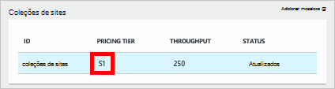
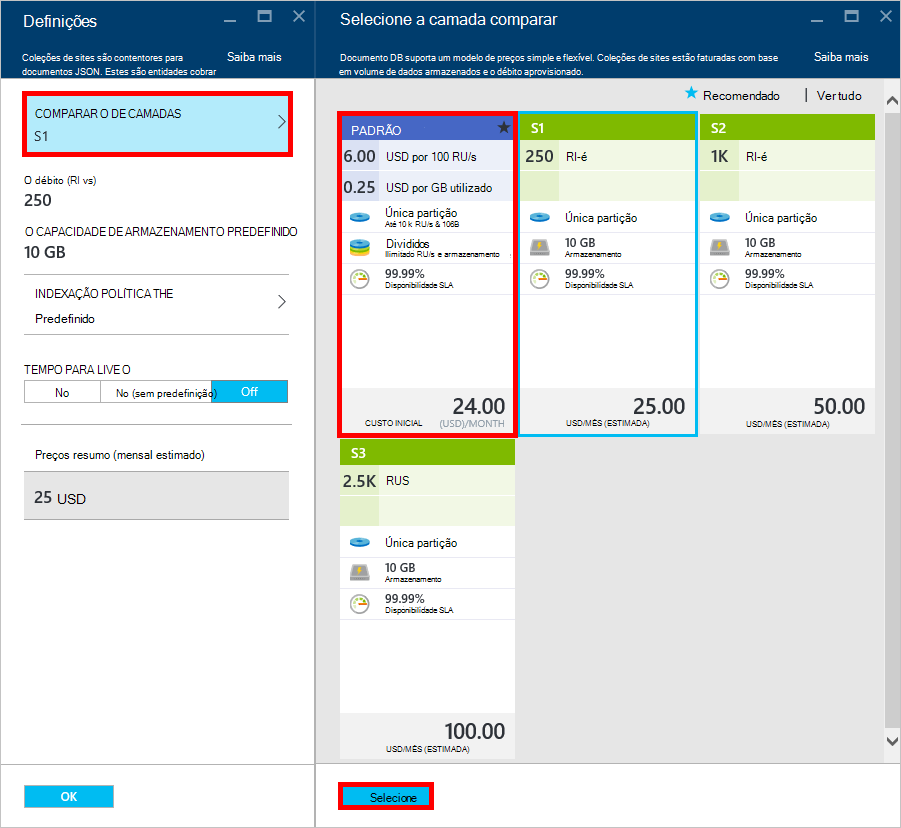
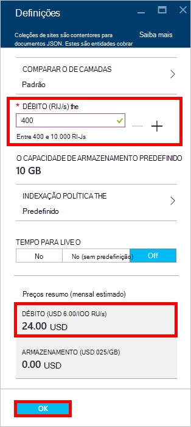
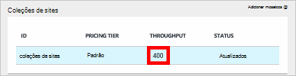

<properties 
    pageTitle="Supercharge a sua conta DocumentDB S1 | Microsoft Azure" 
    description="Tire partido do aumento do débito na sua conta DocumentDB S1 ao efetuar algumas alterações simples no portal do Azure." 
    services="documentdb" 
    authors="mimig1" 
    manager="jhubbard" 
    editor="monicar" 
    documentationCenter=""/>

<tags 
    ms.service="documentdb" 
    ms.workload="data-services" 
    ms.tgt_pltfrm="na" 
    ms.devlang="na" 
    ms.topic="article" 
    ms.date="08/25/2016" 
    ms.author="mimig"/>

# Supercharge a sua conta DocumentDB

Siga estes passos para tirar partido do aumento do débito para a sua conta Azure DocumentDB S1. Com pouco ou sem custo adicional, pode aumentar o débito da sua conta do S1 existente a partir de 250 [RU/s](documentdb-request-units.md) para 400 RU/s ou mais!  

> [AZURE.VIDEO changedocumentdbcollectionperformance]

## Alterar para desempenho definidos pelo utilizador no portal do Azure

1. No seu browser, navegue para o [**Azure portal**](https://portal.azure.com). 
2. Clique em **Procurar** -> **DocumentDB (NoSQL)**, em seguida, selecione a conta de DocumentDB a modificar.   
3. No lens **bases de dados** , selecione a base de dados para modificar e, em seguida, na pá **base de dados** , selecione a coleção com a camada comparar S1.

      

4. Na pá **coleções de sites** , clique em **mais**e, em seguida, clique em **Definições**.   
5. Na pá **Definições** , clique em **Níveis de preços** e repare que a estimativa de custo mensal para cada um dos planos é apresentada. Na pá **Escolher as preços de camadas** , clique em **padrão**e, em seguida, clique em **Selecionar** para guardar a alteração.

      

6. Novamente na pá **Definições** , a **Camada preços** é alterado para **padrão** e é apresentada a caixa de **débito (RU/s)** com um valor predefinido de 400. Clique em **OK** para guardar as alterações. 

    > [AZURE.NOTE] Pode definir o débito entre 400 e 10.000 [Pedir unidades](../articles/documentdb/documentdb-request-units.md)/second (RU/s). O **Resumo preços** na parte inferior da página atualiza automaticamente para fornecer uma estimativa do custo mensal.
    
    

8. Novamente no pá **base de dados** , pode verificar o débito sobrecarregado da coleção de. 

    

Para obter mais informações sobre as alterações relacionados com débito predefinido e definidos pelo utilizador, consulte a mensagem do blogue [DocumentDB: tudo o que precisa de saber sobre como utilizar as novas opções de definição de preços](https://azure.microsoft.com/blog/documentdb-use-the-new-pricing-options-on-your-existing-collections/).

## Próximos passos

Se determinar que precisa de mais débito (maior que 10.000 RU/s) ou mais armazenamento (maior que 10GB) pode criar uma coleção de com partições. Para criar uma coleção de com partições, consulte o artigo [criar uma coleção de](documentdb-create-collection.md).