<properties
    pageTitle="Explorador DocumentDB do documento, para ver JSON | Microsoft Azure"
    description="Saiba mais sobre o Explorador de documento DocumentDB, uma ferramenta de Azure Portal para ver JSON, editar, criar e carregar documentos JSON com DocumentDB, uma base de dados do documento NoSQL."
        keywords="Ver json"
    services="documentdb"
    authors="kirillg"
    manager="jhubbard"
    editor="monicar"
    documentationCenter=""/>

<tags
    ms.service="documentdb"
    ms.workload="data-services"
    ms.tgt_pltfrm="na"
    ms.devlang="na"
    ms.topic="article"
    ms.date="08/30/2016"
    ms.author="kirillg"/>

# Ver, editar, criar e carregar documentos JSON através do Explorador do documento DocumentDB

Este artigo fornece uma descrição geral do Explorador de documento do [Microsoft Azure DocumentDB](https://azure.microsoft.com/services/documentdb/) , uma ferramenta de portal Azure que permite-lhe ver, editar, criar, carregar e filtrar documentos JSON com DocumentDB. 

Tenha em atenção que o Explorador de documentos não está activado DocumentDB contas com o suporte de protocolo para MongoDB. Esta página será atualizada quando esta funcionalidade está ativada.

## Iniciação Explorador de documentos

1. No portal do Azure, no Jumpbar, clique em **DocumentDB (NoSQL)**. Se **DocumentDB (NoSQL)** não estiver visível, clique em **Mais serviços** e, em seguida, clique em **DocumentDB (NoSQL)**.

2. Selecione o nome da conta. 

3. No menu do recurso, clique em **Explorador de documentos**. 
 
    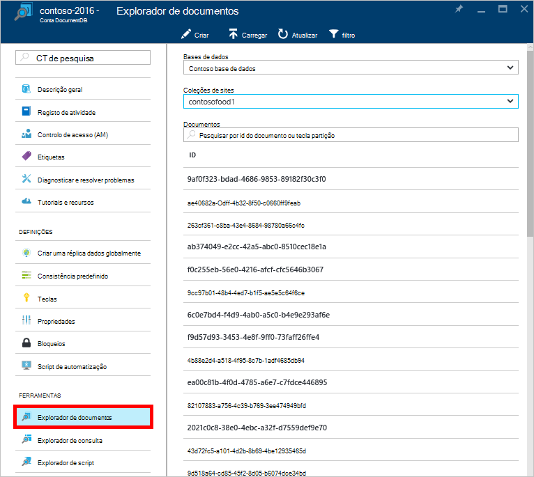

    Pá **Explorador de documentos** , listas de pendentes **bases de dados** e **coleções de sites** estão povoadas previamente consoante o contexto em que iniciou o Explorador de documentos. 

## Criar um documento

1. [Iniciação Explorador de documentos](#launch-document-explorer).

2. Na pá **Explorador de documentos** , clique em **Criar documento**. 

    Um fragmento JSON mínimo é fornecido em pá o **documento** .

    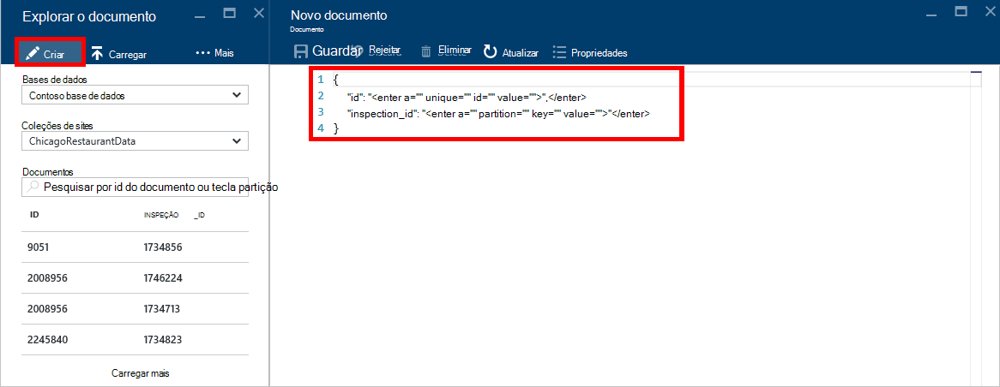

2. Na pá **documento** , escreva ou cole o conteúdo do documento JSON que pretende criar e, em seguida, clique em **Guardar** para consolidar o seu documento para a base de dados e colecção especificada no pá **Explorador de documentos** .

    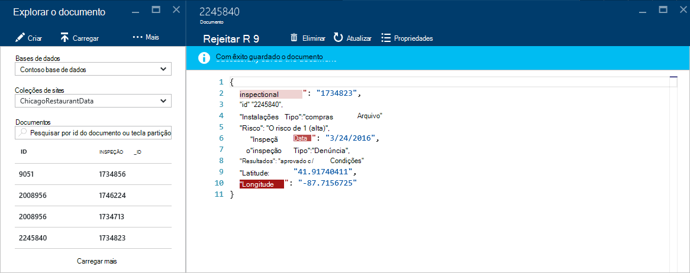

    > [AZURE.NOTE] Se não fornecer uma propriedade de "id", em seguida, Explorador de documentos adiciona automaticamente uma propriedade de id e gera um GUID como o valor de id.

    Se já tiver ficheiros de dados a partir do JSON, MongoDB, SQL Server, ficheiros CSV, armazenamento de tabela do Azure, Amazon DynamoDB, HBase, ou de outras coleções de DocumentDB, pode utilizar da DocumentDB [ferramenta de migração de dados](documentdb-import-data.md) para importar rapidamente os seus dados.

## Editar um documento

1. [Iniciação Explorador de documentos](#launch-document-explorer).

2. Para editar um documento existente, selecione-a na pá **Explorador de documentos** , editar o documento na pá **documento** e, em seguida, clique em **Guardar**.

    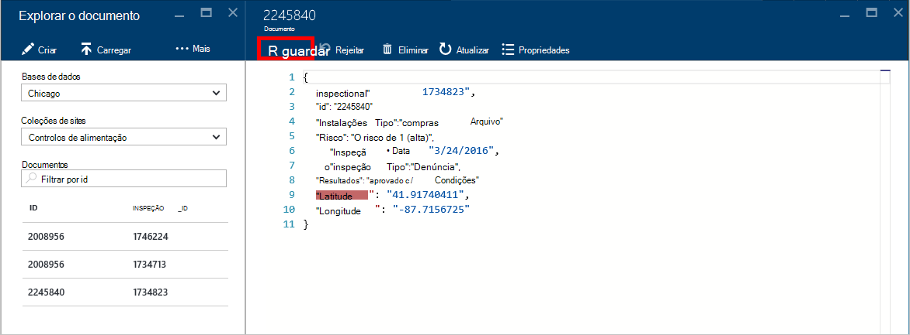

    Se está a editar um documento e decidir que pretende eliminar o conjunto atual de edições, clique em **Rejeitar** o **documento** pá simplesmente, confirmar a ação de eliminar e o estado anterior do documento é carregado novamente.

    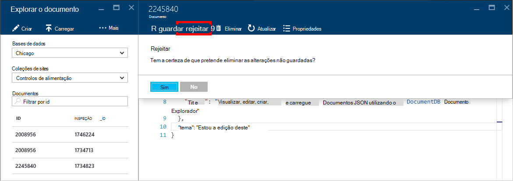

## Eliminar um documento

1. [Iniciação Explorador de documentos](#launch-document-explorer).

2. Selecione o documento no **Explorador de documentos**, clique em **Eliminar**e, em seguida, confirme a eliminação. Depois de confirmar, o documento imediatamente é removido da lista de Explorador de documentos.

    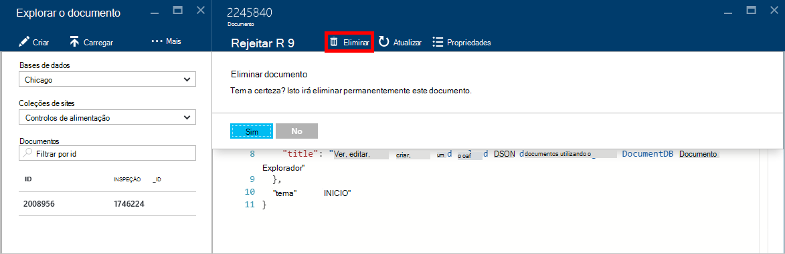

## Trabalhar com documentos JSON

Explorador de documentos valida que qualquer documento novo ou editado contém JSON válida.  Pode até mesmo ver erros JSON ao pairar o rato sobre a secção incorreta para obter detalhes sobre o erro de validação.

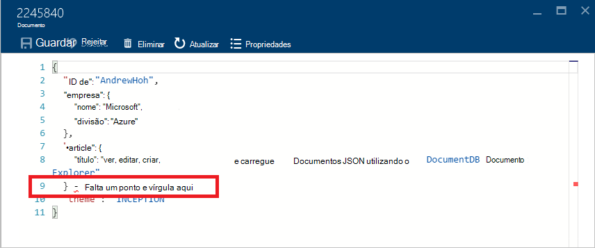

Para além disso, Explorer documento impede que guardar um documento com conteúdo JSON inválido.

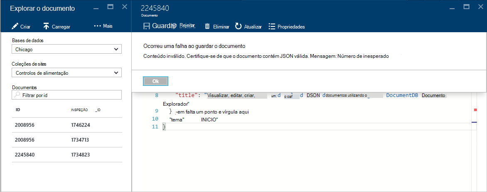

Por fim, documento Explorer permite-lhe ver facilmente as propriedades do sistema do documento atualmente carregado ao clicar no comando **Propriedades** .

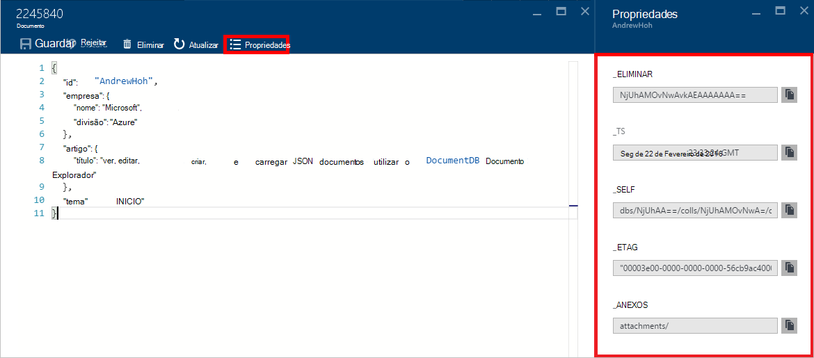

> [AZURE.NOTE] A propriedade carimbo de data/hora (_ts) internamente é representada como o tempo de época, mas o Explorador do documento apresenta o valor num formato legível GMT.

## Filtrar documentos
Explorador de documentos suporta um número de opções de navegação e definições avançadas.

Por predefinição, o Explorador de documentos carrega para os primeiros 100 documentos na coleção de selecionada, os respetivos criada por datas, da mais antiga para o mais recente.  Pode carregar documentos adicionais (em lotes de 100) ao selecionar a opção **carregar mais** na parte inferior da pá Explorador de documentos. Pode escolher quais os documentos para carregar através do comando de **filtro** .

1. [Iniciação Explorador de documentos](#launch-document-explorer).

2. Na parte superior da pá **Explorador de documentos** , clique em **Filtrar**.  

    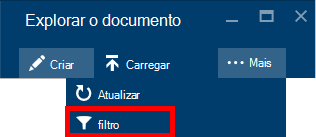
  
3.  As definições de filtro apresentadas abaixo da barra de comando. Nas definições de filtro, fornecer uma cláusula WHERE e/ou uma cláusula ORDER BY e, em seguida, clique em **Filtrar**.

    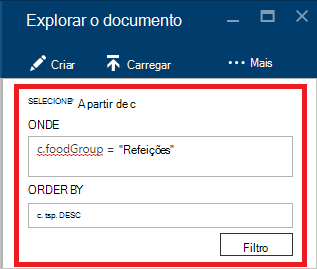

    Documento Explorer atualiza automaticamente os resultados com documentos que correspondem a consulta de filtro. Leia mais sobre a gramática DocumentDB SQL na [consulta SQL e sintaxe SQL](documentdb-sql-query.md) artigo ou imprimir uma cópia da [consulta SQL fazer batota folha](documentdb-sql-query-cheat-sheet.md).

    As caixas de lista pendente de **base de dados** e **coleções de sites** podem ser utilizadas para alterar facilmente a coleção da partir do qual documentos estão atualmente a ser visualizados sem ter de fechar e voltar a Iniciar Explorador de documentos.  

    Explorador de documentos também suporta a filtragem o conjunto de documentos carregado atualmente pela sua propriedade de id.  Basta escreva na filtrar documentos por caixa id.

    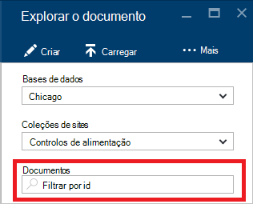

    Os resultados no Explorador do documento são filtradas lista com base em critérios fornecidos.

    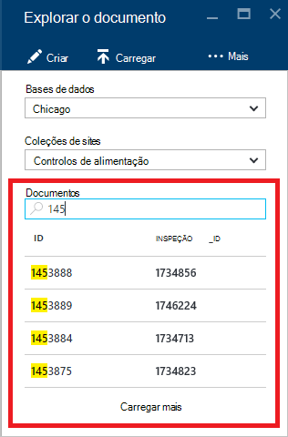

    > [AZURE.IMPORTANT] Os Explorador de documentos filtro funcionalidade únicos filtros a partir do ***atualmente*** carregadas conjunto de documentos e não efetua uma consulta contra a coleção de atualmente selecionada.

4. Para atualizar a lista de documentos carregados pelo Explorador de documentos, clique em **Atualizar** na parte superior da pá.

    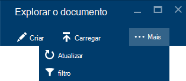

## Documentos de adição em volume

Explorador de documentos suporta ingestão em volume de um ou mais JSON documentos existentes, até 100 ficheiros JSON por carregamento de operação.  

1. [Iniciação Explorador de documentos](#launch-document-explorer).

2. Para iniciar o processo de carregamento, clique em **Carregar documento**.

    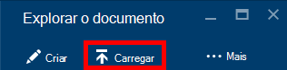

    É aberta a pá **Carregar documento** . 

2. Clique no botão Procurar para abrir uma janela Explorador de ficheiros, selecione um ou mais documentos JSON para carregar e, em seguida, clique em **Abrir**.

    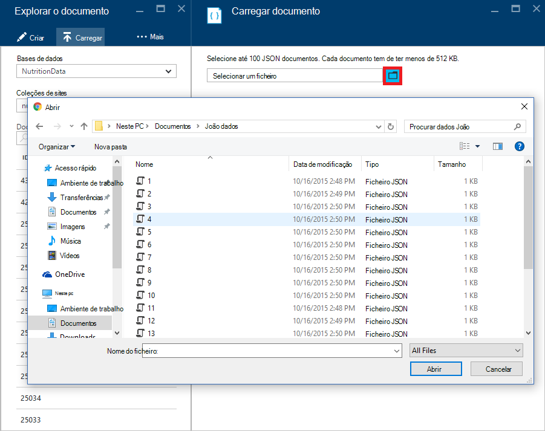

    > [AZURE.NOTE] Explorador de documentos atualmente suporta até 100 JSON documentos por carregamento individuais de operação.

3. Quando estiver satisfeito com a seleção, clique no botão **carregar** .  Os documentos são automaticamente adicionados à grelha de Explorador de documentos e os resultados de carregamento são apresentados como o progride de operação. Falhas de importação são reportadas para ficheiros individuais.

    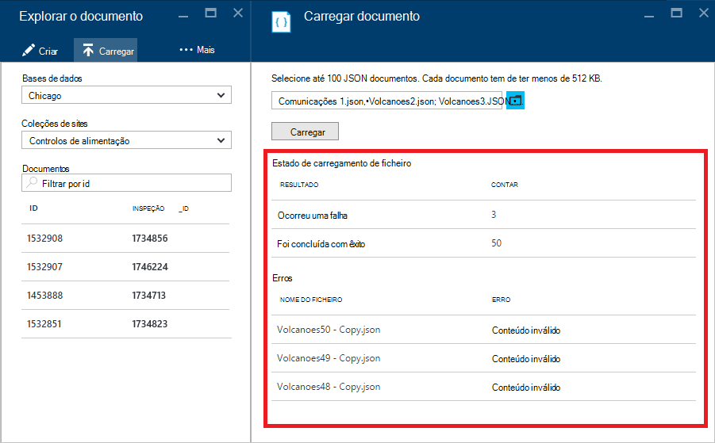

4. Uma vez concluída a operação, pode selecionar até outra documentos 100 para carregar.

## Trabalhar com documentos JSON fora do portal

No Explorador de documentos no portal do Azure é apenas uma forma de trabalhar com documentos numa DocumentDB. Também pode trabalhar com documentos com a [REST API](https://msdn.microsoft.com/library/azure/mt489082.aspx) ou o [SDK do cliente](documentdb-sdk-dotnet.md). Por exemplo, código, consulte os [exemplos de documento .NET SDK](documentdb-dotnet-samples.md#document-examples) e os [exemplos de documento Node.js SDK](documentdb-nodejs-samples.md#document-examples).

Se precisar de importar ou migrar ficheiros a partir de outra fonte (JSON ficheiros, MongoDB, SQL Server, CSV ficheiros, tabela do Azure armazenamento, Amazon DynamoDB ou HBase), pode utilizar a [ferramenta de migração de dados](documentdb-import-data.md) de DocumentDB para importar rapidamente os dados para DocumentDB.

## Resolução de problemas

**Sintoma**: Explorador de documentos devolve **nenhuns documentos que se encontram**.

**Solução**: Certifique-se de que selecionou a subscrição correta, base de dados e coleções de sites na qual os documentos foram inseridos. Além disso, verifique para se certificar de que estão a funcionar dentro as quotas de débito. Se estiver a funcionar no seu débito máximo nível e obter limitada, baixa utilização da aplicação para trabalhar com na quota de débito máximo para a coleção.

**Explicação**: O portal é uma aplicação como quaisquer outros, efetuar chamadas aos seus DocumentDB base de dados e a coleção. Se os pedidos de estão atualmente a ser limitados devido a chamadas a ser criadas a partir de uma aplicação separada, o portal pode também ser limitado, a causar recursos não seja apresentado no portal. Para resolver o problema, corrigir a causa da utilização de débito alta e, em seguida, atualize a pá portal. Informações sobre como medir e a utilização de débito inferior podem ser encontradas na secção de [débito](documentdb-performance-tips.md#throughput) do artigo [sugestões sobre o desempenho](documentdb-performance-tips.md) .

## Próximos passos

Para saber mais sobre a gramática DocumentDB SQL suportada no Explorador de documentos, consulte o artigo [consulta SQL e sintaxe SQL](documentdb-sql-query.md) ou imprimir a [consulta SQL fazer batota folha](documentdb-sql-query-cheat-sheet.md).

O [caminho de formação](https://azure.microsoft.com/documentation/learning-paths/documentdb/) também é um recurso útil para orientá-lo à medida que saiba mais sobre DocumentDB. 
