<properties
    pageTitle="DocumentDB Script Explorer, um editor de JavaScript | Microsoft Azure"
    description="Saiba mais sobre o Explorador de Script DocumentDB, uma ferramenta de Azure Portal para gerir artefactos do lado do servidor de DocumentDB programação incluindo procedimentos armazenados, accionadores e as funções definidas pelo utilizador."
    keywords="editor de JavaScript"
    services="documentdb"
    authors="kirillg"
    manager="jhubbard"
    editor="monicar"
    documentationCenter=""/>

<tags
    ms.service="documentdb"
    ms.workload="data-services"
    ms.tgt_pltfrm="na"
    ms.devlang="na"
    ms.topic="article"
    ms.date="08/30/2016"
    ms.author="kirillg"/>

# Criar e executar os procedimentos armazenados, accionadores e funções definidas pelo utilizador utilizando o Explorador de Script DocumentDB

Este artigo fornece uma descrição geral do Explorador de Script do [Microsoft Azure DocumentDB](https://azure.microsoft.com/services/documentdb/) , que é um editor de JavaScript no portal do Azure permite-lhe visualizar e executar artefactos do lado do servidor de DocumentDB programação incluindo procedimentos armazenados, accionadores e as funções definidas pelo utilizador. Leia mais sobre DocumentDB programação do lado do servidor no artigo [procedimentos armazenados, accionadores de base de dados e UDFs](documentdb-programming.md) .

## Iniciar o Script Explorer

1. No portal do Azure, no Jumpbar, clique em **DocumentDB (NoSQL)**. Se **DocumentDB contas** não estiver visível, clique em **Mais serviços** e, em seguida, clique em **DocumentDB (NoSQL)**.

2. No menu de recursos, clique em **Explorador de Script**.

    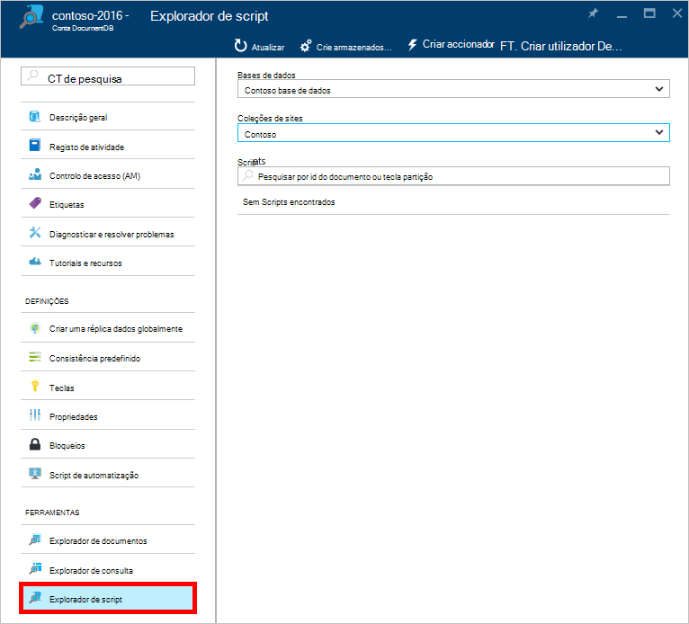
 
    As caixas de lista pendente de **base de dados** e **coleções de sites** estão povoadas previamente consoante o contexto em que que inicia o Script Explorer.  Por exemplo, se iniciação a partir de um pá de base de dados, em seguida, base de dados atual é preenchido.  Se iniciar a partir de um pá de coleções de sites, em seguida, atual é preenchidos.

4.  Utilize as caixas de lista pendente de **base de dados** e **coleções de sites** para alterar facilmente a coleção da partir do qual scripts estão atualmente a ser visualizados sem ter de fechar e voltar a iniciar Script Explorer.  

5. Script Explorer também suporta a filtragem do conjunto de scripts actualmente carregado pela sua propriedade de id.  Basta escrever na caixa de filtro e os resultados na lista de Script Explorer são filtrados com base em critérios fornecidos.

    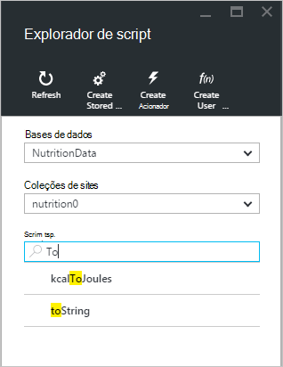

    > [AZURE.IMPORTANT] O Explorador de Script filtrar únicos filtros de funcionalidade a partir do conjunto ***atualmente*** carregado de scripts e não atualizar automaticamente a coleção de atualmente selecionada.

5. Para atualizar a lista de scripts carregados pelo Script Explorer, basta clicar no comando **Actualizar** no topo da pá.

    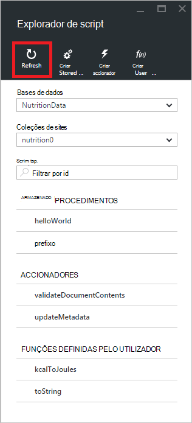

## Criar, ver e editar os procedimentos armazenados, accionadores e as funções definidas pelo utilizador

Script Explorer permite-lhe para facilmente efectuar operações CRUD artefactos programação do lado do servidor DocumentDB.  

- Para criar um script, simplesmente clique aplicáveis criar comando do Explorador de script, fornecer um id, introduza o conteúdo do script e clique em **Guardar**.

    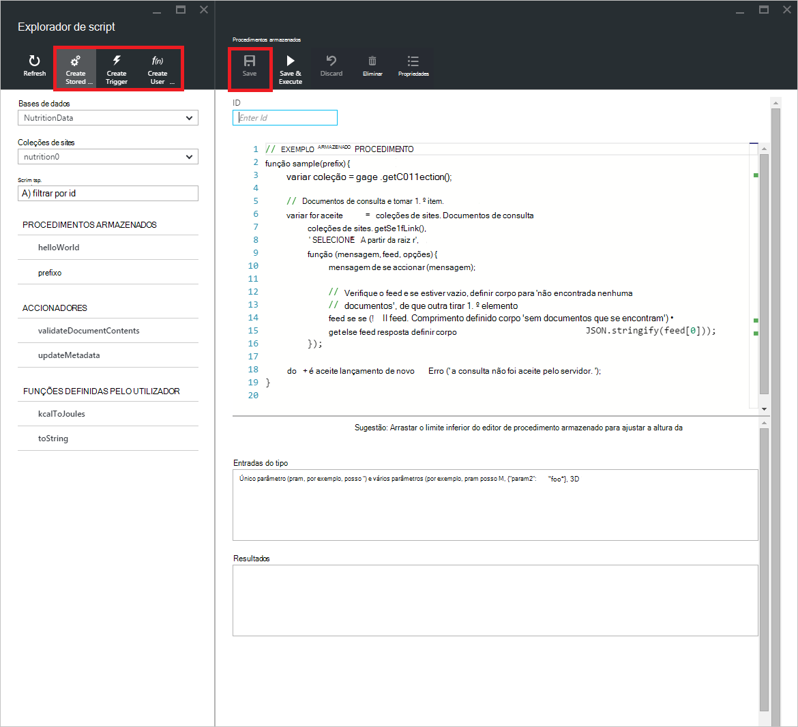

- Ao criar um accionador, também tem de especificar a operação de tipo e o acionador de accionador

    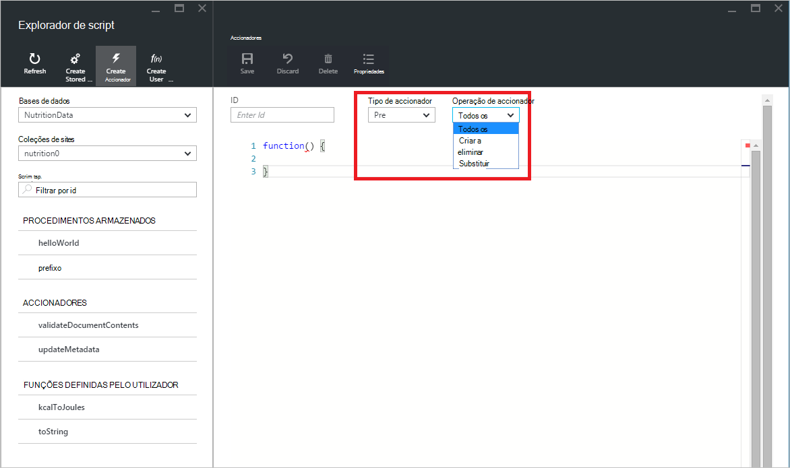

- Para ver um script, clique simplesmente o script na qual está interessado.

    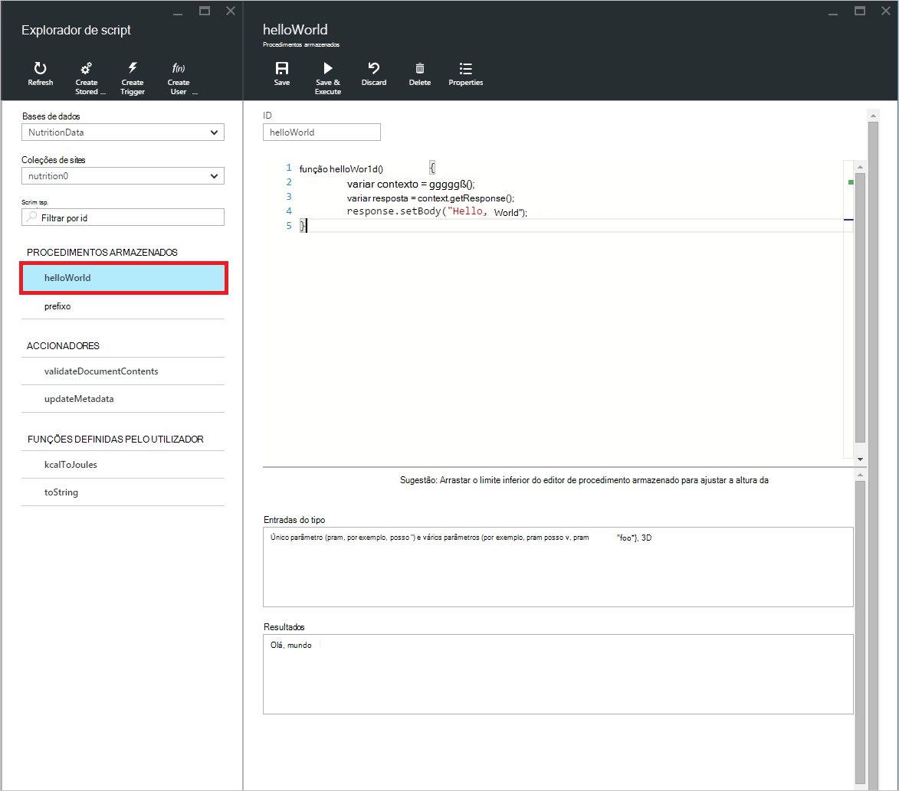

- Para editar um script, basta efetue as alterações desejadas no JavaScript editor e clique em **Guardar**.

    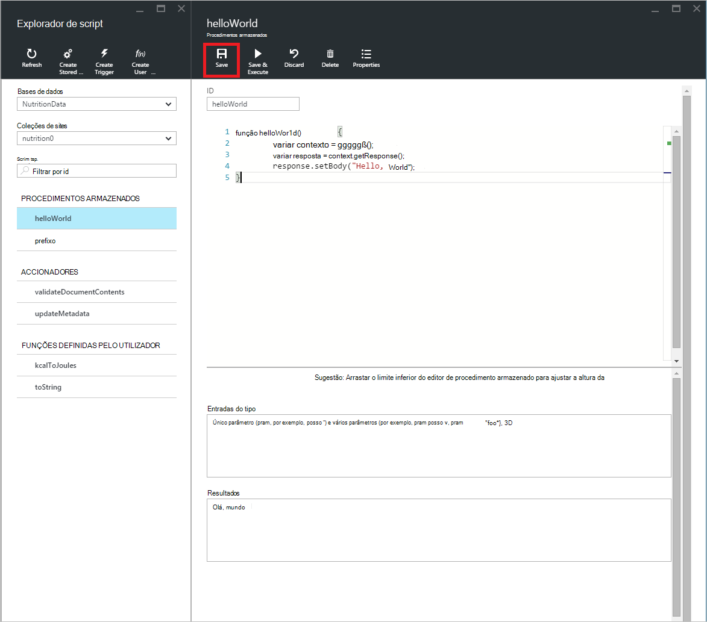

- Para eliminar quaisquer alterações pendentes para um script, basta clicar no comando **Rejeitar** .

    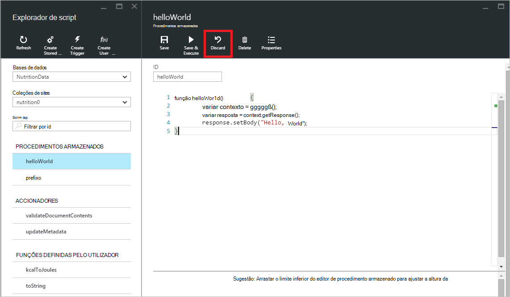

- Também o script Explorer permite-lhe ver facilmente as propriedades do sistema do script carregado ao clicar no comando **Propriedades** .

    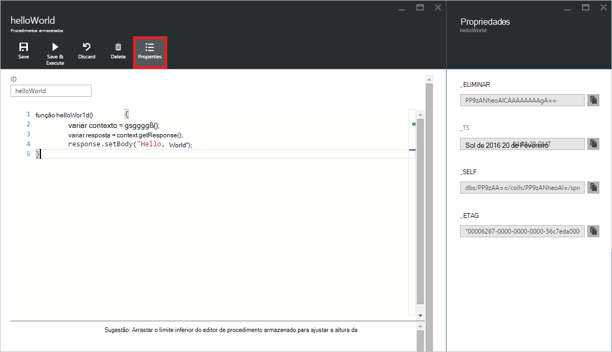

    > [AZURE.NOTE] A propriedade carimbo de data/hora (_ts) internamente é representada como o tempo de época, mas o Explorador de Script apresenta o valor num formato legível GMT.

- Para eliminar um script, selecione-o no Explorador de Script e clique no comando **Eliminar** .

    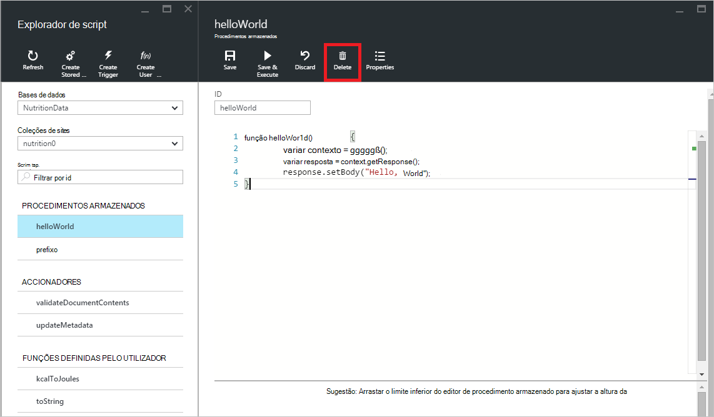

- Confirmar a ação de eliminar ao clicar em **Sim** ou cancelar a ação de eliminar ao clicar em **não**.

    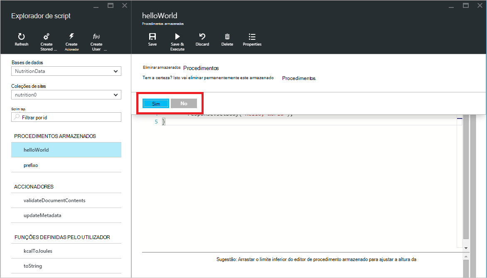

## Executar um procedimento armazenado

> [AZURE.WARNING] Executar procedimentos armazenados no Explorador de Script ainda não é suportada para coleções de divididos do lado do servidor. Para mais informações, visite [divisão e de dimensionamento no DocumentDB](documentdb-partition-data.md).

Script Explorer permite-lhe executar procedimentos armazenados do lado do servidor a partir do portal Azure.

- Ao abrir um novo pá de procedimento criar armazenados, fornecido um script predefinido (*prefixo*). Para executar o script *prefixo* ou o seu próprio script, adicione um *id* e *entradas do tipo*. Para obter procedimentos armazenados que aceitem vários parâmetros, todas as entradas tem de ser dentro de uma matriz (por exemplo, *["foo", "barra"]*).

    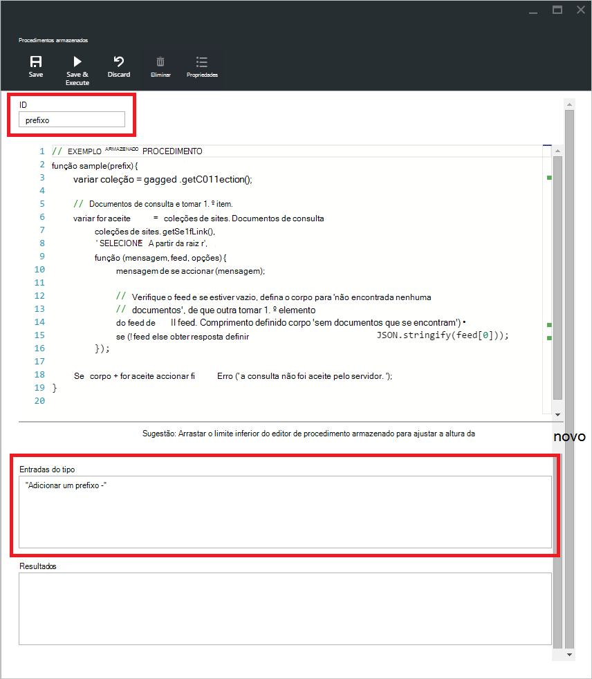

- Para executar um procedimento armazenado, clique no comando **Guardar e executar** no painel de editor de script.

    > [AZURE.NOTE] O comando **Guardar e executar** irá guardar a sua procedimento armazenado antes de executar, que significa que irá substituir a versão guardada anteriormente do procedimento armazenado.

- Bem sucedida execuções do procedimento armazenado vai ter um estado *com êxito guardado e executados o procedimento armazenado* e dos resultados devolvidos serão preenchidos no painel de *resultados* .

    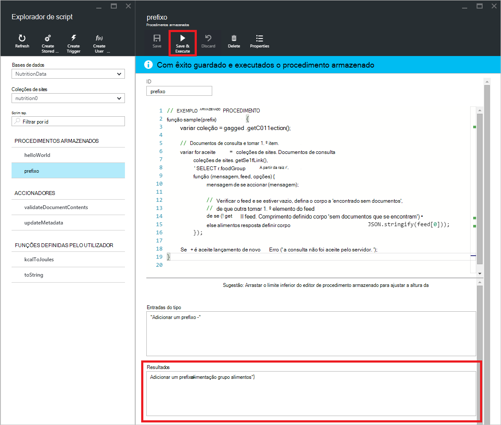

- Se a execução do encontrar um erro, o erro será preenchido no painel de *resultados* .

    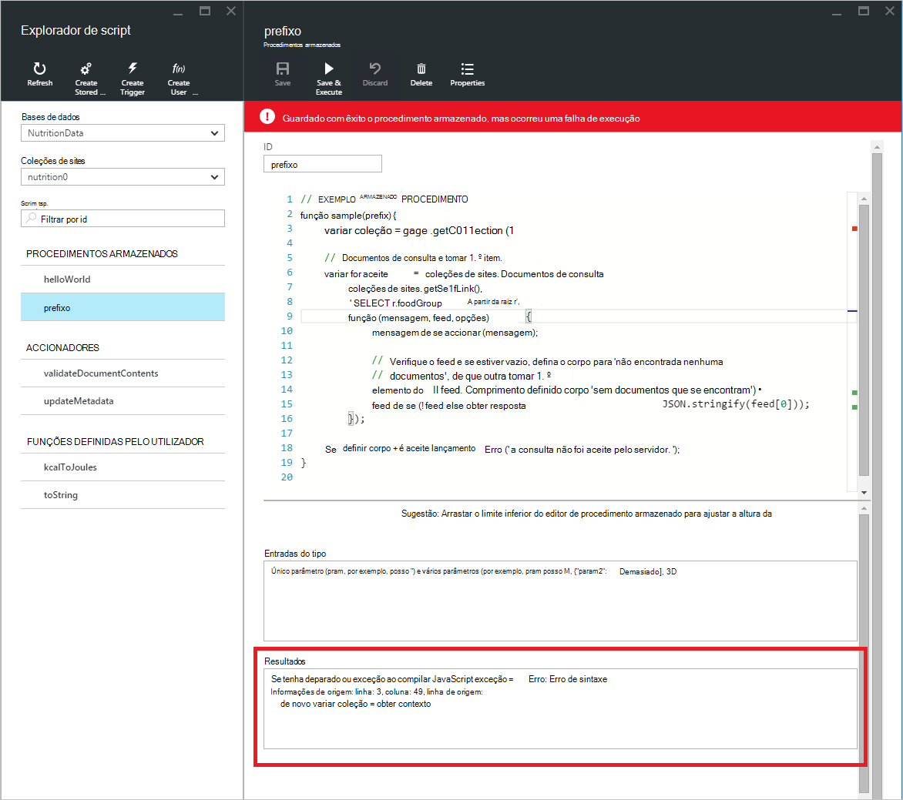

## Trabalhar com scripts fora do portal

O Explorador de Script no portal do Azure é apenas uma forma de trabalhar com os procedimentos armazenados, accionadores e funções definidas pelo utilizador no DocumentDB. Também pode trabalhar com scripts utilizando o REST API e o [cliente SDK](documentdb-sdk-dotnet.md). A documentação de REST API inclui exemplos para trabalhar com [utilizando o resto de procedimentos armazenados](https://msdn.microsoft.com/library/azure/mt489092.aspx), [utilizando o resto de funções definidas pelo utilizador](https://msdn.microsoft.com/library/azure/dn781481.aspx)e [utilizar o accionadores restantes](https://msdn.microsoft.com/library/azure/mt489116.aspx). Amostras também estão disponível que mostra como [trabalhar com os scripts utilizando c#](documentdb-dotnet-samples.md#server-side-programming-examples) e [trabalhar com scripts utilizando Node.js](documentdb-nodejs-samples.md#server-side-programming-examples).

## Próximos passos

Saiba mais sobre DocumentDB programação do lado do servidor no artigo [procedimentos armazenados, accionadores de base de dados e UDFs](documentdb-programming.md) .

O [caminho de formação](https://azure.microsoft.com/documentation/learning-paths/documentdb/) também é um recurso útil para orientá-lo à medida que saiba mais sobre DocumentDB.  
