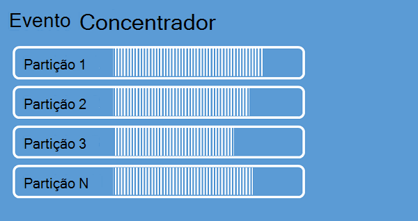

<properties 
    pageTitle="Descrição geral de evento Azure concentradores | Microsoft Azure"
    description="Introdução e descrição geral do Azure evento concentradores."
    services="event-hubs"
    documentationCenter="na"
    authors="sethmanheim"
    manager="timlt"
    editor="" />
<tags 
    ms.service="event-hubs"
    ms.devlang="na"
    ms.topic="get-started-article"
    ms.tgt_pltfrm="na"
    ms.workload="na"
    ms.date="08/16/2016"
    ms.author="sethm" />

# Descrição geral de evento concentradores Azure

A intenção de muitas soluções modernas para fornecer cliente ajustável experiências ou para melhorar os produtos através de comentários contínuo e telemetria automatizada. Essas soluções são são confrontadas com o desafio de como a de forma segura e fiável processar muito grandes quantidades de informações a partir de muitos fabricantes em simultâneo. Microsoft Azure evento concentradores é um serviço de plataforma geridos que fornece um foundation por incorporação de dados em grande escala numa vasta variedade de cenários. Exemplos destes cenários são comportamento de controlo em aplicações móveis, informações de tráfego de farms web, captura do evento no jogo nos jogos da consola, ou dados de telemetria recolhidas a partir do Máquinas industriais ou ligado veículos. A função comuns que pode ser reproduzido do evento concentradores no arquitecturas de solução é que-age como "porta da frente" para pipeline de evento, denominada frequentemente um *ingestor do evento*. Ingestor um evento é um componente ou serviço que encontra-se entre fabricantes de evento e consumidores de evento para separar produção de uma sequência de eventos do consumo desses eventos.

Azure evento concentradores é um evento serviço que fornece o evento e telemetria penetração na nuvem na escala grandes, com baixa latência e fiabilidade alta de processamento. Este serviço, utilizado com outros serviços descendentes, é particularmente útil no instrumentação de aplicação, processamento de experiência ou fluxo de trabalho de utilizador e cenários de Internet coisas (IoT). Evento concentradores fornece uma sequência de mensagem capacidade de processamento e apesar de um concentrador de evento é uma entidade semelhante às filas e tópicos, tem características que são muito diferentes dos mensagens empresariais tradicionais. Cenários de mensagens empresariais requerem frequentemente capacidades sofisticadas, tais como sequência, Inativas letras, suporte de transações e garantias de entrega forte, enquanto está a preocupações dominante por incorporação de evento débito alto e processamento flexibilidade para sequências de evento. Por conseguinte, capacidades de evento concentradores diferem tópicos Bus serviço em que estes estão vivamente baseados no sentido débito alto e cenários de processamento de eventos. Como tal, concentradores evento não implementar a algumas das capacidades mensagens que estão disponíveis para tópicos. Se precisar dessas funcionalidades, tópicos permanecem a melhor escolha.

É criado um concentrador de evento nível do evento concentradores espaço de nomes, semelhantes às filas Bus de serviço e tópicos. Evento concentradores utiliza AMQP e HTTP como as suas interfaces API principais. O diagrama seguinte mostra a relação entre evento concentradores e Bus de serviço.

## Descrição geral conceptual

Evento concentradores fornece mensagem transmissão através de um padrão com partições consumidor. Filas e tópicos de utilizam um modelo de [Consumidor competir](https://msdn.microsoft.com/library/dn568101.aspx) em que cada consumidor tenta ler a partir da mesma fila ou recurso. Esta concorrência para recursos finalmente resulta num complexidade e limites de escala para sequência de processamento de aplicações. Evento concentradores utiliza um padrão com partições consumidor na qual o cada consumidor lê apenas um subconjunto específico ou partição, da sequência de mensagem. Este padrão permite escala horizontal para processamento de eventos e fornece outras funcionalidades com foco da cadeia que não estão disponíveis em filas e tópicos.

### Partições

Uma partição é uma sequência ordenada de eventos que é mantida num concentrador de evento. À medida que chegam novos eventos, são adicionadas para o fim desta sequência. Uma partição pode ser considerada como "registo consolidar".

Partições retêm dados para uma hora de retenção configurado definida ao nível do concentrador de evento. Esta definição aplica-se através de todas as partições de evento concentrador. Eventos expirarem numa base de hora; Não é possível explicitamente elimine-os. Um concentrador de evento contém a partições múltiplos. Cada partição é independente e contém as suas próprias sequência de dados. Como resultado, partições com frequência crescem com taxas diferentes.

O número de partições é especificado na hora de criação de evento concentrador e tem de estar entre 2 e 32 (a predefinição é 4). As partições são mecanismos de organização de dados e mais relacionado com o grau de paralelismo descendentes exigido utilizado por outros programas que para débito concentradores do evento. Isto torna a escolha do número de partições num concentrador de evento diretamente relacionados com o número de esperar para que os leitores de em simultâneo. Após a criação de concentrador de evento, não é que se pode modificar; a contagem de partição deverá tomar em consideração este número em termos de escala esperado a longo prazo. Pode aumentar o limite de 32 partição ao contactar a equipa de Bus de serviço.

Enquanto a partições são identificáveis e podem ser enviadas para diretamente, é melhor evitar enviar dados a partições específicas. Em vez disso, pode utilizar construções de nível superiores introduzidas nas secções [publisher evento](#event-publisher) e a [Política do Publisher](#capacity-and-security) .

No contexto da concentradores de evento, mensagens são referidas como *dados de evento*. Dados do evento contém o corpo do evento, um definidas pelo utilizador saco propriedade e vários metadados sobre o evento, tal como o deslocamento na partição e o número na sequência da cadeia. Partições são preenchidas com uma sequência de dados do evento.

## Publisher de evento

Qualquer entidade que envia dados ou eventos a um concentrador de evento é uma *publisher do evento*. Fabricantes de evento podem publicar eventos utilizando HTTPS ou AMQP 1.0. Fabricantes de evento utilizam um token de assinatura partilhadas do Access (SA) para se identifiquem a um concentrador de evento e pode ter uma identidade exclusiva ou utilizar um token de SA comuns, consoante os requisitos do cenário.

Para mais informações sobre como trabalhar com SA, consulte o artigo [Partilhado autenticação de assinatura do acesso com Bus de serviço](../service-bus-messaging/service-bus-shared-access-signature-authentication.md).

### Tarefas comuns do publisher

Esta secção descreve tarefas comuns para fabricantes de evento.

#### Adquirir um token de SA

Assinatura de acesso partilhado (SA) é mecanismo de autenticação para concentradores do evento. Serviço Bus disponibiliza políticas de SA no espaço de nomes e nível de evento concentrador. Um token de SA é gerado a partir de uma chave de SA e é um hash SHA de um codificação de URL, num formato específico. Serviço Bus utilizando o nome da chave (política) e o token, pode gerar o hash e assim autenticar o remetente. Normalmente, tokens de SA para fabricantes de evento são criados com privilégios num concentrador de evento específico apenas **Enviar** . Este mecanismo URL token SA é a base para a identificação do publisher introduzida na política do publisher. Para mais informações sobre como trabalhar com SA, consulte o artigo [Partilhado autenticação de assinatura do acesso com Bus de serviço](../service-bus-messaging/service-bus-shared-access-signature-authentication.md).

#### Um evento de publicação

Pode publicar um evento através de AMQP 1.0 ou HTTPS. Serviço Bus fornece uma classe [EventHubClient](https://msdn.microsoft.com/library/microsoft.servicebus.messaging.eventhubclient.aspx) para eventos de publicação a um concentrador de evento a partir dos clientes .NET. Para outras plataformas e runtimes, pode utilizar qualquer cliente AMQP 1.0, tal como [Apache Qpid](http://qpid.apache.org/). Pode publicar eventos individualmente ou enviadas em batches. Uma única publicação (instância de dados de evento) tem um limite de 256KB, independentemente de se tratar de um único evento ou um lote de. Publicar eventos maiores do que isto resulta num erro. É uma melhor prática para fabricantes para estar a par da partições dentro do concentrador de evento e para especificar apenas uma *partição chave* (introduzido na próxima secção), ou a identidade através do seu token SA.

A opção para utilizar AMQP ou HTTPS é específica para o cenário de utilização. AMQP requer a criação de um socket bidireccional persistente além de transporte de segurança de nível (TLS) ou SSL/TLS. Isto pode ser uma operação de dispendiosa em termos de tráfego de rede, mas só acontece no início de uma sessão AMQP. HTTPS tem uma sobrecarga inicial inferior, mas exige SSL adicional de custos gerais para cada pedido. Para fabricantes quem frequentemente publicar eventos, AMQP oferece significativas reduções de desempenho, latência e débito.

### Tecla de partição

Uma chave de partição é um valor que é utilizado para mapear dados recebidos de evento para a partições específicas para fins de organização de dados. A chave de partição é um valor fornecido remetente passado a um concentrador de evento. Esta é processada através de uma função hashing estática, o resultado que cria a atribuição de partição. Se não especificar uma chave de partição quando um evento de publicação, uma atribuição de robin Arred é utilizada. Ao utilizar teclas partição, o publicador de evento só está deverá ter em consideração da sua chave de partição, não a partições à qual os eventos são publicados. Este desacoplamento da chave e partição isola o remetente de ser necessário especificá-las saber muito sobre o processamento descendentes e armazenamento dos eventos. Chaves de partição são importantes para organizar dados de transformação descendentes, mas são bastante não relacionadas a partições próprios. Um por dispositivo ou utilizador exclusivo identidade especificidades de uma chave de partição bom, mas outros atributos como geografia também podem ser utilizado para agrupar os eventos relacionados numa única partição. A imagem seguinte mostra os remetentes de evento utilizar teclas de partição para afixar a partições.

Evento concentradores garante que todos e quaisquer eventos que partilha o mesmo valor de chave partição são entregues por ordem e para a mesma partição. Importante, se chaves de partição forem utilizadas com as políticas de publisher, descritas na secção seguinte, em seguida, a identidade do publicador e o valor da chave de partição tem de corresponder. Caso contrário, ocorre um erro.

### Consumidor de eventos

Qualquer entidade que lê dados de evento a partir de um concentrador de evento é um consumidor de eventos. Todos os consumidores de evento a sequência de evento a partições num grupo de consumidor de leitura. Cada partição deve ter apenas uma leitor ativa cada vez. Todos os consumidores de evento concentradores ligar via a sessão AMQP 1.0, na qual os eventos são entregues à medida que ficam disponíveis. O cliente não é necessário pesquisar por disponibilidade dos dados.

#### Grupos do consumidor

O mecanismo publicar/subscrever de evento concentradores está ativado através dos grupos do consumidor. Um grupo do consumidor é uma vista (estado, posição ou deslocamento) de um concentrador de evento inteira. Ativar de grupos do consumidor várias aplicações consome a cada tem uma vista separada do fluxo de evento e ler a sequência de forma independente ao seu ritmo e com os seus próprios desvios. Numa sequência de arquitectura de processamento, cada aplicação descendentes equivale a um grupo do consumidor. Se quiser escrever os dados de evento ao armazenamento a longo prazo, em seguida, nessa aplicação sénior de armazenamento é um grupo de consumidor. Processamento de evento complexa é executado por grupo outro, separar consumidor. Apenas pode aceder a partições através de um grupo do consumidor. Há sempre um grupo do consumidor predefinido num concentrador de evento e, pode criar até 20 consumidor grupos para uma camada padrão concentrador de evento.

Seguem-se exemplos da Convenção consumidor grupo URI:

    //<my namespace>.servicebus.windows.net/<event hub name>/<Consumer Group #1>
    //<my namespace>.servicebus.windows.net/<event hub name>/<Consumer Group #2>

A imagem seguinte mostra os consumidores de evento dentro de grupos do consumidor.

#### Sequência de Advance desloca

Um valor de deslocamento é a posição de um evento dentro de uma partição. Poderá pensar um desvio como um cursor de lado do cliente. O desvio é um byte numeração do evento. Permite que um evento consumidor (leitor) especificar um ponto de evento a sequência a partir do qual pretende começar a ler eventos. Pode especificar o deslocamento como um carimbo de data/hora ou como um valor de deslocamento. Os consumidores são responsáveis para armazenar os seus próprios valores de desvio fora o serviço de evento concentradores.

Dentro de uma partição, cada evento inclui um valor de deslocamento. Este deslocamento é utilizado pelos consumidores para mostrar a localização na sequência de evento para uma determinada partição. Desvios podem ser transmitidos para o concentrador de evento como um número ou como um valor de data/hora quando se liga um leitor.

#### Pontos de verificação

*Pontos de verificação* é um processo pelo qual os leitores de marca ou consolidar a sua posição se numa sequência de evento partição. Pontos de verificação são responsabilidade do consumidor e ocorre numa base por partição dentro de um grupo do consumidor. Isto significa que para cada grupo consumidor, cada leitor partição deve manter um registo da posição atual de evento transmitir em fluxo e pode informá-o serviço quando considera o fluxo de dados completa. Se desliga de um leitor de uma partição, quando reestabelece ligação-começa a ler no ponto de verificação que foram submetido anteriormente pelo leitor último dessa partição nesse grupo consumidor. Quando se liga o leitor, transmite este deslocamento ao concentrador de evento para especificar a localização onde pretende começar a ler. Desta forma, pode utilizar pontos de verificação para ambos os eventos de marcar como "concluído" por aplicações descendentes e para fornecer RDP trabalho uma activação pós-falha entre os leitores a executar o em computadores diferentes. Uma vez que os dados do evento são mantidos para o intervalo de retenção especificado no momento que é criado o concentrador de evento, é possível regressar ao dados mais antigos ao especificar um desvio inferior a partir deste processo de pontos de verificação. Este mecanismo, através de pontos de verificação permite activação pós-falha RDP e reprodução da cadeia de evento controlada.

#### Tarefas comuns do consumidor

Esta secção descreve tarefas comuns para os consumidores de evento concentradores evento ou leitores. Todos os consumidores de evento concentradores ligar via AMQP 1.0. AMQP 1.0 é uma sessão e canal de comunicação bidirecional deverá ter em consideração estado. Cada partição tem uma sessão de ligação AMQP 1.0 que facilita a transporte dos eventos separados por partição.

##### Ligar a uma partição

Para poder consumir eventos a partir de um concentrador de evento, um consumidor tem de ligar a uma partição. Tal como mencionado anteriormente, sempre é aceder a partições através de um grupo do consumidor. Como parte do modelo com partições consumidor, apenas um único leitor deve estar activo numa partição em qualquer momento dentro de um grupo do consumidor. É recomendado comuns ao ligar diretamente a partições para utilizar um mecanismo locação para coordenar ligações de leitor a partições específicas. Desta forma, é possível para todas as partições num grupo consumidor de ter apenas uma leitor ativo. Gerir a posição na sequência de um leitor de é uma tarefa importante que é obtida através de pontos de verificação. Esta funcionalidade é simplificada utilizando a classe de [EventProcessorHost](https://msdn.microsoft.com/library/microsoft.servicebus.messaging.eventprocessorhost.aspx) para clientes do .NET. [EventProcessorHost](https://msdn.microsoft.com/library/microsoft.servicebus.messaging.eventprocessorhost.aspx) é um agente do consumidor inteligente e é descrito na secção seguinte.

##### Eventos de leitura

Depois de uma sessão de AMQP 1.0 e a ligação é aberto para uma partição específica, eventos são entregues para o cliente AMQP 1.0 pelo serviço concentradores do evento. Este mecanismo de entrega permite débito superior e inferior latência que com base em solicitação mecanismos como HTTP GET. À medida que eventos forem enviados para o cliente, cada instância de dados do evento contém metadados importantes, como o número de deslocamento e a sequência que são utilizadas para facilitar a pontos de verificação na sequência de evento.

É da sua responsabilidade para gerir este deslocamento de forma a que melhor permite o progresso gerir na sequência de processamento.

## Segurança e capacidade

Evento concentradores é uma arquitetura de paralela altamente dimensionável para penetração da cadeia. Como tal, existem vários aspectos importantes a ter em consideração quando uma solução baseada em concentradores evento de dimensionamento e de redimensionamento. O primeiro destes controlos de capacidade chama-se de *unidades de débito*, descrito na secção seguinte.

### Unidades de débito

A capacidade de débito do evento concentradores é controlada pelo unidades débito. Unidades de débito previamente sejam compradas unidades da capacidade. Uma unidade de débito única inclui o seguinte:

- Penetração: Até 1 MB por segundo ou 1000 eventos por segundo.

- Saída: Até 2 MB por segundo.

Penetração está limitada à quantidade de capacidade fornecida pelo número de unidades débito compradas. Enviar dados acima este resultados montante por uma exceção "quota excedida". Este valor é um dos 1 MB por segundo ou 1000 eventos por segundo, aquele que vier primeiro. Saída não produzir optimização exceções, mas está limitada à quantidade de transferência de dados fornecida para pelas unidades compradas débito: 2 MB por segundo por unidade de débito. Se receber exceções da taxa publicação ou está à espera ver mais elevada saída que não se esqueça de verificar quantas débito unidades que comprou para o espaço de nomes na qual o concentrador de evento foi criado. Para obter mais unidades de débito, pode ajustar a definição na página **espaços de nomes** no separador **escala** no [Azure portal clássica][]. Também pode alterar esta definição utilizando as APIs Azure.

Enquanto a partições são um conceito de organização de dados, unidades de débito são puramente um conceito de capacidade. Unidades de débito são faturadas por hora e são previamente compradas. Assim que comprou, unidades de débito são faturadas durante um mínimo de uma hora. Até débito 20 unidades podem ser adquiridas para um espaço de nomes do evento concentradores e existe um limite de conta Azure de 20 unidades de débito. Estas unidades débito são partilhadas em todos os eventos concentradores num determinado espaço de nomes.

Unidades de débito configurações numa base esforço melhor e poderão não sempre estar disponíveis para compra de imediata. Se introduzir uma capacidade específica, é recomendável que comprar as unidades de débito antecedência. Se necessitar de mais de 20 unidades de débito, pode contactar o suporte Azure para comprar mais unidades de débito numa base compromisso em blocos de 20, até as unidades de 100 débito primeiros. Para além disso, também pode adquirir blocos de 100 unidades de débito.

É recomendado que equilibrar cuidadosamente unidades débito e a partições para alcançar ideal escala com concentradores do evento. Uma única partição tem uma escala máxima de unidade de um débito. O número de unidades débito deve ser menor ou igual ao número de partições num concentrador de evento.

Para obter detalhadas informação de preços, consulte o artigo [Evento concentradores preços](https://azure.microsoft.com/pricing/details/event-hubs/).

### Política do Publisher

Evento concentradores permite granular controlo sobre fabricantes de evento através *das políticas do publisher*. Publisher políticas são um conjunto de funcionalidades de tempo de execução concebido para facilitar grandes quantidades de fabricantes de evento independentes. Com as políticas do publisher, cada publisher utiliza os suas próprias Identificador exclusivo ao publicar eventos a um concentrador de evento, utilizando o mecanismo seguinte:

    //<my namespace>.servicebus.windows.net/<event hub name>/publishers/<my publisher name>

Não tem de criar nomes publisher antecedência, mas tem de corresponder o token de SA utilizado quando um evento de publicação para garantir que identidades do publisher independentes. Para mais informações sobre SA, consulte o artigo [Partilhado autenticação de assinatura do acesso com Bus de serviço](../service-bus-messaging/service-bus-shared-access-signature-authentication.md). Ao utilizar as políticas do publisher, o valor de **PartitionKey** está definido para o nome do publisher. Funcione corretamente, estes valores tem de corresponder.

## Resumo

Azure evento concentradores fornece um evento hyper escala e o serviço que pode ser utilizado para comuns aplicação e utilizador fluxo de trabalho em qualquer escala de monitorização de processamento de telemetria. A capacidade para fornecer publicar-subscreva capacidades com a latência baixa e na escala grandes, evento concentradores servir "rampa em" para os dados grande. Com e listas de revogação de identidade com base no publisher, estas capacidades estão expandidas para cenários comuns de Internet de coisas. Para obter mais informações sobre como desenvolver aplicações concentradores de evento, consulte o [Guia de programação do evento concentradores](event-hubs-programming-guide.md).

## Próximos passos

Agora que aprendeu os conceitos de evento concentradores, pode mover aos seguintes cenários:

- Começar a trabalhar com um [evento concentradores tutorial].
- Uma [aplicação de exemplo que utiliza o evento concentradores]concluída.

[Azure portal clássico]: http://manage.windowsazure.com
[Tutorial do evento concentradores]: event-hubs-csharp-ephcs-getstarted.md
[aplicação de exemplo que utiliza concentradores de evento]: https://code.msdn.microsoft.com/windowsazure/Service-Bus-Event-Hub-286fd097
