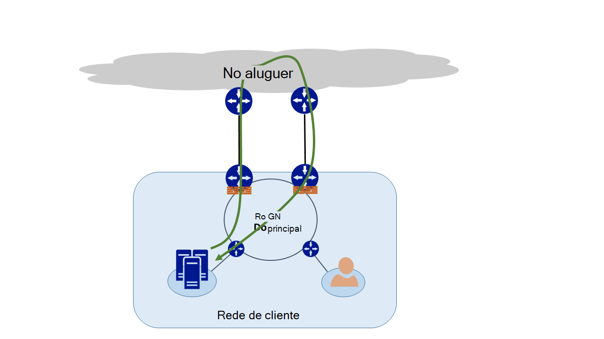
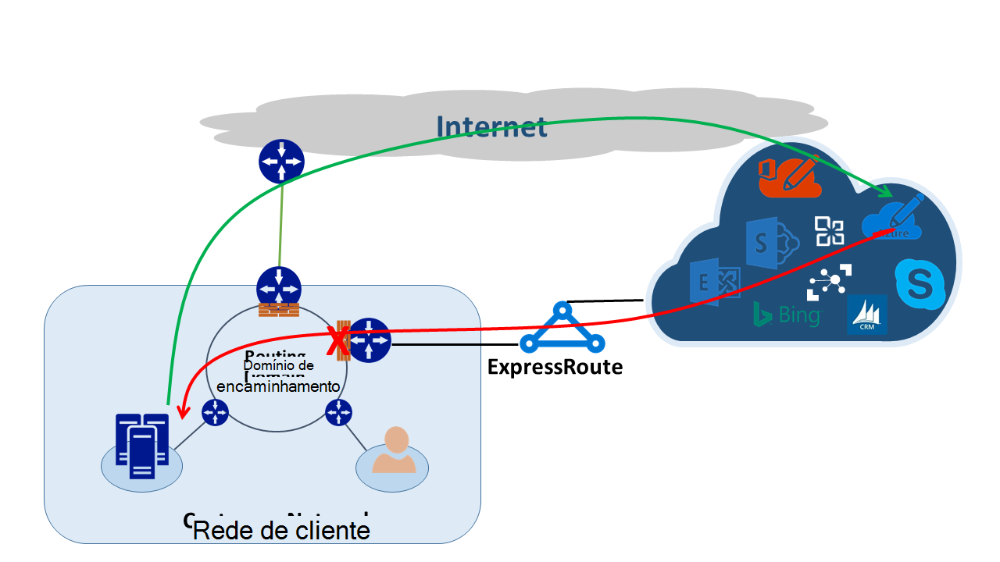
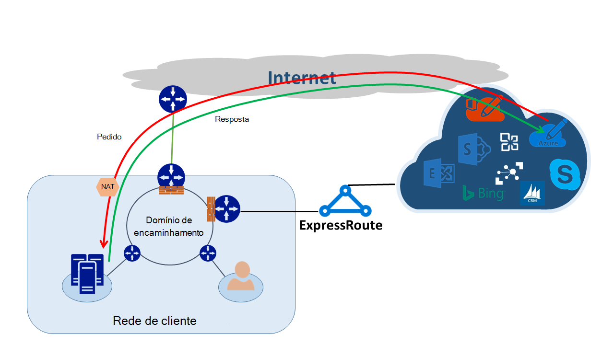

<properties
   pageTitle="Encaminhamento assimétricos | Microsoft Azure"
   description="Este artigo explica os problemas de que um cliente poderá cara com o encaminhamento assimétricos numa rede que tenha várias ligações a um destino."
   documentationCenter="na"
   services="expressroute"
   authors="osamazia"
   manager="carmonm"
   editor=""/>
<tags
   ms.service="expressroute"
   ms.devlang="na"
   ms.topic="get-started-article"
   ms.tgt_pltfrm="na"
   ms.workload="infrastructure-services"
   ms.date="10/10/2016"
   ms.author="osamazia"/>

# Encaminhamento assimétricos com vários caminhos de rede

Este artigo explica como reencaminhar e devolver o tráfego de rede pode demorar rotas diferentes quando vários caminhos estão disponíveis entre rede origem e destino.

É importante compreender os duas conceitos para compreender encaminhamento assimétricos. Uma é o efeito de diferentes caminhos de rede. O outro é como os dispositivos, tal como um firewall, manter estado. Estes tipos de dispositivos são designadas por dispositivos com estado. Uma combinação dos seguintes duas fatores cria cenários no qual a rede tráfego é ignorado através de um dispositivo com estado, uma vez que o dispositivo com estado não Deteta que teve origem tráfego com o dispositivo propriamente dita.

## Caminhos de rede

Quando uma rede empresarial tem apenas uma ligação à Internet através do seu fornecedor de serviços Internet, todo o tráfego de Internet e para viaja o caminho do mesmo. Muitas vezes, empresas compras circuitos múltiplos, como caminhos redundantes, para melhorar o tempo de utilização de rede. Quando isto acontece, é possível que o tráfego que vai fora da rede, à Internet, acede através de uma ligação e o tráfego de retorno acede através de uma ligação diferente. Isto é frequentemente conhecido como encaminhamento assimétricos. Em Encaminhamento assimétricos, o tráfego de rede inversa leva-o até um caminho diferente a partir do fluxo original.

Embora principalmente ocorra na Internet, encaminhamento assimétricos também se aplica ao outras combinações de diferentes caminhos. Aplica-se, por exemplo, tanto para um caminho de Internet e um caminho de privado Ir para o mesmo destino e para vários caminhos de privado Ir para o mesmo destino.

Cada router ao longo da forma, a partir de origem para o destino, calcula o caminho melhor para alcançar um destino. Determinar o router melhor caminho possível é baseada nos dois principais factores:

-   Encaminhamento entre a redes externas de é baseado num protocolo de encaminhamento, limite Gateway Protocol (BGP). BGP leva-o até anúncios de vizinhos e executa-los através de uma série de passos para determinar o melhor caminho para o destino pretendido. Armazena o melhor caminho na sua tabela encaminhamento.
-   O comprimento de uma máscara de sub-rede associado a uma rota influencia caminhos do encaminhamento. Se um router recebe vários anúncios para o mesmo endereço IP mas com máscaras de sub-rede diferente, o router prefere anúncio com uma máscara de sub-rede mais uma vez que é considerada uma rota mais específica.

## Dispositivos com estado

Routers observe o cabeçalho do IP de um pacote para fins de encaminhamento. Alguns dispositivos procure ainda mais aprofundados no interior do pacote. Normalmente, estes dispositivos observe Layer4 (protocolo de controlo de transmissão, ou TCP; ou User Datagram Protocol ou UDP), ou mesmo Layer7 cabeçalhos (camada de aplicação). Dispositivos de segurança ou dispositivos de otimização de largura de banda são estes tipos de dispositivos. 

Um firewall é um exemplo de um dispositivo com estado comum. Uma firewall permite ou impede um pacote para passar as suas interfaces com base em vários campos como protocolo, TCP/UDP porta e cabeçalhos de URL. Este nível de inspeção de pacotes coloca uma grossa processamento carga no dispositivo. Para melhorar o desempenho, a firewall inspeciona o primeiro pacote de um fluxo. Se permitir o pacote para continuar, mantém as informações do fluxo na sua tabela de estado. Todos os pacotes subsequentes relacionados com este fluxo são permitidos basear a inicial imagem. Um pacote que faz parte de um fluxo de existente poderá chegar a firewall. Se a firewall não tem estado anterior informações acerca do mesmo, a firewall remove o pacote.

## Assimétricos encaminhamento com ExpressRoute

Ao ligar para a Microsoft através do Azure ExpressRoute, as alterações de rede da seguinte forma:

-   Tem várias ligações para a Microsoft. Uma ligação é a sua ligação à Internet existente e a outra é através do ExpressRoute. Algumas o tráfego para a Microsoft poderá aceder através da Internet mas voltar atrás através do ExpressRoute ou vice versa.
-   Receber mais específicos endereços IP através de ExpressRoute. Por isso, para o tráfego da sua rede para a Microsoft para serviços disponibilizados através do ExpressRoute, routers preferem sempre ExpressRoute.

Para compreender o efeito de que tem estas duas alterações numa rede, considere vamos alguns cenários. Por exemplo, tem apenas uma circuito à Internet e consumir o todos os serviços Microsoft através da Internet. O tráfego da sua rede para Microsoft e voltar atrás atravessa a mesma ligação à Internet e transmite através da firewall. A firewall regista o fluxo à medida que vê o primeiro pacote e pacotes de retorno é permitido porque o fluxo de existe na tabela de estado.

Em seguida, ative ExpressRoute e consumir serviços oferecidos pelo Microsoft sobre ExpressRoute. Todos os outros serviços da Microsoft estão consumidos através da Internet. Implementar uma firewall em separado na sua extremidade que está ligada à ExpressRoute. Microsoft anuncia prefixos mais específicos à sua rede através de ExpressRoute para serviços específicos. Sua infraestrutura de encaminhamento escolhe ExpressRoute como o caminho para esses prefixos preferido. Se não são publicidade os endereços IP públicos para a Microsoft sobre ExpressRoute, Microsoft comunica com os endereços IP públicos através da Internet. Reencaminhe o tráfego da sua rede para a Microsoft utiliza ExpressRoute e o tráfego inverso da Microsoft utiliza na Internet. Quando a firewall extremidade vê um pacote de resposta para um fluxo de que não se encontrar na tabela Estado, o tráfego de retorno-remove.

Se optar por utilizar o mesmo conjunto de tradução (NAT) de endereços de rede para ExpressRoute e para a Internet, verá problemas semelhantes com os clientes na sua rede sobre endereços IP privada. Pedidos de serviços como o Windows Update aceda através da Internet, uma vez que os endereços IP para estes serviços não são anunciados através do ExpressRoute. No entanto, o tráfego de retorno regressa através do ExpressRoute. Se a Microsoft recebe um endereço IP com a mesma máscara de sub-rede a partir da Internet e ExpressRoute, prefere ExpressRoute através da Internet. Se uma firewall ou outro dispositivo com estado que está no seu limite de rede e opostas ExpressRoute não possui prévias informações sobre o fluxo,-coloca os pacotes que pertencem a esse fluxo.

## Soluções de encaminhamento assimétricas

Tem duas opções principais para resolver o problema de encaminhamento assimétricos. Uma é através de encaminhamento e o outro é utilizando NAT com base em origem (SNAT).

### Encaminhamento

Certifique-se de que os endereços IP públicos são anunciados para ligações de rede (WAN) alargada adequado. Por exemplo, se pretender utilizar na Internet para o tráfego de autenticação e ExpressRoute para o tráfego de correio electrónico, não deve anunciam os endereços IP públicos de serviços de Federação do Active Directory (AD FS) sobre ExpressRoute. Da mesma forma, certifique-se não para expor no local servidor do AD FS para endereços IP que o router recebe sobre ExpressRoute. É mais específicas em rotas recebidas através de ExpressRoute para que fiquem ExpressRoute no caminho preferido para o tráfego de autenticação para a Microsoft. Isto faz com que o encaminhamento assimétricos.

Se pretender utilizar ExpressRoute para autenticação, certifique-se de que são publicidade endereços IP públicos do AD FS sobre ExpressRoute sem NAT. Desta forma, o tráfego de que tem a origem da Microsoft e vai para um local servidor do AD FS abrange ExpressRoute. Tráfego de retorno a partir do cliente para a Microsoft utiliza ExpressRoute porque está a rota preferida através da Internet.

### Com base em origem NAT

Outra forma de resolução de problemas de encaminhamento assimétricos é utilizando SNAT. Por exemplo, não tem anunciada o endereço IP público de um servidor de Simple Mail Transfer Protocol (SMTP) no local ao longo do ExpressRoute uma vez que pretende utilizar na Internet para este tipo de comunicação. Um pedido de que foi criado com o Microsoft e, em seguida, acede ao servidor SMTP no local atravessa na Internet. Que SNAT pedido de receção para um endereço IP interno. Vai inverso tráfego do servidor SMTP para a margem firewall (que utiliza NAT) em vez de através de ExpressRoute. O tráfego de retorno volta através da Internet.

## Deteção de encaminhamento assimétrica

Rastreio de rota é a melhor forma para se certificar de que o tráfego da sua rede é percorrer o caminho esperado. Se pretender tráfego a partir do seu servidor de SMTP no local para a Microsoft para tirar o caminho da Internet, é o rastreio de rota esperado do servidor SMTP para o Office 365. O resultado valida que tráfego facto sai da sua rede por defeito até à Internet e não na direção ExpressRoute.
