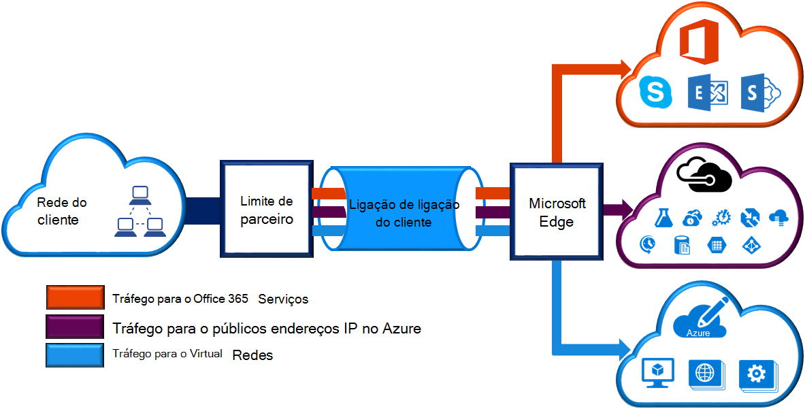
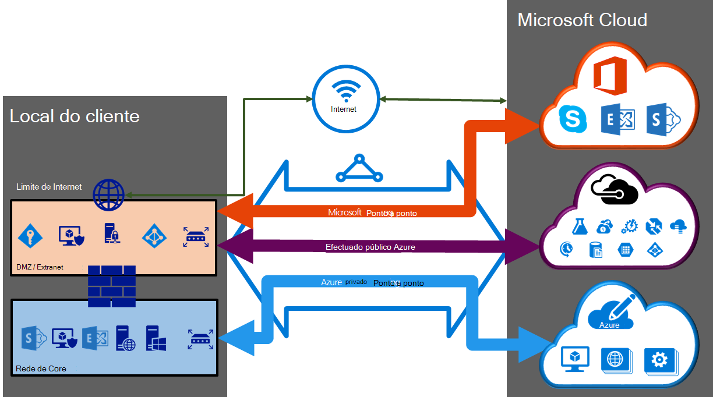

<properties 
   pageTitle="ExpressRoute circuitos e domínios de encaminhamento | Microsoft Azure"
   description="Esta página fornece uma descrição geral do ExpressRoute circuitos e os domínios encaminhamento."
   documentationCenter="na"
   services="expressroute"
   authors="cherylmc"
   manager="carmonm"
   editor=""/>
<tags 
   ms.service="expressroute"
   ms.devlang="na"
   ms.topic="article" 
   ms.tgt_pltfrm="na"
   ms.workload="infrastructure-services" 
   ms.date="10/10/2016"
   ms.author="cherylmc"/>

# ExpressRoute circuitos e domínios de encaminhamento

 Tem de encomendar um *circuito ExpressRoute* para ligar a sua infraestrutura no local para a Microsoft através de um fornecedor de conectividade. A figura seguinte fornece uma representação lógica de conectividade entre o seu WAN e Microsoft.

## ExpressRoute circuitos

Um *ExpressRoute circuito* representa uma ligação entre o seu infraestrutura no local e serviços em nuvem da Microsoft através de um fornecedor de conectividade lógica. Pode encomendar vários ExpressRoute circuitos. Cada circuito pode ser nas regiões mesmo ou diferentes e pode ser ligado às suas instalações através de fornecedores de conectividade diferente. 

ExpressRoute circuitos não mapear para quaisquer entidades físicas. Um circuito exclusivamente é identificado por um padrão de que GUID chamado como uma chave de serviço (s-chave). A chave do serviço é o único tipo de informações trocados entre o Microsoft, o fornecedor de conectividade e. A tecla s não é uma palavra-passe por motivos de segurança. Existe um mapeamento de 1:1 entre um circuito ExpressRoute e a tecla s.

Um circuito ExpressRoute pode ter até três peerings independentes: Azure privado público, Azure e Microsoft. Cada efectuado é um par de BGP independente sessões, cada uma delas configurado de forma redundante para elevada disponibilidade. Existe um 1: n (1 < = N < = 3) mapeamento entre um circuito ExpressRoute e encaminhamento de domínios. Pode ter um circuito ExpressRoute qualquer um, dois ou todos os três peerings ativadas por ExpressRoute circuito.
 
Cada circuito tem uma largura de banda fixa (50 Mbps, 100 Mbps, 200 Mbps, 500 Mbps, 1 Gbps, 10 Gbps) e é mapeado para um fornecedor de conectividade e uma localização peering. Selecionar a largura de banda for ser partilhadas por todos os peerings para o circuito. 

### Quotas, limites e limitações

Quotas predefinidas e os limites aplicam-se para cada circuito ExpressRoute. Referem-se para a página de [subscrição do Azure e limites de serviço, Quotas e restrições](../azure-subscription-service-limits.md) para obter informações atualizadas sobre quotas.

## ExpressRoute domínios de encaminhamento

Um circuito ExpressRoute tiver múltiplos domínios encaminhamento associados: Azure privado público, Azure e Microsoft. Cada um dos domínios encaminhamento configurada idêntico num par de routers (activo activo ou partilha de carga configuração) para elevada disponibilidade. Serviços de Azure são categorizados como *Azure público* e *Azure privado* para representar as endereçamento esquemas de IP.

### Efectuado privada

Azure calcular serviços, nomeadamente virtual máquinas (IaaS) e serviços em nuvem (PaaS), que são implementados dentro de uma rede virtual podem ser ligados através do domínio peering privado. O domínio peering privado é considerado como uma extensão de confiança da sua rede core no Microsoft Azure. Pode configurar bidirecional conectividade entre o seu rede core e redes virtuais Azure (VNets). Este efectuado permite-lhe ligar a máquinas virtuais e na nuvem serviços diretamente sobre os respetivos endereços IP privada.  

Pode ligar mais do que uma rede virtual para o domínio peering privado. Reveja a [página de perguntas mais frequentes](expressroute-faqs.md) para obter informações sobre limitações e limites. Pode visitar a página de [subscrição do Azure e limites de serviço, Quotas e restrições](../azure-subscription-service-limits.md) para obter informações atualizadas sobre limites.  Referem-se para a página de [Encaminhamento](expressroute-routing.md) para informações detalhadas sobre a configuração de encaminhamento.

### Efectuado público

São fornecidos serviços como o armazenamento do Windows Azure, bases de dados SQL e Web sites em endereços IP públicos. Em privado pode ligar aos serviços alojados no endereços IP públicos, incluindo VIP dos seus serviços na nuvem, através de no domínio de encaminhamento peering público. Pode ligar o domínio peering público ao seu DMZ e ligar-se a todos os serviços Azure nos respetivos endereços de IP públicos a partir do seu WAN sem ter de se ligar através da internet. 

Conectividade é sempre iniciada a partir do seu WAN aos serviços do Microsoft Azure. Serviços do Microsoft Azure não conseguir iniciar ligações na sua rede através deste domínio de encaminhamento. Assim que efectuado público está ativado, será possível ligar a todos os serviços do Azure. Vamos não permitem que deve escolher seletivamente serviços para o qual podemos anunciar rotas para. Pode rever a lista de prefixos que podemos anunciar para si através deste efectuado na página de [Intervalos de IP do Microsoft Azure Centro de dados](http://www.microsoft.com/download/details.aspx?id=41653) . A página é atualizada semanais.

Pode definir filtros de rota personalizado na rede da sua consumir apenas as rotas que precisar. Referem-se para a página de [Encaminhamento](expressroute-routing.md) para informações detalhadas sobre a configuração de encaminhamento. Pode definir filtros de rota personalizado na rede da sua consumir apenas as rotas que precisar. 

Ver a [página de perguntas mais frequentes](expressroute-faqs.md) para obter mais informações sobre os serviços suportados através do domínio de encaminhamento peering público. 
 
### Microsoft efectuado

[AZURE.INCLUDE [expressroute-office365-include](../../includes/expressroute-office365-include.md)]

Conectividade para todos os outros serviços online da Microsoft (tal como o serviços do Office 365) será através de efectuado a Microsoft. Vamos activar a conectividade de bidirecional entre os serviços de nuvem WAN e Microsoft através do domínio de encaminhamento peering Microsoft. Tem de ligar aos serviços em nuvem Microsoft apenas através de endereços IP públicos que são propriedade por si ou o seu fornecedor de conectividade e tem de aderir a todas as regras definidas. Ver a página de [Pré-requisitos de ExpressRoute](expressroute-prerequisites.md) para obter mais informações.

Ver a [página de perguntas mais frequentes](expressroute-faqs.md) para obter mais informações sobre os serviços que são suportados, custos e detalhes de configuração. Ver a página de [Localizações ExpressRoute](expressroute-locations.md) para obter informações na lista de fornecedores de conectividade a perguntar se efectuado suporte da Microsoft.

## Comparação de domínio de encaminhamento

A tabela abaixo compara os domínios de encaminhamento três.

||**Efectuado privada**|**Efectuado público**|**Microsoft efectuado**|
|---|---|---|---|
|**Máximo. prefixos # suportados por efectuado**|4000 por predefinição, 10.000 com ExpressRoute Premium|200|200|
|**Intervalos de endereços IP suportados**|Qualquer endereço IPv4 válido no seu WAN.|Endereços IPv4 públicos pertencentes ou ao seu fornecedor de conectividade.|Endereços IPv4 públicos pertencentes ou ao seu fornecedor de conectividade.|
|**COMO os requisitos de números**|Públicas e privadas como números. Tem de ser proprietário do público como número se optar por utilizar um. | Públicas e privadas como números. No entanto, deve provar que é o proprietário de endereços IP públicos.| Públicas e privadas como números. No entanto, deve provar que é o proprietário de endereços IP públicos.|
|**Encaminhamento endereços de IP de Interface**|Endereços IP público e RFC1918|Endereços IP públicos registados para si no encaminhamento de registos.| Endereços IP públicos registados para si no encaminhamento de registos.|
|**Suporte de MD5 Hash**| Sim|Sim|Sim|

Pode optar por ativar um ou mais dos domínios de encaminhamento como parte da sua circuito ExpressRoute. Pode optar por todos os domínios de encaminhamento colocados no mesmo VPN se pretender combina-as num único domínio de encaminhamento. Também pode colocá-los no domínios encaminhamento diferentes, semelhantes ao diagrama. A configuração recomendada é que diretamente efectuado privado está ligado à rede principais e os público e as ligações de efectuado Microsoft estiverem ligadas à sua DMZ.
 
Se optar por ter todas as sessões peering três, tem de ter três pares de sessões BGP (um par para cada tipo peering). Os pares de sessão BGP fornecem uma hiperligação altamente disponível. Se estiver a ligar através de fornecedores de conectividade 2 da camada, será responsável para configurar e gerir o encaminhamento de. Pode obter mais ao rever os [fluxos de trabalho](expressroute-workflows.md) para a configuração ExpressRoute.

## Próximos passos

- Localize um fornecedor de serviços. Consulte o artigo [fornecedores de serviços de ExpressRoute e localizações](expressroute-locations.md).
- Certifique-se de que todos os pré-requisitos forem cumpridos. Consulte o artigo [ExpressRoute pré-requisitos](expressroute-prerequisites.md).
- Configure a sua ligação de ExpressRoute.
    - [Criar um circuito ExpressRoute](expressroute-howto-circuit-classic.md)
    - [Configurar o encaminhamento (circuito peerings)](expressroute-howto-routing-classic.md)
    - [Ligar uma VNet um circuito ExpressRoute](expressroute-howto-linkvnet-classic.md)
