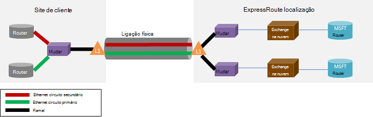

<properties
   pageTitle="ExpressRoute perguntas mais frequentes"
   description="As perguntas mais frequentes ExpressRoute contém informações acerca dos serviços do Azure suportadas, custo, dados e ligações, SLA, fornecedores e localizações, largura de banda e detalhes técnicos adicionais."
   documentationCenter="na"
   services="expressroute"
   authors="cherylmc"
   manager="carmonm"
   editor=""/>
<tags
   ms.service="expressroute"
   ms.devlang="na"
   ms.topic="article" 
   ms.tgt_pltfrm="na"
   ms.workload="infrastructure-services"
   ms.date="10/10/2016"
   ms.author="cherylmc"/>

# ExpressRoute perguntas mais frequentes

## O que é ExpressRoute?
ExpressRoute é um serviço Azure que permite-lhe criar ligações privada entre centros de dados do Microsoft e infraestrutura de que está no seu local ou numa funcionalidade de colocação. ExpressRoute ligações não aceda através da Internet pública e oferecem mais elevados fiabilidade, segurança e velocidades com latências inferiores que as ligações típicas através da Internet.

### Quais são as vantagens da utilização de ExpressRoute e ligações de rede privada?
ExpressRoute ligações não aceda através da Internet pública e oferecem mais elevados fiabilidade, segurança e velocidades com latências inferiores e consistentes que as ligações típicas através da Internet. Em alguns casos, utilizando ligações de ExpressRoute para transferir dados no local dispositivos e Azure pode lucro benefícios significativos custo.

### Que serviços em nuvem da Microsoft compatíveis sobre ExpressRoute?
ExpressRoute suporta a maioria dos serviços do Microsoft Azure hoje incluindo Office 365.  Procure atualizações sobre a disponibilidade geral mais rapidamente.

### Onde o serviço está disponível?
Consulte esta página para a localização de serviço e disponibilidade: [ExpressRoute parceiros e localizações](expressroute-locations.md).

### Como utilizar ExpressRoute para ligar para a Microsoft, se não tiver parcerias com um dos parceiros ExpressRoute carrier?
Pode selecionar um carrier regional e terra ligações Ethernet para um do exchange suportado localizações fornecedor. Em seguida, pode peer com a Microsoft na localização fornecedor. Verifique a última secção [ExpressRoute parceiros e localizações](expressroute-locations.md) para ver se o seu fornecedor de serviços encontra presente em qualquer uma das localizações exchange. Em seguida, pode encomendar um circuito ExpressRoute através do fornecedor de serviço para ligar ao Azure.

### Custo ExpressRoute quanto o?
Verifique a [preços detalhes](https://azure.microsoft.com/pricing/details/expressroute/) para a informação de preços.

### Se pagar a para um circuito ExpressRoute de uma determinada largura de banda, a a ligação VPN que posso comprar o partir do meu fornecedor de serviços de rede tem de ser a mesma velocidade?
Não. Pode comprar uma ligação VPN de qualquer velocidade a partir do seu fornecedor de serviços. No entanto, a ligação ao Azure é limitados a largura de banda do circuito ExpressRoute comprar.

### Se pagar a para um circuito ExpressRoute de uma determinada largura de banda, tenho de ter a capacidade de rajada até velocidades superiores, se necessário?
Sim. ExpressRoute circuitos estão configurados para suportar casos onde pode rajada até duas vezes o limite de largura de banda adquiridos sem custo adicional. Com o seu fornecedor de serviços, verifique se suporta esta funcionalidade.

### Posso utilizar a mesma ligação de rede privada com outros serviços do Azure e de rede Virtual em simultâneo?
Sim. Um circuito ExpressRoute, uma vez configuração permite-lhe aceder aos serviços dentro de uma rede virtual e outros serviços do Azure em simultâneo. Irá ligar a redes virtuais através do caminho do peering privado e outros serviços através do caminho peering público.

### ExpressRoute oferecidas um contrato de nível de serviço (SLA)?
Consulte a [página de ExpressRoute SLA](https://azure.microsoft.com/support/legal/sla/) para obter mais informações.

## Serviços suportados
Serviços mais Azure são suportados sobre ExpressRoute.

- Conectividade ao máquinas virtuais e serviços em nuvem implementados em redes virtuais são suportadas através do caminho peering privado.
- Azure Web sites são suportados através do caminho peering público.
- Concentrador IoT é suportada através do caminho peering público.
- Office 365 é suportado através do caminho peering da Microsoft.
- Todos os outros serviços estão acessíveis através do caminho peering público. As exceções consistem da seguinte forma.

    **Não são suportados os seguintes serviços:**

    - CDN
    - Serviços de equipa do Visual Studio testes de carregamento
    - Autenticação multifator
    - Gestor de tráfego

## Dados e ligações

### Existem limites sobre a quantidade de dados pode transferir o ExpressRoute a utilizar?
Não podemos definir um limite a quantidade de transferência de dados. Consulte [Detalhes de preços](https://azure.microsoft.com/pricing/details/expressroute/) para obter informações sobre as taxas de largura de banda.

### O que indicam as velocidades ligação das são suportadas pelo ExpressRoute?
Suportadas ofertas de largura de banda:

| 50 Mbps, 100 Mbps, 200 Mbps, 500 Mbps, 1Gbps, 2 Gbps, 5 Gbps, 10Gbps |

### Quais os fornecedores de serviço estão disponíveis?
Consulte o artigo [ExpressRoute parceiros e localizações](expressroute-locations.md) para a lista de fornecedores de serviços e localizações.

## Detalhes técnicos

### Quais são os requisitos técnicos para ligar a minha localização no local à Azure?
Consulte o artigo [página de pré-requisitos de ExpressRoute](expressroute-prerequisites.md) para requisitos.

### São redundantes ligações aos ExpressRoute?
Sim. Cada circuito Express encaminhar tem um par redundante de cruzada ligações configuradas para fornecer elevada disponibilidade.

### Irá perder a conectividade se um dos meus ligações ExpressRoute falhar?
Não irá perder a ligação se uma das ligações cruzadas falhar. Uma ligação redundante está disponível para suportar a carga da sua rede. Para além disso pode criar vários circuitos numa localização diferente peering para alcançar resistência falha.

### Se não tenho a cocriação localizado num exchange na nuvem e o meu fornecedor de serviços oferece uma ligação ponto a ponto, é necessário ordenar duas ligações físicas entre minha rede no local e a Microsoft? 
Não, só necessita de uma ligação física se o seu fornecedor de serviços pode estabelecer duas circuitos virtuais de Ethernet através da ligação física. A ligação física (por exemplo, uma fibra óptica) é terminada numa camada 1 (L1) dispositivo (ver imagem abaixo). Os dois circuitos virtuais de Ethernet são marcados com IDs de VLAN diferentes, uma para o circuito principal e outra para secundária. IDs esses VLAN estão a 802.1 q externa cabeçalho Ethernet. O 802.1 q interna cabeçalho Ethernet (não apresentado) é mapeado para o [domínio de encaminhamento ExpressRoute](expressroute-circuit-peerings.md)específico. 

### Pode posso abrangido por um dos meus VLANs Azure ExpressRoute a utilizar?
Não. Não suportamos extensões de conectividade 2 camada para Azure.

### Pode ter mais do que um ExpressRoute circuito na minha subscrição?
Sim. Pode ter mais do que um ExpressRoute circuito na sua subscrição. O limite predefinido no número de circuitos dedicados está definido para 10. Pode contactar Support da Microsoft para aumentar o limite, se necessário.

### Pode ter ExpressRoute circuitos fornecedores de serviços diferente?
Sim. Pode ter ExpressRoute circuitos com muitos fornecedores de serviços. Cada circuito ExpressRoute será associado com o fornecedor de serviços de uma só.

### Como ligar meu redes virtuais um circuito ExpressRoute
Os passos básicos são descritos abaixo.

- Tem de estabelecer um circuito ExpressRoute e ter o fornecedor de serviços de ativá-la.
- Que ou o fornecedor tem de configurar o BGP peering (s).
- Tem de ligar à rede virtual ao circuito ExpressRoute.

Para mais informações, consulte [ExpressRoute fluxos de trabalho para os Estados dos circuitos e de aprovisionamento de circuito](expressroute-workflows.md) .

### Existem limites de conectividade para minha circuito ExpressRoute?
Sim. Página [localizações e parceiros ExpressRoute](expressroute-locations.md) fornece uma descrição geral dos limites de conectividade para um circuito ExpressRoute. Ligação para um circuito ExpressRoute está limitada a uma única região geopolítica. Conectividade pode ser expandida para cruzada regiões geopolíticas ao ativar a funcionalidade de premium ExpressRoute.

### Pode ligar a mais do que uma rede virtual para um circuito ExpressRoute?
Sim. Pode ligar até 10 redes virtuais a um circuito ExpressRoute.

### Tenho de ter múltiplas subscrições Azure que contêm redes virtuais. Pode ligar redes virtuais que estão no separado subscrições para um único circuito de ExpressRoute?
Sim. Pode autorizar até 10 outras subscrições Azure para utilizar um circuito ExpressRoute único. Este limite pode ser aumentado ao ativar a funcionalidade de premium ExpressRoute.

Para obter mais detalhes, consulte o artigo [partilhar um circuito ExpressRoute em múltiplas subscrições](expressroute-howto-linkvnet-arm.md).

### Redes virtuais estão ligados para o mesmo circuito isolado uns dos outros?
Não. Todas as redes virtuais ligadas para o mesmo circuito ExpressRoute fazem parte do mesmo domínio de encaminhamento e não são isoladas uns dos outros a partir de uma perspetiva encaminhamento. Se precisar de isolamento encaminhar, terá de criar um circuito ExpressRoute em separado.

### Pode ter uma rede virtual ligada a mais do que um ExpressRoute circuito?
Sim. Pode ligar uma única rede virtual com até 4 ExpressRoute circuitos. Tem de ser encomendados através de 4 diferentes [ExpressRoute localizações](expressroute-locations.md).

### Pode aceder à internet a partir do meu virtuais redes ligadas ExpressRoute circuitos?
Sim. Se não tiver anunciada rotas predefinidas (0.0.0.0/0) ou prefixos de rota de internet através da sessão BGP, vai conseguir ligar à internet a partir de uma rede virtual associada a um circuito ExpressRoute.

### Pode bloquear conectividade à internet para virtuais redes ligadas ExpressRoute circuitos?
Sim. Pode anunciar rotas predefinido (0.0.0.0/0) para bloquear todas as ligação à internet a máquinas virtuais implementado dentro de uma rede virtual e encaminha todo o tráfego de saída através do circuito ExpressRoute. Tenha em atenção que se anunciam rotas predefinidas, podemos vai forçar o tráfego para serviços disponibilizados através de back efectuado (como armazenamento Azure e SQL DB) público às suas instalações. Terá de configurar os routers para devolver aos tráfego Azure através do caminho peering público ou através da internet.

### Podem falar virtuais redes ligadas para o mesmo circuito ExpressRoute umas às outras?
Sim. Máquinas virtuais implementadas em redes virtuais ligados ao mesmo circuito ExpressRoute podem comunicar com os outros.

### Pode utilizar a conectividade de site para o site para redes virtuais em conjunto com ExpressRoute?
Sim. ExpressRoute pode coexistência com VPNs de site para o site.

### Pode mover uma rede virtual da configuração de site para o site / ponto-para-site ao utilizar ExpressRoute?
Sim. Terá de criar um gateway ExpressRoute na rede da sua virtual. Haverá um tempo de inatividade pequenas associado com o processo.

### O que preciso ligar ao armazenamento Azure através de ExpressRoute?
Tem de estabelecer um circuito ExpressRoute e configurar rotas para efectuado público.

### Existem limites no número de rotas que posso pode anunciar?
Sim. Vamos aceitar até 4000 encaminhar prefixos para efectuado privado e 200 para efectuado público e Microsoft efectuado. Pode aumentar isto para 10.000 rotas para efectuado privado se ativar a funcionalidade de premium ExpressRoute.

### Existem restrições em intervalos IP que pode anunciar sobre a sessão BGP?
Vamos não aceitar a prefixos privados (RFC1918) na público e Microsoft peering BGP sessão.

### O que acontece se excederem o o BGP limita?
Sessões BGP serão ignorados. Serão repostas quando acede a contagem de prefixo abaixo do limite.

### O que é o tempo de espera ExpressRoute BGP? Pode-ser ajustado?
O tempo de espera é 180. As mensagens persistentes são enviadas cada 60 segundos. Estas são corrigidas definições no lado Microsoft que não pode ser alterado.

### Depois da rota de predefinida (0.0.0.0/0) posso anunciar ao meu redes virtuais, não é possível ativar Windows em execução no meu VMs Azure. Como para posso corrigir este problema?
Os passos seguintes irão ajudá-Azure reconhecer o pedido de ativação:

1. Estabelece efectuado público para o seu circuito ExpressRoute.
2. Efectuar uma pesquisa de DNS e localizar o endereço IP do **kms.core.windows.net**
3. Em seguida, efetue um dos seguintes duas itens para que o Key Management Service irá reconhecer que o pedido de ativação vem a partir do Azure e irá satisfazer o pedido.
    - Na sua rede no local, encaminhe o tráfego destinado o endereço IP (obtido no passo 2) para o Azure através do efectuado público.
    - Tem o seu pin de cabelos do fornecedor NSP o tráfego para o Azure através do efectuado público.

### Pode alterar a largura de banda num circuito ExpressRoute?
Sim. Pode aumentar a largura de banda num circuito ExpressRoute sem ter de suprimi-lo. Terá de dar seguimento, com o seu fornecedor de conectividade para se certificar de que atualizam limitações dentro das suas redes para aumentar a largura de banda de suporte. No entanto não será capaz de reduzir a largura de banda num circuito ExpressRoute. Está a ter para o canto inferior que a largura de banda significa que um destacáveis para baixo e recreio num circuito ExpressRoute.

### Como posso alterar a largura de banda num circuito ExpressRoute?
Pode atualizar a largura de banda do circuito ExpressRoute utilizando o cmdlet circuito atualização dedicado API e PowerShell.

## ExpressRoute Premium

### O que é ExpressRoute premium?
ExpressRoute premium é um conjunto de funcionalidades listados abaixo.

 - Encaminhamento tabela o limite aumentado de 4000 rotas para 10.000 rotas para efectuado privado.
 - Aumentar o número de VNets que podem ser ligados ao circuito ExpressRoute (a predefinição é 10). Consulte a tabela abaixo para obter mais detalhes.
 - Conectividade global através da rede do Microsoft core. Agora poderá ligar um VNet numa região geopolítica com um circuito ExpressRoute noutra região. **Exemplo:** Pode ligar um VNet criada na Europa Oeste para um circuito ExpressRoute criado no silício do vale do.
 - Conectividade para serviços do Office 365 e CRM Online.

### Quantos VNets posso criar uma ligação para um circuito ExpressRoute se ativado a ExpressRoute premium?
As tabelas abaixo mostram os limites de ExpressRoute e o número de VNets por ExpressRoute circuito.

[AZURE.INCLUDE [expressroute-limits](../../includes/expressroute-limits.md)]

### Como posso ativar ExpressRoute premium?
Podem ser ativadas às funcionalidades premium do ExpressRoute quando a funcionalidade está ativada e pode ser encerrar ao atualizar o estado de circuito. Pode ativar ExpressRoute premium na hora de criação de circuito ou pode ligar o circuito atualização dedicado API / cmdlet do PowerShell para ativar ExpressRoute premium.

### Como desativo ExpressRoute premium?
Pode desativar ExpressRoute premium ao contactar o suporte a atualização dedicada circuito API / cmdlet do PowerShell tem de se certificar que tenham dimensionada a conectividade de tem de cumprir os limites predefinidos antes de desactivar ExpressRoute premium. Vamos falhará pedido para desativar ExpressRoute premium se a utilização do escalas para além dos limites predefinidos.

### Pode posso escolher as funcionalidades que pretende a partir do conjunto de funcionalidades premium?
Não. Não conseguir escolha as funcionalidades de que necessita. Vamos ativar todas as funcionalidades quando ativa a ExpressRoute premium.

### Custo de premium ExpressRoute quanto o?
Consulte [Detalhes de preços](https://azure.microsoft.com/pricing/details/expressroute/) de custo.

### Pagar Premium ExpressRoute para além de taxas de ExpressRoute padrão?
Sim. Taxas de premium ExpressRoute aplicam-se na parte superior de taxas de circuito ExpressRoute e taxas necessárias pelo fornecedor de conectividade.

## ExpressRoute e serviços do Office 365 e CRM Online

[AZURE.INCLUDE [expressroute-office365-include](../../includes/expressroute-office365-include.md)]

### Como posso criar um circuito ExpressRoute para ligar aos serviços do Office 365 e CRM Online?

1. Reveja a página de [página de pré-requisitos de ExpressRoute](expressroute-prerequisites.md) para se certificar de que cumprir os requisitos.
2. Reveja a lista de fornecedores de serviços e localizações na [ExpressRoute parceiros e localizações](expressroute-locations.md) para garantir que as suas necessidades de conectividade são preenchidas.
3. Planear aos requisitos da capacidade ao rever o [Planeamento da rede e Otimização do desempenho do Office 365](http://aka.ms/tune/).
4. Siga os passos indicados dos fluxos de trabalho abaixo para conectividade [ExpressRoute fluxos de trabalho para os Estados dos circuitos e de aprovisionamento de circuito](expressroute-workflows.md)do programa de configuração.

>[AZURE.IMPORTANT] Certifique-se de que ativou o suplemento do ExpressRoute premium quando configurar a conectividade para serviços do Office 365 e CRM Online.

### É necessário ativar o Azure efectuado público para ligar a serviços do Office 365 e CRM Online?
Não, só tem de ativar Microsoft Peering. Tráfego de autenticação para Azure AD será enviado através do Microsoft Peering. 

### Podem meu circuitos ExpressRoute existentes suportar conectividade para serviços do Office 365 e CRM Online?
Sim. O circuito ExpressRoute existente pode ser configurado para suportar a conectividade para serviços do Office 365. Certifique-se de que tem uma capacidade suficiente para se ligar aos serviços do Office 365 e certifique-se de que ativou o suplemento premium. [Planeamento da rede e Otimização do desempenho do Office 365](http://aka.ms/tune/) irá ajudá-lo a planear as suas necessidades de conectividade. Além disso, consulte o artigo [criar e modificar um circuito ExpressRoute](expressroute-howto-circuit-classic.md).

### Que serviços podem ser acedidos através de uma ligação de ExpressRoute do Office 365?

Referir-se a página de [URLs do Office 365 e intervalos de endereços IP](http://aka.ms/o365endpoints) para uma lista dos serviços suportado através de ExpressRoute atualizada.

### Quanto o ExpressRoute para serviços do Office 365 e o custo CRM Online?
Serviços do Office 365 e CRM Online requer o suplemento do premium de estar ativada. [Página de detalhes de preços](https://azure.microsoft.com/pricing/details/expressroute/) fornece detalhes de custos para ExpressRoute.

### Que regiões ExpressRoute para Office 365 é suportado no?
Consulte [localizações e parceiros de ExpressRoute](expressroute-locations.md) para mais informações sobre a lista de parceiros e localizações onde ExpressRoute é suportado.

### Posso aceder ao Office 365 através da internet mesmo se ExpressRoute foi configurado para a minha organização?
Sim. Os pontos finais do Office 365 serviço estão acessíveis através da internet, apesar de ter sido configurado ExpressRoute para a sua rede. Se estiver numa localização que está configurada para ligar aos serviços do Office 365 através de ExpressRoute, irá ligá-através de ExpressRoute.

### Pode Dynamics AX Online ser acedido através de uma ligação de ExpressRoute?
Não, não é suportada.
