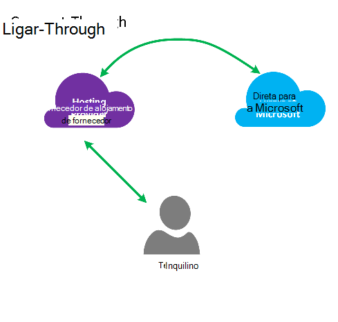
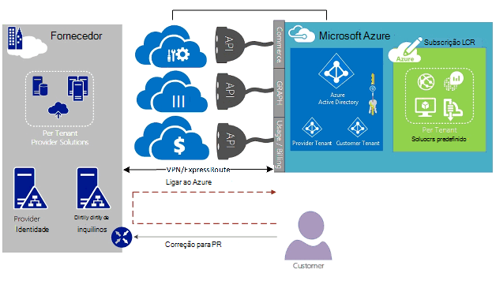
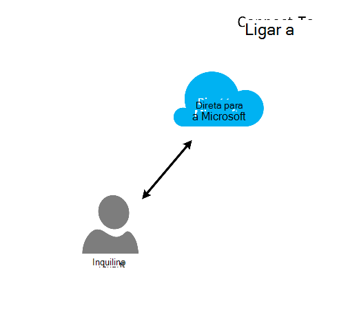
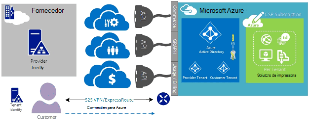
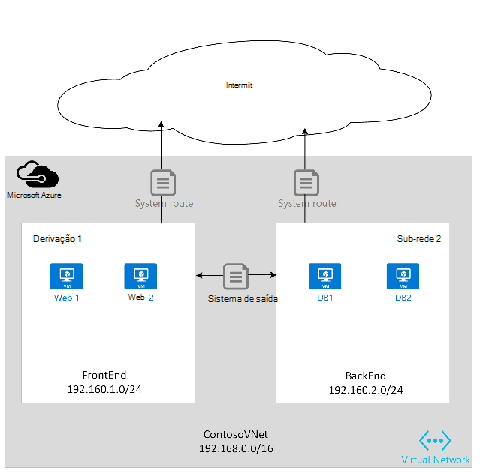

<properties
   pageTitle="Azure ExpressRoute para fornecedores de solução da nuvem | Microsoft Azure"
   description="Este artigo fornece informações para fornecedores de serviço de nuvem que pretende incorporar serviços Azure e ExpressRoute para os respetivos ofertas."
   documentationCenter="na"
   services="expressroute"
   authors="richcar"
   manager="carmonm"
   editor=""/>
<tags
   ms.service="expressroute"
   ms.devlang="na"
   ms.topic="get-started-article"
   ms.tgt_pltfrm="na"
   ms.workload="infrastructure-services"
   ms.date="10/10/2016"
   ms.author="richcar"/>

# ExpressRoute para fornecedores de solução da nuvem (CSP)

A Microsoft fornece serviços de escala Hyper aos revendedores tradicionais e distribuidores (CSP) possam rapidamente aprovisionar novos serviços e soluções para os seus clientes sem precisar de investir no desenvolvimento destes novos serviços. Para permitir que o fornecedor de solução da nuvem (CSP) a capacidade de gerir diretamente estes serviços novos, a Microsoft fornece APIs que permitem o CSP gerir os recursos do Microsoft Azure em nome dos seus clientes e programas. Uma desses recursos é ExpressRoute. ExpressRoute permite que o CSP a ligação existente recursos do cliente a serviços Azure. ExpressRoute é uma ligação de comunicações privadas de alta velocidade para serviços no Azure. 

ExpresRoute é composto por um par de circuitos para elevada disponibilidade que estão anexados às suas de subscrições único cliente e não pode ser partilhado por vários clientes. Cada circuito deve ser terminado num router diferente para manter a disponibilidade de alta.

>[AZURE.NOTE] Existem maiúsculas de largura de banda e ligação no ExpressRoute que significa que grandes/complexo implementações irão precisar de vários circuitos de ExpressRoute para um único cliente.

Microsoft Azure fornece um número crescente de serviços que pode oferecer aos seus clientes.  Para melhor tomar partido destes serviços irão necessitar a utilizar ligações ExpressRoute para fornecer alta velocidade baixa acesso de latência para o ambiente do Microsoft Azure.

## Gestão do Microsoft Azure
A Microsoft fornece CSPs com APIs para gerir as subscrições do cliente Azure ao permitir programação integração com o seus próprio sistemas de gestão de serviço. As capacidades da gestão suportados que podem ser encontradas [aqui](https://msdn.microsoft.com/library/partnercenter/dn974944.aspx).

## Gestão de recursos do Microsoft Azure
Consoante o contrato que tiver com o seu cliente vai determinar como a subscrição será gerida. O CSP diretamente pode gerir a criação e a manutenção dos recursos ou o cliente pode manter o controlo da subscrição do Microsoft Azure e criar os recursos Azure à medida que necessitam. Se o seu cliente gere a criação de recursos na sua subscrição do Microsoft Azure irão utilizar um dos dois modelos: modelo de "Ligar-Through" ou "Direct a" modelo. Estes modelos são descritos detalhadamente nas secções seguintes.  

### Ligar através do modelo

  

No modelo através de ligar, o CSP cria uma ligação direta entre o seu centro de dados e de subscrição Azure do seu cliente. A ligação direta é efetuada utilizando ExpressRoute, ligar-se a sua rede com o Azure. Em seguida, o seu cliente liga-se à sua rede. Este cenário requer que o cliente transmite através da rede CSP para aceder aos serviços Azure. 

Se o seu cliente tiver outras subscrições Azure não geridas pela si, eles utilizaria pública Internet ou à sua própria ligação privada para ligar desses serviços aprovisionados na subscrição que não sejam CSP. 

Para CSP gerir serviços Azure, é assumido que o CSP tem um arquivo de identidade do cliente estabelecida anteriormente qual seria ser replicado para o Azure Active Directory para a gestão da sua subscrição CSP através de Administrate-On-Behalf-Of (AOBO). Controladores chaves para este cenário de incluem onde um parceiro determinado ou o fornecedor de serviços tem uma relação estabelecida com o cliente, o cliente é utilizado por outros serviços do fornecedor de atualmente ou o parceiro tem um vontade para fornecer uma combinação de soluções alojado no fornecedor e alojado no Azure para fornecer flexibilidade e cliente endereço desafios que não podem ser preenchidos por CSP sozinho. Este modelo é ilustrado na **figura**, abaixo.

### Ligar para o modelo

No modelo para ligar, o fornecedor de serviços cria uma ligação direta entre o Centro de dados do seu cliente e a subscrição do Azure CSP aprovisionado utilizando ExpressRoute através de cliente (cliente) rede.

>[AZURE.NOTE] Para ExpressRoute o cliente seria necessário criar e manter o circuito ExpressRoute.  

Este cenário de conectividade necessita que o cliente liga-se diretamente através de uma rede de cliente para aceder à subscrição Azure gerido CSP, utilizando uma ligação de rede direta que é criada, propriedade e gerida total ou parcialmente pelo cliente. Para estes clientes que é considerada que o fornecedor atualmente não tem um arquivo de identidade do cliente estabelecida e o fornecedor seria assistir o cliente na replicação respectivo arquivo identificar atual para o Azure Active Directory para a gestão da sua subscrição através de AOBO. Controladores chaves para este cenário de incluir um parceiro determinado ou o fornecedor de serviços tem uma relação estabelecida com o cliente, o cliente é utilizado por outros serviços do fornecedor de atualmente ou o parceiro tem um vontade para fornecer serviços baseados exclusivamente alojado no Azure soluções sem necessidade de um centro de dados do fornecedor existente ou infraestrutura onde.

Escolha entre estas duas opção são baseados em necessidades do seu cliente e as suas necessidades atual para fornecer serviços Azure. Controlam os detalhes destes modelos e o acesso baseado em funções associado, redes e padrões de estrutura de identidade abrange detalhes nas ligações seguintes:
-   **Função com base no Access controlo RBCA ()** – RBAC é baseado no Azure Active Directory.  Para obter mais informações sobre Azure RBAC consulte [aqui](../active-directory/role-based-access-control-configure.md).
-   **Funcionamento em rede** – abrange os tópicos vários das redes no Microsoft Azure.
-   **Azure Active Directory (AAD)** – AAD fornece a gestão de identidades para Microsoft Azure e aplicações de SaaS de festa 3º. Para obter mais informações sobre, consulte Azure AD [aqui](https://azure.microsoft.com/documentation/services/active-directory/).  

## Velocidades de rede
ExpressRoute suporta velocidades de rede de 50 Mb/s para as 10Gb/s. Isto permite que clientes comprar a quantidade de largura de banda de rede necessária para o seu ambiente exclusivo.

>[AZURE.NOTE] Largura de banda de rede pode ser aumentada conforme necessário sem interromper as comunicações, mas para reduzir a rede velocidade requer a sua para baixo o circuito e recriá-lo a velocidade de rede inferior.  

ExpressRoute suporta a ligação do vNets vários para um único circuito de ExpressRoute para uma melhor utilização das ligações de velocidade superior. Pode ser partilhado um circuito ExpressRoute única entre múltiplas subscrições Azure pertencentes ao mesmo cliente.

## Configurar ExpressRoute
ExpressRoute pode ser configurado para suportar três tipos de tráfego ([domínios de encaminhamento](#ExpressRoute-routing-domains)) através de um circuito ExpressRoute único. Este tráfego é separados de acordo com Microsoft efectuado, efectuado público Azure e efectuado privado. Pode escolher um ou todos os tipos de tráfego para ser enviado através de um circuito ExpressRoute único ou utilizar vários ExpressRoute circuitos, dependendo do tamanho da ExpressRoute circuito e isolamento uma ferramenta necessária ao seu cliente. A postura de segurança do seu cliente poderão não permitir o tráfego público e privado tráfego para percorrer sobre o mesmo circuito.

### Ligar através do modelo
Numa configuração de ligar a será responsável por todas as redes underpinnings para ligar os recursos do Centro de dados de clientes para as subscrições alojadas no Azure. Cada um do seu cliente que pretende utilizar as funcionalidades do Azure terão os seus próprios ligação ExpressRoute, o que irá ser gerida pela si. O que irá utilizar os mesmos métodos de que cliente utilizaria para adquirir o circuito ExpressRoute. O que vai ter de seguir os mesmos passos descritos no artigo [ExpressRoute fluxos de trabalho](./expressroute-workflows.md) para os Estados dos circuitos e de aprovisionamento de circuito. Em seguida, o que irá configurar as rotas limite Gateway Protocol (BGP) para controlar o tráfego a fluir entre a rede no local e Azure vNet.

### Ligar para o modelo
Numa configuração para ligar, ou do cliente já tem uma ligação existente para Azure iniciará uma ligação para o fornecedor de serviços internet a ligar ExpressRoute a partir do seu centro de dados do cliente diretamente Azure, em vez do seu centro de dados. Para começar o processo de aprovisionamento, o cliente irá siga os passos conforme descrito no modelo através de ligar, acima. Assim que o circuito foi estabelecido que seu cliente terá de configurar os routers no local será possível aceder à sua rede e o Azure vNets.

Pode ajudar com a ligação de instalação e configuração das rotas para permitir que os recursos na sua datacenter(s) para comunicar com os recursos de cliente no seu centro de dados ou com os recursos alojados no Azure.

## ExpressRoute domínios de encaminhamento
ExpressRoute oferece três domínios encaminhamento: público, privado e Microsoft efectuado. Cada um dos domínios encaminhamento estão configurados com routers idênticos activo activo configuração para elevada disponibilidade. Para obter mais detalhes sobre ExpressRoute domínios de encaminhamento procure [aqui](./expressroute-circuit-peerings.md).

Pode definir filtros rotas personalizadas para permitir que apenas o route(s) que pretende permitir ou precisa. Para mais informações ou para saber como efetuar estas alterações, consulte o artigo: [criar e modificar o encaminhamento para um circuito ExpressRoute através do PowerShell](./expressroute-howto-routing-classic.md) para obter mais detalhes sobre o encaminhamento de filtros.

>[AZURE.NOTE] Para a Microsoft e efectuado público conectividade tem de ser embora um endereço IP público pertencente de cliente ou de CSP e tem de aderir a todas as regras de definido. Para mais informações, consulte a página de [Pré-requisitos de ExpressRoute](expressroute-prerequisites.md) .  

## Encaminhamento
ExpressRoute liga-se para as redes Azure através do Gateway rede Virtual Azure. Os gateways de rede fornecem o encaminhamento para redes virtuais Azure.

Também criar redes virtuais Azure cria uma tabela de encaminhamento predefinido para vNet direcionar tráfego para a sub-redes do vNet. Se a tabela de rota predefinida é suficiente para a solução personalizada rotas podem ser criadas para encaminhar o tráfego de saída para eletrodomésticos personalizados ou para bloquear rotas para sub-redes específicas ou redes externas.

### Predefinição de encaminhamento
A tabela de rota predefinida inclui as seguintes rotas:

- Encaminhamento dentro de uma sub-rede
- Sub-rede para sub-rede dentro da rede virtual
- À Internet
- Rede de rede-para-virtual virtual utilizando VPN gateway
- Rede de rede-para-no local virtual utilização de um gateway VPN ou ExpressRoute

  

### Encaminhamento definidos pelo utilizador (UDR)
Rotas definidas pelo utilizador permitir que o controlo de tráfego de saída da sub-rede atribuída para outras sub-redes na rede virtual ou superior um dos outros gateways predefinidos (ExpressRoute; internet ou VPN). A tabela de encaminhamento de sistema predefinida pode ser substituída com uma tabela de encaminhamento definida pelo utilizador que substitui a tabela de encaminhamento predefinida rotas personalizadas. Com o encaminhamento de definidos pelo utilizador, clientes podem criar rotas específicas para eletrodomésticos como firewalls ou eletrodomésticos de deteção de intrusos ou bloquear o acesso a sub-redes específicas da sub-rede que aloja a rota definidos pelo utilizador. Para uma descrição geral do utilizador definidos rotas procure [aqui](../virtual-network/virtual-networks-udr-overview.md). 

## Segurança
Dependendo de qual o modelo está a ser utilizado, para ligar ou ligar-Through ou do cliente define as políticas de segurança no seu vNet fornece a segurança requisitos da política para o CSP para definir os respetivos vNets. Os seguintes critérios de segurança podem ser definidos:

1.  **Cliente isolamento** — plataforma o Azure fornece isolamento de cliente ao armazenar informações de ID do cliente e vNet numa base de dados seguro, utilizada para incorporar o tráfego de cada cliente num túnel GRE.
2.  Regras de **Grupo de segurança de rede (NSG)** são para a definição de permissão de tráfego de entrada e terminar os sub-redes dentro vNets no Azure. Por predefinição, o NSG contêm regras de bloqueio para bloquear o tráfego da Internet para o vNet e permitir regras para o tráfego de dentro de uma vNet. Para mais informações sobre os grupos de segurança de rede procure [aqui](https://azure.microsoft.com/blog/network-security-groups/).
3.  **Forçar túnel** — esta é uma opção para redirecionar o tráfego de internet vinculado com origem no Azure para redirecionados através da ligação ExpressRoute ao centro de dados no local. Para obter mais informações sobre forçado túnel procure [aqui](./expressroute-routing.md#advertising-default-routes).  

4.  **Encriptação** — apesar dos circuitos ExpressRoute são dedicados a um cliente específico, existe a possibilidade de que o fornecedor de rede pode ser comprometido, permitindo que um intrusos examinar tráfego de pacote. Para resolver este potencial, um cliente ou CSP pode encriptar tráfego através da ligação ao definir políticas de modo de túnel para todo o tráfego a fluir entre ativar recursos local e Azure recursos (consulte o modo de túnel IPSec opcional para o cliente 1 na figura 5: segurança ExpressRoute, acima). A segunda opção seria utilizar um dispositivo de firewall em cada o ponto final do circuito ExpressRoute. Isto vai requerer festa 3º adicional da firewall VMs/eletrodomésticos para ser instalado em ambas as extremidades para encriptar o tráfego através de circuito ExpressRoute.

  

## Próximos passos
O serviço de nuvem solução fornecedor fornece uma maneira de aumentar o valor aos seus clientes sem necessidade de compras dispendiosas infraestrutura e a capacidade, mantendo a sua posição como o fornecedor de utilização de recursos externos principal. Integração de forma totalmente integrada com o Microsoft Azure pode ser feita através da API CSP, permitindo-lhe integrar gestão do Microsoft Azure na sua quadros gestão existente.  

Informações adicionais podem ser encontradas nas ligações seguintes:

[Programa Microsoft Cloud solução fornecedor](https://partner.microsoft.com/en-US/Solutions/cloud-reseller-overview).  
[Preparar-se de que transact como um fornecedor de solução na nuvem](https://partner.microsoft.com/en-us/solutions/cloud-reseller-pre-launch).  
[Fornecedor de solução Microsoft Cloud recursos](https://partner.microsoft.com/en-us/solutions/cloud-reseller-resources).
