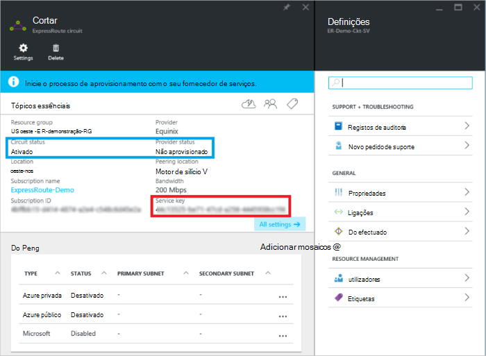

<properties
   pageTitle="Criar e modificar um circuito ExpressRoute utilizando o Gestor de recursos e o portal do Azure | Microsoft Azure"
   description="Este artigo descreve como criar, aprovisionar, certifique-se, atualizar, eliminar e deprovision um circuito ExpressRoute."
   documentationCenter="na"
   services="expressroute"
   authors="cherylmc"
   manager="carmonm"
   editor=""
   tags="azure-resource-manager"/>
<tags
   ms.service="expressroute"
   ms.devlang="na"
   ms.topic="article"
   ms.tgt_pltfrm="na"
   ms.workload="infrastructure-services"
   ms.date="10/10/2016"
   ms.author="cherylmc"/>

# Criar e modificar um circuito ExpressRoute

> [AZURE.SELECTOR]
[Portal Azure - Gestor de recursos](expressroute-howto-circuit-portal-resource-manager.md)
[PowerShell - Gestor de recursos](expressroute-howto-circuit-arm.md)
[PowerShell - clássico](expressroute-howto-circuit-classic.md)

Este artigo descreve como criar um circuito Azure ExpressRoute utilizando o portal do Azure e o modelo de implementação do Azure o Gestor de recursos. Os passos seguintes também mostram-lhe como verificar o estado do circuito, atualize-lo, ou eliminar e deprovision-lo.

**Sobre modelos de implementação do Azure**

[AZURE.INCLUDE [vpn-gateway-clasic-rm](../../includes/vpn-gateway-classic-rm-include.md)] 

## Antes de começar

- Reveja os [Pré-requisitos](expressroute-prerequisites.md) e [fluxos de trabalho](expressroute-workflows.md) antes de começar a configuração.
- Certifique-se de que tem de aceder ao [Azure portal](https://portal.azure.com).
- Certifique-se de que tem permissões para criar novos recursos de redes. Se não possui as permissões corretas, contacte o administrador da sua conta.

## Criar e aprovisionar um circuito ExpressRoute

### 1. Inicie sessão no portal do Azure

A partir de um browser, navegue para o [portal do Azure](http://portal.azure.com) e inicie sessão com a sua conta Azure.

### 2. Crie um novo circuito ExpressRoute

>[AZURE.IMPORTANT] Seu circuito ExpressRoute vai ser faturado a partir do momento em que é emitida uma chave de serviço. Certifique-se de que efetuar esta operação quando estiver pronto para aprovisionar o circuito o fornecedor de conectividade.

1. Pode criar um circuito ExpressRoute ao selecionar a opção para criar um novo recurso. Clique em **Novo** > **funcionamento em rede** > **ExpressRoute**, conforme apresentado na seguinte imagem:

    

2. Depois de clicar em **ExpressRoute**, verá o pá **circuito ExpressRoute criar** . Quando estiver a preencher os valores neste pá, certifique-se de que especificar a camada SKU correta e, em seguida, a medição de dados.

    - **Camada** determina se um padrão de ExpressRoute ou um suplemento de premium ExpressRoute está ativado. Pode especificar **padrão** para obter o SKU ou **Premium** padrão para o suplemento premium.

    - **Dados de medição** determina o tipo de faturação. Pode especificar **com tráfego limitado** para um plano de dados com tráfego limitado e **ilimitado** para um plano do ilimitada de dados. Tenha em atenção que pode alterar o tipo de faturação **com tráfego limitado** para **ilimitado**, mas não é possível alterar o tipo de **ilimitado** para **com tráfego limitado**.

    

>[AZURE.IMPORTANT] Tenha em atenção que a localização efectuado indica a [localização física](expressroute-locations.md) onde são efectuado com a Microsoft. Isto **não** está ligado à propriedade "Localização", que se refere a geografia onde está localizado o fornecedor de recursos de rede do Azure. Enquanto não estão relacionadas, é aconselhável para escolher um fornecedor de recursos de rede geograficamente fechar para a localização efectuado do circuito. 

### 3. ver circuitos e propriedades

**Ver todos os circuitos**

Pode ver todos os circuitos que criou ao selecionar **todos os recursos** no menu do lado esquerdo.
    

**Ver as propriedades**

    You can view the properties of the circuit by selecting it. On this blade, note the service key for the circuit. You must copy the circuit key for your circuit and pass it down to the service provider to complete the provisioning process. The circuit key is specific to your circuit.

### 4. enviar a chave do serviço para o seu fornecedor de conectividade para aprovisionamento

Neste pá, o **Estado do fornecedor** fornece informações sobre o estado atual de aprovisionamento do lado do fornecedor de serviços. **Estado de circuito** fornece o estado no lado Microsoft. Para mais informações sobre circuito aprovisionamento Unidos, consulte o artigo de [fluxos de trabalho](expressroute-workflows.md#expressroute-circuit-provisioning-states) .

Quando cria um novo circuito ExpressRoute, o circuito será no estado de seguinte:

Estado do fornecedor: não foi aprovisionado 
Estado de circuito: ativado

O circuito irá alterar o estado seguintes quando o fornecedor de conectividade é o processo de ativação-la por si:

Estado do fornecedor: aprovisionamento 
Estado de circuito: ativado

Para que possam utilizar um circuito ExpressRoute, tem de ser no estado de seguinte:

Estado do fornecedor: aprovisionado 
Estado de circuito: ativado

### 5. periodicamente verificar o estado e o estado da chave de circuito

Pode ver as propriedades do circuito que está interessado em ao selecioná-lo. Verificar o **Estado do fornecedor** e certifique-se de que este tenha movido para **Provisioned** antes de continuar.

### 6. Crie a sua configuração de encaminhamento

Para obter instruções passo a passo, consulte o artigo de [configuração de encaminhamento de circuito ExpressRoute](expressroute-howto-routing-portal-resource-manager.md) para criar e modificar circuito peerings.

>[AZURE.IMPORTANT] Estas instruções apenas se aplicam a circuitos que são criados com outros fornecedores de serviço que oferecem serviços de conectividade de 2 a camada. Se estiver a utilizar um fornecedor de serviços que oferece geridos layer 3 serviços (normalmente uma IP VPN, como MPLS), o seu fornecedor de conectividade irá configurar e gerir o encaminhamento para si.

### 7. ligação uma rede virtual para um circuito ExpressRoute

Em seguida, ligar uma rede virtual a sua circuito ExpressRoute. Utilize o artigo [Ligar redes virtuais ExpressRoute circuitos](expressroute-howto-linkvnet-arm.md) quando trabalha com o modelo de implementação do Gestor de recursos.

## Obter o estado de um circuito ExpressRoute

Pode ver o estado de um circuito ao selecioná-lo. 

## Modificar um circuito ExpressRoute

Pode modificar determinadas propriedades de um circuito ExpressRoute sem que afetam a conectividade. Neste momento, não é possível modificar propriedades do circuito ExpressRoute utilizando o portal do Azure. No entanto, pode utilizar o PowerShell para modificar as propriedades de circuito. Para mais informações, consulte a secção [modificar um circuito ExpressRoute utilizando o PowerShell](expressroute-howto-circuit-arm.md#modify).

Pode efetuar as seguintes ações com sem tempo de inatividade:

- Ativar ou desativar um suplemento de premium ExpressRoute para sua circuito ExpressRoute.

- Aumente a largura de banda do seu circuito ExpressRoute. Tenha em atenção que mudar a largura de banda de um circuito não é suportada. 

- Altere o plano de medição a partir de dados com tráfego limitado para dados ilimitado. Tenha em atenção que a alteração o plano de medição a partir de dados ilimitado aos dados com tráfego limitado não é suportada.

-  Pode ativar e desativar **Permitir operações clássica**.

Para mais informações sobre os limites e limitações, consulte as [ExpressRoute FAQ](expressroute-faqs.md).

## Deprovisioning e eliminar um circuito ExpressRoute

Pode eliminar o circuito ExpressRoute selecionando o ícone **Eliminar** . Tenha em atenção o seguinte procedimento:

- Tem de desligar todas as redes virtuais a partir do circuito ExpressRoute. Se esta operação falhar, verifique se as redes virtuais estão ligadas ao circuito.

- Se o ExpressRoute circuito fornecedor aprovisionamento estado do serviço for **aprovisionar** ou **Provisioned** tem de trabalhar com o seu fornecedor de serviços deprovision circuito no respetivo lado. Vamos irão continuar a reserva de recursos e faturar até o fornecedor de serviços conclui deprovisioning o circuito e notifica-nos.

- Se o fornecedor de serviços tem descontinuada circuito (o estado de aprovisionamento do fornecedor serviço está definido para **não aprovisionado**), em seguida, pode eliminar o circuito. Isto irá parar faturação para o circuito

## Próximos passos

Depois de criar o seu circuito, certifique-se de efetue o seguinte procedimento:

- [Criar e modificar o encaminhamento para sua circuito ExpressRoute](expressroute-howto-routing-portal-resource-manager.md)
- [Ligar a sua rede virtual a sua circuito ExpressRoute](expressroute-howto-linkvnet-arm.md)
