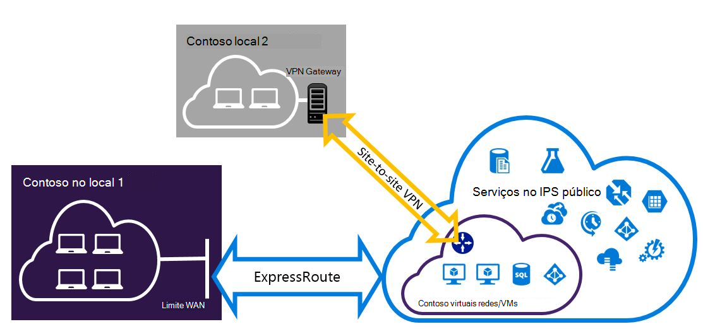

<properties
   pageTitle="Configurar ligações de VPN Expressroute e Site para o Site que podem coexistência | Microsoft Azure"
   description="Este artigo explica o configurar ExpressRoute e uma ligação VPN do Site para o Site que pode coexistência para o modelo de implementação clássica."
   documentationCenter="na"
   services="expressroute"
   authors="charwen"
   manager="carmonm"
   editor=""
   tags="azure-service-management"/>
<tags
   ms.service="expressroute"
   ms.devlang="na"
   ms.topic="get-started-article"
   ms.tgt_pltfrm="na"
   ms.workload="infrastructure-services"
   ms.date="10/10/2016"
   ms.author="charwen"/>

# Configurar ligações coexistentes ExpressRoute e Site para o Site para o modelo clássico de implementação

> [AZURE.SELECTOR]
- [PowerShell - Gestor de recursos](expressroute-howto-coexist-resource-manager.md)
- [PowerShell - clássico](expressroute-howto-coexist-classic.md)

Ter a capacidade de configurar o Site para o Site VPN e ExpressRoute tem várias vantagens. Pode configurar VPN do Site para o Site como um caminho de activação pós-falha seguro para ExressRoute ou utilizar VPNs de Site para o Site para ligar a sites que não estiver ligados através de ExpressRoute. Abordaremos os passos para configurar ambos os cenários neste artigo. Este artigo aplica-se ao modelo de implementação clássica. Esta configuração não está disponível no portal.

**Sobre modelos de implementação do Azure**

[AZURE.INCLUDE [vpn-gateway-clasic-rm](../../includes/vpn-gateway-classic-rm-include.md)] 

>[AZURE.IMPORTANT] ExpressRoute circuitos devem ser configurados previamente antes de que siga as instruções abaixo. Certifique-se de que tenha seguido os guias para [criar um circuito ExpressRoute](expressroute-howto-circuit-classic.md) e [configurar o encaminhamento](expressroute-howto-routing-classic.md) antes de seguir os passos abaixo.

## Limitações e limites

- **Encaminhamento de trânsito não é suportado.** Não é possível encaminhar (através do Azure) entre a sua rede local ligado através de VPN do Site para o Site e a sua rede local ligado através de ExpressRoute.
- **Ponto-para-site não é suportada.** Não é possível ativar as ligações de VPN ponto-para-site para o mesmo VNet que está ligado à ExpressRoute. Site de ponto VPN e ExpressRoute não é possível coexistência para o mesmo VNet.
- **Não pode ser activada túnel forçada no gateway VPN do Site para o Site.** Pode apenas "forçar" todo o tráfego de Internet vinculadas voltar a sua rede no local através do ExpressRoute.
- **Gateway SKU básica não é suportada.** Tem de utilizar um gateway que não sejam básicas SKU para o [ExpressRoute gateway](expressroute-about-virtual-network-gateways.md) e o [VPN gateway](../vpn-gateway/vpn-gateway-about-vpngateways.md).
- **Com base em encaminhar gateway de VPN só é suportada.** Tem de utilizar um [VPN Gateway](../vpn-gateway/vpn-gateway-about-vpngateways.md)com base em encaminhar.
- **Rota estática deverá estar configurada para o gateway VPN.** Se a sua rede local estiver ligado a ExpressRoute e está numa VPN do Site para o Site, tem de ter uma rota estática configurada na sua rede local para encaminhar a ligação VPN do Site para o Site para a Internet pública.
- **Em primeiro lugar, tem de ser configurado ExpressRoute gateway.** Tem de criar o gateway ExpressRoute pela primeira vez antes de adicionar o gateway VPN do Site para o Site.

## Estruturas de configuração

### Configure uma VPN do Site para o Site como um caminho de activação pós-falha para ExpressRoute

Pode configurar uma ligação VPN do Site para o Site como uma cópia de segurança para ExpressRoute. Aplica-se apenas a virtuais redes ligadas para o Azure caminho peering privado. Não existe nenhuma solução baseado em VPN activação pós-falha para serviços acessíveis através do Azure público e peerings da Microsoft. O circuito ExpressRoute é sempre a ligação principal. Irão fluxo de dados através do caminho do Site para o Site VPN apenas se o circuito ExpressRoute falhar. 

### Configurar uma VPN do Site para o Site para se ligar aos sites não ligados através de ExpressRoute

Pode configurar a sua rede onde alguns sites ligue o diretamente ao Azure ao longo do Site para o Site VPN e alguns sites ligarem através de ExpressRoute. 

>[AZURE.NOTE] Não consegue um configurar uma rede virtual como um router trânsito.

## Selecionar os passos para utilizar

Existem dois conjuntos de procedimentos para escolher a partir de para poder configurar ligações que podem coexistência diferentes. O processo de configuração que selecionar será dependem de se tiver uma rede virtual existente que pretende ligar a, ou que pretende criar uma nova rede virtual.

- Posso não tem um VNet e precisa de criar uma.
    
    Se ainda não tiver uma rede virtual, este procedimento irá guiá-lo através da criação de uma nova rede virtual utilizando o modelo clássico de implementação e criar novas ligações de VPN ExpressRoute e Site para o Site. Para configurar, siga os passos na secção artigo [para criar uma nova rede virtual e ligações coexistentes](#new).

- Já tenho um modelo de implementação clássica VNet.

    Já tem uma rede virtual num local com uma ligação VPN do Site para o Site existente ou ExpressRoute ligação. A secção do artigo [para configurar ligações de coexsiting para um já existente VNet](#add) irá orientá-lo na eliminar o gateway e, em seguida, criar novas ligações de VPN ExpressRoute e Site para o Site. Tenha em atenção que quando criar novas ligações, os passos têm de ser concluídos numa ordem muito específica. Não utilize as instruções nos outros artigos para criar o gateways e as ligações.

    Este procedimento, criar ligações que podem coexistência será necessitam que eliminar o gateway e, em seguida, configurar gateways novos. Isto significa que terá de tempo de inatividade para as ligações de publicação em local enquanto elimine e recrie o gateway e as ligações, mas não irá precisar de migrar qualquer um dos seus VMs ou serviços a uma nova rede virtual. Os seus VMs e serviços ainda poderão comunicar saída através do Balanceador de carga enquanto configura o gateway se estão configuradas para fazê-lo.

## Para criar uma nova rede virtual e ligações coexistentes

Este procedimento irá guiá-lo a criar um VNet e criar Site para o Site e ligações de ExpressRoute que irão coexistência.

1. Terá de instalar a versão mais recente dos cmdlets do Azure PowerShell. Veja [como instalar e configurar o Azure PowerShell](../powershell-install-configure.md) para obter mais informações sobre como instalar os cmdlets do PowerShell. Note que os cmdlets que irá utilizar para esta configuração poderá ser ligeiramente diferentes, o que poderá estar familiarizado com. Certifique-se de que utilizar os cmdlets especificados nestas instruções. 

2. Crie um esquema para a sua rede virtual. Para mais informações acerca do esquema de configuração, consulte o artigo [esquema de configuração de rede Virtual Azure](https://msdn.microsoft.com/library/azure/jj157100.aspx).

    Quando cria o esquema, certifique-se de que utilize os seguintes valores:

    - A sub-rede de gateway para a rede virtual tem de ser /27 ou um endereço mais curto prefixo (como /26 ou /25).
    - O tipo de ligação de gateway é "dedicado".

              <VirtualNetworkSite name="MyAzureVNET" Location="Central US">
                <AddressSpace>
                  <AddressPrefix>10.17.159.192/26</AddressPrefix>
                </AddressSpace>
                <Subnets>
                  <Subnet name="Subnet-1">
                    <AddressPrefix>10.17.159.192/27</AddressPrefix>
                  </Subnet>
                  <Subnet name="GatewaySubnet">
                    <AddressPrefix>10.17.159.224/27</AddressPrefix>
                  </Subnet>
                </Subnets>
                <Gateway>
                  <ConnectionsToLocalNetwork>
                    <LocalNetworkSiteRef name="MyLocalNetwork">
                      <Connection type="Dedicated" />
                    </LocalNetworkSiteRef>
                  </ConnectionsToLocalNetwork>
                </Gateway>
              </VirtualNetworkSite>

3. Depois de criar e configurar o seu ficheiro de esquema xml, carregue o ficheiro. Isto irá criar a sua rede virtual.

    Utilize o cmdlet seguinte para carregar o ficheiro, substituindo o valor pela sua própria.

        Set-AzureVNetConfig -ConfigurationPath 'C:\NetworkConfig.xml'

4. Crie um gateway ExpressRoute. Certifique-se de que especifique a GatewaySKU como *padrão*, *reversa*, ou *UltraPerformance* e GatewayType como *DynamicRouting*.

    Utilize o exemplo seguinte, com os valores para a sua própria.

        New-AzureVNetGateway -VNetName MyAzureVNET -GatewayType DynamicRouting -GatewaySKU HighPerformance

5. Ligar o gateway ExpressRoute para o circuito ExpressRoute. Após ter sido concluído este passo, a ligação entre o seu rede no local e o Azure, através de ExpressRoute, é estabelecida.

        New-AzureDedicatedCircuitLink -ServiceKey <service-key> -VNetName MyAzureVNET

6. Em seguida, crie o gateway da VPN do Site para o Site. O GatewaySKU tem de ser *padrão*, *reversa*, ou *UltraPerformance* e o GatewayType têm de ser *DynamicRouting*.

        New-AzureVirtualNetworkGateway -VNetName MyAzureVNET -GatewayName S2SVPN -GatewayType DynamicRouting -GatewaySKU  HighPerformance

    Para obter as definições de gateway rede virtual, incluindo o ID do gateway e o endereço IP público, utilize o `Get-AzureVirtualNetworkGateway` cmdlet.

        Get-AzureVirtualNetworkGateway

        GatewayId            : 348ae011-ffa9-4add-b530-7cb30010565e
        GatewayName          : S2SVPN
        LastEventData        :
        GatewayType          : DynamicRouting
        LastEventTimeStamp   : 5/29/2015 4:41:41 PM
        LastEventMessage     : Successfully created a gateway for the following virtual network: GNSDesMoines
        LastEventID          : 23002
        State                : Provisioned
        VIPAddress           : 104.43.x.y
        DefaultSite          :
        GatewaySKU           : HighPerformance
        Location             :
        VnetId               : 979aabcf-e47f-4136-ab9b-b4780c1e1bd5
        SubnetId             :
        EnableBgp            : False
        OperationDescription : Get-AzureVirtualNetworkGateway
        OperationId          : 42773656-85e1-a6b6-8705-35473f1e6f6a
        OperationStatus      : Succeeded

7. Crie um site local entidade de gateway VPN. Este comando não configurar o gateway da VPN no local. Em vez disso,-permite-lhe fornecer as definições de local gateway, tal como o endereço IP público e no local espaço de endereços, para que o gateway Azure VPN possa ligar à mesma.

    >[AZURE.IMPORTANT] O site local da VPN do Site para o Site não está definido no netcfg. Em vez disso, tem de utilizar este cmdlet para especificar os parâmetros do local site. Não é possível definir mesmo através do portal ou o ficheiro de netcfg.

    Utilize o exemplo seguinte, substituir os valores com a sua própria.

        New-AzureLocalNetworkGateway -GatewayName MyLocalNetwork -IpAddress <MyLocalGatewayIp> -AddressSpace <MyLocalNetworkAddress>

    > [AZURE.NOTE] Se a sua rede local tiver várias rotas, pode passá-los, tudo num, como uma matriz.  $MyLocalNetworkAddress =@("10.1.2.0/24","10.1.3.0/24","10.2.1.0/24")  

    Para obter as definições de gateway rede virtual, incluindo o ID do gateway e o endereço IP público, utilize o `Get-AzureVirtualNetworkGateway` cmdlet. Consulte o artigo o exemplo seguinte.

        Get-AzureLocalNetworkGateway

        GatewayId            : 532cb428-8c8c-4596-9a4f-7ae3a9fcd01b
        GatewayName          : MyLocalNetwork
        IpAddress            : 23.39.x.y
        AddressSpace         : {10.1.2.0/24}
        OperationDescription : Get-AzureLocalNetworkGateway
        OperationId          : ddc4bfae-502c-adc7-bd7d-1efbc00b3fe5
        OperationStatus      : Succeeded

8. Configure o seu dispositivo VPN local para ligar para o novo gateway. Utilize as informações que obtido no passo 6 ao configurar o seu dispositivo VPN. Para mais informações sobre a configuração de dispositivo VPN, consulte [Configuração do dispositivo VPN](../vpn-gateway/vpn-gateway-about-vpn-devices.md).

9. Ligar o gateway VPN do Site para o Site no Azure para o gateway local.

    Neste exemplo, connectedEntityId é o ID de local gateway, que pode encontrar ao executar `Get-AzureLocalNetworkGateway`. Pode encontrar virtualNetworkGatewayId utilizando o `Get-AzureVirtualNetworkGateway` cmdlet. Após neste passo, é estabelecida a ligação entre o seu rede local e o Azure através da ligação VPN do Site para o Site.

        New-AzureVirtualNetworkGatewayConnection -connectedEntityId <local-network-gateway-id> -gatewayConnectionName Azure2Local -gatewayConnectionType IPsec -sharedKey abc123 -virtualNetworkGatewayId <azure-s2s-vpn-gateway-id>

## Para configurar ligações de coexsiting para um VNet já existente

Se tiver uma rede virtual existente, verifique o tamanho de sub-rede de gateway. Se estiver a sub-rede gateway /28 ou /29, tem de eliminar o gateway de rede virtual e aumentar o tamanho de sub-rede de gateway. Os passos nesta secção Mostrar como fazê-lo.

Se a sub-rede gateway é /27 polegadas ou superior e está ligada à rede virtual através do ExpressRoute, pode ignorar os passos abaixo e prossiga para ["Passo 6 - criar um gateway VPN do Site para o Site"](#vpngw) na secção anterior.

>[AZURE.NOTE] Ao eliminar o gateway existente, o local local irá perder a ligação à sua rede virtual enquanto estiver a trabalhar nesta configuração.

1. Terá de instalar a versão mais recente dos cmdlets do PowerShell do Azure Gestor de recursos. Veja [como instalar e configurar o Azure PowerShell](../powershell-install-configure.md) para obter mais informações sobre como instalar os cmdlets do PowerShell. Note que os cmdlets que irá utilizar para esta configuração poderá ser ligeiramente diferentes, o que poderá estar familiarizado com. Certifique-se de que utilizar os cmdlets especificados nestas instruções. 

2. Elimine o gateway ExpressRoute ou VPN do Site para o Site existente. Utilize o cmdlet seguinte, substituir os valores com a sua própria.

        Remove-AzureVNetGateway –VnetName MyAzureVNET

3. Exporte o esquema de rede virtual. Utilize o seguinte cmdlet do PowerShell, substituir os valores com a sua própria.

        Get-AzureVNetConfig –ExportToFile “C:\NetworkConfig.xml”

4. Edite o esquema de ficheiro de configuração de rede, para que o gateway é /27 ou um endereço mais curto prefixo (como /26 ou /25). Consulte o artigo o exemplo seguinte. 
>[AZURE.NOTE] Se não tiver o suficiente endereços IP para a esquerda na sua rede virtual para aumentar o tamanho de sub-rede gateway, terá de adicionar mais espaço de endereços IP. Para mais informações acerca do esquema de configuração, consulte o artigo [esquema de configuração de rede Virtual Azure](https://msdn.microsoft.com/library/azure/jj157100.aspx).

          <Subnet name="GatewaySubnet">
            <AddressPrefix>10.17.159.224/27</AddressPrefix>
          </Subnet>

5. Se o gateway anterior tiver sido está numa VPN do Site para o Site, tem de alterar o tipo de ligação para **Dedicated**.

                 <Gateway>
                  <ConnectionsToLocalNetwork>
                    <LocalNetworkSiteRef name="MyLocalNetwork">
                      <Connection type="Dedicated" />
                    </LocalNetworkSiteRef>
                  </ConnectionsToLocalNetwork>
                </Gateway>

6. Neste momento, terá uma VNet com sem gateways. Para criar novos gateways e concluir as suas ligações, pode continuar com o [passo 4 - criar um gateway ExpressRoute](#gw), que se encontram no conjunto de passos anterior.

## Próximos passos

Para mais informações sobre ExpressRoute, consulte as [ExpressRoute FAQ](expressroute-faqs.md)
