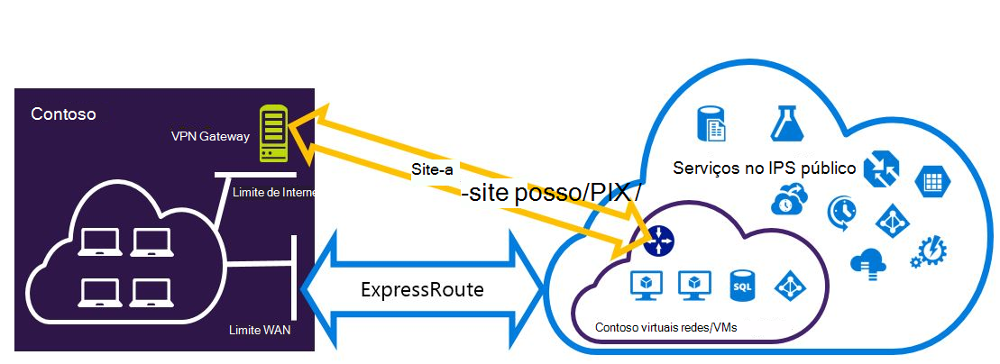
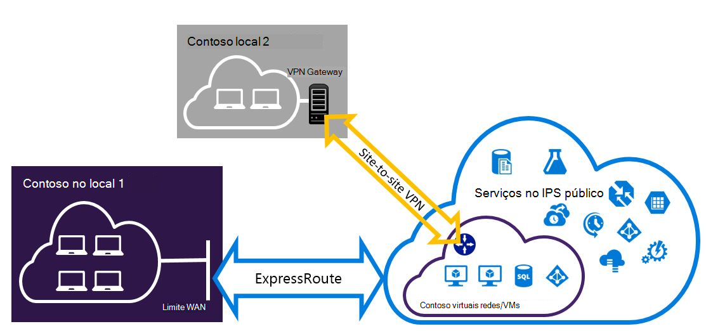

<properties
   pageTitle="Configurar ligações de VPN Expressroute e Site para o Site que podem coexistência para o modelo de implementação do Gestor de recursos | Microsoft Azure"
   description="Este artigo explica o configurar ExpressRoute e uma ligação VPN do Site para o Site que pode coexistência para modelo de Gestor de recursos."
   documentationCenter="na"
   services="expressroute"
   authors="charwen"
   manager="carmonm"
   editor=""
   tags="azure-resource-manager"/>
<tags
   ms.service="expressroute"
   ms.devlang="na"
   ms.topic="get-started-article"
   ms.tgt_pltfrm="na"
   ms.workload="infrastructure-services"
   ms.date="10/10/2016"
   ms.author="charleywen"/>

# Configurar ligações coexistentes ExpressRoute e Site para o Site para o modelo de implementação do Gestor de recursos

> [AZURE.SELECTOR]
- [PowerShell - Gestor de recursos](expressroute-howto-coexist-resource-manager.md)
- [PowerShell - clássico](expressroute-howto-coexist-classic.md)

Ter a capacidade de configurar o Site para o Site VPN e ExpressRoute tem várias vantagens. Pode configurar VPN do Site para o Site como um caminho de activação pós-falha seguro para ExressRoute ou utilizar VPNs de Site para o Site para ligar a sites que não estiver ligados através de ExpressRoute. Abordaremos os passos para configurar ambos os cenários neste artigo. Este artigo aplica-se para o modelo de implementação do Gestor de recursos. Esta configuração não está disponível no portal do Azure.

**Sobre modelos de implementação do Azure**

[AZURE.INCLUDE [vpn-gateway-clasic-rm](../../includes/vpn-gateway-classic-rm-include.md)] 

>[AZURE.IMPORTANT] ExpressRoute circuitos devem ser configurados previamente antes de que siga as instruções abaixo. Certifique-se de que tenha seguido os guias para [criar um circuito ExpressRoute](expressroute-howto-circuit-arm.md) e [configurar o encaminhamento](expressroute-howto-routing-arm.md) antes de seguir os passos abaixo.

## Limitações e limites

- **Encaminhamento de trânsito não é suportado.** Não é possível encaminhar (através do Azure) entre a sua rede local ligado através de VPN do Site para o Site e a sua rede local ligado através de ExpressRoute.
- **Gateway SKU básica não é suportada.** Tem de utilizar um gateway que não sejam básicas SKU para o [ExpressRoute gateway](expressroute-about-virtual-network-gateways.md) e o [VPN gateway](../vpn-gateway/vpn-gateway-about-vpngateways.md).
- **Com base em encaminhar gateway de VPN só é suportada.** Tem de utilizar um [VPN Gateway](../vpn-gateway/vpn-gateway-about-vpngateways.md)com base em encaminhar.
- **Rota estática deverá estar configurada para o gateway VPN.** Se a sua rede local estiver ligado a ExpressRoute e está numa VPN do Site para o Site, tem de ter uma rota estática configurada na sua rede local para encaminhar a ligação VPN do Site para o Site para a Internet pública.
- **Em primeiro lugar, tem de ser configurado ExpressRoute gateway.** Tem de criar o gateway ExpressRoute pela primeira vez antes de adicionar o gateway VPN do Site para o Site.

## Estruturas de configuração

### Configure uma VPN do Site para o Site como um caminho de activação pós-falha para ExpressRoute

Pode configurar uma ligação VPN do Site para o Site como uma cópia de segurança para ExpressRoute. Aplica-se apenas a virtuais redes ligadas para o Azure caminho peering privado. Não existe nenhuma solução baseado em VPN activação pós-falha para serviços acessíveis através do Azure público e peerings da Microsoft. O circuito ExpressRoute é sempre a ligação principal. Irão fluxo de dados através do caminho do Site para o Site VPN apenas se o circuito ExpressRoute falhar.
>[AZURE.NOTE] Enquanto ExpressRoute circuito é preferida ao longo do Site para o Site VPN quando ambos os percursos são iguais, Azure irá utilizar a correspondência de prefixo longuest para escolher a rota no sentido de destino do pacote.

### Configurar uma VPN do Site para o Site para se ligar aos sites não ligados através de ExpressRoute

Pode configurar a sua rede onde alguns sites ligue o diretamente ao Azure ao longo do Site para o Site VPN e alguns sites ligarem através de ExpressRoute. 

>[AZURE.NOTE] Não consegue um configurar uma rede virtual como um router trânsito.

## Selecionar os passos para utilizar

Existem dois conjuntos de procedimentos para escolher a partir de para poder configurar ligações que podem coexistência diferentes. O processo de configuração que selecionar será dependem de se tiver uma rede virtual existente que pretende ligar a, ou que pretende criar uma nova rede virtual.

- Posso não tem um VNet e precisa de criar uma.
    
    Se ainda não tiver uma rede virtual, este procedimento irá guiá-lo através da criação de uma rede virtual nova modelo de implementação do Gestor de recursos de utilização e criação de novas ligações de VPN ExpressRoute e Site para o Site. Para configurar, siga os passos na secção artigo [para criar uma nova rede virtual e ligações coexistentes](#new).

- Já tenho um modelo de implementação do Gestor de recursos VNet.

    Já tem uma rede virtual num local com uma ligação VPN do Site para o Site existente ou ExpressRoute ligação. A secção [para configurar coexsiting ligações para um já existente VNet](#add) irá orientá-lo na eliminar o gateway e, em seguida, criar novas ligações de VPN ExpressRoute e Site para o Site. Tenha em atenção que quando criar novas ligações, os passos têm de ser concluídos numa ordem muito específica. Não utilize as instruções nos outros artigos para criar o gateways e as ligações.

    Este procedimento, criar ligações que podem coexistência será necessitam que eliminar o gateway e, em seguida, configurar gateways novas. Isto significa que terá de tempo de inatividade para as ligações de publicação em local enquanto elimine e recrie o gateway e as ligações, mas não irá precisar de migrar qualquer um dos seus VMs ou serviços a uma nova rede virtual. Os seus VMs e serviços ainda poderão comunicar saída através do Balanceador de carga enquanto configura o gateway se estão configuradas para fazê-lo.

## Para criar uma nova rede virtual e ligações coexistentes

Este procedimento irá guiá-lo a criar um VNet e criar Site para o Site e ligações de ExpressRoute que irão coexistência.
    
1. Terá de instalar a versão mais recente dos cmdlets do Azure PowerShell. Veja [como instalar e configurar o Azure PowerShell](../powershell-install-configure.md) para obter mais informações sobre como instalar os cmdlets do PowerShell. Note que os cmdlets que irá utilizar para esta configuração poderá ser ligeiramente diferentes, o que poderá estar familiarizado com. Certifique-se de que utilizar os cmdlets especificados nestas instruções.

2. Início de sessão sua conta e configurar o ambiente.
    
        login-AzureRmAccount
        Select-AzureRmSubscription -SubscriptionName 'yoursubscription'
        $location = "Central US"
        $resgrp = New-AzureRmResourceGroup -Name "ErVpnCoex" -Location $location

3. Crie uma rede virtual incluindo sub-rede de Gateway. Para obter mais informações sobre a configuração de rede virtual, consulte [configuração de rede Virtual Azure](../virtual-network/virtual-networks-create-vnet-arm-ps.md).

    >[AZURE.IMPORTANT] A sub-rede Gateway tem de ser /27 ou um endereço mais curto prefixo (como /26 ou /25).
    
    Crie um novo VNet.

        $vnet = New-AzureRmVirtualNetwork -Name "CoexVnet" -ResourceGroupName $resgrp.ResourceGroupName -Location $location -AddressPrefix "10.200.0.0/16" 

    Adicione sub-redes.

        Add-AzureRmVirtualNetworkSubnetConfig -Name "App" -VirtualNetwork $vnet -AddressPrefix "10.200.1.0/24"
        Add-AzureRmVirtualNetworkSubnetConfig -Name "GatewaySubnet" -VirtualNetwork $vnet -AddressPrefix "10.200.255.0/24"

    Guarde a configuração de VNet.

        $vnet = Set-AzureRmVirtualNetwork -VirtualNetwork $vnet

4. Crie um gateway ExpressRoute. Para mais informações sobre a configuração de gateway ExpressRoute, consulte o artigo [ExpressRoute configuração de gateway](expressroute-howto-add-gateway-resource-manager.md). O GatewaySKU tem de ser *padrão*, *reversa*ou *UltraPerformance*.

        $gwSubnet = Get-AzureRmVirtualNetworkSubnetConfig -Name "GatewaySubnet" -VirtualNetwork $vnet
        $gwIP = New-AzureRmPublicIpAddress -Name "ERGatewayIP" -ResourceGroupName $resgrp.ResourceGroupName -Location $location -AllocationMethod Dynamic
        $gwConfig = New-AzureRmVirtualNetworkGatewayIpConfig -Name "ERGatewayIpConfig" -SubnetId $gwSubnet.Id -PublicIpAddressId $gwIP.Id
        $gw = New-AzureRmVirtualNetworkGateway -Name "ERGateway" -ResourceGroupName $resgrp.ResourceGroupName -Location $location -IpConfigurations $gwConfig -GatewayType "ExpressRoute" -GatewaySku Standard 

5. Ligar o gateway ExpressRoute para o circuito ExpressRoute. Após ter sido concluído este passo, a ligação entre o seu rede no local e o Azure, através de ExpressRoute, é estabelecida. Para mais informações sobre a operação de ligação, consulte o artigo [VNets de ligação para ExpressRoute](expressroute-howto-linkvnet-arm.md).

        $ckt = Get-AzureRmExpressRouteCircuit -Name "YourCircuit" -ResourceGroupName "YourCircuitResourceGroup"
        New-AzureRmVirtualNetworkGatewayConnection -Name "ERConnection" -ResourceGroupName $resgrp.ResourceGroupName -Location $location -VirtualNetworkGateway1 $gw -PeerId $ckt.Id -ConnectionType ExpressRoute

6. Em seguida, crie o gateway da VPN do Site para o Site. Para mais informações sobre a configuração de gateway VPN, consulte o artigo [configurar um VNet com uma ligação de Site para o Site](../vpn-gateway/vpn-gateway-create-site-to-site-rm-powershell.md). O GatewaySKU tem de ser *padrão*, *reversa*ou *UltraPerformance*. O VpnType tem *RouteBased*.

        $gwSubnet = Get-AzureRmVirtualNetworkSubnetConfig -Name "GatewaySubnet" -VirtualNetwork $vnet
        $gwIP = New-AzureRmPublicIpAddress -Name "VPNGatewayIP" -ResourceGroupName $resgrp.ResourceGroupName -Location $location -AllocationMethod Dynamic
        $gwConfig = New-AzureRmVirtualNetworkGatewayIpConfig -Name "VPNGatewayIpConfig" -SubnetId $gwSubnet.Id -PublicIpAddressId $gwIP.Id
        New-AzureRmVirtualNetworkGateway -Name "VPNGateway" -ResourceGroupName $resgrp.ResourceGroupName -Location $location -IpConfigurations $gwConfig -GatewayType "Vpn" -VpnType "RouteBased" -GatewaySku "Standard"

    Azure VPN gateway suporta a BGP. Pode especificá - EnableBgp no seguinte comando.

        $azureVpn = New-AzureRmVirtualNetworkGateway -Name "VPNGateway" -ResourceGroupName $resgrp.ResourceGroupName -Location $location -IpConfigurations $gwConfig -GatewayType "Vpn" -VpnType "RouteBased" -GatewaySku "Standard" -EnableBgp $true

    Pode encontrar BGP efectuado IP e o número como que o Azure utiliza para o gateway VPN no $azureVpn.BgpSettings.BgpPeeringAddress e $azureVpn.BgpSettings.Asn. Para mais informações, consulte o artigo [Configurar BGP](../vpn-gateway/vpn-gateway-bgp-resource-manager-ps.md) para gateway Azure VPN.

7. Crie um site local entidade de gateway VPN. Este comando não configurar o gateway da VPN no local. Em vez disso,-permite-lhe fornecer as definições de local gateway, tal como o endereço IP público e no local espaço de endereços, para que o gateway Azure VPN possa ligar à mesma.

    Se o seu dispositivo VPN local suporta apenas encaminhamento estático, pode configurar as rotas estáticas da seguinte forma.

        $MyLocalNetworkAddress = @("10.100.0.0/16","10.101.0.0/16","10.102.0.0/16")
        $localVpn = New-AzureRmLocalNetworkGateway -Name "LocalVPNGateway" -ResourceGroupName $resgrp.ResourceGroupName -Location $location -GatewayIpAddress *<Public IP>* -AddressPrefix $MyLocalNetworkAddress

    Se o dispositivo VPN local suporta a BGP e que pretende ativar o encaminhamento dinâmico, tem de saber BGP efectuado IP e o número como que utiliza o seu dispositivo VPN local.

        $localVPNPublicIP = "<Public IP>"
        $localBGPPeeringIP = "<Private IP for the BGP session>"
        $localBGPASN = "<ASN>"
        $localAddressPrefix = $localBGPPeeringIP + "/32"
        $localVpn = New-AzureRmLocalNetworkGateway -Name "LocalVPNGateway" -ResourceGroupName $resgrp.ResourceGroupName -Location $location -GatewayIpAddress $localVPNPublicIP -AddressPrefix $localAddressPrefix -BgpPeeringAddress $localBGPPeeringIP -Asn $localBGPASN

8. Configure o dispositivo VPN local para ligar para o novo gateway de Azure VPN. Para mais informações sobre a configuração de dispositivo VPN, consulte [Configuração do dispositivo VPN](../vpn-gateway/vpn-gateway-about-vpn-devices.md).

9. Ligar o gateway VPN do Site para o Site no Azure para o gateway local.

        $azureVpn = Get-AzureRmVirtualNetworkGateway -Name "VPNGateway" -ResourceGroupName $resgrp.ResourceGroupName
        New-AzureRmVirtualNetworkGatewayConnection -Name "VPNConnection" -ResourceGroupName $resgrp.ResourceGroupName -Location $location -VirtualNetworkGateway1 $azureVpn -LocalNetworkGateway2 $localVpn -ConnectionType IPsec -SharedKey <yourkey>

## Para configurar ligações de coexsiting para um VNet já existente

Se tiver uma rede virtual existente, verifique o tamanho de sub-rede de gateway. Se estiver a sub-rede gateway /28 ou /29, tem de eliminar o gateway de rede virtual e aumentar o tamanho de sub-rede de gateway. Os passos nesta secção Mostrar como fazê-lo.

Se a sub-rede gateway é /27 polegadas ou superior e está ligada à rede virtual através do ExpressRoute, pode ignorar os passos abaixo e prossiga para ["Passo 6 - criar um gateway VPN do Site para o Site"](#vpngw) na secção anterior. 

>[AZURE.NOTE] Ao eliminar o gateway existente, o local local irá perder a ligação à sua rede virtual enquanto estiver a trabalhar nesta configuração. 

1. Terá de instalar a versão mais recente dos cmdlets do Azure PowerShell. Veja [como instalar e configurar o Azure PowerShell](../powershell-install-configure.md) para obter mais informações sobre como instalar os cmdlets do PowerShell. Note que os cmdlets que irá utilizar para esta configuração poderá ser ligeiramente diferentes, o que poderá estar familiarizado com. Certifique-se de que utilizar os cmdlets especificados nestas instruções. 

2. Elimine o gateway ExpressRoute ou VPN do Site para o Site existente. 

        Remove-AzureRmVirtualNetworkGateway -Name <yourgatewayname> -ResourceGroupName <yourresourcegroup>

3. Elimine o Gateway sub-rede.
        
        $vnet = Get-AzureRmVirtualNetwork -Name <yourvnetname> -ResourceGroupName <yourresourcegroup> 
        Remove-AzureRmVirtualNetworkSubnetConfig -Name GatewaySubnet -VirtualNetwork $vnet

4. Adicionar uma sub-rede de Gateway é /27 polegadas ou superior.
    >[AZURE.NOTE] Se não tiver o suficiente endereços IP para a esquerda na sua rede virtual para aumentar o tamanho de sub-rede gateway, terá de adicionar mais espaço de endereços IP.

        $vnet = Get-AzureRmVirtualNetwork -Name <yourvnetname> -ResourceGroupName <yourresourcegroup>
        Add-AzureRmVirtualNetworkSubnetConfig -Name "GatewaySubnet" -VirtualNetwork $vnet -AddressPrefix "10.200.255.0/24"

    Guarde a configuração de VNet.

        $vnet = Set-AzureRmVirtualNetwork -VirtualNetwork $vnet

5. Neste momento, terá uma VNet com sem gateways. Para criar novos gateways e concluir as suas ligações, pode continuar com o [passo 4 - criar um gateway ExpressRoute](#gw), que se encontram no conjunto de passos anterior.

## Para adicionar a configuração de ponto-para-site para o gateway VPN
Pode seguir os passos abaixo para adicionar a configuração de ponto-para-Site ao seu gateway VPN numa configuração coexistência.

1. Adicione conjunto de endereços do cliente VPN. 

        $azureVpn = Get-AzureRmVirtualNetworkGateway -Name "VPNGateway" -ResourceGroupName $resgrp.ResourceGroupName
        Set-AzureRmVirtualNetworkGatewayVpnClientConfig -VirtualNetworkGateway $azureVpn -VpnClientAddressPool "10.251.251.0/24"

2. Carregue o certificado de raiz VPN para Azure para o gateway VPN. Neste exemplo, é assumido que o certificado de raiz está armazenado no computador local onde os seguintes cmdlets do PowerShell são executados. 

        $p2sCertFullName = "RootErVpnCoexP2S.cer"
        $p2sCertMatchName = "RootErVpnCoexP2S"
        $p2sCertToUpload=get-childitem Cert:\CurrentUser\My | Where-Object {$_.Subject -match $p2sCertMatchName}
        if ($p2sCertToUpload.count -eq 1){
            write-host "cert found"
        } else {
            write-host "cert not found"
            exit
        } 
        $p2sCertData = [System.Convert]::ToBase64String($p2sCertToUpload.RawData)
        Add-AzureRmVpnClientRootCertificate -VpnClientRootCertificateName $p2sCertFullName -VirtualNetworkGatewayname $azureVpn.Name -ResourceGroupName $resgrp.ResourceGroupName -PublicCertData $p2sCertData

Para mais informações sobre o ponto para Site VPN, consulte o artigo [Configurar uma ligação ponto-para-Site](../vpn-gateway/vpn-gateway-howto-point-to-site-rm-ps.md).

## Próximos passos

Para mais informações sobre ExpressRoute, consulte as [ExpressRoute FAQ](expressroute-faqs.md).
