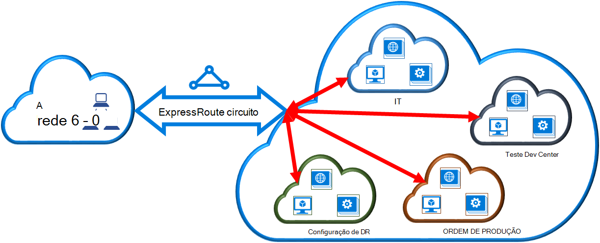

<properties
   pageTitle="Ligar uma rede virtual a um circuito ExpressRoute ao utilizar o modelo de implementação clássica e PowerShell | Microsoft Azure"
   description="Este artigo fornece uma descrição geral sobre como ligar redes virtuais (VNets) ExpressRoute circuitos utilizando o modelo de implementação clássica e PowerShell."
   services="expressroute"
   documentationCenter="na"
   authors="ganesr"
   manager="carmonm"
   editor=""
   tags="azure-service-management"/>
<tags
   ms.service="expressroute"
   ms.devlang="na"
   ms.topic="article"
   ms.tgt_pltfrm="na"
   ms.workload="infrastructure-services"
   ms.date="10/10/2016"
   ms.author="ganesr" />

# Ligar uma rede virtual a um circuito ExpressRoute

> [AZURE.SELECTOR]
- [Portal Azure - Gestor de recursos](expressroute-howto-linkvnet-portal-resource-manager.md)
- [PowerShell - Gestor de recursos](expressroute-howto-linkvnet-arm.md)
- [PowerShell - clássico](expressroute-howto-linkvnet-classic.md)

Este artigo irá ajudá-lo ligar redes virtuais (VNets) a Azure ExpressRoute circuitos ao utilizar o modelo de implementação clássica e PowerShell. Redes virtuais podem ser na mesma subscrição ou podem ser parte da subscrição do outra.

**Sobre modelos de implementação do Azure**

[AZURE.INCLUDE [vpn-gateway-clasic-rm](../../includes/vpn-gateway-classic-rm-include.md)]

## Pré-requisitos de configuração

1. Tem a versão mais recente dos módulos Azure PowerShell. Pode transferir os módulos PowerShell mais recentes da secção da [página de transferências do Azure](https://azure.microsoft.com/downloads/)PowerShell. Siga as instruções no [artigo como instalar e configurar o Azure PowerShell](../powershell-install-configure.md) para obter orientações passo a passo sobre como configurar o seu computador para utilizar os módulos Azure PowerShell.
2. Tem de rever a [Pré-requisitos](expressroute-prerequisites.md), [requisitos de encaminhamento](expressroute-routing.md)e [fluxos de trabalho](expressroute-workflows.md) antes de começar a configuração.
3. Tem de ter um circuito ExpressRoute ativo.
    - Siga as instruções para [criar um circuito ExpressRoute](expressroute-howto-circuit-classic.md) e que o seu fornecedor de conectividade ativar o circuito.
    - Certifique-se de que tem efectuado privado do Azure configurado para o seu circuito. Consulte o artigo [configurar o encaminhamento](expressroute-howto-routing-classic.md) para encaminhar obter instruções.
    - Certifique-se de que efectuado privado Azure está configurado e a efectuado BGP entre a rede e o Microsoft para cima, para que pode ativar a conectividade de fim para fim.
    - Tem de ter uma rede virtual e um gateway de rede virtual criado e totalmente aprovisionado. Siga as instruções para [Configurar uma rede virtual para ExpressRoute](expressroute-howto-vnet-portal-classic.md).

Pode ligar até 10 redes virtuais a um circuito ExpressRoute. Todas as redes virtuais tem de ser na mesma geopolítica região. Pode ligar um grande número de redes virtuais ao seu circuito ExpressRoute ou redes virtuais ligação que estão noutras regiões geopolítica se activou o suplemento do ExpressRoute premium. Consulte as [FAQ](expressroute-faqs.md) para obter mais detalhes sobre o suplemento premium.

## Ligar uma rede virtual na mesma subscrição para um circuito

Pode ligar uma rede virtual a um circuito ExpressRoute utilizando o cmdlet seguinte. Certifique-se de que o gateway de rede virtual é criado e está pronto para ligação antes de executar o cmdlet.

    New-AzureDedicatedCircuitLink -ServiceKey "*****************************" -VNetName "MyVNet"
    Provisioned

## Ligar uma rede virtual numa subscrição diferente para um circuito

Pode partilhar um circuito ExpressRoute em múltiplas subscrições. A figura seguinte mostra um simples esquemáticos de como funciona a partilha para ExpressRoute circuitos nos múltiplas subscrições.

Cada um das nuvens mais pequenas dentro da nuvem de grandes dimensões é utilizada para representar subscrições que pertencem a diferentes departamentos dentro de uma organização. Cada um dos departamentos dentro da empresa pode utilizar os seus próprios subscrição para implementar os departamentos, dos seus serviços – mas pode partilhar um único circuito de ExpressRoute para ligar novamente a sua rede no local. Um único departamento (neste exemplo: IT) podem ser proprietários de circuito ExpressRoute. Outras subscrições para dentro da empresa podem utilizar o circuito ExpressRoute.

>[AZURE.NOTE] Taxas de conectividade e de largura de banda para o circuito dedicado serão aplicadas ao proprietário de circuito ExpressRoute. Todas as redes virtuais partilham a mesma largura de banda.

### Administração

O *proprietário de circuito* for o administrador coadministrator da subscrição na qual o circuito ExpressRoute é criado. O proprietário de circuito pode autorizar administradores/coadministrators de outras subscrições, designadas de *utilizadores de circuito*, a utilizar o circuito dedicado que eles próprios. Os utilizadores de circuito autorizados a utilizar ExpressRoute circuito a organização podem ligar a rede virtual na sua subscrição ao circuito ExpressRoute após estão autorizados.

O proprietário de circuito tem power para modificar e revogar autorizações em qualquer altura. Revogar a autorização irá resultar em todas as ligações a ser eliminadas da subscrição cujo acesso foi revogado.

### Operações de proprietário de circuito

#### Criar uma autorizações

O proprietário de circuito autoriza os administradores de outras subscrições para a utilizar o circuito especificado. No exemplo seguinte, o administrador do circuito (Contoso TI) permite ao administrador de outra subscrição (Dev Center teste) para criar uma ligação até duas redes virtuais ao circuito. O administrador de TI Contoso permite isto ao especificar o ID do Microsoft teste Dev Center. O cmdlet não envia e-mail para o ID do Microsoft especificado. O proprietário de circuito tem de explicitamente notificar o proprietário do subscrição que a autorização está concluída.

    New-AzureDedicatedCircuitLinkAuthorization -ServiceKey "**************************" -Description "Dev-Test Links" -Limit 2 -MicrosoftIds 'devtest@contoso.com'

    Description         : Dev-Test Links
    Limit               : 2
    LinkAuthorizationId : **********************************
    MicrosoftIds        : devtest@contoso.com
    Used                : 0

#### Rever autorizações

O proprietário de circuito pode rever autorizações todos os que são enviadas num determinado circuito ao executar o cmdlet seguinte:

    Get-AzureDedicatedCircuitLinkAuthorization -ServiceKey: "**************************"

    Description         : EngineeringTeam
    Limit               : 3
    LinkAuthorizationId : ####################################
    MicrosoftIds        : engadmin@contoso.com
    Used                : 1

    Description         : MarketingTeam
    Limit               : 1
    LinkAuthorizationId : @@@@@@@@@@@@@@@@@@@@@@@@@@@@@@@@@@@@
    MicrosoftIds        : marketingadmin@contoso.com
    Used                : 0

    Description         : Dev-Test Links
    Limit               : 2
    LinkAuthorizationId : &&&&&&&&&&&&&&&&&&&&&&&&&&&&&&&&&&&&
    MicrosoftIds        : salesadmin@contoso.com
    Used                : 2

#### Atualizar autorizações

O proprietário de circuito pode modificar autorizações utilizando o cmdlet seguinte:

    Set-AzureDedicatedCircuitLinkAuthorization -ServiceKey "**************************" -AuthorizationId "&&&&&&&&&&&&&&&&&&&&&&&&&&&&"-Limit 5

    Description         : Dev-Test Links
    Limit               : 5
    LinkAuthorizationId : &&&&&&&&&&&&&&&&&&&&&&&&&&&&&&&&&&&&&&
    MicrosoftIds        : devtest@contoso.com
    Used                : 0

#### Eliminar autorizações

O proprietário de circuito pode revogar/eliminar autorizações ao utilizador ao executar o cmdlet seguinte:

    Remove-AzureDedicatedCircuitLinkAuthorization -ServiceKey "*****************************" -AuthorizationId "###############################"

### Operações de circuito do utilizador

#### Rever autorizações

O utilizador de circuito pode rever autorizações utilizando o cmdlet seguinte:

    Get-AzureAuthorizedDedicatedCircuit

    Bandwidth                        : 200
    CircuitName                      : ContosoIT
    Location                         : Washington DC
    MaximumAllowedLinks              : 2
    ServiceKey                       : &&&&&&&&&&&&&&&&&&&&&&&&&&&&&&&&&&&&
    ServiceProviderName              : equinix
    ServiceProviderProvisioningState : Provisioned
    Status                           : Enabled
    UsedLinks                        : 0

#### Resgatar autorizações de ligação

O utilizador de circuito pode executar o cmdlet seguinte para resgatar uma autorização de ligação:

    New-AzureDedicatedCircuitLink –servicekey "&&&&&&&&&&&&&&&&&&&&&&&&&&" –VnetName 'SalesVNET1'

    State VnetName
    ----- --------
    Provisioned SalesVNET1

## Próximos passos

Para mais informações sobre ExpressRoute, consulte as [ExpressRoute FAQ](expressroute-faqs.md).
