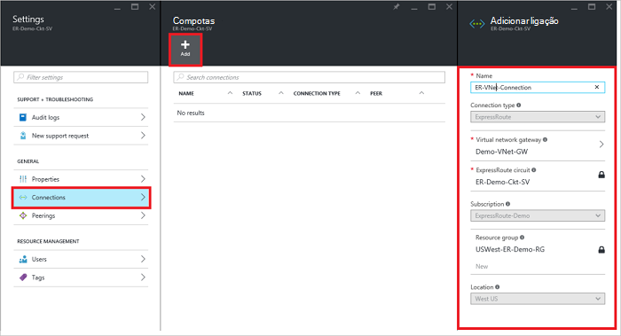
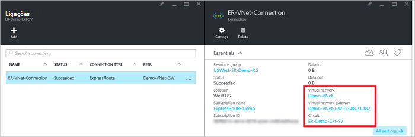

<properties
   pageTitle="Ligar uma rede virtual a um circuito ExpressRoute ao utilizar o modelo de implementação do Gestor de recursos e o portal do Azure | Microsoft Azure"
   description="Este artigo fornece uma descrição geral sobre como ligar redes virtuais (VNets) ExpressRoute circuitos."
   services="expressroute"
   documentationCenter="na"
   authors="cherylmc"
   manager="carmonm"
   editor=""
   tags="azure-resource-manager"/>
<tags
   ms.service="expressroute"
   ms.devlang="na"
   ms.topic="article"
   ms.tgt_pltfrm="na"
   ms.workload="infrastructure-services"
   ms.date="10/10/2016"
   ms.author="cherylmc" />

# Ligar uma rede virtual a um circuito ExpressRoute

> [AZURE.SELECTOR]
- [Portal Azure - Gestor de recursos](expressroute-howto-linkvnet-portal-resource-manager.md)
- [PowerShell - Gestor de recursos](expressroute-howto-linkvnet-arm.md)
- [PowerShell - clássico](expressroute-howto-linkvnet-classic.md)

Este artigo irá ajudá-lo ligar redes virtuais (VNets) a Azure ExpressRoute circuitos ao utilizar o modelo de implementação do Gestor de recursos e o portal do Azure. Redes virtuais podem ser na mesma subscrição ou podem ser parte da subscrição do outra.

**Sobre modelos de implementação do Azure**

[AZURE.INCLUDE [vpn-gateway-clasic-rm](../../includes/vpn-gateway-classic-rm-include.md)]

## Pré-requisitos de configuração

- Certifique-se de que reviu a [Pré-requisitos](expressroute-prerequisites.md), [Encaminhamento requisitos](expressroute-routing.md)e [fluxos de trabalho](expressroute-workflows.md) antes de começar a configuração.
- Tem de ter um circuito ExpressRoute ativo.
    - Siga as instruções para [criar um circuito ExpressRoute](expressroute-howto-circuit-arm.md) e ter o circuito ativado pelo seu fornecedor de conectividade.

    - Certifique-se de que tem efectuado privado do Azure configurado para o seu circuito. Consulte o artigo [configurar o encaminhamento](expressroute-howto-routing-portal-resource-manager.md) para encaminhar obter instruções.

    - Certifique-se de que efectuado privado Azure está configurado e a efectuado BGP entre a rede e o Microsoft para cima, para que pode ativar a conectividade de fim para fim.

    - Certifique-se de que tem uma rede virtual e um gateway de rede virtual criado e totalmente aprovisionado. Siga as instruções para criar um [VPN gateway](../articles/vpn-gateway/vpn-gateway-howto-site-to-site-resource-manager-portal.md) (seguem apenas, como os passos 1-5).

Pode ligar até 10 redes virtuais a um circuito ExpressRoute padrão. Todas as redes virtuais tem de ser na mesma região geopolítica ao utilizar um circuito ExpressRoute padrão. Pode ligar um redes virtuais fora da região geopolítica do circuito ExpressRoute ou ligar um grande número de redes virtuais ao seu circuito ExpressRoute se activou o suplemento do ExpressRoute premium. Consulte as [FAQ](expressroute-faqs.md) para obter mais detalhes sobre o suplemento premium.

## Ligar uma rede virtual na mesma subscrição para um circuito

### Para criar uma ligação

1. Certifique-se de que seu ExpressRoute circuito e a efectuado privado Azure tiverem sido configurados com êxito. Siga as instruções em [criar um circuito ExpressRoute](expressroute-howto-circuit-arm.md) e [Encaminhamento de configurar](expressroute-howto-routing-arm.md). Seu circuito ExpressRoute deverá ter um aspeto semelhante a imagem seguinte.

    

    >[AZURE.NOTE] Informações sobre a configuração BGP não aparecerão se o fornecedor de camada 3 configurado o seu peerings. Se o seu circuito está num Estado aprovisionado, deverá conseguir criar ligações.

2. Agora pode iniciar uma ligação para ligar o seu gateway de rede virtual ao seu circuito ExpressRoute de aprovisionamento. Clique em **ligação** > **Adicionar** para abrir o pá **Adicionar ligação** e, em seguida, configure os valores. Consulte o seguinte exemplo de referência.

      

3. Após a sua ligação tiver sido configurada com êxito, o objeto de ligação mostrará informações para a ligação.

    

### Para eliminar uma ligação

Pode eliminar uma ligação ao selecionar o ícone de **Eliminar** no pá para a sua ligação.

## Ligar uma rede virtual numa subscrição diferente para um circuito

Neste momento, não é possível ligar redes virtuais entre subscrições utilizando o portal do Azure. No entanto, pode utilizar o PowerShell para o fazer. Consulte o artigo [PowerShell](expressroute-howto-linkvnet-arm.md) para obter mais informações.

## Próximos passos

Para mais informações sobre ExpressRoute, consulte as [ExpressRoute FAQ](expressroute-faqs.md).
