<properties
   pageTitle="Como configurar o encaminhamento para um circuito ExpressRoute utilizando o Portal do Azure | Microsoft Azure"
   description="Este artigo explica os passos para a criação e de aprovisionamento privado, público e Microsoft efectuado num circuito ExpressRoute. Este artigo também mostra-lhe como verificar o estado, atualizar ou eliminar peerings para sua circuito."
   documentationCenter="na"
   services="expressroute"
   authors="cherylmc"
   manager="carmonm"
   editor=""
   tags="azure-resource-manager"/>
<tags
   ms.service="expressroute"
   ms.devlang="na"
   ms.topic="hero-article" 
   ms.tgt_pltfrm="na"
   ms.workload="infrastructure-services"
   ms.date="10/10/2016"
   ms.author="cherylmc"/>

# Criar e modificar o encaminhamento para um circuito ExpressRoute

> [AZURE.SELECTOR]
[Portal Azure - Gestor de recursos](expressroute-howto-routing-portal-resource-manager.md)
[PowerShell - Gestor de recursos](expressroute-howto-routing-arm.md)
[PowerShell - clássico](expressroute-howto-routing-classic.md)

Este artigo explica os passos para criar e gerir a configuração de encaminhamento para um circuito ExpressRoute utilizando o portal do Azure e o modelo de implementação do Gestor de recursos.

**Sobre modelos de implementação do Azure**

[AZURE.INCLUDE [vpn-gateway-clasic-rm](../../includes/vpn-gateway-classic-rm-include.md)] 

## Pré-requisitos de configuração

- Certifique-se de que reviu a página de [Pré-requisitos](expressroute-prerequisites.md) , a página de [Encaminhamento de requisitos](expressroute-routing.md) e página [fluxos de trabalho](expressroute-workflows.md) antes de começar a configuração.
- Tem de ter um circuito ExpressRoute ativo. Siga as instruções para [criar um circuito ExpressRoute](expressroute-howto-circuit-arm.md) e ter o circuito ativado pelo seu fornecedor de conectividade antes de continuar. O circuito ExpressRoute tem de ser num Estado aprovisionado e ativado para que possam executar os cmdlets descritos abaixo.

Estas instruções apenas se aplicam a circuitos criados com fornecedores de serviço, que oferece serviços de conectividade a camada 2. Se estiver a utilizar um fornecedor de serviços que oferece serviços de Layer 3 geridos (normalmente uma IPVPN, como MPLS), o seu fornecedor de conectividade configurar e gerir o encaminhamento para. 

>[AZURE.IMPORTANT] Vamos atualmente não anunciam peerings configurados pelo fornecedores de serviço através do portal de gestão do serviço. Estamos a trabalhar sobre ativar esta funcionalidade mais rapidamente. Verifique se existem com o seu fornecedor de serviços antes de configurar BGP peerings.

Pode configurar um, dois ou todos os três peerings (público privado, Azure Azure e Microsoft) para um circuito ExpressRoute. Pode configurar peerings por qualquer ordem que escolher. No entanto, deve certificar-se de que concluir a configuração de cada um deles peering cada vez. 

## Efectuado privado Azure

Esta secção fornece instruções sobre como criar, aceder, atualizar e eliminar a configuração peering privada Azure para um circuito ExpressRoute. 

### Para criar efectuado privado Azure

1. Configure o circuito ExpressRoute. Certifique-se de que o circuito totalmente está aprovisionado pelo fornecedor de conectividade antes de continuar.

    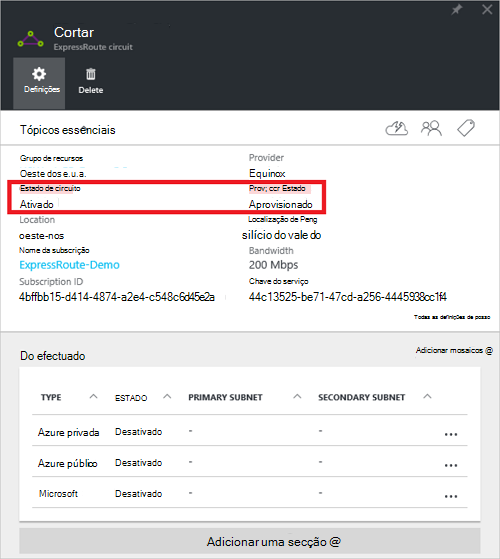

2. Configure o Azure efectuado privado para o circuito. Certifique-se de que tem os seguintes itens antes de prosseguir com os passos seguintes:

    - Um /30 sub-rede para a ligação principal. Não tem de ser parte de qualquer espaço de endereços reservado para redes virtuais.
    - Um /30 sub-rede para a ligação secundária. Não tem de ser parte de qualquer espaço de endereços reservado para redes virtuais.
    - Um ID de VLAN válido para estabelecer este efectuado no. Certifique-se de que nenhuma efectuado no circuito utiliza o mesmo ID VLAN.
    - COMO número para efectuado. Pode utilizar 2 bytes com sinal e 4 bytes com sinal como números. Pode utilizar um privado como número para este efectuado. Certifique-se de que não está a utilizar 65515.
    - Um hash MD5 se optar por utilizar um. **Isto é opcional**.

3. Selecione a linha peering Azure privado, conforme apresentado abaixo.
    
    
    

4. Configure efectuado privado. A imagem abaixo mostra um exemplo de configuração.

    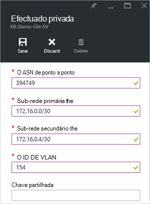

    
5. Guarde a configuração depois de ter especificado todos os parâmetros. Assim que a configuração for aceite com êxito, verá algo semelhante ao exemplo abaixo.

    
    

### Para ver os detalhes Azure privados efectuados

Pode ver as propriedades do Azure efectuado privadas ao selecionar a efectuado.

### Para atualizar o Azure configuração privada efectuada

Pode selecionar a linha do efectuado e modificar as propriedades peering. 

### Para eliminar efectuado privado Azure

Pode remover a sua configuração peering selecionando o ícone de eliminar, conforme apresentado abaixo.

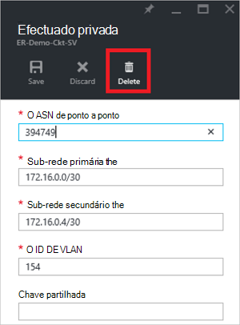

## Efectuado público Azure

Esta secção fornece instruções sobre como criar, aceder, atualizar e eliminar a configuração peering pública Azure para um circuito ExpressRoute. 

### Para criar efectuado público Azure

1. Configure ExpressRoute circuito. Certifique-se de que o circuito totalmente está aprovisionado pelo fornecedor de conectividade antes de continuar ainda mais.

    

2. Configure o Azure efectuado público para o circuito. Certifique-se de que tem os seguintes itens antes de prosseguir com os passos seguintes:

    - Um /30 sub-rede para a ligação principal. 
    - Um /30 sub-rede para a ligação secundária. 
    - Todos os endereços IP utilizados para configurar esta efectuado tem de ser válidos endereços IPv4 do públicos.
    - Um ID de VLAN válido para estabelecer este efectuado no. Certifique-se de que nenhuma efectuado no circuito utiliza o mesmo ID VLAN.
    - COMO número para efectuado. Pode utilizar 2 bytes com sinal e 4 bytes com sinal como números.
    - Um hash MD5 se optar por utilizar um. **Isto é opcional**.

3. Selecione a linha de peering pública Azure, conforme apresentado abaixo.
    
    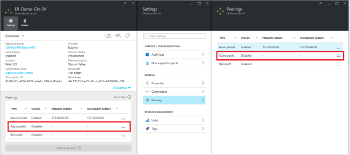
    

4. Configure efectuado público. A imagem abaixo mostra um exemplo de configuração.

    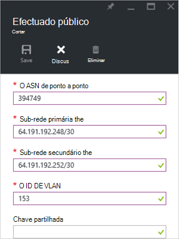

    
5. Guarde a configuração depois de ter especificado todos os parâmetros. Assim que a configuração for aceite com êxito, verá algo semelhante ao exemplo abaixo.

    
    

### Para ver os detalhes efectuados de públicos Azure

Pode ver as propriedades do Azure público efectuado ao selecionar a efectuado.

### Para atualizar o Azure configuração pública efectuada

Pode selecionar a linha do efectuado e modificar as propriedades peering. 

### Para eliminar efectuado público Azure

Pode remover a sua configuração peering selecionando o ícone de eliminar, conforme apresentado abaixo.

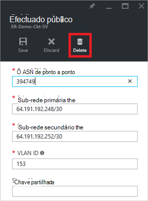

## Microsoft efectuado

Esta secção fornece instruções sobre como criar, aceder, atualizar e eliminar a configuração de peering da Microsoft para um circuito ExpressRoute. 

### Para criar efectuado da Microsoft

1. Configure ExpressRoute circuito. Certifique-se de que o circuito totalmente está aprovisionado pelo fornecedor de conectividade antes de continuar ainda mais.

    

2. Configure o Microsoft efectuado para o circuito. Certifique-se de que tem as seguintes informações antes de continuar.

    - Um /30 sub-rede para a ligação principal. Tem de ser um público IPv4 prefixo válido propriedade por si e registada num RIR / TIR.
    - Um /30 sub-rede para a ligação secundária. Tem de ser um público IPv4 prefixo válido propriedade por si e registada num RIR / TIR.
    - Um ID de VLAN válido para estabelecer este efectuado no. Certifique-se de que nenhuma efectuado no circuito utiliza o mesmo ID VLAN.
    - COMO número para efectuado. Pode utilizar 2 bytes com sinal e 4 bytes com sinal como números.
    - **Anunciada prefixos:** Tem de fornecer uma lista de todos os prefixos que planear para anunciar sobre a sessão BGP. Apenas prefixos de endereço IP públicos são aceites. Pode enviar uma lista de separados por vírgulas se planeia enviar um conjunto de prefixos. Estes prefixos tem de estar registados para si num RIR / TIR.
    - **Cliente ASN:** Se estiver prefixos de publicidade que não estão registados para efectuado como número, pode especificar o número de como a que estão registados. **Isto é opcional**.
    - **Encaminhamento de registo de nome:** Pode especificar o RIR / TIR contra a qual o número e prefixos são registados. **Isto é opcional.**
    - Um hash MD5, se optar por utilizar um. **Isto é opcional.**
    
3. Pode selecionar efectuado que pretende configurar conforme apresentado abaixo. Selecione a linha peering da Microsoft.
    
    
    

4.  Configure o Microsoft efectuado. A imagem abaixo mostra um exemplo de configuração.

    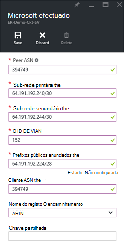

    
5. Guarde a configuração depois de ter especificado todos os parâmetros. 

    Se o seu circuito faz a uma validação necessário Estado (como mostrado abaixo), tem de abrir um bilhetes de suporte para mostrar prova da propriedade de prefixos a nossa equipa de suporte.  
    
    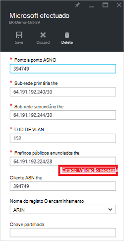

    Pode abrir um bilhetes de suporte diretamente a partir do portal conforme apresentado abaixo   
    
    

6. Assim que a configuração for aceite com êxito, verá algo semelhante ao exemplo abaixo.

    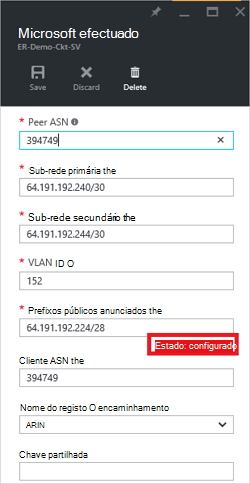
    

### Para ver os detalhes de efectuado da Microsoft

Pode ver as propriedades do Azure público efectuado ao selecionar a efectuado.

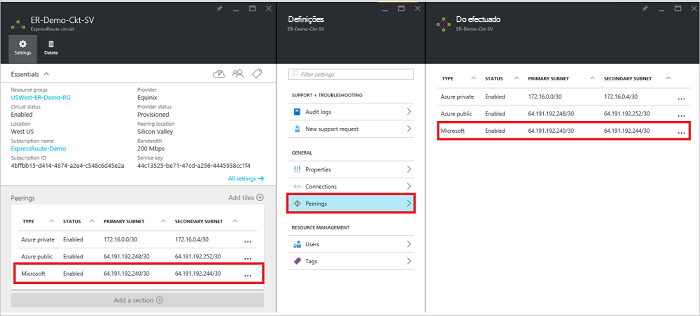

### Para atualizar a configuração do Microsoft efectuada

Pode selecionar a linha do efectuado e modificar as propriedades peering. 

### Para eliminar efectuado da Microsoft

Pode remover a sua configuração peering selecionando o ícone de eliminar, conforme apresentado abaixo.

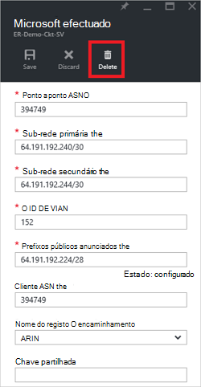

## Próximos passos

Próximo passo, [ligação um VNet para um circuito ExpressRoute](expressroute-howto-linkvnet-arm.md).

-  Para mais informações sobre ExpressRoute fluxos de trabalho, consulte o artigo [ExpressRoute fluxos de trabalho](expressroute-workflows.md).

-  Para mais informações sobre circuito efectuado, consulte o artigo [ExpressRoute circuitos e encaminhamento de domínios](expressroute-circuit-peerings.md).

-  Para mais informações sobre como trabalhar com redes virtuais, consulte o artigo [Descrição geral de rede Virtual](../virtual-network/virtual-networks-overview.md).

