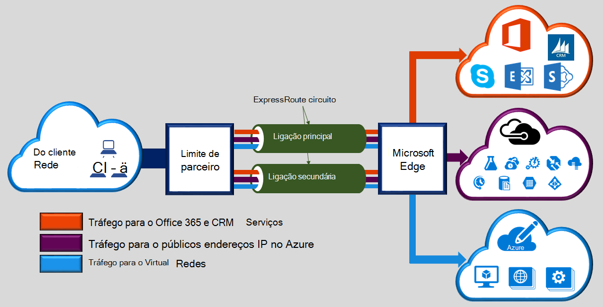
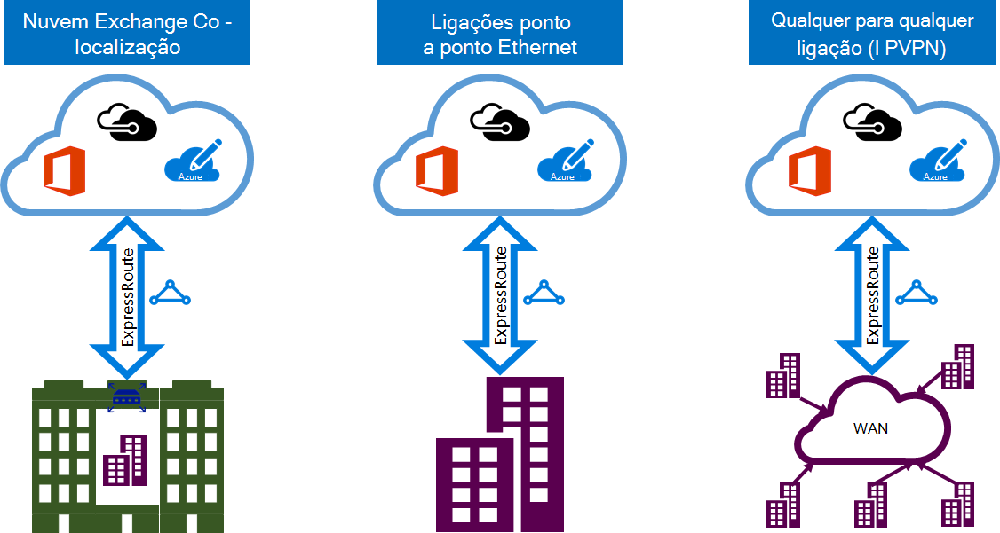

<properties 
   pageTitle="Introdução ao ExpressRoute | Microsoft Azure"
   description="Esta página fornece uma descrição geral do serviço de ExpressRoute, incluindo como uma ligação de ExpressRoute funciona."
   documentationCenter="na"
   services="expressroute"
   authors="cherylmc"
   manager="carmonm"
   editor=""/>
<tags 
   ms.service="expressroute"
   ms.devlang="na"
   ms.topic="get-started-article" 
   ms.tgt_pltfrm="na"
   ms.workload="infrastructure-services" 
   ms.date="10/10/2016"
   ms.author="cherylmc"/>

# Descrição geral técnica de ExpressRoute

Microsoft Azure ExpressRoute permite-lhe expandir redes no local para a nuvem da Microsoft através de uma ligação privada dedicada facilitada por um fornecedor de conectividade. Com ExpressRoute, pode estabelecer ligações a serviços em nuvem Microsoft, como o Microsoft Azure, Office 365 e CRM Online. Conectividade pode ser a partir de uma rede (IP VPN) qualquer para qualquer, uma rede de Ethernet ponto a ponto ou uma ligação de publicação em virtual através de um fornecedor de conectividade a uma funcionalidade de cocriação localização. ExpressRoute ligações não aceda através da Internet pública. Esta opção permite-ligações ExpressRoute oferecer mais fiabilidade, velocidades mais rápidas, latências inferiores e superior segurança que as ligações típicas através da Internet.

**Os benefícios chaves incluem:**

- 3 conectividade entre a sua rede no local e o Microsoft Cloud através de um fornecedor de conectividade de camadas. Conectividade pode ser a partir de uma rede de qualquer para qualquer (IPVPN), uma ligação ponto a ponto de Ethernet, ou através de uma ligação de publicação em virtual através de uma conta do exchange Ethernet.
- Conectividade aos serviços em nuvem Microsoft através de todas as regiões na região geopolítica.
- Conectividade global aos serviços da Microsoft em todas as regiões com o suplemento do ExpressRoute premium.
- Dinâmico encaminhamento entre a rede e Microsoft através de protocolos padrão da indústria (BGP).
- Incorporados redundância nos cada localização peering para uma maior fiabilidade.
- Tempo de utilização de ligação [SLA](https://azure.microsoft.com/support/legal/sla/).
- QoS e suporte para múltiplos classes de serviço para aplicações especiais, tal como o Skype para empresas.

Consulte as [ExpressRoute FAQ](expressroute-faqs.md) para obter mais detalhes.

## Como me posso ligar a minha rede para a Microsoft utilizando ExpressRoute?

Pode criar uma ligação entre a sua rede no local e na nuvem da Microsoft de três formas diferentes:

### Cocriação que se encontra no exchange nuvem

Se estiver localizado cocriação numa instalação com o exchange uma nuvem, pode encomendar ligações de publicação em virtual na nuvem da Microsoft através de intercâmbio de Ethernet o fornecedor de cocriação localização. Fornecedores de cocriação localização podem oferecer ligações de publicação em camada 2 ou geridas Layer 3 publicação em várias ligações entre sua infraestrutura da funcionalidade de cocriação localização e na nuvem da Microsoft.

### Ligações de Ethernet ponto a ponto 

Pode ligar os seus escritórios/centros de dados de no local para a nuvem da Microsoft através de ligações de Ethernet ponto a ponto. Fornecedores de Ethernet ponto a ponto podem oferecer ligações camada 2, ou geridos Layer 3 ligações entre o site e na nuvem da Microsoft.

### Qualquer para qualquer redes de (IPVPN)

Pode integrar o seu WAN com a nuvem da Microsoft. Fornecedores de IPVPN (normalmente MPLS VPN) oferecem qualquer para qualquer conectividade entre o seu filiais e centros de dados. Pode ser interligada na nuvem da Microsoft para o seu WAN de que tal como qualquer outro filial. Fornecedores de WAN oferecem normalmente gerida Layer 3 conectividade. Funcionalidades e capacidades de ExpressRoute são idênticas tudo em todos os modelos de conectividade acima. 

Fornecedores de conectividade podem oferecer um ou mais modelos de conectividade. Pode trabalhar com o seu fornecedor de conectividade para escolher o modelo que funciona melhor por si.

## Funcionalidades de ExpressRoute

ExpressRoute suporta as seguintes funcionalidades e capacidades: 

### Conectividade de camada 3

Microsoft utilizações protocolo padrão da indústria dinâmico encaminhamento (BGP) para exchange encaminha entre a sua rede no local, o seu instâncias no Azure e Microsoft endereços públicos.  Vamos estabelecer múltiplas BGP sessões, com a sua rede para os perfis de tráfego diferentes. Podem encontrar mais detalhes no artigo [ExpressRoute circuito e encaminhamento de domínios](expressroute-circuit-peerings.md) .

### Redundância

Cada circuito ExpressRoute consiste em duas ligações dois routers de limite de Microsoft Enterprise (MSEEs) a partir do fornecedor de conectividade / seu limite de rede. Microsoft irão necessitar dupla BGP ligação a partir do fornecedor de conectividade / seu lado – um para cada MSEE. Pode optar por não implementar dispositivos redundantes / Ethernet circuitos e no seu final. No entanto, fornecedores de conectividade utilizam dispositivos redundantes para se certificar de que as ligações são a editora Microsoft de uma forma redundante. Uma configuração de conectividade de Layer 3 redundante é um requisito para os nossos [SLA](https://azure.microsoft.com/support/legal/sla/) seja válido. 

### Conectividade ao serviços em nuvem da Microsoft

[AZURE.INCLUDE [expressroute-office365-include](../../includes/expressroute-office365-include.md)]

Ligações de ExpressRoute ativar o acesso aos seguintes serviços:

- Serviços do Microsoft Azure
- Serviços do Microsoft Office 365
- Serviços Microsoft CRM Online 
 
Pode visitar a página de [Perguntas mais frequentes do ExpressRoute](expressroute-faqs.md) para uma lista detalhada dos serviços que são suportados sobre ExpressRoute.

### Conectividade ao todas as regiões dentro de uma região geopolítica

Pode ligar-se para a Microsoft das nossas [efectuadas localizações](expressroute-locations.md) e tem acesso a todas as regiões dentro da região geopolítica. 

Por exemplo, se ligado para a Microsoft na Amsterdam através de ExpressRoute, terá acesso a todos os serviços de nuvem Microsoft alojado no Norte e Europa Ocidental. Consulte o artigo [efectuadas localizações e parceiros de ExpressRoute](expressroute-locations.md) para uma descrição geral das regiões geopolíticas, associados regiões de nuvem da Microsoft e correspondentes ExpressRoute efectuadas localizações.

### Conectividade global com o suplemento do ExpressRoute premium

Pode ativar a funcionalidade de suplemento premium ExpressRoute alargar a conectividade ao longo dos limites geopolíticos. Por exemplo, se estiver ligado para a Microsoft na Amsterdam através de ExpressRoute, terá acesso a todos os serviços em nuvem Microsoft alojados em todas as regiões em todo o mundo (nuvens nacionais são excluídos). Pode aceder a serviços implementados na América do Sul ou Austrália da mesma forma que aceder às regiões da Europa Oeste e América do Norte.

### Ecossistema de parceiro de conectividade de RTF

ExpressRoute tem uma ecossistema constantemente crescente dos fornecedores de conectividade e parceiros de SI. Pode referir-se para o artigo [fornecedores de ExpressRoute e localizações](expressroute-locations.md) para as informações mais recentes.

### Conectividade ao nacionais nuvens recortada

Microsoft opera ambientes de nuvem isoladas para as regiões geopolíticas especiais e segmentos de clientes. Referem-se para a página de [fornecedores de ExpressRoute e localizações](expressroute-locations.md) para obter uma lista das nuvens recortada nacionais e operadoras.

### Opções de largura de banda suportados

Pode comprar circuitos ExpressRoute para uma vasta gama de larguras de banda. A lista de larguras de banda suportadas está apresentada abaixo. Certifique-se de que contacta o seu fornecedor de conectividade para determinar a lista de larguras de banda suportadas fornecem.

- 50 Mbps
- 100 Mbps
- 200 Mbps
- 500 Mbps
- 1 Gbps
- 2 Gbps
- 5 Gbps
- 10 Gbps

### Dimensionamento dinâmico da largura de banda

Tem a capacidade para aumentar a largura de banda de circuito ExpressRoute (numa base esforço melhor) sem ter de suprimir as ligações. 

### Modelos de faturaçãohttps flexíveis

Pode selecionar um modelo de faturação que funciona melhor por si. Escolha entre os modelos de faturaçãohttps listados abaixo. Referem-se para a página de [Perguntas mais frequentes do ExpressRoute](expressroute-faqs.md) para obter mais detalhes. 

- **Dados ilimitado**. O circuito ExpressRoute é cobrado com base numa taxa mensal e todos os dados de entrada e saída transferência está incluída livre de encargos. 
- **Dados com tráfego limitado**. O circuito ExpressRoute é cobrado com base numa taxa mensal. Todos os dados de entrada transferência é gratuita. Transferência de dados de saída é cobrada por GB de transferência de dados. Variam velocidades transferência de dados por região.
- **Suplemento de premium ExpressRoute**. O prémio ExpressRoute é um suplemento sobre o circuito ExpressRoute. O suplemento de premium ExpressRoute fornece as seguintes capacidades: 
    - Limites de encaminhar um aumento do Azure públicas e Azure privado efectuado a partir de 4.000 rotas às 10.000 rotas.
    - Conectividade global para serviços. Um circuito ExpressRoute criado no qualquer região (excluindo nuvens nacionais) terá acesso aos recursos através de qualquer outro região parte do mundo. Por exemplo, uma rede virtual criada na Europa Ocidental pode ser acedida através de um circuito ExpressRoute aprovisionado no silício do vale do.
    - Maior número de ligações de VNet por circuito ExpressRoute a partir de 10 para um limite maior, consoante a largura de banda do circuito.

## Próximos passos

- Saiba mais sobre ligações de ExpressRoute e encaminhamento de domínios. Consulte o artigo [ExpressRoute circuitos e encaminhamento de domínios](expressroute-circuit-peerings.md).
- Localize um fornecedor de serviços. Consulte o artigo [ExpressRoute parceiros e efectuadas localizações](expressroute-locations.md).
- Certifique-se de que todos os pré-requisitos forem cumpridos. Consulte o artigo [ExpressRoute pré-requisitos](expressroute-prerequisites.md).
- Consulte os requisitos para o [Encaminhamento](expressroute-routing.md), [NAT](expressroute-nat.md) e [QoS](expressroute-qos.md).
- Configure a sua ligação de ExpressRoute.
    - [Criar um circuito ExpressRoute](expressroute-howto-circuit-classic.md)
    - [Configurar o encaminhamento](expressroute-howto-routing-classic.md)
    - [Ligar uma VNet um circuito ExpressRoute](expressroute-howto-linkvnet-classic.md)
