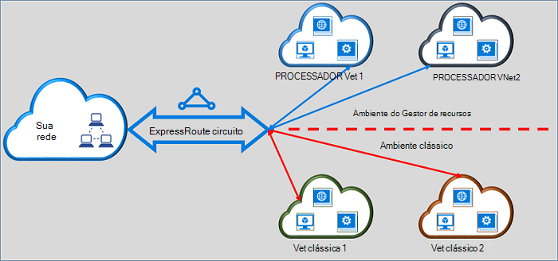

<properties
   pageTitle="Mover ExpressRoute circuitos do clássico para o Gestor de recursos | Microsoft Azure"
   description="Esta página fornece uma descrição geral de o que precisa de saber sobre pontes a clássica e os modelos de implementação do Gestor de recursos."
   documentationCenter="na"
   services="expressroute"
   authors="ganesr"
   manager="carmonm"
   editor=""/>
<tags
   ms.service="expressroute"
   ms.devlang="na"
   ms.topic="get-started-article"
   ms.tgt_pltfrm="na"
   ms.workload="infrastructure-services"
   ms.date="10/10/2016"
   ms.author="ganesr"/>

# Mover ExpressRoute circuitos do clássico para o modelo de implementação do Gestor de recursos

Este artigo fornece uma descrição geral do que significa: mover um circuito Azure ExpressRoute do clássico para o modelo de implementação do Azure o Gestor de recursos.

[AZURE.INCLUDE [vpn-gateway-sm-rm](../../includes/vpn-gateway-classic-rm-include.md)]

Pode utilizar um único circuito de ExpressRoute para ligar a redes virtuais que são implementadas tanto na clássica e os modelos de implementação do Gestor de recursos. Um circuito ExpressRoute, independentemente de como é criado, agora pode ligar a redes virtuais através de ambos os modelos de implementação.

## Circuitos ExpressRoute que são criados no modelo de implementação clássico

Circuitos ExpressRoute que são criados no modelo de implementação clássico tem de ser movida para o modelo de implementação do Gestor de recursos pela primeira vez para permitir a ligação para a clássica e os modelos de implementação do Gestor de recursos. Não existem não está perda de conectividade ou de interrupção quando está a ser movida uma ligação. Todas as ligações de rede circuito-virtuais no modelo de implementação clássico (dentro da mesma subscrição e subscrição cruzada) são preservadas.

Depois do comando Mover com êxito, o circuito ExpressRoute procura, executa e por achar exatamente como um circuito ExpressRoute que foi criado no modelo de implementação de Gestor de recursos. Agora pode criar ligações para redes virtuais no modelo de implementação de Gestor de recursos.

Depois de um ExpressRoute circuito foi movida para o modelo de implementação do Gestor de recursos, pode gerir o ciclo de vida do circuito ExpressRoute apenas ao utilizar o modelo de implementação do Gestor de recursos. Isto significa que pode executar operações como adicionar/actualizar/eliminar peerings, propriedades do circuito (tais como largura de banda, SKU e faturação tipo) a atualizar e eliminar circuitos apenas no modelo de implementação de Gestor de recursos. Consulte a secção abaixo no circuitos que são criados no modelo de implementação de Gestor de recursos para obter mais detalhes sobre como pode gerir o acesso a ambos os modelos de implementação.

Não possui envolvam o seu fornecedor de conectividade para executar o comando mover.

## Circuitos ExpressRoute que são criados no modelo de implementação de Gestor de recursos

Pode ativar a circuitos ExpressRoute que são criados no modelo de implementação de Gestor de recursos para serem acessíveis a partir de ambos os modelos de implementação. Qualquer circuito ExpressRoute na sua subscrição pode ser ativado para ser acedidas a partir de ambos os modelos de implementação.

- Circuitos ExpressRoute que foram criados no modelo de implementação de Gestor de recursos não tem acesso ao modelo de implementação clássica por predefinição.
- Circuitos ExpressRoute que tenham sido movidos a partir do modelo de implementação clássica ao modelo de implementação do Gestor de recursos são acessíveis a partir de ambos os modelos de implementação por predefinição.
- Um circuito ExpressRoute tem sempre acesso ao modelo de implementação do Gestor de recursos, independentemente de se foi criada no Gestor de recursos ou modelo de implementação clássica. Isto significa que, pode criar ligações para redes virtuais criados no modelo de implementação de Gestor de recursos ao seguir as instruções sobre [como ligar redes virtuais](expressroute-howto-linkvnet-arm.md).
- Acesso ao modelo de implementação clássica é controlado pelo parâmetro **allowClassicOperations** no circuito ExpressRoute.

>[AZURE.IMPORTANT] Aplicam a todas as quotas encontram-se documentados na página de [limites de serviço](../azure-subscription-service-limits.md) . Por exemplo, um padrão circuito pode ter até 10 ligações/ligações de rede virtual ao longo dos separadores e os modelos de implementação do Gestor de recursos.

## Controlar o acesso ao modelo de implementação clássico

Pode ativar a um único circuito de ExpressRoute ligar a redes virtuais em ambos os modelos de implementação definindo o parâmetro **allowClassicOperations** do circuito ExpressRoute.

A definição **allowClassicOperations** para TRUE permite-lhe ligar redes virtuais a partir de ambos os modelos de implementação do circuito ExpressRoute. Pode ligar a redes virtuais no modelo de implementação clássica por seguir orientações sobre [como ligar redes virtuais no modelo de implementação clássica](expressroute-howto-linkvnet-classic.md). Pode ligar a redes virtuais no modelo de implementação de Gestor de recursos por seguir orientações sobre [como ligar redes virtuais no modelo de implementação de Gestor de recursos](expressroute-howto-linkvnet-arm.md).

Definição **allowClassicOperations** para falso bloqueia o acesso ao circuito a partir do modelo de implementação clássica. No entanto, todas as ligações de rede virtual no modelo de implementação clássica são preservadas. Neste caso, o circuito ExpressRoute não estiver visível no modelo de implementação clássica.

## Operações suportadas no modelo de implementação clássico

As seguintes operações clássicas são suportadas por um circuito ExpressRoute quando **allowClassicOperations** está definida como verdadeiro:

 - Obter informações de circuito ExpressRoute
 - Ligações de rede virtual criar/actualizar/obter/eliminar para redes virtuais clássicos
 - Autorizações de ligação de rede virtual criar/actualizar/obter/eliminar de conectividade de subscrição de cruz

Não pode efetuar as seguintes operações clássicas quando **allowClassicOperations** está definida como verdadeiro:

 - Criar/actualizar/obter/eliminar limite Gateway Protocol (BGP) peerings Azure público privado, Azure e peerings da Microsoft
 - Eliminar ExpressRoute circuitos

## Comunicação entre a clássica e os modelos de implementação do Gestor de recursos

O circuito ExpressRoute funciona como se fosse uma bridge entre a clássica e os modelos de implementação do Gestor de recursos. Tráfego entre virtual machines no redes virtuais no modelo de implementação clássica e as redes virtuais no Gestor de recursos implementação modelo flui ExpressRoute se ambas as redes virtuais estão ligadas ao mesmo circuito ExpressRoute.

Agregado débito é limitado pela capacidade de débito do gateway rede virtual. Tráfego não introduza redes do fornecedor de conectividade ou redes nestes casos. Fluxo de tráfego entre as redes virtuais está totalmente contido dentro da rede do Microsoft.

## Acesso ao público Azure e recursos efectuados da Microsoft

Pode continuar a aceder a recursos que são normalmente acessíveis através de efectuado público Azure e Microsoft efectuado sem qualquer interrupção.  

## O que é suportado

Esta secção descreve o que é suportado para ExpressRoute circuitos:

 - Pode utilizar um único circuito de ExpressRoute para aceder a redes virtuais que são implementadas na clássica e os modelos de implementação do Gestor de recursos.
 - Pode mover um circuito ExpressRoute a partir do clássico para o modelo de implementação do Gestor de recursos. Após ser movido, o circuito ExpressRoute procura, por achar e executa como ExpressRoute circuito de qualquer outra que é criado no modelo de implementação de Gestor de recursos.
 - Pode mover apenas o circuito ExpressRoute. Ligações de circuito, redes virtuais e VPN gateways não podem ser movidos através desta operação.
 - Depois de um ExpressRoute circuito foi movida para o modelo de implementação do Gestor de recursos, pode gerir o ciclo de vida do circuito ExpressRoute apenas ao utilizar o modelo de implementação do Gestor de recursos. Isto significa que pode executar operações como adicionar/actualizar/eliminar peerings, propriedades do circuito (tais como largura de banda, SKU e faturação tipo) a atualizar e eliminar circuitos apenas no modelo de implementação de Gestor de recursos.
 - O circuito ExpressRoute funciona como se fosse uma bridge entre a clássica e os modelos de implementação do Gestor de recursos. Tráfego entre virtual machines no redes virtuais no modelo de implementação clássica e as redes virtuais no Gestor de recursos implementação modelo flui ExpressRoute se ambas as redes virtuais estão ligadas ao mesmo circuito ExpressRoute.
 - Conectividade de publicação em subscrição é suportada na clássica e os modelos de implementação do Gestor de recursos.

## O que não é suportado

Esta secção descreve o que não é suportado para ExpressRoute circuitos:

 - Mover circuito ligações, gateways e redes virtuais da clássica ao modelo de implementação de Gestor de recursos.
 - Gerir o ciclo de vida de um circuito ExpressRoute a partir do modelo de implementação clássica.
 - Suporte baseado em funções de controlo de acesso (RBAC) para o modelo de implementação clássica. Não é possível executar controlos RBAC para um circuito no modelo de implementação clássica. Qualquer administrador coadministrator da subscrição pode ligar ou desligar redes virtuais ao circuito.

## Configuração

Siga as instruções que são descritas nos [Mover um circuito ExpressRoute de clássico ao modelo de implementação de Gestor de recursos](expressroute-howto-move-arm.md).

## Próximos passos

- Para obter informações do fluxo de trabalho, consulte o artigo [ExpressRoute circuito aprovisionamento fluxos de trabalho e os Estados dos circuitos](expressroute-workflows.md).
- Para configurar a sua ligação de ExpressRoute:

    - [Criar um circuito ExpressRoute](expressroute-howto-circuit-arm.md)
    - [Configurar o encaminhamento](expressroute-howto-routing-arm.md)
    - [Ligar uma rede virtual a um circuito ExpressRoute](expressroute-howto-linkvnet-arm.md)
