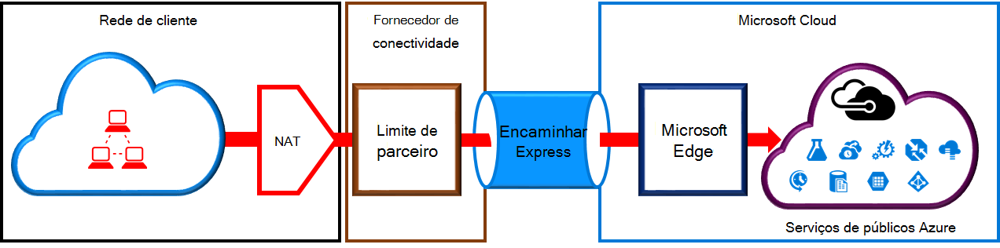

<properties
   pageTitle="Requisitos de NAT para ExpressRoute circuitos | Microsoft Azure"
   description="Esta página fornece os requisitos específicos para configurar e gerir NAT para ExpressRoute circuitos."
   documentationCenter="na"
   services="expressroute"
   authors="cherylmc"
   manager="carmonm"
   editor=""/>
<tags
   ms.service="expressroute"
   ms.devlang="na"
   ms.topic="get-started-article"
   ms.tgt_pltfrm="na"
   ms.workload="infrastructure-services"
   ms.date="10/10/2016"
   ms.author="cherylmc"/>

# Requisitos de ExpressRoute NAT

Para se ligar aos serviços em nuvem Microsoft utilizando ExpressRoute, terá de configurar e gerir NAT. Alguns fornecedores de conectividade oferecem como configurar e gerir NAT como um serviço gerido. Selecione com o seu fornecedor de conectividade para ver se oferecem desse serviço. Caso contrário, tem de aderir aos requisitos de descrito abaixo. 

Reveja a página [ExpressRoute circuitos e encaminhamento de domínios](expressroute-circuit-peerings.md) para obter uma descrição geral de encaminhamento vários domínios. Para cumprir os requisitos de endereço IP públicos para o público Azure e Microsoft efectuado, recomendamos que configurados NAT entre a rede e a Microsoft. Esta secção fornece uma descrição detalhada infraestrutura do NAT que tem de configurar.

## Requisitos de NAT para efectuado público Azure

O caminho peering público Azure permite-lhe ligar à alojado no Azure sobre os respetivos endereços de IP públicos de todos os serviços. Estes incluem serviços listados nas [ExpessRoute FAQ](expressroute-faqs.md) e quaisquer serviços alojados pelo fabricantes independentes de software Microsoft Azure. Conectividade ao serviços do Microsoft Azure no efectuado público é sempre iniciada da sua rede sessão na rede da Microsoft. Tráfego destinado a Microsoft Azure no efectuado público tem de ser SNATed para válido endereços IPv4 do públicos antes que estes entrem a rede do Microsoft. A figura seguinte fornece uma imagem de alto nível de como a NAT foi definida para cumprir o requisito acima.

 

### Anúncios de agrupamento e a rota de NAT IP

Tem de garantir que o tráfego é introduzir o caminho peering público Azure com endereço IPv4 público válido. Microsoft tem de conseguir validar o que é o proprietário do conjunto de endereços IPv4 NAT relativamente a um registo de Internet encaminhamento regional (RIR) ou um registo de encaminhamento de Internet (TIR). Uma marca de verificação será executada com base no número como a ser dispõe com e os endereços IP utilizados para o NAT. Referem-se para a página de [requisitos de encaminhamento ExpressRoute](expressroute-routing.md) para obter informações sobre o encaminhamento de registos.
 
Não existem restrições sobre o comprimento do prefixo NAT IP anunciado através deste efectuado. Tem de monitorizar o conjunto de NAT e certifique-se de que que não fique completamente privado de sessões NAT.

>[AZURE.IMPORTANT] O conjunto de NAT IP anunciado para a Microsoft não deve ser anunciado à Internet. Isto irá interromper conectividade com outros serviços da Microsoft.

## Requisitos de NAT para o Microsoft efectuado

O caminho peering Microsoft permite-lhe ligar aos serviços em nuvem Microsoft que não são suportados através do Azure caminho peering público. A lista dos serviços inclui serviços do Office 365, como o Exchange Online, SharePoint Online, Skype para empresas e CRM Online. Microsoft espera suportar bidirecional conectividade no efectuado a Microsoft. Tráfego destinado a serviços em nuvem da Microsoft tem de ser SNATed para válido endereços IPv4 do públicos antes que estes entrem a rede do Microsoft. Tráfego destinado a sua rede dos serviços em nuvem Microsoft tem de ser SNATed antes do mesmo entra na sua rede. A figura seguinte fornece uma imagem de alto nível de como a NAT deve ser programa de configuração do Microsoft efectuado.
 
 

#### Tráfego com origem da sua rede destinado à Microsoft

- Tem de garantir que o tráfego é introduzir o caminho de peering da Microsoft com um endereço IPv4 público válido. Microsoft tem de conseguir validar o proprietário do conjunto de endereços IPv4 NAT contra o registo de internet encaminhamento regionais (RIR) ou um registo de encaminhamento de internet (TIR). Uma marca de verificação será executada com base no número como a ser dispõe com e os endereços IP utilizados para o NAT. Referem-se para a página de [requisitos de encaminhamento ExpressRoute](expressroute-routing.md) para obter informações sobre o encaminhamento de registos.

- Não tem de ser anunciados endereços IP utilizados para a configuração de peering pública Azure e outros circuitos ExpressRoute para a Microsoft através da sessão BGP. Não existe nenhuma restrição o comprimento do prefixo NAT IP anunciado através deste efectuado.

    >[AZURE.IMPORTANT] O conjunto de NAT IP anunciado para a Microsoft não deve ser anunciado à Internet. Isto irá interromper conectividade com outros serviços da Microsoft.

#### Tráfego com origem da Microsoft, destinado a sua rede

- Determinados cenários requerem o Microsoft iniciar a conectividade à alojado na rede da sua pontos finais de serviço. Um exemplo típico do cenário seria conectividade aos servidores ADFS alojado na sua rede do Office 365. Nestes casos, tem de libertar prefixos adequados da sua rede na efectuado a Microsoft. 

- Tem de tráfego SNAT destinado a endereços IP na rede da sua da Microsoft. 

## Próximos passos

- Consulte os requisitos para o [Encaminhamento](expressroute-routing.md) e [QoS](expressroute-qos.md).
- Para obter informações do fluxo de trabalho, consulte o artigo [ExpressRoute circuito aprovisionamento fluxos de trabalho e os Estados dos circuitos](expressroute-workflows.md).
- Configure a sua ligação de ExpressRoute.

    - [Criar um circuito ExpressRoute](expressroute-howto-circuit-classic.md)
    - [Configurar o encaminhamento](expressroute-howto-routing-classic.md)
    - [Ligar uma VNet um circuito ExpressRoute](expressroute-howto-linkvnet-classic.md)

