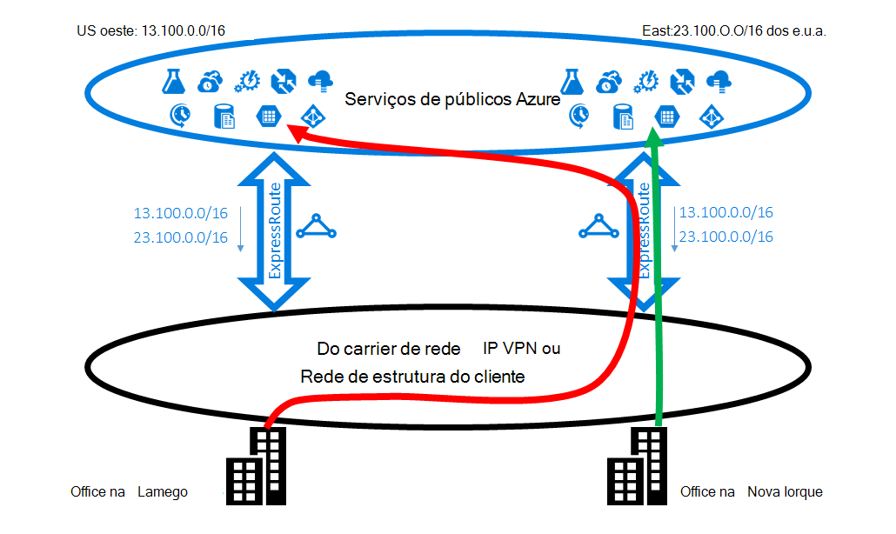
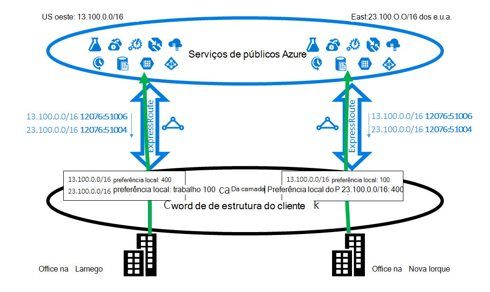
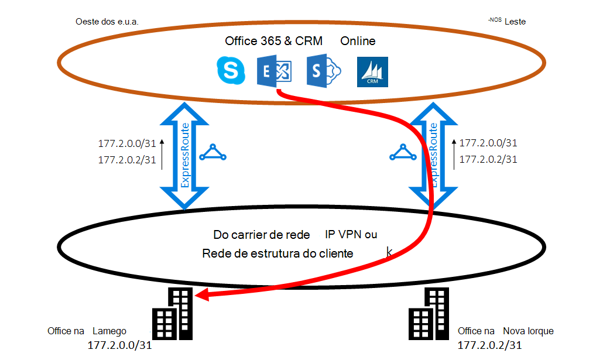
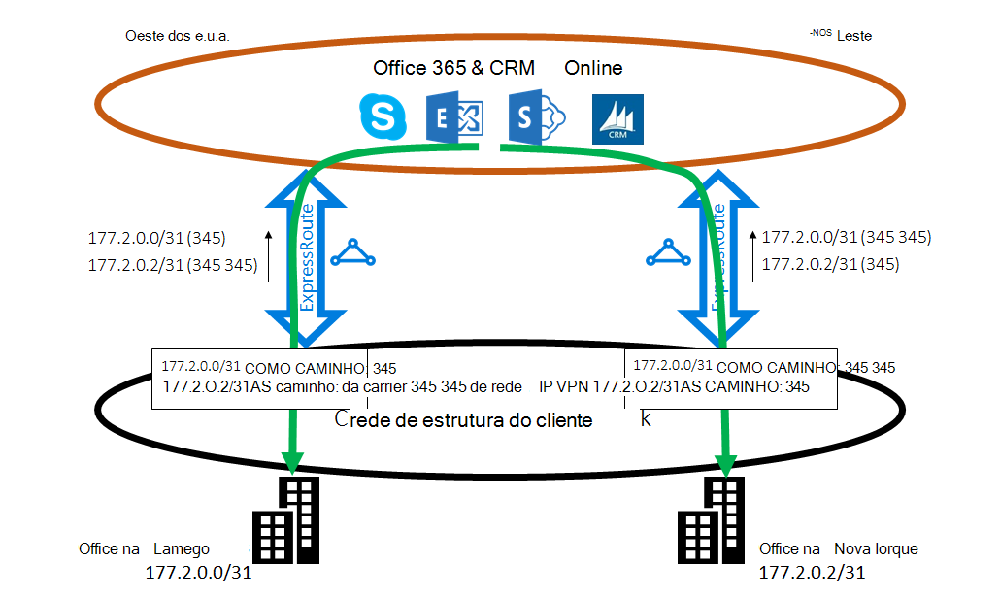

<properties
   pageTitle="Otimizar o encaminhamento de ExpressRoute | Microsoft Azure"
   description="Esta página fornece detalhes sobre como otimizar encaminhamento quando um cliente tem mais do que um circuitos ExpressRoute que se ligam entre Microsoft e de rede de corp do cliente."
   documentationCenter="na"
   services="expressroute"
   authors="charwen"
   manager="carmonm"
   editor=""/>
<tags
   ms.service="expressroute"
   ms.devlang="na"
   ms.topic="get-started-article"
   ms.tgt_pltfrm="na"
   ms.workload="infrastructure-services"
   ms.date="10/10/2016"
   ms.author="charwen"/>

# Otimizar o encaminhamento de ExpressRoute
Quando tiver várias ExpressRoute circuitos, tem mais do que um caminho para ligar para a Microsoft. Como resultado, poderá ocorrer encaminhamento reduzido - ou seja, o tráfego da sua poderá demorar um caminho mais longo para alcançar Microsoft e Microsoft à sua rede. Quanto maior for o caminho da rede, quanto maior a latência da. Latência tem impacto directo experiência de utilizador e desempenho de aplicações. Este artigo irá ilustram este problema e explicam como otimizar o encaminhamento utilizar tecnologias de encaminhamento padrão.

## Maiúsculas/minúsculas de encaminhamento reduzida 1
Vamos dar uma olhadela fechar o problema de encaminhamento por um exemplo. Imagine que tem dois escritórios nos EUA, um no Lamego e uma em Nova Iorque. Seus escritórios estão ligados numa rede alargada (WAN), que pode ser o seu próprio rede de estrutura ou VPN de IP do seu fornecedor de serviços. Tem duas ExpressRoute circuitos, uma oeste-nos e outra em-nos Oriente, que também estão ligadas na WAN. Obviamente, tem duas caminhos para ligar à rede de Microsoft. Agora imagine que tem o Azure implementação (por exemplo, serviço de aplicação Azure) no Oeste-nos e Oriente-nos. A intenção é ligar os seus utilizadores no Lamego a oeste do Azure-nos e os seus utilizadores em Nova Iorque leste do Azure-numa vez que o seu administrador de serviços anuncia que os utilizadores em cada office aceder os serviços Azure próximos para experiências ideais. Infelizmente, o plano funciona serve para os utilizadores Costa Leste mas não para os utilizadores costa ocidental. A causa do problema é o seguinte. Num cada circuito ExpressRoute, podemos anunciam para si o prefixo no Azure-nos Leste (23.100.0.0/16) e o prefixo Azure-nos oeste (13.100.0.0/16). Se não souber qual o prefixo é a partir do qual região, não estão poderá tratá-lo de forma diferente. Poderá pensar a sua rede WAN ambos os prefixos são mais próximos do Leste-nos que oeste-nos e, consequentemente, encaminhar ambos os utilizadores do office para o circuito ExpressRoute no Oriente-nos. No final, terá a vários utilizadores infeliz no office Lamego.

### Solução: Utilize BGP Comunidades
Para otimizar o encaminhamento para ambos os utilizadores do office, tem de saber qual prefixo é a partir do Azure-nos oeste e que a partir do leste do Azure-nos. Vamos codificar estas informações utilizando [valores BGP Comunidade](expressroute-routing.md). Vamos atribuiu um valor de Comunidade BGP exclusivo para cada região Azure, por exemplo, "12076:51004" para Oriente-nos, "12076:51006" para oeste-nos. Agora que sabe qual o prefixo é a partir do qual o Azure região, pode configurar qual circuito ExpressRoute deve ser preferido. Uma vez que utilizamos o BGP para encaminhamento de informações do exchange, pode utilizar preferência Local do BGP influenciar encaminhamento. No nosso exemplo, pode atribuir um valor de preferência local superior para 13.100.0.0/16-nos oeste que no Oriente-nos e da mesma forma, um valor de preferência local superior a 23.100.0.0/16 no-nos Leste que oeste-nos. Esta configuração será Certifique-se de que, quando ambos os caminhos para a Microsoft estiverem disponíveis, os seus utilizadores no Lamego irão utilizar o circuito ExpressRoute-nos oeste para ligar à oeste do Azure-nos, Considerando que os utilizadores em Nova Iorque tomar a ExpressRoute Oriente-na leste do Azure-nos. Encaminhamento está optimizado em ambos os lados. 

## Caso encaminhamento reduzido 2
Eis outro exemplo onde as ligações da Microsoft levam um caminho mais longo para chegar a sua rede. Neste caso, utilize servidores do Exchange no local e o Exchange Online num [ambiente híbrido](https://technet.microsoft.com/library/jj200581%28v=exchg.150%29.aspx). Seus escritórios estão ligados a uma WAN. Publicitar os prefixos dos servidores no local no ambos os seus escritórios para a Microsoft através de dois circuitos de ExpressRoute. Exchange Online iniciará ligações para os servidores no local em casos como migração da caixa de correio. Infelizmente, a ligação ao seu escritório Lamego é encaminhada para o circuito ExpressRoute no Oriente-nos antes de percorrer parte detrás com continente inteira costa ocidental. A causa do problema é semelhante ao primeiro. Sem qualquer sugestão, a Microsoft network não consegue indicar qual prefixo cliente se aproxime Oriente-nos e qual é a perto oeste-nos. Para isto acontecer escolher o caminho errado para o office no Lamego.

### Solução: Utilize o caminho como prepending
Existem duas soluções para o problema. A primeira parte é que pode simplesmente anuncia o prefixo no local para o seu office Lamego, 177.2.0.0/31, sobre o circuito ExpressRoute-nos oeste e prefixo suas no local para o seu office Nova Iorque, 177.2.0.2/31, sobre o circuito ExpressRoute no Oriente-nos. Como resultado, é apenas um caminho para a Microsoft para ligar a cada um dos seus escritórios. Não existe nenhuma ambiguidade e encaminhamento otimizado. Com este modelo, tem de pensar sobre a sua estratégia de activação pós-falha. Se que o caminho para o Microsoft por ExpressRoute for interrompido, é necessário para se certificar de que Exchange Online pode ainda ligar aos servidores no local. 

Segunda solução é que continuar anunciar ambos os prefixos em ambos os circuitos ExpressRoute e, adicionalmente que nos dar uma sugestão do qual prefixo se aproxime que um dos seus escritórios. Uma vez que suportamos BGP como caminho prepending, pode configurar o caminho de como para o prefixo influenciar encaminhamento. Neste exemplo, pode aumentar o caminho como para 172.2.0.0/31 no Oriente-nos para que recomendamos irá preferir circuito ExpressRoute oeste-nos para o tráfego destinado para este prefixo (tal como a nossa rede irá achar que o caminho para este prefixo endereço mais curto a oeste). Da mesma forma pode aumentar o caminho como para 172.2.0.2/31 oeste-nos para que recomendamos irá preferir circuito ExpressRoute no Oriente-nos. Encaminhamento está optimizado para ambos os escritórios. Com este modelo, se um ExpressRoute circuito é interrompido, Exchange Online pode ainda alcançar lhe através de outro ExpressRoute circuito e o seu WAN. 

>[AZURE.IMPORTANT] Vamos remover privado como números no caminho como para os prefixos recebidos no Microsoft Peering. Tem de acrescentar público como números no caminho como influenciar encaminhamento para Microsoft Peering.

>[AZURE.IMPORTANT] Apesar dos exemplos atribuídos aqui serem para a Microsoft e peerings público, suportamos as mesmas capacidades para efectuado privado. Além disso, o caminho como prepending funciona dentro de uma única ExpressRoute circuito, influenciar a seleção dos caminhos principais e secundários.
