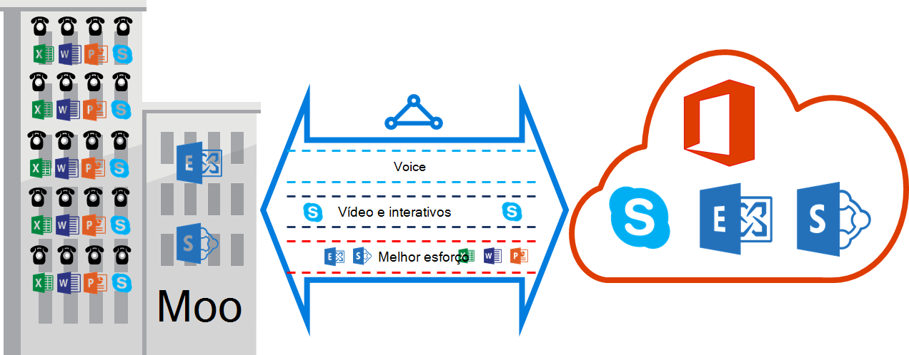

<properties
   pageTitle="Requisitos de QoS para ExpressRoute | Microsoft Azure"
   description="Esta página fornece os requisitos específicos para configurar e gerir QoS para ExpressRoute circuitos."
   documentationCenter="na"
   services="expressroute"
   authors="cherylmc"
   manager="carmonm"
   editor=""/>
<tags
   ms.service="expressroute"
   ms.devlang="na"
   ms.topic="get-started-article"
   ms.tgt_pltfrm="na"
   ms.workload="infrastructure-services"
   ms.date="10/10/2016"
   ms.author="cherylmc"/>

# Requisitos ExpressRoute QoS

Skype para empresas tem vários cargas de trabalho que requerem diferenciado QoS tratamento. Se planeia consumir serviços de voz através de ExpressRoute, deve aderir aos requisitos de descrito abaixo.

>[AZURE.NOTE] Requisitos QoS aplicam-se para a Microsoft efectuado apenas. Os valores DSCP de tráfego de rede que recebeu no efectuado público Azure e efectuado privado Azure serão repostos 0. 

A tabela seguinte fornece uma lista de marcações DSCP utilizado pelo Skype para empresas. Consulte [Gerir QoS do Skype para empresas](https://technet.microsoft.com/library/gg405409.aspx) para obter mais informações.

| **Classe de tráfego** | **Tratamento (marcação DSCP)** | **Skype para empresas cargas de trabalho** |
|---|---|---|
| **Voice** | EF (46) | Skype / voz do Lync |
| **Interativo** | AF41 (34) | Vídeo |
|   | AF21 (18) | Partilha de aplicações | 
| **Predefinido** | AF11 (10) | Transferência de ficheiros|
|   | CS0 (0) | Mais nada| 

- Deve classificar as cargas de trabalho e marque os valores DSCP à direita. Siga os passos fornecidos [aqui](https://technet.microsoft.com/library/gg405409.aspx) sobre como definir as marcações DSCP na sua rede.

- Deve configurar e suporta vários QoS filas na rede da sua. Voz tem de ser uma classe autónomo e receber o tratamento de EF especificado no RFC 3246. 

- Pode decidir o mecanismo colocação, a política de deteção de congestionamento e atribuição de largura de banda por classe de tráfego. No entanto, a marcação para o Skype para cargas de trabalho de negócio DSCP têm de ser preservado. Se estiver a utilizar as marcações DSCP não listadas acima, por exemplo, AF31 (26), têm de reescrever este valor DSCP 0 antes de enviar o pacote para a Microsoft. Microsoft apenas envia pacotes marcados com o valor DSCP apresentado na tabela acima. 

## Próximos passos

- Consulte os requisitos para o [Encaminhamento](expressroute-routing.md) e [NAT](expressroute-nat.md).
- Consulte as ligações seguintes para configurar a ligação ExpressRoute.

    - [Criar um circuito ExpressRoute](expressroute-howto-circuit-classic.md)
    - [Configurar o encaminhamento](expressroute-howto-routing-classic.md)
    - [Ligar uma VNet um circuito ExpressRoute](expressroute-howto-linkvnet-classic.md)
