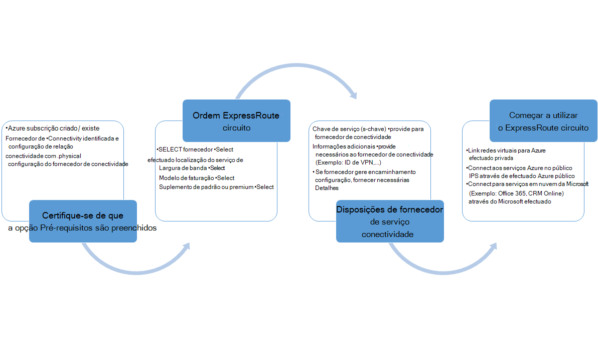
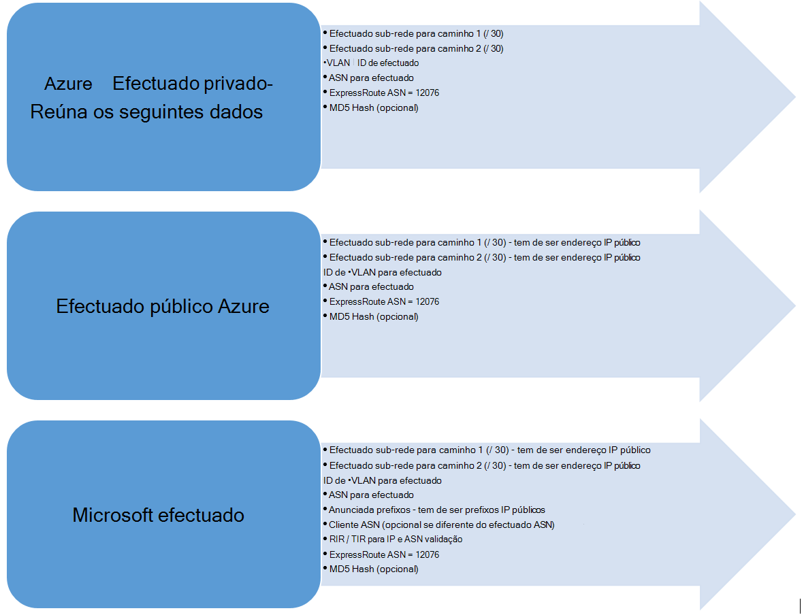

<properties
   pageTitle="Fluxos de trabalho para configurar um circuito ExpressRoute | Microsoft Azure"
   description="Esta página orienta-o através dos fluxos de trabalho para a configuração de circuito ExpressRoute e peerings"
   documentationCenter="na"
   services="expressroute"
   authors="cherylmc"
   manager="carmonm"
   editor="" />
<tags
   ms.service="expressroute"
   ms.devlang="na"
   ms.topic="article" 
   ms.tgt_pltfrm="na"
   ms.workload="infrastructure-services"
   ms.date="10/10/2016"
   ms.author="cherylmc"/>

# ExpressRoute fluxos de trabalho para os Estados dos circuitos e de aprovisionamento de circuito

Esta página orienta-o serviço de aprovisionamento e encaminhamento de fluxos de trabalho de configuração de alto nível.

A figura seguinte e os passos correspondentes mostram as tarefas que devem ser seguidos para ter um circuito ExpressRoute aprovisionado fim para fim. 

1. Utilizar o PowerShell para configurar um circuito ExpressRoute. Siga as instruções no artigo [circuitos criar ExpressRoute](expressroute-howto-circuit-classic.md) para obter mais detalhes.

2. Ordem de conectividade do fornecedor de serviços. Este processo varia. Contacte o seu fornecedor de conectividade para obter mais detalhes sobre como encomendar conectividade.

3. Certifique-se de que o circuito ter sido aprovisionado com êxito, verificando o circuito ExpressRoute aprovisionamento estado através do PowerShell. 

4. Configure domínios de encaminhamento. Se o seu fornecedor de conectividade gere Layer 3 por si, irá configurar encaminhamento para sua circuito. Se o seu fornecedor de conectividade apenas oferece serviços de camada 2, tem de configurar encaminhamento por orientações descritas nas páginas de [Encaminhamento de requisitos](expressroute-routing.md) e [configuração de encaminhamento](expressroute-howto-routing-classic.md) .

    -  Ativar efectuado privado Azure - tem de ativar esta efectuado ligar a VMs / cloud services implementados dentro de redes virtuais.
    -  Ativar o Azure efectuado de público - tem de ativar efectuado público Azure se pretender ligar aos serviços Azure alojados no endereços IP públicos. Este é um requisito para aceder a recursos Azure se tiver escolhido ativar o encaminhamento predefinido para efectuado privado Azure.
    -  Activar o Microsoft efectuado - tem de ativar esta para aceder ao Office 365 e serviços online CRM. 
    
    >[AZURE.IMPORTANT] Tem de garantir que utiliza um proxy separado / limite para ligar à Microsoft daquele utiliza para a Internet. Utilizar o mesmo limite para ExpressRoute e Internet causar assimétricos encaminhamento e causar falhas de conectividade para a sua rede.

    

5. Ligar redes virtuais ExpressRoute circuitos - pode ligar redes virtuais a sua circuito ExpressRoute. Siga as instruções [para ligar VNets](expressroute-howto-linkvnet-arm.md) ao seu circuito. Estes VNets podem ser na mesma subscrição do Azure como o circuito ExpressRoute ou pode estar numa subscrição diferente.

## ExpressRoute circuito aprovisionamento Unidos

Cada circuito ExpressRoute tem dois Estados:

- Estado de aprovisionamento do fornecedor de serviço
- Estado

Estado representa o estado de aprovisionamento da Microsoft. Esta propriedade estiver definida para ativado quando cria um circuito Expressroute

O estado de aprovisionamento de fornecedor de conectividade representa o estado no lado do fornecedor de conectividade. -Pode ser *NotProvisioned*, *aprovisionar*ou *Provisioned*. O circuito ExpressRoute deve estar no estado de Provisioned para que possam utilizá-la.

### Estados possíveis num circuito ExpressRoute

Esta secção apresenta saída os Estados possíveis para um circuito ExpressRoute.

#### Na hora de criação

Irá ver o circuito ExpressRoute no estado de seguinte assim execute o cmdlet do PowerShell para criar o circuito ExpressRoute.

    ServiceProviderProvisioningState : NotProvisioned
    Status                           : Enabled

#### Quando o fornecedor de conectividade está processo de aprovisionamento do circuito

Irá ver o circuito ExpressRoute no estado de seguinte assim que a verificação ser efetuada com a chave do serviço para o fornecedor de conectividade e que sejam iniciados o processo de aprovisionamento.

    ServiceProviderProvisioningState : Provisioning
    Status                           : Enabled

#### Fornecedor de conectividade quando concluir o processo de aprovisionamento

Irá ver o circuito ExpressRoute no estado de seguinte assim que o fornecedor de conectividade tem de concluir o processo de aprovisionamento.

    ServiceProviderProvisioningState : Provisioned
    Status                           : Enabled

Já está aprovisionado e ativada é que o estado só o circuito pode estar em para que possam utilizá-la. Se estiver a utilizar um fornecedor de camada 2, pode configurar o encaminhamento para sua circuito apenas quando se encontra neste estado.

#### Quando o fornecedor de conectividade é deprovisioning o circuito

Se lhe for solicitado o fornecedor de serviços deprovision circuito ExpressRoute, verá o circuito definidas para o estado seguinte depois de concluir o processo de deprovisioning o fornecedor de serviços.

    ServiceProviderProvisioningState : NotProvisioned
    Status                           : Enabled

Pode optar por voltar a ativá-lo se necessário, ou executar os cmdlets do PowerShell para eliminar o circuito.  

>[AZURE.IMPORTANT] Se executar o cmdlet do PowerShell para eliminar a circuito quando Aprovisiona o o ServiceProviderProvisioningState ou Provisioned a operação irá falhar. Consulte Trabalhar com o seu fornecedor de conectividade para deprovision o circuito ExpressRoute pela primeira vez e, em seguida, elimine o circuito. Microsoft irão continuar faturar o circuito até que execute o cmdlet do PowerShell para eliminar o circuito.

## Estado da configuração sessão encaminhamento

BGP aprovisionamento estado permite-lhe saber se a sessão BGP ter sido ativada no limite da Microsoft. O estado tem de estar ativado para o utilizador poderá utilizar o efectuado.

É importante verificar o estado da sessão BGP especialmente para Microsoft efectuado. Para além de BGP aprovisionamento Estado, existe outro Estado denominado *anunciada Estado prefixos público*. O estado de anunciada prefixos público tem de ser *configurado* Estado, tanto para a sessão exceda o BGP ser para cima e para o encaminhamento para trabalhar para fim. 

Se o estado do prefixo público anunciada estiver definido para um Estado de *validação conforme necessário* , a sessão BGP não estiver ativada, tal como os prefixos anunciados não corresponde o número como em qualquer um dos encaminhamento de registos. 

>[AZURE.IMPORTANT] Se o estado de anunciada prefixos pública estiver no estado de *validação manual* , tem de abrir um bilhetes de suporte com [o suporte da Microsoft](https://portal.azure.com/?#blade/Microsoft_Azure_Support/HelpAndSupportBlade) e fornecer prova que é o proprietário os endereços IP anunciados ao longo com o número de sistema autónomo associado.

## Próximos passos

- Configure a sua ligação de ExpressRoute.

    - [Criar um circuito ExpressRoute](expressroute-howto-circuit-arm.md)
    - [Configurar o encaminhamento](expressroute-howto-routing-arm.md)
    - [Ligar uma VNet um circuito ExpressRoute](expressroute-howto-linkvnet-arm.md)
