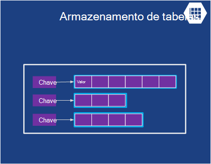

<properties
    pageTitle="Introdução ao Microsoft Azure | Microsoft Azure"
    description="Novo no Microsoft Azure? Obter uma descrição geral básica dos serviços oferece com exemplos de como são úteis."
    services=" "
    documentationCenter=".net"
    authors="rboucher"
    manager="carolz"
    editor=""/>

<tags
    ms.service="multiple"
    ms.workload="multiple"
    ms.tgt_pltfrm="na"
    ms.devlang="na"
    ms.topic="article"
    ms.date="06/30/2015"  
    ms.author="robb"/>

# Introdução ao Microsoft Azure

Microsoft Azure é plataforma de aplicação da Microsoft para a nuvem pública.  O objetivo deste artigo é para lhe dar um foundation para compreender os conceitos básicos do Azure, mesmo se não sabe tudo sobre nuvem computação.

**Saber como ler este artigo**

Azure está em crescimento sempre, por isso, é fácil obter sobrecarregado.  Comece com os serviços básicos, que são listados em primeiro lugar neste artigo e, em seguida, avance para serviços adicionais. Significa que não é possível utilizar apenas os serviços adicionais por si, mas os serviços básicos constituem o essencial uma aplicação em execução no Azure.

**Fornecer comentários**

Os seus comentários são importante. Este artigo deve dar-lhe uma descrição geral eficaz de Azure. Se não tiver, diga-na secção comentários na parte inferior da página. Dar alguns detalhes sobre esperado ver e sobre como melhorar o artigo.  

## Os componentes do Azure

Azure agrupa serviços categorias no Portal de gestão e no vários auxiliares visuais, como a [o que é Azure Infographic](https://azure.microsoft.com/documentation/infographics/azure/) . O Portal de gestão é o que pode utilizar para gerir serviços a maior parte dos (mas não em todos os) no Azure.

Este artigo irá utilizar uma **organização diferente** para falar sobre serviços baseados na função semelhante e para ligar a sub-serviços de importantes que fazem parte daqueles maiores.  

   
 *Figura: Azure fornece Internet acessível aplicação services em execução no Azure centros de dados.*

## Portal de gestão
Azure tem uma interface de web denominada do [Portal de gestão](http://manage.windowsazure.com) que permite aos administradores aceder e administrar mais, mas não todas as funcionalidades do Azure.  A Microsoft disponibiliza normalmente o portal de IU mais recente na versão beta antes de reforma um mais antigo. A mais recente que é designado por ["Portal de pré-visualização do Azure"](https://portal.azure.com/).

Normalmente, existe uma sobreposição longa quando ambos os portais estão ativos. Enquanto serviços principais irão aparecer em ambos os portais, não todas as funcionalidades poderão estar disponíveis em ambos. Serviços mais recentes poderão aparecer no mais recentes portais primeiros e versões anteriores dos serviços e funcionalidade só pode existir no mais antigo.  A mensagem aqui é que se não localizar algo no portal do mais antigo, verifique a mais recente e vice versa.

## Cluster

Uma das coisas básicas mais uma plataforma nuvem é que está a executar aplicações. Cada um dos modelos de cluster Azure tem as suas próprias função para reproduzir.

Pode utilizar estas tecnologias separadamente ou combina-as, conforme necessário para criar a Fundação direita para a sua aplicação. A abordagem que escolher depende que problemas está a tentar resolver.

### Azure máquinas virtuais

   
*Figura: Azure máquinas virtuais dá-lhe controlo total sobre instâncias de máquina virtual na nuvem.*

A capacidade de criar uma máquina virtual a pedido, se a partir de uma imagem padrão ou a partir de uma que forneceu, pode ser muito útil. Esta abordagem, geralmente denominada infraestrutura como um serviço (IaaS), é o que fornece máquinas virtuais do Azure. Figura 2 mostra uma combinação de forma como uma Máquina Virtual (VM) é executado e como criar um partir de um VHD.  

Para criar uma VM, pode especificar qual VHD para utilização e tamanho da memória de virtual.  Pode pagar, em seguida, para a hora em que está a ser executada a VM. Pagar por minuto e apenas enquanto estiver em execução, apesar de não existe uma carga de armazenamento mínima para manter o VHD disponível. Azure oferece uma galeria de cotações VHDs (denominados "imagens") que contêm um sistema operativo de arranque para iniciar a partir de. Incluem estas opções de Microsoft e parceiros, tais como o Windows Server e Linux, SQL Server, Oracle e muito mais. Está gratuita Criar VHDs e imagens e, em seguida, carregue-os mesmo. Ainda pode carregar VHDs que contêm apenas os dados e, em seguida, aceder aos mesmos a partir do seu VMs em execução.

Sempre que o VHD provém, pode armazenar forma persistente quaisquer alterações efectuadas enquanto uma VM estiver em execução. Da próxima vez que cria uma VM a partir desse VHD, coisas Pegue onde parou. Os que trás as máquinas virtuais VHDs são armazenados no blobs de armazenamento do Windows Azure, que falarmos sobre mais tarde.  Isto significa que obtém redundância para garantir a que sua VMs não desaparecerem devido a falhas de hardware e disco. Também é possível copiar o VHD alterado fora do Azure, em seguida, executá-la localmente.

A aplicação for executada dentro de uma ou mais máquinas virtuais, dependendo de como criou antes ou decidir criá-lo agora de raiz.

Esta abordagem é bem isto geral para informática em nuvem pode ser utilizada para resolver muitos problemas diferentes.

**Cenários de máquina virtual**

1.  **Dev Center/testar** - poderão utilizá-los para criar uma plataforma de desenvolvimento e teste dispendiosa que pode encerrar quando acabar de utilizá-lo. Também poderá criar e executar as aplicações que utilizam qualquer idiomas e bibliotecas que goste. Nessas aplicações podem utilizar qualquer uma das opções de gestão de dados que fornece Azure e também pode optar por utilizar o SQL Server ou outra DBMS a ser executada numa ou mais máquinas virtuais.
2.  **Deslocar-se às aplicações Azure (elevação e turno)** - "Elevação e shift" refere-se para mover a aplicação muito como utilizaria uma Empilhador para mover um objeto grande.  "Levantar" VHD a partir do seu centro de dados local e "deslocar" quando oculto-lo para Azure e executá-la aí.  Normalmente, terá de efetuar algum do trabalho para remover dependências de outros sistemas de. Se existirem demasiadas, pode escolher a opção 3 em vez disso.  
3.  **Expandir o seu centro de dados** - utilizar Azure VMs como uma extensão do seu centro de dados no local, o SharePoint ou de outras aplicações. Para suportar isso, é possível criar domínios do Windows na nuvem através da execução do Active Directory no Azure VMs. Pode utilizar o Azure rede Virtual (mencionados mais tarde) para juntar sua rede local e a sua rede no Azure.

### Web Apps

   
 *Figura: Azure Web Apps é executado uma aplicação do Web site na nuvem sem ter de gerir o servidor web subjacente.*

Uma das coisas mais comuns que as pessoas efetuar na nuvem é executada aplicações web e Web sites. Azure máquinas virtuais o permitir, mas ainda deixa com a responsabilidade sobre como administrar um ou mais VMs e os sistemas operativos subjacentes. Funções de web de serviços na nuvem podem fazê-lo, mas implementar e mantê-los ainda demora trabalho administrativo.  O que acontece se pretende apenas um Web site onde por alguém leva-o até cuidado do trabalho administrativo para si?

Este é exatamente o que fornece Web Apps. Este modelo de cluster oferece um ambiente do web geridos utilizando o portal de gestão do Azure, bem como APIs. Pode mover uma aplicação Web site existente para o Web Apps inalterada, ou pode criar um novo diretamente na nuvem. Assim que um Web site está em execução, pode adicionar ou remover instâncias dinamicamente, depender do Azure Web Apps para carregar os pedidos de saldo através de lhes. Aplicações do Azure oferece uma opção partilhada, onde o seu Web site é executado numa máquina virtual com outros sites, e uma opção de padrão que permite que um site para executar na sua própria VM. A opção padrão também lhe permite aumentar o tamanho (informática power) do seu instâncias se for necessário.

Para o desenvolvimento, Web Apps suporta .NET, PHP, Node.js, Java e Python juntamente com a base de dados SQL e MySQL (a partir do ClearDB, um parceiro da Microsoft) para o armazenamento do relacional. Também fornece suporte incorporado para várias aplicações populares, incluindo WordPress, Joomla e Drupal. O objetivo é proporcionar uma plataforma custo mínimo, dimensionável e ficarem útil para criar aplicações web e Web sites na nuvem pública.

**Cenários de aplicações Web**

Web Apps se destina a ser úteis para empresas, os programadores e organismos de estrutura de web. Para as empresas, é uma solução fácil de gerir, dimensionável, altamente segura e altamente disponível para a execução de Web sites de presença. Quando precisar de configurar um Web site, é melhor iniciar com o Azure Web Apps e continuar aos serviços em nuvem depois de que precisa de uma funcionalidade que não está disponível. Consulte o fim da secção "Cluster" para obter mais ligações que podem ajudá-lo para escolher entre as opções.

### Serviços em nuvem
   
*Figura: Azure serviços em nuvem fornece um local para executar altamente dimensionável código personalizado numa plataforma como um ambiente do serviço (PaaS)*

Imaginemos que pretende criar uma aplicação na nuvem que pode suporta vários utilizadores em simultâneo, não necessita de muito administração e nunca desaparece para baixo. Poderá ser um fornecedor de software estabelecida, por exemplo, que tiver decidido Aproveite Software como um serviço (SaaS) através da criação de uma versão de uma das suas aplicações na nuvem. Ou pode estar um arranque criar uma aplicação do consumidor que esperava de crescimento mais rapidamente. Se estiver a compilar no Azure, qual o modelo de execução devo utilizar?

Azure Web Apps permite a criação deste tipo de aplicação web App, mas existem algumas restrições. Não tem acesso administrativo, por exemplo, o que significa que não é possível instalar o software arbitrário. Azure máquinas virtuais fornece-lhe muitas flexibilidade, incluindo acesso administrativo e certamente utilizá-lo para criar uma aplicação muito dimensionável, mas terá de gerir muitos aspetos da administração de fiabilidade e si mesmo. O que gostaria é uma opção que dá-lhe o controlo necessita, mas também processa a maior parte do trabalho necessário para a fiabilidade e administração.

Este é exatamente o que é fornecido pela serviços em nuvem Azure. Esta tecnologia concebida expressamente para suportar dimensionáveis, fiáveis e aplicações de administração de baixa e de um exemplo do que geralmente tem denominado plataforma como um serviço (PaaS). Para utilizá-la, crie uma aplicação utilizando a tecnologia de que escolher, tal como c#, Java, PHP, Python, Node.js ou outra coisa. O código, em seguida, é executado em máquinas virtuais do (designado por instâncias) a executar uma versão do Windows Server.

Mas estes VMs forem distintos a partir daqueles que criar com máquinas virtuais do Azure. Para um critério, Azure propriamente dito gere-las, fazer coisas como instalar o sistema operativo patches e automaticamente gradual novo corrigido imagens. Isto significa que a aplicação não deva manter o estado em instâncias de funções web ou trabalhador; em vez disso, devem ser mantido de uma das opções de gestão de dados Azure descritas na secção seguinte. Azure monitoriza também estes VMs, qualquer reiniciar esse falhas. Pode definir serviços em nuvem para criar automaticamente instâncias mais ou menos em resposta ao pedido. Esta opção permite-lhe identificador um aumento de utilização e, em seguida, dimensionar para que não são pagamentos quanto quando existe menos a utilização.

Tem duas funções para escolher a partir do quando cria uma instância, ambos com base no Windows Server. A diferença entre os dois principal é que uma instância de uma função da web é executado IIS, enquanto que uma instância de uma função de trabalho não. Ambos são geridos da mesma forma, no entanto, e é comum de uma aplicação para utilizar ambas. Por exemplo, uma instância de função web poderá aceitar pedidos de utilizadores, em seguida, passar para uma instância de função de trabalho para processamento. Para dimensionar a sua aplicação para cima ou para baixo, pode pedir que o Azure criar mais instâncias de uma das funções ou encerrar instâncias existentes. E semelhantes para máquinas virtuais do Azure, está a cobradas apenas para o tempo que cada instância de função web ou de trabalho está em execução.

**Cenários de serviços na nuvem**

Serviços em nuvem são ideais suportar escala grandes saída quando precisar de mais controlo sobre a plataforma de fornecida pela Azure Web Apps, mas não precisa de controlo sobre o sistema operativo subjacente.

#### Escolher um modelo de cluster
A página [Azure Web Apps, serviços em nuvem e máquinas virtuais comparação](./app-service-web/choose-web-site-cloud-service-vm.md) fornece informações mais detalhadas sobre como escolher um modelo de cluster.

## Gestão de dados

Aplicações necessitam de dados e diferentes tipos de aplicações necessita de diferentes tipos de dados. Por esta razão, o Azure fornece várias maneiras diferentes para armazenar e gerir os dados. Azure fornece muitas opções de armazenamento, mas todas foram concebidas para o armazenamento do muito resistente.  Com uma das seguintes opções, existem sempre 3 cópias dos seus dados mantidos em sincronização através de um centro de dados Azure - 6 se permitir Azure utilizar geo redundância para fazer cópia de segurança para outro centro de dados, pelo menos, 300 milhas ausente.     

### Em máquinas virtuais
A capacidade de executar o SQL Server ou outra DBMS numa VM criada com máquinas virtuais do Azure já tiver sido mencionada. Aperceba esta opção não está limitada a relacionais sistemas; também está livre executar tecnologias de NoSQL, tais como MongoDB e Cassandra. Executar o seu próprio sistema de base de dados é simples-it replica o que é utilizados para na nossos própria centros de dados-, mas também requer tratamento de administração desse DBMS.  Em outras opções, Azure trata mais ou todos os a administração por si.

Novamente, o estado de Máquina Virtual e quaisquer dados adicionais do disco criar ou carregar são cópias ao armazenamento blob do (que falarmos sobre mais tarde).  

### Base de dados Azure SQL
   

*Figura: Base de dados SQL Azure fornece um serviço de base de dados relacional gerida na nuvem.*

Para obter armazenamento relacional, Azure fornece a funcionalidade de base de dados SQL. Não permitir que o enganar nomenclatura. Isto é diferente de uma base de dados do SQL típica fornecidos pelo executar na parte superior de Windows Server do SQL Server.  

Anteriormente chamado SQL Azure, base de dados do SQL Azure fornece todas as funcionalidades principais de uma base de dados relacional sistema de gestão, incluindo as transações Atómica, acesso a dados em simultâneo por vários utilizadores com um modelo de programação familiar, consultas ANSI SQL e integridade dos dados. Como SQL Server, base de dados SQL podem ser acedidas utilizando entidade Framework, ADO.NET, JDBC e outros dados familiares aceder tecnologias. Também suporta a maior parte da linguagem T SQL, juntamente com as ferramentas do SQL Server como SQL Server Management Studio. Para qualquer pessoa familiarizado com o SQL Server (ou outra base de dados relacional), utilizar a base de dados SQL é simples.

Mas a base de dados SQL não está apenas um DBMS na nuvem-it de um serviço de PaaS. Ainda assim, controlar os seus dados e quem pode aceder, mas leva-o até o cuidado de base de dados SQL do trabalho roncador administrativo, tais como gerir a infraestrutura de hardware e manter o software de base de dados e o sistema operativo atualizados automaticamente. Base de dados SQL fornece também elevada disponibilidade, cópias de segurança automáticas, em qualquer altura das capacidades de restauro e podem replicadas cópias em regiões geográficas.  

**Cenários de base de dados SQL**

Se estiver a criar uma aplicação do Azure (utilizar qualquer um dos modelos de cluster) que necessita de armazenamento relacional, base de dados SQL pode ser uma boa opção. Aplicações em execução fora da nuvem também podem utilizar este serviço, no entanto, pelo que existem muitas outras situações. Por exemplo, os dados armazenados numa base de dados SQL podem ser acedidos a partir de sistemas de cliente diferente, incluindo computadores, portáteis, tablets e telemóveis. E uma vez que fornece incorporada elevada disponibilidade através de replicação, utilizar a base de dados SQL pode ajudar a minimizar o tempo de inatividade.

### Tabelas
  

*Figura: Tabelas Azure fornece uma maneira de NoSQL simples para armazenar dados.*

Esta funcionalidade é por vezes designado por termos diferentes como é parte de uma funcionalidade maior denominada "Azure armazenamento". Se vir "tabelas", "Tabelas Azure" ou "tabelas armazenamento", é a mesma coisa.  

E não ser confundidas pelo nome: esta tecnologia não fornece armazenamento relacional. Na verdade, é um exemplo de uma abordagem de NoSQL denominado uma chave/valor store. Tabelas Azure permitir que uma aplicação armazenar propriedades de vários tipos, tais como cadeias, números inteiros e datas. Uma aplicação, em seguida, pode obter um grupo de propriedades, fornecendo uma chave exclusiva para esse grupo. Enquanto operações complexas como associações não são suportadas, tabelas oferecem um acesso rápido aos dados escritos. Também for muito dimensionáveis, com uma única tabela conseguir colocar em espera muito como um terabyte de dados. E correspondência os respetivos simplificar, as tabelas são normalmente menos dispendiosas utilizar mais armazenamento relacional da base de dados de SQL.

**Cenários de tabelas**

Suponha que pretende criar uma aplicação do Azure que necessita de acesso rápido às escreveu dados, talvez muitas-lo, mas não necessita de efetuar consultas SQL complexas nestes dados. Por exemplo, imagine que está a criar uma aplicação do consumidor que necessita para armazenar informações de perfil de cliente para cada utilizador. A aplicação vai ser muito populares, de modo a precisa permitir a grandes quantidades de dados, mas que não irá fazer muito com estes dados para além de armazená-lo, em seguida, obtendo-lo em apenas formas simples. Este é exatamente o tipo de cenário onde sentido Azure tabelas.

### BLOBs
    
*Figura: Blobs do Azure fornece dados binários não estruturados.*  

Azure Blobs (novamente "Armazenamento de BLOBs" e apenas "armazenamento de Blobs" são a mesma coisa) foi concebido para armazenar dados binários não estruturados. Como tabelas, Blobs fornece armazenamento dispendioso e um único blob pode ser tão grande como 1TB (uma terabyte). Aplicações Azure também podem utilizar unidades Azure, que lhe permitem blobs fornecer armazenamento persistente para um sistema de ficheiros do Windows instalado numa instância Azure. A aplicação vê normais ficheiros do Windows, mas os conteúdos são armazenados num blob.

Armazenamento de BLOBs é utilizado pelo muitas outras Azure funcionalidades (incluindo máquinas virtuais), para que certamente pode processar demasiado seu das cargas de trabalho.

**Cenários de Blobs**

Uma aplicação que armazena os ficheiros de vídeo, grandes ou outras informações binárias pode utilizar blobs armazenamento simples, tarifa reduzida. BLOBs também são geralmente utilizadas em conjunto com outros serviços como o conteúdo de entrega de rede, será falarmos sobre mais tarde.  

### Importar / exportar
  

*Figura: Azure importação / exportação fornece a capacidade para enviar uma unidade de disco rígida física ou a partir do Azure para os dados em volume mais rápido e menos dispendioso importar ou exportar.*  

Por vezes que pretende mover muitos dados para Azure. Que iria demorar muito tempo, talvez dias e utilize muitas largura de banda. Nestes casos, pode utilizar Azure importar/exportar, que permite-lhe fornecidos encriptados Bitlocker 3,5" SATA unidades de disco rígido diretamente aos centros de dados Azure, onde Microsoft irá transferir os dados para o armazenamento de BLOBs por si.  Após o carregamento está concluído, o Microsoft vem incluído com as unidades lhe.  Também pode pedir que grandes quantidades de dados a partir do armazenamento de BLOBs ser exportadas para unidades de disco rígido e enviadas novamente para si através de correio.

**Cenários para importação / exportação**

- **Migração de dados grandes** - sempre que tiver grandes quantidades de dados (Terabytes) que pretende carregar para o Azure, o serviço de importação/exportação normalmente, é muito mais rápido e talvez menos dispendioso que transferência-lo através da internet. Assim que os dados estiverem no blobs, pode transformá-lo em outras formas como o armazenamento de tabela ou uma base de dados do SQL.

- **Recuperação de dados arquivados** - pode utilizar Importar/exportar para que a transferência do Microsoft grande quantidades de dados armazenados em armazenamento de Blobs do Azure para um dispositivo de armazenamento que enviar e, em seguida, tenha esse dispositivo entregue novamente para uma localização que pretende. Uma vez que este irá demorar algum tempo, não é uma boa opção para recuperação de falhas. É melhor para os dados arquivados que não precisa de acesso rápido às.

### Serviço de ficheiros
    
*Figura: Serviços de ficheiro Azure fornece SMB \\ \\server\share caminhos aplicações que são executadas na nuvem.*

No local, é comum ter grandes quantidades de armazenamento de ficheiros acessível através da linha de mensagem bloco SMB (Server) protocolo utilizando um \\ \\Server\share formatar. Azure tem agora um serviço que permite-lhe utilizar este protocolo na nuvem. Aplicações em execução no Azure podem utilizá-lo para partilhar ficheiros entre VMs utilizando o sistema de ficheiros familiares APIs como ReadFile e WriteFile. Além disso, os ficheiros também podem ser acedidos ao mesmo tempo através de uma interface resto, o que permite-lhe aceder a quotas no local ao configurar uma rede virtual também. Ficheiros Azure baseia-se na parte superior do serviço de BLOBs, para que este herda o mesmo disponibilidade, durabilidade, escalabilidade e geo-redundância incorporada no armazenamento do Windows Azure.

**Cenários de ficheiros do Azure**

- **Migrar aplicações existentes na nuvem** - fácil migrar no local aplicações na nuvem que utilizam partilhas de ficheiros para partilhar dados entre peças da aplicação. Cada VM liga para a partilha de ficheiros e, em seguida, podem ler e escrever da mesma forma que faria relativamente a um ficheiro no local na partilha de ficheiros.

- **Definições da aplicação partilhados** - um padrão comuns para aplicações distribuídas é têm ficheiros de configuração de uma localização centralizada onde podem ser acedidas a partir de muitas máquinas virtuais diferentes. Estes ficheiros de configuração podem ser armazenados numa partilha de ficheiros do Azure e ler por todas as instâncias da aplicação. As definições de também podem ser geridas através da interface do resto, que permite o acesso em todo o mundo aos ficheiros de configuração.

- **Partilhar diagnóstico** - pode guardar e partilhar ficheiros de diagnóstico como registos, métricas e informações de estado da falha de sistema. Está a ter estes ficheiros disponíveis através da interface a SMB e o resto permite que as aplicações utilizar uma variedade de ferramentas de análise para processar e analisar os dados de diagnóstico.

- **Teste/Dev Center/depurar** - quando os programadores ou administradores estão a trabalhar em máquinas virtuais na nuvem, frequentemente, necessita de um conjunto de ferramentas ou utilitários. Instalar e distribuir estes utilitários em cada máquina virtual são demorado. Com os ficheiros do Azure, um programador ou um administrador pode armazenar os seus favoritas ferramentas numa partilha de ficheiros e ligar aos mesmos a partir de qualquer máquina virtual.

## Funcionamento em rede

Azure é executado hoje em centros de dados muitos distribuir por parte do mundo. Quando executa uma aplicação ou armazenar dados, pode selecionar um ou mais dos seguintes centros de dados a utilizar. Também pode ligar a estes centros de dados de várias formas ao utilizar os serviços abaixo.

### Rede virtual
   

*Figura: Redes virtuais fornece uma rede privada na nuvem, de modo a diferentes serviços podem falar umas às outras, ou para recursos no local se configurou o está numa VPN cruzada local ligação.*  

Uma forma útil para utilizar uma nuvem pública é se deve ser processado como uma extensão do seu próprio Centro de dados.

Uma vez que pode criar VMs a pedido, em seguida, removê-las (e parar pagamentos) quando já não for necessário, pode ter computação power apenas quando quisê-lo. E uma vez que máquinas virtuais do Azure permite-lhe criar VMs com o SharePoint, do Active Directory e outro software familiares no local, esta abordagem pode trabalhar com as aplicações que já tiver.

Para tornar este realmente útil, no entanto, os seus utilizadores devessem possam trate estas aplicações, como se estivessem a executar o no seu próprio Centro de dados. Este é exatamente o que permite a rede Virtual Azure. Utilizar um dispositivo de gateway VPN, um administrador pode configurar uma rede privada virtual (VPN) entre a sua rede local e o seu VMs que são implementadas a uma rede virtual no Azure. Uma vez que atribuir o seus próprio v4 de endereços IP para a nuvem VMs, eles aparecem estar na sua própria rede. Os utilizadores na sua organização podem aceder as aplicações contêm esses VMs como se estivessem a executar o localmente.

Para mais informações sobre o planeamento e criação de uma rede virtual que funcione para si, consulte o artigo [Rede Virtual](./virtual-network/virtual-networks-overview.md).

### Encaminhar Express

   

*Figura: ExpressRoute utiliza uma rede Virtual Azure, mas encaminha ligações através de forma mais rápidas dedicadas linhas em vez de na Internet pública.*  

Se precisar de mais de largura de banda ou segurança do que uma rede Virtual do Azure pode fornecer a ligação, pode procurar para ExpressRoute. Em alguns casos, ExpressRoute, pode também poupar dinheiro. Irá necessitar de uma rede virtual no Azure, mas a ligação entre o Azure e o seu site utiliza uma ligação dedicada que não através da Internet pública. Para poder utilizar este serviço, terá de ter um contrato com um fornecedor de serviços de rede ou um fornecedor do exchange.

Configurá-lo um ExpressRoute ligação requer mais tempo e planeamento, por isso, poderá pretender começar com uma VPN do site para o site, em seguida, migrar para uma ligação de ExpressRoute.

Para mais informações sobre ExpressRoute, consulte o artigo [Descrição geral técnica de ExpressRoute](./expressroute/expressroute-introduction.md).

### Gestor de tráfego

   

*Figura: O Gestor de tráfego Azure permite-lhe encaminhar o tráfego global no seu serviço com base em regras inteligentes.*

Se estiver a executar a aplicação Azure no vários centros de dados, pode utilizar o Gestor de tráfego Azure para encaminhar pedidos de utilizadores de forma inteligente em várias instâncias da aplicação. Também pode encaminhar o tráfego para serviços, não a ser executado no Azure desde que estão acessíveis a partir da internet.  

Uma aplicação do Azure com utilizadores do apenas uma única parte do mundo poderá ser executado em apenas um centro de dados Azure. No entanto, uma aplicação com utilizadores dispersos em todo o mundo, é mais provável que são executados no vários centros de dados, talvez mesmo todos. Esta situação segunda, cara um problema: como inteligente direcionar que os utilizadores instâncias da aplicação? A maior parte das vezes, provavelmente pretende que cada utilizador para aceder ao centro de dados mais próximo lhe, uma vez que irá provavelmente dar-lhe a melhor hora de resposta. Mas o que acontece se essa instância da aplicação está sobrecarregado ou indisponível? Neste caso, seria totalmente direcionar o pedido automaticamente para o Centro de dados do outro. Este é exatamente o que é feito pelo Azure tráfego gestor.

O proprietário de uma aplicação do define as regras que especificar como os pedidos de utilizadores devem ser direcionados para centros de dados, em seguida, baseia-se no Gestor de tráfego para realizar estas regras. Por exemplo, os utilizadores normalmente poderão ser direcionados para o Centro de dados mais próximo Azure, mas são enviados a outro quando o tempo de resposta a partir do seu centro de dados predefinido excede o tempo de resposta a partir de outros centros de dados. Para obter aplicações globalmente distribuídas com muitos utilizadores, está a ter um serviço incorporado para processar problemas como estes é útil.

Gestor de tráfego utiliza o serviço de nomes de diretório (DNS) para encaminhar os utilizadores pontos finais de serviço, mas ainda mais o tráfego não ir através do Gestor de tráfego depois dessa ligação é estabelecida. Isto mantém o Gestor de tráfego sejam um congestionamento que pode diminuir a velocidade as comunicações de serviço.

## Serviços de programador
Azure oferece um número de ferramentas para ajudar os programadores e profissional de TI criar e manter aplicações na nuvem.  

### Azure SDK
Novamente na 2008, a primeira versão de pré-lançamento do Azure suportado apenas desenvolvimento do .NET. Hoje em dia, no entanto, pode criar aplicações Azure muito muito qualquer idioma. A Microsoft fornece atualmente SDK específicas do idioma para .NET, Java, PHP, Node.js, Rubi e Python. Também existe um SDK Azure gerais que fornece suporte básico para qualquer idioma, tal como C++.  

Este SDK ajudá-lo a criar, implementar e gerir aplicações Azure. Se disponíveis partir [www.microsoftazure.com](https://azure.microsoft.com/downloads/) ou GitHub e podem ser utilizadas com Visual Studio e Eclipse. Azure também oferece ferramentas de linha de comandos que podem utilizar os programadores com qualquer ambiente editor ou desenvolvimento, incluindo ferramentas para implementar as aplicações para o Azure de sistemas Linux e Macintosh.

Juntamente com para o ajudar a criar aplicações Azure, este SDK também fornece bibliotecas do cliente que o ajudam a criar software que utiliza os serviços de Azure. Por exemplo, poderá criar uma aplicação que lê e escreve blobs do Azure ou criar uma ferramenta que são implementadas aplicações Azure através da interface do Azure gestão.

### Serviços de equipa do Visual Studio

Serviços de equipa do Visual Studio é um nome de marketing que abrangem um número serviços que ajudam a desenvolver aplicações no Azure.

Para evitar a ambiguidade --não fornece uma versão alojada ou baseada na Web do Visual Studio. Ainda precisa de sua cópia local do Visual Studio em execução. Mas fornece-lhe muitas outras ferramentas que podem ser muito útil.

-Incluir um sistema de controlo de origem alojado denominado Team Foundation serviço, que disponibiliza controlo de versão e controlo de item de trabalho.  Ainda pode utilizar Git para controlo de versão se preferir que. E pode variar do sistema de controlo de origem que utiliza ao projeto. Pode criar projectos ilimitado equipa privado acessíveis a partir de qualquer parte no mundo.  

Serviços de equipa do Visual Studio fornece um serviço de teste de carregamento. Pode executar testes de carga criados no Visual Studio no VMs na nuvem. Especificar o número total de utilizadores que pretende carregar teste com e serviços de equipa do Visual Studio automaticamente determinar agentes quantos forem necessários, giratório o as máquinas virtuais necessárias e executar testes de carga de. Se for um subscritor do MSDN, obtém milhares de minutos de utilizador gratuitos de carga testes de cada mês.

Serviços de equipa do Visual Studio também oferece suporte para o desenvolvimento agile com funcionalidades como constrói integração contínua, Kanban quadros e salas de equipa virtual.

**Cenários dos serviços de equipa do Visual Studio**

Serviços de equipa do Visual Studio é uma boa opção para as empresas que precisam de colaborar em todo o mundo e não já tiver a infraestrutura no local para fazê-lo. Pode obter configuração em minutos, escolha um sistema de controlo de origem e comece a escrever o código e construir esse dia.  As ferramentas de equipa fornecem um local para coordená-lo e colaboração e as ferramentas adicionais de análise necessários para testar e optimizar rapidamente a sua aplicação.

Mas as organizações que já tem um sistema no local, podem testar novos projectos no Visual Studio Team Services para ver se é mais eficaz.   

### Informações de aplicação

  

*Figura: Informações de aplicação monitores desempenho e a utilização da sua aplicação web ou num dispositivo direto.*

Quando tiver publicado sua aplicação - se de que é executada em dispositivos móveis, ambientes de trabalho ou os browsers - o informações de aplicação mostra-lhe como é efetuar e o que os utilizadores estão a fazer com o mesmo. -Manterá uma contagem das falhas e resposta lenta, alerta que se os valores do cross limiares aceitável e ajudá-lo a diagnosticar os problemas.

Quando desenvolver uma nova funcionalidade, planear medir o êxito com utilizadores. Ao analisar os padrões de utilização, compreender o que funciona melhor para os seus clientes e melhorar a sua aplicação em cada ciclo de desenvolvimento.

Embora estão alojados no Azure, informações de aplicação funciona para um intervalo ampla e em crescimento de aplicações, tanto e desativar Azure. J2EE e ASP.NET web que estejam tapadas aplicações, bem como iOS, Android, os x e aplicações do Windows. Telemetria é enviada a partir de um SDK criada com a aplicação para ser analisada e apresentado no serviço de informações de aplicação no Azure.

Se pretender que a análise mais especializada, exporte a sequência de telemetria para uma base de dados ou para o Power BI ou quaisquer outras ferramentas.

**Cenários de informações de aplicações**

Está a desenvolver uma aplicação. Poderá uma aplicação web ou uma aplicação do dispositivo ou uma aplicação do dispositivo com web back-end.

* Ajustar o desempenho da sua aplicação depois de ser publicado ou enquanto está a carregar testes.  Informações de aplicação agregados de telemetria de todas as instâncias instaladas e apresenta-lhe com gráficos de tempos de resposta, pedido e as contagens exceção, os tempos de resposta de dependência e outros indicadores de desempenho. Estes ajudá-lo ajustar o desempenho da sua aplicação. Pode inserir código para comunicar mais dados específicos caso precise da mesma.
* Detetar e diagnosticar problemas na sua aplicação direto. Pode obter alertas por correio eletrónico se indicadores de desempenho cross limiares aceitáveis. Possa investigar problemas de sessões de utilizador específico, por exemplo ver o pedido que causado uma exceção.
* Controle a utilização para avaliar o sucesso das cada nova funcionalidade. Quando estrutura um novo bloco de utilizador, planear medir quanto é utilizada e, se os utilizadores atingirem os seus objectivos esperados. Informações de aplicação fornece-lhe dados de utilização básicas, tais como página web vistas e, pode inserir código para controlar a experiência de utilizador mais detalhadamente.

### Automatização
Ninguém gostos percam tempo a efetuar os mesmos processos manuais repetidamente. Automatização Azure fornece uma forma de criar, monitorizar, gerir e implementar recursos no seu ambiente Azure.  

Automatização utiliza "runbooks", que utiliza o Windows PowerShell fluxos de trabalho do (vs. PowerShell apenas normal) nas folhas de rosto. Runbooks destinam-se para ser executada sem interação do utilizador. Fluxos de trabalho do PowerShell permite que o estado de um script para serem guardados nos pontos de verificação ao longo da forma. Em seguida, se ocorrer uma falha, não tem de iniciar um script do início. Pode reiniciar o-lo no último ponto de verificação. Isto poupa-lhe muitas trabalho tentar efetuar o script processar todas as possível falha.

**Cenários de automatização**

Automatização Azure é uma boa escolha para automatizar tarefas as manuais, execução longa, passíveis de erro e frequentemente repetidas no Azure.

### Gestão de API

Criar e publicar Interfaces de Programador de aplicação (APIs) na internet são uma forma comuns para fornecer serviços aplicações. Se forem resellable (por exemplo, dados meteorológicos) desses serviços, uma organização pode permitir que outros terceiros aceder a esses mesmos serviços por uma taxa. Como Dimensionar para parceiros de mais, normalmente, tem de otimizar e controlar o acesso.  Alguns parceiros mesmo poderão ter os dados num formato diferente.

Gestão de API Azure torna mais fácil para organizações publicar APIs parceiros, empregados e os programadores de terceiros em escala e segura. Fornece um ponto final de API diferente e age como um proxy para ligar para o ponto final real enquanto fornecem serviços como o colocação em cache, da transformação, limitação, controlo de acesso e agregação de análise.

**Cenários de gestão de API**

Digamos que sua empresa tiver um conjunto de dispositivos que precisa de chamada de retorno para um serviço central para obter dados – por exemplo, uma companhia que tenham dispositivos no cada carro em viagem.  Certamente empresa irá pretende configurar um sistema para controlar carros-próprio para possa sujeito prever e actualizar tempos de entrega. Pode saber quantos carros que tem e planear corretamente.  Cada carro será necessário um dispositivo de chamada de retorno para uma localização central com é posicionamento e velocidade de dados e talvez muito mais.

Um cliente da empresa envio iria provavelmente também a vantagem de aceder estes dados posicionamento.  O cliente pode utilizá-lo para saber como extremidade os produtos que têm para viagens, onde são obtenham bloqueadas, quantidade se pagar ao longo de determinadas rotas (se o combinado com eles pago para o envio). Se a companhia agregados estes dados já, poderão pagar muitos clientes para o mesmo.  Mas, em seguida, a companhia tem fornece uma maneira de fornecer os dados de clientes. Assim que fornecem acesso aos clientes, poderá não ter controlo sobre com que frequência são consultados os dados. Têm de fornecer regras sobre quem pode aceder às quais os dados. Todas estas regras, teria de ser incorporada no seu API externo. Este é onde pode ajudar a gestão de API.  

## Acesso e identidades

Trabalhar com identidade faz parte de maior parte das aplicações. Saber quem é um utilizador permite uma aplicação decidir como deve interagir com esse utilizador. Azure fornece serviços para o ajudar a controlar a identidade, bem como integrá-lo no armazena identidade que pode já estar a utilizar.

### O Active Directory

Como a maioria dos serviços de directório, o Azure Active Directory armazena informações sobre os utilizadores e as organizações que pertencem. Permite aos utilizadores, inicie sessão, então fornece-los com tokens podem apresentar a aplicações para provar a sua identidade. Também lhe permite sincronização informações do utilizador com o Windows Server Active Directory em execução no local na sua rede local. Enquanto o mecanismos e os formatos de dados utilizados pelo Azure Active Directory não são idênticos aos utilizados no Active Directory do Windows Server, as funções que executa são bastante semelhantes.

É importante compreender que Azure Active Directory é principalmente concebido para utilização por aplicações na nuvem. Pode ser utilizado por aplicações em execução no Azure, por exemplo, ou outras plataformas da nuvem. Também é utilizado por aplicações de nuvem da Microsoft, como aqueles no Office 365. Se pretender expandir o seu centro de dados para a nuvem utilizando máquinas virtuais do Azure e de rede Virtual Azure, no entanto, Azure Active Directory não está a escolha correta. Em vez disso, irá querer executar o Active Directory do Windows Server em máquinas virtuais do.

Para permitir que aplicações aceder às informações contém, o Azure Active Directory fornece uma API RESTful denominado Azure Active Directory Graph. Esta API permite aplicações em execução no qualquer objetos de diretório de acesso de plataforma e as relações entre elas.  Por exemplo, uma aplicação autorizada poderá utilizar esta API para saber mais sobre um utilizador, os grupos que pertence aos e outras informações. Aplicações também podem ver relações entre social dos seus utilizadores enviarem graph-los a trabalhar de forma mais inteligente com ligações entre as pessoas.

Outra capacidade deste serviço, o Azure Active Directory controlo de acesso torna mais fácil para uma aplicação aceitar as informações de identidade do Facebook, Google, Windows Live ID e outros fornecedores de identidade populares. Em vez de que exigem a aplicação para compreender os formatos de dados diversificados e protocolos utilizados por cada um destes fornecedores, o controlo de acesso converte todos eles num único formato comum. Também lhe permite uma aplicação aceitar os inícios de sessão a partir de uma ou mais domínios do Active Directory. Por exemplo, um fornecedor fornecer uma aplicação SaaS poderá utilizar o controlo de acesso do Azure Active Directory para dar aos utilizadores em cada um dos seu clientes serviço single sign-on para a aplicação.

Serviços de directório são uma está por detrás core no local computação. Não devem ser surpreendente que estejam também importantes na nuvem.

### Autenticação Multifator
   

*Figura: Autenticação Multifator fornece a funcionalidade para a sua aplicação verificar mais do que uma forma de identificação*

Segurança sempre é importante. Autenticação multifator (MFA) ajuda a garantir que apenas os utilizadores próprios aceder as respetivas contas. MFA (também conhecido como fator autenticação ou "2FA") requer que os utilizadores forneçam dois destes três métodos de verificação de identidade para suplementos de início de sessão do utilizador e operações.

- Algo que saber (normalmente, uma palavra-passe)
- Algo que tenha (um dispositivo fidedigno que não é facilmente duplicado, como um telefone)
- Algo que é (biometria)

Por isso, quando um utilizador inicia sessão, pode pedi-los para também verificar a identidade com uma aplicação móvel, de uma chamada telefónica ou de uma mensagem de texto em combinação com a respetiva palavra-passe. Por predefinição, o Azure Active Directory suporta a utilização de palavras-passe, como o seu método de autenticação apenas para suplementos de início de sessão do utilizador. Pode utilizar MFA juntamente com o Azure AD ou com aplicações personalizadas e diretórios utilizando o SDK MFA. Também pode utilizá-la juntamente com aplicações no local, utilizando o servidor de autenticação Multifator.

**Cenários MFA**

Proteção de início de sessão sensíveis a maiúsculas e contas, como inícios de sessão de identificação bancária e acesso à origem de código onde não autorizada entrada poderia ter uma propriedade de financeira ou intelectual alta de custo.   

## Mobile

Se estiver a criar uma aplicação para um dispositivo móvel, Azure pode ajudar armazenar dados na nuvem, autenticar os utilizadores e enviar as notificações push sem ter de escrever uma grande quantidade de código personalizado.

Enquanto certamente podem ser criados back-end para uma aplicação móvel com o máquinas virtuais, serviços em nuvem ou aplicações Web, pode passam muito menos tempo escrever os subjacente componentes do serviço, utilizando os serviços do Azure.

### Aplicações móveis

*Figura: Aplicações móveis fornece funcionalidade necessária frequentemente por aplicações de interface com dispositivos móveis.*

Aplicações do Azure Mobile fornece várias funções útil que podem poupar-lhe tempo quando criar back-end para uma aplicação móvel. Permite-lhe fazer aprovisionamento simples e gestão de dados armazenados numa base de dados SQL. Com o código do lado do servidor pode utilizar facilmente as opções de armazenamento de dados adicionais, como o armazenamento de BLOBs ou MongoDB. Aplicações móveis fornece suporte para as notificações, apesar de em certos casos em vez disso, pode utilizar notificação concentradores conforme descrito seguinte.  O serviço também tem um REST API que pode ligar a sua aplicação móvel para realizar o trabalho. Aplicações móveis também fornece a capacidade para autenticar utilizadores através da Microsoft e do Active Directory e outros fornecedores de identidade conhecido como o Facebook, Twitter e Google.   

Pode utilizar outros serviços do Azure como Bus de serviço e funções de trabalho e ligar a sistemas no local. Pode até mesmo consumir 3º suplementos de terceiros a partir da loja do Azure (por exemplo, SendGrid para o e-mail) para fornecer funcionalidades adicionais.

Bibliotecas de cliente nativo para Android, iOS, HTML/JavaScript, Windows Phone e da loja Windows facilitam desenvolver para aplicações em todas as plataformas de dispositivos móveis principais. Um REST API permite-lhe utilizar a funcionalidade de autenticação e dados de serviços móveis com aplicações diferentes plataformas. Um único serviço móvel pode fazer várias aplicações de cliente, para que possam fornecer uma experiência de utilizador consistente em todos os dispositivos.

Visto que Azure suporta já escala grandes, pode processar o tráfego sua aplicação fica mais popular.  Registo e monitorização são suportados para o ajudar a resolver problemas e gerir o desempenho.

### Notificação concentradores

  

*Figura: Notificação concentradores fornece funcionalidade necessária frequentemente por aplicações de interface com dispositivos móveis.*

Enquanto pode escrever código para fazer as notificações de nas aplicações do Azure Mobile, notificação concentradores está optimizado para difusão milhões de notificações push altamente personalizada dentro de minutos.  Não tem de se preocupar detalhes como o operador móvel ou o fabricante do dispositivo. Pode direccionar individuais ou milhões de utilizadores com uma chamada de API único.

Notificação concentradores foi concebido para funcionar com qualquer back-end. Pode utilizar aplicações do Azure Mobile, back-end personalizado na nuvem em execução em qualquer fornecedor de ou um back-end no local.

**Cenários do concentrador de notificação** Se estivesse a escrever um jogo móvel onde leitores demoraram desativa, poderá ter de notificar jogador 2 que esse jogador 1 terminar a ativar. Se for esse tudo o que precisa de fazer, só pode utilizar aplicações Mobile. Mas se tinha 100.000 utilizadores jogo seu e que pretende enviar uma oferta grátis sensíveis a maiúsculas e a todos os participantes, notificação concentradores é a melhor escolha de hora.

Pode enviar notícias de última hora, desportivos eventos e notificações de anúncio de nascimento de produto para milhões de utilizadores com a latência baixa. Empresas podem notificar dos seus colaboradores sobre a nova hora sensíveis a maiúsculas e as comunicações, tal como oportunidades potenciais, para que os funcionários não tem de verificar constantemente a mensagem de correio electrónico ou outras aplicações para se manter informado. Pode também enviar um-time palavras-passe necessário para autenticação multifator.

## Cópia de segurança
Cada empresa necessita de cópia de segurança e restaurar os dados. Pode utilizar o Azure para cópia de segurança e restaurar a sua aplicação na nuvem ou no local. Azure oferece diferentes opções para o ajudar a dependendo do tipo de cópia de segurança.

### Recuperação de sites

Azure recuperação de sites (anteriormente Gestor de recuperação Hyper-V) pode ajudar a proteger aplicações importantes ao coordenar a replicação e recuperação através de sites. Recuperação de site fornece a capacidade para proteger as aplicações com base em Hyper-v, VMWare ou SAN para o seu próprio site secundário para o site de um depare ou para Azure e evitar a despesas e complexidade da criar e gerir a sua própria localização secundária. Azure encripta os dados e comunicações e tem a opção Activar a encriptação de dados at-rest demasiado.

-Monitoriza continuamente o estado de funcionamento dos seus serviços e ajuda-o a automatizar a recuperação ordenada dos serviços em caso de uma falha de site no Centro de dados principal. Máquinas virtuais pode ser colocadas para cima de uma forma orquestrada para o ajudar a restaurar o serviço rapidamente, mesmo para complexas várias camadas das cargas de trabalho.

Recuperação de sites funciona com tecnologias existentes como Hyper-V réplica, centro do sistema e o SQL Server sempre no. Consulte [Descrição geral da Azure recuperação de Site](site-recovery/site-recovery-overview.md) para obter mais detalhes.

### Cópia de segurança do Azure
  

*Figura: Azure cópia de segurança copia dados no local dos servidores do Windows para a nuvem.*  

Cópia de segurança Azure copia dados a partir de servidores no local com o Windows Server para a nuvem. Pode gerir as cópias de segurança diretamente a partir das ferramentas de cópia de segurança do Windows Server 2012, Windows Server 2012 Essentials ou 2012 do Centro de sistema - Gestor de proteção de dados. Em alternativa, pode utilizar um agente de cópia de segurança especializado.

Dados são mais seguros porque são encriptadas cópias de segurança antes da transmissão e armazenados encriptado no Azure e protegidos por um certificado que carregar. O serviço utiliza a proteção de dados redundantes e altamente disponível mesmo que se encontram no armazenamento do Windows Azure.  Pode criar cópias ficheiros e pastas uma agenda normal ou imediatamente, executar completa ou utilizarão cópias de segurança. Depois de dados são cópia de segurança na nuvem, os utilizadores autorizados facilmente podem recuperar cópias de segurança para qualquer servidor. Também disponibiliza políticas de retenção de dados configuráveis, compressão de dados e dados transferir limitação para que possa gerir o custo para armazenar e transferir os dados.

**Cenários de cópia de segurança do Azure**

Se, o que já utiliza o Windows Server ou do Centro de sistema Azure cópia de segurança é uma solução natural para cópias de segurança seu sistema de ficheiros de servidores, máquinas virtuais e bases de dados do SQL Server.  Funciona com os ficheiros encriptados, dispersos e comprimidos. Existem algumas limitações, pelo que deve [verificar as pré-requisitos do Azure cópia de segurança](http://technet.microsoft.com/library/dn296608.aspx) em primeiro lugar.

## As mensagens e integração

O que está a fazer, independentemente do código necessita frequentemente interagir com outro código.  Em algumas situações, tudo o que tem necessário é mensagens em fila básica. Em outros casos, são necessárias interações mais complexas. Azure fornece algumas maneiras diferentes de resolver estes problemas. Figura 5 ilustra as escolhas.

### Filas

*Figura: Filas permitem se solte de ligação entre partes de uma aplicação e facilitar dimensionamento.*  

Colocação é uma ideia simple: uma aplicação coloca uma mensagem numa fila e essa mensagem é acaba por ser lido por outra aplicação. Se a aplicação necessitar apenas este serviço simples, Azure filas poderá a melhor escolha.

Devido à forma como o Azure crescia ao longo do tempo, filas de armazenamento do Azure e o serviço Bus filas fornecem serviços de colocação semelhantes. As razões que motivos ter para utilizar uma em cima de outra abrange papel bastante técnico [Azure filas e serviço Bus filas - comparados e Contrasted](http://msdn.microsoft.com/library/azure/hh767287.aspx).  Em muitos cenários, quer irá funcionar.

**Cenários de fila de espera**

Uma utilização comum de filas hoje é permitir que uma instância de função web comunicar com uma instância de função trabalhador dentro da aplicação de serviços em nuvem mesmo.

Por exemplo, suponha que criou uma aplicação do Azure para a partilha de vídeo. A aplicação é composta por código PHP a ser executada numa função de web que lhe permite aos utilizadores carregamento e vídeos de monitorização, juntamente com uma função de trabalho implementada no c# que traduz vídeo carregado para vários formatos.

Quando uma instância de função web obtém um novo vídeo de um utilizador,-pode armazenar o vídeo num blob, em seguida, enviar uma mensagem a uma função de trabalho através de uma fila informá-lo onde localizar este vídeo de novo. Uma função trabalhador instância-it não importa qual vai um, em seguida, leia a mensagem a partir de fila de espera e realizar a tradução de vídeo em segundo plano.

Estruturar uma aplicação desta forma permite processamento assíncrono e também torna a aplicação mais fácil de escala, uma vez que o número de ocorrências de funções da web e instâncias de função de trabalho pode ser modificado de forma independente. Também pode utilizar o tamanho da fila como um accionador para dimensionar o número de funções de trabalho para cima e para baixo. Demasiado alto, e adicionar mais funções. Quando obtém a inferior, pode reduzir o número de executar funções de administrador a Poupe dinheiro.  

Pode utilizar este mesmo padrão entre muitas partes diferentes da sua aplicação, mesmo não utilizam funções web e trabalhador.  Permite-lhe dimensionar as partes em ambos os lados da fila cima e para baixo como pedido e requer o tempo de processamento.

### Serviço Bus
Se o que são executadas na nuvem, no Centro de dados, no dispositivo móvel ou noutro, precisam de aplicações interagir. O objetivo do Azure Service Bus é permitir que aplicações em execução muito muito intercâmbio de dados em qualquer lugar.

Para além de filas (uma) descritas anteriormente, o serviço Bus também fornece para outros métodos de comunicação.

#### Serviço Bus reencaminhamento

*Figura: Reencaminhamento do serviço Bus permite a comunicação entre aplicações diferentes dos lados de uma firewall.*

Serviço Bus permite a comunicação direta através do seu serviço de reencaminhamento, fornecendo um modo seguro para interagir através de firewalls. Serviço Bus estações de retransmissão permitem que as aplicações comunicar através da troca de mensagens através de um ponto final alojado na nuvem, em vez de localmente.

**Cenários de reencaminhamento de Bus Service**

As aplicações que comunicam através de serviço Bus poderá Azure aplicações ou software executados em algumas outras plataformas na nuvem. Pode também ser aplicações em execução fora da nuvem, no entanto. Por exemplo, pense uma companhia aérea que implemente os serviços de reserva no computadores dentro da sua própria Centro de dados. Companhia aérea tem de expor estes serviços para muitos clientes, incluindo dar entrada quiosques em aeroportos, terminais de agente de reserva e talvez par telefones dos clientes. Pode utilizar Bus de serviço para efetuar esta ação, criar agregamento interações entre as várias aplicações.

#### Tópicos de Bus do serviço e subscrições
   
 *Figura: Serviço Bus tópicos permite várias aplicações para o publicar mensagens e outras aplicações para subscrever a receber mensagens que correspondam a critérios específicos.*

Serviço Bus fornece um mecanismo publicar e subscrever denominado tópicos e subscrições. Com publish-subscribe, uma aplicação pode enviar mensagens para um tópico, enquanto outras aplicações, podem criar subscrições neste tópico. Esta opção permite-comunicação de um-para-muitos entre um conjunto de aplicações, permitindo que a mesma mensagem ser lido por vários destinatários.

**Tópicos de Bus do serviço e cenários de subscrições**

Em qualquer altura estiver a configurar onde existem muitas mensagens que são importantes tudo, mas só precisará vários sistemas descendentes ouvir diferentes subconjuntos dessas comunicações, serviço Bus tópico e subscrições são uma boa opção.

### Serviços de BizTalk
   
 *Figura: Serviços de BizTalk fornece a capacidade de transformar XML formatos de mensagens na nuvem.*

Por vezes, precisa de ligar sistemas de comunicam através de diferentes formatos de mensagens. É comuns para empresas de ter os esquemas de base de dados diferente e XML mensagens formatos, mesmo quando um padrão comum está disponível. Em vez de escrever muitas código personalizado, pode utilizar BizTalk Server no local para integrar vários sistemas.  Serviços de BizTalk Azure fornecem o mesmo tipo de serviço, mas na nuvem. Pode pagar apenas o que utiliza e não se preocupe escala como teria de no local.

**Cenários dos serviços de BizTalk**

Interações de negócio para empresas (B2B) requerem normalmente este tipo de tradução.  Por exemplo, numa empresa construir aviões tem de vários fornecedores de peças da partes do mesmo encomenda. Este terá muitas partes fornecedores.  As encomendas devem ser automatizadas para ir diretamente a partir dos sistemas de construtores de um avião para os sistemas de fornecedores.  Nenhuma empresas pretende alterar as respetivas sistemas principais e os formatos de mensagens e não é muito provável que nesses formatos são os mesmos. Serviços de BizTalk pode tirar mensagens de e traduzir entre os novos formatos de ambas as opções. O fornecedor de um avião pode fazer o trabalho para traduzir ou podem de vários fornecedores, dependendo quem quer mais controlo e na quantidade de tradução conforme necessário.     

## Calcular assistência
Azure fornece assistência aos serviços que não precisa para executar sempre.  

### Programador

   
*Figura: Azure Scheduler fornece uma maneira de agendar tarefas num momento específico durante uma duração específica.*

Por vezes, aplicações apenas precisam para executar uma determinada hora. No Azure, pode guardar dinheiro com este tipo de aplicação em vez de permitindo que uma aplicação apenas manter em execução 24 x 7 à espera de dados processar. Azure Scheduler permite-lhe agendar quando uma aplicação deverá ser possível executar com base no intervalo de tempo ou um calendário. É fidedigna e verificará que é executada um processo, mesmo se existem falhas de centro de rede, máquina e dados. Utilize o Scheduler REST API para gerir estas ações.

Quando ocorre um alarme agendado, o Scheduler envia mensagens de HTTP ou HTTPS para um ponto final específico ou pode colocar uma mensagem na fila de armazenamento.  Por isso, tem de ter a sua aplicação ou ter um ponto final acessível ou tem-monitorizar uma fila de armazenamento. Em seguida, uma vez que obtém a mensagem, pode executar qualquer ação-é programado para.

**Cenários de programador**

- Ações de aplicações periódica: por exemplo, um serviço poderá periodicamente obter dados a partir do twitter e reunir os dados para um feed normal.
- Manutenção diária: registo transformação ou eliminar, efectuar cópias de segurança e outros intermitentemente agendar tarefas.
- Tarefas que são executadas durante a noite.
- Tarefas de aplicações Web como diária eliminação dos registos, efetuar cópias de segurança e outras tarefas de manutenção. Um administrador pode optar por fazer cópia de segurança da sua base de dados em 1 AM diariamente para 9 meses que se seguem, por exemplo.

A API do Scheduler permite-lhe criar, atualizar, eliminar, ver e gerir colecções de tarefa e as tarefas agendadas através de programação.

## Desempenho

Desempenho sempre é importante para uma aplicação. Aplicações tendem para aceder aos mesmos dados repetidamente. Uma forma para melhorar o desempenho é manter uma cópia do que os dados mais perto a aplicação, minimizar o tempo necessário para obtê-la. Azure fornece serviços diferentes para este procedimento.

### A colocação em cache Azure

   
 **Figura: Uma aplicação do Azure pode dados na memória em cache e até mesmo dividi-lo ao longo de muitas funções de trabalho**

Aceder a dados armazenados em qualquer um dos gestão de dados do Azure SQL serviços base de dados, tabelas ou Blobs-é bastante rápida. Ainda aceder a dados armazenados na memória é ainda mais rápida. Por esta razão, manter uma cópia na memória de dados acedidas frequentemente pode melhorar o desempenho da aplicação. Pode utilizar na memória cache do Azure para o fazer.

Uma aplicação de serviços em nuvem pode armazenar dados nesta cache, em seguida, recuperá-la diretamente sem ser necessário especificá-las aceder ao armazenamento persistente. A cache pode ser mantida dentro da VMs sua aplicação ou ser fornecida por VMs exclusivamente dedicados à colocação em cache. Em ambos os casos, poderá ser distribuída a cache, com os dados nela contidos propagação através de vários VMs num centro de dados Azure.

Azure tem um número diferente de cache de tecnologias de que tem deslocado para ao longo do tempo. Pela ordem que foram introduzidas, existe uma partilhada, na função, gerida e Redis cache. A partilhada colocação em cache é uma tecnologia antiga e não deva crie novas implementações com o mesmo. A Cache gerido tem as mesmas funcionalidades da cache em função do, mas como serviço gerido fora do Portal de gestão do Azure. A Cache Redis está na pré-visualização. A implementação de Redis tem o maior número de funcionalidades e é recomendada quando escrever novo código de colocação em cache.

**Cenários de Azure Cache**

Uma aplicação que repetidamente lê um catálogo de produtos pode beneficiar com a utilizar este tipo de colocação em cache, por exemplo, uma vez que os dados precisa estará disponível mais rapidamente. A tecnologia também suporta o bloqueio, permitindo que é utilizado com leitura/escrita, bem como dados só de leitura. E aplicações do ASP.NET podem utilizar o serviço para armazenar dados sessão com apenas uma alteração da configuração.

### Rede de entrega de conteúdos
   
 **Figura: Cópias de um blob podem ser colocadas em cache em sites em todo o mundo.**

Suponha que necessita armazenar dados blob que irão ser acedidos pelos utilizadores em todo o mundo. Talvez é um vídeo da mais recente Campeonato do mundo correspondência, por exemplo, ou atualizações de controlador ou um livro de "e" popular. Armazenar uma cópia dos dados em várias centros de dados Azure ajudarão, mas se existirem vários utilizadores, provavelmente não é suficiente. Para ainda melhor desempenho, pode utilizar a CDN Azure.

A CDN tem dezenas de sites em todo o mundo, cada um capaz de armazenar cópias de blobs do Azure. A primeira vez que um utilizador no alguma parte do mundo acede a um determinado blob, as informações contidas são copiadas a partir de um centro de dados do Azure para armazenamento CDN local em que geografia. Após esta ação, acessos a partir dessa parte do mundo irão utilizar a cópia de BLOBs em cache na CDN-não precisam de ir para o Centro de dados Azure mais próximo. O resultado é mais rápido acesso aos dados acedidos frequentemente por utilizadores em qualquer parte do mundo.

**Cenários CDN**

É comuns a utilizar CDN com serviços de multimédia para fornecer vídeo em todo o mundo. Vídeo é normalmente grande e requer um lote de largura de banda.  Dos serviços de multimédia é falou noutro local nesta página.

## Big Data e cluster grande

### HDInsight (Hadoop)
   
 **Figura: Ajuda a HDInsight com o processamento de em volume de grandes quantidades de dados**

Para muitos anos, em volume de análise de dados tem foi feito de dados relacionais armazenados num armazém de dados criadas com um DBMS relacional. Este tipo de análise de empresas é continua a ser importante e irá estar muito tempo a entrar. No entanto, o que acontece se os dados que pretende analisar é tão grande que bases de dados relacionais apenas não consegue processá-lo? E suponha que os dados não não relacionais? Poderá ser registos de servidor num centro de dados, por exemplo, ou evento históricas dados provenientes de sensores ou outra coisa. Em casos assim, tem o que é conhecido como um problema de dados grande. Tem outra abordagem.

A tecnologia dominante hoje para analisar dados grandes é Hadoop. Um Apache abra o projeto de origem, esta tecnologia armazena dados utilizando o distribuído ficheiro Hadoop sistema (HDFS), em seguida, permite que os programadores a criar tarefas de MapReduce para analisar os dados. HDFS numa ou páginas dados por vários servidores, em seguida, blocos de execuções do projecto MapReduce em cada um deles, permitindo que os dados grandes ser processada em paralelo.

HDInsight é o nome do serviço de baseado em Apache Hadoop o Azure. HDInsight permite HDFS armazenar dados no cluster e distribuí-lo através de vários VMs. Também para se propagar a lógica de uma tarefa de MapReduce entre esses VMs. Tal como com Hadoop no local, dados forem transformada lógica localmente-o e os dados funciona no são na mesma VM- e em paralelo para um melhor desempenho. HDInsight também pode armazenar dados no Azure armazenamento cofre (VSA), que utiliza blobs.  Utilizar VSA permite-lhe poupe dinheiro porque pode eliminar o seu cluster HDInsight quando não estiver em utilização, mas ainda manter os dados na nuvem.

HDinsight suporta outros componentes do ecossistema Hadoop, assim, incluindo ramo e porco. Microsoft também tenha criado componentes que tornam mais fácil trabalhar com dados produzidos pela HDInsight utilizando as ferramentas de BI tradicionais, tal como o adaptador HiveODBC e o Explorador de dados que funcionam com o Excel.

### Alto desempenho computação (cluster grande)

Uma das formas mais apelativos para utilizar uma plataforma nuvem é executar (HPC) de computação de alto desempenho e outras aplicações "Calcular grande". Alguns exemplos incluem as aplicações de engenharia especializadas criadas para utilizar a norma da indústria mensagem prisma Interface (MPI), bem como chamadas aplicações embarrassingly paralelas, os modelos de riscos financeiros.

A essência da calcular grande está a executar código em vários computadores ao mesmo tempo. No Azure, isto significa que a executar o muitas virtual para máquinas em simultâneo, todas as trabalhar em paralelo para resolver algum problema. Este procedimento requer alguma forma para recursos e agendar aplicações, por exemplo, para distribuir o trabalho por estas instâncias. Pacote de aos gratuito da Microsoft e outras soluções do cluster de computação podem executar corretamente no Azure, tirar partido dos Azure cluster e infraestrutura de serviços de adicionar a capacidade a pedido a um cluster de computação no local ou executar aplicações grande calcular totalmente na nuvem.

Azure fornece um intervalo de VM tamanhos de instância com configurações diferentes de CPU núcleos, memória, capacidade do disco e outras características para cumprir os requisitos de diferentes aplicações. O trabalho de instâncias de A8 e A9 recentemente introduzido serve para os muitos calcular intensivos das cargas de trabalho e aplicações de MPI paralelas em particular, uma vez que têm de alta velocidade, multicore CPUs e grandes quantidades de memória. Em determinadas configurações as instâncias tirarem partido de uma rede de aplicação baixa latência e alto débito na nuvem que inclui a tecnologia de acesso (RDMA) de memória direta remoto para eficiência máxima das aplicações de MPI paralelas.

Azure também oferece grande calcular os programadores de aplicações e parceiros um conjunto completo de funcionalidades de cluster, serviços, opções de arquitectura e ferramentas de desenvolvimento. Azure suporta calcular grande fluxos de trabalho personalizados que envolvam dados especializadas fluxos de trabalho e projecto e a tarefa agendamento padrões podem dimensionar a milhares de calcular núcleos.

## Multimédia

   
 **Figura: Dos serviços de multimédia é uma plataforma para as aplicações que fornecer vídeo e outros multimédia aos clientes em todo o mundo.**

Vídeo torna-se para cima uma grande parte de tráfego da Internet hoje, e essa percentagem será ainda maior amanhã. Ainda não fornecer vídeo na web é simple. Existem muitas variáveis, como o algoritmo de codificação e a resolução do monitor do ecrã do utilizador. Vídeo tenda também ter rajada no pedido, como um coletor Sábado noite quando muitas pessoas decidir que gostaria de ver um filme online.

Dada sua popularidade, é um seguro com as propostas que muitas novas aplicações serão criadas se utilizar o vídeo. Ainda mesmas terá de resolver alguns dos mesmos problemas e efetuar cada um deles resolver esses problemas na sua própria torna sem sentido. Uma abordagem melhor é criar uma plataforma que fornece para muitas aplicações utilizar as soluções comuns. E construir nesta plataforma na nuvem tem algumas vantagens de limpar. Pode ser disponível numa base repartição e também pode processar a variabilidade no pedido frequentemente cara aplicações de vídeo.

Azure dos serviços de multimédia endereços este problema. Fornece um conjunto de componentes de nuvem que facilitam a vida para as pessoas a criação e execução de aplicações utilizando o vídeo e outros multimédia.

Como na figura mostra, dos serviços de multimédia fornece um conjunto de componentes para aplicações que funcionam com o vídeo e outros tipos de multimédia. Por exemplo, incluir uma multimédia ingerir esta última componente para carregar o vídeo dos serviços de multimédia (onde está armazenado no Blobs do Azure), um componente de codificação que suporta vários formatos de vídeo e áudio, um componente de proteção de conteúdo que fornece gestão de direitos digitais, um componente para inserir o anúncios numa sequência de vídeo, componentes para transmissão e mais. Parceiros da Microsoft podem também fornecem componentes para a plataforma, em seguida, ter o Microsoft distribuir esses componentes e faturar em nome dos utilizadores.

As aplicações que utilizam nesta plataforma podem executar no Azure ou em outro local. Por exemplo, uma aplicação de ambiente de trabalho para uma casa de produção vídeo poderão permitir que os utilizadores carregar vídeo para serviços de multimédia, em seguida, processá-lo de várias formas. Em alternativa, um serviço de gestão de conteúdo baseado na nuvem em execução no Azure pode depender dos serviços de multimédia para processar e distribuir o vídeo. Sempre que é executada e o que faz, cada aplicação escolhe os componentes que necessita para utilizar, acedê-los através de RESTful interfaces.

Distribuir o que gera, uma aplicação pode utilizar a CDN Azure, outro CDN, ou apenas enviar bits diretamente aos utilizadores. No entanto, que obtém lá, vídeo criado utilizando os serviços de multimédia pode ser consumido por vários sistemas de cliente, incluindo o Windows, Macintosh, HTML 5, iOS, Android, Windows Phone, Flash e Silverlight. O objetivo é para que seja mais fácil criar aplicações de multimédia Moderno.

**Referências**

Para obter uma vista mais visual do funcionamento dos serviços de multimédia, transfira o [Cartaz de serviços de multimédia do Azure][Azure Media Services Poster].

## Commerce

O aumento do Software como um serviço está a transformar como podemos criar aplicações. É também transformará como vendemos aplicações. Uma vez que uma aplicação SaaS encontra-se na nuvem, faz sentido que aos seus clientes potenciais devem procurar soluções online. E esta alteração aplica-se aos dados, bem como para aplicações. Porque é que não devem pessoas procure na nuvem-se disponível comercialmente conjuntos de dados? Microsoft endereços ambos estas preocupações com o [Azure Marketplace](https://azure.microsoft.com/marketplace/).

   
 **Figura: Azure Marketplace e o arquivo de Azure permitem-lhe localizar e comprar aplicações Azure e comerciais conjuntos de dados e utilizá-los como parte das suas aplicações Azure.**

A diferença entre os dois é que Marketplace está fora do Portal de gestão do Azure, mas o arquivo pode ser acedido a partir de dentro do portal. Clientes potenciais podem procurar para localizar as aplicações do Azure que satisfazer as suas necessidades. Os clientes podem procurar comerciais conjuntos de dados, assim, incluindo dados demográficos, dados financeiros, dados geográficos e muito mais. Quando encontrar algo que pretenderem, que podem aceder aos mesmos a partir do fornecedor, diretamente através das localizações na web Marketplace ou loja ou em alguns casos, a partir do Portal de gestão. Aplicações também podem utilizar a API de pesquisa do Bing através de mercado, conceder-lhes acesso aos resultados de procuras na web.

**Cenários de Commerce**

SendGrid é uma aplicação na loja Azure que permite-lhe enviar e-mail. Oferece funcionalidades adicionais, como entrega fiável e estatísticas.  Pode comprar esta aplicação e dos serviços relacionados em vez de tentar criar essa uma infraestrutura si mesmo.  

## Introdução

Agora que tem o conceito, o próximo passo é escrever a sua primeira aplicação Azure. Escolher o idioma, [obter o SDK adequado](/downloads/)e vá para a mesma. Nuvem computação é a nova predefinição – começar agora.

[Azure Media Services Poster]: http://azure.microsoft.com/documentation/infographics/media-services/
