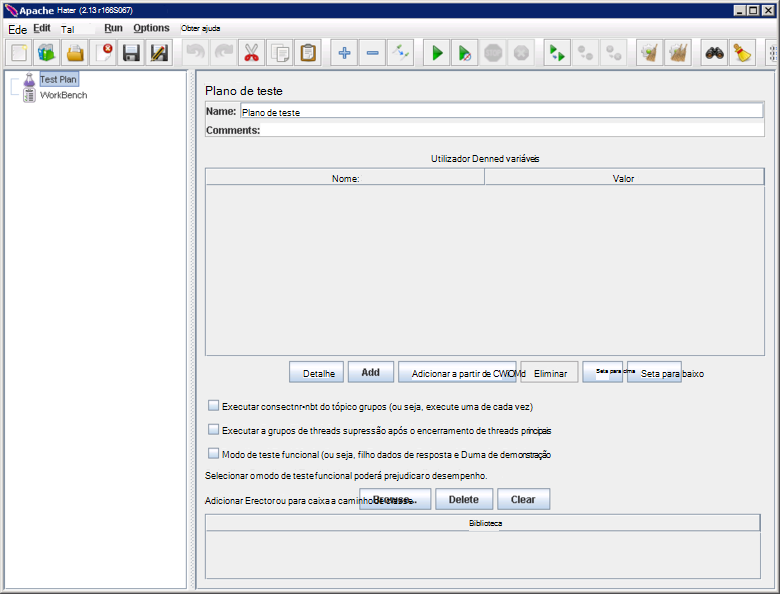

<properties
   pageTitle="Criar um testes de desempenho ambiente para Elasticsearch | Microsoft Azure"
   description="Como configurar um ambiente para testar o desempenho de um cluster de Elasticsearch."
   services=""
   documentationCenter="na"
   authors="dragon119"
   manager="bennage"
   editor=""
   tags=""/>

<tags
   ms.service="guidance"
   ms.devlang="na"
   ms.topic="article"
   ms.tgt_pltfrm="na"
   ms.workload="na"
   ms.date="09/22/2016"
   ms.author="masashin"/>
   
# <a name="creating-a-performance-testing-environment-for-elasticsearch-on-azure"></a>Criar um testes de desempenho ambiente para Elasticsearch no Azure

[AZURE.INCLUDE [pnp-header](../../includes/guidance-pnp-header-include.md)]

Este artigo faz [parte de uma série](guidance-elasticsearch.md). 

Este documento descreve como configurar um ambiente para testar o desempenho de um cluster de Elasticsearch. Esta configuração foi utilizada para testar o desempenho do dados ingestão e para a consulta das cargas de trabalho, conforme descrito no [Desempenho ingestão de dados de optimização para Elasticsearch no Azure][].

O processo de teste de desempenho utilizada [Apache JMeter](http://jmeter.apache.org/), com o [conjunto padrão](http://jmeter-plugins.org/wiki/StandardSet/) de plug-ins instalado numa configuração principal/subordinado utilizando um conjunto de VMs dedicados (que não faz parte do Elasticsearch cluster) especificamente configurado para o objetivo. 

O [Desempenho Server Agent](http://jmeter-plugins.org/wiki/PerfMonAgent/) foi instalado em cada nó Elasticsearch. As secções seguintes fornecem instruções para recriar o ambiente de teste para permitir a realizar a sua própria testar com JMeter de desempenho. Estas instruções partem do pressuposto de que já criou um cluster de Elasticsearch connosco ligado através de uma rede virtual Azure. 

Tenha em atenção que também executa o ambiente de teste como um conjunto de VMs Azure gerido utilizando um grupo de recursos Azure único.

[Marvel](https://www.elastic.co/products/marvel) também foi instalado e configurado para ativar os aspetos internos da cluster Elasticsearch monitorizadas e analisadas mais facilmente. Se as estatísticas de JMeter mostrava um pico ou um canal no desempenho, informações disponíveis através de Marvel podem ser inestimável para ajudar a determinar a causa das variações.

A imagem seguinte mostra a estrutura da totalidade do sistema. 


Tenha em atenção os seguintes pontos:

- O modelo global de JMeter VM executa o Windows Server para fornecer o ambiente de interface gráfica do utilizador da consola de JMeter. O modelo global de JMeter VM fornece a interface gráfica (a aplicação *jmeter* ) para ativar um teste a testes de criar, executar testes e visualizar os resultados. Este VM coordenadas com o servidor de JMeter VMs que realmente enviar os pedidos de que constituem os testes.

- Os VMs subordinadas JMeter executam Ubuntu Server (Linux), não existe nenhuma requisito interface gráfica para estes VMs. O servidor de JMeter VMs de executar o software de servidor (a aplicação *jmeter server* ) para enviar pedidos para Elasticsearch cluster JMeter.

- Nós de cliente dedicado não foram utilizados, embora foram dedicadas nós principais.

- O número de nós de dados no cluster pode variar, consoante o cenário que está a ser testado.

- Todos os nós no Elasticsearch cluster executem Marvel observar o tempo de execução de desempenho e o agente de servidor de JMeter para recolher dados de monitorização para análise posterior.

- Quando testar Elasticsearch 2.0.0 e mais tarde, um de nós dados também é executado Kibana. Este é necessário pela versão do Marvel que é executada no Elasticsearch 2.0.0 e versões posteriores.

## <a name="creating-an-azure-resource-group-for-the-virtual-machines"></a>Criar um grupo de recursos Azure para as máquinas virtuais

O modelo global de JMeter tem de estar possível ligar diretamente a cada um de nós do cluster Elasticsearch para recolher dados de desempenho. Se o JMeter VNet são distinta do Elasticsearch cluster VNet, em seguida, isto implica configurar cada nó Elasticsearch com um endereço IP público. Se este for um problema com a sua configuração Elasticsearch, em seguida, considere a implementação de VMs JMeter no mesmo VNet como Elasticsearch cluster utilizando o mesmo grupo de recursos, caso em que pode omitir este procedimento primeiro.

Em primeiro lugar, [criar um grupo de recursos](../resource-group-template-deploy-portal.md). Este documento assume que o seu grupo de recursos se chamar *JMeterPerformanceTest*. Se pretender executar o VMs JMeter no mesmo VNet como Elasticsearch cluster, utilize o mesmo grupo de recursos como esse cluster em vez de criar um novo.

## <a name="creating-the-jmeter-master-virtual-machine"></a>Criar a máquina virtual mestra JMeter

Seguinte [criar uma VM Windows](../virtual-machines/virtual-machines-windows-hero-tutorial.md) utilizando a imagem do *Windows Server 2008 R2 SP1* .  Recomendamos que selecione um tamanho da memória virtual com suficientes núcleos e memória para executar os testes de desempenho. Idealmente esta será uma máquina com, pelo menos, 2 núcleos e 3,5 GB de RAM (A2 padrão ou maior).

<!-- TODO add info on why disabling diagnostics is positive --> 

Recomendamos que desativar diagnósticos. Ao criar a VM no portal do, isto é feito no pá a *Definições* , na secção *monitorização* em *diagnóstico*. Deixe as outras definições nos valores predefinidos.

Certifique-se de que a VM e todos os recursos associados foi criados com êxito, [examinar o grupo de recursos](../azure-portal/resource-group-portal.md#manage-resource-groups) no portal. Os recursos listados devem ser composto por uma VM, um grupo de segurança de rede e um endereço IP público tudo com o mesmo nome e a conta de interface e armazenamento de rede com nomes com base em que a VM.

## <a name="creating-the-jmeter-subordinate-virtual-machines"></a>Criar as máquinas virtuais subordinadas JMeter

Agora [criar uma VM Linux](../virtual-machines/virtual-machines-linux-quick-create-portal.md) utilizando a imagem *Ubuntu Server 14.04 LTS* .  Tal como acontece com a VM mestra JMeter, selecione um tamanho da memória virtual com suficientes núcleos e memória para executar os testes de desempenho. Idealmente esta será uma máquina com, pelo menos, 2 núcleos e pelo menos 3,5 GB de RAM (A2 padrão ou maior).

Novamente, recomendamos que desativar diagnósticos.

Pode criar tantas VMs subordinadas conforme pretender. 

## <a name="installing-jmeter-server-on-the-jmeter-subordinate-vms"></a>Instalar o servidor de JMeter nas VMs subordinadas JMeter

Os VMs subordinadas JMeter estiver a executar Linux e por predefinição se conseguir ligar à-los ao abrir uma ligação de ambiente de trabalho remoto (RDP). Em vez disso, pode [utilizar betumes para abrir uma janela de linha de comandos](../virtual-machines/virtual-machines-linux-mac-create-ssh-keys.md) em cada VM.

Assim que ligou a uma das VMs subordinadas, vamos utilizar festa configurar JMeter.

Em primeiro lugar, instale o ambiente do Runtime Java requerem a execução da JMeter.

```bash
sudo add-apt-repository ppa:webupd8team/java
sudo apt-get update
sudo apt-get install oracle-java8-installer
```

Agora, transfira o software de JMeter fornecido como um ficheiro zip.

```bash
wget http://apache.mirror.anlx.net/jmeter/binaries/apache-jmeter-2.13.zip
```

Instalar o comando unzip, em seguida, utilizá-la para expandir o software JMeter. O software é copiado para uma pasta denominada **apache-jmeter-2.13**.

```bash
sudo apt-get install unzip
unzip apache-jmeter-2.13.zip
```

Alterar para o directório da *Reciclagem* mantém os executáveis JMeter e como fazer com que os programas do *servidor de jmeter* e *jmeter* executável.

```bash
cd apache-jmeter-2.13/bin
chmod u+x jmeter-server
chmod u+x jmeter
```

Agora, precisamos de editar o ficheiro `jmeter.properties` localizada na pasta atual (utilize o editor de texto que conhece mais, tal como *vi* ou *vim*). Localize as linhas seguintes:

```yaml
...
client.rmi.localport=0
...
server.rmi.localport=4000
...
```

Remova os comentários (remover os espaços à esquerda \#carateres #) e modificar estas linhas, conforme apresentado abaixo, em seguida, guarde o ficheiro e feche o editor de:

```yaml
...
client.rmi.localport=4441
...
server.rmi.localport=4440
```

Agora, execute os seguintes comandos para abrir a porta 4441 a entrada de tráfego TCP (isto é a porta que acabou de configurar *jmeter servidor* a escutar):

```bash
sudo iptables -A INPUT -m state --state NEW -m tcp -p tcp --dport 4441 -j ACCEPT
```

Transfira o ficheiro zip que contém o conjunto padrão de plug-ins para JMeter (estes plug-ins fornecem contadores monitorização de desempenho) e, em seguida, deszipar o ficheiro para a pasta **apache-jmeter-2.13** . Unzipping o ficheiro na seguinte localização coloca os plug-ins na pasta correta.

Se lhe for pedido para substituir o ficheiro de licença, escreva A (para todos):

```bash
wget http://jmeter-plugins.org/downloads/file/JMeterPlugins-Standard-1.3.0.zip
unzip JMeterPlugins-Standard-1.3.0.zip
```

Utilizar `nohup` para iniciar o servidor de JMeter em segundo plano. Deverá responder ao apresentar um ID de processo e uma mensagem a indicar que tenha criado um objecto remoto e está pronto para começar a receber comandos.  Execute o seguinte comando no diretório ~/apache-jmeter-2.13/bin. 

```bash
nohup jmeter-server &
```

> [AZURE.NOTE]Se a VM é encerramento o programa do servidor JMeter é terminado. Terá de ligar para a VM e reinicie-o novamente manualmente. Em alternativa, pode configurar o sistema para executar o comando *jmeter server* automaticamente no arranque, adicionando os seguintes comandos para o `/etc/rc.local` ficheiro (antes do comando *Sair 0* ):

```bash
sudo -u <username> bash << eoc
cd /home/<username>/apache-jmeter-2.13/bin
nohup ./jmeter-server &
eoc
```

Substituir `<username>` com o seu nome de início de sessão.

Poderá ser útil para manter a janela de terminal aberto para que pode monitorizar o progresso do servidor JMeter enquanto teste está em curso.

Terá de repetir estes passos para cada VM subordinada de JMeter.

## <a name="installing-the-jmeter-server-agent-on-the-elasticsearch-nodes"></a>Instalar o agente de servidor do JMeter em nós Elasticsearch

Este procedimento assume que tem acesso de início de sessão para os nós Elasticsearch. Se tiver criado o cluster utilizando o modelo de Gestor de recursos, pode ligar a cada nó através da caixa de salto VM, conforme ilustrado na secção de topologia de Elasticsearch da [Elasticsearch em execução no Azure](guidance-elasticsearch-running-on-azure.md). Pode ligar para a caixa de hiperligação utilizando betumes também. 

A partir daqui, pode utilizar o comando *ssh* para iniciar sessão cada um de nós do cluster Elasticsearch.

Inicie sessão num de nós Elasticsearch como administrador.  Na linha de comandos festa, introduza os seguintes comandos para criar uma pasta para a suspensão o JMeter Server Agent e deslocar-se para essa pasta:

```bash
mkdir server-agent
cd server-agent
```

Execute os seguintes comandos para instalar o comando *unzip* (se não estiver já instalado), transferir o software do agente de servidor JMeter e deszipe-lo:

```bash
sudo apt-get install unzip
wget http://jmeter-plugins.org/downloads/file/ServerAgent-2.2.1.zip
unzip ServerAgent-2.2.1.zip
```
 
Execute o seguinte comando para configurar a firewall e ativar o tráfego de TCP a passar porta 4444 (isto é a porta utilizada pelo agente de servidor JMeter):

```bash
sudo iptables -A INPUT -m state --state NEW -m tcp -p tcp --dport 4444 -j ACCEPT
```

Execute o seguinte comando para iniciar o JMeter Server Agent em segundo plano:

```bash
nohup ./startAgent.sh &
```

O JMeter Server Agent deverá responder com as mensagens que indica que foi iniciado e está a escutar porta 4444.  Prima Enter para obter uma linha de comandos e, em seguida, execute o seguinte comando.

```bash
telnet <nodename> 4444
```

Substituir `<nodename>` com o nome do seu nó. (Pode encontrar o nome do seu nó ao executar o `hostname` comando.) Este comando abre uma ligação de telnet à porta 4444 no seu computador local. Pode utilizar esta ligação para verificar o JMeter Server Agent está a funcionar corretamente.

Se o JMeter Server Agent não está em execução, receberá a resposta 

`*telnet: Unable to connect to remote host: Connection refused*.`

Se está a ser executado o JMeter Server Agent e porta 4444 ter sido configurada corretamente, deverá ver a seguinte resposta:


> [AZURE.NOTE] A sessão telnet não fornece qualquer tipo de linha de comandos quando tem estabelecida.

Na sessão telnet, escreva o seguinte comando:

``` 
test
```

Se o JMeter Server Agent está configurado e ouvir corretamente, deverá indicar que o comando-recebidos e responder com a mensagem *Yep*.

> [AZURE.NOTE]Pode escrever noutros comandos para obter os dados de monitorização de desempenho. Por exemplo, o comando `metric-single:cpu:idle` irá dar-lhe a proporção atual do momento em que a CPU está inactiva (isto é um instantâneo). Para obter uma lista completa de comandos, visite a página de [Agente de servidor de desempenho](http://jmeter-plugins.org/wiki/PerfMonAgent/) . : Voltar a ligar-ele agente de servidor de desempenho. >>

Na sessão telnet, escreva o seguinte comando para sair da sessão e voltar para a linha de comandos festa:

``` 
exit
```

> [AZURE.NOTE]Como com a JMeter subordinadas VMs, se terminar sessão ou se nesta máquina for encerramento e reiniciado, em seguida, o JMeter Server Agent terá de ser reiniciado manualmente, utilizando o `startAgent.sh` comando. Se pretender que o JMeter Server Agent para iniciar automaticamente, adicione o seguinte comando para o fim da `/etc/rc.local` ficheiro, antes do comando *Sair 0* . 
> Substituir `<username>` com o seu nome de início de sessão:

```bash
sudo -u <username> bash << eoc
cd /home/<username>/server-agent
nohup ./startAgent.sh &
eoc
```

Pode agora quer repetir o processo inteiro para todas as outras nó no Elasticsearch cluster ou pode utilizar o `scp` comando para copiar a pasta do agente de servidor e o conteúdo para cada nó e utilizar o `ssh` comando iniciar o JMeter Server Agent, conforme apresentado abaixo. "e" substituir `<username>` com o seu nome de utilizador e `<nodename>` com o nome do nó onde pretende copiar e executar o software (que poderá ser-lhe pedido para fornecer a palavra-passe, tal como executar cada comando):

```bash
scp -r \~/server-agent <username>@<nodename>:\~
ssh <nodename> sudo iptables -A INPUT -m state --state NEW -m tcp -p tcp --dport 4444 -j ACCEPT
ssh <nodename> -n -f 'nohup \~/server-agent/startAgent.sh'
```

## <a name="installing-and-configuring-jmeter-on-the-jmeter-master-vm"></a>Instalar e configurar o JMeter a VM mestra JMeter

No portal do Azure, clique em **grupos de recursos**. Na pá **grupos de recursos** , clique em grupo de recursos que contém o modelo global de JMeter e VMs subordinadas.  Na pá **grupo de recursos** , clique na **VM mestra JMeter**. Na pá máquina virtual, na barra de ferramentas, clique em **Ligar**. Abra o ficheiro RDP quando lhe for pedido pelo web browser. Windows cria uma ligação de ambiente de trabalho remoto para sua VM.  Introduza o nome de utilizador e palavra-passe para a VM quando lhe for pedido.

Na VM, utilizando o Internet Explorer, aceda à página [Transferir Java para Windows](http://www.java.com/en/download/ie_manual.jsp) . Siga as instruções para transferir e executar o instalador do Java.

No browser, aceda à página [Transferir JMeter Apache](http://jmeter.apache.org/download_jmeter.cgi) e transfira zip que contém o ficheiro binário mais recente. Guarde a zip numa localização conveniente no seu VM.

Aceda ao site do [Plug-ins do personalizada JMeter](http://jmeter-plugins.org/) e transferir o conjunto padrão de plug-ins. Guarde a zip na mesma pasta como a transferência de JMeter a partir do passo anterior.

No Explorador do Windows, vá para a pasta que contém o apache-jmeter -*xxx* ficheiro zip, onde *xxx* é a versão atual do JMeter. Extrai os ficheiros para a pasta atual.

Extrair os ficheiros na JMeterPlugins-padrão -*aaa*ficheiro. zip, onde *aaa* é a versão atual do plug-ins, para o apache-jmeter -*xxx* pasta. Isto irá adicionar os plug-ins para a pasta correta para JMeter. Em segurança pode intercalar as pastas da biblioteca e substituir os ficheiros de licença e leia-me se lhe for solicitado.

Vá para o apache-jmeter -*xxx*/bin pasta e editar o jmeter.properties ficheiro utilizando bloco de notas.  No `jmeter.properties` de ficheiros, localize a secção rotulada *anfitriões remotos e configuração RMI*.  Nesta secção do ficheiro, localize a linha seguinte:

```yaml
remote_hosts=127.0.0.1
```

Alterar esta linha e substitua a lista de endereços 127.0.0.1 com uma vírgula separados do IP de endereços IP ou nomes de anfitrião para cada um dos servidores JMeter subordinados. Por exemplo:

```yaml
remote_hosts=JMeterSub1,JMeterSub2
```

Encontrar a linha seguinte, em seguida, remova o `#` caráter no início da linha e modificar o valor das definições de client.rmi.localport das:

```yaml
#client.rmi.localport=0
```

a:

```yaml
client.rmi.localport=4440
```

Guarde o ficheiro e feche o bloco de notas. 

Na barra de ferramentas Windows, clique em **Iniciar**, clique em **Ferramentas administrativas**e, em seguida, clique em **Firewall do Windows com segurança avançada**.  Na Firewall do Windows com a janela de segurança avançada, no painel esquerdo, com o botão direito **Regras de entrada**e, em seguida, clique em **Nova regra**.

No **Assistente de novas regras de entrada**, na página **Tipo de regra** , selecione **porta**e, em seguida, clique em **seguinte**.  Na página de todas as portas e protocolos, selecionar **TCP**, selecione **portas locais específicas**, na caixa, escreva texto `4440-4444`e, em seguida, clique em **seguinte**.  Na página de ação, selecione **Permitir a ligação**e, em seguida, clique em **seguinte**. Na página de perfil, deixe todas as opções de selecionada e, em seguida, clique em **seguinte**.  Na página de nome, no **nome da** caixa de texto escreva *JMeter*e, em seguida, clique em **Concluir**.  Feche a Firewall do Windows com a janela de segurança avançada.

No Explorador do Windows, o apache-jmeter*xx*/bin pasta, faça duplo clique sobre o ficheiro de comandos do Windows *jmeter* para iniciar a interface gráfica. Deverá aparecer a interface de utilizador:



Na barra de menus, clique em **Executar**, clique em **Iniciar remoto**e certifique-se de que as duas máquinas subordinadas JMeter estão listadas:


Agora está pronto para começar a testes de desempenho.

## <a name="installing-and-configuring-marvel"></a>Instalar e configurar Marvel

O modelo de guia de introdução Elasticsearch para Azure irá instalar e configurar automaticamente a versão adequada do Marvel se definir os parâmetros MARVEL e KIBANA para true ("Sim") durante a criação de cluster:


Se está a adicionar Marvel a um cluster existente necessitar de efetuar a instalação manualmente e o processo é diferente, dependendo se estiver a utilizar a versão de Elasticsearch 1.7.x ou 2. x, tal como descrito nos seguintes procedimentos.

### <a name="installing-marvel-with-elasticsearch-173-or-earlier"></a>Instalar o Marvel com Elasticsearch 1.73 ou anterior

Se estiver a utilizar o Elasticsearch 1.7.3 ou versões anteriores, efetuar os seguintes passos *em todos os nós* no cluster:

- Inicie sessão para o nó e deslocar-se para o diretório de Elasticsearch.  No Linux, é o diretório típico `/usr/share/elasticsearch`.

-  Execute o seguinte comando para transferir e instalar o plug-in Marvel para Elasticsearch:

```bash
sudo bin/plugin -i elasticsearch/marvel/latest
```

- Parar e recomeçar Elasticsearch no nó:

```bash
sudo service elasticsearch restart
```

- Para verificar que Marvel foi instalado corretamente, abra um browser e aceda ao URL `http://<server>:9200/_plugin/marvel`. Substituir `<server>` com o nome ou endereço IP do servidor qualquer Elasticsearch no cluster.  Certifique-se de que é apresentada uma página semelhante ao que é mostrado abaixo:


### <a name="installing-marvel-with-elasticsearch-200-or-later"></a>Instalação Marvel com Elasticsearch 2.0.0 ou posterior

Se estiver a utilizar o Elasticsearch 2.0.0 ou mais tarde, efetuar as seguintes tarefas *em todos os nós* no cluster:

Inicie sessão no nó e deslocar-se para o diretório de Elasticsearch (normalmente `/usr/share/elasticsearch`) execute os seguintes comandos para transferir e instalar o plug-in Marvel para Elasticsearch:

```bash
sudo bin/plugin install license
sudo bin/plugin install marvel-agent
```

Parar e recomeçar Elasticsearch no nó:

```bash
sudo service elasticsearch restart
```

No procedimento que se segue, substitua `<kibana-version>` com 4.2.2 se estiver a utilizar Elasticsearch 2.0.0 ou Elasticsearch 2.0.1 ou com 4.3.1 se estiver a utilizar Elasticsearch 2.1.0 ou posterior.  Substituir `<marvel-version>` com 2.0.0 se estiver a utilizar Elasticsearch 2.0.0 ou Elasticsearch 2.0.1 ou com 2.1.0 se estiver a utilizar Elasticsearch 2.1.0 ou posterior.  Efetue as seguintes tarefas *num único nó* cluster:

Iniciar sessão nó e transfira a compilação adequada do Kibana para a sua versão de Elasticsearch a partir de [Elasticsearch transferir o web site](https://www.elastic.co/downloads/past-releases)e, em seguida, extraia o pacote de:

```bash
wget https://download.elastic.co/kibana/kibana/kibana-<kibana-version>-linux-x64.tar.gz
tar xvzf kibana-<kibana-version>-linux-x64.tar.gz
```

Abra a porta 5601 para aceitar pedidos recebidos:

```bash
sudo iptables -A INPUT -m state --state NEW -m tcp -p tcp --dport 5601 -j ACCEPT
```

Mover para a pasta de config Kibana (`kibana-<kibana-version>-linux-x64/config`), editar o `kibana.yml` ficheiro e, adicione a linha seguinte. Substituir `<server>` com o nome ou endereço IP de um servidor de Elasticsearch no cluster:

```yaml
elasticsearch.url: "http://<server>:9200"
```

Deslocar-se para a pasta de bin Kibana (`kibana-<kibana-version>-linux-x64/bin`), e execute o seguinte comando para integrar o plug-in Marvel Kibana:

```bash
sudo ./kibana plugin --install elasticsearch/marvel/<marvel-version>
```

Inicie Kibana:

```bash
sudo nohup ./kibana &
```

Para verificar a instalação Marvel, abra um browser e aceda ao URL `http://<server>:5601/app/marvel`. Substituir `<server>` com o nome ou endereço IP do servidor a executar Kibana.

Certifique-se de que é apresentada uma página semelhante às apresentadas abaixo (o nome do seu cluster provavelmente variam de mostrado na imagem).


Clique na ligação que corresponde ao seu cluster (elasticsearch210 na imagem acima). Deverá aparecer uma página semelhante ao que é mostrado abaixo:


[Otimização do desempenho do ingestão dados para Elasticsearch no Azure]: guidance-elasticsearch-tuning-data-ingestion-performance.md  