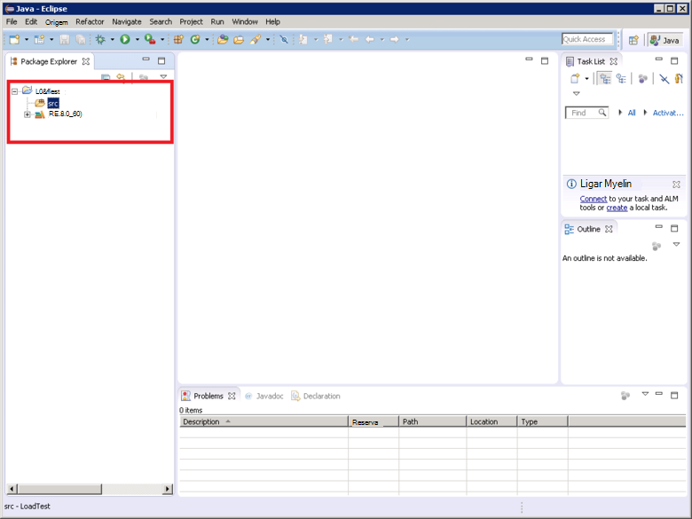

<properties
   pageTitle="Implementar uma demonstração de JMeter JUnit para testar o desempenho do Elasticsearch | Microsoft Azure"
   description="Como utilizar uma demonstração de JUnit para gerar e carregue os dados a um cluster de Elasticsearch."
   services=""
   documentationCenter="na"
   authors="dragon119"
   manager="bennage"
   editor=""
   tags=""/>

<tags
   ms.service="guidance"
   ms.devlang="na"
   ms.topic="article"
   ms.tgt_pltfrm="na"
   ms.workload="na"
   ms.date="09/22/2016"
   ms.author="masashin"/>
   
# Implementar uma demonstração de JMeter JUnit para testar o desempenho do Elasticsearch

[AZURE.INCLUDE [pnp-header](../../includes/guidance-pnp-header-include.md)]

Este artigo faz [parte de uma série](guidance-elasticsearch.md). 

Este documento descreve como criar e utilizar uma demonstração de JUnit que pode gerar e carregue os dados a um cluster de Elasticsearch como parte de um plano de teste JMeter. Esta abordagem fornece uma abordagem altamente flexível para carregar testes que pode gerar grandes quantidades de dados de teste sem dependendo ficheiros de dados externos.

> [AZURE.NOTE] Os testes de carga utilizados para avaliar o desempenho do ingestão dados descrito no [Desempenho ingestão de dados de optimização para Elasticsearch](guidance-elasticsearch-tuning-data-ingestion-performance.md) foram construídos utilizando esta abordagem. Os detalhes do código JUnit sejam descritas nesse documento.

Para um desempenho testes de ingestão dados, o código de JUnit foi desenvolver utilizando Eclipse (Marte) e dependências foram resolvidas utilizando Maven. Os procedimentos seguintes descrevem o processo de passo a passo de Eclipse a instalar, configurar Maven, criação de um teste JUnit e implementar o este teste como uma amostra de pedido de JUnit um teste JMeter.

> [AZURE.NOTE] Para obter informações detalhadas sobre a estrutura e configuração do ambiente de teste, consulte o artigo [criar um ambiente de teste de desempenho para Elasticsearch no Azure][].

## Pré-requisitos de instalação

Terá do [Ambiente de Runtime Java](http://www.java.com/en/download/ie_manual.jsp) no seu computador de desenvolvimento.
Também terá de instalar o [Eclipse IDE para programadores de Java](https://www.eclipse.org/downloads/index.php?show_instructions=TRUE).

> [AZURE.NOTE] Se estiver a utilizar o VM mestra JMeter descrito na [criação de um ambiente de teste de desempenho para Elasticsearch no Azure][] como o seu ambiente de desenvolvimento, transfira a versão Windows de 32 bits do Eclipse Installer.

## Criar um projeto de teste JUnit de carregamento testes Elasticsearch

Inicie o IDE Eclipse se não estiver já executado e, em seguida, feche a página de **boas-vindas** .  No menu **ficheiro** , clique em e, em seguida, clique em **Projeto Java**.

Na janela do **Novo projeto de Java** , introduza um nome de projeto, selecione **Utilizar predefinição JRE**e, em seguida, clique em **Concluir**.

Na janela do **Explorador do pacote** , expanda o nó com o nome do projeto. Certifique-se de que contém uma pasta com o nome **src** e uma referência a JRE que especificou.

Botão direito do rato na pasta **src** , clique em **Novo**e, em seguida, clique em **caso de teste JUnit**.

Na janela de **novo incidente de teste de JUnit** , selecione **teste de novo Junit 4**, introduza um nome para o pacote (Isto pode ser o mesmo que o nome do projeto, embora por convenção este deverá começar por uma letra minúscula), um nome para a classe de teste e selecione as opções que geram os fragmentos método necessários para o seu teste. Deixe a caixa de **classe em teste** vazia e, em seguida, clique em **Concluir**.

Se for apresentada a caixa de diálogo **novo incidente de teste de JUnit** seguinte, selecione a opção para adicionar a biblioteca de JUnit 4 para o caminho de compilação e, em seguida, clique em **OK**. 

Certifique-se de que o código de estrutura para o teste de JUnit é gerado e apresentado na janela do editor de Java.

No **Explorador do pacote**, direito do rato para o seu projeto, clique em **Configurar**e, em seguida, clique em **Converter para Maven projeto**.

> [AZURE.NOTE]Utilizar permite Maven a mais facilmente gerir dependências externas (como as bibliotecas do cliente Elasticsearch Java) um projeto depende do.

Na caixa de diálogo **Criar novo POM** , na lista pendente **embalagem** , selecione **para caixa**e, em seguida, clique em **Concluir**.

O painel que aparece por baixo do editor de modelo (POM) de objeto do projeto podem ser apresentadas o aviso "o caminho de compilação Especifica o ambiente de execução de 1,5 J2SE. Não existem sem JREs instalados na área de trabalho que são estritamente compatíveis com este ambiente", dependendo de qual a versão do Java está instalado no seu computador de desenvolvimento. Se tiver uma versão do Java posterior à versão 1.5 com segurança pode ignorar este aviso.

No editor de POM, expanda **Propriedades** e, em seguida, clique em **Criar**.

Na caixa de diálogo **Adicionar propriedade** , na caixa **nome** escreva *es.version*, na caixa **valor** , escreva *1.7.2*e, em seguida, clique em **OK**. Esta é a versão da biblioteca de cliente Elasticsearch Java para utilizar (esta versão pode ser substituída no futuro, e que define a versão como uma propriedade POM e referenciar esta propriedade noutro local do projeto permite a versão para ser alteradas rapidamente.)

Clique no separador **dependências** na base do editor de POM e, em seguida, clique em **Adicionar** ao lado da lista de **dependências** .

Na caixa de diálogo **Selecione dependência** , na caixa **Id de grupo** , escreva *org.elasticsearch*, na caixa **Id artefacto** escreva *elasticsearch*, na caixa, escreva **versão** * \${es.version}*e, em seguida, clique em **OK**. Informações sobre a biblioteca de cliente Java Elasticsearch são mantidas no repositório Maven Central online e, esta configuração irá transferir automaticamente a biblioteca e respectivas dependências quando o projeto é criado.

No menu **ficheiro** , clique em **Guardar tudo**. Esta ação irá guardar e crie o projeto, transferir as dependências especificadas pelo Maven. Certifique-se de que a pasta de Maven dependências é apresentada no Explorador do pacote. Expanda esta pasta para ver os ficheiros para caixa transferidos para a biblioteca do cliente Elasticsearch Java de suporte.

## Importar um projeto de teste JUnit existente para Eclipse

Este procedimento assume que transferiu um projeto de Maven que foi criado anteriormente utilizando Eclipse.

Inicie o Eclipse IDE. No menu **ficheiro** , clique em **Importar**.

Na janela do **Selecione** , expanda a pasta **Maven** , clique em **Projetos de Maven existente**e, em seguida, clique em **seguinte**.

Na janela do **Maven projetos** , especifique a pasta mantendo a tecla do projecto (a pasta que contém o ficheiro pom.xml), clique em **Selecionar tudo**e, em seguida, clique em **Concluir**.

Na janela do **Explorador do pacote** , expanda o nó correspondente ao seu projeto. Certifique-se de que o project contém uma pasta denominada **src**. Esta pasta contém o código de origem para o teste de JUnit. O project pode ser compilada e implementado seguindo as instruções abaixo.

## Implementar um teste JUnit para JMeter

Este procedimento assume que criou um projeto com o nome LoadTest que contém uma classe de teste de JUnit denominada `BulkLoadTest.java` que aceita parâmetros de configuração transmitidos como uma única cadeia para um construtor (este é o mecanismo que JMeter espera).

No IDE Eclipse, no **Explorador do pacote**, clique com o botão direito do rato em projeto e, em seguida, clique em **Exportar**.

No **Assistente de exportação**, na página **Selecionar** , expanda o nó **Java** , clique em **JAR ficheiro**e, em seguida, clique em **seguinte**.

Na página **JAR a especificação de ficheiro** , na caixa **selecionar os recursos para exportar** , expanda o projecto desmarcar **.project**e desmarcar **pom.xml**. Na caixa **JAR ficheiro** , forneça um nome de ficheiro e a localização para a caixa (-deve ser atribuída a extensão de ficheiro .jar) e, em seguida, clique em **Concluir**.

Utilizando o Explorador do Windows, copie o ficheiro de para caixa que acabou de criar para o JVM mestra JMeter e guarde-o no apache-jmeter-2.13\\biblioteca\\junit pasta sob a pasta onde instalou JMeter (consulte o procedimento "Criar a máquina virtual mestra JMeter" na [criação de um ambiente de teste de desempenho para Elasticsearch no Azure](guidance-elasticsearch-creating-performance-testing-environment.md) para obter mais informações.)

Regresse ao Eclipse, expandir a janela do **Explorador de pacote** e tome nota de todos os ficheiros para caixa e os seus locais listados na pasta Maven dependências do projeto. Note que os ficheiros apresentados na seguinte imagem podem variar, dependendo de qual a versão do Elasticsearch estiver a utilizar:

Utilizando o Explorador do Windows, copiar a cada ficheiro para caixa referenciado na pasta Maven dependências para o 2.13 de jmeter apache\\biblioteca\\pasta junit a VM mestra JMeter.

Se a biblioteca\\junit pasta já contém versões mais antigas destes ficheiros para caixa, em seguida, removê-los. Se as deixar no local, em seguida, o teste de JUnit poderá não funcionar como referências poderão ser resolvidas para os jarros errados.

No JMeter modelo global de VM, pare JMeter se atualmente em execução.  Inicie o JMeter.  No JMeter, com o botão direito **Plano de teste**, clique em **Adicionar**, clique em **Threads (utilizadores)**e, em seguida, clique em **Grupo de tópico**.

Em nó do **Plano de teste** , com o botão direito **Tópico grupo**, clique em **Adicionar**, clique em **demonstração**e, em seguida, clique em **Pedido de JUnit**.

Na página **JUnit pedido** , selecione **Procurar JUnit4 anotações (em vez de JUnit 3)**. Na lista pendente **NomeClasse** , selecione a sua aula de teste de carga JUnit (este será listado no formulário de * &lt;pacote&gt;.&lt; classe&gt;*), no **Método de testar** selecione de lista pendente o JUnit método de ensaio (este é o método que realmente executa o trabalho associado o teste e deve marcada com o *@test* anotação no projeto Eclipse) e introduza a transmitir ao construtor na caixa **Etiqueta de cadeia do construtor** de quaisquer valores. Os detalhes apresentados na seguinte imagem são exemplos basta; **NomeClasse**, * *Método de ensaio*, e * *Rótulo da cadeia de construtor** provavelmente serão diferentes a partir desses mostrado.

Se a sua aula não aparecer na lista pendente **NomeClasse** , provavelmente significa que para a caixa não foram corretamente exportada ou não foi colocada na biblioteca\\junit pasta, ou algumas dos jarros dependentes estão em falta a biblioteca\\junit pasta. Se tal acontecer, exportar o projeto de Eclipse novamente e certifique-se de que selecionou o recurso **src** , copiar para a caixa para a biblioteca\\junit pasta e, em seguida, certifique-se de que copiou todas os jarros dependentes listados por Maven para a pasta de biblioteca.

Feche JMeter. Não é necessário para guardar o plano de teste.  Copie o ficheiro para caixa que contém a classe de teste JUnit para o /home/&lt;nome de utilizador&gt;/apache-jmeter-2.13/lib/junit pasta em cada uma das VMs subordinadas JMeter (*&lt;nome de utilizador&gt; * é o nome do utilizador administrativo que especificou quando criou a VM, consulte o artigo o procedimento "Criar as máquinas virtuais subordinadas JMeter" na [criação de um ambiente de teste de desempenho para Elasticsearch no Azure](guidance-elasticsearch-creating-performance-testing-environment.md) para obter mais informações.)

Copie os ficheiros para caixa dependentes exigidos pela classe de teste JUnit para o /home/&lt;nome de utilizador&gt;/apache-jmeter-2.13/lib/junit pasta em cada uma das VMs subordinadas JMeter. Certifique-se remover quaisquer versões anteriores de ficheiros para caixa a partir desta pasta pela primeira vez.

Pode utilizar o `pscp` utility para copiar ficheiros de um computador Windows para Linux.

[Criar um testes de desempenho ambiente para Elasticsearch no Azure]: guidance-elasticsearch-creating-performance-testing-environment.md
