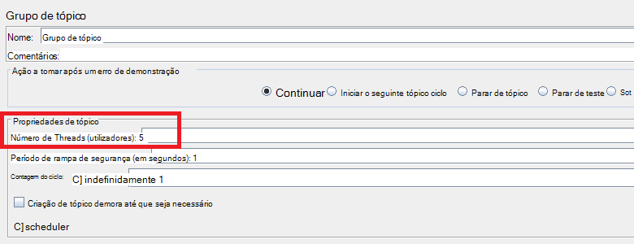
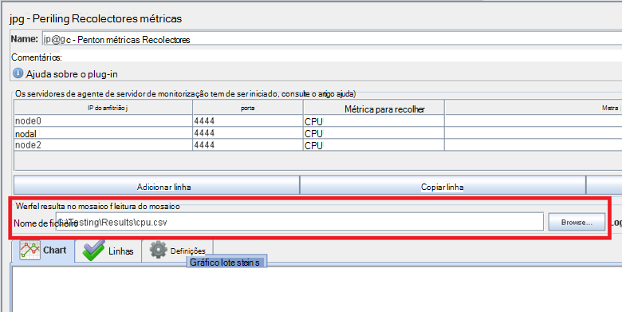
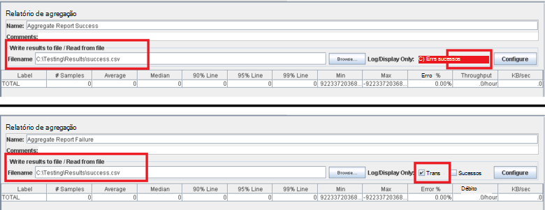
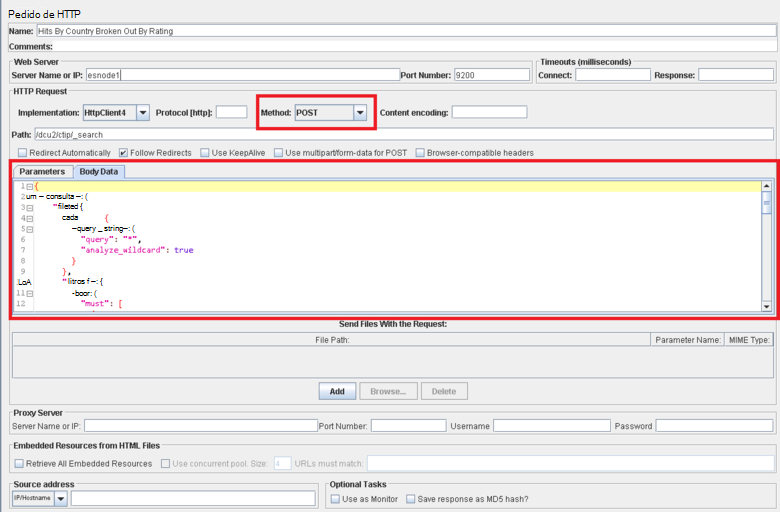

<properties
   pageTitle="Implementar um plano de teste JMeter para Elasticsearch | Microsoft Azure"
   description="Como executar desempenho testes para Elasticsearch com JMeter."
   services=""
   documentationCenter="na"
   authors="dragon119"
   manager="bennage"
   editor=""
   tags=""/>

<tags
   ms.service="guidance"
   ms.devlang="na"
   ms.topic="article"
   ms.tgt_pltfrm="na"
   ms.workload="na"
   ms.date="09/22/2016"
   ms.author="masashin" />
   
# <a name="implementing-a-jmeter-test-plan-for-elasticsearch"></a>Implementar um plano de teste JMeter para Elasticsearch

[AZURE.INCLUDE [pnp-header](../../includes/guidance-pnp-header-include.md)]

Este artigo faz [parte de uma série](guidance-elasticsearch.md). 

Os testes de desempenho realizados contra Elasticsearch foram implementados utilizando planos de teste de JMeter juntamente com o código de Java incorporada como um teste JUnit para desempenhar tarefas como carregar dados para o cluster. O plano de teste e o código de JUnit sejam descritas no [Tuning dados ingestão desempenho para Elasticsearch no Azure][]e [Tuning a agregação de dados e o desempenho da consulta para Elasticsearch no Azure][].

O objetivo deste documento é resumir a experiência de chave adquirida com construir e executar estes planos de teste. A página [JMeter melhores práticas](http://jmeter.apache.org/usermanual/best-practices.html) no Web site da Apache JMeter contém mais GRG conselhos acerca da utilização JMeter eficazmente.

## <a name="implementing-a-jmeter-test-plan"></a>Implementar um plano de teste JMeter

A lista que se segue resume os itens que deverá tomar em consideração quando criar um plano de teste JMeter:

- Crie um grupo de tópico separada para cada teste que pretende executar. Um teste pode conter vários passos, incluindo controladores de lógica, temporizadores, pré e pós processadores, amostradores e listeners.

- Evite criar demasiados threads num grupo de tópico. Um número em excesso de threads originará JMeter falhar com "Fora do memória" exceções. É aconselhável adicionar mais JMeter servidores subordinados cada um um número mais pequeno de threads que tentar executar um grande número de threads num único JMeter servidor a executar.



- Para avaliar o desempenho do cluster, incorpore o plug-in [Recolectores de métricas de desempenho](http://jmeter-plugins.org/wiki/PerfMon/) no plano de teste. Este é um ouvinte JMeter que está disponível como um dos plug-ins de JMeter padrão. Guarde os dados de desempenho em bruto para um conjunto de ficheiros no formato de valores separados por vírgulas (CSV) e processá-las quando o teste estiver concluído. Este é mais eficiente e impõe menos ocular no JMeter que tentar processar os dados tal como é capturado. 



Pode utilizar uma ferramenta essa Excel para importar os dados e gerar um intervalo de gráficos para fins analíticos.

Considere a captura as seguintes informações:

- Utilização da CPU para cada nó no Elasticsearch cluster.

- O número de bytes lidos por segundo a partir do disco para todos os nós.

- Se possível, a percentagem de CPU tempo gasto em espera para e/s a ser executado em cada nó. Esta não é sempre possível para VMs do Windows, mas para Linux pode criar uma métrica personalizada (uma métrica execução) que executa o seguinte comando de shell para invocar *vmstat* num nó:

```Shell
sh:-c:vmstat 1 5 | awk 'BEGIN { line=0;total=0;}{line=line+1;if(line&gt;1){total=total+\$16;}}END{print total/4}'
```

16 de campo no resultado de *vmstat* contém o tempo de CPU gasto aguardar e/s. Para obter mais informações sobre como funciona esta declaração, consulte o [comando vmstat](http://linuxcommand.org/man_pages/vmstat8.html).

- O número de bytes enviadas e recebidas através da rede para cada nó.

- Utilize listeners de agregação relatório em separado para gravar o desempenho e a frequência de operações e sem êxito. Capture dados com e sem êxito para ficheiros de diferentes.



- Manter a cada caso de teste JMeter tão simples quanto possível ativar lhe diretamente relacionar desempenho com ações de teste específico. Para casos de teste que requerem lógica complexa, considere encapsulating esta lógica num teste JUnit e utilizar o pedido de JUnit de demonstração JMeter para executar o teste.

- Utilize o pedido de HTTP de demonstração para executar operações de HTTP, tal como obter, publicar, colocar ou eliminar. Por exemplo, pode executar pesquisas Elasticsearch ao utilizar uma consulta de mensagem e fornecer os detalhes de consulta na caixa *Corpo dados* :



- Para facilitar repetibilidade e reutilização, parametrizar testar os planos de teste de JMeter. Pode, em seguida, utilizar o Editor de scripts para automatizar a execução dos planos de teste.

## <a name="implementing-a-junit-test"></a>Implementar um teste JUnit

Pode incorporar código complexo para um plano de teste JMeter através da criação de uma ou mais testes JUnit. Pode escrever um teste JUnit ao utilizar um ambiente de desenvolvimento integrado Java (IDE) como Eclipse. [Implementar uma demonstração de JMeter JUnit para testar o desempenho do Elasticsearch][] fornece informações sobre como configurar um ambiente de desenvolvimento adequado.

A lista seguinte resume algumas das melhores práticas que deve seguir ao escrever o código de um teste JUnit:

- Utilize o construtor de classe de teste para passar parâmetros de inicialização para o teste. JMeter pode utilizar um construtor que assuma um argumento de única cadeia. No construtor, analisar este argumento os respetivos elementos individuais, conforme o exemplo seguinte de código:

```Java
private String hostName = "";
private String indexName = "";
private String typeName = "";
private int port = 0;
private String clusterName = "";
private int itemsPerBatch = 0;

/\* JUnit test class constructor \*/
public ElasticsearchLoadTest2(String params) {
    /* params is a string containing a set of comma separated values for:
        hostName
        indexName
        typeName
        port
        clustername
        itemsPerBatch
    */

    /* Parse the parameter string into an array of string items */
    String delims = "\[ \]\*,\[ \]\*"; // comma surrounded by zero or more spaces
    String\[\] items = params.split(delims);

    /* Note: Parameter validation code omitted */

    /* Use the parameters to populate variables used by the test */
    hostName = items[0];
    indexName = items[1];
    typeName = items[2];
    port = Integer.parseInt(items[3]);
    clusterName = items[4];
    itemsPerBatch = Integer.parseInt(items[5]);

    if(itemsPerBatch == 0)
        itemsPerBatch = 1000;
}
```

- Evite operações e/s ou outras operações morosas no construtor ou classe de configuração de teste, uma vez que executam sempre que o teste de JUnit é executado. (O mesmo teste JUnit pode executar vários milhares de horas para cada teste de desempenho executados a partir do JMeter.)

- Considere utilizar o programa de configuração único para inicialização dispendioso caso de teste.

- Se o teste requer um grande número de parâmetros de entrada, armazenar informações de configuração de teste num ficheiro de configuração separadas e passar a localização deste ficheiro para o construtor.

- Evite definitivamente codificação caminhos de ficheiros no código de teste de carregamento. Estes podem causar falhas devido a diferenças entre operating systems como o Windows e Linux.

- Utilize declarações para indicar falhas no JUnit testar métodos para que possa controlá-los com JMeter e utilizá-los como métricas de negócio. Se possível, passar volta informações relativas a causa de falha, conforme apresentado na negrito no exemplo seguinte código:

```Java
@Test
public void bulkInsertTest() throws IOException {
    ...
    BulkResponse bulkResponse = bulkRequest.execute().actionGet();
    assertFalse(
        bulkResponse.buildFailureMessage(), bulkResponse.hasFailures());
        ...
}
```


[Running Elasticsearch on Azure]: guidance-elasticsearch-running-on-azure.md
[Otimização do desempenho do ingestão dados para Elasticsearch no Azure]: guidance-elasticsearch-tuning-data-ingestion-performance.md
[Implementar uma demonstração de JMeter JUnit para testar o desempenho do Elasticsearch]: guidance-elasticsearch-deploying-jmeter-junit-sampler.md
[Otimização do desempenho de consulta para Elasticsearch no Azure e agregação de dados]: guidance-elasticsearch-tuning-data-aggregation-and-query-performance.md
