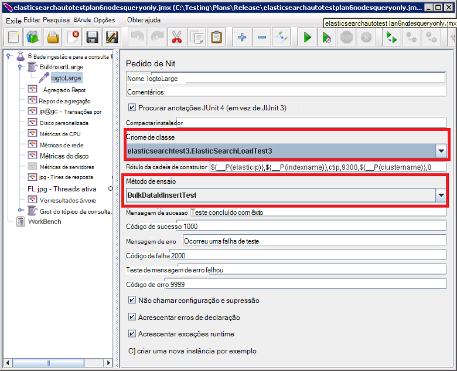

<properties
   pageTitle="Executar os testes de desempenho Elasticsearch automatizados | Microsoft Azure"
   description="Descrição de como pode executar os testes de desempenho no seu ambiente."
   services=""
   documentationCenter="na"
   authors="dragon119"
   manager="bennage"
   editor=""
   tags=""/>

<tags
   ms.service="guidance"
   ms.devlang="na"
   ms.topic="article"
   ms.tgt_pltfrm="na"
   ms.workload="na"
   ms.date="09/22/2016"
   ms.author="masashin"/>
   
# <a name="running-the-automated-elasticsearch-performance-tests"></a>Executar os testes de desempenho Elasticsearch automatizados

[AZURE.INCLUDE [pnp-header](../../includes/guidance-pnp-header-include.md)]

Este artigo faz [parte de uma série](guidance-elasticsearch.md). 

Os documentos [Tuning desempenho de ingestão de dados para Elasticsearch no Azure] e [Tuning a agregação de dados e o desempenho da consulta para Elasticsearch no Azure] descrevem um número de testes de desempenho que foram executar relativamente a um cluster de Elasticsearch de exemplo.

Estes testes foram script para ativá-las ser executado de uma forma automática. Este documento descreve como pode repetir os testes no seu ambiente.

## <a name="prerequisites"></a>Pré-requisitos

Os testes automatizados exigem que os seguintes itens:

-  Um cluster de Elasticsearch.

- Uma configuração de ambiente JMeter, tal como descrito ao documentos de [criar um ambiente de teste de desempenho para Elasticsearch no Azure].

- [Python 3.5.1](https://www.python.org/downloads/release/python-351/) instalado no modelo global de JMeter VM.


## <a name="how-the-tests-work"></a>Como funcionam os testes
Os testes são executados utilizando JMeter. Um servidor de mestre JMeter carrega um plano de teste e transmite-lo para um conjunto de servidores subordinados JMeter que realmente executar os testes. O servidor de mestre JMeter coordenadas os servidores de subordinadas JMeter e acumulado os resultados.

São fornecidos os seguintes planos de teste:

* [elasticsearchautotestplan3nodes.jmx](https://github.com/mspnp/azure-guidance/blob/master/ingestion-and-query-tests/templates/elasticsearchautotestplan3nodes.jmx). É executado o teste de ingestão através de um cluster de nó 3.

* [elasticsearchautotestplan6nodes.jmx](https://github.com/mspnp/azure-guidance/blob/master/ingestion-and-query-tests/templates/elasticsearchautotestplan6nodes.jmx). É executado o teste de ingestão através de um cluster de nó 6.

* [elasticsearchautotestplan6qnodes.jmx](https://github.com/mspnp/azure-guidance/blob/master/ingestion-and-query-tests/templates/elasticsearchautotestplan6qnodes.jmx). É executado o teste ingestão e para a consulta ao longo de um cluster de nó 6.

* [elasticsearchautotestplan6nodesqueryonly.jmx](https://github.com/mspnp/azure-guidance/blob/master/ingestion-and-query-tests/templates/elasticsearchautotestplan6nodesqueryonly.jmx). É executado o teste só de consulta ao longo de um cluster de nó 6.


Pode utilizar estes planos teste como base para a suas própria cenários, se precisar de mais ou menos nós.

Os planos de teste utilizam uma demonstração de pedido de JUnit para gerar e carregue os dados de teste. O plano de teste JMeter cria e executa este demonstração e monitoriza cada um de nós Elasticsearch para os dados de desempenho.  

## <a name="building-and-deploying-the-junit-jar-and-dependencies"></a>Criar e implementar a JUnit JAR e dependências
Antes de executar os testes de desempenho, deverá transferir, compilar e implementar os testes de JUnit localizados na pasta de desempenho/junitcode. Estes testes são referenciados pelo plano de teste JMeter. Para mais informações, consulte o procedimento "Importar um projeto de teste JUnit existente para Eclipse" no documento [Implementar uma demonstração de JMeter JUnit para testar o desempenho do Elasticsearch].

Existem duas versões dos testes JUnit: 

- [Elasticsearch1.73](https://github.com/mspnp/azure-guidance/tree/master/ingestion-and-query-tests/junitcode/elasticsearch1.73). Utilize este código para efetuar testes ingestão. Estes testes utilizam Elasticsearch 1.73.

- [Elasticsearch2](https://github.com/mspnp/azure-guidance/tree/master/ingestion-and-query-tests/junitcode/elasticsearch2). Utilize este código para realizar os testes de consulta. Estes testes utilizam Elasticsearch 2.1 e versões posterior.

Copie o ficheiro de arquivo (para caixa) Java adequado juntamente com o resto das dependências para sua máquinas JMeter. O processo é descrito em [Implementar uma demonstração de JMeter JUnit para testar o desempenho do Elasticsearch][]. 

> **Importante** Após implementar um teste JUnit, utilize JMeter para carregar e configurar os planos de teste que este teste JUnit de referência e certifique-se de que o grupo de tópico BulkInsertLarge referencia o ficheiro para caixa correto, o nome de classe de JUnit e testar o método:
> 
> 
> 
> Guarde os planos de teste atualizada antes de executar os testes.

## <a name="creating-the-test-indexes"></a>Criar os índices de teste
Cada teste executa ingestão e/ou consultas relativamente a um único índice remissivo especificado quando o teste é executado. Deve criar um índice utilizando os esquemas descritos nos anexos aos documentos [Tuning desempenho de ingestão de dados para Elasticsearch no Azure] e [Tuning a agregação de dados e o desempenho da consulta para Elasticsearch no Azure] e configurá-los acordo com o seu cenário de teste (valores de documento activado/desactivado, várias réplicas etc.) Tenha em atenção que os planos de teste partem do princípio de que o índice contém um único tipo com o nome *ctip*.

## <a name="configuring-the-test-script-parameters"></a>Configurar os parâmetros de script de teste
Copie os seguintes ficheiros de parâmetro de script de teste para o computador de servidor JMeter:

* [run.properties](https://github.com/mspnp/azure-guidance/blob/master/ingestion-and-query-tests/run.properties). Este ficheiro Especifica o número de threads de teste JMeter para utilizar, a duração de teste (em segundos), o endereço IP de um nó (ou um balanceador de carga num Elasticsearch cluster,) e o nome do cluster:

  ```ini
  nthreads=3
  duration=300
  elasticip=<IP Address or DNS Name Here>
  clustername=<Cluster Name Here>
  ```
  
  Editar este ficheiro e especifique os valores adequados para o seu teste e cluster.

* [consulta-config-Win](https://github.com/mspnp/azure-guidance/blob/master/ingestion-and-query-tests/query-config-win.ini) e [consulta-config-nix.ini](https://github.com/mspnp/azure-guidance/blob/master/ingestion-and-query-tests/query-config-nix.ini). Estes dois ficheiros contenham as mesmas informações; o ficheiro *ganham* está formatado para caminhos e nomes de ficheiro do Windows e o ficheiro *nix* está formatado para Linux nomes de ficheiros e caminhos de:

  ```ini
  [DEFAULT]
  debug=true #if true shows console logs.

  [RUN]
  pathreports=C:\Users\administrator1\jmeter\test-results\ #path where tests results are saved.
  jmx=C:\Users\administrator1\testplan.jmx #path to the JMeter test plan.
  machines=10.0.0.1,10.0.0.2,10.0.0.3 #IPs of the Elasticsearch data nodes separated by commas.
  reports=aggr,err,tps,waitio,cpu,network,disk,response,view #Name of the reports separated by commas.
  tests=idx1,idx2 #Elasticsearch index(es) name(s) to test, comma delimited if more than one.
  properties=run.properties #Name of the properties file.
  ```

  Editar este ficheiro para especificar as localizações dos resultados de teste, o nome do plano de teste JMeter para executar, os endereços IP de nós dados Elasticsearch que está a recolher métricas de desempenho a partir de, os relatórios que contêm os dados de desempenho em bruto que serão gerados, e o nome (ou nomes delimitado por vírgulas) de index(es) em teste, se mais do que um , testes executará um após o outro. Se o ficheiro de run.properties está localizado numa pasta diferente ou o diretório, especifique o caminho completo para este ficheiro.

## <a name="running-the-tests"></a>Executar os testes

* Copie o ficheiro [test.py de consulta](https://github.com/mspnp/azure-guidance/blob/master/ingestion-and-query-tests/query-test.py) para o computador do servidor JMeter, na mesma pasta como a run.properties e consulta-config-Win (nix.ini de configuração de consulta) ficheiros.

* Certifique-se de que jmeter.bat (Windows) ou jmeter.sh (Linux) estão no caminho executável para o seu ambiente.

* Execute o script de consulta test.py da linha de comandos para executar os testes:

  ```cmd
  py query-test.py
  ```

* Quando o teste estiver concluída, os resultados são armazenados como o conjunto de separados por vírgulas valores de ficheiros (CSV) especificados no ficheiro de consulta-config-Win (nix.ini de configuração de consulta). Pode utilizar o Excel para analisar e estes dados de gráficos.


[Otimização do desempenho do ingestão dados para Elasticsearch no Azure]: guidance-elasticsearch-tuning-data-ingestion-performance.md
[Otimização do desempenho de consulta para Elasticsearch no Azure e agregação de dados]: guidance-elasticsearch-tuning-data-aggregation-and-query-performance.md
[Criar um testes de desempenho ambiente para Elasticsearch no Azure]: guidance-elasticsearch-creating-performance-testing-environment.md
[Implementar uma demonstração de JMeter JUnit para testar o desempenho do Elasticsearch]: guidance-elasticsearch-deploying-jmeter-junit-sampler.md
