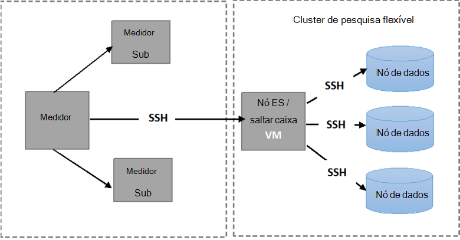

<properties
   pageTitle="Executar os testes de RDP Elasticsearch automatizados | Microsoft Azure"
   description="Descrição de como pode executar os testes de RDP no seu ambiente."
   services=""
   documentationCenter="na"
   authors="dragon119"
   manager="bennage"
   editor=""
   tags=""/>

<tags
   ms.service="guidance"
   ms.devlang="na"
   ms.topic="article"
   ms.tgt_pltfrm="na"
   ms.workload="na"
   ms.date="09/22/2016"
   ms.author="masashin"/>

# <a name="running-the-automated-elasticsearch-resiliency-tests"></a>Executar os testes de RDP Elasticsearch automatizados

[AZURE.INCLUDE [pnp-header](../../includes/guidance-pnp-header-include.md)]

Este artigo faz [parte de uma série](guidance-elasticsearch.md).

No [recuperação de configurar e recuperação no Elasticsearch no Azure][elasticsearch-resilience-recovery], podemos descrito uma série de testes que foram efetuadas relativamente a um cluster de Elasticsearch de exemplo para determinar como bem o sistema respondeu a algumas formas comuns de falha e quão bem recuperá-la. Os testes foram script para ativá-las ser executado de uma forma automática. Este documento descreve como pode repetir os testes no seu ambiente. 

Foram testados cenários seguintes:

- **Falha de nó e reinicie sem perda de dados**. Um nó de dados for interrompido e reiniciado após 5 minutos.
Elasticsearch foi configurado para não reatribuir shards em falta neste intervalo, para que não adicionais e/s é realizadas no movimentar shards. Quando o nó for reiniciado, o processo de recuperação traz os shards nesse nó novamente atualizados.

- **Falha do nó com perda de dados grave**. Um nó de dados está parado e os dados que contém são apagados para simular uma falha do disco grave. O nó é, em seguida, reiniciado (depois de 5 minutos), eficazmente serve como substituição para o nó original. O processo de recuperação requer a reformulação repetida dos dados em falta para este nó e poderá implicar reposicionar shards contidos em outros nós.

- **Falha de nó e reinicie sem perda de dados, mas com reatribuição shard**. Um nó de dados está parado e são reatribuir as shards que contém a outros nós. O nó, em seguida, for reiniciado e reatribuição mais ocorre a redistribuir o cluster.

- **Atualizações de deslocamento**. Cada nó no cluster for interrompido e reiniciado após um breve intervalo para simular máquinas a ser reiniciadas após uma atualização de software. Apenas um nó está parado em qualquer momento.
Shards não são reatribuir enquanto um nó é premida.

## <a name="prerequisites"></a>Pré-requisitos

Os testes automatizados exigem que os seguintes itens:

- Um cluster de Elasticsearch.

- Uma configuração de ambiente JMeter, tal como descrito pelas [orientações testes de desempenho]. 

- As seguintes adições instaladas no modelo global apenas a VM JMeter.

    - Java Runtime 7.

    - Nodejs 4.x.x ou posterior.

    - Ferramentas de linha de comandos Git.

## <a name="how-the-scripts-work"></a>Como funcionam os scripts

Os scripts de teste destinam-se para executar a VM de modelo global de JMeter. Quando seleciona um teste para ser executado, os scripts de executar a seguinte sequência de operações:

1.  Inicie um plano de teste de JMeter prisma os parâmetros que especificou.

2.  Copie um script que executa operações uma ferramenta necessária ao teste para um VM especificado no cluster. Isto pode ser qualquer VM que tem um endereço IP público ou a VM *Jumpbox* se já tiver criado o cluster utilizando o [modelo de guia de introdução do Azure Elasticsearch](https://github.com/Azure/azure-quickstart-templates/tree/master/elasticsearch).

3.  Execute o script no VM (ou Jumpbox).

A imagem seguinte mostra a estrutura do ambiente de teste e Elasticsearch cluster. Note que os scripts de teste utilizam shell segura (SSH) para ligar a cada nó cluster para efetuar várias operações de Elasticsearch como parar ou reiniciar um nó.



## <a name="setting-up-the-jmeter-tests"></a>Configurar o o JMeter testa

Antes de executar a resistência testa deve compilar e implementar os testes de JUnit localizados na pasta jmeter/RDP/testes. Estes testes são referenciados pelo plano de teste JMeter. Para mais informações, consulte o procedimento "Importar um projeto de teste JUnit existente para Eclipse" na [implementação de uma amostra de JMeter JUnit para testar o desempenho do Elasticsearch][].

Existem duas versões dos testes JUnit contidos nas seguintes pastas:

- **Elasticsearch17.** O projeto nesta pasta gera o ficheiro Elasticsearch17.jar. Utilizar para esta caixa para testar a ligação Elasticsearch versões 1.7.x

- **Elasticsearch20**. O projeto nesta pasta gera o ficheiro Elasticsearch20.jar. Utilizar para esta caixa para testar a ligação Elasticsearch versão 2.0.0 e versões posteriores

Copie o ficheiro de para caixa adequado juntamente com o resto das dependências nos computadores JMeter. O processo é descrito através do procedimento "Implementar um teste JUnit a JMeter" na [implementação de uma amostra de JMeter JUnit para um desempenho Elasticsearch teste].

## <a name="configuring-vm-security-for-each-node"></a>Configurar a segurança VM para cada nó

Os scripts de teste necessitam de ser instalado um certificado de autenticação em cada nó de Elasticsearch no cluster. Permite que os scripts sejam executados automaticamente sem perguntar para um nome de utilizador ou palavra-passe, tal como se ligam as vários VMs.

Comece por iniciar sessão para um de nós Elasticsearch cluster (ou a VM Jumpbox) e, em seguida, execute o seguinte comando para gerar uma chave de autenticação:

```Shell
ssh-keygen -t rsa
```

Enquanto estiver ligado às Elasticsearch nó (ou Jumpbox), execute os seguintes comandos para cada nó nele Elasticsearch cluster. Substituir `<username>` com o nome de um utilizador válido em cada VM e substituir `<nodename>` com o nome DNS ou o endereço IP do VM o nó Elasticsearch de alojamento.
Tenha em atenção que vai ser-lhe a palavra-passe do utilizador quando a ser executado estes comandos.
Para obter mais informações, consulte [início de sessão SSH sem palavra-passe](http://www.linuxproblem.org/art_9.html):

```Shell
ssh <username>@<nodename> mkdir -p .ssh (
cat .ssh/id\_rsa.pub | ssh <username>*@<nodename> 'cat &gt;&gt; .ssh/authorized\_keys'
```

## <a name="downloading-and-configuring-the-test-scripts"></a>Transferir e configurar os scripts de teste

Os scripts de teste são fornecidos num repositório Git. Utilize o seguinte procedimento para transferir e configurar os scripts.

No JMeter mestra computador onde será executada os testes, abra uma janela de ambiente de trabalho Git (Git festa) e clonar do repositório que contém os scripts, da seguinte forma:

```Shell
git clone https://github.com/mspnp/azure-guidance.git
```

Mover para a pasta de testes RDP e execute o seguinte comando para instalar as dependências necessárias para executar os testes:

```Shell
npm install
```

Se o modelo global de JMeter estiver em execução no Windows, transfira [Plink](http://www.chiark.greenend.org.uk/~sgtatham/putty/download.html), que é uma interface de comandos para o cliente betumes Telnet. Copie o Plink executável para a pasta RDP-testes/biblioteca.

Se o modelo global de JMeter está em execução no Linux, não é necessário transferir Plink, mas terá de configurar SSH menos de palavra-passe, entre o modelo global de JMeter e o nó Elasticsearch ou Jumpbox que utilizou ao seguir os passos descritos no procedimento "Configurar VM segurança para cada nó." 

Editar os seguintes parâmetros de configuração na `config.js` ficheiro para corresponder ao seu ambiente de teste e Elasticsearch cluster. Estes parâmetros são comuns a todos os testes:

| Nome | Descrição | Valor predefinido |
| ---- | ----------- | ------------- |
| `jmeterPath` | Caminho do local onde se encontra JMeter. | `C:/apache-jmeter-2.13` |
| `resultsPath` | Directório relativo onde o script regista o resultado. | `results` |
| `verbose` | Indica se o script exporta no modo verboso ou não. | `true` |
| `remote` | Indica se os testes de JMeter ser executada localmente ou em servidores remotos. | `true` |
| `cluster.clusterName` | O nome do Elasticsearch cluster. | `elasticsearch` |
| `cluster.jumpboxIp`         | O endereço IP do computador Jumpbox.                 |-|
| `cluster.username`          | O utilizador de administração que criou ao implementar o cluster. |-|
| `cluster.password`          | A palavra-passe para o utilizador admin.                        |-|
| `cluster.loadBalancer.ip`   | O endereço IP do Balanceador de carga Elasticsearch.    |-|
| `cluster.loadBalancer.url`  | URL base do Balanceador de carga.                          |-|

## <a name="running-the-tests"></a>Executar os testes

Mover para a pasta de testes RDP e execute o seguinte comando:

```Shell
node app.js
```

O menu seguinte deverá aparecer:


Introduza o número do cenário que pretende executar: `11`, `12`, `13` ou `21`. 

Depois de selecionar um cenário, o teste será executado automaticamente. Os resultados são armazenados como um conjunto de valores separados por vírgulas (CSV) ficheiros numa pasta criado sob o directório de resultados. Cada execução tem a sua própria pasta de resultados.
Pode utilizar o Excel para analisar e estes dados de gráficos.

[Running Elasticsearch on Azure]: guidance-elasticsearch-running-on-azure.md
[Tuning Data Ingestion Performance for Elasticsearch on Azure]: guidance-elasticsearch-tuning-data-ingestion-performance.md
[orientação de testes de desempenho]: guidance-elasticsearch-creating-performance-testing-environment.md
[JMeter guidance]: guidance-elasticsearch-implementing-jmeter.md
[Considerations for JMeter]: guidance-elasticsearch-deploying-jmeter-junit-sampler.md
[Query aggregation and performance]: guidance-elasticsearch-query-aggregation-performance.md
[elasticsearch-resilience-recovery]: guidance-elasticsearch-configuring-resilience-and-recovery.md
[Resilience and Recovery Testing]: guidance-elasticsearch-running-automated-resilience-tests.md
[Implementar uma demonstração de JMeter JUnit para testar o desempenho do Elasticsearch]: guidance-elasticsearch-deploying-jmeter-junit-sampler.md
