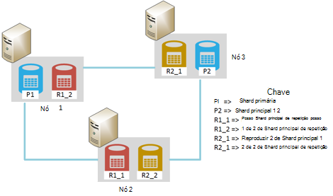
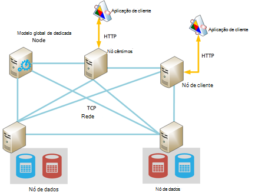
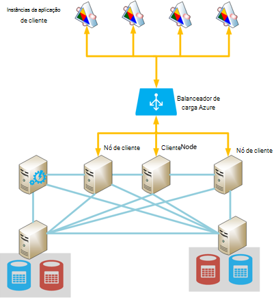
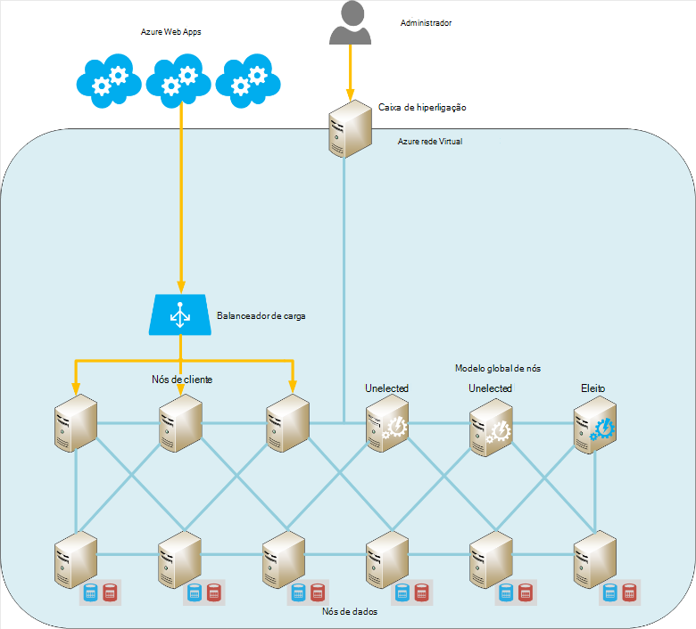
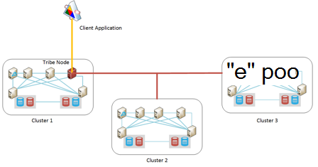
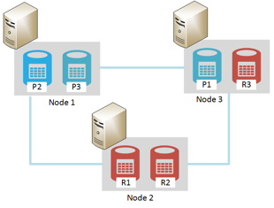

<properties
   pageTitle="Em execução Elasticsearch no Azure | Microsoft Azure"
   description="Como instalar, configurar e executar Elasticsearch no Azure."
   services=""
   documentationCenter="na"
   authors="dragon119"
   manager="bennage"
   editor=""
   tags=""/>

<tags
   ms.service="guidance"
   ms.devlang="na"
   ms.topic="article"
   ms.tgt_pltfrm="na"
   ms.workload="na"
   ms.date="09/22/2016"
   ms.author="masashin"/>

# <a name="running-elasticsearch-on-azure"></a>Em execução Elasticsearch no Azure

[AZURE.INCLUDE [pnp-header](../../includes/guidance-pnp-header-include.md)]

Este artigo faz [parte de uma série](guidance-elasticsearch.md). 

## <a name="overview"></a>Descrição geral

Este documento fornece uma breve introdução à estrutura geral do Elasticsearch e, em seguida, descreve como pode implementar um cluster de Elasticsearch utilizando o Azure. Tocar no práticas recomendadas para implementar um cluster de Elasticsearch centrada nos diversos funcional desempenho e requisitos de gestão do seu sistema de e tendo em conta como os seus requisitos de devem conduzem a configuração e topologia que selecionar.

> [AZURE.NOTE] Estas orientações assume alguma familiaridade básica com [Elasticsearch][].

## <a name="the-structure-of-elasticsearch"></a>A estrutura de Elasticsearch 

Elasticsearch é uma base de dados do documento altamente optimizada para funcionar como um motor de busca. Documentos são serializados no formato JSON. Dados são mantidos na índices, implementados através da utilização [Apache Lucene][], apesar dos detalhes são captados a partir da vista e não é necessário compreender totalmente Lucene para que possa para utilizar Elasticsearch.

### <a name="clusters-nodes-indexes-and-shards"></a>Clusters, nós, índices e shards

Elasticsearch implementa uma arquitetura de agrupadas que utiliza sharding para distribuir dados em múltiplas nós e replicação para fornecer elevada disponibilidade. Documentos são armazenados em índices. O utilizador pode especificar quais os campos num documento são utilizados para identificar exclusivamente dentro de um índice remissivo ou o sistema pode gerar um campo de chave e os valores automaticamente. O índice é utilizado para física organizar documentos e é que o capital significa para a localização de documentos. 

Um índice remissivo contém um conjunto de shards. Documentos são uniformemente dispersos em shards utilizando um mecanismo hashing com base em valores de chave de índice e o número de shards no índice remissivo. 

Podem ser replicados índices. Neste caso cada shard no índice remissivo é copiada. Elasticsearch assegura que cada shard original para um índice remissivo (designado "shard primária") e a respectiva réplica sempre se encontram nós diferentes. Quando um documento é adicionado ou modificado, escrever todas as operações são executadas na shard primária primeiro e, em seguida, em cada réplica. 

A figura seguinte mostra os aspectos essenciais de um cluster de Elasticsearch que contém três nós. Foi criado um índice remissivo que consiste em duas shards principais com dois réplicas para cada shard (seis shards em todas as).



*Um cluster de Elasticsearch simple que contém dois nós principais e dois conjuntos de réplicas*

Neste cluster shard principal 1 e 2 de shard primária estão localizados em nós separados para o ajudar a equilibrar a carga entre-los. As réplicas do mesmo modo são distribuídas. Se um único nó falhar, os restantes nós tem informações suficientes para activar o sistema continuar a funcionar. Se for necessário, Elasticsearch irá promover uma shard réplica para se tornar uma shard principal, se o shard principal correspondente não estiver disponível.

### <a name="node-roles"></a>Funções de nó

Os nós num Elasticsearch cluster podem efetuar as seguintes funções:

- **Nó de dados** que pode conter um ou mais shards que contêm os dados de índice remissivo.

- Um **nó cliente** que não possua indexar dados mas que trata pedidos recebidos efectuados por aplicações de cliente para o nó de dados adequado.
 
- **Nó principal** que não mantenha a tecla indexar dados mas que executa operações de gestão de cluster, tal como manter e distribuir informações de encaminhamento à volta do cluster (a lista dos quais nós contêm quais shards) para determinar quais os nós estão disponíveis, reposicionar shards como nós aparecem e desaparecerem e coordenar recuperação após uma falha de nó. Vários nós podem ser configurados como modelos globais, mas só será realmente ser eleito, as funções principal. Se este nó falhar, ocorre outra eleições políticas e um dos outros nós mestras elegíveis vai ser eleito e assumir o controlo.

> [AZURE.NOTE]O nó mestra eleito é fundamental para o bem-estar do cluster. Os outros nós ping-regularmente para garantir que ainda está disponível. Se o nó mestra eleito é também serve como um nó de dados, existe uma oportunidade de que o nó pode tornar-se ocupado e falhas para responder a estes pings. Esta situação, é considerada como o modelo global de ter ocorrido uma falha e um de nós mestras é eleito no seu lugar. 

 A figura seguinte mostra uma topologia que contenha uma mistura de modelo global de dedicada, cliente e nós de dados de um cluster de Elasticsearch.



*Um cluster de Elasticsearch que mostra tipos diferentes de nós*

### <a name="costs-and-benefits-of-using-client-nodes"></a>Os custos e benefícios da utilização nós de cliente

Quando uma aplicação submete uma consulta para um cluster de Elasticsearch, o nó ao qual se liga a aplicação é responsável pela que encaminha o processo de consulta. O nó reencaminha o pedido para cada nó de dados e reúne os resultados, devolver as informações de acumulada para a aplicação. Se uma consulta envolve agregações e outros cálculos, o nó ao qual se liga à aplicação executa as operações necessárias depois de obter os dados de cada um dos outros nós. Este processo de dispersão/reunir pode consumir recursos de processamento e da memória consideráveis.

Utilizar o cliente dedicada nós para efetuar as seguintes tarefas permite que os nós de dados focar-se em gerir e armazenar os dados. O resultado é que muitos cenários que envolvam consultas complexas e agregações beneficiar nós de cliente dedicada a utilizar. No entanto, o impacto de utilizar o cliente dedicada nós poderão variar dependendo do seu cenário, a carga de trabalho e o tamanho de cluster. 

> [AZURE.NOTE] Consulte [optimização agregação de dados e o desempenho da consulta para Elasticsearch no Azure][] para obter mais informações sobre o processo de sintonização do.

### <a name="connecting-to-a-cluster"></a>Ligar a um cluster de

Elasticsearch expõe uma série de REST APIs para a criação de aplicações de cliente e enviar pedidos para um cluster. Se estiver a desenvolver aplicações utilizando o .NET Framework, dois níveis de superiores APIs estão disponíveis – [Elasticsearch.Net & NINHO][].

Se estiver a criar aplicações de cliente utilizando Java, pode utilizar a [API do cliente de nó][] para criar nós cliente dinamicamente e adicioná-los ao cluster. Criar cliente nós dinamicamente é conveniente se utiliza o seu sistema de um número de ligações longa vida relativamente pequeno. Nós de cliente criados ao utilizar a API nó são fornecidos com o cluster encaminhamento de mapear (os detalhes dos quais nós contêm quais shards) pelo nó principal. Esta informação permite que a aplicação Java ligar diretamente para os nós adequado quando indexação ou consultar dados, como reduzir o número de saltos que poderá ser necessário ao utilizar outras APIs.

O custo desta abordagem é o overhead da inscrição para o nó do cliente para cluster. Se um grande número de nós de cliente aparecer e desaparece rapidamente, o impacto das mantendo e distribuir o mapa de encaminhamento cluster pode ficar significativo.

A figura seguinte mostra uma configuração que utiliza um balanceador de carga para encaminhar pedidos para um conjunto de nós de cliente, apesar da mesma estratégia pode ser utilizada para ligar diretamente a nós de dados se nós de cliente não são utilizados.



*Ligar a um cluster de Elasticsearch através do Balanceador de carga Azure instâncias da aplicação de cliente*

> [AZURE.NOTE]Pode utilizar o [Azure Balanceador de carga][] para expor o cluster à Internet público ou pode utilizar um [Balanceador de carga interno][] se a aplicações de cliente e cluster estão contidos totalmente da mesma virtual rede privada (VNet).

### <a name="node-discovery"></a>Deteção de nó

Elasticsearch é baseado comunicações ponto a ponto, pelo que a descobrir outros nós num cluster é uma parte importante no ciclo de vida de um nó. Deteção de nó permite novos nós de dados seja adicionada dinamicamente a um cluster, que por sua vez permite que o cluster Dimensionar saída transparente. Para além disso, se um nó dados falhar ao responder a pedidos de comunicações a partir de outros nós, um nó mestra pode decidir que o nó de dados falhou e siga os passos necessários para reatribuir as shards que foi suspensão de para outros nós de dados operacionais.

Deteção de nó Elasticsearch é processada utilizando um módulo de deteção. O módulo de deteção é um plug-in quais pode mudar para utilizar um mecanismo de identificação diferente. Módulo de deteção de predefinido ([Zen][]) faz com que um nó emitir pedidos de ping para encontrar outros nós na mesma rede. Se responderem a outros nós, eles coscuvilhar para trocar informações. Um nó principal, em seguida, pode distribuir shards para o novo nó (se for um nó de dados) e redistribuir cluster. Módulo de deteção de Zen também processa o processo de eleições políticas principal e o protocolo para detectar nó falha.

Para além disso, se estiver a executar Elasticsearch nós como Azure máquinas virtuais (VMs), mensagens multicast não são suportada. Razões, deve configurar a deteção de Zen para utilizar unicast mensagens e forneça uma lista de nós do contactos válidos no ficheiro de configuração de elasticsearch.yml.

Se estiver a alojar um cluster de Elasticsearch dentro de uma rede virtual Azure, pode especificar que privado IP atribuído DHCP endereçada atribuída a cada VM no cluster deve continuar a ser atribuído (estático). Pode configurar Zen deteção unicast mensagens utilizando estes endereços IP estáticos. Se estiver a utilizar VMs com endereços IP dinâmicos, tenha em atenção que se uma VM parar e reinicia-pode ser atribuído um novo endereço IP tornando deteção mais difícil. Para processar neste cenário, pode trocar o módulo de deteção de Zen para o [Plug-in do Azure na nuvem][]. Este plug-in utiliza a API do Azure para implementar o mecanismo deteção, qual é baseado no informações da subscrição Azure.

> [AZURE.NOTE]A versão atual do plug-in do Azure nuvem requer que instalar o certificado de gestão para a sua subscrição Azure na keystore Java no nó Elasticsearch e forneça a localização e as credenciais para aceder a keystore no ficheiro elasticsearch.yml. Este ficheiro é mantido em texto simples, para que fique extremamente importante assegurar que este ficheiro só está acessível através da conta a executar o serviço de Elasticsearch. 
> 
> Para além disso, esta abordagem poderá não ser compatível com o Gestor de recursos do Azure híbridas. Por estas razões, recomendamos que utilize endereços IP estáticos para nós principais e utilizar estes nós para implementar o Zen deteção unicast mensagens ao longo do cluster. Na configuração seguinte (tomada do ficheiro elasticsearch.yml para um nó de dados de exemplo), os endereços IP do anfitrião referenciam nós principais no cluster:

```yaml
discovery.zen.ping.multicast.enabled: false  
discovery.zen.ping.unicast.hosts: ["10.0.0.10","10.0.0.11","10.0.0.12"]
```

## <a name="general-system-guidelines"></a>Diretrizes de sistema geral

Elasticsearch podem ser executados em vários computadores, que se situa entre um computador portátil única a um cluster de servidores de alto nível. No entanto, os recursos mais em termos de memória, computação de potência e rápida de discos que estão disponível melhor o desempenho. As secções seguintes resumem os requisitos de hardware e software básicos para executar Elasticsearch.

### <a name="memory-requirements"></a>Requisitos de memória 

Tenta Elasticsearch para armazenar dados na memória para a velocidade. Deverá ter um servidor de produção alojamento um nó para uma típica enterprise ou médias em definições de impressão comercial implementação no Azure entre 14GB e 28GB de RAM (D3 ou D4 VMs). **Distribuir a carga nos mais nós em vez de criar nós com mais memória** (Experiências tem mostrado que utilizar nós maiores com mais memória pode causar vezes recuperação expandida em caso de falha.) No entanto, apesar de o criar clusters com um grande número de nós pequenas pode aumentar a disponibilidade e débito, também escala o esforço envolvidas na gestão e manutenção de um sistema desse tipo.

**Alocar 50% da memória disponível num servidor para pilha de Elasticsearch**. Se estiver a utilizar Linux definir a variável de ambiente de ES_HEAP_SIZE antes de executar Elasticsearch. Em alternativa, se estiver a utilizar o Windows ou Linux, pode especificar o tamanho de memória na `Xmx` e `Xms` parâmetros ao iniciar o Elasticseach. Defina ambos os parâmetros para o mesmo valor para evitar a Java Máquina Virtual (da JVM da) redimensionar pilha de tempo de execução. No entanto, **não alocar mais de 30 GB**. Utilize a memória restante para a cache de ficheiro do sistema operativo.

> [AZURE.NOTE]Elasticsearch utiliza a biblioteca de Lucene para criar e gerir índices. Estruturas Lucene utilizam um formato baseado em disco e colocação em cache estas estruturas na cache do sistema de ficheiros irá melhorar significativamente o desempenho.

Note que o tamanho máximo de pilha ideal para Java num computador de 64 bits é imediatamente acima de 30GB. Acima deste tamanho que Java muda para utilizar um dispositivo adicional para referenciar pilha de objetos, o que aumenta os requisitos de memória para cada objeto e reduz o desempenho. 

O predefinição Java lixo (marcar em simultâneo e varrer) também pode executar sub-ideal se o tamanho da pilha estiver acima de 30 GB. Atualmente não é recomendado para mudar para um lixo diferente, tal como Elasticsearch e Lucene apenas testadas contra a predefinição.

Não overcommit memória como inversão memória principal para o disco extremamente irá afetar o desempenho. Se possível, desativar trocar completamente (os detalhes variam consoante o sistema operativo). Se não for possível em seguida, ativar a definição de *mlockall* no ficheiro de configuração de Elasticsearch (elasticsearch.yml) da seguinte forma:

```yaml
bootstrap.mlockall: true
```

Esta definição de configuração faz com que o JVM bloquear a sua memória e impede que-lo a ser trocadas saída pelo sistema operativo.

### <a name="disk-and-file-system-requirements"></a>Requisitos de sistema do disco e ficheiro

Utilize dados discos cópias ao armazenamento de premium para armazenar shards. Discos devem ser dimensionados para conter a quantidade máxima de dados previstos na sua shards, embora é possível adicionar mais discos mais tarde. É possível expandir um shard por vários discos num nó.

> [AZURE.NOTE]Elasticsearch comprime os dados para campos armazenados utilizando o algoritmo de LZ4 e na Elasticsearch 2.0 e posteriores, pode alterar o tipo de compressão. Quais pode mudar o algoritmo de compressão DEFLATE como é utilizado pelos utilitários *zip* e *gzip* . Esta técnica de compressão pode ser consumir mais recursos, mas deverá tomar em consideração utilizá-lo para os dados do registo arquivados. Esta abordagem pode ajudar a reduzir o tamanho do índice.

Não é essencial de que todos os nós num cluster têm o mesmo esquema do disco e a capacidade. No entanto, um nó com uma capacidade de disco muito grandes em comparação comparada outros nós num cluster irá apelar mais dados e irão necessitar processamento maior power para processar estes dados. Por conseguinte, pode tornar-se o nó "quente" comparado com outros nós e isto pode, por sua vez, afectar desempenho.

Se possível, utilize RAID 0 (repartição). Outras formas de RAID que implementam paridade e espelhando as são desnecessárias como Elasticsearch fornece as suas próprias solução disponibilidade alta sob a forma de réplicas.

> [AZURE.NOTE]Antes de Elasticsearch 2.0.0, poderia implementar também repartição ao nível do software ao especificar vários directórios na definição de configuração *path.data* . Num Elasticsearch 2.0.0, este formulário da repartição já não é suportado. Em vez disso, podem ser atribuídos shards diferentes a diferentes caminhos, mas todos os ficheiros numa única shard serão escritos para o mesmo caminho. Se necessitar de repartição, deverá faixas dados ao nível do hardware ou sistema operativo. 

Maximizar o rendimento de armazenamento, cada **VM deve ter uma conta de armazenamento de dedicada premium**.

A biblioteca de Lucene pode utilizar um grande número de ficheiros para armazenar dados de índice remissivo e Elasticsearch pode abrir um número significativo de sockets para comunicar entre nós e com os clientes. Certifique-se de que o sistema operativo está configurado para suportar um número adequado de descritores de abrir um ficheiro (até 64000 se memória suficiente está disponível). Tenha em atenção que a configuração predefinida para muitos Linux distribuições limita o número de descritores, abrir ficheiro para 1024, que é muito demasiado pequeno.

Elasticsearch utiliza uma combinação de memória mapeado (mmap) e/s e Java novo e/s (NIO) para optimizar em simultâneo acesso aos ficheiros de dados e índices. Se estiver a utilizar Linux, deve configurar o sistema operativo para se certificar de que existe suficiente memória virtual com espaço para as suas áreas de mapa de memória 256K.

> [AZURE.NOTE]Muitos predefinição, as distribuições Linux para utilizar completamente justo colocação (CFQ) do scheduler do quando dispor para escrever dados disco. Este scheduler não está optimizada para SSDs. Considere reconfigurar o sistema operativo para utilizar o agendador NOOP ou o Programador de prazo, sendo que ambos estão mais eficazes para SSDs.

### <a name="cpu-requirements"></a>Requisitos de CPU

Azure VMs estão disponíveis numa variedade de configurações de CPU, entre 1 e 32 núcleos de suporte. Para um nó de dados, um bom ponto de partida é um padrão DS série VM e selecione um da DS3 (4 núcleos) ou D4 (8 núcleos) SKUs. O DS3 também fornece 14GB de RAM, enquanto o DS4 inclui 28GB. 

A série de s (para o armazenamento de premium) e série G (para o armazenamento padrão) utilizam processadores Xeon E5 V3 que podem ser úteis das cargas de trabalho que estão fortemente cluster-com um grau elevado, tal como agregações em grande escala. Para informações mais recentes, visite [tamanhos para máquinas virtuais][].

### <a name="network-requirements"></a>Requisitos de rede

Elasticsearch requer uma banda de entre 1 e 10Gbps, consoante o tamanho e volatilidade de sectores pertencem a que implementa. Elasticsearch migra shards entre nós como mais nós são adicionados a um cluster. Elasticsearch assume que o tempo de comunicação entre todos os nós é equivalente aproximadamente e não considerar as localizações relativas shards contidos em nós. Para além disso, replicação pode assumir e/s de rede significativa entre shards. Por estas razões, **Evite criar clusters em nós que existem no regiões diferentes**.

### <a name="software-requirements"></a>Requisitos de software

Pode executar Elasticsearch Windows ou Linux. O serviço de Elasticsearch é implementado como uma biblioteca de para caixa Java e tem dependências em outras bibliotecas do Java que estão incluídas no pacote Elasticsearch. Tem de instalar o Java 7 (atualização de 55 ou posterior) ou Java 8 (atualização de 20 ou posterior) JVM para executar Elasticsearch.

> [AZURE.NOTE]Diferente dos parâmetros de memória *Xmx* e *Xms* (especificada como opções de linha de comandos para o motor de Elasticsearch – consulte o artigo [requisitos de memória][]) não modifique as definições de configuração de JVM predefinido. Foi concebido Elasticsearch utilizando as predefinições; alterá-las pode causar Elasticsearch para se tornar detuned e executar mal.

### <a name="deploying-elasticsearch-on-azure"></a>Implementar Elasticsearch no Azure

Apesar de não é difícil implementar uma única ocorrência de Elasticsearch, a criação de um número de nós e instalar e configurar Elasticsearch em cada um deles pode ser um processo moroso e passíveis de erro. Se estiver a considerar em execução Elasticsearch no Azure VMs, tem três opções que podem ajudar a reduzir as hipóteses de erros.

- Utilizar o Gestor de recursos do Azure [modelo](https://azure.microsoft.com/marketplace/partners/elastic/elasticsearchelasticsearch/) nas Azure marketplace. Este modelo é criado pela elásticos. Permite-lhe adicionar comerciais melhoramentos como a protecção, Marvel, Watcher e assim sucessivamente.

- Utilizar o guia de introdução Azure [modelo](https://github.com/Azure/azure-quickstart-templates/tree/master/elasticsearch) para criar o cluster. Este modelo pode criar um cluster com base no Windows Server 2012 ou Ubuntu Linux 14.0.4. Permite-lhe utilizar experimentais funcionalidades tal como o armazenamento de ficheiro do Windows Azure. Este modelo é utilizado para a pesquisa e tarefas testes neste documento.

- Utilização de scripts que podem ser automatizados ou ser executada automaticamente. Scripts que podem criar e implementar um cluster de Elasticsearch estão disponíveis no [GitHub repositório][elasticsearch-scripts]

## <a name="cluster-and-node-sizing-and-scalability"></a>Cluster e redimensionamento de nó e escalabilidade 

Elasticsearch permite um número de topologias de implementação, concebido para suportar requisitos diferentes e níveis de escala. Esta secção descreve algumas topologias comuns e descreve considerações para a aplicação clusters com base nestes topologias.

### <a name="elasticsearch-topologies"></a>Elasticsearch topologias

A figura seguinte ilustra um ponto de partida para criar uma topologia de Elasticsearch para Azure:



*Sugeridos ponto de partida para criar um cluster de Elasticsearch com Azure*

Esta topologia contém seis nós de dados juntamente com três nós de clientes e três nós principais (apenas um nó mestra é eleito, outras duas estão disponíveis para eleições políticas deverá o modelo global de eleito falhar.) Cada nó é implementada como uma VM em separado. Aplicações Azure web são dirigidas a nós de cliente através de um balanceador de carga. 

Neste exemplo, todos os nós e as aplicações web residem na mesma rede virtual que eficazmente isola-los a partir do mundo exterior. Se o cluster tem de estar disponível externamente (possivelmente como parte de uma solução de híbrido daquilo clientes no local), em seguida, pode utilizar o Balanceador de carga Azure para fornecer um endereço IP público, mas irá precisar de levar precauções adicionais de segurança para evitar acesso não autorizado às cluster. 

A opcional "saltar caixa" é uma VM que só se encontra disponível para administradores. Este VM tem uma ligação de rede para a rede virtual, mas também uma ida opostas ligação de rede para permitir o início de sessão administrador a partir de uma rede externa (este início de sessão deve ser protegido utilizando uma palavra-passe segura ou um certificado). Um administrador pode iniciar sessão para a caixa ir e, em seguida, ligue a partir desse local diretamente para qualquer um de nós num cluster. 

Abordagens alternativas incluem utilizando um VPN do site para o site entre uma organização e a rede virtual ou utilizar circuitos [ExpressRoute][] para ligar à rede virtual. Estes mecanismos permitirem acesso administrativo ao cluster sem expor o cluster à internet público.

Para manter a disponibilidade VM, os nós de dados são agrupados no mesmo conjunto de disponibilidade Azure. Da mesma forma, os nós de cliente são mantidos no outro conjunto de disponibilidade e os nós mestras são armazenados num conjunto de disponibilidade de terceiros.

Esta topologia é relativamente fácil Dimensionar saída, basta adicionar mais nós do tipo adequado e certifique-se de que estão configurados com o mesmo nome de cluster no ficheiro elasticsearch.yml. Nós de cliente também precisam de ser adicionada ao conjunto de back-end para o Balanceador de carga Azure.

**Localizar geo clusters**

**Não propagar-se nós num cluster entre as regiões como este pode afetar o desempenho de comunicação de nó dependências entre** (consulte o artigo [requisitos de rede][]). Localizar geo dados fechar para utilizadores de diferentes regiões necessita de criar vários clusters. Esta situação, é necessário considerar como (ou mesmo se) para sincronizar clusters. Possíveis soluções incluem:

[Nós tribe][] são semelhantes a um nó de cliente, exceto que pode participar em vários Elasticsearch clusters e para visualizá-los a todos os como um cluster de grande. Dados ainda são geridos localmente por cada cluster (atualizações não são propagadas ao longo dos limites de cluster), mas todos os dados está visível. Pode consultar um nó tribe, criar e gerir documentos em qualquer cluster. 

As restrições primárias são que um nó tribe não pode ser utilizado para criar um novo índice e nomes de índice remissivo devem ser exclusivos em todos os clusters. Por conseguinte, é importante que considere como índices serão nomeados Quando estrutura clusters destinados a ser acedido a partir de nós tribe.

Utilizar este mecanismo, cada cluster pode conter os dados que são provavelmente a ser acedido por aplicações de cliente local, mas estes clientes continuam a podem aceder e modificar dados remotos embora com possível expandido latência. A figura seguinte mostra um exemplo desta topologia. É realçada a nó tribe Cluster 1; os outros clusters também podem ter um tribe nós embora estes não são apresentados no diagrama:



*Uma aplicação de cliente aceder a vários clusters através de um nó tribe*

Neste exemplo, a aplicação de cliente liga-se a nó tribe Cluster 1 (cocriação localizada na mesma região), mas este nó está configurado para ser capazes de acesso Cluster 2 e 3 de Cluster, que podem estar localizados em regiões diferentes. A aplicação de cliente pode enviar pedidos que recuperar ou modificar dados em qualquer um dos conjuntos de sectores.

> [AZURE.NOTE]Nós tribe requerem deteção multicast para ligar a clusters, que podem apresentar uma questão de segurança. Consulte a secção [deteção nó][] para obter mais detalhes.

- Implementar a replicação geo entre clusters. Nesta abordagem, as alterações efetuadas em cada cluster são propagadas em quase em tempo real a clusters localizados nos outros centros de dados. Plug-ins de terceiros estão disponíveis para Elasticsearch que suportam esta funcionalidade, tal como o [Plug-in do PubNub alterações][].

- Utilizar o [Elasticsearch instantâneo e restaurar módulo][]. Se os dados são muito lento-mover e modificados apenas por um único cluster, poderá considerar a utilização de instantâneos para tirar uma cópia periódica dos dados e, em seguida, restaurar estes instantâneos em outros clusters (instantâneos podem ser armazenados numa armazenamento de Blobs do Azure se tiver instalado o [Plug-in do Azure na nuvem][]). No entanto, esta solução não funciona bem para alterar rapidamente dados ou se os dados podem ser alterados num cluster de mais do que uma.

**Topologias pequenos**

Em grande escala topologias que incluam clusters de nós do modelo global, cliente e dados dedicadas poderão não ser apropriadas para cada cenário. Se estiver a criar uma pequena produção ou sistema de desenvolvimento, considere o cluster de 3-node apresentado na figura abaixo.

Aplicações de cliente ligar diretamente a qualquer nó de dados disponíveis no cluster. Cluster contém três shards rotulados P1-P3 (para permitir para crescimento) plus réplicas rotuladas R1 R3. Utilização de três nós permite Elasticsearch distribuir shards e réplicas, de modo a que se qualquer individual nó falha sem dados serão perdidos.



*Um cluster de 3-node com 3 shards e réplicas*

Se estiver a executar uma instalação de desenvolvimento num computador autónomo pode configurar um cluster com um único nó que age como o armazenamento de dados, cliente e modelo global. Em alternativa, pode começar a vários nós em execução como um cluster no mesmo computador iniciando mais do que uma instância da Elasticsearch. A figura seguinte mostra um exemplo.


*Uma configuração de desenvolvimento executar vários Elasticsearch nós no mesmo computador*

Tenha em atenção que nenhuma destas configurações autónomo lhe foram recomendadas num ambiente de produção à medida que podem causar contenção a menos que o computador de desenvolvimento tenha uma quantidade significativa de memória e vários discos rápidos. Para além disso, não fornecem que garantias qualquer elevada disponibilidade. Se a máquina falhar, todos os nós são perdidos.

### <a name="scaling-a-cluster-and-data-nodes"></a>Dimensionamento nós de cluster e dados

Pode dimensionar Elasticsearch em duas dimensões: na vertical (utilizando maiores, máquinas mais eficazes) e na horizontal (propagação a carga através de máquinas).

**Dimensionamento verticalmente Elasticsearch nós de dados**

Se estiver a alojar um cluster de Elasticsearch utilizando Azure VMs, cada nó pode corresponder a uma VM. O limite de escalabilidade vertical para um nó em grande medida é regulado pelos SKU da VM e as restrições gerais aplicados a contas de armazenamento individuais e subscrições Azure. 

Página de [subscrição do Azure e limites de serviço, quotas e restrições](../azure-subscription-service-limits.md) descreve esses limites em detalhe, mas quanto construir um cluster de Elasticsearch é, os itens na lista que se segue são mais pertinentes. 

- Cada conta de armazenamento é limitada a 20.000 IOPS. Cada VM no cluster deverá tirar partido dedicada (preferência premium) conta de armazenamento.

- O número de nós de dados de uma rede virtual. Se não estiver a utilizar o Gestor de recursos do Azure, existe um limite de 2048 instâncias VM por rede virtual. Enquanto isto provar suficiente para muitos casos, se tiver uma configuração muito grande com milhares de nós Isto pode ser uma limitação.

- Número de contas de armazenamento por subscrição por região. Pode criar contas de armazenamento de até 100 por subscrição Azure em cada região. As contas de armazenamento são utilizadas para colocar em espera discos virtuais e cada conta de armazenamento tem um limite de 500TB de espaço.

- Número de núcleos por subscrição. O limite predefinido é 20 núcleos por subscrição, mas isto pode ser aumentado até 10.000 núcleos solicitando um aumento de limite através de um bilhetes de suporte. 

- A quantidade de memória por tamanho da memória virtual. VMs de tamanho mais pequenos têm um limitado quantidades de memória disponível (máquinas D1 ter 3,5 GB e D2 máquinas tem 7 GB). Estes máquinas poderão não estar adequadas para cenários que requerem Elasticsearch para colocar em cache significativas quantidades de dados para alcançar bom desempenho (agregar dados ou analisar um grande número de documentos durante ingestão de dados, por exemplo).

- O número máximo de discos por tamanho da memória virtual. Esta restrição pode limitar o tamanho e desempenho de um cluster de. Menos discos significa que podem realizar menos dados, e o desempenho pode ser reduzido por ter menos discos disponíveis para repartição.

- O número de atualizar domínios / domínios por conjunto de disponibilidade de falha. Se criar VMs utilizando o Gestor de recursos do Azure, cada conjunto de disponibilidade pode ser atribuído até 3 falhas domínios e atualização de 20. Esta limitação pode afetar o resistência de um cluster de grandes dimensões é submetidas para frequente atualizações ficha técnica em.

Para além disso, provavelmente não deve considere utilizar VMs com mais do que 64GB de memória. Conforme descrito na secção [requisitos de memória][], não deve alocar mais de 30 GB de RAM no cada VM para o JVM e permitir que o sistema operativo utilizam a memória restante para utilização da memória intermédia e/s.

Com estes restrições deve ter em conta, deve sempre afaste os discos virtuais para VMs num cluster em contas de armazenamento para reduzir as hipóteses de limitação e/s. Num cluster de muito grande, poderá tem de reestruturar as sua infraestrutura de lógica e dividi-la em partições funcionais separadas. Por exemplo, poderá ter de dividir o cluster entre subscrições, embora este processo pode levar a complicações mais devido a necessidade de ligar redes virtuais.

**Dimensionamento um cluster de Elasticsearch na horizontal**

Internamente dentro Elasticsearch, o limite de escalabilidade horizontal é determinado pelo número de shards definido para cada índice remissivo. Inicialmente, muitos shards podem ser atribuídas a mesma nó um cluster, mas à medida que o volume de dados cresce adicional nós podem ser adicionados e shards podem ser distribuídos ao longo estes nós. Em teoria, apenas quando o número de nós atinge o número de shards o sistema deixará Dimensionar horizontalmente.

Tal como acontece com dimensionamento vertical, existem alguns problemas que deverá tomar em consideração quando que considere essa execução dimensionamento horizontal, incluindo:

- O número máximo de VMs que pode ligar-se numa rede virtual Azure. Isto pode limitar a escalabilidade horizontal para um cluster de muito grande. Pode criar um cluster de nós expande-se mais do que uma rede virtual para contornar este limite, mas esta abordagem pode levar a desempenho reduzido devido à falta de localidade de cada nó com os seus pares.

- O número de discos por tamanho da memória virtual. Série diferente e SKUs suportam números diferentes de discos ligados.
Para além disso, também poderá considerar a utilização do armazenamento efémero incluído com a VM para fornecer um período limitado mais rápido de armazenamento de dados, apesar de existirem RDP e recuperação implicações que deverá tomar em consideração (consulte o artigo [Configurar resistência e recuperação no Elasticsearch no Azure] [ elasticsearch-resilience-recovery] para obter mais informações). As séries de D, DS série, Dv2 série e s-série de VMs utilizam SSDs para armazenamento efémero.

Pode optar por utilizar [Conjuntos de escala de Máquina Virtual] [ vmss] para iniciar e parar VMs como exige dita. No entanto, esta abordagem poderão não ser apropriada para um cluster de Elasticsearch pelos seguintes motivos:

- Esta abordagem é mais adequada para VMs sem estado. Sempre que adicionar ou remover um nó de um cluster de Elasticsearch, shards são reatribuir para equilibrar a carga e este processo pode gerar consideráveis volumes de tráfego de rede e disco e/s e extremamente pode ter impacto taxas de ingestão de dados. Deve avaliar se este sobrecarga vale o benefício de transformação adicional e recursos de memória ficam disponíveis iniciando dinamicamente VMs mais.

- Arranque VM não ocorrer instantaneamente e poderá demorar vários minutos antes de VMs adicionais ficam disponíveis ou são encerrar. Dimensionamento desta forma só deverá ser utilizado para processar contínua as alterações no pedido.

- Depois de dimensionamento saída, na realidade necessita ter em consideração dimensionamento novamente? Remover uma VM de um cluster de Elasticsearch pode ser um processo de intenso recurso que exijam que Elasticsearch recupera a shards e réplicas que estão localizadas nesse VM e recria-los num ou mais de nós restantes. Remover VMs várias ao mesmo tempo, pode comprometer a integridade dos cluster, tornando recuperação difícil. Além disso, muitas Elasticsearch implementações crescem ao longo do tempo, mas natureza dos dados é tal que tenda não encolher em volume. É possível eliminar documentos manualmente e documentos também podem ser configurados com um valor TTL (tempo para live) após o qual expirar e obter removidos, mas na maioria dos casos, é provável que o espaço atribuído anteriormente será rapidamente reutilizado pelos documentos novos ou modificados. Fragmentação dentro de um índice remissivo poderão ocorrer quando documentos são removidos ou alterados, caso em que pode utilizar a Elasticsearch HTTP [Otimização][] API (Elasticsearch 2.0.0 e versões anteriores) ou a [Impressão em série de forçar][] API (Elasticsearch 2.1.0 e posterior) para executar desfragmentação.

### <a name="determining-the-number-of-shards-for-an-index"></a>Para determinar o número de shards para um índice remissivo

O número de nós num cluster pode variar ao longo do tempo, mas o número de shards num índice remissivo é fixo assim que foi criado o índice. Para adicionar ou remover shards requer a reindexação de dados – um processo de criar um novo índice com o número necessário de shards e, em seguida, copiar os dados a partir do índice antigo para o novo (pode utilizar aliases para isolar os utilizadores do facto de que dados foram reindexados – veja [Tuning a agregação de dados e o desempenho da consulta para Elasticsearch no Azure][] para obter mais detalhes).
Por isso, é importante determinar o número de shards requerem provavelmente adiantar criar primeiro índice no seu cluster. Pode efetuar os seguintes passos para estabelecer este número:

- Crie um cluster de nó único utilizando a mesma configuração do hardware que pretende implementar de produção.

- Crie um índice que corresponde à estrutura que planeia utilizar de produção. Dar este índice de um único shard e sem réplicas.

- Adicione uma quantidade específica de dados de produção reais ao índice.

- Efetuar consultas típicas, agregações e outros das cargas de trabalho contra o índice e medir o tempo de débito e a resposta.

- Se o tempo de débito e a resposta estiverem dentro dos limites aceitáveis, em seguida, repita o processo a partir do passo 3 (somar mais dados).

- Quando aparecer atingiram a capacidade da shard (tempos de resposta e débito iniciar a tornar-se aceitável), tome nota do volume de documentos.

- Extrapole a partir da capacidade de um único shard para o número de documentos de produção para calcular o número necessário de shards (deve incluir algumas margem de erro estes cálculos como extrapolação não é uma ciência precisa) antecipado.

> [AZURE.NOTE]Lembre-se de que cada shard é implementada como um índice de Lucene consome memória, CPU power e alças de ficheiro. Os mais shards tiver, mais estes recursos que necessitam.

Para além disso, criar mais shards pode aumentar escalabilidade (dependendo do seu das cargas de trabalho e cenário) e pode aumentar o débito ingestão de dados, mas poderá diminuir a eficiência de várias consultas. Por predefinição, uma consulta irá interrogate cada shard utilizado por um índice remissivo (pode utilizar [o encaminhamento personalizado][] para modificar este comportamento se souber quais shards os dados que requerem estão localizados no). 

Seguir este processo só pode gerar uma estimativa para o número de shards e o volume dos documentos esperado no produção poderá não ser conhecido. Neste caso, deve determinar o volume inicial (como acima) e a taxa de crescimento previsto. Crie um número adequado de shards pode processar o crescimento de dados para o período de até estiver disposto a reindexar a base de dados. 

Outras estratégias utilizado para cenários, tais como a gestão de eventos e registo incluem utilizando ficha técnica em índices.
Criar um novo índice para os dados penetração cada dia e aceder a este índice através de um alias de que está mudado diariamente para apontarem para o índice mais recente. Esta abordagem permite-lhe os dados mais facilmente a idade saída antigos (pode eliminar índices que contém informações que já não são necessárias) e mantém o volume de fácil de dados.

Tenha em atenção que não tem o número de nós para fazer corresponder o número de shards. Por exemplo, se criar 50 shards, pode distribui-los por 10 nós inicialmente e, em seguida, adicione mais nós para dimensionar o sistema de saída, como o volume de aumentos de trabalho. Evite a criação de um número excepcionalmente grande de shards num pequeno número de nós (1000 shards distribuir por 2 nós, por exemplo). Apesar do sistema teoricamente poderia dimensionar a 1000 nós com esta configuração, em execução 500 shards riscos um único nó penetração o desempenho do nó.

> [AZURE.NOTE]Para sistemas que são dados ingestão grossa, considere utilizar um número primo de shards. O algoritmo de predefinido que Elasticsearch utiliza para encaminhar documentos para shards produz uma mais mesmo propagar-se neste caso.

### <a name="security"></a>Segurança

Por predefinição, Elasticsearch implementa segurança mínima e não fornece qualquer meio de autenticação e autorização. Estes aspectos requerem configurar o sistema operativo subjacentes e de rede e utilizar o plug-ins e os utilitários de terceiros. Alguns exemplos incluem [protecção][]e [Atento de pesquisa][].

> [AZURE.NOTE]Protecção é um plug-in fornecido pelo elásticos para autenticação de utilizador, a encriptação de dados, o controlo de acesso baseado em funções, filtragem de IP e de auditoria. Pode ser necessária para configurar o sistema operativo subjacente para implementar o medidas de segurança, tal como encriptação do disco.

Num sistema de produção, deverá tomar em consideração como:

- Evitar acesso não autorizado ao cluster.
- Identificar e autenticar os utilizadores.
- Autorize podem executar as operações que os utilizadores autenticados.
- Proteger o cluster de rogue ou prejudiciais operações.
- Proteja os dados de acesso não autorizado.
- Cumprir requisitos de regulamentação segurança de dados comercial (se necessário).

### <a name="securing-access-to-the-cluster"></a>Proteger o acesso ao cluster

Elasticsearch é um serviço de rede. Os nós num Elasticsearch cluster escutam recebidas pedidos do cliente através de HTTP e comunicarem com os outros utilizando um canal TCP. Deverá tomar medidas para impedir que os clientes não autorizados ou serviços ser capaz de enviar pedidos através de caminhos de HTTP e de TCP. Considere os seguintes itens. 

- Defina grupos de segurança de rede para limitar o entrada e saída tráfego de rede para uma rede virtual ou VM para apenas portas específicas.

- Altere as portas predefinido utilizadas para o cliente web access (9200) e o acesso à rede de programação (9300). Utilize uma firewall para proteger cada nó de malicioso tráfego da Internet.

- Dependendo de localização e de conectividade de clientes, coloque o cluster numa sub-rede privada com sem acesso direto à Internet. Se o cluster deve ser exposto fora da sub-rede, encaminhe todos os pedidos de através de um servidor de contorno ou proxy suficientemente puro para proteger o cluster.

Se tem de fornecer acesso direto a nós, utilizar um servidor de proxy [nginx](http://nginx.org/en/) configurar e autenticação HTTPS.

> [AZURE.NOTE]Utilizar um servidor proxy, tal como nginx, também pode restringir o acesso à funcionalidade. Por exemplo, pode configurar nginx para permitir apenas os pedidos para o \_procurar ponto final se precisar de impedir que os clientes efetuar outras operações.

Se necessitar de segurança de acesso de rede mais abrangente, utilize os plug-ins ou do atento de pesquisa.

### <a name="identifying-and-authenticating-users"></a>Identificar e autenticação de utilizadores

Todos os pedidos feitos por clientes ao cluster devem ser autenticados. Para além disso, deverá impedir que nós não autorizados aderir ao cluster como estes podem fornecer um como no sistema de ignora autenticação.

Plug-ins do Elasticsearch estão disponíveis que pode executar diferentes tipos de autenticação, incluindo:

- **Autenticação básica HTTP**. Nomes de utilizador e palavras-passe são incluídas em cada pedido. Todos os pedidos de tem de ser encriptados utilizando SSL/TLS ou um nível de proteção equivalente.

- **Integração LDAP e do Active Directory**. Esta abordagem requer que os clientes são atribuídos a funções numa LDAP ou AD grupos.

- **Autenticação nativa**. Utiliza identidades definidas no âmbito o próprio cluster Elasticsearch.

- **Autenticação TLS**. Utilize a autenticação de TLS dentro de um cluster para autenticar todos os nós.

- A **filtragem de IP**. Utilize a filtragem para impedir que os clientes sub-redes não autorizados a partir de ligar e também a impedir nós destas sub-redes aderir ao cluster IP.

### <a name="authorizing-client-requests"></a>Autorizar pedidos de cliente

Autorização depende o plug-in de Elasticsearch utilizado para fornecer este serviço. Por exemplo, um plug-in fornece autenticação básica normalmente disponibiliza funcionalidades que definem o nível de autenticação, Considerando que um plug-in que utiliza LDAP ou AD normalmente associar clientes funções e, em seguida, atribua direitos de acesso para estas funções. Ao utilizar qualquer plug-in, deverá tomar em consideração os seguintes pontos:

- É necessário restringir as operações que pode executar um cliente? Por exemplo, um cliente deverá conseguir monitorizar o estado do cluster, ou criar e eliminar índices?

- O cliente deve ser restrito a índices específicos? Isto é útil numa multitenant: sem hífen por estilo guia. >> situação em que os inquilinos podem ter sido eleito os seus próprios conjunto específico de índices e estes índices devem estar acessíveis para outros inquilinos.

- Deve o cliente por conseguir ler e escrever dados para um índice remissivo? Talvez consiga um cliente efetuar pesquisas que obter dados utilizando um índice remissivo, mas tem de ser impedidas de adicionar ou eliminar dados a partir desse índice, por exemplo.

Atualmente, a maior parte dos segurança plug-ins âmbito operações para o nível de cluster ou o índice e não para subconjuntos de documentos dentro de índices. Este é por razões de eficiência. Por conseguinte, não é fácil limitar os pedidos para documentos específicos dentro de um único índice remissivo. Se exigir a este nível de granularidade, guarde os documentos no separado índices e utilizar aliases esse grupo índices em conjunto. 

Por exemplo, num sistema pessoal, se o utilizador A necessita de ter acesso a todos os documentos que contêm informações sobre empregados no departamento X, o utilizador B requer o acesso a todos os documentos que contêm informações sobre empregados no departamento Y e utilizador C necessita de ter acesso a todos os documentos que contêm informações sobre empregados em ambos os departamentos, crie dois índices (para o departamento X e Y de departamento) e um alias de referências ambos os índices. Conceder acesso de leitura de um utilizador para o primeiro índice, conceder acesso de leitura do utilizador B para o segundo índice e conceder acesso de leitura do utilizador C para ambos os índices através do alias. Para mais informações, consulte o [Índice Faking por utilizador com Aliases][].

### <a name="protecting-the-cluster"></a>Proteger o cluster

Cluster pode tornar-se vulnerável para utilização indevida se não estiver protegido cuidadosamente. 

**Desativar a consulta dinâmica scripting no Elasticsearch** consulta como podem conduzir a vulnerabilidade de segurança. Utilizar nativos scripts em relação a outros consulta scripting; um script nativo é um plug-in Elasticsearch escritos em Java e compilado para um ficheiro para caixa.

Consulta dinâmica scripting está agora desativado por predefinição; não será reactivá-lo a menos que tenha um muito bom motivo para fazê-lo.

**Evite expor pesquisas de cadeia de consulta aos utilizadores** como este tipo de procurar permite aos utilizadores executar consultas de consumir muitos recursos ser utilizados sem perturbação. Estas pesquisas extremamente podem afetar o desempenho do cluster e compor o sistema de abrir a ataques que deve fazer. Para além disso, a cadeia de consulta procurar pode expor informações privadas potencialmente.

**Impedir operações de consumo de memória muitas** como estes podem causar exceções de memória esgotada que resulta em Elasticsearch falhar num nó. Recurso de execução longa operações intensivos podem também ser utilizadas para implementar o que deve fazer ataques. Alguns exemplos incluem:

Evite pedidos de pesquisa que tentarem carregar campos muito grandes para memória (se uma consulta ordena scripts ou facetas estes campos), tais como:

- Procura essa consulta múltiplos índices ao mesmo tempo.

- Pesquisas de obter um grande número de campos. Estas pesquisas podem escape memória por a causar uma grande quantidade de dados do campo para ser colocada em cache. Por predefinição, a cache de dados do campo é ilimitada de tamanho, mas pode definir as propriedades de [indices.fielddata.cache.*](https://www.elastic.co/guide/en/elasticsearch/reference/current/modules-fielddata.html) no ficheiro de configuração de elasticsearch.yml para limitar os recursos disponíveis. Também pode configurar o [separador de palavras de circuito de dados de campo][] para o ajudar a impedir que os dados a partir de um campo único da memória esgotar e o [separador de palavras do pedido de circuito][] para parar de consultas individuais monopolizem memória em cache. O custo de definir estas parâmetros for maior probabilidade de algumas consultas a falhar ou temporização saída.
 
> [AZURE.NOTE]Utilizando os [Valores do documento][] , pode reduzir os requisitos de memória dos índices ao guardar dados de campo no disco em vez de carregá-lo na memória. Isto pode ajudar a reduzir as hipóteses de esgotamento da memória num nó mas com um redução na velocidade.

> Elasticsearch sempre assume que tem memória suficiente para executar a sua carga de trabalho atual. Se não for o caso, o serviço de Elasticsearch pode falhar. Elasticsearch fornece os pontos finais que devolvem informações sobre a utilização de recursos (o HTTP [gato APIs][]) e deve monitorizar esta informação cuidadosamente.

**Aguardar demasiado longo para esvaziar um segmento de memória em curso**. Isto pode ocupar espaço na memória intermédia.
Se for necessário, [configure o translog][] para reduzir os limiares de dados é esvaziada no disco.

**Criar índices com grandes quantidades de metadados**. Um índice remissivo que contém os documentos com uma variação de grandes dimensões nos nomes de campo pode consumir muitas memória. Para mais informações, consulte o artigo [Explosão mapeamento][].
  
A definição de uma operação de intenso de consulta ou de execução longa é altamente cenário específicos. A carga de trabalho normalmente esperada por um cluster poderá ter um perfil completamente diferente a partir da carga de trabalho noutro. Para determinar quais as operações são aceitável requer significativo de investigação e testes das suas aplicações.

Ser pro-activos, detetar e parar atividades maliciosas antes que causar danos significativos ou perda de dados.
Considere utilizar um sistema de monitorização e notificação de segurança rapidamente pode detetar invulgares padrões de dados de acesso e elevar alertas quando, por exemplo, pedidos de início de sessão do utilizador falharem, nós inesperados aderir ou sair do cluster ou operações estão a demorar mais tempo do que o esperado. Ferramentas que podem efetuar as seguintes tarefas incluem Elasticearch [Watcher][].

### <a name="protecting-the-data"></a>Proteger os dados

Pode proteger dados permitam ao utilizar SSL/TLS, mas Elasticsearch não fornece qualquer formulário incorporadas de encriptação de dados para obter informações que estão armazenadas no disco. Lembre-se de que esta informação é mantida nos ficheiros do disco normal e qualquer utilizador com acesso a estes ficheiros poderá conseguir comprometer os dados que detêm, por exemplo, copiando-los para os seus próprios cluster. Tenha em atenção os seguintes pontos:

- Proteger os ficheiros utilizados pelo Elasticsearch para armazenarem os dados. Não permita acesso de escrita para identidades que não seja o serviço de Elasticsearch ou de leitura arbitrária.

- Encripte os dados contidos nestes ficheiros utilizando um sistema de ficheiros de encriptação.

> [AZURE.NOTE]Azure agora suporta a encriptação do disco para Linux e VMs do Windows. Para mais informações, consulte o artigo [Azure disco encriptação para Windows e Linux IaaS VMs pré-visualização][].

### <a name="meeting-regulatory-requirements"></a>Requisitos de regulamentação de reunião

Requisitos de regulamentação principalmente estão preocupados com auditoria operações para manter um histórico de eventos, operações de e assegurar a privacidade dos seguintes procedimentos para ajudar a preveni-los a ser monitorizadas (e reproduzidas) por uma agência externa. Em particular, deverá tomar em consideração como:

- Controlar todos os pedidos (efetuada com êxito ou não) e todas as tentativas para aceder ao sistema.

- Encripte comunicações efetuadas por clientes de computação, bem como comunicações nó a nó realizadas por cluster. Deverá implementar SSL/TLS para todas as comunicações cluster. Elasticsearch também suporta as codificações incorporável se a sua organização possui requisitos distintos do disponível através de SSL/TLS.

- Armazene todos os dados de registo de auditoria de forma segura. O volume de informações de auditoria pode aumentar muito rapidamente e tem de estar protegido sólida para prevenir a adulteração de informações de auditoria.

- Em segurança dados de registo de auditoria de arquivo.

### <a name="monitoring"></a>Monitorização

Monitorização é importante ao nível do sistema operativo e ao nível do Elasticsearch.

Pode executar monitorização ao nível do sistema operativo utilizando ferramentas específicas do sistema operativo. Em Windows, inclui itens como o Monitor de desempenho com contadores desempenho adequadas, enquanto em Linux pode utilizar as ferramentas como *vmstat*, *iostat*e *superior*. Os itens principais para monitorizar ao nível do sistema operativo incluem a utilização da CPU, volumes de e/s do disco, tempos de espera do disco e/s e o tráfego de rede.
Num cluster de Elasticsearch bem bonita, a utilização da CPU pelo processo de Elasticsearch deve ser elevada e disco tempos de espera e/s deve ser mínimo.

Nível do software, deverá monitorizar as horas de pedidos, juntamente com os detalhes de pedidos falharem débito e resposta. Elasticsearch fornece um número, de API que pode utilizar para analisar o desempenho do aspetos diferentes de um cluster de. As duas APIs mais importantes são *_cluster/estado de funcionamento* e *_nodes/estatística*. O *Estado de funcionamento/_cluster* API podem ser utilizados para fornecer um instantâneo do Estado de funcionamento geral de cluster, bem como fornecer informações detalhadas para cada índice remissivo, conforme mostrado no exemplo seguinte:

`GET _cluster/health?level=indices`

O resultado de exemplo apresentado abaixo foi gerado utilizando esta API:

```json
{
    "cluster_name": "elasticsearch",
    "status": "green",
    "timed_out": false,
    "number_of_nodes": 6,
    "number_of_data_nodes": 3,
    "active_primary_shards": 10,
    "active_shards": 20,
    "relocating_shards": 0,
    "initializing_shards": 0,
    "unassigned_shards": 0,
    "delayed_unassigned_shards": 0,
    "number_of_pending_tasks": 0,
    "number_of_in_flight_fetch": 0,
    "indices": {
        "systwo": {
            "status": "green",
            "number_of_shards": 5,
            "number_of_replicas": 1,
            "active_primary_shards": 5,
            "active_shards": 10,
            "relocating_shards": 0,
            "initializing_shards": 0,
            "unassigned_shards": 0
        },
        "sysfour": {
            "status": "green",
            "number_of_shards": 5,
            "number_of_replicas": 1,
            "active_primary_shards": 5,
            "active_shards": 10,
            "relocating_shards": 0,
            "initializing_shards": 0,
            "unassigned_shards": 0
        }
    }
}
```

Este cluster contém dois índices com o nome *systwo* e *sysfour*. Estatísticas chave para monitorizar para cada índice são o estado, active_shards e unassigned_shards. O estado deve ser verde, o número de active_shards deve refletir as number_of_shards e number_of_replicas e unassigned_shards deve ser zero. 

Se o estado estiver vermelho, parte do índice remissivo está em falta ou ficou danificada. Pode verificar esta, se a definição de *active_shards* for menor que *number_of_shards* - (*number_of_replicas* + 1) e unassigned_shards é diferente de zero. Tenha em atenção que um Estado de amarelo indica que um índice remissivo é num Estado transição, quer como resultado de adicionar mais réplicas ou shards a ser reatribuídas. O estado deve mudar para a verde quando tiver concluído a transição. 

Se este permanecerá amarelo para um determinado período ou contexto de uma célula, deverá ter o aspeto para ver se tem ocorrido quaisquer eventos e/s significativos (tal como uma falha de disco ou na rede) ao nível do sistema operativo.

O \_nós/estatística API emite informações detalhadas sobre cada nó no cluster:

`GET _nodes/stats`

O resultado gerado inclui detalhes sobre como os índices são armazenados em cada nó (incluindo os tamanhos e números de documentos), o tempo de indexação efectuar usados, consultar, procura, intercalação, colocação em cache, sistema operativo e informações do processo, estatísticas sobre o JVM (incluindo lixo coleção desempenho) e conjuntos de dados do tópico. Para mais informações, consulte o artigo [Monitorização nós individuais][].

Se uma parte de pedidos de Elasticsearch significativa está a falhar com mensagens de erro *EsRejectedExecutionException* , em seguida, Elasticsearch está a falhar acompanhar o trabalho a ser enviado a sua forma. Esta situação, é necessário identificar o congestionamento que está a causar Elasticsearch para de se situar. Tenha em atenção os seguintes itens:

- Se for o congestionamento devido a uma restrição de recursos, tal como memória insuficiente atribuída para o JVM a causar um número excessivo das coleções de lixo, em seguida, considere a atribuir recursos adicionais (neste caso, configurar JVM utilizar mais memória, para cima para 50% de armazenamento disponível no nó – consulte o artigo [requisitos de memória][]).

- Se o cluster estiver grande e/s Aguarde horas e as estatísticas de impressão em série reuniu para um índice utilizando o \_nó/estatística API contêm valores grandes, em seguida, o índice é escrita grossa. Revisitar os pontos de elevado no [optimizar recursos para operações de indexação](guidance-elasticsearch-tuning-data-ingestion-performance.md#optimizing-resources-for-indexing-operations) para ajustar o desempenho de indexação.

- Optimizar as aplicações de cliente que estão a executar operações de ingestão de dados e determinar o efeito que este tenha no desempenho. Se esta abordagem mostra melhoria significativa, em seguida, considere em reter borboleta ou escala saída por propagação a carregar para índices de escrita grossa em nós mais.
Para mais informações, consulte o artigo [desempenho de ingestão dados Tuning para Elasticsearch no Azure][].

- Se as estatísticas de procura de um índice remissivo indicam que consultas estão a demorar muito tempo, em seguida, considere a forma como as consultas são otimizadas. Tenha em atenção que pode utilizar os valores de *query_time_in_millis* e *query_total* comunicados pelas estatísticas da pesquisa para calcular um guia em bruto para a eficiência de consulta; a equação *query_time_in_millis* / *query_total* irá dar-lhe uma hora de média para cada consulta.

### <a name="tools-for-monitoring-elasticsearch"></a>Ferramentas para monitorização Elasticsearch

Uma variedade de ferramentas estão disponíveis para efetuar diárias monitorização de Elasticsearch de produção. Estas ferramentas utilizam normalmente as APIs Elasticsearch subjacente para recolher informações e apresentar os detalhes de uma maneira que seja mais fácil de observar que os dados não processados. Exemplos comuns incluem [Cabeça Elasticsearch][], [Bigdesk][], [Kopf][]e [Marvel][].

Cabeça Elasticsearch, Bigdesk e Kopf executar como plug-ins do Elasticsearch software. Versões mais recentes do Marvel podem executar de forma independente, mas exigir [Kibana][] fornecer uma captura de dados e o ambiente de alojamento. A vantagem de utilizar Marvel com Kibana é que pode implementar monitorização num ambiente separada do Elasticsearch cluster, permitindo-lhe explorar problemas com Elasticsearch que poderão não ser possível se as ferramentas de monitorização executar como parte do Elasticsearch software. Por exemplo, se Elasticsearch repetidamente falha ou é muito lento, ferramentas que executar como plug-ins do Elasticsearch, também serão afetadas, tornando mais difícil de monitorização e diagnóstico.

Nível do sistema operativo, pode utilizar ferramentas de como a funcionalidade de registo de análise de [Conjunto de aplicações do Azure operações gestão][] ou [Diagnósticos do Azure com o Portal do Azure][] para capturar dados de desempenho para VMs Elasticsearch nós de alojamento. Outra abordagem é utilizar [Logstash][] para capturar desempenho e registar os dados, armazenar estas informações num cluster Elasticsearch separado (não utiliza o mesmo cluster que está a utilizar ou a sua aplicação) e, em seguida, utilize Kibana para visualizar os dados. Para mais informações, consulte o artigo [Diagnósticos do Microsoft Azure com ALCES][].

### <a name="tools-for-testing-elasticsearch-performance"></a>Ferramentas para testar o desempenho do Elasticsearch

Outras ferramentas estão disponíveis se estiver a análise comparativa Elasticsearch ou submeter um cluster de testes de desempenho. Estas ferramentas destinam-se para ser utilizado numa evolução ou testar ambiente em vez de produção.
Um exemplo frequentemente utilizados é [Apache JMeter][].

JMeter foi utilizado para realizarem testes de carga de avaliação comparativa e outros documentos relacionados com estas orientações descritos. [Criar um ambiente de teste de desempenho para Elasticsearch no Azure][] descreve detalhadamente como JMeter foi configurada e utilizada.

[Running Elasticsearch on Azure]: guidance-elasticsearch-running-on-azure.md
[Otimização do desempenho do ingestão dados para Elasticsearch no Azure]: guidance-elasticsearch-tuning-data-ingestion-performance.md
[Criar um testes de desempenho ambiente para Elasticsearch no Azure]: guidance-elasticsearch-creating-performance-testing-environment.md
[Implementing a JMeter Test Plan for Elasticsearch]: guidance-elasticsearch-implementing-jmeter-test-plan.md
[Deploying a JMeter JUnit Sampler for Testing Elasticsearch Performance]: guidance-elasticsearch-deploying-jmeter-junit-sampler.md
[Otimização do desempenho de consulta para Elasticsearch no Azure e agregação de dados]: guidance-elasticsearch-tuning-data-aggregation-and-query-performance.md
[Configuring Resilience and Recovery on Elasticsearch on Azure]: guidance-elasticsearch-configuring-resilience-and-recovery.md
[Running the Automated Elasticsearch Resiliency Tests]: guidance-elasticsearch-configuring-resilience-and-recovery

[Apache JMeter]: http://jmeter.apache.org/
[Apache Lucene]: https://lucene.apache.org/
[Encriptação de Azure do disco para Windows e pré-visualização do Linux IaaS VMs]: ../azure-security-disk-encryption.md
[Balanceador de carga Azure]: ../load-balancer/load-balancer-overview.md
[ExpressRoute]: ../expressroute/expressroute-introduction.md
[Balanceador de carga interno]:  ../load-balancer/load-balancer-internal-overview.md
[Tamanhos para máquinas virtuais]: ../virtual-machines/virtual-machines-linux-sizes.md

[Requisitos de memória]: #memory-requirements
[Requisitos de rede]: #network-requirements
[Deteção de nó]: #node-discovery
[Query Tuning]: #query-tuning

[elasticsearch-scripts]: https://github.com/mspnp/azure-guidance/tree/master/scripts/ps
[A Highly Available Cloud Storage Service with Strong Consistency]: http://blogs.msdn.com/b/windowsazurestorage/archive/2011/11/20/windows-azure-storage-a-highly-available-cloud-storage-service-with-strong-consistency.aspx
[Plug-in do Azure na nuvem]: https://www.elastic.co/blog/azure-cloud-plugin-for-elasticsearch
[Diagnósticos do Azure com o Portal do Azure]: https://azure.microsoft.com/blog/windows-azure-virtual-machine-monitoring-with-wad-extension/
[Conjunto de aplicações de gestão de operações Azure]: https://www.microsoft.com/server-cloud/operations-management-suite/overview.aspx
[Azure Quickstart Templates]: https://azure.microsoft.com/documentation/templates/
[Bigdesk]: http://bigdesk.org/
[gatos APIs]: https://www.elastic.co/guide/en/elasticsearch/reference/1.7/cat.html
[configurar o translog]: https://www.elastic.co/guide/en/elasticsearch/reference/current/index-modules-translog.html
[encaminhamento personalizado]: https://www.elastic.co/guide/en/elasticsearch/reference/current/mapping-routing-field.html
[Valores de documento]: https://www.elastic.co/guide/en/elasticsearch/guide/current/doc-values.html
[Elasticsearch]: https://www.elastic.co/products/elasticsearch
[Elasticsearch cabeça]: https://mobz.github.io/elasticsearch-head/
[Elasticsearch.Net & NINHO]: http://nest.azurewebsites.net/
[elasticsearch-resilience-recovery]: guidance-elasticsearch-configuring-resilience-and-recovery.md
[Instantâneo de Elasticsearch e restaurar módulo]: https://www.elastic.co/guide/en/elasticsearch/reference/current/modules-snapshots.html
[Índice faking por utilizador com Aliases]: https://www.elastic.co/guide/en/elasticsearch/guide/current/faking-it.html
[separador de palavras de circuito de dados de campo]: https://www.elastic.co/guide/en/elasticsearch/reference/current/circuit-breaker.html#fielddata-circuit-breaker
[Forçar em série]: https://www.elastic.co/guide/en/elasticsearch/reference/2.1/indices-forcemerge.html
[gossiping]: https://en.wikipedia.org/wiki/Gossip_protocol
[Kibana]: https://www.elastic.co/downloads/kibana
[Kopf]: https://github.com/lmenezes/elasticsearch-kopf
[Logstash]: https://www.elastic.co/products/logstash
[Mapeamento de explosão]: https://www.elastic.co/blog/found-crash-elasticsearch#mapping-explosion
[Marvel]: https://www.elastic.co/products/marvel
[Diagnósticos do Microsoft Azure com ALCES]: http://aka.ms/AzureDiagnosticsElk
[Monitorizar os nós individuais]: https://www.elastic.co/guide/en/elasticsearch/guide/current/_monitoring_individual_nodes.html#_monitoring_individual_nodes
[nginx]: http://nginx.org/en/
[Cliente do nó API]: https://www.elastic.co/guide/en/elasticsearch/client/java-api/current/client.html
[Otimizar]: https://www.elastic.co/guide/en/elasticsearch/reference/1.7/indices-optimize.html
[Alterações de PubNub Plug-in]: http://www.pubnub.com/blog/quick-start-realtime-geo-replication-for-elasticsearch/
[separador de palavras do pedido de circuito]: https://www.elastic.co/guide/en/elasticsearch/reference/current/circuit-breaker.html#request-circuit-breaker
[Pesquisa atento]: https://github.com/floragunncom/search-guard
[Protecção]: https://www.elastic.co/products/shield
[Transport Client API]: https://www.elastic.co/guide/en/elasticsearch/client/java-api/current/transport-client.html
[nós tribe]: https://www.elastic.co/blog/tribe-node
[vmss]: https://azure.microsoft.com/documentation/services/virtual-machine-scale-sets/
[Watcher]: https://www.elastic.co/products/watcher
[Zen]: https://www.elastic.co/guide/en/elasticsearch/reference/current/modules-discovery-zen.html
