<properties
   pageTitle="Otimização do desempenho de agregação e a consulta de dados com Elasticsearch no Azure | Microsoft Azure"
   description="Um resumo das considerações sobre a otimizar o desempenho de pesquisa e de consulta para Elasticsearch."
   services=""
   documentationCenter="na"
   authors="dragon119"
   manager="bennage"
   editor=""
   tags=""/>

<tags
   ms.service="guidance"
   ms.devlang="na"
   ms.topic="article"
   ms.tgt_pltfrm="na"
   ms.workload="na"
   ms.date="09/22/2016"
   ms.author="masashin"/>
   
# <a name="tuning-data-aggregation-and-query-performance-with-elasticsearch-on-azure"></a>Otimização do desempenho de agregação e a consulta de dados com Elasticsearch no Azure

[AZURE.INCLUDE [pnp-header](../../includes/guidance-pnp-header-include.md)]

Este artigo faz [parte de uma série](guidance-elasticsearch.md). 

É um motivo principal para utilizar Elasticsearch suportar procuras através de dados. Os utilizadores deverá conseguir localizar rapidamente as informações que estão à procura. Para além disso, o sistema tem permitir que os utilizadores fazer perguntas dos dados, atingir correlação e veio ao conclusões podem unidade decisões de negócio. Processamento deste é o que diferencia dados a partir de informações.

Este documento resume as opções que pode ter em consideração quando para determinar a melhor forma otimizar o seu sistema de pesquisa de consulta e desempenho.

Todas as recomendações de desempenho dependem em grande medida os cenários que se aplicam a sua situação, o volume de dados que estão a indexação e a taxa que aplicações e os utilizadores consultar os seus dados. Deverá atentamente para testar os resultados de qualquer alteração na configuração ou estrutura indexação utilizando o seu próprio dados e das cargas de trabalho para avaliar os benefícios aos seus cenários específicos. Para o efeito, este documento descreve também um número de avaliações que foram efetuadas para um cenário específico implementado utilizando configurações diferentes. Pode adaptá abordagem redirecionada para avaliar o desempenho do seus próprio sistemas. Os detalhes destes testes são descritos no [anexo](#appendix-the-query-and-aggregation-performance-test).

## <a name="index-and-query-performance-considerations"></a>Considerações sobre o desempenho índice e consulta

Esta secção descreve alguns fatores comuns que deverá considerá sobre quando estruturar índices que precisa para suportar fast consultar e procurar.

### <a name="storing-multiple-types-in-an-index"></a>Armazenar vários tipos de um índice remissivo

Um índice remissivo Elasticsearch pode conter vários tipos de. Pode ser melhor evitar esta abordagem e criar um índice separado para cada tipo. Tenha em atenção os seguintes pontos:

- Tipos diferentes, poderão especificar analisadores diferentes e não é sempre limpar qual analyzer Elasticsearch deve utilizar se uma consulta é executada ao nível do índice em vez de ao nível do tipo. Consulte o artigo [Evitar contras tipo](https://www.elastic.co/guide/en/elasticsearch/guide/current/mapping.html#_avoiding_type_gotchas) para obter detalhes.

- Shards para índices mantenha vários tipos de provavelmente serão maiores que aqueles para índices que contêm um único tipo. Maior por shard, o esforço mais é necessária por Elasticsearch para filtrar dados quando realizar consultas.

- Se existir um erro de correspondência significativo entre volumes de dados para os tipos de, informações para um tipo podem tornar-se distâncias distribuídas shards muitos reduzir a eficiência de pesquisas que obtêm estes dados.

    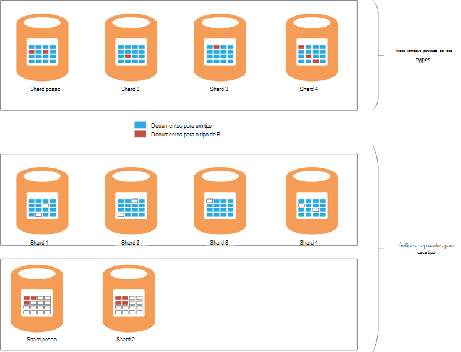

    ***Os efeitos da partilha de um índice remissivo entre tipos*** 

    Na parte superior do diagrama, o mesmo índice é partilhado por documentos de tipo A e b tipo. Existem muitas mais documentos de tipo A que tipo de que pesquisas B. para tipo A estará envolvam consultar todos os quatro shards. A parte inferior do diagrama mostra o efeito se são criados índices separados para cada tipo. Neste caso, pesquisas para tipo de um irá introduzir apenas aceder a duas shards.

- Shards pequenas podem ser distribuídos mais uniformemente que shards grandes, tornando mais fácil para Elasticsearch distribuir a carga por nós.

- Diferentes tipos poderão ter de períodos de retenção diferente. Pode ser difícil arquivar dados antigos que partilha shards com dados ativos.


No entanto, em determinadas circunstâncias partilhar um índice remissivo em tipos de pode ser eficaz se:

- As pesquisas regularmente abrangem tipos contidos no índice do mesmo.

- Os tipos de têm apenas um pequeno número de documentos que cada. Manutenção de um conjunto diferente de shards para cada tipo pode tornar-se uma sobrecarga significativa neste caso.


### <a name="optimizing-index-types"></a>Otimizar os tipos de índice remissivo

Um índice remissivo Elasticsearch contém uma cópia dos documentos JSON originais que foram utilizadas para preencha-a. Esta informação é mantida na [* \_origem*](https://www.elastic.co/guide/en/elasticsearch/reference/current/mapping-source-field.html#mapping-source-field) campo de cada item indexado. Estes dados não não pesquisáveis, mas por predefinição, são devolvidos por pedidos de *pesquisa* e *obter* . No entanto, este campo como gerais e ocupa armazenamento, tornando shards maior e aumentar o volume de e/s executado. Pode desativar o * \_origem* campo numa base por tipo:

```http
PUT my_index
{
  "mappings": {
    "my_type": {
      "_source": {
        "enabled": false
      }
    }
  }
}
```
Desativar este campo também a irá remover a capacidade de executar as seguintes operações:

- Atualizar dados no índice remissivo utilizando a *Atualizar* API.

- Efetuar análises de pesquisas que devolver dados realçados.

- Reindexar a partir de um índice de Elasticsearch diretamente para outro.

- Alterar as definições de análise ou o mapeamentos.

- Depuração de consultas, veja o documento original.


### <a name="reindexing-data"></a>Reindexação dados

O número de shards disponíveis para um índice remissivo, finalmente, determina a capacidade do índice. Que pode tomar uma estimativa inicial (e informada) na shards quantos serão necessárias, mas pode sempre deverá tomar em consideração o documento a reindexação adiantado estratégia. Em muitos casos, reindexação poderá ser uma tarefa se destina à medida que aumenta de dados. Poderá não pretende atribuir um grande número de shards para um índice remissivo inicialmente, por uma questão de busca, mas alocar shards novos como expande o volume de dados. Em outros casos reindexação poderá ter de ser executado numa base ad-hoc mais se as estimativas sobre crescimento de volume dados revelar-se simplesmente para ser imprecisas.

> [AZURE.NOTE] Reindexação não poderá ser necessário para os dados que idades rapidamente. Neste caso, uma aplicação poderá criar um novo índice para cada período de tempo. Exemplos incluem registos de desempenho ou auditoria de dados que podem ser armazenados num índice fresco cada dia.

<!-- -->

Reindexação de forma eficaz envolve criar um novo índice a partir dos dados de um antigo e, em seguida, remover o índice antigo. Se um índice remissivo for grande, este processo pode demorar tempo e poderá ter de se certificar de que os dados permanecem pesquisáveis durante este período. Por este motivo, deverá criar um [alias para cada índice remissivo](https://www.elastic.co/guide/en/elasticsearch/reference/current/indices-aliases.html)e consultas devem obter os dados através destes alias. Durante a reindexação, manter o alias apontar para o índice antigo e, em seguida, mude para o novo índice de referência, uma vez reindexação concluída. Esta abordagem também é útil para aceder aos dados baseados no tempo que cria um novo índice cada dia. Para aceder a corrente dados utilizam um alias de descer ao longo para o novo índice tal como é criada.

### <a name="managing-mappings"></a>Gerir mapeamentos de

Elasticsearch utiliza mapeamentos para determinar como interpretar os dados que ocorre em cada campo num documento. Cada tipo tem os suas próprias mapeamento, que define o um esquema para esse tipo de forma eficaz. Elasticsearch utiliza estas informações para gerar índices invertidos para cada campo nos documentos num tipo. Em qualquer documento, cada campo tem um tipo de dados (como *cadeia*, *data*ou *longo*) e um valor. Pode especificar os mapeamentos para um índice remissivo quando o índice é criado pela primeira vez ou pode ser inferidas por Elasticsearch quando novos documentos são adicionados a um tipo de. No entanto, tenha em atenção os seguintes pontos:

- Mapeamentos gerados dinamicamente podem causar erros consoante a forma como os campos são interpretados quando documentos são adicionados a um índice remissivo. Por exemplo, documento 1 poderia conter um campo A que contém um número e causas Elasticsearch para adicionar um mapeamento que indica que este campo é uma *longa*. Se um documento subsequente é adicionado na qual ao campo contém dados não numéricos, então irá falhar. Neste caso, campo A deverá provavelmente ter sido interpretado como uma cadeia de quando o primeiro documento foi adicionado. Especificar este mapeamento quando o índice é criado pode ajudar a impedir que esses problemas.

- Estruture os seus documentos para evitar a gerar mapeamentos demasiado grandes, tal como este pode adicionar significativa sobrecarga quando efetuar pesquisas, consumir grandes quantidades de memória e também causar consultas a falha encontrar dados. Aprovar uma convenção de nomenclatura consistente para os campos nos documentos que partilham o mesmo tipo. Por exemplo, não utilize nomes de campos como "nome", "NomePróprio" e "Apelido" em documentos diferentes. Utilize o mesmo nome de campo em cada documento. Para além disso, não tentar utilizar valores como chaves (isto é uma abordagem comuns nas bases de dados da coluna família, mas pode causar falhas e ineficiências com Elasticsearch.) Para mais informações, consulte o artigo [Explosão mapeamento](https://www.elastic.co/blog/found-crash-elasticsearch#mapping-explosion).

- Utilize *not_analyzed* para evitar na atomização adequado. Por exemplo, se um documento contiver um campo de cadeia com o nome *dados* que contém o valor "Definição de ABC", em seguida, pode tentar efetuar uma pesquisa para todos os documentos que correspondem a este valor da seguinte forma:

  ```http
  GET /myindex/mydata/_search
  {
    "query" : {
      "filtered" : {
        "filter" : {
          "term" : {
            "data" : "ABC-DEF"
          }
        }
      }
    }
  }
  ```

 No entanto, irá falhar esta pesquisa devolver os resultados esperados devido a forma na qual com token a cadeia de definição de ABC, quando é indexado. -Lo será eficazmente dividida em dois tokens ABC e definição, por um hífen. Esta funcionalidade foi concebida para suportar a procura de texto completo, mas se pretende que a cadeia a ser interpretada como um único item atómico deve desativar na atomização quando o documento é adicionado ao índice. Pode utilizar um mapeamento como estas:

  ```http
  PUT /myindex
  {
    "mappings" : {
      "mydata" : {
        "properties" : {
          "data" : {
            "type" : "string",
            "index" : "not_analyzed"
          }
        }
      }
    }
  }
  ```

  Para mais informações, consulte o artigo [Localizar valores exata](https://www.elastic.co/guide/en/elasticsearch/guide/current/_finding_exact_values.html#_term_filter_with_text).


### <a name="using-doc-values"></a>Utilizando os valores do documento

Muitos consultas e agregações requerem que os dados são ordenados como parte da operação de pesquisa. Ordenação necessita de ser capaz de mapear um ou mais termos para uma lista dos documentos. Para ajudar a este processo, pode carregar Elasticsearch todos os valores para um campo utilizado como uma chave de ordenação na memória. Esta informação é conhecida como *fielddata*. A intenção é que a colocação em cache fielddata na memória como menos e/s e poderá ser mais rápida que repetidamente ler os mesmos dados a partir do disco. No entanto, se tiver um campo cardinalidade alta, em seguida, armazenar o fielddata na memória pode consumir muitas pilha quantidade de espaço, possivelmente que afetam a capacidade de executar outras operações em simultâneo, ou até mesmo eventualidade armazenamento a causar Elasticsearch falha.

Como uma abordagem alternativa, Elasticsearch também suporta *valores de documento*. Um valor de documento é semelhante a um item de fielddata na memória, exceto os é armazenada no disco e criada quando os dados são armazenados num índice (fielddata está construída dinamicamente quando uma consulta é executada.) Valores de documento não consumir o espaço de pilha e, por isso, são úteis para as consultas que ordenar ou agregar dados nos campos que podem conter um grande número de valores exclusivos. Para além disso, a pressão reduzida na pilha de pode ajudar a desfasamento as diferenças de desempenho entre obtenção de dados a partir do disco e ler o artigo de memória. Recolha de lixo é provável que ocorra com menos frequência e outras operações em simultâneo que utilizam funcionalidades memória são menos provável a realizar.

Ativar ou desativar os valores de documento numa base por propriedade de um índice utilizando o atributo *doc_values* , conforme o exemplo seguinte:

```http
PUT /myindex
{
  "mappings" : {
    "mydata" : {
      "properties" : {
        "data" : {
          ...
          "doc_values": true
        }
      }
    }
  }
}
```
> [AZURE.NOTE] Valores de documento são ativadas por predefinição com Elasticsearch versão 2.0.0 e posteriores.

É provável que seja altamente específica para os seus dados e consulta cenários, por isso, seja preparado para realizar testes de desempenho para estabelecer a sua utilidade o impacto exato da utilizando os valores do documento. Também deve nota esse documento valores não funcionam com campos de cadeia analisados. Para mais informações, consulte o artigo [Valores de documento](https://www.elastic.co/guide/en/elasticsearch/guide/current/doc-values.html#doc-values).

### <a name="using-replicas-to-reduce-query-contention"></a>Utilizar réplicas para reduzir contenção de consulta

Uma estratégia comuns para aumentar o desempenho de consultas é criar réplicas muitos de cada índice. Operações de obtenção de dados podem ser cumpridas por a obter dados a partir de uma réplica. No entanto, esta estratégia extremamente pode afetar o desempenho ingestão de operações de dados, por isso, necessita para ser utilizado com cuidado em cenários que envolvam mistas das cargas de trabalho. Para além disso, esta estratégia é apenas benefício se réplicas estão distribuídas nós e não competir para recursos com shards principais que fazem parte do mesmo índice. Lembre-se de que é possível aumentar ou diminuir o número de réplicas para um índice remissivo dinamicamente.

### <a name="using-the-shard-request-cache"></a>Utilizar a cache de pedido de shard

Elasticsearch pode colocar em cache dos dados locais pedidos pelo consultas no cada shard na memória. Este pesquisas de permite obter os mesmos dados para executar o mais rapidamente, dados podem ser lidos a partir do armazenamento de memória em vez de disco. Colocação em cache dados desta forma, por conseguinte, pode melhorar o desempenho do algumas operações de pesquisa, pelo valor reduzir a memória disponível para outras tarefas a ser executadas em simultâneo. Também é o risco de que os dados servida da cache de é desatualizada. Os dados na cache são invalidados apenas quando o shard é atualizada e os dados foi alterado. A frequência de actualiza é regida pelo valor da definição *intervalo_de_actualização* do índice.

O pedido de colocação em cache para um índice remissivo é desactivado por predefinição, mas pode ativá-la da seguinte forma:

```http
PUT /myindex/_settings
{
  "index.requests.cache.enable": true
}
```

A cache de pedido de shard é mais adequada para obter informações que permanece relativamente estáticas, tal como dados históricos ou o registo.

### <a name="using-client-nodes"></a>Utilizar nós de cliente

Todas as consultas são processadas pelo nó que recebe pela primeira vez o pedido. Este nó envia ainda mais pedidos para todos os outros nós que contém shards para os índices a ser consultados e, em seguida, acumulado os resultados para devolver a resposta. Se uma consulta envolve agregar dados ou a efetuar cálculos complexos, o nó inicial é responsável para efetuar o processamento adequado. Se o sistema tiver que suportar um relativamente pequeno número de consultas complexas, considere criar um conjunto de cliente nós para diminuir a carga dos nós de dados. Por outro lado, se o sistema tiver que processar um grande número de consultas simples, em seguida, submeta estes pedidos direta para os nós de dados e utilizam um balanceador de carga para distribuir uniformemente os pedidos.

### <a name="tuning-queries"></a>Otimização do consultas

Os seguintes pontos resumem sugestões para maximizar o desempenho das consultas Elasticsearch:

- Evite consultas que envolvam caracteres universais sempre que possível.

- Se o mesmo campo está sujeito a texto completo procura e exato correspondência, em seguida, considere armazenar os dados para o campo nos formulários de analisados e nonanalyzed. Execute pesquisas de texto completo sobre o campo analisado e correspondências exatas contra o campo nonanalyzed.

- Devolva apenas os dados necessários. Se tiver documentos grandes, mas uma aplicação requer apenas informações contidas num subconjunto dos campos, em seguida, regresse este subconjunto de consultas em vez de todas documentos. Esta estratégia pode reduzir os requisitos de largura de banda de rede do cluster.

- Sempre que possível, utilize filtros em vez de consultas, quando procurar para os dados. Um filtro simplesmente determina se um documento corresponde a um determinado critério Considerando que uma consulta calcula também como fechar uma correspondência um documento é (pontuação). Internamente, os valores gerados por um filtro são armazenados como mapa de bits indicando corresponder/não correspondência para cada documento e pode ser cache por Elasticsearch. Se o mesmo critério de filtro ocorrer posteriormente, o mapa de bits pode ser obtido a partir de cache e utilizado para obter rapidamente os documentos correspondentes. Para mais informações, consulte o artigo [Interno operação de filtragem](https://www.elastic.co/guide/en/elasticsearch/guide/current/_finding_exact_values.html#_internal_filter_operation).

- Utilizar filtros de *Booleano* para efetuar comparações estáticas e utiliza apenas *e* *ou*filtros e *não* para dinamicamente calculados filtros, como aqueles que envolvam scripting ou o *geo -\* * filtros.

- Se uma consulta combina *Booleano* filtros com *e*, *ou*, ou *não* com *geo -* * filtros, coloque o *e*/*ou*/*geo-* * filtros última para que funcionam no menor possíveis do conjunto de dados.

    Da mesma forma, utilize um *post_filter* para executar operações de filtro dispendioso. Estes filtros serão executados última.

- Utilize agregações em vez de facetas. Evite calcular agregados que estão a ser analisadas ou que têm muitos valores possíveis.

    > **Nota**: facetas foram removidas no Elasticsearch versão 2.0.0.

- Utilize a agregação de *Cardinalidade* em relação a outros a agregação *value_count* a menos que a sua aplicação requer uma contagem de itens de correspondência exata. Uma contagem exata pode tornar-se rapidamente desatualizada e muitas aplicações introduzir apenas uma aproximação razoável.

- Evite scripting. Scripts em consultas e filtros podem ser dispendiosos e os resultados não são armazenadas em cache. Scripts de execução longa podem consumir threads pesquisa indefinidamente, a causar os pedidos subsequentes para ser colocados na fila. Se a fila é preenchida, ainda mais pedidos serão rejeitados.

## <a name="testing-and-analyzing-aggregation-and-search-performance"></a>Testar e analisar o desempenho de pesquisa e de agregação

Esta secção descreve os resultados de uma série de testes que foram efetuadas contra cluster variado e as configurações de índice remissivo. Dois tipos de testes foram efectuados, da seguinte forma:

- * *A *ingestão e consulta* teste * *. Este teste iniciado com um índice remissivo vazio que foi preenchido tal como o teste precedidos por efetuar operações de inserir em volume (cada operação adicionado documentos de 1000). Ao mesmo tempo, um número de consultas concebido para procurar documentos que foram adicionados durante o período de 15 minutos anterior e gerar agregações foram repetida de modo a 5 intervalos segundo. Este teste normalmente foi permitida para executar 24 horas, para reproduzir os efeitos de um desafio carga de trabalho que incluam ingestão de dados em grande escala com perto consultas em tempo real.

- **A *consulta só* testar**. É semelhante a este teste a *ingestão e para a consulta* testar exceto a que a peça ingestão for omitida e o índice em cada nó é pré-preenchida com 100 milhões de documentos. Um conjunto alterado de consultas é executado; o elemento de tempo limitar documentos para aqueles adicionado nos últimos 15 minutos foi removido como os dados agora foram estáticos. Os testes executou para 90 minutos, há menos tempo necessário para estabelecer um padrão de desempenho devido a fixo quantidade de dados.

---

Cada documento no índice remissivo teve ao mesmo esquema. A tabela seguinte resume os campos no esquema de:

Nome                          | Tipo         | Notas |
  ----------------------------- | ------------ | -------------------------------------------------------- |
  Organização                  | Cadeia      | O teste gera 200 organizações exclusivas. |
  CustomField1 - CustomField5   |Cadeia       |Estes são cinco campos de cadeia que estão definidos para a cadeia vazia.|
  DateTimeRecievedUtc           |Data/hora    |A data e hora em que o documento foi adicionado.|
  Anfitrião                          |Cadeia       |Este campo é definido como a cadeia vazia.|
  HttpMethod                    |Cadeia       |Este campo estiver definido para um dos seguintes valores: "Publicar", "Obter", "Colocar".|
  HttpReferrer                  |Cadeia       |Este campo é definido como a cadeia vazia.|
  HttpRequest                   |Cadeia       |Este campo é povoado com texto aleatório entre 10 e 200 carateres de comprimento.|
  HttpUserAgent                 |Cadeia       |Este campo é definido como a cadeia vazia.|
  HttpVersion                   |Cadeia       |Este campo é definido como a cadeia vazia.|
  Nome da organização              |Cadeia       |Este campo está definido para o mesmo valor que o campo da organização.|
  SourceIp                      |IP           |Este campo contém um endereço IP que indica "origem" dos dados. |
   SourceIpAreaCode              |Longo         |Este campo é definido como 0.|
  SourceIpAsnNr                 |Cadeia       |Este campo é definido como "como\#\#\#\#\#".|
  SourceIpBase10                |Longo         |Este campo está definido para 500.|
  SourceIpCountryCode           |Cadeia       |Este campo contém um código de país 2 carateres. |
  SourceIpCity                  |Cadeia       |Este campo contém uma cadeia que identifica uma cidade num país. |
  SourceIpLatitude              |Dupla       |Este campo contém um valor aleatório.|
  SourceIpLongitude             |Dupla       |Este campo contém um valor aleatório.|
  SourceIpMetroCode             |Longo         |Este campo é definido como 0.|
  SourceIpPostalCode            |Cadeia       |Este campo é definido como a cadeia vazia.|
  SourceLatLong                 |Ponto de geo   |Este campo estiver definido para um ponto de geo aleatório.|
  Portadeorigem                    |Cadeia       |Este campo é povoado com a representação de cadeia de um número aleatório.|
  TargetIp                      |IP           |Isto é povoado com um endereço IP aleatório no intervalo 0.0.100.100 para 255.9.100.100.|
  SourcedFrom                   |Cadeia       |Este campo esteja definido com a cadeia "MonitoringCollector".|
  TargetPort                    |Cadeia       |Este campo é povoado com a representação de cadeia de um número aleatório.|
  Classificação                        |Cadeia       |Este campo é povoado com um dos valores de cadeia diferente 20 aleatoriamente.|
  UseHumanReadableDateTimes     |Booleano      |Este campo é definido como falso.|
 
Consultas que se seguem foram efetuadas como um lote de por cada iteração dos testes. Os nomes na itálico são utilizados para fazer referência a estas consultas no restante deste documento. Tenha em atenção que foram omitido o critério de tempo (documentos que foram adicionados nos últimos 15 minutos) a partir do *só de consulta* testes:

- Quantos documentos com cada valor de *classificação* foram introduzidos nos últimos 15 minutos (*Contar por classificação*)? 

- Quantos documentos foram adicionados em cada intervalo de 5 minutos durante os últimos 15 minutos (*contar ao longo do tempo*)?

- Foram adicionados quantos documentos de cada valor *de classificação* de cada país nos últimos 15 minutos (*acertos por país*)?

- As 15 organizações ocorrerem maior parte dos documentos frequentemente em adicionado nos últimos 15 minutos (*início 15 organizações*)?

- Quantos diferentes organizações ocorrerem em documentos que foram adicionados nos últimos 15 minutos (*organizações contar exclusivo*)?

- Quantos documentos foram adicionados nos últimos 15 minutos (*Contagem Total de acertos*)?

- Quantos diferentes valores *SourceIp* ocorrerem em documentos que foram adicionados nos últimos 15 minutos (*contagem de IP exclusivo*)?


A definição do índice remissivo e os detalhes das consultas são destacados o [anexo](#appendix-the-query-and-aggregation-performance-test).

Os testes foram concebidos para compreender os efeitos de variáveis que se seguem:

- **Tipo de disco**. Testes foram efectuados num cluster de nó de 6 de VMs D4 utilizando o armazenamento padrão (HDDs) e repetidos num cluster de nó de 6 de VMs DS4 utilizando o armazenamento de prémio (SSDs).

- **Tamanho de máquina - escalar para cima**. Testes foram executados num cluster de 6-nó que incluam VMs DS3 (designados como cluster de *pequenas* ), repetidos num cluster de DS4 VMs (o cluster de *média* ) e repetidos novamente num cluster de DS14 máquinas (o cluster de *grandes dimensões* ). A tabela seguinte resume as características de cada SKU VM-chave:

 Cluster | VM SKU        | Número de núcleos | Número de discos de dados | (GB) DE RAM |
---------|---------------|-----------------|----------------------|----------|
 Pequenas   | DS3 padrão  | 4               | 8                    | 14       |
 Médio  | DS4 padrão  | 8               | 16                   | 28       |
 Grande   | DS14 padrão | 16              | 32                   | 112      |

- **Tamanho de cluster - escalar para fora**. Testes foram efectuados no clusters de VMs DS14 que contém a 1, 3 e 6 nós.

- **Número de réplicas do índice**. Testes foram efectuados utilizar índices configurados com réplicas 1 e 2.

- **Valores de documento**. Inicialmente os testes foram efectuados com o índice definição *doc_values* definida como *Verdadeiro* (o valor predefinido). Testes seleccionados foram repetidos com *doc_values* definida como *false*.

- A **Colocação em cache**. Foram realizados testes com a cache de pedido de shard ativada no índice.

- **Número de shards**. Ensaios foram repetidos utilizando variados números de shards para estabelecer se consultas de forma mais eficiente, executou através de índices que contém shards menos, maiores ou mais pequenos, mais shards.


## <a name="performance-results---disk-type"></a>Resultados do desempenho - tipo de disco

O desempenho do disco foi avaliado ao executar o teste *ingestão e consulta* do cluster de 6-node de VMs D4 (utilizando HDDs) e o cluster de 6-node de VMs DS4 (utilizando SSDs). A configuração do Elasticsearch em ambos os clusters era a mesma. Os dados foram distribuir por 16 discos em cada nó e cada nó tinha 14GB de RAM atribuída à Java máquina virtual (JVM) a executar o Elasticsearch, a memória restante (também 14GB) foi deixada para utilização do sistema operativo. Cada teste ficou 24 horas. Este período de foi selecionado para permitir os efeitos de volume crescente de dados para a tornar-se evidente e permitir que o sistema de regularização. A tabela abaixo resume os resultados, realce os tempos de resposta de várias operações que composto pelo teste.

 Cluster | Operação/consulta            | Tempo de resposta médio (ms) |
---------|----------------------------|----------------------------|
 D4      | Ingestão                  | 978                        |
         | Contar por classificação            | 103                        |
         | Tempo restante de contagem            | 134                        |
         | Acertos por país/região            | 199                        |
         | Início 15 organizações       | 137                        |
         | Contar exclusivo organizações | 139                        |
         | Contagem de IP exclusivo            | 510                        |
         | Contagem total de acertos           | 89                         |
 DS4     | Ingestão                  | 511                        |
         | Contar por classificação            | 187                        |
         | Tempo restante de contagem            | 411                        |
         | Acertos por país/região            | 402                        |
         | Início 15 organizações       | 307                        |
         | Contar exclusivo organizações | 320                        |
         | Contagem de IP exclusivo            | 841                        |
         | Contagem total de acertos           | 236                        |

Primeira vista, apareceriam-se que o cluster DS4 executado consultas menos bem que cluster D4, por vezes apresentam (ou pior) o tempo de resposta. Isto não indicar-toda a história embora. A tabela seguinte mostra o número de operações de ingestão realizado por cada cluster (não se esqueça de que cada operação carrega documentos de 1000):

 Cluster | Contagem de operação ingestão |
---------|---------------------------|
 D4      | 264769                    |
 DS4     | 503157                    |

DS4 cluster conseguiu carregar quase o dobro dos dados que o cluster D4 durante o ensaio. Por isso, ao analisar os tempos de resposta para cada operação, também precisa da ter em conta quantos documentos cada consulta tem para digitalizar e quantos documentos são devolvidos. Estes são ilustrações dinâmicas como o volume de documentos no índice remissivo é automática e continuamente em crescimento. Não pode simplesmente dividir 503137 por 264769 (o número de operações de ingestão realizado por cada cluster) e, em seguida, multiplique o resultado pelo tempo de resposta média para cada consulta efetuada pelo cluster D4 para conceder a informação comparativa como isto ignora a quantidade de e/s a ser executado em simultâneo pela operação de ingestão. Em vez disso, deve medir a física quantidade de dados a ser escritos e ler a partir do disco, à medida que avança o teste. O plano de teste JMeter captura estas informações para cada nó. Os resultados resumidos são:

 Cluster | Média dos bytes escrita/leitura por cada operação |
---------|----------------------------------------------|
 D4      | 13471557                                     |
 DS4     | 24643470                                     |

Estes dados mostram o cluster DS4 conseguiu manter a uma taxa e/s aproximadamente 1,8 vezes que o cluster D4. Dado que, para além de natureza dos discos, todos os outros recursos são os mesmos, a diferença tem de ser devido ao utilizar SSDs preferir HDDs.

Para ajudar a justificar esta conclusão, os gráficos seguintes ilustram como a e/s foi executado ao longo do tempo por cada cluster:

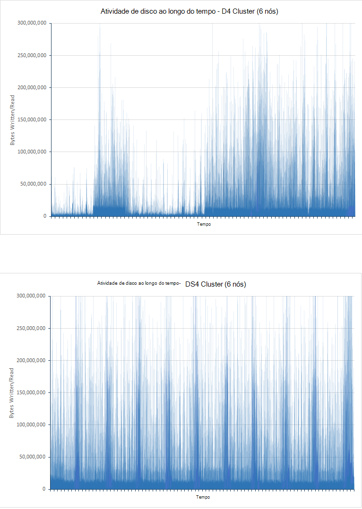

<!-- -->

***Actividade do disco para clusters de D4 e DS4***

O gráfico para o cluster D4 mostra a variação significativa, especialmente durante a primeira metade o teste. Este era muito provavelmente devido a limitação para reduzir a taxa e/s. Nas fases iniciais do teste, as consultas são conseguir executar rapidamente como há pouco dados a analisar. Os discos no D4 cluster, por isso, serão provável que operativo fechar para os respetivos operações de entrada/saída por capacidade, segunda (IOPS), apesar de cada operação e/s poderá não estar a devolver quantidade de dados. DS4 cluster consiga suportar uma taxa IOPS superior e não sofrem o mesmo grau de limitação, as taxas e/s são mais normais. Para suportar este teoria, o par seguinte dos gráficos mostram como a CPU foi bloqueada pelo disco e/s ao longo do tempo (os tempos de espera de disco apresentados nos gráficos são a proporção de tempo que a CPU gasto em espera para e/s):

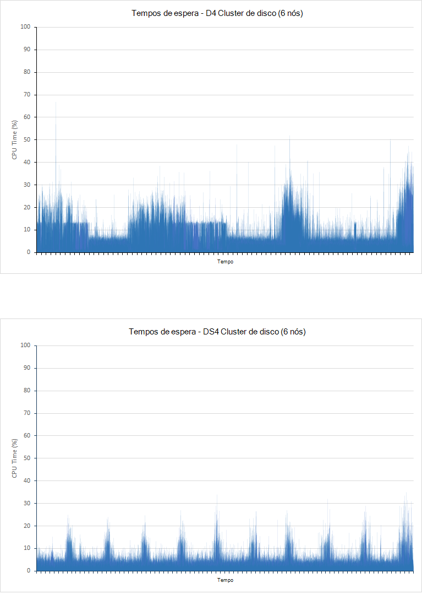

***Disco CPU e/s esperar horas para os clusters D4 e DS4***

É importante compreender o que não existem duas razões predominantes para operações de e/s bloquear a CPU:

- O subsystem e/s pode ser de leitura ou escrita de dados para ou a partir do disco.

- O subsystem e/s pode ser limitado pelo ambiente do anfitrião. Azure discos implementados através da utilização HDDs têm um débito máximo de 500 IOPS e SSDs tem um débito máximo de 5000 IOPS.


Para D4 cluster, a quantidade de tempo gasto em espera para e/s durante a primeira meia hora de se correlaciona com o teste perto de uma forma invertida com o gráfico que mostra as taxas e/s. Períodos de baixa e/s correspondam aos períodos de tempo significativo que CPU passa bloqueados, isto indica que está a ser limitada e/s. Como são adicionados mais dados ao cluster as alterações de situação e na segunda meia dos picos teste e/s tempos de espera correspondem com picos nas débito e/s. Neste momento, a CPU está bloqueada enquanto executa e/s real. Novamente, com DS4 cluster, o tempo gasto a aguardar e/s é par muito mais. Cada pico corresponde a um pico equivalente no desempenho e/s em vez de um canal, isto significa que não existe pouca ou nenhuma optimização a ocorrer.

Existe um outro factor a ter em conta. Durante o ensaio, D4 cluster gerado 10584 erros de ingestão e, 21 erros de consulta. O teste no DS4 cluster produzidos sem erros.

## <a name="performance-results---scaling-up"></a>Resultados do desempenho - escalar para cima

Teste de escala de segurança foi executado pelos executar testes contra 6-node clusters de DS3, DS4 e DS14 VMs. Estes SKUS foram selecionadas uma vez que um VM DS4 fornece duas vezes muitos núcleos CPU e memória como um DS3 e uma máquina de DS14 é duplicado os recursos da CPU novamente ao fornecer quatro vezes a quantidade de memória. A tabela abaixo se compara os chaves aspetos de cada SKU:

 SKU  | \#Núcleos CPU | Memória (GB) | Disco máximo IOPS | Largura de banda Max (MB/s)|
------|-------------|-------------|---------------|--------------|
 DS3  | 4           | 14          | 12,800| 128 |
 DS4  | 8           | 28          | 25,600| 256 |
 DS14 | 16          | 112         | 50000| 512 |

A tabela seguinte resume os resultados da execução testes pequenas (DS3), médio (DS4) e grandes (DS14) clusters. Cada VM utilizados SSDs para armazenar os dados. Cada teste ficou 24 horas.

A tabela reporta o número de pedidos com êxito para cada tipo de consulta (falhas não são incluídas). O número de pedidos tentado para cada tipo de consulta é aproximadamente o mesmo durante a execução do teste. Isto acontece porque o plano de teste JMeter executa uma única ocorrência de cada consulta (contar por classificação, tempo restante de contagem, acertos por país, início 15 organizações, exclusivos contar organizações, exclusivos contagem de IP e contagem de acertos Total) em conjunto numa única unidade conhecida como um *teste da transação* (esta transação é independente da tarefa que executa a operação de ingestão, que é executada por um módulo separado). Cada iteração do plano de teste executa uma teste única transação. O número de teste transações efetuadas, por isso, é uma medida do tempo de resposta da consulta mais lenta em cada transação.

| Cluster      | Operação/consulta            | Número de pedidos de | Tempo de resposta médio (ms) |
|--------------|----------------------------|--------------------|----------------------------|
| Pequena (DS3)  | Ingestão                  | 207284             | 3328                       |
|              | Contar por classificação            | 18444              | 268                        |
|              | Tempo restante de contagem            | 18444              | 340                        |
|              | Acertos por país/região            | 18445              | 404                        |
|              | Início 15 organizações       | 18439              | 323                        |
|              | Contar exclusivo organizações | 18437              | 338                        |
|              | Contagem de IP exclusivo            | 18442              | 468                        |
|              | Contagem total de acertos           | 18428              | 294   
|||||
| Média (DS4) | Ingestão                  | 503157             | 511                        |
|              | Contar por classificação            | 6958               | 187                        |
|              | Tempo restante de contagem            | 6958               | 411                        |
|              | Acertos por país/região            | 6958               | 402                        |
|              | Início 15 organizações       | 6958               | 307                        |
|              | Contar exclusivo organizações | 6956               | 320                        |
|              | Contagem de IP exclusivo            | 6955               | 841                        |
|              | Contagem total de acertos           | 6958               | 236                        |
|||||
| Grande (DS14) | Ingestão                  | 502714             | 511                        |
|              | Contar por classificação            | 7041               | 201                        |
|              | Tempo restante de contagem            | 7040               | 298                        |
|              | Acertos por país/região            | 7039               | 363                        |
|              | Início 15 organizações       | 7038               | 244                        |
|              | Contar exclusivo organizações | 7037               | 283                        |
|              | Contagem de IP exclusivo            | 7037               | 681                        |
|              | Contagem total de acertos           | 7038               | 200                        |

O desempenho do cluster DS4 e DS14 estes valores mostram que, para que este teste foram razoável semelhantes. Os tempos de resposta para as operações de consulta para que o cluster DS3 também são apresentados comparar favoravelmente inicialmente e o número de consulta operações realizadas é extremidade que excedam os valores para o cluster DS4 e DS14. No entanto, também um deve ter aviso forte da taxa de ingestão e o número consecutivas de documentos que está a ser procurado. No DS3 cluster ingestão está restringido muito mais e, no final do teste a base de dados contidos apenas cerca de 40% dos documentos ler por cada um dos outros dois clusters. É possível devido a recursos de processamento, rede e disponível para uma VM DS3 comparada com uma DS4 ou DS14 VM da largura de banda do disco. Dado que uma VM DS4 tem duas vezes muitos recursos disponíveis como uma VM DS3 e um DS14 tem duas vezes (quatro vezes para memória) os recursos de uma VM DS4, uma pergunta permanece: por que motivo é a diferença em taxas ingestão entre os clusters DS4 e DS14 significativamente menor do que aquele que ocorre entre os clusters DS3 e DS4? Isto pode ser devido a utilização da rede e limites de largura de banda do Azure VMs. Os gráficos da abaixo mostram estes dados para todos os três clusters:

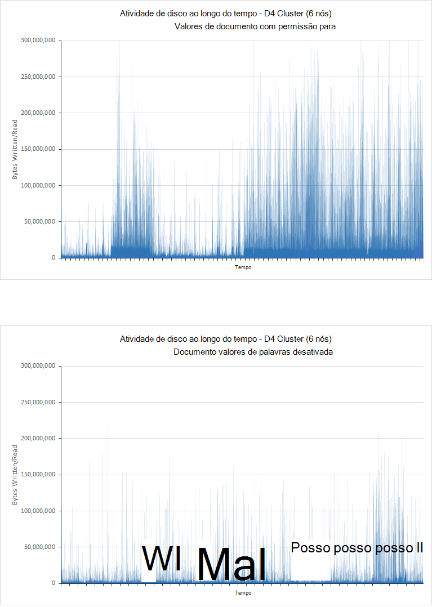

**Utilização da rede para os clusters DS3, DS4 e DS14 efetuar o teste ingestão e para a consulta** 

<!-- -->

Os limites de largura de banda de rede disponíveis com Azure VMs não são publicados e podem variar, mas o facto de atividade de rede parece ter regular a uma média de cerca 2.75GBps para ambas as DS4 e DS14 testes sugere que um limite de foi atingido e tornou o principal factor nas débito de restrição. No caso de DS3 cluster, a atividade de rede foi consideravelmente inferior para que o desempenho inferior é mais provável devido a restrições a disponibilidade de outros recursos.

Para identificar os efeitos das operações ingestão e ilustrar como o desempenho da consulta varia consoante as nós Dimensionar para cima, um conjunto de testes só de consulta foi executado utilizando os nós do mesmo. A tabela seguinte resume os resultados obtidos em cada cluster:

> [AZURE.NOTE] Não deve comparar o desempenho e o número de pedidos de executadas por consultas na *consulta só* teste com as executar pelo teste *ingestão e para a consulta* . Isto acontece porque foram modificadas as consultas e o volume de documentos envolvidos é diferente.

| Cluster      | Operação/consulta            | Número de pedidos de | Resposta médio Ttme (ms) |
|--------------|----------------------------|--------------------|----------------------------|
| Pequena (DS3)  | Contar por classificação            | 464                | 11758                      |
|              | Tempo restante de contagem            | 464                | 14699                      |
|              | Acertos por país/região            | 463                | 14075                      |
|              | Início 15 organizações       | 464                | 11856                      |
|              | Contar exclusivo organizações | 462                | 12314                      |
|              | Contagem de IP exclusivo            | 461                | 19898                      |
|              | Contagem total de acertos           | 462                | 8882  
|||||
| Média (DS4) | Contar por classificação            | 1045               | 4489                       |
|              | Tempo restante de contagem            | 1045               | 7292                       |
|              | Acertos por país/região            | 1053               | 7564                       |
|              | Início 15 organizações       | 1055               | 5066                       |
|              | Contar exclusivo organizações | 1051               | 5231                       |
|              | Contagem de IP exclusivo            | 1051               | 9228                       |
|              | Contagem total de acertos           | 1051               | 2180                       |
|||||
| Grande (DS14) | Contar por classificação            | 1842               | 1927                       |
|              | Tempo restante de contagem            | 1839               | 4483                       |
|              | Acertos por país/região            | 1838               | 4761                       |
|              | Início 15 organizações       | 1842               | 2117                       |
|              | Contar exclusivo organizações | 1837               | . o 2393                       |
|              | Contagem de IP exclusivo            | 1837               | 7159                       |
|              | Contagem total de acertos           | 1837               | 642                        |

Desta vez, as tendências dos tempos de resposta média entre os diferentes clusters é mais clara. Utilização da rede está bem abaixo 2.75GBps necessária anterior ao clusters DS4 e DS14 (que provavelmente saturada da rede em testes ingestão e para a consulta) e 1.5GBps para o cluster DS3. Na verdade, é mais perto 200MBps em todos os casos, conforme apresentada dos gráficos abaixo:

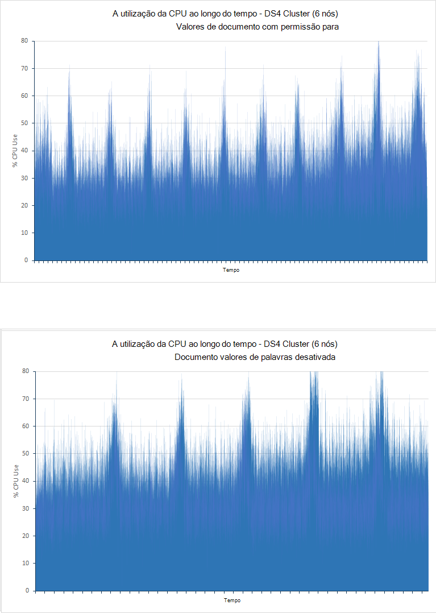

***Utilização para DS3, de rede DS4 e DS14 clusters de efetuar o teste só de consulta*** 

O factor de limitação clusters DS3 e DS4 agora parece estar a utilização da CPU, que se aproxime a 100% para a maior parte das vezes. No DS14 a utilização de cluster CPU calcula a média apenas superior 80%. Esta é ainda alta, mas claramente realça as vantagens de ter mais tarolos CPU disponíveis. A imagem seguinte ilustra os padrões de utilização da CPU para clusters de DS3, DS4 e DS14.

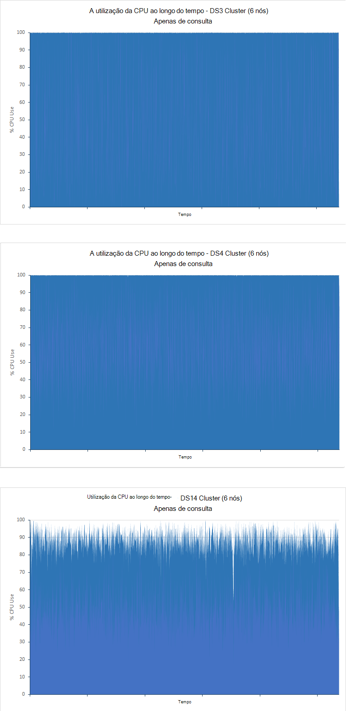

***Utilização da CPU para os clusters DS3 e DS14 efetuar o teste só de consulta*** 

## <a name="performance-results---scaling-out"></a>Resultados do desempenho - dimensionamento saída

Para ilustrar a forma como o sistema escalas saída com o número de nós, testes foram executados utilizando clusters DS14 que contém a 1, 3 e 6 nós. Desta vez, apenas a *consulta só* teste foi executado, utilizar 100 milhões de documentos e executar para 90 minutos:

| Cluster | Operação/consulta            | Número de pedidos de | Tempo de resposta médio (ms) |
|---------|----------------------------|--------------------|----------------------------|
| 1 nó  | Contar por classificação            | 288                | 6216                       |
|         | Tempo restante de contagem            | 288                | 28933                      |
|         | Acertos por país/região            | 288                | 29455                      |
|         | Início 15 organizações       | 288                | 9058                       |
|         | Contar exclusivo organizações | 287.                | 19916                      |
|         | Contagem de IP exclusivo            | 284                | 54203                      |
|         | Contagem total de acertos           | 287.                | 3333                       |
|||||
| 3 nós | Contar por classificação            | 1194               | 3427                       |
|         | Tempo restante de contagem            | 1194               | 5381                       |
|         | Acertos por país/região            | 1191               | 6840                       |
|         | Início 15 organizações       | 1196               | 3819                       |
|         | Contar exclusivo organizações | 1190               | 2938                       |
|         | Contagem de IP exclusivo            | 1189               | 12516                      |
|         | Contagem total de acertos           | 1191               | 1272                       |
|||||
| 6 nós | Contar por classificação            | 1842               | 1927                       |
|         | Tempo restante de contagem            | 1839               | 4483                       |
|         | Acertos por país/região            | 1838               | 4761                       |
|         | Início 15 organizações       | 1842               | 2117                       |
|         | Contar exclusivo organizações | 1837               | . o 2393                       |
|         | Contagem de IP exclusivo            | 1837               | 7159                       |
|         | Contagem total de acertos           | 1837               | 642                        |

O número de nós faz diferença significativa no desempenho consulta do cluster, apesar de uma forma não linear. Cluster 3 nó conclui aproximadamente 4 horas como várias consultas como cluster de nó único, enquanto o cluster de 6 nó processa 6 horas como muitos. Para ajudar a explicar este nonlinearity, os gráficos da seguintes mostram como a CPU foi a ser consumida por três clusters:

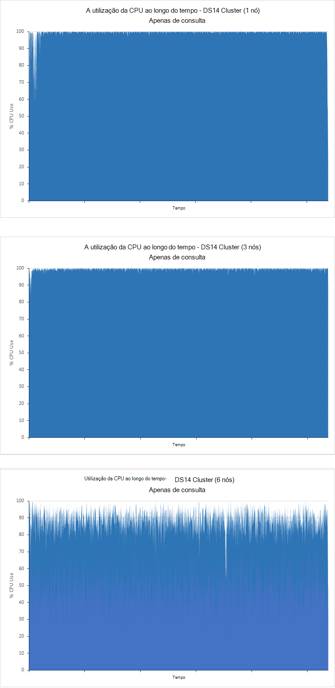

***Utilização da CPU para o 1, 3 e clusters de 6-nó efetuar o teste só de consulta***

Os clusters nó único e 3-node são CPU vinculadas, apesar da utilização da CPU é elevada no cluster 6-node existir capacidade de processamento de reserva disponível. Neste caso, outros fatores provavelmente estar a limitar o débito. Isto pode ser confirmado testando connosco 9 e 12, ao qual seriam provavelmente Mostrar ainda mais capacidade de processamento de reserva.

Os dados na tabela acima também mostram como os tempos de resposta média consultas variam. Este é o item que é mais informativo quando testar como um sistema escalas para tipos específicos de consulta. Algumas procuras são claramente extremidade mais eficientes quando que abrangem nós mais do que as outras. Isto pode ser devido a relação entre o número de nós e o número de documentos ordem crescente de cluster, cada cluster contidas 100 milhões de documentos. Quando executar pesquisas que envolvam agregar dados, o Elasticsearch processar e os dados obtidos como parte do processo de agregação na memória em cada nó de memória intermédia. Se existirem mais nós, há menos dados para obter, memória intermédia e em cada nó do processo.

## <a name="performance-results---number-of-replicas"></a>Resultados do desempenho - número de réplicas

Os testes *ingestão e para a consulta* foram executados relativamente a um índice com uma única réplica. Os testes foram repetidos em 6-node DS4 e DS14 clusters utilizando um índice remissivo configurado com duas réplicas. Todos os testes ficou 24 horas. A tabela abaixo mostra os resultados comparativos para um e dois réplicas:

| Cluster | Operação/consulta            | Tempo de resposta médio (ms) - 1 réplica | Tempo de resposta médio (ms) - 2 réplicas | % de diferença em tempo de resposta |
|---------|----------------------------|----------------------------------------|-----------------------------------------|-------------------------------|
| DS4     | Ingestão                  | 511                                    | 655                                     | + 28%                          |
|         | Contar por classificação            | 187                                    | 168                                     | -10%                          |
|         | Tempo restante de contagem            | 411                                    | 309                                     | -25%                          |
|         | Acertos por país/região            | 402                                    | 562                                     | + 40%                          |
|         | Início 15 organizações       | 307                                    | 366                                     | + 19%                          |
|         | Contar exclusivo organizações | 320                                    | 378                                     | + 18%                          |
|         | Contagem de IP exclusivo            | 841                                    | 987                                     | + 17%                          |
|         | Contagem total de acertos           | 236                                    | 236                                     | + 0%                           |
||||||
| DS14    | Ingestão                  | 511                                    | 618                                     | + 21%                          |
|         | Contar por classificação            | 201                                    | 275                                     | + 37%                          |
|         | Tempo restante de contagem            | 298                                    | 466                                     | + 56%                          |
|         | Acertos por país/região            | 363                                    | 529                                     | + 46%                          |
|         | Início 15 organizações       | 244                                    | 407                                     | + 67%                          |
|         | Contar exclusivo organizações | 283                                    | 403                                     | + 42%                          |
|         | Contagem de IP exclusivo            | 681                                    | 823                                     | + 21%                          |
|         | Contagem total de acertos           | 200                                    | 221                                     | + 11%                          |

A taxa de ingestão diminuiu como o número de réplicas aumentado. Isto deve ser esperado como Elasticsearch está a escrever mais cópias de cada documento, a gerar e/s do disco adicional.  É refletido por gráficos para o cluster DS14 para índices com 1 e 2 réplicas apresentadas na imagem abaixo. No caso de índice remissivo com 1 réplica, taxa e/s média era 16896573 bytes/segundo. Para o índice com 2 réplicas, taxa e/s média era 33986843 bytes/em segundo, apenas através de duas vezes como muitos.

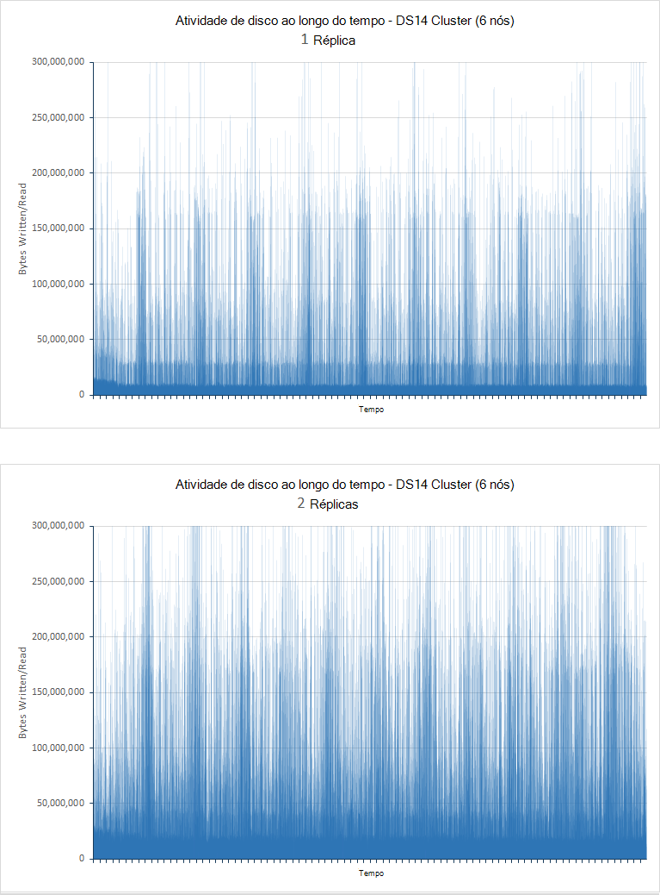

***Taxas de disco e/s para nós com 1 e 2 réplicas efetuar o teste ingestão e para a consulta***

| Cluster | Consulta                      | Tempo de resposta médio (ms) - 1 réplica | Tempo de resposta médio (ms) - 2 réplicas |
|---------|----------------------------|----------------------------------------|-----------------------------------------|
| DS4     | Contar por classificação            | 4489                                   | 4079                                    |
|         | Tempo restante de contagem            | 7292                                   | 6697                                    |
|         | Acertos por país/região            | 7564                                   | 7173                                    |
|         | Início 15 organizações       | 5066                                   | 4650                                    |
|         | Contar exclusivo organizações | 5231                                   | 4691                                    |
|         | Contagem de IP exclusivo            | 9228                                   | 8752                                    |
|         | Contagem total de acertos           | 2180                                   | 1909                                    |
|||||
| DS14    | Contar por classificação            | 1927                                   | 2330                                    |
|         | Tempo restante de contagem            | 4483                                   | 4381                                    |
|         | Acertos por país/região            | 4761                                   | 5341                                    |
|         | Início 15 organizações       | 2117                                   | 2560                                    |
|         | Contar exclusivo organizações | . o 2393                                   | 2546                                    |
|         | Contagem de IP exclusivo            | 7159                                   | 7048                                    |
|         | Contagem total de acertos           | 642                                    | 708                                     |

Estes resultados mostram uma melhoria no tempo de resposta médio para o cluster DS4, mas um aumento para o cluster DS14. Para ajudar a interpretar estes resultados, também deve ter em conta o número de consultas realizado por cada teste:

| Cluster | Consulta                      | Número executado - 1 réplica | Número executado - 2 réplicas |
|---------|----------------------------|------------------------------|-------------------------------|
| DS4     | Contar por classificação            | 1054                         | 1141                          |
|         | Tempo restante de contagem            | 1054                         | 1139                          |
|         | Acertos por país/região            | 1053                         | 1138                          |
|         | Início 15 organizações       | 1055                         | 1141                          |
|         | Contar exclusivo organizações | 1051                         | 1136                          |
|         | Contagem de IP exclusivo            | 1051                         | 1135                          |
|         | Contagem total de acertos           | 1051                         | 1136                          |
|||||
| DS14    | Contar por classificação            | 1842                         | 1718                          |
|         | Tempo restante de contagem            | 1839                         | 1716                          |
|         | Acertos por país/região            | 1838                         | 1714                          |
|         | Início 15 organizações       | 1842                         | 1718                          |
|         | Contar exclusivo organizações | 1837                         | 1712                          |
|         | Contagem de IP exclusivo            | 1837                         | 1712                          |
|         | Contagem total de acertos           | 1837                         | 1712                          |

Estes dados mostram que o número de consultas realizado por DS4 cluster aumentado em linha com a diminuição do tempo de resposta médio, mas novamente a conversar é verdadeira relativamente a DS14 cluster. Um factor significativo é que a utilização da CPU da DS4 cluster nos testes de réplica de 1 e 2-réplica desigualdade entre foi afaste. Alguns nós afixados fechar para 100% de utilização enquanto outras pessoas tinham capacidade de processamento de reserva. Melhoria no desempenho é provavelmente devido a maior capacidade de distribuir o processamento em todos os nós do cluster. A imagem seguinte mostra a variação de CPU processamento entre os VMs mais ligeiramente e mais utilizados (nós 4 e 3):

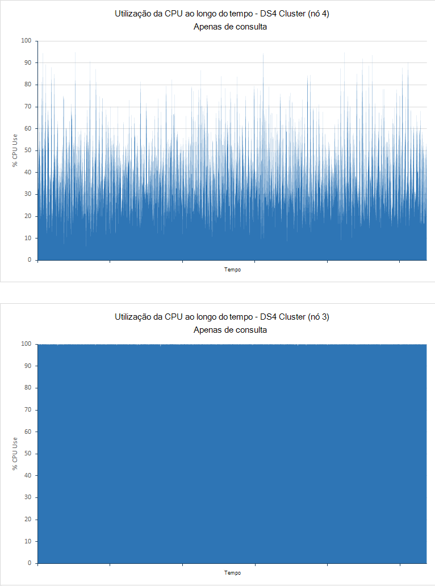

***Utilização da CPU para os nós utilizado pelo menos e mais utilizados no cluster DS4 efetuar o teste só de consulta***

Para DS14 cluster isto não era as maiúsculas/minúsculas. A utilização da CPU para ambos os testes foi inferior ao longo de todos os nós e a disponibilidade de uma segunda réplica ficou menor quantidade da vantajoso e muito mais de uma sobrecarga:

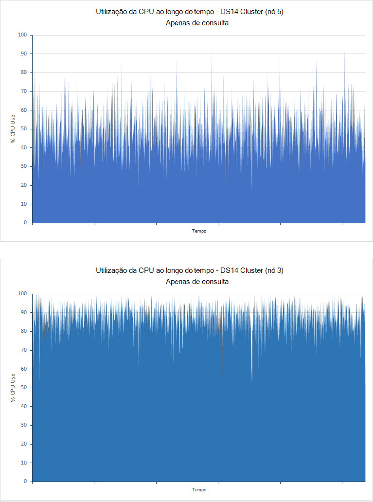

***Utilização da CPU para os nós utilizado pelo menos e mais utilizados no cluster DS14 efetuar o teste só de consulta***

Estes resultados mostram a necessidade de referência do sistema cuidadosamente quando decidir se deve utilizar várias réplicas. Sempre que deve ter pelo menos uma réplica de cada índice (a não ser está disposto a perda de dados se um nó falhar o risco), mas réplicas adicionais podem impor uma sobrecarga de sistema para pouco benefício, dependendo do seu das cargas de trabalho e os recursos de hardware disponíveis para o cluster.

## <a name="performance-results---doc-values"></a>Resultados do desempenho - valores de documento

Foram realizados testes *ingestão e para a consulta* com valores de documento ativadas, a causar Elasticsearch armazenar dados utilizados para ordenar campos no disco. Os testes foram repetidos com valores de documento desactivados, portanto Elasticsearch construídos fielddata dinamicamente e em cache-lo na memória. Todos os testes ficou 24 horas. A tabela abaixo compara os tempos de resposta para testes executados contra clusters de 6 nós construídas utilizando D4, DS4 e DS14 VMs (D4 cluster utiliza discos rígido normais, enquanto os clusters DS4 e DS14 utilizam SSDs).

| Cluster | Operação/consulta            | Tempo de resposta médio (ms) - valores de documento com permissão para | Tempo de resposta médio (ms) - valores de documento desativados | % de diferença em tempo de resposta |
|---------|----------------------------|-------------------------------------------------|--------------------------------------------------|-------------------------------|
| D4      | Ingestão                  | 978                                             | 835                                              | -15%                          |
|         | Contar por classificação            | 103                                             | 132                                              | + 28%                          |
|         | Tempo restante de contagem            | 134                                             | 189                                              | + 41%                          |
|         | Acertos por país/região            | 199                                             | 259                                              | + 30%                          |
|         | Início 15 organizações       | 137                                             | 184                                              | + 34%                          |
|         | Contar exclusivo organizações | 139                                             | 197                                              | + 42%                          |
|         | Contagem de IP exclusivo            | 510                                             | 604                                              | + 18%                          |
|         | Contagem total de acertos           | 89                                              | 134                                              | + 51%                          |
||||||
| DS4     | Ingestão                  | 511                                             | 581                                              | + 14%                          |
|         | Contar por classificação            | 187                                             | 190                                              | + 2%                           |
|         | Tempo restante de contagem            | 411                                             | 409                                              | -0,5%                         |
|         | Acertos por país/região            | 402                                             | 414                                              | + 3%                           |
|         | Início 15 organizações       | 307                                             | 284                                              | -7%                           |
|         | Contar exclusivo organizações | 320                                             | 313                                              | -% de 2                           |
|         | Contagem de IP exclusivo            | 841                                             | 955                                              | + 14%                          |
|         | Contagem total de acertos           | 236                                             | 281                                              | + 19%                          |
||||||
| DS14    | Ingestão                  | 511                                             | 571                                              | + 12%                          |
|         | Contar por classificação            | 201                                             | 232                                              | + 15%                          |
|         | Tempo restante de contagem            | 298                                             | 341                                              | + 14%                          |
|         | Acertos por país/região            | 363                                             | 457                                              | + 26%                          |
|         | Início 15 organizações       | 244                                             | 338                                              | + 39%                          |
|         | Contar exclusivo organizações | 283                                             | 350                                              | + 24%                          |
|         | Contagem de IP exclusivo            | 681                                             | 909                                              | + 33%                          |
|         | Contagem total de acertos           | 200                                             | 245                                              | + 23%                          |

A tabela seguinte compara o número de operações de ingestão realizado por testes:

| Cluster | Contagem de operação ingestão - valores de documento com permissão para | Contagem de operação ingestão - documento valores de palavras desativada | % de diferença em \number de operações de ingestão |
|---------|----------------------------------------------|-----------------------------------------------|-----------------------------------------|
| D4      | 264769                                       | 408690                                        | + 54%                                    |
| DS4     | 503137                                       | 578237                                        | + 15%                                    |
| DS14    | 502714                                       | 586472                                        | + 17%                                    |

As taxas ingestão melhorada ocorrerem com valores de documento desativados tal como está a ser escritos menos dados tal como documentos são inseridos do disco. O desempenho melhorado é especialmente evidente com a VM D4 utilizar HDDs para armazenar dados. Neste caso, o tempo de resposta para operações de ingestão também diminuída por 15% (consulte o artigo da primeira tabela nesta secção). Isto poderá ser devido a pressão reduzida sobre os HDDs que tenham sido provável executado perto seus limites IOPS durante o ensaio com documento valores ativadas, consulte o artigo o teste de tipo de disco para obter mais informações. O gráfico seguinte compara o desempenho e/s da VMs D4 com valores de documento com permissão para (valores contidos no disco) e documento valores desactivado (valores contidos em memória):


***Actividade do disco para o cluster D4 com valores de documento ativado ou desativado***

Em contrapartida, os valores de ingestão para VMs utilizando SSDs mostram um aumento pequenas o número de documentos, mas também um aumento no tempo de resposta das operações ingestão. Com um ou dois pequenas exceções, os tempos de resposta de consulta também foram piores. Os SSDs são menos provável que esteja a ser executado perto seus limites IOPS com valores de documento ativadas, para que as alterações no desempenho são mais provável devido a aumentadas atividade e o overhead da gestão de pilha de JVM de processamento. Este é evidente ao comparar a utilização da CPU com valores de documento ativado ou desativado. O gráfico seguinte realça estes dados para o cluster DS4, onde a maior parte da utilização da CPU move-se a partir da faixa de 30-40% com valores de documento ativadas, para a faixa de 40-50% com valores de documento desativado (DS14 cluster mostrava uma tendência semelhante):


***A utilização da CPU para o cluster DS4 com valores de documento ativado ou desativado***

Para distinguir os efeitos de valores de documento no desempenho de consulta da ingestão de dados, os pares de testes só de consulta foram efetuadas para os clusters DS4 e DS14 com valores de documento ativado ou desativado. A tabela abaixo resume os resultados dos seguintes testes:

| Cluster | Operação/consulta            | Tempo de resposta médio (ms) - valores de documento com permissão para | Tempo de resposta médio (ms) - valores de documento desativados | % de diferença em tempo de resposta |
|---------|----------------------------|-------------------------------------------------|--------------------------------------------------|-------------------------------|
| DS4     | Contar por classificação            | 4489                                            | 3736                                             | -16%                          |
|         | Tempo restante de contagem            | 7293                                            | 5459                                             | -25%                          |
|         | Acertos por país/região            | 7564                                            | 5930                                             | -% de 22                          |
|         | Início 15 organizações       | 5066                                            | 3874                                             | -14%                          |
|         | Contar exclusivo organizações | 5231                                            | 4483                                             | -% de 2                           |
|         | Contagem de IP exclusivo            | 9228                                            | 9474                                             | + 3%                           |
|         | Contagem total de acertos           | 2180                                            | 1218                                             | -44%                          |
||||||
| DS14    | Contar por classificação            | 1927                                            | 2144                                             | + 11%                          |
|         | Tempo restante de contagem            | 4483                                            | 4337                                             | -3%                           |
|         | Acertos por país/região            | 4761                                            | 4840                                             | + 2%                           |
|         | Início 15 organizações       | 2117                                            | 2302                                             | + 9%                           |
|         | Contar exclusivo organizações | . o 2393                                            | 2497                                             | + 4%                           |
|         | Contagem de IP exclusivo            | 7159                                            | 7639                                             | + 7%                           |
|         | Contagem total de acertos           | 642                                             | 633                                              | -% de 1                           |

Lembre-se de que, com diante Elasticsearch 2.0, os valores de documento estão activadas por predefinição. Os testes abrangendo DS4 cluster, desativar os valores do documento é apresentada para têm um efeito positivo geral, Considerando que a conversar é geralmente verdadeiro para o cluster de DS14 (os dois casos onde o desempenho está melhor com valores de documento desativados são muito marginais).

Para DS4 cluster, a utilização da CPU em ambos os casos foi fechar para 100% para a duração de ambos os testes que indica que o cluster foi CPU vinculada. No entanto, o número de consultas processadas diminuiu de 7369 para 5894 (20%). Lembre-se de que se os valores de documento estão desativados Elasticsearch dinamicamente irá gerar fielddata na memória e este consome CPU power. Esta configuração tem reduzido a taxa de disco e/s mas limite um aumento no CPUs já executado perto suas capacidades máximas, por isso, neste caso as consultas são mais rápidas com valores de documento desativados, mas existem menos-las.

Em testes DS14 com e sem valores de documento CPU atividade era alta, mas não a 100%. O número de consultas executado foi ligeiramente acima (aproximadamente % de 4) no testes com valores de documento com permissão para:

| Cluster | Consulta                      | Número executado - valores de documento com permissão para | Número executado - documento valores de palavras desativada |
|---------|----------------------------|---------------------------------------|----------------------------------------|
| DS4     | Contar por classificação            | 1054                                  | 845                                    |
|         | Tempo restante de contagem            | 1054                                  | 844                                    |
|         | Acertos por país/região            | 1053                                  | 842                                    |
|         | Início 15 organizações       | 1055                                  | 846                                    |
|         | Contar exclusivo organizações | 1051                                  | 839                                    |
|         | Contagem de IP exclusivo            | 1051                                  | 839                                    |
|         | Contagem total de acertos           | 1051                                  | 839  
|||||                                  |
| DS14    | Contar por classificação            | 1772                                  | 1842                                   |
|         | Tempo restante de contagem            | 1772                                  | 1839                                   |
|         | Acertos por país/região            | 1770                                  | 1838                                   |
|         | Início 15 organizações       | 1773                                  | 1842                                   |
|         | Contar exclusivo organizações | 1769                                  | 1837                                   |
|         | Contagem de IP exclusivo            | 1768                                  | 1837                                   |
|         | Contagem total de acertos           | 1769                                  | 1837                                   |

## <a name="performance-results---shard-request-cache"></a>Resultados do desempenho - cache de pedido de shard

Para demonstrar como os dados do índice colocação em cache na memória de cada nó podem afetar o desempenho, o teste de *consulta e ingestão* foi realizado num DS4 e um cluster de 6-node DS14 com índice colocação em cache ativado - consulte a secção [utilizar a cache de pedido de shard](#using-the-shard-request-cache) para obter mais informações. Os resultados foram comparados com daqueles gerados pelos testes anteriores utilizando o índice mesmo mas com índice colocação em cache desativado. A tabela abaixo resume os resultados. Tenha em atenção que os dados tem sido reduzidos para cobrir apenas os primeiros 90 minutos do teste, neste momento a tendência comparativa foi evidente e continuar o teste seria provavelmente não originou quaisquer informações adicionais:

| Cluster | Operação/consulta            | Tempo de resposta médio (ms) - cache de índice remissivo desativado | Tempo de resposta médio (ms) - na cache de índice remissivo activada | % de diferença em tempo de resposta |
|---------|----------------------------|---------------------------------------------------|--------------------------------------------------|-------------------------------|
| DS4     | Ingestão                  | 504                                               | 3260                                             | + 547%                         |
|         | Contar por classificação            | 218                                               | 273                                              | + 25%                          |
|         | Tempo restante de contagem            | 450                                               | 314                                              | -30%                          |
|         | Acertos por país/região            | 447                                               | 397                                              | -11%                          |
|         | Início 15 organizações       | 342                                               | 317                                              | -7%                           |
|         | Contar exclusivo organizações | 370                                               | 324                                              | -12%                         |
|         | Contagem de IP exclusivo            | 760                                               | 355                                              | -53%                          |
|         | Contagem total de acertos           | 258                                               | 291                                              | + 12%                          |
||||||
| DS14    | Ingestão                  | 503                                               | 3365                                             | + 569%                         |
|         | Contar por classificação            | 234                                               | 262                                              | + 12%                          |
|         | Tempo restante de contagem            | 357                                               | 298                                              | -17%                          |
|         | Acertos por país/região            | 416                                               | 383                                              | -8%                           |
|         | Início 15 organizações       | 272                                               | 324                                              | -7%                           |
|         | Contar exclusivo organizações | 330                                               | 321                                              | -3%                           |
|         | Contagem de IP exclusivo            | 674                                               | 352                                              | -48%                          |
|         | Contagem total de acertos           | 227                                               | 292                                              | + 29%                          |

Estes dados mostram dois pontos de interesse:

-  Taxas de ingestão dados parecem ser bastante reduzidos ao ativar colocação em cache de índice remissivo.

-  Índice remissivo colocação em cache não seja necessariamente a melhorar o tempo de resposta de todos os tipos de consulta e pode ter um efeito adverso na determinadas operações de agregação como aqueles realizado pelas consultas contar por classificação e a Contagem Total de acertos.
 

Para compreender por que motivo o sistema com este comportamento, deverá tomar em consideração o número de consultas efetuada com êxito em cada caso durante o ensaio. A tabela seguinte resume estes dados:

| Cluster | Operação/consulta            | Contagem de operações/consultas - cache de índice remissivo desativado | Contagem de operações/consultas - na cache de índice remissivo activada |
|---------|----------------------------|-------------------------------------------------|------------------------------------------------|
| DS4     | Ingestão                  | 38611                                           | 13232                                          |
|         | Contar por classificação            | 524                                             | 18704                                          |
|         | Tempo restante de contagem            | 523                                             | 18703                                          |
|         | Acertos por país/região            | 522                                             | 18702                                          |
|         | Início 15 organizações       | 521                                             | 18706                                          |
|         | Contar exclusivo organizações | 521                                             | 18700                                          |
|         | Contagem de IP exclusivo            | 521                                             | 18699                                          |
|         | Contagem total de acertos           | 521                                             | 18701                                          |
||||                                        |
| DS14    | Ingestão                  | 38769                                           | 12835                                          |
|         | Contar por classificação            | 528                                             | 19239                                          |
|         | Tempo restante de contagem            | 528                                             | 19239                                          |
|         | Acertos por país/região            | 528                                             | 19238                                          |
|         | Início 15 organizações       | 527                                             | 19240                                          |
|         | Contar exclusivo organizações | 524                                             | 19234                                          |
|         | Contagem de IP exclusivo            | 524                                             | 19234                                          |
|         | Contagem total de acertos           | 527                                             | 19236                                          |

Pode ver que apesar da taxa de ingestão quando colocação em cache foi ativada estava aproximadamente 1/3 do que quando colocação em cache foi desactivada, o número de consultas executado aumentado por um fator de 34. Consultas já não implicam quanto disco e/s e não tinha que competir para recursos de disco. Isto é refletido por gráficos na figura abaixo que comparam a atividade e/s para todos os quatro casos:

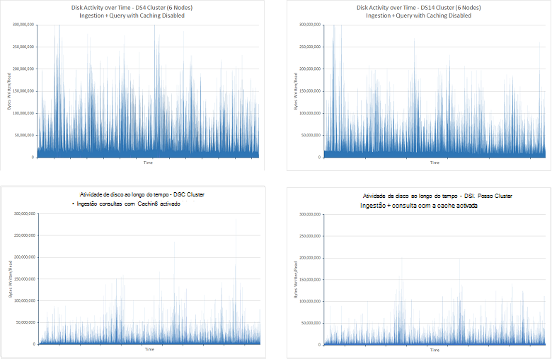

***Atividade de disco e/s para o teste ingestão e para a consulta com índice colocação em cache desativado e activado***

Diminuir no disco e/s destina também que a CPU gasto menos tempo a aguardar e/s concluir. Isto é realçado na figura seguinte:

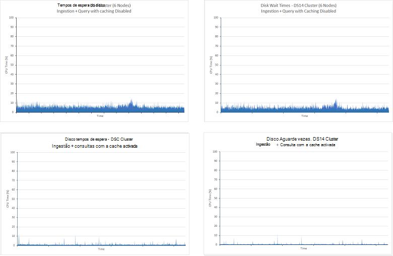

***CPU tempo gasto em espera para disco e/s concluir para que o teste ingestão e para a consulta com índice colocação em cache desativado e ativadas***

A redução no disco que e/s destinar que Elasticsearch poderia despenderam uma proporção muito maior do seu tempo a servir consultas a partir de dados contidos em memória. Isto aumentado a utilização da CPU, que se torne evidente se observe a utilização da CPU para todos os quatro casos. Os gráficos da abaixo mostram como a utilização da CPU mais foi sofrida com a cache activada:

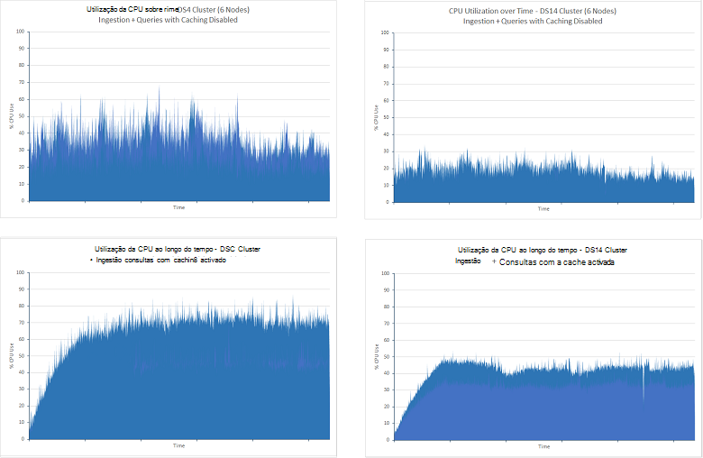

***Teste a utilização da CPU do ingestão e consulta com índice colocação em cache desativado e activado***

O volume de rede e/s em ambos os cenários para a duração dos testes foi ficarem semelhante. Os testes sem colocação em cache mostrava uma degradação gradual durante o período de teste, mas mais longa, 24 horas é executado destes testes mostrava que esta estatística regular na aproximadamente 2.75GBps. A imagem abaixo mostra estes dados para os clusters DS4 (os dados para os clusters DS14 eram muito semelhantes):

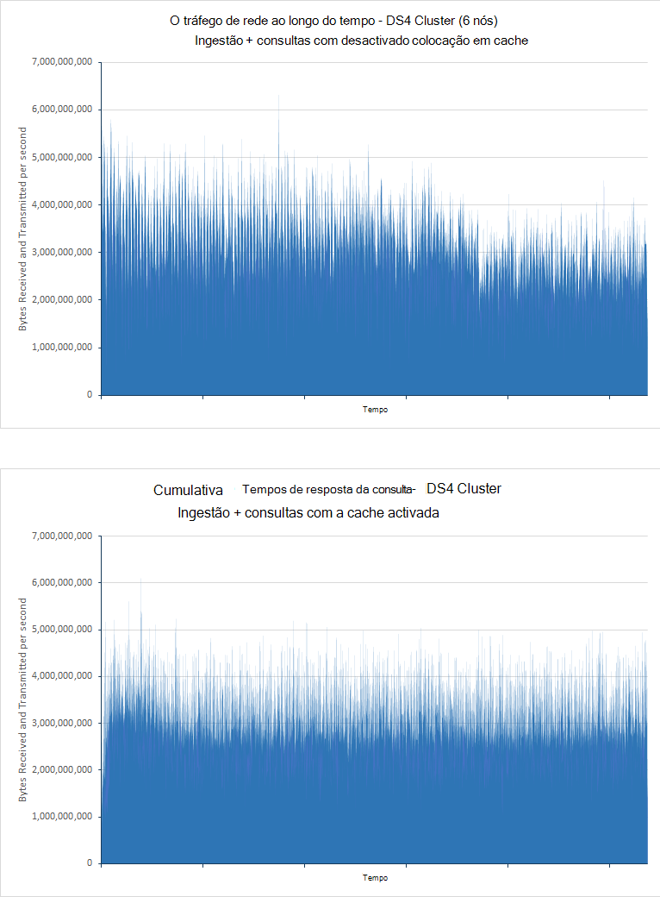

***Volumes de tráfego de rede para o teste ingestão e para a consulta com índice colocação em cache desativado e activado***

Conforme descrito no teste [escalar para cima](#performance-results-scaling-up) , as restrições de largura de banda com Azure VMs de rede não são publicadas em podem variar, mas os níveis de moderado da atividade de disco e CPU sugere que a utilização da rede pode ser o factor de limitação neste cenário.

Colocação em cache é naturalmente mais adequada para os cenários onde as alterações dos dados com pouca frequência. Para realçar o impacto da colocação em cache neste cenário, a *consulta só* testes foram efectuados com a cache activada. Os resultados são apresentados abaixo (executou estes testes de minuto 90 e os índices em teste contidas 100 milhões de documentos):

| Cluster | Consulta                      | Tempo de resposta médio (ms) | Número de consultas executado |
|---------|----------------------------|----------------------------|-------------------------|
|         |                            | **Cache desativado**         | **Na cache activada**       |
| DS4     | Contar por classificação            | 4489                       | 210                     |
|         | Tempo restante de contagem            | 7292                       | 211                     |
|         | Acertos por país/região            | 7564                       | 231                     |
|         | Início 15 organizações       | 5066                       | 211                     |
|         | Contar exclusivo organizações | 5231                       | 211                     |
|         | Contagem de IP exclusivo            | 9228                       | 218                     |
|         | Contagem total de acertos           | 2180                       | 210                     |
|         |                            |                            |                         |
| DS14    | Contar por classificação            | 1927                       | 211                     |
|         | Tempo restante de contagem            | 4483                       | 219                     |
|         | Acertos por país/região            | 4761                       | 236                     |
|         | Início 15 organizações       | 2117                       | 212                     |
|         | Contar exclusivo organizações | . o 2393                       | 212                     |
|         | Contagem de IP exclusivo            | 7159                       | 220                     |
|         | Contagem total de acertos           | 642                        | 211                     |

A variância o desempenho dos testes mapeados é devido a diferença de recursos disponíveis entre a DS4 e DS14 VMs. Em ambos os casos do teste em cache a hora de resposta médio largada significativamente como dados foi a ser copiada diretamente a partir de memória. É também notar que os tempos de resposta para o DS4 em cache e testes de cluster DS14 foram muito semelhantes apesar disparidade com os resultados mapeados. Também existe muito pouca diferença entre os tempos de resposta para cada consulta dentro de cada teste, todos eles tomarem aproximadamente 220ms. As taxas de disco e/s e a utilização da CPU para ambas as clusters foram muito baixos como uma vez por todos os dados estiverem na memória pequeno e/s ou processamento é necessário. A taxa de rede e/s foi semelhante ao que dos testes colocados em cache, confirmar a que esse largura de banda de rede pode ser um fator limitação neste teste. Os gráficos seguintes apresentam estas informações para o cluster DS4. O perfil do DS14 cluster foi muito semelhante:

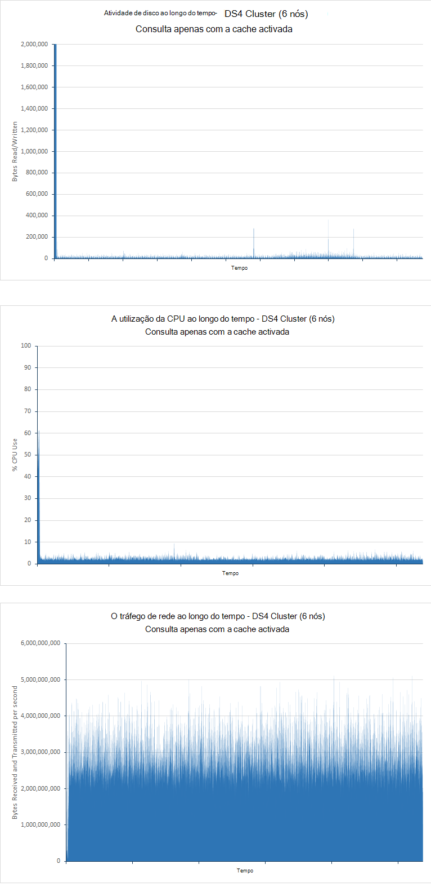

***Disco e/s, a utilização da CPU e utilização da rede para o teste só de consulta com a cache de índice remissivo activada***

Os números na tabela acima sugerem que utilizando a arquitetura de DS14 mostra pouco benefício ao longo do utilizando o DS4. Na verdade, o número de amostras gerado pelo DS14 cluster foi cerca de 5% abaixo que o cluster DS4, mas isto também pode ser devido a restrições de rede que podem variar ligeiramente ao longo do tempo.

## <a name="performance-results---number-of-shards"></a>Resultados do desempenho - número de shards

O objetivo deste teste foi determinar se o número de shards criada para um índice remissivo tem qualquer tendo sobre o desempenho da consulta desse índice.

Em separado ensaios mostrava anteriormente que a configuração de shard de um índice remissivo pode afetar a taxa de ingestão de dados. Os ensaios realizados para determinar o desempenho da consulta seguidas uma metodologia semelhante, mas que tenham sido restringido a um cluster de 6-node em execução no DS14 hardware. Esta abordagem ajuda para minimizar o número de variáveis, por isso quaisquer diferenças no desempenho devem ser devido ao volume de shards.

A *consulta só* foi ensaio no cópias do mesmo índice configurados com 7, 13, 23, 37 e 61 shards principais. O índice contido 100 milhões de documentos e tinha uma única réplica, duplicar o número de shards ao longo do cluster. Cada teste ficou para 90 minutos. A tabela seguinte resume os resultados. A hora de resposta médio mostrada é o tempo de resposta para a transação de teste de JMeter que engloba o conjunto completo de consultas realizado por cada iteração o teste. Ver a nota na secção [resultados de desempenho - escalar para cima](#performance-results-scaling-up) , para obter mais informações:

| Número de shards          | Esquema de shard (shards por nó, incluindo réplicas) | Número de consultas executado | Tempo de resposta AVG (ms) |
|---------------------------|----------------------------------------------------|-----------------------------|------------------------|
| 7 (14 incluindo réplicas) | 3-2-2-2-2-3                                        | 7461                        | 40524                  |
| 13 (26)                   | 5-4-5-4-4-4                                        | 7369                        | 41055                  |
| 23 (46)                   | 7-8-8-7-8-8                                        | 14193                       | 21283                  |
| 37 (74)                   | 13-12-12-13-12-12                                  | 13399                       | 22506                  |
| 61 (122)                  | 20-21-20-20-21-20                                  | 14743                       | 20445                  |

Estes resultados indicam que existe uma diferença significativa no desempenho entre o cluster de shard 13(26) e 23,(46) shard cluster, débito quase é duplicado e tempos de resposta com metade. Isto é provavelmente devido a configuração dos VMs e as estruturas de que utiliza o Elasticsearch para processar pedidos de pesquisa. Pedidos de pesquisa são colocadas na fila e cada pedido de pesquisa é processado por um módulo de pesquisa único. O número de pesquisa threads criados por um nó Elasticsearch é uma função do número de processadores disponíveis no computador que aloja o nó. Os resultados sugerem que com shards num nó apenas 4 ou 5, recursos de processamento não são a ser totalmente utilizados. Isto é suportado verificando a utilização da CPU ao executar este teste. A imagem seguinte é um instantâneo tirado de Marvel enquanto executa o teste de shard 13(26):

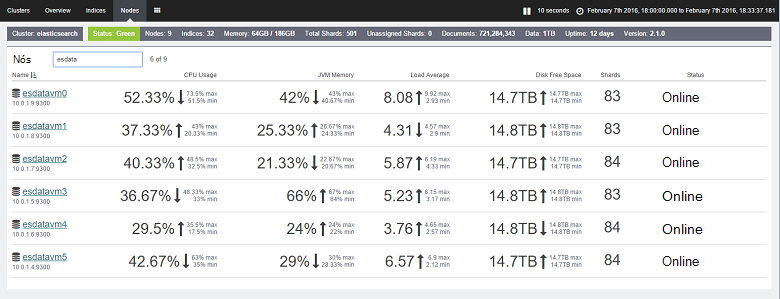

***Utilização da CPU para o teste só de consulta no 7(14) shard cluster***

Compare estes valores com as o teste de shard 23(46):

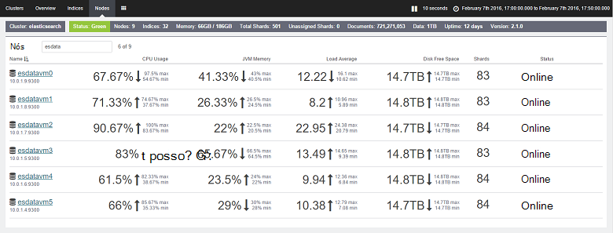

***Utilização da CPU para o teste só de consulta no 23(46) shard cluster***

Teste de shard 23(46), a utilização da CPU foi extremidade superior. Cada nó contém shards 7 ou 8. A arquitetura de DS14 fornece 16 processadores e Elasticsearch é melhor explorar este número de núcleos com os shards adicionais. Os números na tabela acima sugerem que aumenta o número de shards para além deste ponto pode melhorar o desempenho ligeiramente, mas deve compensar estes valores contra as capacidades de manutenção de um grande volume de shards adicionais. Estes testes significam que o número ideal de shards por nó é metade do número de núcleos de processador disponíveis em cada nó. No entanto, lembre-se de que estes resultados foram atingidos quando a ser executado apenas consultas. Se importar o seu sistema de dados, também deve considerar como sharding pode afetar o desempenho ingestão de operações de dados. 

## <a name="summary"></a>Resumo

Elasticsearch fornece muitas opções que pode utilizar para estruturar índices e Otimize-los suporta operações de consulta em grande escala. Este documento tem resumidos alguns comuns configurações e técnicas que pode utilizar para a base de dados para fins de consulta o gráfico. No entanto, deve reconhecer existe um compromisso entre otimizar uma base de dados para suportar obtenção rápida por oposição a ingestão de dados de grande volume de suporte. Por vezes, o que é boa para consultar pode ter um impacto prejudicial sobre as operações de inserir e vice versa. Num sistema que é apresentado quando se clica mistas das cargas de trabalho, tem de avaliar onde reside o saldo e ajustar os parâmetros do sistema em conformidade.

Para além disso, a aplicação de configurações diferentes e técnicas pode variar consoante a estrutura dos dados e as limitações (ou não) do hardware o sistema é construído em. Muitos dos testes mostrados neste documento ilustram como a seleção da plataforma de hardware pode afetar o débito, bem como algumas estratégias podem ser úteis em certos casos, mas prejudicial no outras pessoas. O ponto importante é compreender as opções disponíveis e, em seguida, executar direccionamento de caminhos estritas utilizando os seus próprios dados para determinar a combinação mais ideal.

Por fim, lembre-se de que uma base de dados Elasticsearch não é necessariamente um item estático. Crescimento provavelmente ao longo do tempo e as estratégias utilizadas para estruturar os dados poderão ter de ser revista regularmente. Por exemplo,-poderá ser necessário para dimensionar para cima, dimensionar saída ou reindexar dados com shards adicionais. À medida que aumenta o sistema em tamanho e complexidade, estar preparado para testar automática e continuamente o desempenho para se certificar de que são de reunião ainda qualquer SLA garantida aos seus clientes.

## <a name="appendix-the-query-and-aggregation-performance-test"></a>Anexo: a consulta e de agregação teste de desempenho

Este anexo descreve o teste de desempenho executado contra Elasticsearch cluster. Os testes foram executar utilizando JMeter em execução num conjunto diferente de VMs. Detalhes da configuração do ambiente de teste são descritos na [criação de um ambiente para Elasticsearch no Azure de teste de desempenho](guidance-elasticsearch-creating-performance-testing-environment.md). Para testar a sua própria, pode criar o seu próprio plano de teste JMeter manualmente seguindo as orientações no presente anexo ou pode utilizar os scripts de teste automatizada disponíveis em separado. Para mais informações, consulte o artigo [executar os testes de desempenho Elasticsearch automatizados](guidance-elasticsearch-running-automated-performance-tests.md).

A carga de trabalho de consulta de dados executado o conjunto de consultas descrito abaixo enquanto executa um carregamento em grande escala dos documentos ao mesmo tempo. O objetivo deste carga de trabalho foi simular num ambiente de produção onde novos dados está constantemente a ser adicionados enquanto pesquisas são executadas. As consultas foram estruturadas para recuperar apenas os dados mais recentes dos documentos adicionados nos últimos 15 minutos.

Cada documento foi armazenado num único índice com o nome *idx*e tivesse o tipo de *documento*. Pode utilizar o pedido de HTTP seguinte para criar o índice. As definições de *number_of_replicas* e *number_of_shards* variaram dos valores mostrados abaixo em muitos dos testes. Para além disso, para os testes que utilizados fielddata em vez de valores de documento, cada propriedade foi anotados com o atributo *"doc_values": Falso*.

**Importante**: O índice foi interrompido e recriado antes de cada teste em execução. 

``` http
PUT /idx
{  
    "settings" : {
        "number_of_replicas": 1,
        "refresh_interval": "30s",
        "number_of_shards": "5",
        "index.translog.durability": "async"    
    },
    "doc": {
        "mappings": {
            "event": {
                "_all": {
                    "enabled": false
                },
                "_timestamp": {
                    "enabled": true,
                    "store": true,
                    "format": "date_time"
                },
                "properties": {
                    "Organization": {
                        "type": "string",
                        "index": "not_analyzed"
                    },
                    "CustomField1": {
                        "type": "string",
                        "index": "not_analyzed"
                    },
                    "CustomField2": {
                        "type": "string",
                        "index": "not_analyzed"
                    },
                    "CustomField3": {
                        "type": "string",
                        "index": "not_analyzed"
                    },
                    "CustomField4": {
                        "type": "string",
                        "index": "not_analyzed"
                    },
                    "CustomField5": {
                        "type": "string",
                        "index": "not_analyzed"
                    },
                    "DateTimeReceivedUtc": {
                        "type": "date",
                        "format": "dateOptionalTime"
                    },
                    "Host": {
                        "type": "string",
                        "index": "not_analyzed"
                    },
                    "HttpMethod": {
                        "type": "string",
                        "index": "not_analyzed"
                    },
                    "HttpReferrer": {
                        "type": "string",
                        "index": "not_analyzed"
                    },
                    "HttpRequest": {
                        "type": "string",
                        "index": "not_analyzed"
                    },
                    "HttpUserAgent": {
                        "type": "string",
                        "index": "not_analyzed"
                    },
                    "HttpVersion": {
                        "type": "string",
                        "index": "not_analyzed"
                    },
                    "OrganizationName": {
                        "type": "string",
                        "index": "not_analyzed"
                    },
                    "SourceIp": {
                        "type": "ip"
                    },
                    "SourceIpAreaCode": {
                        "type": "long"
                    },
                    "SourceIpAsnNr": {
                        "type": "string",
                        "index": "not_analyzed"
                    },
                    "SourceIpBase10": {
                        "type": "long"
                    },
                    "SourceIpCity": {
                        "type": "string",
                        "index": "not_analyzed"
                    },
                    "SourceIpCountryCode": {
                        "type": "string",
                        "index": "not_analyzed"
                    },
                    "SourceIpLatitude": {
                        "type": "double"
                    },
                    "SourceIpLongitude": {
                        "type": "double"
                    },
                    "SourceIpMetroCode": {
                        "type": "long"
                    },
                    "SourceIpPostalCode": {
                        "type": "string",
                        "index": "not_analyzed"
                    },
                    "SourceIpRegion": {
                        "type": "string",
                        "index": "not_analyzed"
                    },
                    "SourceLatLong": {
                        "type": "geo_point",
                        "doc_values": true,
                        "lat_lon": true,
                        "geohash": true
                    },
                    "SourcePort": {
                        "type": "string",
                        "index": "not_analyzed"
                    },
                    "SourcedFrom": {
                        "type": "string",
                        "index": "not_analyzed"
                    },
                    "TargetIp": {
                        "type": "ip"
                    },
                    "TargetPort": {
                        "type": "string",
                        "index": "not_analyzed"
                    },
                    "Rating": {
                        "type": "string",
                        "index": "not_analyzed"
                    },
                    "UseHumanReadableDateTimes": {
                        "type": "boolean"
                    }
                }
            }
        }
    }
}
```

Consultas que se seguem foram efetuadas pelo teste:
* Quantos documentos com cada valor de classificação foram introduzidos nos últimos 15 minutos?

  ```http
  GET /idx/doc/_search
  {
    "query": {
      "bool": {
        "must": [
          {
            "range": {
              "DateTimeReceivedUtc": {
                "gte": "now-15m",
                "lte": "now"
              }
            }
          }
        ],
        "must_not": [],
        "should": []
      }
    },
    "from": 0,
    "size": 0,
    "aggs": {
      "2": {
        "terms": {
          "field": "Rating",
          "size": 5,
          "order": {
            "_count": "desc"
          }
        }
      }
    }
  }
  ```

* Quantos documentos foram adicionados em cada intervalo de 5 minutos durante os últimos 15 minutos?

  ```http
  GET /idx/doc/_search
  {
    "query": {
      "bool": {
        "must": [
          {
            "range": {
              "DateTimeReceivedUtc": {
                "gte": "now-15m",
                "lte": "now"
              }
            }
          }
        ],
        "must_not": [],
        "should": []
      }
    },
    "from": 0,
    "size": 0,
    "sort": [],
    "aggs": {
      "2": {
        "date_histogram": {
          "field": "DateTimeReceivedUtc",
          "interval": "5m",
          "time_zone": "America/Los_Angeles",
          "min_doc_count": 1,
          "extended_bounds": {
            "min": "now-15m",
            "max": "now"
          }
        }
      }
    }
  }
  ```

* Foram adicionados quantos documentos de cada valor de classificação de cada país nos últimos 15 minutos?

  ```HTTP
  GET /idx/doc/_search
  {
    "query": {
      "filtered": {
        "query": {
          "query_string": {
            "query": "*",
            "analyze_wildcard": true
          }
        },
        "filter": {
          "bool": {
            "must": [
              {
                "query": {
                  "query_string": {
                    "query": "*",
                    "analyze_wildcard": true
                  }
                }
              },
              {
                "range": {
                  "DateTimeReceivedUtc": {
                    "gte": "now-15m",
                    "lte": "now"
                  }
                }
              }
            ],
            "must_not": []
          }
        }
      }
    },
    "size": 0,
    "aggs": {
      "2": {
        "terms": {
          "field": "Rating",
          "size": 5,
          "order": {
            "_count": "desc"
          }
        },
        "aggs": {
          "3": {
            "terms": {
              "field": "SourceIpCountryCode",
              "size": 15,
              "order": {
                "_count": "desc"
              }
            }
          }
        }
      }
    }
  }
  ```

* As 15 organizações com mais frequência ocorrem nos documentos adicionados nos últimos 15 minutos?

  ```http
  GET /idx/doc/_search
  {
    "query": {
      "filtered": {
        "query": {
          "query_string": {
            "query": "*",
            "analyze_wildcard": true
          }
        },
        "filter": {
          "bool": {
            "must": [
              {
                "query": {
                  "query_string": {
                    "query": "*",
                    "analyze_wildcard": true
                  }
                }
              },
              {
                "range": {
                  "DateTimeReceivedUtc": {
                    "gte": "now-15m",
                    "lte": "now"
                  }
                }
              }
            ],
            "must_not": []
          }
        }
      }
    },
    "size": 0,
    "aggs": {
      "2": {
        "terms": {
          "field": "Organization",
          "size": 15,
          "order": {
            "_count": "desc"
          }
        }
      }
    }
  }
  ```

* Quantos diferentes organizações ocorrerem em documentos que foram adicionados nos últimos 15 minutos?

  ```http
  GET /idx/doc/_search
  {
    "query": {
      "filtered": {
        "query": {
          "query_string": {
            "query": "*",
            "analyze_wildcard": true
          }
        },
        "filter": {
          "bool": {
            "must": [
              {
                "query": {
                  "query_string": {
                    "query": "*",
                    "analyze_wildcard": true
                  }
                }
              },
              {
                "range": {
                  "DateTimeReceivedUtc": {
                    "gte": "now-15m",
                    "lte": "now"
                  }
                }
              }
            ],
            "must_not": []
          }
        }
      }
    },
    "size": 0,
    "aggs": {
      "2": {
        "cardinality": {
          "field": "Organization"
        }
      }
    }
  }
  ```

* Quantos documentos foram adicionados nos últimos 15 minutos?

  ```http
  GET /idx/doc/_search
  {
    "query": {
      "filtered": {
        "query": {
          "query_string": {
            "query": "*",
            "analyze_wildcard": true
          }
        },
        "filter": {
          "bool": {
            "must": [
              {
                "query": {
                  "query_string": {
                    "analyze_wildcard": true,
                    "query": "*"
                  }
                }
              },
              {
                "range": {
                  "DateTimeReceivedUtc": {
                    "gte": "now-15m",
                    "lte": "now"
                  }
                }
              }
            ],
            "must_not": []
          }
        }
      }
    },
    "size": 0,
    "aggs": {}
  }
  ```

* Quantos diferentes valores SourceIp ocorrerem em documentos que foram adicionados nos últimos 15 minutos?

  ```http
  GET /idx/doc/_search
  {
    "query": {
      "filtered": {
        "query": {
          "query_string": {
            "query": "*",
            "analyze_wildcard": true
          }
        },
        "filter": {
          "bool": {
            "must": [
              {
                "query": {
                  "query_string": {
                    "query": "*",
                    "analyze_wildcard": true
                  }
                }
              },
              {
                "range": {
                  "DateTimeReceivedUtc": {
                    "gte": "now-15m",
                    "lte": "now"
                  }
                }
              }
            ],
            "must_not": []
          }
        }
      }
    },
    "size": 0,
    "aggs": {
      "2": {
        "cardinality": {
          "field": "SourceIp"
        }
      }
    }
  }
  ```
