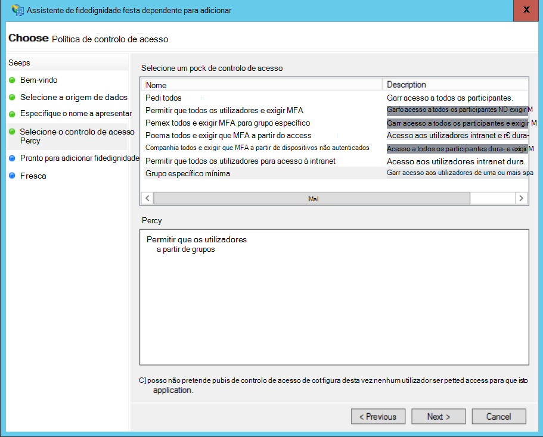
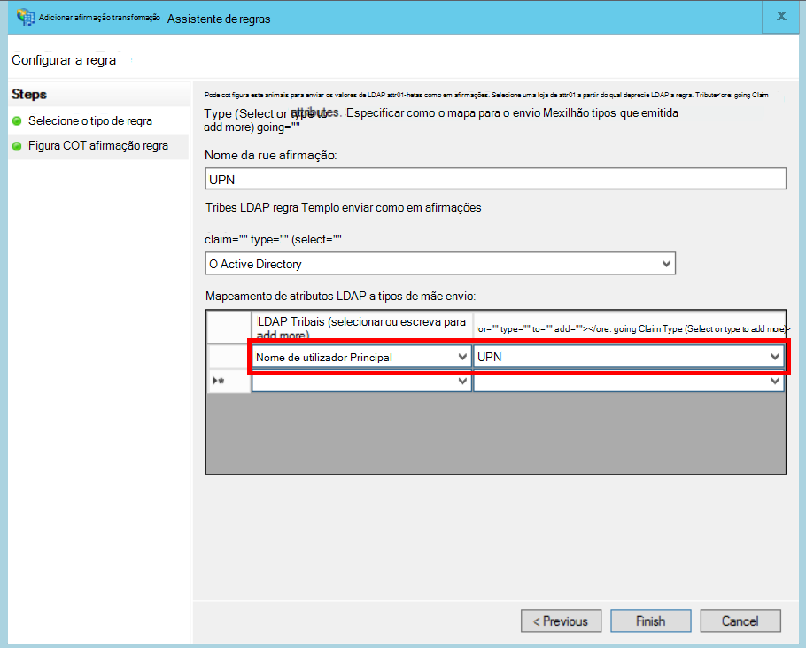

<properties
   pageTitle="Federar com AD FS um cliente | Microsoft Azure"
   description="Como para federate com um cliente estiverem AD FS numa aplicação multi-inquilino"
   services=""
   documentationCenter="na"
   authors="JohnPWSharp"
   manager="roshar"
   editor=""
   tags=""/>

<tags
   ms.service="guidance"
   ms.devlang="dotnet"
   ms.topic="article"
   ms.tgt_pltfrm="na"
   ms.workload="na"
   ms.date="06/02/2016"
   ms.author="v-josha"/>

# <a name="federating-with-a-customers-ad-fs-for-multitenant-apps-in-azure"></a>Federar com AD FS um cliente para as aplicações multi-inquilino no Azure

[AZURE.INCLUDE [pnp-header](../../includes/guidance-pnp-header-include.md)]

Este artigo faz [parte de uma série]. Também existe uma [aplicação de exemplo] concluída que acompanha nesta série.

Este artigo descreve como uma aplicação do inquilino com várias SaaS pode suportar a autenticação através de serviços de Federação do Active Directory (AD FS), para poder federar com AD FS um cliente.

## <a name="overview"></a>Descrição geral

Azure Active Directory (Azure AD) torna mais fácil para os utilizadores a partir do Azure AD inquilinos, incluindo os clientes do Office 365 e Dynamics CRM Online de início de sessão. Mas e quanto clientes que utilizam no local do Active Directory numa intranet da empresa?

Uma das opções é para esses clientes sincronizar os respetivos AD no local com o Azure AD, utilizando a [ligação do Azure AD]. No entanto, alguns clientes podem não ser possível ao utilizar esta abordagem, devido a política IT da empresa ou outras razões. Nesse caso, outra opção é federar através dos serviços de Federação do Active Directory (AD FS).

Para ativar este cenário:

-   O cliente tem de ter um farm de acesso à Internet AD FS.
-   O fornecedor de SaaS implementa os seus próprios farm do AD FS.
-   O cliente e o fornecedor de SaaS tem de configurar [fidedignidade de Federação]. Este é um processo manual.

Existem três funções principais na relação de confiança:

-   AD FS o cliente é o [parceiro de conta], responsável pela autenticação de utilizadores a partir do cliente do AD e a criação de tokens de segurança com afirmações de utilizador.
-   AD FS o fornecedor de SaaS é o [parceiro de recursos], que confia o parceiro de conta e recebe as afirmações de utilizador.
-   A aplicação está configurada como uma parte dependente (RP) no AD FS do fornecedor SaaS.

    

> [AZURE.NOTE] Neste artigo, iremos partem do pressuposto as utilizações de aplicação OpenID ligar como protocolo de autenticação. Outra opção é utilizar WS Federação.

> Para ligar a OpenID, o fornecedor de SaaS tem de utilizar o AD FS 4.0 em execução no Windows Server 2016, que se encontra atualmente na pré-visualização técnica. O AD FS 3.0 não suporta OpenID ligar.

> ASP.NET Core 1.0 não inclui out of box suporte para Federação de WS.

Para obter um exemplo de utilização de Federação WS com ASP.NET 4, consulte o artigo da [amostra ativo-diretório-dotnet-do-wsfederation][active-directory-dotnet-webapp-wsfederation].

## <a name="authentication-flow"></a>Fluxo de autenticação

1.  Quando o utilizador clica "início de sessão", a aplicação redireciona para um ponto final OpenID ligar no AD FS do fornecedor SaaS.
2.  O utilizador introduz o nome de utilizador organizacional dele ("`alice@corp.contoso.com`"). AD FS utiliza deteção realm casa para redirecionar para do AD FS o cliente, onde o utilizador introduz as respetivas credenciais.
3.  AD FS o cliente envia afirmações de utilizador para do AD FS o fornecedor de SaaS, utilizar WF Federação (ou SAML).
4.  Fluxo de afirmações do AD FS para a aplicação, com OpenID ligar. Isto requer uma transição de protocolo de Federação WS.

## <a name="limitations"></a>Limitações

No momento deste escrita, a aplicação recebe um conjunto de afirmações limitado no OpenID id_token, tal como indicado na seguinte tabela. O AD FS 4.0 está na ainda pré-visualização, por isso este conjunto podem ser alterados. Não é possível atualmente definir em afirmações adicionais:

Afirmação   | Descrição
------|-------------
sociedade mista | Audiência. A aplicação para o qual o as afirmações foram emitidas.
AuthenticationInstant   | [Autenticação instantânea]. Ocorreu a hora a que autenticação.
c_hash  | O código de valor hash. Este é um hash do token conteúdo.
EXP | [Tempo de expiração]. O tempo após o qual o token já não será aceite.
iat | [Emitido na]. O tempo quando o token foi emitido.
ISS | Emissor. O valor desta afirmação é sempre AD FS o parceiro de recursos.
nome    | Nome de utilizador. Exemplo: `john@corp.fabrikam.com`.
NameIdentifier | [Identificador de nome]. O identificador para o nome da entidade para a qual foi emitido o token.
nonce   | Nonce sessão. Um valor único gerado pelo AD FS para ajudar a prevenir ataques de repetição.
UPN | Nome principal de utilizador (UPN). Exemplo:john@corp.fabrikam.com
pwd_exp | Período de expiração de palavra-passe. O número de segundos até que palavra-passe o utilizador ou um segredo autenticação semelhantes, como um PIN. expira.

> [AZURE.NOTE] "iss" reclamar contém o AD FS do parceiro (normalmente, esta afirmação irá identificar o fornecedor de SaaS como o emissor). Não identifica AD FS o cliente. Pode encontrar o domínio de cliente como parte do UPN.

Os restantes este artigo descreve como configurar a relação de confiança entre o RP (a aplicação) e o parceiro de conta (o cliente).

## <a name="ad-fs-deployment"></a>Implementação do AD FS

O fornecedor de SaaS pode implementar o AD FS no local ou no Azure VMs. Para segurança e disponibilidade, são importantes as diretrizes seguintes:

-   Implemente, pelo menos, dois servidores do AD FS e dois servidores proxy de AD FS para alcançar a disponibilidade de melhor do serviço do AD FS.
-   Controladores de domínio e servidores de AD FS nunca devem ser expostos diretamente à Internet e devem ser numa rede virtual com acesso direto aos mesmos.
-   Proxies de aplicação Web (anteriormente proxies de AD FS) tem de ser utilizados para publicar servidores de AD FS na Internet.

Para configurar uma topologia semelhante no Azure necessita da utilização de redes virtuais, do NSG, do azure VM e conjuntos de disponibilidade. Para obter mais detalhes, consulte [diretrizes para implementar o Active Directory do Windows Server em máquinas virtuais do Azure][active-directory-on-azure].

## <a name="configure-openid-connect-authentication-with-ad-fs"></a>Configurar uma autenticação OpenID ligar-se com o AD FS

O fornecedor de SaaS tem de ativar OpenID ligar-se entre a aplicação e o AD FS. Para fazê-lo, adicione um grupo de aplicações no AD FS.  Pode encontrar instruções detalhadas esta [mensagem no blogue], em "Configurar um Web App para ligar OpenId inicie sessão no AD FS." 

Em seguida, configure o software intermédio OpenID ligar. O ponto final de metadados é `https://domain/adfs/.well-known/openid-configuration`, onde domínio é o domínio de AD FS o fornecedor de SaaS.

Normalmente, pode combinar isto com outros pontos finais OpenID estabelecer ligação (como AAD). Irá precisar de dois diferentes início de sessão no botões ou outra forma para distingui-los, para que o utilizador é enviado para o ponto final de autenticação correto.

## <a name="configure-the-ad-fs-resource-partner"></a>Configurar o parceiro do AD FS recurso

O fornecedor de SaaS tem de efetuar o seguinte para cada cliente que pretende ligar via ADFS:

1.  Adicione uma fidedignidade de fornecedor de afirmações.
2.  Adicione regras de afirmações.
3.  Active a identificação de realm base.

Eis os passos mais detalhadamente.

### <a name="add-the-claims-provider-trust"></a>Adicionar a fornecedor para confiar em afirmações

1.  No Gestor de servidor, clique em **Ferramentas**e, em seguida, selecione **Gestão do AD FS**.
2.  Na árvore de consola do, em **AD FS**, botão direito do rato clique **Em afirmações fornecedor fidedignidades**. Selecione **Adicionar em afirmações fornecedor fidedignidade**.
3.  Clique em **Iniciar** para iniciar o assistente.
4.  Selecione os opção "importar dados sobre o fornecedor de afirmações publicado online ou através de uma rede local". Introduza o URI de ponto final de metadados de Federação do cliente. (Exemplo: `https://contoso.com/FederationMetadata/2007-06/FederationMetadata.xml`.) Terá de obter este partir do cliente.
5.  Conclua o assistente utilizando as opções predefinidas.

### <a name="edit-claims-rules"></a>Editar regras em afirmações

1.  Botão direito do rato a fidedignidade de fornecedor de afirmações recém-adicionado e selecione **Editar regras de afirmações**.
2.  Clique em **Adicionar regra**.
3.  Selecione "Passar através de ou filtrar uma afirmação de entrada" e clique em **seguinte**.
    
4.  Introduza um nome para a regra.
5.  Em "Receção afirmação tipo", selecione **UPN**.
6.  Selecione "Pass-through tudo afirmações valores".
  
7.  Clique em **Concluir**.
8.  Repita os passos 2-7 e especifique o **Tipo de reclamar de âncora** para o tipo de afirmação recebidas.
9.  Clique em **OK** para concluir o assistente.

### <a name="enable-home-realm-discovery"></a>Activar a identificação de realm base
Execute o seguinte script do PowerShell:

```
Set-ADFSClaimsProviderTrust -TargetName "name" -OrganizationalAccountSuffix @("suffix")
```

onde "nome" é o nome amigável da fidedignidade em afirmações fornecedor, e "sufixo" é o sufixo UPN para o cliente do AD (exemplo, "corp.fabrikam.com").

Com esta configuração, pode escrever os utilizadores finais na sua conta institucional e o AD FS selecionará automaticamente o fornecedor de afirmações correspondente. Consulte o artigo [Personalizar as páginas AD FS iniciar sessão], na secção "Fornecedor de identidade configurar para utilizar determinados sufixos de e-mail".

## <a name="configure-the-ad-fs-account-partner"></a>Configurar o parceiro do AD FS conta

O cliente tem de efetuar o seguinte procedimento:

1.  Adicione uma fidedignidade dependente de terceiros (RP).
2.  Adiciona em afirmações regras.

### <a name="add-the-rp-trust"></a>Adicionar a fidedignidade RP

1.  No Gestor de servidor, clique em **Ferramentas**e, em seguida, selecione **Gestão do AD FS**.
2.  Na árvore de consola do, em **AD FS**, botão direito do rato clique em **Confiar fidedignidades de terceiros**. Selecione **Adicionar dependente fidedignidade festa**.
3.  Selecione **Deverá ter em consideração em afirmações** e clique em **Iniciar**.
4.  Na página **Selecionar origem de dados** , selecione os opção "importar dados sobre o fornecedor de afirmações publicado online ou através de uma rede local". Introduza o URI de ponto final de metadados de Federação do fornecedor SaaS.
  
5.  Na página **Especificar nome a apresentar** , introduza um nome.
6.  Na página **Escolher política de controlo de acesso** , selecione uma política. Pode permitir que todos os utilizadores na organização ou selecione um grupo de segurança específico.
  
7.  Introduza quaisquer parâmetros necessários na caixa de **política** .
8.  Clique em **seguinte** para concluir o assistente.

### <a name="add-claims-rules"></a>Adicionar regras de afirmações

1.  Botão direito do rato a fidedignidade de festa dependente recém-adicionado e selecione **Editar política de emissão afirmação**.
2.  Clique em **Adicionar regra**.
3.  Selecione "Enviar LDAP atributos como em afirmações" e clique em **seguinte**.
4.  Introduza um nome para a regra, como "UPN".
5.  Em **armazenar atributo**, selecione **Do Active Directory**.
  
6.  Na secção **atributos de mapeamento de LDAP** :
  - Em **LDAP atributo**, selecione o **Nome de utilizador Principal**.
  - Em **Tipo de afirmação de envio**, selecione **UPN**.
  
7.  Clique em **Concluir**.
8.  Clique novamente em **Adicionar regra** .
9.  Selecione "Enviar em afirmações através de personalizada regra" e clique em **seguinte**.
10. Introduza um nome para a regra, como "Âncora afirmação tipo".
11. Em **regra personalizada**, introduza o seguinte:

    ```
    EXISTS([Type == "http://schemas.microsoft.com/ws/2014/01/identity/claims/anchorclaimtype"])=>
      issue (Type = "http://schemas.microsoft.com/ws/2014/01/identity/claims/anchorclaimtype",
             Value = "http://schemas.xmlsoap.org/ws/2005/05/identity/claims/upn");
    ```

    Esta regra emite um pedido do tipo de `anchorclaimtype`. A afirmação indica parte dependente para utilizar UPN como ID imutáveis. do utilizador

12. Clique em **Concluir**.
13. Clique em **OK** para concluir o assistente.

## <a name="next-steps"></a>Próximos passos

- Leia o seguinte artigo nesta série: [declaração do cliente de utilizar para obter tokens de acesso a partir do Azure AD][client assertion]

<!-- Links -->
[parte de uma série]: guidance-multitenant-identity.md
[Ligação do Azure AD]: ../active-directory/active-directory-aadconnect.md
[fidedignidade da Federação]: https://technet.microsoft.com/library/cc770993(v=ws.11).aspx
[parceiro de conta]: https://technet.microsoft.com/library/cc731141(v=ws.11).aspx
[parceiro de recursos]: https://technet.microsoft.com/library/cc731141(v=ws.11).aspx
[Autenticação instantânea]: https://msdn.microsoft.com/library/system.security.claims.claimtypes.authenticationinstant%28v=vs.110%29.aspx
[Tempo de expiração]: http://tools.ietf.org/html/draft-ietf-oauth-json-web-token-25#section-4.1.4
[Emitido na]: http://tools.ietf.org/html/draft-ietf-oauth-json-web-token-25#section-4.1.6
[Identificador de nome]: https://msdn.microsoft.com/library/system.security.claims.claimtypes.nameidentifier(v=vs.110).aspx
[active-directory-on-azure]: https://msdn.microsoft.com/library/azure/jj156090.aspx
[mensagem de blogue]: http://www.cloudidentity.com/blog/2015/08/21/OPENID-CONNECT-WEB-SIGN-ON-WITH-ADFS-IN-WINDOWS-SERVER-2016-TP3/
[Personalizar as páginas AD FS iniciar sessão]: https://technet.microsoft.com/library/dn280950.aspx
[aplicação de exemplo]: https://github.com/Azure-Samples/guidance-identity-management-for-multitenant-apps
[client assertion]: guidance-multitenant-identity-client-assertion.md
[active-directory-dotnet-webapp-wsfederation]: https://github.com/Azure-Samples/active-directory-dotnet-webapp-wsfederation
