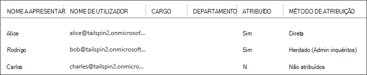

<properties
   pageTitle="Funções da aplicação | Microsoft Azure"
   description="Como efetuar autorizações utilizando funções da aplicação"
   services=""
   documentationCenter="na"
   authors="MikeWasson"
   manager="roshar"
   editor=""
   tags=""/>

<tags
   ms.service="guidance"
   ms.devlang="dotnet"
   ms.topic="article"
   ms.tgt_pltfrm="na"
   ms.workload="na"
   ms.date="02/16/2016"
   ms.author="mwasson"/>

#  <a name="application-roles-in-multitenant-applications"></a>Funções de aplicação nas aplicações multi-inquilino

[AZURE.INCLUDE [pnp-header](../../includes/guidance-pnp-header-include.md)]

Este artigo faz [parte de uma série]. Também existe uma [aplicação de exemplo] concluída que acompanha nesta série.

Funções da aplicação são utilizadas para atribuir permissões a utilizadores. Por exemplo, os [Inquéritos brinquedos] [ Tailspin] aplicação define as seguintes funções:

- Administrador. Pode executar todas as operações CRUD qualquer inquérito que pertence a esse inquilino.
- Criador de blocos. Pode criar novos inquéritos.
- Leitor. Pode ler qualquer inquéritos que pertencem a esse inquilino.

Pode ver que funções finalmente obtenham convertidas em permissões, durante a [autorização]. Mas a primeira pergunta é como atribuir e gerir funções. Identificámos três opções principais:

-   [Funções de aplicação do Azure AD](#roles-using-azure-ad-app-roles)
-   [Grupos de segurança do Azure AD](#roles-using-azure-ad-security-groups)
-   [Gestor de funções de aplicação](#roles-using-an-application-role-manager).

## <a name="roles-using-azure-ad-app-roles"></a>Funções de utilizar funções de aplicação do Azure AD

Esta é a abordagem que é utilizada na aplicação brinquedos inquéritos.

Nesta abordagem, SaaS o fornecedor define as funções da aplicação ao adicioná-las à manifesto da aplicação. Depois de um cliente se inscreve, o administrador do diretório de AD do cliente atribui utilizadores às funções. Quando um utilizador inicia sessão, funções atribuídas do utilizador são enviadas como em afirmações.

> [AZURE.NOTE] Se o cliente tem Azure AD Premium, o administrador pode atribuir um grupo de segurança a uma função e membros do grupo irão herdar a função de aplicação. Esta é uma forma conveniente para gerir funções, uma vez que o proprietário do grupo não necessite de ser um administrador AD.

Vantagens desta abordagem:

-   Modelo de programação Simple.
-   Funções são específicas para a aplicação. As funções de afirmações para uma aplicação não são enviadas para outra aplicação.
-   Se o cliente remove a aplicação a partir do seu inquilino do AD, as funções desaparecem.
-   A aplicação não necessita de qualquer permissões do Active Directory extra, que não seja de leitura do perfil de utilizador.

Desvantagens:

- Os clientes sem Azure AD Premium não podem atribuir grupos de segurança a funções. Para estes clientes, todas as atribuições de utilizador devem ser efetuadas por um administrador de AD.
- Se tiver uma back-end da web API, que é separada a partir da aplicação web, em seguida, atribuições de funções para a aplicação web não se aplicam a web API. Para mais debate deste ponto, consulte [proteger um back-end da web API].

### <a name="implementation"></a>Pós-implementação

**Defina as funções.** O fornecedor de SaaS declara as funções de aplicação no [manifesto da aplicação]. Por exemplo, eis a entrada para a aplicação de inquéritos manifesto:

```
"appRoles": [
  {
    "allowedMemberTypes": [
      "User"
    ],
    "description": "Creators can create Surveys",
    "displayName": "SurveyCreator",
    "id": "1b4f816e-5eaf-48b9-8613-7923830595ad",
    "isEnabled": true,
    "value": "SurveyCreator"
  },
  {
    "allowedMemberTypes": [
      "User"
    ],
    "description": "Administrators can manage the Surveys in their tenant",
    "displayName": "SurveyAdmin",
    "id": "c20e145e-5459-4a6c-a074-b942bbd4cfe1",
    "isEnabled": true,
    "value": "SurveyAdmin"
  }
],
```

O `value` propriedade aparece na afirmação de função. O `id` propriedade é o identificador exclusivo para a função definida. Gerar um novo valor GUID para sempre `id`.

**Atribuir aos utilizadores**. Quando um cliente novo se inscreve, a aplicação é registada no inquilino do cliente AD. Neste momento, um administrador de AD para esse inquilino pode atribuir utilizadores a funções.

> [AZURE.NOTE] Tal como indicado anteriormente, clientes com o Azure AD Premium também podem atribuir grupos de segurança a funções.

A seguinte captura de ecrã a partir do portal Azure mostra três utilizadores. Alice tiver sido atribuída diretamente a uma função. O Rodrigo herdadas uma função como um membro de um grupo de segurança com o nome "Inquéritos administrador", o que é atribuído a uma função. Carlos não está atribuído a qualquer função.



> [AZURE.NOTE] Em alternativa, a aplicação pode atribuir funções através de programação, utilizando a API do Azure AD Graph.  No entanto, isto requer que a aplicação para obter permissões de escrita para diretório de AD do cliente. Uma aplicação com essas permissões poderia fazer muitas inconveniente &mdash; o cliente é confiar na aplicação não para prejudicar o seu diretório. Muitos clientes poderá licenciar conceder este nível de acesso.

**Obter violação de função**. Quando um utilizador inicia sessão, a aplicação recebe funções atribuídas do utilizador numa afirmação com o tipo de `http://schemas.microsoft.com/ws/2008/06/identity/claims/role`.  

Um utilizador pode ter várias funções ou nenhuma função. No seu código autorização, não partem do pressuposto que o utilizador tem exatamente uma função reclamar. Em vez disso, escreva código que verifica se um valor específico afirmação é apresentar:

```csharp
if (context.User.HasClaim(ClaimTypes.Role, "Admin")) { ... }
```

## <a name="roles-using-azure-ad-security-groups"></a>Funções de utilizar grupos de segurança do Azure AD

Nesta abordagem, funções são representadas por grupos de segurança do AD. A aplicação atribui permissões a utilizadores com base em respectivos membros do grupo de segurança.

Vantagens:

-   Para clientes que não têm Azure AD Premium, esta abordagem permite que o cliente utilizar grupos de segurança para gerir as atribuições de funções.

Desvantagens:

- Complexidade. Uma vez que cada inquilino envia afirmações de grupo diferente, a aplicação deve manter um registo das que grupos de segurança correspondem às quais funções da aplicação, para cada inquilino.
- Se o cliente remove a aplicação a partir do seu inquilino do AD, os grupos de segurança permanecem no seu diretório de AD.

### <a name="implementation"></a>Pós-implementação

No manifesto da aplicação, defina o `groupMembershipClaims` propriedade para "SecurityGroup". Isto é necessário para obter afirmações de grupo de associação de AAD.

```
{
   // ...
   "groupMembershipClaims": "SecurityGroup",
}
```

Quando um cliente novo se inscreve, a aplicação indica o cliente para criar grupos de segurança para as funções necessários pela aplicação. O cliente, em seguida, tem de introduzir o objeto do grupo IDs para a aplicação. A aplicação armazena estes numa tabela que mapas os IDs de grupo para funções de aplicação, por inquilino.

> [AZURE.NOTE] Em alternativa, a aplicação podia criar os grupos através de programação, utilizando a API do Azure AD Graph.  Isto seria menos sujeito a erros. No entanto, requer a aplicação para obter "ler e escrever todos os grupos" permissões para AD directório o cliente. Muitos clientes poderá licenciar conceder este nível de acesso.

Quando um utilizador inicia sessão:

1.  A aplicação recebe grupos do utilizador, como em afirmações. O valor de cada afirmação é o ID de objeto de um grupo.
2.  Azure AD limita o número de enviou o token de grupos. Se o número de grupos exceder este limite, Azure AD envia um pedido de "ultrapassado" especial. Se estiver presente nessa afirmação, a aplicação tem uma consulta a API do Azure AD Graph para todos os grupos a que pertence esse utilizador. Para obter detalhes, consulte o artigo [autorização nas aplicações de nuvem utilizar grupos de AD], na secção intitulada "Grupos reclamar hiperdosagem termos".
3.  A aplicação de procura o objeto IDs na sua própria base de dados, para localizar as funções da aplicação correspondente para atribuir ao utilizador.
4.  A aplicação adiciona um valor de afirmações personalizadas para o capital de utilizador que expresse a função de aplicações. Por exemplo: `survey_role` = "SurveyAdmin".

Políticas de autorização devem utilizar a função personalizada afirmação, reclamar não ao grupo.

## <a name="roles-using-an-application-role-manager"></a>Funções de utilizar uma aplicação do Gestor de função

Com esta abordagem, funções da aplicação não são armazenadas no Azure AD de todo. Em vez disso, a aplicação armazena as atribuições de funções para cada utilizador na sua própria DB &mdash; por exemplo, utilizando a classe de **RoleManager** ASP.NET identidade.

Vantagens:

-   A aplicação tem controlo total sobre as funções e atribuições de utilizador.

Desvantagens:

- Mais complexas, mais difícil manter.
- Não é possível utilizar grupos de segurança do AD para gerir as atribuições de funções.
- Armazena informações do utilizador da base de dados de aplicação, onde-pode obter dessincronizado com diretório de AD do inquilino, tal como os utilizadores são adicionados ou removidos.   

Existem vários exemplos existentes para esta abordagem. Por exemplo, consulte o artigo [criar uma aplicação do ASP.NET MVC com auth e DB do SQL e implementar a aplicação de serviço de Azure].

## <a name="next-steps"></a>Próximos passos

- Leia o seguinte artigo nesta série: [autorização baseadas no recurso e baseado em funções nas aplicações multi-inquilino][autorização]

<!-- Links -->
[Tailspin]: guidance-multitenant-identity-tailspin.md
[parte de uma série]: guidance-multitenant-identity.md
[autorização]: guidance-multitenant-identity-authorize.md
[Proteger uma back-end da web API]: guidance-multitenant-identity-web-api.md
[Criar uma aplicação do ASP.NET MVC com auth e DB do SQL e implementar a aplicação de serviço do Azure]: ../app-service-web/web-sites-dotnet-deploy-aspnet-mvc-app-membership-oauth-sql-database.md
[manifesto de aplicação]: ../active-directory/active-directory-application-manifest.md
[aplicação de exemplo]: https://github.com/Azure-Samples/guidance-identity-management-for-multitenant-apps
