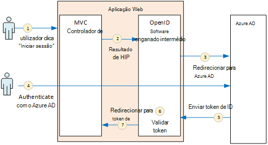
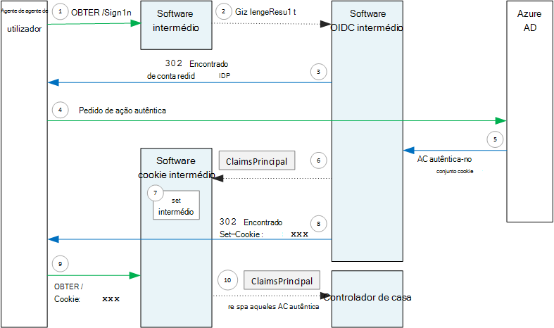

<properties
   pageTitle="Autenticação nas aplicações multi-inquilino | Microsoft Azure"
   description="Como uma aplicação multi-inquilino pode autenticar os utilizadores a partir do Azure AD"
   services=""
   documentationCenter="na"
   authors="MikeWasson"
   manager="roshar"
   editor=""
   tags=""/>

<tags
   ms.service="guidance"
   ms.devlang="dotnet"
   ms.topic="article"
   ms.tgt_pltfrm="na"
   ms.workload="na"
   ms.date="05/23/2016"
   ms.author="mwasson"/>

# <a name="authentication-in-multitenant-apps-using-azure-ad-and-openid-connect"></a>Autenticação em aplicações multi-inquilino, utilizando o Azure AD e ligue OpenID

[AZURE.INCLUDE [pnp-header](../../includes/guidance-pnp-header-include.md)]

Este artigo faz [parte de uma série](guidance-multitenant-identity.md). Também existe uma [aplicação de exemplo] concluída que acompanha nesta série.

Este artigo descreve como uma aplicação multi-inquilino pode autenticar utilizadores a partir do Azure Active Directory (Azure AD), utilizando OpenID ligar (OIDC) para autenticar.

## <a name="overview"></a>Descrição geral

Os nossos [implementação de referência](guidance-multitenant-identity-tailspin.md) é uma aplicação do ASP.NET Core 1.0. A aplicação utiliza o software OpenID ligar intermédio incorporado para executar o fluxo de autenticação OIDC. O diagrama seguinte mostra o que acontece quando o utilizador inicia sessão, de alto nível.



1.  O utilizador clica no botão "início de sessão" na aplicação. Esta ação é processada por um controlador de MVC.
2.  O controlador de MVC devolve uma ação **ChallengeResult** .
3.  O software intermédio intercepta a **ChallengeResult** e cria uma resposta 302, que redireciona o utilizador para a página de início de sessão no Azure AD.
4.  O utilizador autentica com Azure AD.
5.  Azure AD envia um token de ID da aplicação.
6.  O software intermédio valida o token de ID. Neste momento, o utilizador está agora autenticado dentro da aplicação.
7.  O software intermédio redireciona o utilizador regressar à aplicação.

## <a name="register-the-app-with-azure-ad"></a>Registe-se a aplicação com Azure AD

Para ativar OpenID ligar, o fornecedor de SaaS regista a aplicação dentro da sua própria inquilino do Azure AD.

Para registar a aplicação, siga os passos nas [Aplicações de integração com o Azure Active Directory](../active-directory/active-directory-integrating-applications.md), na secção [Adicionar uma aplicação](../active-directory/active-directory-integrating-applications.md#adding-an-application).

Na página **Configurar** :

-   Tenha em atenção o ID de cliente.
-   Em **aplicação está com várias inquilino**, selecione **Sim**.
-   Configurar o **URL de resposta** a um URL onde Azure AD irá enviar a resposta de autenticação. Pode utilizar o URL de base da sua aplicação.
  - Nota: O caminho do URL pode ser alguma coisa, desde que o nome do anfitrião corresponde à sua aplicação implementada.
  - Pode definir vários URLs de resposta. Durante o desenvolvimento, pode utilizar uma `localhost` endereço, para executar a aplicação localmente.
-   Gerar um segredo de cliente: em **chaves**, clique em pendente que diz **Selecione duração** e selecione anos de 1 ou 2. A tecla estarão visível quando clica em **Guardar**. Certifique-se de que copie o valor, uma vez que este não for apresentado novamente quando voltar a carregá a página de configuração.

## <a name="configure-the-auth-middleware"></a>Configurar o software auth intermédio

Esta secção descreve como configurar o software de autenticação intermédio na ASP.NET Core 1.0 para autenticação multi-inquilino com OpenID ligar.

Na sua aula de arranque, adicione o software intermédio OpenID ligar:

```csharp
app.UseOpenIdConnectAuthentication(options =>
{
    options.AutomaticAuthenticate = true;
    options.AutomaticChallenge = true;
    options.ClientId = [client ID];
    options.Authority = "https://login.microsoftonline.com/common/";
    options.CallbackPath = [callback path];
    options.PostLogoutRedirectUri = [application URI];
    options.SignInScheme = CookieAuthenticationDefaults.AuthenticationScheme;
    options.TokenValidationParameters = new TokenValidationParameters
    {
        ValidateIssuer = false
    };
    options.Events = [event callbacks];
});
```

> [AZURE.NOTE] Consulte o artigo [Startup.cs](https://github.com/Azure-Samples/guidance-identity-management-for-multitenant-apps/blob/master/src/Tailspin.Surveys.Web/Startup.cs).

Para mais informações sobre a classe de arranque, consulte o artigo [Aplicação arranque](https://docs.asp.net/en/latest/fundamentals/startup.html) na documentação do ASP.NET Core 1.0.

Defina as opções de software intermédio seguintes:

- **ClientId**. ID de cliente a aplicação, que tem quando registada a aplicação no Azure AD.
- **Autoridade**. Para uma aplicação multi-inquilino, defina esta opção para `https://login.microsoftonline.com/common/`. Este é o URL para o Azure AD comuns ponto final, que permite aos utilizadores a partir de qualquer inquilino do Azure AD para iniciar sessão. Para mais informações sobre o ponto final comuns, consulte [Esta mensagem no blogue](http://www.cloudidentity.com/blog/2014/08/26/the-common-endpoint-walks-like-a-tenant-talks-like-a-tenant-but-is-not-a-tenant/).
- No **TokenValidationParameters**, defina **ValidateIssuer** FALSO. Isto significa que a aplicação será responsável pela validar o valor de emissor no token de ID. (O software intermédio valida ainda o token propriamente dita.) Para mais informações sobre a validar o emissor, consulte o artigo [validação emissor](guidance-multitenant-identity-claims.md#issuer-validation).
- **CallbackPath**. Configurar esta igual ao caminho no URL de resposta que registado no Azure AD. Por exemplo, se o URL de resposta for `http://contoso.com/aadsignin`, devem ser **CallbackPath** `aadsignin`. Se não definir esta opção, o valor predefinido é `signin-oidc`.
- **PostLogoutRedirectUri**. Especificar um URL para redirecionar utilizadores depois de terminar a sessão. Isto deve ser uma página que lhe permite pedidos anónimos &mdash; , normalmente, a home page.
- **SignInScheme**. Defina esta opção para `CookieAuthenticationDefaults.AuthenticationScheme`. Esta definição significa que depois do utilizador é autenticado, afirmações de utilizador são armazenadas localmente num cookie. Este cookie é como o utilizador permanece com sessão iniciada durante a sessão do browser.
- **Eventos.** Chamadas de retorno do evento; consulte o artigo [eventos de autenticação](#authentication-events).

Adicione também o software de autenticação de cookies intermédio à tubagem. Este software intermédio é responsável por escrever as afirmações de utilizador para um cookie e, em seguida, ler o cookie durante carregamentos de página subsequentes.

```csharp
app.UseCookieAuthentication(options =>
{
    options.AutomaticAuthenticate = true;
    options.AutomaticChallenge = true;
    options.AccessDeniedPath = "/Home/Forbidden";
});
```

## <a name="initiate-the-authentication-flow"></a>Iniciar o fluxo de autenticação

Para iniciar o fluxo de autenticação ASP.NET MVC, devolva uma **ChallengeResult** a partir do contoller:

```csharp
[AllowAnonymous]
public IActionResult SignIn()
{
    return new ChallengeResult(
        OpenIdConnectDefaults.AuthenticationScheme,
        new AuthenticationProperties
        {
            IsPersistent = true,
            RedirectUri = Url.Action("SignInCallback", "Account")
        });
}
```

Isto faz com que o software intermédio devolver uma resposta (encontrado) 302 que redireciona para o ponto final de autenticação.

## <a name="user-login-sessions"></a>Sessões de início de sessão do utilizador

Tal como mencionado, quando o utilizador inicia sessão pela primeira vez, o software de autenticação de cookies intermédio escreve as afirmações de utilizador para um cookie. Após esta ação, pedidos de HTTP são autenticados lendo o cookie.

Por predefinição, o software cookie intermédio escreve um [cookie sessão][session-cookie], que obtém eliminou, uma vez, o utilizador fecha o browser. Da próxima vez que o utilizador seguinte visita o site, terão de iniciar sessão novamente. No entanto, se definir **IsPersistent** como VERDADEIRO na **ChallengeResult**, o software intermédio escreve um cookie persistente, para que o utilizador permanece com sessão iniciada depois de fechá browser. Pode configurar a expiração cookie; consulte o artigo [controlar opções dos cookies][cookie-options]. Os cookies persistentes são mais convenientes para o utilizador, mas poderão ser inapropriados para algumas aplicações (diga, uma aplicação de banca) onde pretende que o utilizador a cada hora de início de sessão.

## <a name="about-the-openid-connect-middleware"></a>Sobre o software OpenID ligar intermédio

Software intermédio OpenID ligar no ASP.NET oculta a maior parte dos detalhes do protocolo. Esta secção contém algumas notas sobre a aplicação, que poderão ser úteis para compreender o fluxo de protocolo.

Primeiro, vamos examinar o fluxo de autenticação em termos de ASP.NET (ignorando os detalhes do fluxo de protocolo OIDC entre a aplicação e Azure AD). O diagrama seguinte mostra o processo.



Neste diagrama, existem dois controladores de MVC. O controlador de conta processa os pedidos de início de sessão no e o controlador de base fornece a home page.

Eis o processo de autenticação:

1. O utilizador clica no botão "Início de sessão" e o browser envia num pedido GET. Por exemplo: `GET /Account/SignIn/`.
2. O devolve do controlador de conta um `ChallengeResult`.
3. O software OIDC intermédio devolve uma resposta de HTTP 302 redirecionar para o Azure AD.
4. O browser envia o pedido de autenticação para Azure AD
5. O utilizador inicia sessão Azure AD, e Azure AD envia uma resposta de autenticação.
6. O software OIDC intermédio cria um principal de afirmações e transmite-lo para o software de autenticação de cookies intermédio.
7. O software cookie intermédio serializes o capital de afirmações e define um cookie.
8. O software OIDC intermédio redireciona para URL de chamada de retorno a aplicação.
10. Browser segue o redirecionamento enviar o cookie no pedido de.
11. O software cookie intermédio deserializes cookie para um afirmações principal e define `HttpContext.User` igual ao capital de afirmações. O pedido é encaminhado para um controlador de MVC.

### <a name="authentication-ticket"></a>Permissão de autenticação

Se a autenticação é concluída com êxito, o software OIDC intermédio cria uma permissão de autenticação, que contém um principal de afirmações que detém afirmações do utilizador. Pode aceder a permissão de dentro o evento **AuthenticationValidated** ou **TicketReceived** .

> [AZURE.NOTE] Até que o fluxo de autenticação inteira está concluído, `HttpContext.User` ainda retém uma anónimo principal, _não_ o utilizador autenticado. O capital anónimo tem uma coleção de afirmações vazia. Depois de autenticação é concluída e redirecionamentos aplicação, o software cookie intermédio deserializes cookie de autenticação e conjuntos de `HttpContext.User` para um principal de afirmações que representa o utilizador autenticado.

### <a name="authentication-events"></a>Eventos de autenticação

Durante o processo de autenticação, o software intermédio OpenID ligar eleva uma série de eventos:

- **RedirectToAuthenticationEndpoint**. Chamado para a direita antes do software intermédio redireciona para o ponto final de autenticação. Pode utilizar este evento para modificar o redirecionamento URL; Por exemplo, para adicionar parâmetros do pedido. Consulte o artigo [Adicionar à linha de comandos do administrador consentimento](guidance-multitenant-identity-signup.md#adding-the-admin-consent-prompt) para obter um exemplo.

- **AuthorizationResponseReceived**. Chamada após o software intermédio recebe a resposta de autenticação a partir do fornecedor de identidade (IDP), mas antes do software intermédio valida a resposta.  

- **AuthorizationCodeReceived**. Chamada com o código de autorização.

- **TokenResponseReceived**. Chamado depois do software intermédio obtém um acesso token da IDP. Aplica-se apenas ao fluxo de código de autorização.

- **AuthenticationValidated**. Chamada após o software intermédio valida o token de ID. Neste momento, a aplicação tem um conjunto de afirmações validados sobre o utilizador. Pode utilizar este evento para executar a validação adicional nas afirmações ou para transformar em afirmações. Consulte o artigo [trabalhar com em afirmações](guidance-multitenant-identity-claims.md).

- **UserInformationReceived**. Chamado se o software intermédio obtém o perfil de utilizador do ponto final de informações de utilizador. Aplicável apenas ao fluxo de código de autorização e apenas quando `GetClaimsFromUserInfoEndpoint = true` nas opções de software intermédio.

- **TicketReceived**. Chamado quando autenticação estiver concluída. Este é o último evento, partindo do princípio de que a autenticação é concluída com êxito. Depois deste evento é processado, o utilizador está assinado sessão na aplicação.

- **AuthenticationFailed**. Chamada se a autenticação falhar. Utilizar este evento para lidar com falhas de autenticação &mdash; por exemplo, ao redirecionar para uma página de erro.

Para fornecer as chamadas de retorno para estes eventos, defina a opção de **eventos** no software intermédio. Existem duas formas diferentes para declarar os processadores de eventos: Inline com lambdas, ou uma aula que deriva da **OpenIdConnectEvents**.

Em linha com lambdas:

```csharp
app.UseOpenIdConnectAuthentication(options =>
{
    // Other options not shown.

    options.Events = new OpenIdConnectEvents
    {
        OnTicketReceived = (context) =>
        {
             // Handle event
             return Task.FromResult(0);
        },
        // other events
    }
});
```

Decorrentes da **OpenIdConnectEvents**:

```csharp
public class SurveyAuthenticationEvents : OpenIdConnectEvents
{
    public override Task TicketReceived(TicketReceivedContext context)
    {
        // Handle event
        return base.TicketReceived(context);
    }
    // other events
}

// In Startup.cs:
app.UseOpenIdConnectAuthentication(options =>
{
    // Other options not shown.

    options.Events = new SurveyAuthenticationEvents();
});
```

A segunda abordagem é recomendada se o seu chamadas de retorno do evento têm qualquer lógica substancial, pelo que estes não correio secundário a sua aula de arranque. Os nossos implementação de referência utiliza esta abordagem; consulte o artigo [SurveyAuthenticationEvents.cs](https://github.com/Azure-Samples/guidance-identity-management-for-multitenant-apps/blob/master/src/Tailspin.Surveys.Web/Security/SurveyAuthenticationEvents.cs).

### <a name="openid-connect-endpoints"></a>OpenID ligar os pontos finais

Azure AD suporta [A deteção de ligar OpenID](https://openid.net/specs/openid-connect-discovery-1_0.html), onde o fornecedor de identidade (IDP) devolve um documento de metadados JSON a partir de um [ponto final conhecido](https://openid.net/specs/openid-connect-discovery-1_0.html#ProviderConfig). O documento de metadados contém informações tais como:

-   O URL do ponto final de autorização. Este é o local onde a aplicação redireciona para autenticar o utilizador.
-   O URL do "terminar sessão" ponto final, onde a aplicação vai para terminar a sessão do utilizador.
-   O URL para obter as teclas de assinatura, o cliente utiliza para validar os tokens OIDC-obtém a partir do IDP.

Por predefinição, o software OIDC intermédio sabe como obter este metadados. Defina a opção de **certificação** no software intermédio e o software intermédio constrói o URL para os metadados. (Pode substituir o URL de metadados, definindo a opção **MetadataAddress** .)

### <a name="openid-connect-flows"></a>OpenID ligar monetários

Por predefinição, o software OIDC intermédio utiliza fluxo híbrida com o modo de resposta de mensagem de formulário.

-   _Fluxo de híbrido_ significa que o cliente pode obter um token de ID e um código de autorização a mesma viagem de volta para o servidor de autorização.
-   _Formulário de publicar o modo de resposta_ significa que o servidor de autorização utiliza um pedido de HTTP publicar para enviar o código de autorização e token de ID da aplicação. Os valores são urlencoded formulário (tipo de conteúdo = "aplicação/x-www-form-urlencoded").

Quando o software OIDC intermédio redireciona para o ponto final de autorização, o URL de redirecionamento inclui todos os parâmetros de cadeia de consulta necessários por OIDC. Para o fluxo de híbrido:

-   client_id. Este valor é definido na opção **ClientId**
-   âmbito = "openid perfil", o que significa que é um pedido de OIDC e queremos do perfil de utilizador.
-   response_type = "código id_token". Isto especifica fluxo híbrido.
-   response_mode = "form_post". Isto especifica a resposta a publicar um formulário.

Para especificar um fluxo de diferentes, defina a propriedade de **ResponseType** no menu Opções. Por exemplo:

```csharp
app.UseOpenIdConnectAuthentication(options =>
{
    options.ResponseType = "code"; // Authorization code flow

    // Other options
}
```

## <a name="next-steps"></a>Próximos passos

- Leia o seguinte artigo nesta série: [trabalhar com baseada em afirmações identidades nas aplicações multi-inquilino][claims]


[claims]: guidance-multitenant-identity-claims.md
[cookie-options]: https://docs.asp.net/en/latest/security/authentication/cookie.html#controlling-cookie-options
[session-cookie]: https://en.wikipedia.org/wiki/HTTP_cookie#Session_cookie
[aplicação de exemplo]: https://github.com/Azure-Samples/guidance-identity-management-for-multitenant-apps
