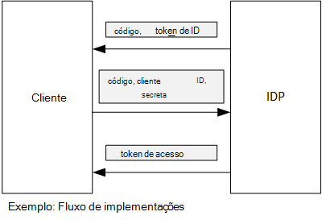

<properties
   pageTitle="Utilizar declaração do cliente para obter tokens de acesso a partir do Azure AD | Microsoft Azure"
   description="Como utilizar declaração do cliente para obter tokens de acesso a partir do Azure AD."
   services=""
   documentationCenter="na"
   authors="MikeWasson"
   manager="roshar"
   editor=""
   tags=""/>

<tags
   ms.service="guidance"
   ms.devlang="dotnet"
   ms.topic="article"
   ms.tgt_pltfrm="na"
   ms.workload="na"
   ms.date="05/23/2016"
   ms.author="mwasson"/>

# <a name="using-client-assertion-to-get-access-tokens-from-azure-ad"></a>Utilizar declaração do cliente para obter tokens de acesso a partir do Azure AD

[AZURE.INCLUDE [pnp-header](../../includes/guidance-pnp-header-include.md)]

Este artigo faz [parte de uma série]. Também existe uma [aplicação de exemplo] concluída que acompanha nesta série.

## <a name="background"></a>Fundo

Quando utilizar fluxo de código de autorização ou híbrido fluxo OpenID ligar, o cliente troca um código de autorização para um token de acesso. Durante este passo, o cliente tem para se autenticar no servidor.



Uma forma para autenticar o cliente é utilizando uma palavra-passe cliente. Já como os [Inquéritos brinquedos] [ Surveys] aplicação está configurada por predefinição.

Eis um pedido de exemplo a partir do cliente para IDP, pedir um token de acesso. Nota a `client_secret` parâmetro.

```
POST https://login.microsoftonline.com/b9bd2162xxx/oauth2/token HTTP/1.1
Content-Type: application/x-www-form-urlencoded

resource=https://tailspin.onmicrosoft.com/surveys.webapi
  &client_id=87df91dc-63de-4765-8701-b59cc8bd9e11
  &client_secret=i3Bf12Dn...
  &grant_type=authorization_code
  &code=PG8wJG6Y...
```

O segredo é apenas uma cadeia de, para que tenha para se certificar-se de que não fugas o valor. É a melhor prática manter o segredo cliente fora do controlo de origem. Quando implementar Azure, armazenar o segredo numa [definição de aplicação][configure-web-app].

No entanto, qualquer pessoa com acesso à subscrição Azure pode ver as definições de aplicação. Além disso, há sempre um normal para dar entrada de segredos na controlo da origem (por exemplo, em scripts de implementação), partilhá-los por correio eletrónico e assim sucessivamente.

Para segurança adicional, pode utilizar [declaração do cliente] em vez de uma palavra-passe cliente. Com declaração do cliente, o cliente utiliza um certificado x. 509 para revelar-se de que o pedido do token veio a partir do cliente. O certificado de cliente está instalado no servidor web. Em geral, será mais fácil de restringir o acesso ao certificado, que para se certificar de que ninguém inadvertidamente, são uma palavra-passe cliente. Para obter mais informações sobre como configurar os certificados numa aplicação web, consulte o artigo [Utilizar certificados nas aplicações de Web sites do Azure][using-certs-in-websites]

Eis um pedido de token utilizando a declaração de cliente:

```
POST https://login.microsoftonline.com/b9bd2162xxx/oauth2/token HTTP/1.1
Content-Type: application/x-www-form-urlencoded

resource=https://tailspin.onmicrosoft.com/surveys.webapi
  &client_id=87df91dc-63de-4765-8701-b59cc8bd9e11
  &client_assertion_type=urn:ietf:params:oauth:client-assertion-type:jwt-bearer
  &client_assertion=eyJhbGci...
  &grant_type=authorization_code
  &code= PG8wJG6Y...
```

Repare que o `client_secret` parâmetro já não é utilizado. Em vez disso, o `client_assertion` parâmetro contém um token JWT que foi assinado utilizando o certificado de cliente. O `client_assertion_type` parâmetro especifica o tipo de declaração &mdash; neste caso, token de JWT. O servidor valida o token JWT. Se o token JWT for inválido, o pedido do token devolve um erro.

> [AZURE.NOTE] Certificados x. 509 não estão a única forma da declaração do cliente; vamos concentrar-no mesmo aqui porque é suportado pelo Azure AD.

## <a name="using-client-assertion-in-the-surveys-application"></a>Utilizar declaração do cliente na aplicação de inquéritos

Esta secção mostra como configurar a aplicação de brinquedos inquéritos para utilizar declaração do cliente. Estes passos, irá gerar um certificado autoassinado que seja adequado para o desenvolvimento, mas não para utilização de produção.

1. Executar o de script do PowerShell [/Scripts/Setup-KeyVault.ps1] [ Setup-KeyVault] da seguinte forma:

    ```
    .\Setup-KeyVault.ps -Subject [subject]
    ```

    Para o `Subject` parâmetro, introduza um nome, tal como "surveysapp". O script gera um certificado autoassinado e armazena no arquivo de certificados "atual utilizador/pessoal".

2. O resultado do script é um fragmento JSON. Adicione isto ao manifesto da aplicação da aplicação web, da seguinte forma:

    1. Iniciar sessão no [portal de gestão Azure] [ azure-management-portal] e navegue até ao seu diretório do Azure AD.

    2. Clique em **aplicações**.

    3. Selecione a aplicação de inquéritos.

    4.  Clique em **Gerir manifesto** e selecione **Transferir manifesto**.

    5.  Abra o ficheiro JSON manifesto num editor de texto. Colar o script para a saída de `keyCredentials` propriedade. Deve ser semelhante ao seguinte:

        ```    
        "keyCredentials": [
            {
              "type": "AsymmetricX509Cert",
              "usage": "Verify",
              "keyId": "29d4f7db-0539-455e-b708-....",
              "customKeyIdentifier": "ZEPpP/+KJe2fVDBNaPNOTDoJMac=",
              "value": "MIIDAjCCAeqgAwIBAgIQFxeRiU59eL.....
            }
          ],
         ```

    6.  Guarde as alterações ao ficheiro JSON.

    7.  Regresse ao portal. Clique em **Gerir manifesto** > **Carregar manifesto** e carregar o ficheiro JSON.

3. Execute o seguinte comando para obter a impressão do certificado digital.

    ```
    certutil -store -user my [subject]
    ```

    onde `[subject]` é o valor que especificou para assunto no script do PowerShell. A impressão digital está listada em "Orientação do diapositivo notas Hash(sha1)". Remova os espaços entre os números hexadecimais.

4. Atualize o seu segredos de aplicação. No Explorador de solução, com o botão direito do projecto Tailspin.Surveys.Web e selecione **Gerir segredos de utilizador**. Adicione uma entrada para "Asymmetric" em "AzureAd", conforme apresentado abaixo:

    ```
    {
      "AzureAd": {
        "ClientId": "[Surveys application client ID]",
        // "ClientSecret": "[client secret]",  << Delete this entry
        "PostLogoutRedirectUri": "https://localhost:44300/",
        "WebApiResourceId": "[App ID URI of your Survey.WebAPI application]",
        // new:
        "Asymmetric": {
          "CertificateThumbprint": "[certificate thumbprint]",  // Example: "105b2ff3bc842c53582661716db1b7cdc6b43ec9"
          "StoreName": "My",
          "StoreLocation": "CurrentUser",
          "ValidationRequired": "false"
        }
      },
      "Redis": {
        "Configuration": "[Redis connection string]"
      }
    }
    ```

    Tem de definir `ValidationRequired` como false porque o certificado não foi assinado por uma AC autoridade raiz. Produção, utilize um certificado que está assinado por uma autoridade de AC e definir `ValidationRequired` como verdadeiro.

    Eliminar também a entrada para `ClientSecret`, uma vez que não é necessária com declaração do cliente.

5. No Startup.cs, localize o código que regista o `ICredentialService`. Remova os comentários na linha que utiliza `CertificateCredentialService`e comenta na linha que utiliza `ClientCredentialService`:

    ```csharp
    // Uncomment this:
    services.AddSingleton<ICredentialService, CertificateCredentialService>();
    // Comment out this:
    //services.AddSingleton<ICredentialService, ClientCredentialService>();
    ```

Em tempo de execução, a aplicação web lê o certificado no arquivo de certificados. O certificado tem de estar instalado no mesmo computador, como a aplicação web.

## <a name="next-steps"></a>Próximos passos

- Leia o seguinte artigo nesta série: [Utilizar o Azure chave cofre para proteger segredos de aplicação][key vault]


<!-- Links -->
[configure-web-app]: ../app-service-web/web-sites-configure.md
[azure-management-portal]: https://manage.windowsazure.com
[declaração de cliente]: https://tools.ietf.org/html/rfc7521
[key vault]: guidance-multitenant-identity-keyvault.md
[Setup-KeyVault]: https://github.com/Azure-Samples/guidance-identity-management-for-multitenant-apps/blob/master/scripts/Setup-KeyVault.ps1
[Surveys]: guidance-multitenant-identity-tailspin.md
[using-certs-in-websites]: https://azure.microsoft.com/blog/using-certificates-in-azure-websites-applications/
[parte de uma série]: guidance-multitenant-identity.md
[aplicação de exemplo]: https://github.com/Azure-Samples/guidance-identity-management-for-multitenant-apps
