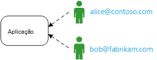
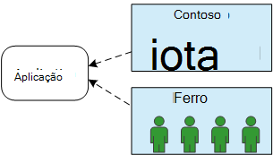
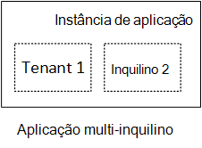
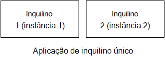
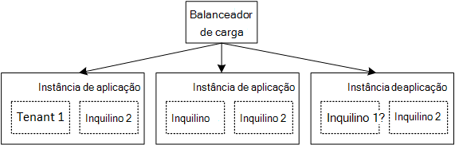

<properties
   pageTitle="Gestão de identidades para aplicações multi-inquilino | Microsoft Azure"
   description="Introdução à gestão de identidades nas aplicações multi-inquilino"
   services=""
   documentationCenter="na"
   authors="MikeWasson"
   manager="roshar"
   editor=""
   tags=""/>

<tags
   ms.service="guidance"
   ms.devlang="dotnet"
   ms.topic="article"
   ms.tgt_pltfrm="na"
   ms.workload="na"
   ms.date="06/02/2016"
   ms.author="mwasson"/>

# Introdução à gestão de identidades para aplicações multi-inquilino no Microsoft Azure

[AZURE.INCLUDE [pnp-header](../../includes/guidance-pnp-header-include.md)]

Este artigo faz [parte de uma série]. Também existe uma [aplicação de exemplo] concluída que acompanha nesta série.

Digamos que estiver a escrever uma empresa SaaS aplicação à alojado na nuvem. Obviamente, a aplicação terá de utilizadores:

Mas esses utilizadores pertencem a organizações:

Exemplo: Brinquedos vende subscrições para a sua aplicação SaaS. Contoso e Fabrikam inscrever-se para a aplicação. Quando Alice (`alice@contoso`) sinais no, a aplicação deve saber que Alice faz parte de Contoso.

- Alice _devem_ ter acesso a dados de Contoso.
- Alice _não deve_ ter acesso a dados de Fabrikam.

Estas orientações mostrar-lhe como a gestão de identidades do utilizador numa aplicação multi-inquilino, utilizando o [Azure Active Directory] [ AzureAD] (Azure AD) para processar iniciar sessão e de autenticação.

## O que é multitenancy?

Um _inquilino_ é um grupo de utilizadores. Numa aplicação SaaS, o inquilino é um cliente da aplicação ou de subscritor. _Multitenancy_ é uma arquitectura onde múltiplos inquilinos do partilham a mesma instância física da aplicação. Apesar de inquilinos partilham recursos físicos (como VMs ou armazenamento), cada inquilino obtém a sua própria lógica instância da aplicação.

Normalmente, os dados da aplicação são partilhados entre os utilizadores dentro de um inquilino, mas não com outros inquilinos.

Compare esta arquitetura com uma arquitetura de inquilino único, onde cada inquilino tem uma instância física dedicada. Numa arquitetura de inquilino único, pode adicionar inquilinos, girar por novas instâncias da aplicação.

### Dimensionamento multitenancy e horizontais

Para alcançar escala na nuvem, é comuns para adicionar mais físicas instâncias. Isto é conhecido como _dimensionamento horizontal_ ou _escalar para fora_. Considere a hipótese de uma aplicação web. Para processar mais tráfego, pode adicionar mais servidor VMs e colocá-los por trás de um balanceador de carga. Cada VM executa uma instância física separada da aplicação web.

Qualquer pedido de pode ser encaminhado para qualquer ocorrência. Em conjunto, o sistema funciona como uma única ocorrência lógica. Pode suprimir uma VM ou giratório para cima uma nova VM, sem afetar os utilizadores. Esta arquitetura, cada instância física é com várias inquilino e dimensionar ao adicionar mais instâncias. Se uma instância vai para baixo, não deve vai afetar quaisquer inquilino.

## Identidade numa aplicação multi-inquilino

Numa aplicação multi-inquilino, tem de considerar utilizadores no contexto de inquilinos.

**Autenticação**

- Os utilizadores iniciar sessão na aplicação com as respetivas credenciais da organização. Não possuem que criar novos perfis de utilizador para a aplicação.
- Os utilizadores dentro da mesma organização fazem parte de ao mesmo inquilino.
- Quando um utilizador inicia sessão, a aplicação sabe qual inquilino o utilizador pertence.

**Autorização**

- Quando autoriza ações de um utilizador (por exemplo, um recurso a ver), a aplicação deve ter em conta inquilino do utilizador.
- Os utilizadores podem ser atribuídos a funções dentro da aplicação, tal como "Administrador" ou "Utilizador padrão". Atribuições de funções devem ser geridas pelo cliente, não pelo fornecedor de SaaS.

**Exemplo.** Alice, um empregado da Contoso, navega para a aplicação no seu browser e clica no botão "Iniciar sessão no". Posteriormente, é redirecionada para um ecrã de início de sessão onde ela introduz o respectiva credenciais da empresa (nome de utilizador e palavra-passe). Neste momento, ela é iniciada sessão na aplicação como `alice@contoso.com`. A aplicação também sabe que Alice é um utilizador de administrador para esta aplicação. Porque ela é um administrador, posteriormente, pode ver uma lista de todos os recursos que pertencem à Contoso. No entanto, posteriormente, é possível visualizar recursos do Fabrikam, porque ela é um administrador apenas a partir da sua inquilino.

Neste orientações, abordaremos especificamente através do Azure AD para gestão de identidades.

- Vamos assumir que o cliente armazena os perfis de utilizador no Azure AD (incluindo inquilinos do Office 365 e o Dynamics CRM)
- Os clientes no local Active Directory (AD) podem utilizar a [ligação do Azure AD] [ ADConnect] para sincronizar os respetivos AD no local com o Azure AD.

Se um cliente com AD no local não é possível utilizar a ligação do Azure AD (devido a política IT da empresa ou outras razões), SaaS fornecedor pode federar com o cliente estiverem AD através dos serviços de Federação do Active Directory (AD FS). Esta opção é descrita em [Federating com AD FS um cliente].

Estas orientações não considerar que outros aspetos da multitenancy tal como a partições de dados, por inquilino configuração e assim sucessivamente.

## Próximos passos

- Leia o seguinte artigo nesta série: [aplicação sobre o brinquedos inquéritos][tailpin]

<!-- Links -->
[ADConnect]: ../active-directory/active-directory-aadconnect.md
[AzureAD]: https://azure.microsoft.com/documentation/services/active-directory/
[parte de uma série]: guidance-multitenant-identity.md
[Federar com AD FS um cliente]: guidance-multitenant-identity-adfs.md
[aplicação de exemplo]: https://github.com/Azure-Samples/guidance-identity-management-for-multitenant-apps
[tailpin]: guidance-multitenant-identity-tailspin.md
