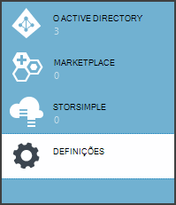
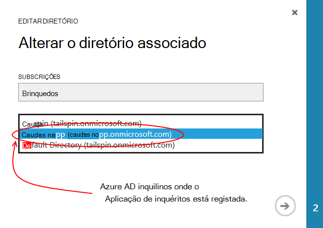
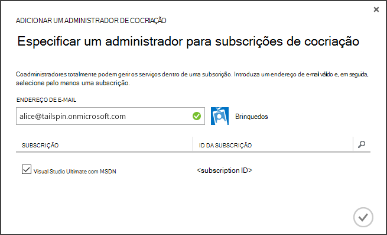
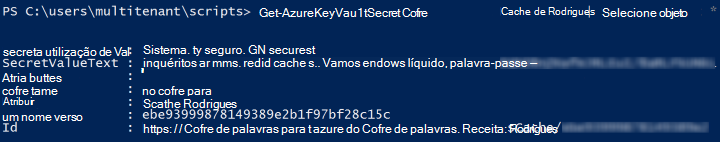

<properties
   pageTitle="Utiliza cofre chave para proteger segredos aplicação | Microsoft Azure"
   description="Como um utilizar o serviço de chave cofre para armazenar segredos de aplicação"
   services=""
   documentationCenter="na"
   authors="MikeWasson"
   manager="roshar"
   editor=""
   tags=""/>

<tags
   ms.service="guidance"
   ms.devlang="dotnet"
   ms.topic="article"
   ms.tgt_pltfrm="na"
   ms.workload="na"
   ms.date="02/16/2016"
   ms.author="mwasson"/>

# <a name="using-azure-key-vault-to-protect-application-secrets"></a>Utilizar o Azure chave cofre para proteger segredos de aplicação

[AZURE.INCLUDE [pnp-header](../../includes/guidance-pnp-header-include.md)]

Este artigo faz [parte de uma série]. Também existe uma [aplicação de exemplo] concluída que acompanha nesta série.

## <a name="overview"></a>Descrição geral

É comum ter definições da aplicação que são sensíveis e devem ser protegidas, tais como:

- Cadeias de ligação de base de dados
- Palavras-passe
- Teclas de criptografia

Como segurança prática recomendada, nunca devem armazenar estes segredos no controlo de origem. É demasiado fácil para os mesmos fugas &mdash; mesmo repositório de código de origem for privado. E -é não praticamente mantendo segredos a partir do geral público. Em projetos maiores, poderá pretender restringir quais os programadores e operadores podem aceder os segredos de produção. (Definições para os ambientes de teste ou desenvolvimento são diferentes).

É uma opção mais segura armazenar estes segredos no [Azure chave cofre][KeyVault]. Chave Cofre é um serviço de nuvem alojado de gestão de chaves de criptografia e outros segredos. Este artigo mostra como utilizar a chave cofre para armazenar as definições de configuração para a aplicação.

Nos [Brinquedos inquéritos] [ Surveys] aplicação, estão secretas as seguintes definições:

- A cadeia de ligação de base de dados.
- A cadeia de ligação Redis.
- O segredo do cliente para a aplicação web.

Para armazenar segredos configuração cofre chave, a aplicação de inquéritos implementa um fornecedor de configuração personalizado, cria no [sistema de configuração do]ASP.NET Core 1.0[configuration]. O fornecedor personalizado lê as definições de configuração do cofre chave no arranque.

A aplicação de inquéritos carrega as definições de configuração de seguintes locais:

- O ficheiro appsettings.json
- [Armazenam segredos utilizador] [ user-secrets] (ambiente de desenvolvimento apenas; para testar a ligação)
- Ambiente de alojamento (definições de aplicação nas aplicações Azure web)
- Cofre chave

Cada um destas substituições aquele anterior, para que a prevalecem de quaisquer definições armazenadas num chave cofre.

> [AZURE.NOTE] Por predefinição, o fornecedor de configuração do Cofre de chave é desativado. Não é necessária para executar a aplicação localmente. Seria ativá-la numa implementação de produção.

> O fornecedor de chave cofre atualmente não é suportado para .NET Core, porque requer o [Microsoft.Azure.KeyVault] [ Microsoft.Azure.KeyVault] pacote.

O comando no arranque, a aplicação lê definições a partir de cada fornecedor de configuração registados e utiliza-os para preencher um objeto de opções vivamente escrito. (Para obter mais informações, consulte [utilizar opções e objectos de configuração de][options].)

## <a name="implementation"></a>Pós-implementação

O [KeyVaultConfigurationProvider] [ KeyVaultConfigurationProvider] classe é um fornecedor de configuração que se ligue ao [sistema de configuração]de ASP.NET Core 1.0[configuration].

Para utilizar o `KeyVaultConfigurationProvider`, ligar para o `AddKeyVaultSecrets` método extensão da turma de arranque:

```csharp
    var builder = new ConfigurationBuilder()
        .SetBasePath(appEnv.ApplicationBasePath)
        .AddJsonFile("appsettings.json");

    if (env.IsDevelopment())
    {
        builder.AddUserSecrets();
    }
    builder.AddEnvironmentVariables();
    var config = builder.Build();

    // Add key vault configuration:
    builder.AddKeyVaultSecrets(config["AzureAd:ClientId"],
        config["KeyVault:Name"],
        config["AzureAd:Asymmetric:CertificateThumbprint"],
        Convert.ToBoolean(config["AzureAd:Asymmetric:ValidationRequired"]),
        loggerFactory);
```

Repare que `KeyVaultConfigurationProvider` requer algumas definições de configuração, precisa de ser armazenados das outras fontes de configuração.

Quando a aplicação for iniciada, `KeyVaultConfigurationProvider` enumera todas os segredos no chave cofre. Para cada secreta,-procura uma etiqueta 'ConfigKey' com o nome. O valor da etiqueta é o nome da definição de configuração.

> [AZURE.NOTE] [Etiquetas] [ key-tags] são metadados opcional armazenados com uma chave. Etiquetas são utilizadas aqui porque os nomes de chave não podem conter carateres de dois pontos (:).

```csharp
var kvClient = new KeyVaultClient(GetTokenAsync);
var secretsResponseList = await kvClient.GetSecretsAsync(_vault, MaxSecrets, token);
foreach (var secretItem in secretsResponseList.Value)
{
    //The actual config key is stored in a tag with the Key "ConfigKey"
    // because ':' is not supported in a shared secret name by Key Vault.
    if (secretItem.Tags != null && secretItem.Tags.ContainsKey(ConfigKey))
    {
        var secret = await kvClient.GetSecretAsync(secretItem.Id, token);
        Data.Add(secret.Tags[ConfigKey], secret.Value);
    }
}
```

> [AZURE.NOTE] Consulte o artigo [KeyVaultConfigurationProvider.cs].

## <a name="setting-up-key-vault-in-the-surveys-app"></a>Configurar o Cofre de chave na aplicação inquéritos

Pré-requisitos:

- Instalar os [Cmdlets do Gestor de recursos do Azure][azure-rm-cmdlets].
- Configurar a aplicação de inquéritos, conforme descrito no [executar a aplicação de inquéritos][readme].

Passos de alto nível:

1. Configure o utilizador de administração no inquilino.
2. Configure um certificado de cliente.
3. Crie uma chave cofre.
4. Adicione as definições de configuração para a sua chave cofre.
5. Remova os comentários o código que permite chave cofre.
6. Atualize segredos de utilizador a aplicação.

### <a name="set-up-an-admin-user"></a>Configurar o utilizador de administração

> [AZURE.NOTE] Para criar uma chave cofre, tem de utilizar uma conta que pode gerir a sua subscrição do Azure. Além disso, qualquer aplicação que autorizar lerem cofre chave tem registado ao mesmo inquilino como essa conta.

Neste passo, será Certifique-se de que pode criar uma chave cofre enquanto a sessão iniciada como um utilizador do inquilino de onde a aplicação de inquéritos está registada.

Em primeiro lugar, altere o directório associado à sua subscrição Azure.

1. Inicie sessão no [portal de gestão do Azure][azure-management-portal]

2. Clique em **Definições**.

    

3. Selecione a sua subscrição do Azure.

4. Clique em **Editar diretório** na parte inferior do portal.

    

5. Em "Alterar diretório associado", selecione o inquilino do Azure AD onde está registada a aplicação de inquéritos,

    

6. Clique no botão de seta e preencha a caixa de diálogo.

Crie um utilizador de administração do inquilino Azure AD onde a aplicação de inquéritos está registada.

1. Iniciar sessão no [portal de gestão Azure][azure-management-portal].

2. Selecione o inquilino do Azure AD onde está registado o seu pedido.

3. Clique em **utilizadores** > **Adicionar utilizador**.

4. Na caixa de diálogo **Adicionar utilizador** , atribua ao utilizador para a função de Administrador Global.

Adicione o utilizador admin como um administrador de cocriação para a sua subscrição Azure.

1. Iniciar sessão no [portal de gestão Azure][azure-management-portal].

2. Clique em **Definições** e selecione a sua subscrição do Azure.

3. Clique em **administradores**

4. Clique em **Adicionar** na parte inferior do portal.

5. Introduza o e-mail do utilizador ao administrador que criou anteriormente.

6. Selecione a caixa de verificação a subscrição.

7. Clique no botão de marca de verificação para concluir a caixa de diálogo.




### <a name="set-up-a-client-certificate"></a>Configurar um certificado de cliente

1. Executar o de script do PowerShell [/Scripts/Setup-KeyVault.ps1] [ Setup-KeyVault] da seguinte forma:
    ```
    .\Setup-KeyVault.ps1 -Subject <<subject>>
    ```
    Para o `Subject` parâmetro, introduza um nome, tal como "surveysapp". O script gera um certificado autoassinado e armazena no arquivo de certificados "atual utilizador/pessoal".

2. O resultado do script é um fragmento JSON. Adicione isto ao manifesto da aplicação da aplicação web, da seguinte forma:

    1. Iniciar sessão no [portal de gestão Azure] [ azure-management-portal] e navegue até ao seu diretório do Azure AD.

    2. Clique em **aplicações**.

    3. Selecione a aplicação de inquéritos.

    4.  Clique em **Gerir manifesto** e selecione **Transferir manifesto**.

    5.  Abra o ficheiro JSON manifesto num editor de texto. Colar o script para a saída de `keyCredentials` propriedade. Deve ser semelhante ao seguinte:
    ```
            "keyCredentials": [
                {
                  "type": "AsymmetricX509Cert",
                  "usage": "Verify",
                  "keyId": "29d4f7db-0539-455e-b708-....",
                  "customKeyIdentifier": "ZEPpP/+KJe2fVDBNaPNOTDoJMac=",
                  "value": "MIIDAjCCAeqgAwIBAgIQFxeRiU59eL.....
                }
              ],
    ```          
    6.  Guarde as alterações ao ficheiro JSON.

    7.  Regresse ao portal. Clique em **Gerir manifesto** > **Carregar manifesto** e carregar o ficheiro JSON.

3. Adicione o mesmo fragmento de JSON para manifesto da aplicação da web API (Surveys.WebAPI).

4. Execute o seguinte comando para obter a impressão do certificado digital.
    ```
    certutil -store -user my [subject]
    ```
    onde `[subject]` é o valor que especificou para assunto no script do PowerShell. A impressão digital está listada em "Orientação do diapositivo notas Hash(sha1)". Remova os espaços entre os números hexadecimais.

Irá utilizar a impressão digital mais tarde.

### <a name="create-a-key-vault"></a>Criar uma chave Cofre

1. Executar o de script do PowerShell [/Scripts/Setup-KeyVault.ps1] [ Setup-KeyVault] da seguinte forma:

    ```
    .\Setup-KeyVault.ps1 -KeyVaultName <<key vault name>> -ResourceGroupName <<resource group name>> -Location <<location>>
    ```

    Quando lhe for pedido para introduzir as credenciais, inicie sessão no como o utilizador do Azure AD que criou anteriormente. O script cria um novo grupo de recursos e uma nova chave cofre dentro desse grupo de recursos.

    Nota: para o localização parâmetro-, pode utilizar o seguinte comando do PowerShell para obter uma lista das regiões válidas:

    ```
    Get-AzureRmResourceProvider -ProviderNamespace "microsoft.keyvault" | Where-Object { $_.ResourceTypes.ResourceTypeName -eq "vaults" } | Select-Object -ExpandProperty Locations
    ```

2. Execute novamente, SetupKeyVault.ps com os seguintes parâmetros:

    ```
    .\Setup-KeyVault.ps1 -KeyVaultName <<key vault name>> -ApplicationIds @("<<web app client ID>>", "<<web API client ID>>")
    ```

    onde

    - nome do cofre chave = o nome que lhe atribuiu o Cofre de palavras chave no passo anterior.
    - ID de cliente da aplicação da Web = o ID do cliente para a aplicação web do inquéritos.
    - ID de cliente api da Web = o ID do cliente para a aplicação de Surveys.WebAPI.

    Exemplo:
    ```
    .\Setup-KeyVault.ps1 -KeyVaultName tailspinkv -ApplicationIds @("f84df9d1-91cc-4603-b662-302db51f1031", "8871a4c2-2a23-4650-8b46-0625ff3928a6")
    ```

    > [AZURE.NOTE] Pode obter o cliente IDs a partir do [portal de gestão Azure][azure-management-portal]. Selecione o inquilino do Azure AD, selecione a aplicação e clique em **Configurar**.

    Este script autoriza a aplicação web e web API para obter segredos do seu Cofre chave. Consulte o artigo [Introdução ao Azure chave cofre] [ authorize-app] para obter mais informações.

### <a name="add-configuration-settings-to-your-key-vault"></a>Adicionar as definições de configuração a sua chave Cofre

1. Executar SetupKeyVault.ps da seguinte forma:

    ```
    .\Setup-KeyVault.ps1 -KeyVaultName <<key vault name> -KeyName RedisCache -KeyValue "<<Redis DNS name>>.redis.cache.windows.net,password=<<Redis access key>>,ssl=true" -ConfigName "Redis:Configuration"
    ```
    onde

    - nome do cofre chave = o nome que lhe atribuiu o Cofre de palavras chave no passo anterior.
    - Redis nome DNS = o nome de DNS do seu instância de cache Redis.
    - Tecla de acesso de redis = a tecla de acesso para a instância de cache Redis.

    Este comando adiciona uma palavra-passe para a sua chave cofre. O segredo é um par de valor do nome plus uma etiqueta:

    -   O nome da chave não é utilizado pela aplicação, mas tem de ser exclusivo no cofre chave.
    -   O valor é o valor da opção de configuração, neste caso, a cadeia de ligação Redis.
    -   a etiqueta "ConfigKey" guarda o nome da chave de configuração.

2. Neste momento, é aconselhável testar se tiver armazenado segredos cofre chave com êxito. Execute o seguinte comando do PowerShell:

    ```
    Get-AzureKeyVaultSecret <<key vault name>> RedisCache | Select-Object *
    ```
    O resultado deve mostrar o valor secreto plus alguns metadados:

    

3. Execute SetupKeyVault.ps novamente para adicionar a cadeia de ligação de base de dados:

    ```
    .\Setup-KeyVault.ps1 -KeyVaultName <<key vault name> -KeyName ConnectionString -KeyValue <<DB connection string>> -ConfigName "Data:SurveysConnectionString"
    ```

    onde `<<DB connection string>>` é o valor de cadeia de ligação de base de dados.

    Para testar a ligação com a base de dados local, copie a cadeia de ligação do ficheiro Tailspin.Surveys.Web/appsettings.json. Se fazê-lo, certifique-se alterar as barras invertidas duplas ('\\\\') para uma única barra invertida. As duas barras invertidas são um caráter de escape no ficheiro JSON.

    Exemplo:

    ```
    .\Setup-KeyVault.ps1 -KeyVaultName mykeyvault -KeyName ConnectionString -KeyValue "Server=(localdb)\MSSQLLocalDB;Database=Tailspin.SurveysDB;Trusted_Connection=True;MultipleActiveResultSets=true" -ConfigName "Data:SurveysConnectionString"
    ```

### <a name="uncomment-the-code-that-enables-key-vault"></a>Remova os comentários o código que permite cofre chave

1. Abra a solução Tailspin.Surveys.

2. No [Tailspin.Surveys.Web/Startup.cs][web-startup], localize o bloco de código seguinte e remova os comentários-lo.

    ```csharp
    //#if DNX451
    //            _configuration = builder.Build();
    //            builder.AddKeyVaultSecrets(_configuration["AzureAd:ClientId"],
    //                _configuration["KeyVault:Name"],
    //                _configuration["AzureAd:Asymmetric:CertificateThumbprint"],
    //                Convert.ToBoolean(_configuration["AzureAd:Asymmetric:ValidationRequired"]),
    //                loggerFactory);
    //#endif
    ```

3. No [Tailspin.Surveys.WebAPI/Startup.cs][web-api-startup], localize o bloco de código seguinte e remova os comentários-lo.

    ```csharp
    //#if DNX451
    //            var config = builder.Build();
    //            builder.AddKeyVaultSecrets(config["AzureAd:ClientId"],
    //                config["KeyVault:Name"],
    //                config["AzureAd:Asymmetric:CertificateThumbprint"],
    //                Convert.ToBoolean(config["AzureAd:Asymmetric:ValidationRequired"]),
    //                loggerFactory);
    //#endif
    ```

4. No [Tailspin.Surveys.Web/Startup.cs][web-startup], localize o código que regista o `ICredentialService`. Remova os comentários na linha que utiliza `CertificateCredentialService`e comenta na linha que utiliza `ClientCredentialService`:

    ```csharp
    // Uncomment this:
    services.AddSingleton<ICredentialService, CertificateCredentialService>();
    // Comment out this:
    //services.AddSingleton<ICredentialService, ClientCredentialService>();
    ```

    Esta alteração permite a aplicação web utilizar [declaração do cliente] [ client-assertion] para obter tokens de acesso OAuth. Com declaração do cliente, não precisa de uma palavra-passe OAuth cliente. Em alternativa, pode armazenar o segredo de cliente no cofre chave. No entanto, cofre chave e declaração do cliente que ambos utilizam um cliente de certificado, por isso se ativar chave cofre, é aconselhável para ativar também declaração do cliente.

### <a name="update-the-user-secrets"></a>Atualizar os segredos de utilizador

No Explorador de solução, com o botão direito do projecto Tailspin.Surveys.Web e selecione **Gerir segredos de utilizador**. No ficheiro de secrets.json, eliminar o JSON existente e cole o seguinte procedimento:

    ```
    {
      "AzureAd": {
        "ClientId": "[Surveys web app client ID]",
        "PostLogoutRedirectUri": "https://localhost:44300/",
        "WebApiResourceId": "[App ID URI of your Surveys.WebAPI application]",
        "Asymmetric": {
          "CertificateThumbprint": "[certificate thumbprint. Example: 105b2ff3bc842c53582661716db1b7cdc6b43ec9]",
          "StoreName": "My",
          "StoreLocation": "CurrentUser",
          "ValidationRequired": "false"
        }
      },
      "KeyVault": {
        "Name": "[key vault name]"
      }
    }
    ```

Substitua as entradas [entre parênteses Retos] com os valores corretos.

- `AzureAd:ClientId`: O ID de cliente da aplicação inquéritos.
- `AzureAd:WebApiResourceId`: O ID da aplicação URI que especificou quando criou a aplicação Surveys.WebAPI no Azure AD.
- `Asymmetric:CertificateThumbprint`: A impressão digital do certificado que recebeu anteriormente, quando criou o certificado de cliente.
- `KeyVault:Name`: O nome da sua chave cofre.

> [AZURE.NOTE] `Asymmetric:ValidationRequired`é falso porque o certificado que criou anteriormente não foi assinado por uma raiz autoridade de certificação (AC). Produção, utilize um certificado que está assinado por uma AC de raiz e definir `ValidationRequired` como verdadeiro.

Guarde o ficheiro secrets.json atualizado.

Em seguida, no Explorador de solução, com o botão direito do projecto Tailspin.Surveys.WebApi e selecione **Gerir segredos de utilizador**. Eliminar o JSON existente e cole o seguinte procedimento:

```
{
  "AzureAd": {
    "ClientId": "[Surveys.WebAPI client ID]",
    "WebApiResourceId": "https://tailspin5.onmicrosoft.com/surveys.webapi",
    "Asymmetric": {
      "CertificateThumbprint": "[certificate thumbprint]",
      "StoreName": "My",
      "StoreLocation": "CurrentUser",
      "ValidationRequired": "false"
    }
  },
  "KeyVault": {
    "Name": "[key vault name]"
  }
}
```

Substitua as entradas [entre parênteses Retos] e guardar o ficheiro secrets.json.

> [AZURE.NOTE] Para a web API, certifique-se utilizar o ID do cliente para a aplicação de Surveys.WebAPI, não a aplicação de inquéritos.


<!-- Links -->
[authorize-app]: ../key-vault/key-vault-get-started.md/#authorize
[azure-management-portal]: https://manage.windowsazure.com/
[azure-rm-cmdlets]: https://msdn.microsoft.com/library/mt125356.aspx
[client-assertion]: guidance-multitenant-identity-client-assertion.md
[configuration]: https://docs.asp.net/en/latest/fundamentals/configuration.html
[KeyVault]: https://azure.microsoft.com/services/key-vault/
[KeyVaultConfigurationProvider]: https://github.com/Azure-Samples/guidance-identity-management-for-multitenant-apps/blob/master/src/Tailspin.Surveys.Configuration.KeyVault/KeyVaultConfigurationProvider.cs
[key-tags]: https://msdn.microsoft.com/library/azure/dn903623.aspx#BKMK_Keytags
[Microsoft.Azure.KeyVault]: https://www.nuget.org/packages/Microsoft.Azure.KeyVault/
[options]: https://docs.asp.net/en/latest/fundamentals/configuration.html#using-options-and-configuration-objects
[readme]: https://github.com/Azure-Samples/guidance-identity-management-for-multitenant-apps/blob/master/docs/running-the-app.md
[Setup-KeyVault]: https://github.com/Azure-Samples/guidance-identity-management-for-multitenant-apps/blob/master/scripts/Setup-KeyVault.ps1
[Surveys]: guidance-multitenant-identity-tailspin.md
[user-secrets]: http://go.microsoft.com/fwlink/?LinkID=532709
[web-startup]: https://github.com/Azure-Samples/guidance-identity-management-for-multitenant-apps/blob/master/src/Tailspin.Surveys.Web/Startup.cs
[web-api-startup]: https://github.com/Azure-Samples/guidance-identity-management-for-multitenant-apps/blob/master/src/Tailspin.Surveys.WebAPI/Startup.cs
[parte de uma série]: guidance-multitenant-identity.md
[KeyVaultConfigurationProvider.cs]: https://github.com/Azure-Samples/guidance-identity-management-for-multitenant-apps/blob/master/src/Tailspin.Surveys.Configuration.KeyVault/KeyVaultConfigurationProvider.cs
[aplicação de exemplo]: https://github.com/Azure-Samples/guidance-identity-management-for-multitenant-apps
