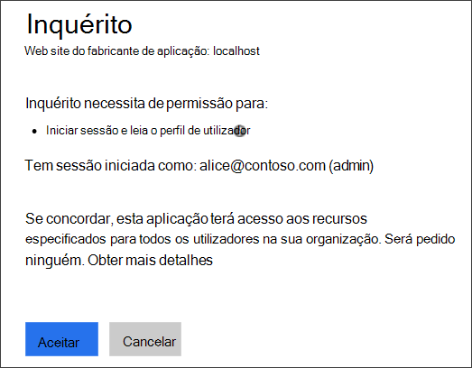
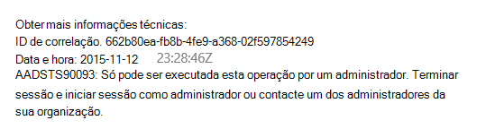
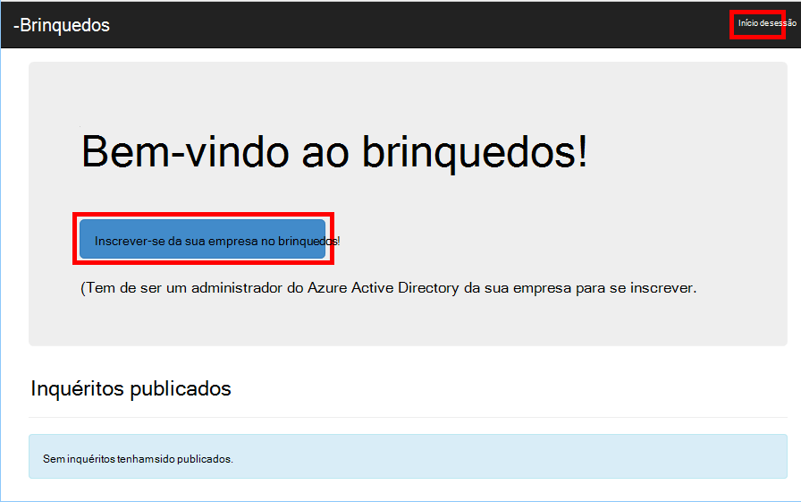
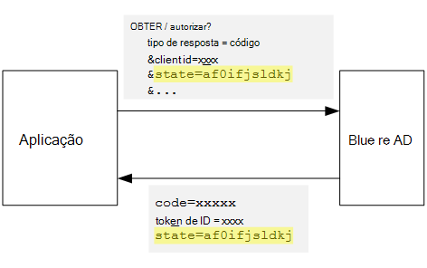
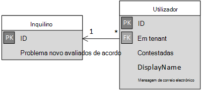

<properties
   pageTitle="Inscrição e ativação nas aplicações multi-inquilino de inquilinos | Microsoft Azure"
   description="Como a inquilinos incorporados numa aplicação multi-inquilino"
   services=""
   documentationCenter="na"
   authors="MikeWasson"
   manager="roshar"
   editor=""
   tags=""/>

<tags
   ms.service="guidance"
   ms.devlang="dotnet"
   ms.topic="article"
   ms.tgt_pltfrm="na"
   ms.workload="na"
   ms.date="05/23/2016"
   ms.author="mwasson"/>

# <a name="sign-up-and-tenant-onboarding-in-a-multitenant-application"></a>Inscrição e ativação numa aplicação multi-inquilino de inquilinos

[AZURE.INCLUDE [pnp-header](../../includes/guidance-pnp-header-include.md)]

Este artigo faz [parte de uma série]. Também existe uma [aplicação de exemplo] concluída que acompanha nesta série.

Este artigo descreve como implementar uma _inscrição_ processar numa aplicação do inquilino com várias, que permite que um cliente inscrever-se a sua organização para a sua aplicação.
Existem várias razões para implementar o processo de inscrição:

-   Permitir que um administrador de AD consentimento para toda a empresa do cliente utilizar a aplicação.
-   Recolha o pagamento de cartão de crédito ou outras informações de cliente.
-   Execute qualquer necessária pela sua aplicação de configuração de únicos por inquilino.

## <a name="admin-consent-and-azure-ad-permissions"></a>Administração autorização e permissões do Azure AD

Para autenticar com Azure AD, uma aplicação precisa de aceder ao directório do utilizador. No mínimo, a aplicação necessita de permissão de leitura do perfil de utilizador. A primeira vez que um utilizador inicia sessão, Azure AD mostra uma página de autorização que lista as permissões que está a ser pedidas. Ao clicar em **Aceitar**, o utilizador concede permissão para a aplicação.

Por predefinição, é concedida autorização numa base por utilizador. Cada utilizador que inicia sessão no vê a página de autorização. No entanto, o Azure AD também suporta _consentimento admin_, que permite que um administrador de AD consentimento para toda a organização.

Quando é utilizado o fluxo de consentimento admin, página de autorização Estados-membros que o administrador de AD é conceder a permissão em nome de todo o inquilino:



Depois do administrador clica em **Aceitar**, os outros utilizadores dentro ao mesmo inquilino podem iniciar sessão e Azure AD irá ignorar o ecrã de consentimento.

Apenas um administrador de AD pode dar consentimento de administração, porque concede permissão em nome de toda a organização. Se um administrador que não sejam tenta autenticar com o fluxo de consentimento admin, Azure AD apresenta um erro:



Se a aplicação requer permissões adicionais num ponto posterior, o cliente será necessário inscrever-se novamente e consentimento para as permissões atualizadas.  

## <a name="implementing-tenant-sign-up"></a>Implementar a inscrição no inquilino

Para os [Inquéritos brinquedos] [ Tailspin] a aplicação, definido vários requisitos para o processo de inscrição:

-   Um inquilino tem Inscreva-se antes dos utilizadores possam iniciar sessão.
-   Inscrição utiliza o fluxo de consentimento de administrador.
-   Inscrição adiciona o inquilino do utilizador para a base de dados de aplicação.
-   Depois de um inquilino se inscreve, a aplicação mostra uma página de ativação.

Nesta secção, explicaremos a nossa execução do processo de inscrição.
É importante compreender que "Inscreva-se para" versus "início de sessão" é um conceito de aplicação. Durante o fluxo de autenticação, Azure AD não implicitamente sabe se o utilizador está no processo de inscrição. É para a aplicação para controlar o contexto.

Quando um utilizador anónimo visita a aplicação de inquéritos, o utilizador é mostrados dois botões, uma para iniciar sessão e outra para "inscrever a sua empresa" (inscrever-se).



Estes botões invocar ações na classe [AccountController] .

O `SignIn` ação devolve um **ChallegeResult**, que faz com que o software OpenID ligar intermédio redirecionar para o ponto final de autenticação. Esta é a forma de predefinido para a autenticação accionador no ASP.NET Core 1.0.  

```csharp
[AllowAnonymous]
public IActionResult SignIn()
{
    return new ChallengeResult(
        OpenIdConnectDefaults.AuthenticationScheme,
        new AuthenticationProperties
        {
            IsPersistent = true,
            RedirectUri = Url.Action("SignInCallback", "Account")
        });
}
```

Comparar o agora a `SignUp` ação:

```csharp
[AllowAnonymous]
public IActionResult SignUp()
{
    // Workaround for https://github.com/aspnet/Security/issues/546
    HttpContext.Items.Add("signup", "true");

    var state = new Dictionary<string, string> { { "signup", "true" }};
    return new ChallengeResult(
        OpenIdConnectDefaults.AuthenticationScheme,
        new AuthenticationProperties(state)
        {
            RedirectUri = Url.Action(nameof(SignUpCallback), "Account")
        });
}
```

Como `SignIn`, o `SignUp` ação também devolve um `ChallengeResult`. Mas desta vez, vamos adicionar uma peça de informações de estado para a `AuthenticationProperties` na `ChallengeResult`:

-   inscrição no: um sinalizador booleano que indica que o utilizador iniciou o processo de inscrição.

As informações de estado no `AuthenticationProperties` é adicionada ao parâmetro de [Estado] OpenID ligar, arredondar viagens durante o fluxo de autenticação.



Depois do utilizador autentica no Azure AD e redireccionado novamente para a aplicação, a permissão de autenticação contém o estado. Estamos a utilizar este facto para se certificar de que o valor de "inscrição no" persistir ao longo do fluxo de autenticação inteira.

## <a name="adding-the-admin-consent-prompt"></a>Adicionar linha de comandos de consentimento do administrador

No Azure AD, o fluxo de consentimento administração é acionado ao adicionar um parâmetro "pedido" com a cadeia de consulta no pedido de autenticação:

```
/authorize?prompt=admin_consent&...
```

A aplicação de inquéritos adiciona à linha de comandos durante o `RedirectToAuthenticationEndpoint` evento. Este evento denomina-se para a direita antes do software intermédio redireciona para o ponto final de autenticação.

```csharp
public override Task RedirectToAuthenticationEndpoint(RedirectContext context)
{
    if (context.IsSigningUp())
    {
        context.ProtocolMessage.Prompt = "admin_consent";
    }

    _logger.RedirectToIdentityProvider();
    return Task.FromResult(0);
}
```

> [AZURE.NOTE] Consulte o artigo [SurveyAuthenticationEvents.cs].

Definir` ProtocolMessage.Prompt` indica o software intermédio para adicionar o parâmetro de "pedido" ao pedido de autenticação.

Tenha em atenção que a linha de comandos só é necessário durante a inscrição. Regular início de sessão no não deve inclui-lo. Para distinguir entre eles, podemos Verifique se o `signup` valor no estado de autenticação. Esta condição do verifica o método de extensão que se segue:

```csharp
internal static bool IsSigningUp(this BaseControlContext context)
{
    Guard.ArgumentNotNull(context, nameof(context));

    string signupValue;
    object obj;
    // Check the HTTP context and convert to string
    if (context.HttpContext.Items.TryGetValue("signup", out obj))
    {
        signupValue = (string)obj;
    }
    else
    {
        // It's not in the HTTP context, so check the authentication ticket.  If it's not there, we aren't signing up.
        if ((context.AuthenticationTicket == null) ||
            (!context.AuthenticationTicket.Properties.Items.TryGetValue("signup", out signupValue)))
        {
            return false;
        }
    }

    // We have found the value, so see if it's valid
    bool isSigningUp;
    if (!bool.TryParse(signupValue, out isSigningUp))
    {
        // The value for signup is not a valid boolean, throw                
        throw new InvalidOperationException($"'{signupValue}' is an invalid boolean value");
    }

    return isSigningUp;
}
```

> [AZURE.NOTE] Consulte o artigo [BaseControlContextExtensions.cs].

> [AZURE.NOTE] Nota: Este código inclui uma solução para um erro conhecido no ASP.NET Core 1.0 RC1. No `RedirectToAuthenticationEndpoint` evento, não existe nenhuma forma de obter as propriedades de autenticação que contém o estado "inscrição no". Como solução, o `AccountController.SignUp` método também coloca o estado "inscrição no" para o `HttpContext`. Isto funciona porque `RedirectToAuthenticationEndpoint` acontece antes do redirecionamento para que temos ainda o mesmo `HttpContext`.

## <a name="registering-a-tenant"></a>Registar um inquilino

A aplicação de inquéritos armazena algumas informações sobre cada inquilino e utilizador da base de dados de aplicação.



Na tabela inquilino, IssuerValue é o valor da afirmação emissor do inquilino. Para Azure AD, este é `https://sts.windows.net/<tentantID>` e dá um valor exclusivo por inquilino.

Quando um novo inquilino se inscreve, a aplicação de inquéritos escreve um registo de inquilino para a base de dados. Isto acontece dentro de `AuthenticationValidated` evento. (Não fazê-lo antes deste evento, porque o token de ID de não ser validados face ainda, para que não pode confiar os valores de afirmação. Consulte o artigo [autenticação].

Eis o código relevante a partir da aplicação de inquéritos:

```csharp
public override async Task AuthenticationValidated(AuthenticationValidatedContext context)
{
    var principal = context.AuthenticationTicket.Principal;
    var userId = principal.GetObjectIdentifierValue();
    var tenantManager = context.HttpContext.RequestServices.GetService<TenantManager>();
    var userManager = context.HttpContext.RequestServices.GetService<UserManager>();
    var issuerValue = principal.GetIssuerValue();
    _logger.AuthenticationValidated(userId, issuerValue);

    // Normalize the claims first.
    NormalizeClaims(principal);
    var tenant = await tenantManager.FindByIssuerValueAsync(issuerValue)
        .ConfigureAwait(false);

    if (context.IsSigningUp())
    {
        // Originally, we were checking to see if the tenant was non-null, however, this would not allow
        // permission changes to the application in AAD since a re-consent may be required.  Now we just don't
        // try to recreate the tenant.
        if (tenant == null)
        {
            tenant = await SignUpTenantAsync(context, tenantManager)
                .ConfigureAwait(false);
        }

        // In this case, we need to go ahead and set up the user signing us up.
        await CreateOrUpdateUserAsync(context.AuthenticationTicket, userManager, tenant)
            .ConfigureAwait(false);
    }
    else
    {
        if (tenant == null)
        {
            _logger.UnregisteredUserSignInAttempted(userId, issuerValue);
            throw new SecurityTokenValidationException($"Tenant {issuerValue} is not registered");
        }

        await CreateOrUpdateUserAsync(context.AuthenticationTicket, userManager, tenant)
            .ConfigureAwait(false);
    }
}
```

> [AZURE.NOTE] Consulte o artigo [SurveyAuthenticationEvents.cs].

Este código faz o seguinte:

1.  Verifique se o valor de emissor do inquilino já está na base de dados. Se não tiver assinado o inquilino para cima, `FindByIssuerValueAsync` devolve valor nulo.
2.  Se o utilizador é inscrever-se:
  1.    Adicionar o inquilino à base de dados (`SignUpTenantAsync`).
  2.    Adicionar o utilizador autenticado à base de dados (`CreateOrUpdateUserAsync`).
3.  Caso contrário, conclua o fluxo de início de sessão normal:
  1.    Se o emissor do inquilino não foi encontrado na base de dados, significa o inquilino não está registado e o cliente para se inscrever. Nesse caso, gerar uma exceção para fazer com que a autenticação para falhar.
  2.    Caso contrário, crie um registo de base de dados para este utilizador, se não houver um já (`CreateOrUpdateUserAsync`).

Aqui é o método de [SignUpTenantAsync] que adiciona o inquilino à base de dados.

```csharp
private async Task<Tenant> SignUpTenantAsync(BaseControlContext context, TenantManager tenantManager)
{
    Guard.ArgumentNotNull(context, nameof(context));
    Guard.ArgumentNotNull(tenantManager, nameof(tenantManager));

    var principal = context.AuthenticationTicket.Principal;
    var issuerValue = principal.GetIssuerValue();
    var tenant = new Tenant
    {
        IssuerValue = issuerValue,
        Created = DateTimeOffset.UtcNow
    };

    try
    {
        await tenantManager.CreateAsync(tenant)
            .ConfigureAwait(false);
    }
    catch(Exception ex)
    {
        _logger.SignUpTenantFailed(principal.GetObjectIdentifierValue(), issuerValue, ex);
        throw;
    }

    return tenant;
}
```

Eis um resumo do fluxo de inscrição inteiro na aplicação de inquéritos:

1.  O utilizador clica no botão **Início de sessão para cima** .
2.  O `AccountController.SignUp` ação devolve um resultado de challege.  O estado de autenticação inclui o valor de "inscrição no".
3.  No `RedirectToAuthenticationEndpoint` evento, adicione o `admin_consent` linha de comandos.
4.  O software intermédio OpenID ligar redireciona para Azure AD e o utilizador autentica.
5.  No `AuthenticationValidated` evento, procure o estado "inscrição no".
6.  Adicione o inquilino à base de dados.

## <a name="next-steps"></a>Próximos passos

- Leia o seguinte artigo nesta série: [funções de aplicação nas aplicações multi-inquilino][app roles]


<!-- Links -->
[app roles]: guidance-multitenant-identity-app-roles.md
[Tailspin]: guidance-multitenant-identity-tailspin.md
[parte de uma série]: guidance-multitenant-identity.md
[AccountController]: https://github.com/Azure-Samples/guidance-identity-management-for-multitenant-apps/blob/master/src/Tailspin.Surveys.Web/Controllers/AccountController.cs
[Estado]: http://openid.net/specs/openid-connect-core-1_0.html#AuthRequest
[SurveyAuthenticationEvents.cs]: https://github.com/Azure-Samples/guidance-identity-management-for-multitenant-apps/blob/master/src/Tailspin.Surveys.Web/Security/SurveyAuthenticationEvents.cs
[BaseControlContextExtensions.cs]: https://github.com/Azure-Samples/guidance-identity-management-for-multitenant-apps/blob/master/src/Tailspin.Surveys.Web/Security/BaseControlContextExtensions.cs
[Autenticação]: guidance-multitenant-identity-authenticate.md
[SignUpTenantAsync]: https://github.com/Azure-Samples/guidance-identity-management-for-multitenant-apps/blob/master/src/Tailspin.Surveys.Web/Security/SurveyAuthenticationEvents.cs
[aplicação de exemplo]: https://github.com/Azure-Samples/guidance-identity-management-for-multitenant-apps
