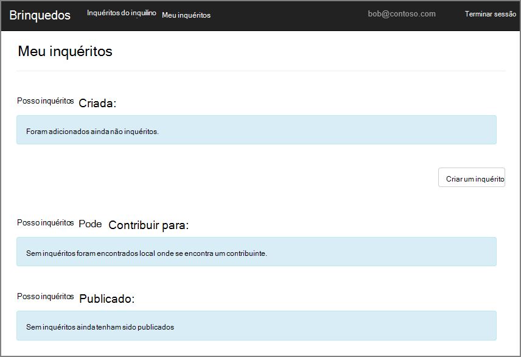
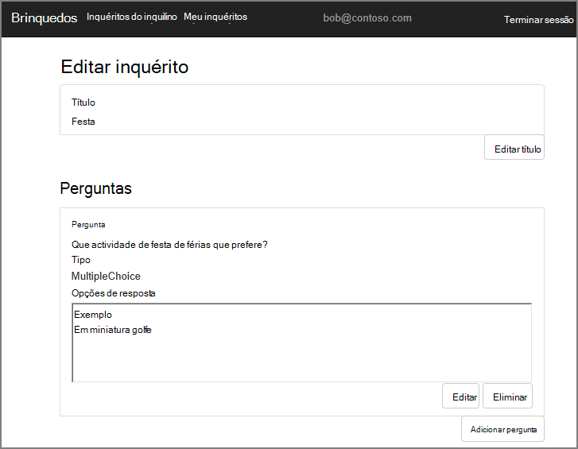
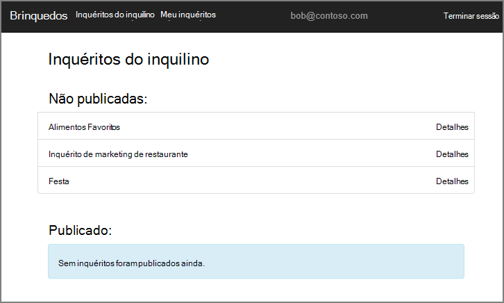
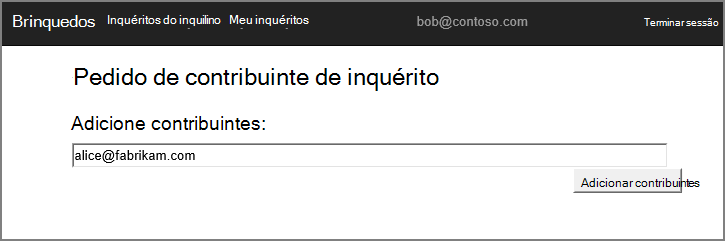
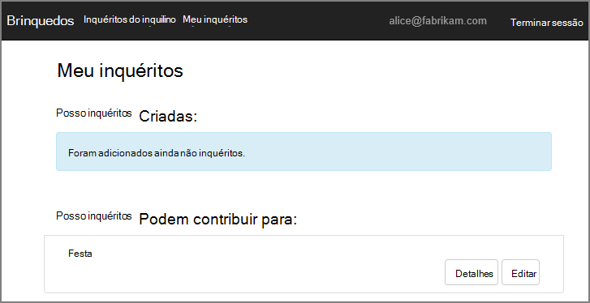
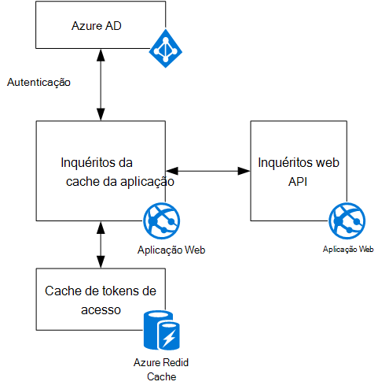

<properties
   pageTitle="Informações sobre a aplicação de inquéritos brinquedos | Microsoft Azure"
   description="Descrição geral da aplicação de inquéritos brinquedos"
   services=""
   documentationCenter="na"
   authors="MikeWasson"
   manager="roshar"
   editor=""
   tags=""/>

<tags
   ms.service="guidance"
   ms.devlang="dotnet"
   ms.topic="article"
   ms.tgt_pltfrm="na"
   ms.workload="na"
   ms.date="05/23/2016"
   ms.author="mwasson"/>

# Informações sobre a aplicação de brinquedos inquéritos

[AZURE.INCLUDE [pnp-header](../../includes/guidance-pnp-header-include.md)]

Este artigo faz [parte de uma série]. Também existe uma [aplicação de exemplo] concluída que acompanha nesta série.

Brinquedos são uma empresa fictícia que está a desenvolver uma aplicação de SaaS denominada inquéritos. Esta aplicação permite às organizações criar e publicar inquéritos onlinehttps.

- Uma organização pode inscrever-se para a aplicação.
- Depois da organização é inscreveu, os utilizadores podem iniciar sessão para a aplicação com as respetivas credenciais organizacionais.
- Os utilizadores podem criar, editar e publicar inquéritos.

> [AZURE.NOTE] Para começar a com a aplicação, consulte o artigo [executar a aplicação de inquéritos].

## Os utilizadores podem criar, editar e ver inquéritos

Um utilizador autenticado pode ver todos os inquéritos que tenha criado ou tem direitos de contribuinte para e criar novos inquéritos. Repare que o utilizador tem sessão iniciada com a sua identidade organizacional, `bob@contoso.com`.

Esta captura de ecrã mostra a página de inquérito editar:

Os utilizadores também podem ver qualquer inquéritos criados por outros utilizadores dentro ao mesmo inquilino.

## Os proprietários de inquérito podem convidar contribuintes

Quando um utilizador cria um inquérito, pode convidar outras pessoas para que sejam contribuintes no inquérito. Os contribuintes podem editar o inquérito, mas não é possível eliminar ou publique-o.  

Um utilizador pode adicionar contribuintes a partir de outras inquilinos, que permite a publicação em inquilino partilha de recursos. Nesta captura de ecrã, Bruno (`bob@contoso.com`) está a adicionar Alice (`alice@fabrikam.com`) como um contribuinte a um inquérito que o Rodrigo criado.

Quando inicia sessão Alice na, ela vê o inquérito listado em "Inquéritos posso podem contribuir para".

Tenha em atenção que Alice inicia sessão no próprio inquilino, não como convidado do inquilino Contoso. Alice tem permissões de contribuinte apenas para essa inquérito &mdash; posteriormente, não é possível ver outros inquéritos do inquilino de Contoso.

## Arquitetura

A aplicação de inquéritos é constituída por um front-end web e web API back-end. Ambos são implementados utilizando [ASP.NET Core 1.0].

A aplicação web utiliza Azure Active Directory (Azure AD) para autenticar os utilizadores. A aplicação web também chamadas Azure AD para obter tokens de acesso OAuth 2 para a API Web. Tokens de acesso são armazenadas em cache no Azure Redis Cache. A cache permite várias instâncias partilhar a cache de tokens mesma (por exemplo, num farm).

## Próximos passos

- Leia o seguinte artigo nesta série: [autenticação em aplicações multi-inquilino, com o Azure Active Directory e OpenID ligar][authentication]

<!-- Links -->

[authentication]: guidance-multitenant-identity-authenticate.md
[parte de uma série]: guidance-multitenant-identity.md
[Executar a aplicação a inquéritos]: https://github.com/Azure-Samples/guidance-identity-management-for-multitenant-apps/blob/master/docs/running-the-app.md
[ASP.NET Core 1.0]: https://docs.asp.net/en/latest/
[aplicação de exemplo]: https://github.com/Azure-Samples/guidance-identity-management-for-multitenant-apps
