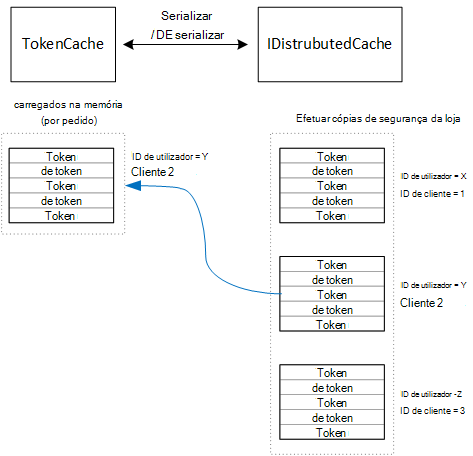

<properties
   pageTitle="Colocação em cache tokens de acesso de uma aplicação multi-inquilino | Microsoft Azure"
   description="Colocação em cache tokens de acesso utilizadas para invocar back-end Web API"
   services=""
   documentationCenter="na"
   authors="MikeWasson"
   manager="roshar"
   editor=""
   tags=""/>

<tags
   ms.service="guidance"
   ms.devlang="dotnet"
   ms.topic="article"
   ms.tgt_pltfrm="na"
   ms.workload="na"
   ms.date="02/16/2016"
   ms.author="mwasson"/>


# <a name="caching-access-tokens-in-a-multitenant-application"></a>Colocação em cache tokens de acesso de uma aplicação multi-inquilino

[AZURE.INCLUDE [pnp-header](../../includes/guidance-pnp-header-include.md)]

Este artigo faz [parte de uma série]. Também existe uma [aplicação de exemplo] concluída que acompanha nesta série.

É relativamente dispendioso obter um acesso OAuth token, porque requer um pedido de HTTP para o ponto final token. Por isso, é boa ideia tokens de cache sempre que possível. A [Biblioteca de autenticação do Azure AD] [ ADAL] (ADAL) coloca automaticamente em cache tokens obtidos a partir do Azure AD, incluindo tokens de atualização.

ADAL fornece uma implementação de cache de tokens predefinido. No entanto, esta cache token destina-se para as aplicações de cliente nativas e é _não_ adequado para aplicações web:

-   É uma instância estática e não tópico seguro.
-   Não dimensionar a um grande número de utilizadores, uma vez que tokens a partir de todos os utilizadores vão para o mesmo dicionário.
-   Não pode ser partilhado por servidores web num farm.

Em vez disso, deve implementar uma cache de tokens personalizada que deriva da ADAL `TokenCache` escolares, mas é adequado para um ambiente do servidor e fornece o conveniente nível de isolamento entre tokens para utilizadores diferentes.

O `TokenCache` escolares armazena um dicionário de tokens, indexado pelo emissor, o recurso, o ID de cliente e o utilizador. Uma cache de tokens personalizada deve escrever este dicionário para um armazenamento de segurança, tal como uma cache Redis.

Na aplicação brinquedos inquéritos, o `DistributedTokenCache` escolares implementa a cache de tokens. Esta implementação utiliza o [IDistributedCache] [ distributed-cache] produção a partir do ASP.NET Core 1.0. Desta forma, qualquer `IDistributedCache` pós-implementação pode ser utilizado como o armazenamento de segurança.

-   Por predefinição, a aplicação de inquéritos utiliza uma cache Redis.
-   Para um servidor web ocorrência única, é possível utilizar a ASP.NET Core 1.0 [na memória cache][in-memory-cache]. (Também é uma boa opção para executar a aplicação localmente durante o desenvolvimento.)

> [AZURE.NOTE] Atualmente, a cache de Redis não é suportada para .NET Core.

`DistributedTokenCache`armazena os dados de cache como pares valor/chave no arquivo de segurança. A tecla é o ID de utilizador plus ID de cliente, por isso o armazenamento de segurança contém os dados de cache separada para cada combinação exclusivo do utilizador/cliente.



O armazenamento de segurança é dividido pelo utilizador. Para cada pedido HTTP, os tokens para esse utilizador são ler a partir da loja de segurança e carregados para o `TokenCache` dicionário. Se Redis é utilizado como o armazenamento de segurança, todas as instâncias de server num farm lê/escritasm para a cache do mesmo e escalas esta abordagem para vários utilizadores.

## <a name="encrypting-cached-tokens"></a>Encriptar tokens em cache

Tokens são sensíveis a maiúsculas e dados, porque estes concederam acesso a recursos de um utilizador. (Para além disso, ao contrário de palavra-passe de um utilizador, é possível apenas armazenar um hash do token.) Por isso, é fundamental para proteger tokens de ser comprometida. A cache de cópias Redis está protegida por uma palavra-passe, mas se alguém obtém a palavra-passe, poderão obter todos os tokens de acesso em cache. Por que razão, o `DistributedTokenCache` encripta tudo o que escreve o armazenamento de segurança. Encriptação é feita utilizando a [proteção de dados] de ASP.NET Core 1.0[ data-protection] APIs.

> [AZURE.NOTE] Se implementar Azure Web Sites, as teclas de encriptação são cópia de segurança ao armazenamento de rede e sincronizadas em todos os computadores (consulte [Gestão de chave][key-management]). Por predefinição, as teclas não são encriptadas quando a ser executado no Azure Web Sites, mas pode [Ativar a encriptação utilizando um certificado x. 509][x509-cert-encryption].


## <a name="distributedtokencache-implementation"></a>Implementação de DistributedTokenCache

O [DistributedTokenCache] [ DistributedTokenCache] classe deriva da ADAL [TokenCache] [ tokencache-class] escolares.

No construtor, o `DistributedTokenCache` classe cria uma chave para o utilizador actual e carrega a cache a partir da loja de segurança:

```csharp
public DistributedTokenCache(
    ClaimsPrincipal claimsPrincipal,
    IDistributedCache distributedCache,
    ILoggerFactory loggerFactory,
    IDataProtectionProvider dataProtectionProvider)
    : base()
{
    _claimsPrincipal = claimsPrincipal;
    _cacheKey = BuildCacheKey(_claimsPrincipal);
    _distributedCache = distributedCache;
    _logger = loggerFactory.CreateLogger<DistributedTokenCache>();
    _protector = dataProtectionProvider.CreateProtector(typeof(DistributedTokenCache).FullName);
    AfterAccess = AfterAccessNotification;
    LoadFromCache();
}
```

A chave é criada ao concatenar o ID de utilizador e o ID de cliente. Ambos estes são tirados de afirmações que se encontram do utilizador `ClaimsPrincipal`:

```csharp
private static string BuildCacheKey(ClaimsPrincipal claimsPrincipal)
{
    string clientId = claimsPrincipal.FindFirstValue("aud", true);
    return string.Format(
        "UserId:{0}::ClientId:{1}",
        claimsPrincipal.GetObjectIdentifierValue(),
        clientId);
}
```

Para carregar os dados de cache, leia o blob série a partir da loja de segurança e chamada `TokenCache.Deserialize` para converter o blob dados em cache.

```csharp
private void LoadFromCache()
{
    byte[] cacheData = _distributedCache.Get(_cacheKey);
    if (cacheData != null)
    {
        this.Deserialize(_protector.Unprotect(cacheData));
    }
}
```

Sempre que ADAL aceder a cache, é acionada um `AfterAccess` evento. Se os dados de cache tiverem sido alterados, o `HasStateChanged` propriedade é verdadeira. Nesse caso, atualize o armazenamento de segurança para refletir a alteração e, em seguida, defina `HasStateChanged` como false.

```csharp
public void AfterAccessNotification(TokenCacheNotificationArgs args)
{
    if (this.HasStateChanged)
    {
        try
        {
            if (this.Count > 0)
            {
                _distributedCache.Set(_cacheKey, _protector.Protect(this.Serialize()));
            }
            else
            {
                // There are no tokens for this user/client, so remove the item from the cache.
                _distributedCache.Remove(_cacheKey);
            }
            this.HasStateChanged = false;
        }
        catch (Exception exp)
        {
            _logger.WriteToCacheFailed(exp);
            throw;
        }
    }
}
```

TokenCache envia dois outros eventos:

- `BeforeWrite`. Chamado imediatamente antes de ADAL escreve na cache. Pode utilizar esta para implementar uma estratégia de simultaneidade
- `BeforeAccess`. Chamado imediatamente antes de ADAL lê a partir da cache. Aqui pode recarregar a cache para obter a versão mais recente.

No nosso caso, podemos decidiu não processar estes dois eventos.

- Para simultaneidade, escreva última wins. É OK, porque tokens são armazenados separadamente para cada utilizador + cliente, para que um conflito de apenas seria acontecer se o utilizador mesmo tivesse duas sessões de início de sessão em simultâneo.
- Para ler, podemos carregar a cache de todos os pedidos. Os pedidos são curta. Se a cache obtém modificada nesse período de tempo, o pedido seguinte vai selecionar o novo valor.

## <a name="next-steps"></a>Próximos passos

- Leia o seguinte artigo nesta série: [Federating com AD FS um cliente para as aplicações multi-inquilino no Azure][adfs]

<!-- links -->
[ADAL]: https://msdn.microsoft.com/library/azure/jj573266.aspx
[adfs]: guidance-multitenant-identity-adfs.md
[data-protection]: https://docs.asp.net/en/latest/security/data-protection/index.html
[distributed-cache]: https://docs.asp.net/en/latest/fundamentals/distributed-cache.html
[DistributedTokenCache]: https://github.com/Azure-Samples/guidance-identity-management-for-multitenant-apps/blob/master/src/Tailspin.Surveys.TokenStorage/DistributedTokenCache.cs
[key-management]: https://docs.asp.net/en/latest/security/data-protection/configuration/default-settings.html
[in-memory-cache]: https://docs.asp.net/en/latest/fundamentals/caching.html
[tokencache-class]: https://msdn.microsoft.com/library/azure/microsoft.identitymodel.clients.activedirectory.tokencache.aspx
[x509-cert-encryption]: https://docs.asp.net/en/latest/security/data-protection/implementation/key-encryption-at-rest.html#x-509-certificate
[parte de uma série]: guidance-multitenant-identity.md
[aplicação de exemplo]: https://github.com/Azure-Samples/guidance-identity-management-for-multitenant-apps
