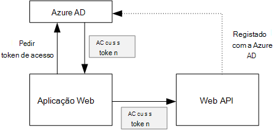
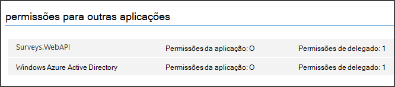

<properties
   pageTitle="Proteger uma back-end da web API numa aplicação multi-inquilino | Microsoft Azure"
   description="Como proteger uma back-end da web API"
   services=""
   documentationCenter="na"
   authors="MikeWasson"
   manager="roshar"
   editor=""
   tags=""/>

<tags
   ms.service="guidance"
   ms.devlang="dotnet"
   ms.topic="article"
   ms.tgt_pltfrm="na"
   ms.workload="na"
   ms.date="06/02/2016"
   ms.author="mwasson"/>

# <a name="securing-a-backend-web-api-in-a-multitenant-application"></a>Proteger uma back-end da web API numa aplicação multi-inquilino

[AZURE.INCLUDE [pnp-header](../../includes/guidance-pnp-header-include.md)]

Este artigo faz [parte de uma série]. Também existe uma [aplicação de exemplo] concluída que acompanha nesta série.

A aplicação de [Inquéritos brinquedos] utiliza uma back-end da web API para gerir as operações CRUD no inquéritos. Por exemplo, quando um utilizador clica "Inquéritos meus", a aplicação web envia um pedido de HTTP para a web API:

```
GET /users/{userId}/surveys
```

Web API devolve um objeto JSON:

```
{
  "Published":[],
  "Own":[
    {"Id":1,"Title":"Survey 1"},
    {"Id":3,"Title":"Survey 3"},
    ],
  "Contribute": [{"Id":8,"Title":"My survey"}]
}
```

Web API não permitir pedidos anónimos, para que a aplicação web tem autenticar utilizando tokens de tipo de ligação OAuth 2.

> [AZURE.NOTE] Este é um cenário de servidor a servidor. A aplicação não efetuar quaisquer chamadas AJAX à API a partir do cliente do browser.

Existem duas abordagens principais que pode tomar:

- Delegados identidade do utilizador. A aplicação web autentica com a identidade do utilizador.
- Identidade da aplicação. A aplicação web autentica com o seu ID de cliente, utilizar o fluxo de credenciais de cliente oauth2 ainda.

A aplicação de brinquedos implementa identidade do utilizador delegada. Estas são as diferenças principais:

**Identidade do utilizador delegada**

- A ligação OAuth enviado para a web API contém a identidade do utilizador.
- Web API torna decisões de autorização com base na identidade do utilizador.
- Tem a aplicação web processar 403 (proibido) erros a partir da web API, se o utilizador não está autorizado para efetuar uma ação.
- Normalmente, a aplicação web ainda torna algumas decisões de autorização que afetam IU, tal como mostrar ou ocultar elementos IU).
- A API web potencialmente pode ser utilizada pelo clientes ou não fidedignos, tal como uma aplicação de JavaScript ou uma aplicação de cliente nativa.

**Identidade da aplicação**

- Web API não obter informações sobre o utilizador.
- Web API não é possível executar qualquer autorização com base na identidade do utilizador. Todas as decisões de autorização são efetuadas pela aplicação web.  
- A API web não pode ser utilizada por um cliente ou não fidedigno (JavaScript ou aplicação nativa cliente).
- Esta abordagem poderá ser um pouco mais simples implementar, porque não existe nenhuma lógica de autorização da Web API do.

Quer abordagem, a aplicação web tem obter token de acesso, o que é a credencial necessária para a web API de chamadas.

- Para identidade de utilizador delegado, o token tem de vir de IDP, que pode emitir um token em nome de utilizador.

- Para introduzir as credenciais do cliente, uma aplicação poderá obter o token do IDP ou alojar o seu próprio token servidor. (Mas não escrever um servidor token de raiz; utilizar um quadro bem testado como [IdentityServer3].) Se autenticar com Azure AD, vivamente recomendado para obter o token de acesso a partir do Azure AD, mesmo com o fluxo de credenciais de cliente.

Os restantes este artigo assume que a aplicação estiver a autenticar com Azure AD.



## <a name="register-the-web-api-in-azure-ad"></a>Registar web API no Azure AD

Para Azure AD emitir um de ligação OAuth para a web API, é necessário configurar algumas coisas na Azure AD.

1. [Registe-se da web API no Azure AD].

2. Adicionar o ID da aplicação web do cliente para manifesto da aplicação web API, o `knownClientApplications` propriedade. Consulte o artigo [atualizar os manifestos de aplicações].

3. [Conceder a permissão de aplicação web para ligar a web API].

  No Portal de gestão do Azure, pode definir dois tipos de permissões: "Permissões de aplicação" para a identidade da aplicação (caudal de credenciais de cliente) ou "Delegada permissões" para identidade do utilizador delegado.

  

## <a name="getting-an-access-token"></a>Obter um token de acesso

Antes de chamar web API, a aplicação web obtém um acesso tokens a partir do Azure AD. Numa aplicação .NET, utilize o [Azure AD autenticação biblioteca (ADAL) para o .NET][ADAL].

No fluxo de código de autorização de OAuth 2, a aplicação de troca de um código de autorização para um token de acesso. O código seguinte utiliza ADAL para obter o token de acesso. Este código chama-se durante a `AuthorizationCodeReceived` evento.

```csharp
// The OpenID Connect middleware sends this event when it gets the authorization code.   
public override async Task AuthorizationCodeReceived(AuthorizationCodeReceivedContext context)
{
    string authorizationCode = context.ProtocolMessage.Code;
    string authority = "https://login.microsoftonline.com/" + tenantID
    string resourceID = "https://tailspin.onmicrosoft.com/surveys.webapi" // App ID URI
    ClientCredential credential = new ClientCredential(clientId, clientSecret);

    AuthenticationContext authContext = new AuthenticationContext(authority, tokenCache);
    AuthenticationResult authResult = await authContext.AcquireTokenByAuthorizationCodeAsync(
        authorizationCode, new Uri(redirectUri), credential, resourceID);

    // If successful, the token is in authResult.AccessToken
}
```

Aqui estão os vários parâmetros são necessárias:

- `authority`. Derivado do ID do inquilino do utilizador com sessão iniciada na. (Não o ID de inquilino do fornecedor SaaS)  
- `authorizationCode`. o código de auth que recebeu novamente a partir do IDP.
- `clientId`. ID de cliente. da aplicação web
- `clientSecret`. Secreta de cliente da aplicação web.
- `redirectUri`. O redirecionamento URI definido para OpenID ligar. Este é o local onde o IDP chamada de retorno com o token de.
- `resourceID`. A aplicação ID URI da web API, que criou quando se registou web API no Azure AD
- `tokenCache`. Um objeto que coloca em cache os tokens de acesso. Consulte o artigo [Token de colocação em cache].

Se `AcquireTokenByAuthorizationCodeAsync` ser bem sucedida, ADAL o token de coloca em cache. Mais tarde, pode obter o token da cache de ao contactar o suporte AcquireTokenSilentAsync:

```csharp
AuthenticationContext authContext = new AuthenticationContext(authority, tokenCache);
var result = await authContext.AcquireTokenSilentAsync(resourceID, credential, new UserIdentifier(userId, UserIdentifierType.UniqueId));
```

onde `userId` é o ID de objeto do utilizador, que se encontra na `http://schemas.microsoft.com/identity/claims/objectidentifier` reclamar.

## <a name="using-the-access-token-to-call-the-web-api"></a>Utilizar o token de acesso para ligar a web API

Assim que tiver o token, envie-o no cabeçalho da autorização de pedidos de HTTP para a web API.

```
Authorization: Bearer xxxxxxxxxx
```

O seguinte método de extensão a partir da aplicação de inquéritos define o cabeçalho de autorização um pedido de HTTP, utilizando a classe de **HttpClient** .

```csharp
public static async Task<HttpResponseMessage> SendRequestWithBearerTokenAsync(this HttpClient httpClient, HttpMethod method, string path, object requestBody, string accessToken, CancellationToken ct)
{
    var request = new HttpRequestMessage(method, path);
    if (requestBody != null)
    {
        var json = JsonConvert.SerializeObject(requestBody, Formatting.None);
        var content = new StringContent(json, Encoding.UTF8, "application/json");
        request.Content = content;
    }

    request.Headers.Authorization = new AuthenticationHeaderValue("Bearer", accessToken);
    request.Headers.Accept.Add(new MediaTypeWithQualityHeaderValue("application/json"));

    var response = await httpClient.SendAsync(request, ct);
    return response;
}
```

> [AZURE.NOTE] Consulte o artigo [HttpClientExtensions.cs].

## <a name="authenticating-in-the-web-api"></a>Autenticação da Web API

Tem web API para autenticar a ligação OAuth. No ASP.NET Core 1.0, pode utilizar o [Microsoft.AspNet.Authentication.JwtBearer] [ JwtBearer] pacote. Este pacote fornece software intermédio que permite que a aplicação receber OpenID ligar tokens de tipo de ligação.

Registe-se o software intermédio na sua web API `Startup` escolares.

```csharp
app.UseJwtBearerAuthentication(options =>
{
    options.Audience = "[app ID URI]";
    options.Authority = "https://login.microsoftonline.com/common/";
    options.TokenValidationParameters = new TokenValidationParameters
    {
        //Instead of validating against a fixed set of known issuers, we perform custom multi-tenant validation logic
        ValidateIssuer = false,
    };
    options.Events = new SurveysJwtBearerEvents();
});
```

> [AZURE.NOTE] Consulte o artigo [Startup.cs].

- **Audiência**. Defina esta opção para o URL de ID da aplicação para a web API, que criou quando se registou web API com Azure AD.
- **Autoridade**. Para uma aplicação multi-inquilino, defina esta opção para `https://login.microsoftonline.com/common/`.
- **TokenValidationParameters**. Para uma aplicação multi-inquilino, defina **ValidateIssuer** como false. Isto significa que a aplicação irá validar o emissor.
- **Eventos** é uma classe que deriva da **JwtBearerEvents**.

### <a name="issuer-validation"></a>Validação de emissor

Valide o emissor token no evento **JwtBearerEvents.ValidatedToken** . O emissor é enviado na afirmação de "iss".

Na aplicação inquéritos, web API não alça de [inscrição do inquilino]. Por conseguinte, basta verifica se o emissor já se encontra na base de dados de aplicação. Caso contrário,-inicia uma exceção, o que faz com que a falha da autenticação.

```csharp
public override async Task ValidatedToken(ValidatedTokenContext context)
{
    var principal = context.AuthenticationTicket.Principal;
    var tenantManager = context.HttpContext.RequestServices.GetService<TenantManager>();
    var userManager = context.HttpContext.RequestServices.GetService<UserManager>();
    var issuerValue = principal.GetIssuerValue();
    var tenant = await tenantManager.FindByIssuerValueAsync(issuerValue);

    if (tenant == null)
    {
        // the caller was not from a trusted issuer - throw to block the authentication flow
        throw new SecurityTokenValidationException();
    }
}
```

> [AZURE.NOTE] Consulte o artigo [SurveysJwtBearerEvents.cs].

Também pode utilizar o evento **ValidatedToken** fazer [em afirmações transformação]. Lembre-se de que as afirmações entram diretamente a partir do Azure AD, que se a aplicação web gravado quaisquer transformações de afirmações, aqueles não são refletidas de ligação OAuth que recebe web API.

## <a name="authorization"></a>Autorização

Para um debate geral da autorização, consulte [autorização baseadas no recurso e baseado em funções][Authorization]. 

O software JwtBearer intermédio trata as respostas de autorização. Por exemplo, para restringir uma ação de controlador para os utilizadores autenticados, utilize o atrribute **[autorizar]** e especificar **JwtBearerDefaults.AuthenticationScheme** como o esquema de autenticação:

```csharp
[Authorize(ActiveAuthenticationSchemes = JwtBearerDefaults.AuthenticationScheme)]
```

Isto devolve um código de 401 estado se o utilizador não é autenticado.

Para restringir uma ação de controlador pela authorizaton política, especifique o nome da política no atributo **[autorizar]** :

```csharp
[Authorize(Policy = PolicyNames.RequireSurveyCreator)]
```

Isto devolve um código de 401 estado se o utilizador não é autenticado e 403 se o utilizador for autenticado, mas não autorizado. Registe-se a política de arranque:

```csharp
public void ConfigureServices(IServiceCollection services)
{
    services.AddAuthorization(options =>
    {
        options.AddPolicy(PolicyNames.RequireSurveyCreator,
            policy =>
            {
                policy.AddRequirements(new SurveyCreatorRequirement());
                policy.AddAuthenticationSchemes(JwtBearerDefaults.AuthenticationScheme);
            });
    });
}
```

## <a name="next-steps"></a>Próximos passos

- Leia o seguinte artigo nesta série: [tokens de acesso de colocação em cache numa aplicação multi-inquilino][token cache]

<!-- links -->
[ADAL]: https://msdn.microsoft.com/library/azure/jj573266.aspx
[JwtBearer]: https://www.nuget.org/packages/Microsoft.AspNet.Authentication.JwtBearer
[parte de uma série]: guidance-multitenant-identity.md
[Brinquedos inquéritos]: guidance-multitenant-identity-tailspin.md
[IdentityServer3]: https://github.com/IdentityServer/IdentityServer3
[Registar web API no Azure AD]: https://github.com/Azure-Samples/guidance-identity-management-for-multitenant-apps/blob/master/docs/running-the-app.md#register-the-surveys-web-api
[Atualizar os manifestos de aplicação]: https://github.com/Azure-Samples/guidance-identity-management-for-multitenant-apps/blob/master/docs/running-the-app.md#update-the-application-manifests
[Conceder a permissão de aplicação web para ligar a web API]: https://github.com/Azure-Samples/guidance-identity-management-for-multitenant-apps/blob/master/docs/running-the-app.md#give-the-web-app-permissions-to-call-the-web-api
[A colocação em cache token]: guidance-multitenant-identity-token-cache.md
[HttpClientExtensions.cs]: https://github.com/Azure-Samples/guidance-identity-management-for-multitenant-apps/blob/master/src/Tailspin.Surveys.Common/HttpClientExtensions.cs
[Startup.CS]: https://github.com/Azure-Samples/guidance-identity-management-for-multitenant-apps/blob/master/src/Tailspin.Surveys.WebAPI/Startup.cs
[inscrição no inquilino]: guidance-multitenant-identity-signup.md
[SurveysJwtBearerEvents.cs]: https://github.com/Azure-Samples/guidance-identity-management-for-multitenant-apps/blob/master/src/Tailspin.Surveys.WebAPI/SurveyJwtBearerEvents.cs
[transformação em afirmações]: guidance-multitenant-identity-claims.md#claims-transformations
[Authorization]: guidance-multitenant-identity-authorize.md
[aplicação de exemplo]: https://github.com/Azure-Samples/guidance-identity-management-for-multitenant-apps
[token cache]: guidance-multitenant-identity-token-cache.md
