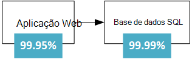
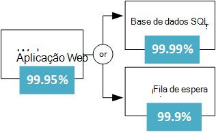
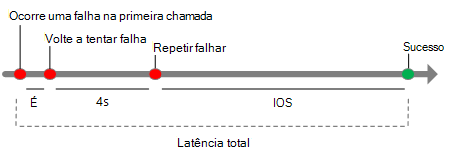
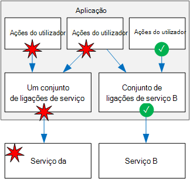

<properties
   pageTitle="Conceber aplicações e são | Microsoft Azure"
   description="Como criar aplicações e são no Azure, para a recuperação de disponibilidade e falhas alta."
   services=""
   documentationCenter="na"
   authors="MikeWasson"
   manager="christb"
   editor=""
   tags=""/>

<tags
   ms.service="guidance"
   ms.devlang="na"
   ms.topic="article"
   ms.tgt_pltfrm="na"
   ms.workload="na"
   ms.date="08/18/2016"
   ms.author="mwasson"/>
   
# Estruturar e são aplicações para o Azure

Num sistema distribuído, irão ocorrer falhas. Hardware pode falhar. A rede pode ter falhas breves. Raramente, um todo o serviço ou região pode experimentar uma interrupção, mas mesmo aqueles terá de ser planeados para. 

Criar uma aplicação fiável na nuvem é diferente de criação de uma aplicação fiável uma definição de empresa.  Enquanto historicamente pode ter comprado superior-end hardware escalar para cima, num ambiente na nuvem tem Dimensionar saída em vez de para cima. Os custos de ambientes de nuvem são mantidos baixos através da utilização de hardware do produto importante. Em vez de focar impedir falhas e otimizar os "hora média entre falhas", este novo ambiente o foco muda para "dizer tempo para restaurar". O objetivo é minimizar o impacto de uma falha.

Este artigo fornece uma descrição geral de como criar e são aplicações no Microsoft Azure. É iniciado com uma definição de termos *RDP* e conceitos relacionados. Em seguida, descreve um processo para alcançar RDP, utilizando uma abordagem estruturada durante a vida de uma aplicação para implementação e operações de estrutura e a aplicação.

## O que é RDP?

**RDP** é a capacidade de recuperar de falhas e continuar a funcionar. Não é sobre *evitar* falhas, mas *a responder* a falhas de uma forma que evite tempo de inatividade ou perda de dados. O objetivo da RDP é regressar à aplicação a um Estado de funcionamento totalmente após uma falha.

Dois aspetos importantes da RDP são elevada disponibilidade e recuperação de falhas.

- **Disponibilidade de alta** (HA) é a capacidade de aplicação para manter em execução num estado Saudável, sem tempo de inatividade significativo. Por "Saudável distrito," Pedimos significam que a aplicação está a responder e os utilizadores podem ligar à aplicação e interagir com o mesmo.  

- **Recuperação de falhas** (DR) é a capacidade de recuperar de incidentes raros mas principais: falhas não transitório, grande escala, tal como interrupção de serviço que afeta toda a região. Recuperação de falhas inclui cópia de segurança de dados e arquivo e pode incluir intervenção manual, tal como restaurar uma base de dados a partir de cópia de segurança. 

Uma forma a ter em conta sobre HA versus DR é DR é iniciado quando o impacto de uma falha de excede a capacidade da estrutura HA para processar o mesmo. Por exemplo, colocar em várias VMs atrás de um balanceador de carga irá fornecer disponibilidade se uma VM falhar, mas não se todos eles falharem ao mesmo tempo. 

Quando estrutura uma aplicação para ser e são, tem de compreender os seus requisitos de disponibilidade. Quanto tempo de inatividade for aceitável? Este parcialmente é uma função do custo. Quanto tempo de inatividade potencial irá custar o seu negócio? Quanto devo investir em tornar a aplicação altamente? Também tem de definir o que significa para a aplicação esteja disponível. Por exemplo, é a aplicação "premida" se um cliente pode submeter uma ordem, mas o sistema não é possível processá-lo no período de tempo normal?

Outro termo comuns é **continuidade do negócio** (BC), que é a capacidade de executar funções de negócio essenciais durante e após uma falhas. BC abrange toda a operação da empresa, incluindo instalações físicas, pessoas, comunicações, transportes, e IT. Neste artigo, podemos são apenas com o foco nas aplicações de nuvem, mas resistência planeamento tem de ser executada no contexto dos requisitos de BC globais. 

## Processo para alcançar RDP

RDP não é um suplemento. Tem de ser concebido para o sistema e pôr em prática operacional. Eis um modelo de geral a seguir:

1.  **Definir** a seus requisitos de disponibilidade, com base nas necessidades de negócio

2.  **Estrutura** a aplicação para resiliência. Começar com uma arquitetura de que se segue práticas provas dadas e, em seguida, identificar os pontos-falha possíveis essa arquitectura.

3.  **Implementar** estratégias para detetar e recuperar de falhas. 

4.  **Teste** a aplicação pela simulação falhas e acionar activações pós-falha forçada. 

5.  **Implementar** a aplicação para utilizar um processo fiável de forma repetido de produção. 

6.  **Monitor** a aplicação para detetar falhas. Através da monitorização do sistema, pode avaliar o estado de funcionamento da aplicação e responder a incidentes se for necessário. 

7.  **Responder** se existirem incidentes que requerem intervenção manual.

No restante deste artigo, discutimos de cada um destes passos mais detalhadamente.

## Definir os seus requisitos de RDP

Planeamento de RDP começa com necessidades de negócio. Aqui estão algumas abordagens para pensar em RDP nesses termos.

### Decomposição pela carga de trabalho

Soluções de nuvem muitos é constituída por vários aplicação das cargas de trabalho. Significa que o termo "carga de trabalho" neste contexto uma funcionalidade descontínuos ou tarefa computação, que pode ser logicamente separada a partir de outras tarefas, em termos de requisitos de armazenamento de lógica e dados de negócio. Por exemplo, uma aplicação de comércio electrónico poderão incluir as cargas de trabalho seguintes:

- Procurar e procure um catálogo de produtos.

- Criar e controlar as encomendas.

- Ver recomendações.

Estas cargas de trabalho poderão ter requisitos diferentes relativamente a disponibilidade, escalabilidade, consistência dos dados, recuperação de falhas e assim sucessivamente. Novamente, estes são decisões de negócio.

Também em consideração os padrões de utilização. Existem certos períodos críticos quando o sistema tem de estar disponível? Por exemplo, um serviço de arquivo de imposto não é possível passar para baixo à direita antes do prazo de arquivamento com; um vídeo transmissão serviço tem concentre-se para cima durante um evento de desporto grande; e assim sucessivamente. Durante os períodos críticos, poderá ter de implementações redundantes através de vários regiões, para que a aplicação poderá falhar ao longo do se Ocorreu uma falha de uma região. No entanto, uma implementação da região com várias é mais dispendiosa, para que durante as horas menos críticas, poderá executar a aplicação numa única região.  

### RTO e RPO

Duas métricas importantes a ter em consideração são as objectivo de tempo de recuperação e objectivo de ponto de recuperação:

- **Objectivo de tempo de recuperação** (RTO) é o tempo máximo aceitável que uma aplicação pode não estar disponível após um incidente. Se o RTO 90 minutos, tem de conseguir restaurar a aplicação a um Estado em execução no prazo de 90 minutos desde o início de uma falhas. Se tiver um RTO muito baixo, pode manter uma segunda implementação automática e continuamente em execução no modo de espera, a proteger contra uma falha de regional.

- **Recuperação aponte objectivo** (RPO) é a duração máxima de perda de dados for aceitável durante uma falhas. Por exemplo, se armazenar dados numa base de dados simples, com sem replicação para outras bases de dados e efetuar cópias de segurança horárias, poderá perder até uma hora de dados. 

RTO e RPO são necessidades de negócio. Métrica comuns outra é **tempo médio para recuperar** (MTTR), que é o média tempo que demora para restaurar a aplicação após uma falha. MTTR é um facto empírico acerca de um sistema. Se MTTR exceder o RTO, em seguida, uma falha de sistema provocará uma interrupção empresas aceitável, uma vez que não será possível restaurar o sistema dentro de RTO definido. 

### SLA

No Azure, o [Contrato de nível de serviço] [ sla] (SLA) descreve compromissos da Microsoft para o tempo útil e conectividade. Se SLA para um determinado serviço 99,9%, significa que deve esperar o serviço esteja disponível 99,9% das vezes.

> [AZURE.NOTE] O Azure SLA também inclui disposições para obter um crédito serviço se o SLA não for cumprida, juntamente com definições específicas do "disponibilidade" para cada serviço. Aspecto do SLA age como uma política de imposição. 

Deve definir o seu próprio destino SLA para cada carga de trabalho na sua solução. Um SLA torna possível a razão sobre a arquitetura, e se a arquitetura cumpra os requisitos de negócio. Por exemplo, se uma carga de trabalho requer o tempo de utilização de 99,99%, mas depende de um serviço com um SLA 99,9%, desse serviço não pode ser um único ponto de falha do sistema. É um recurso ter um caminho de contingência no caso de falha do serviço, ou realizar outras medidas para recuperar a partir de uma falha desse serviço. 

A tabela seguinte mostra o tempo de inatividade cumulativo potencial para vários níveis de SLA. 

| SLA     | Tempo de inatividade por semana | Tempo de inatividade por mês | Tempo de inatividade por ano |
|---------|-------------------|--------------------|-------------------|
| 99%     | horas 1.68        | horas 7.2          | 3.65 dias         |
| 99,9%   | minutos 10,1      | minutos 43.2       | horas 8.76        |
| 99.95%  | 5 minutos         | minutos 21,6       | horas 4,38        |
| 99,99%  | minutos 1.01      | minutos 4.32       | minutos 52.56     |
| 99,999% | 6 segundos         | segundos 25,9       | minutos 5.26      |

Obviamente, maior disponibilidade é melhor, tudo o que outra ser igual. Mas, à medida que esforça-se para obter mais 9s, o custo e complexidade para alcançar esse nível de disponibilidade cresce. Converte um tempo de utilização de 99,99% para cerca de 5 minutos de tempo de inatividade total por mês. Vale-lo a complexidade adicional e custo para alcançar cinco 9s? A resposta depende aos requisitos de negócio. 

Aqui estão algumas outras considerações quando definir um SLA:

- Para alcançar quatro 9 (99,99%), provavelmente não pode depender intervenção manual para recuperar a partir de falhas. A aplicação tem de ser personalizada diagnosticar e recuperação automática. 

- Para além do quatro 9, é um desafio para detetar falhas rapidamente suficiente para cumprir o SLA.

- Pense na janela de tempo que seu SLA é medido contra. O mais pequena janela do, quanto maior a tolerância. Provavelmente não faz sentido para definir o seu SLA em termos de tempo de utilização de hora a hora ou diariamente. 

### SLA compostas

Considere a hipótese de um aplicação de serviço web app que escreve para a base de dados do SQL Azure. No momento deste escrita, estes serviços Azure tem as seguintes SLA:

- Aplicação de serviço Web Apps = 99.95%

- Base de dados SQL = 99,99%

O que é o máximo tempo de inatividade que seria esperado para esta aplicação? Se um dos serviço falhar, toda a aplicação falhará. Em geral, a probabilidade de falha de cada serviço seja independente, por isso o SLA composta para esta aplicação é 99.95% x 99,99% = 99.94%. Que for inferior a SLA individuais, que não é surpreendente, porque tem de uma aplicação que baseia-se em vários serviços mais potenciais pontos de falha. 

Por outro lado, pode melhorar o SLA composta através da criação de caminhos de contingência independentes. Por exemplo, se a base de dados SQL não estiver disponível, colocar transações na fila de espera, para ser processada mais tarde.

Com este design, a aplicação ainda está disponível mesmo se não consegue ligar-se à base de dados. Falha no entanto, se a base de dados e a fila falharem ao mesmo tempo. A percentagem de tempo de uma falha de simultânea esperada é 0,0001 × 0,001, por isso, o SLA composta para este caminho combinado  

- Fila de base de dados ou = 1.0 &minus; (0,0001 &times; 0,001) = 99.99999%

O total SLA composta é:

- Web app e (fila ou de base de dados) = 99.95% &times; 99.99999% = ~99.95%

Mas existem concessões desta abordagem. Lógica da aplicação é mais complexa, estiver a pagar para a fila e podem existir problemas de consistência de dados a ter em conta.

**SLA para implementações da região com várias**. Outra HA técnica é implementar a aplicação mais do que uma região e utilizar o Gestor de tráfego de Azure para falhar sobre se a aplicação falhar numa região. Para uma implementação de região de dois a SLA composta é calculado da seguinte forma. 

Permitir que *N* ser o SLA composta para a aplicação de implementado numa região. É o esperado hipótese de que a aplicação irá falhar em ambas as regiões ao mesmo tempo (1 &minus; N) &times; (1 &minus; N). Por conseguinte,

- Combinados SLA ambas as regiões = 1 &minus; (1 &minus; N) (1 &minus; N) = N + (1 &minus; N) N

Por fim, tem factor a [SLA para o Gestor de tráfego][tm-sla]. Partir quando este artigo foi escrito, SLA para o Gestor de tráfego SLA é 99,99%.

- SLA composta = 99,99% &times; (combinado SLA ambas as regiões)

Um detalhe mais é que uma falha ao longo do não é instantânea, que pode resultar numa algum tempo de inatividade durante uma activação pós-falha. Consulte o artigo [monitorização do Gestor de tráfego de ponto final e activação pós-falha][tm-failover].

O número de SLA calculado é uma linha de base útil, mas não conta toda a história sobre a disponibilidade. Muitas vezes, uma aplicação pode prejudicar correctamente quando um caminho não crítico falha. Considere a hipótese de uma aplicação que mostra um catálogo de livros. Se a aplicação não é possível obter a imagem em miniatura para a capa, poderá mostrar uma imagem de marcador de posição. Nesse caso, a falhar obter a imagem não reduzir o tempo de utilização da aplicação, embora-afeta a experiência do utilizador.  

## Estruturar para RDP

Durante a fase de estrutura, deve efetuar uma análise de modo a falha (FMA). O objetivo de um FMA é identificar possíveis pontos de falha e definir como a aplicação irá responder a essas falhas.

- Como é que a aplicação irá detectar este tipo de falha?

- Como a aplicação irá responder a este tipo de falha?

- Como irá iniciar sessão e monitorizar este tipo de falha? 

Para obter mais informações sobre o processo FMA, com as recomendações específicas para Azure, consulte o artigo [orientações RDP Azure: análise de modo a falha][fma].

### Exemplo de identificar estratégia de deteção e modos de falha

**Ponto de falha:** Ligar a um serviço web externo / API.

| Modo de falha | Estratégia de deteção |
|--------------|--------------------|
| Serviço não está disponível | HTTP 5xx |
| Limitação | HTTP 429 (pedidos demasiadas) | 
| Autenticação | HTTP 401 (não autorizado) | 
| Resposta lenta | Pedido de tempo limite |

## Estratégias de RDP

Esta secção fornece um inquérito de algumas estratégias RDP comuns. A maior parte destas não está limitados a uma determinado tecnologia. As descrições nesta secção destinam-se para resumir a ideia geral atrás de cada técnica, com ligações para leitura adicional.

### Volte a tentar breves falhas

Falhas breves podem ser causadas por momentânea perda de conectividade de rede, uma ligação de base de dados capitulada ou um limite de tempo, quando um serviço está ocupado. Muitas vezes, uma falha de breves pode ser resolvida repetindo simplesmente o pedido. Para muitos serviços Azure, o cliente SDK implementa tentativas automáticas, de uma forma que é transparente para o autor da chamada; consulte o artigo [Repetir orientações específicas do serviço][retry-service-specific guidance].

Cada tentativa de repetir adiciona a latência total. Além disso, demasiados pedidos falhados podem causar um congestionamento, tal como pedidos pendentes se acumulem na fila de espera. Estes pedidos bloqueados poderão mantenha a tecla de recursos de sistema críticos, tais como memória, tópicos, ligações de base de dados e assim sucessivamente, pode causar falhas em cascata. Para evitar esta situação, aumentar o atraso entre cada tentativa de repetir e limitar o número total de pedidos de falhados.

Para obter mais informações, consulte o artigo [Repetir padrão][retry-pattern].

### Balanceamento de carga em várias instâncias

Escalabilidade, uma aplicação de nuvem deverá poder Dimensionar saída ao adicionar mais instâncias. Esta abordagem melhora também RDP, uma vez que podem ser tidos instâncias danificadas terminar rotação.  

Por exemplo:

- Coloque VMs duas ou mais atrás de um balanceador de carga. O Balanceador de carga distribuir o tráfego para todos os as VMs. Consulte o artigo [executar várias VMs no Azure para escalabilidade e disponibilidade][ra-multi-vm].

- Dimensionar saída de uma aplicação de serviço de aplicação do Azure a várias instâncias. Aplicação de serviço de balanceamento de carga automaticamente em várias instâncias. Consulte o artigo [aplicação web básicas][ra-basic-web].

- Utilizar o [Gestor de tráfego Azure] [ tm] para distribuir o tráfego através de um conjunto de pontos finais.

### Criar uma réplica dados

Replicação de dados é uma estratégia de geral para processar falhas não transitório num arquivo de dados. Tecnologias de armazenamento muitos fornecem replicação incorporada, incluindo a base de dados do SQL Azure, DocumentDB e Apache Cassandra.  

É importante ter em consideração tanto a leitura e escrita caminhos. Consoante a tecnologia de armazenamento, pode ter várias réplicas graváveis, ou uma única réplica gravável e várias réplicas só de leitura. 

Para mais alta disponibilidade, réplicas podem ser colocadas em várias regiões. No entanto, isto aumenta a latência para criar uma réplica os dados. Normalmente, replicação entre as regiões é feito forma assíncrona, que implica um modelo de consistência eventual e a possível perda de dados se uma réplica falhar. 

### Diminuir

Se um serviço falha e não existe nenhuma caminho activação pós-falha, a aplicação talvez consiga diminuir, desta forma, de uma forma que ainda fornece uma experiência de utilizador aceitável. Por exemplo:

- Coloca um item de trabalho na fila de espera, para ser executada mais tarde. 

- Devolve um valor estimado 

- Utilize dados em cache local. 

- Mostrar o utilizador uma mensagem de erro. (Esta opção é melhor do que está a ter de parar de aplicação responder aos pedidos.)

### Optimizar os utilizadores de grande volume

Por vezes, um pequeno número de utilizadores cria carga excessiva. Que pode ter um impacto noutros utilizadores, reduzir a disponibilidade geral da sua aplicação.

Quando um único cliente faz com que um número de pedidos excessivo, a aplicação poderá optimizar o cliente para um determinado período de tempo. Durante o período optimização, a aplicação recusa alguns ou todos os pedidos de que o cliente (consoante a estratégia optimização exata). O limiar de para limitação poderá dependem camada de serviços do cliente. 

Limitação não implica que o cliente necessariamente foi serve forma maliciosa. Apenas significa que o cliente excedido quota de serviço.  Em alguns casos, um consumidor poderá forma consistente exceder quota ou caso contrário, se comportam mal. Nesse caso, poderá ainda mais aceda e bloquear o utilizador. Normalmente, isto é feito, bloqueando uma tecla de API ou um intervalo de endereços IP.

Para obter mais informações, consulte o artigo [Limitação padrão][throttling-pattern].

### Utilizar um separador de palavras de circuito  

O separador de palavras de circuito padrão pode impedir que uma aplicação tentar repetidamente uma operação que é provável que provocam a falha. A analogia é uma física circuito separador de palavras, um parâmetro que interrompe o fluxo de atual quando um circuito está sobrecarregado.

Separador de circuito é moldado chamadas para um serviço. Tem três Estados:

- **Fechado**. Este é o estado normal. Separador de circuito envia pedidos de serviço e um contador controla o número de insucessos recentes. Se a contagem de falhas exceder um determinado limiar dentro de um determinado período de tempo, o separador de circuito muda para o estado de aberta. 

- **Abrir**. Neste estado, o separador de circuito falha imediatamente todos os pedidos, sem chamar o serviço. A aplicação deve utilizar um caminho de mitigação, tal como ler dados a partir de uma réplica ou simplesmente devolver um erro ao utilizador. Quando o separador de circuito muda para a abrir, desde o início um temporizador. Quando o temporizador expira, separador de circuito muda para o estado de meia abrir.

- **Meia abrir**. Neste estado, o separador de circuito permite um número limitado de pedidos de percorrer para o serviço. Se estes ser concluída com êxito, o serviço é considerado ser recuperadas e separador de circuito muda para o estado de fechada. Caso contrário, reverte para o estado de aberta. O estado de meia abrir impede inesperadamente inundated com pedidos de um serviço de recuperação.

Para obter mais informações, consulte o artigo [Padrão do separador de palavras de circuito][circuit-breaker-pattern].

### Utilizar o nivelamento de carga para lisa saída picos no tráfego

Aplicações poderão ocorrer repentina sobre picos no tráfego, o que pode sobrecarregar serviços no back-end. Se um serviço de back-end não consegue responder aos pedidos de rapidamente suficiente,-pode causar os pedidos de fila de espera (novamente para cima) ou, provocar a acelerar a aplicação do serviço.

Para evitar esta situação, pode utilizar uma fila como um intervalo de tempo. Quando existe um novo item de trabalho, em vez de chamar o serviço de back-end imediatamente, a aplicação filas um item de trabalho para executar o modo assíncrono. Fila de espera age como um intervalo de tempo suaviza saída picos a carregar. 

Para obter mais informações, consulte o artigo [baseados em filas padrão de nivelamento de carga][load-leveling-pattern].

### Identificar recursos críticos 

Falhas num subsystem podem, por vezes, em cascata, a causar falhas no outras peças da aplicação. Isto pode acontecer se uma falha de faz com que alguns recursos, como threads ou sockets, não para obter o libertar de forma atempada, levando a esgotamento de recursos. 

Para evitar esta situação, pode partição um sistema isoladas em grupos, para que uma falha de uma partição não para baixo a totalidade do sistema. Esta técnica denomina-se, por vezes, o padrão de antepara.

Exemplos:

- Crie a partições uma base de dados – por exemplo, por inquilino – e atribuir um conjunto diferente de instâncias do servidor web para cada partição.  
- Utilize agrupamentos de threads separada para identificar chamadas para os diferentes serviços. Isto ajuda a evitar falhas em cascata, se um dos serviços na falhar. Por exemplo, consulte o artigo Netflix [Hystrix biblioteca][hystrix].

- Utilize [contentores] [ containers] para limitar os recursos disponíveis para uma determinada subsystem. 

### Aplicar compensadores transações 

Uma operação compensador é uma operação que anula os efeitos da outra transação concluída.

Num sistema distribuído, pode ser muito difícil alcançar forte consistência transaccional. Transações compensadores são uma forma para alcançar consistência utilizando uma série de transações mais pequenas e individuais que podem ser anuladas em cada passo.

Por exemplo, para uma viagem do livro, um cliente poderá reserva um carro, uma sala de hotel e um voo. Se algum destes passos falhar, toda a operação falhará. Em vez de a tentar utilizar uma única transação distribuída para toda a operação, pode definir uma transação compensador para cada passo. Por exemplo, para anular uma reserva de carro, cancelar a reserva. Para concluir a operação toda, um coordenador executa cada passo. Se qualquer um dos passos falhar, o coordenador aplica-se compensadores transações para anular quaisquer passos que foram concluídos. 

Para obter mais informações, consulte o artigo [Compensadores padrão da transação][compensating-transaction-pattern]. 

## Testes de RDP

Em geral, não é possível teste RDP da mesma forma que teste a funcionalidade da aplicação (ao executar os testes de unidade e assim sucessivamente). Em vez disso, tem de testar como a carga de trabalho do fim para fim executa condições falha, que, por definição, não ocorrer todos a hora.

Testes faz parte de um processo iterativo. Testar a aplicação, medir o resultado, analisar e corrigir falhas de resultam e repita o processo.

**Falhas testes de introdução**. Teste RDP do sistema para falhas, por acionar falhas reais ou através da simulação-los. Eis alguns cenários de falha comuns para testar:

- Encerre instâncias VM.

- Processos uma falha de sistema.

- Expire certificados.

- Teclas de acesso de alteração.

- Encerre o serviço DNS em controladores de domínio.

- Limitar os recursos de sistema disponíveis, tal como RAM ou número de threads.

- Desmonte discos.

- Implementar uma VM.

Medir as horas de recuperação e certifique-se de que cumpram as necessidades de negócio. Teste as combinações de modos de falha, também. Certifique-se de que não cascata falhas e são processadas de forma isolada.

Este é outro motivo por que motivo é importante analisar os pontos de falha possíveis durante a fase de estrutura. Os resultados da análise do que devem ser entradas para o seu plano de teste.

**Testes de carregamento**. Carregar teste a aplicação utilizar uma ferramenta de como o [Visual Studio equipa Services] [ vsts] ou [Apache JMeter] [ jmeter] testes de carga são fundamental para identificar falhas apenas ocorrem em caso de carga, tal como a base de dados back-end a ser sise ou limitação de serviço. Teste de carregamento de pico, utilizando dados de produção ou síntese dados que estão perto dados de produção possível. O objetivo é ver como a aplicação comporta-se em condições reais.   

## Implementação e são

Depois de uma aplicação é implementada produção, as atualizações são uma fonte possível de erros. No caso de pior, uma atualização incorretas pode causar tempo de inatividade. Para evitar esta situação, o processo de implementação tem de ser previsíveis e possa ser repetida. Implementação inclui aprovisionamento recursos Azure, implementar código da aplicação e aplicar as definições de configuração. Uma atualização pode implicar todos os três ou um subconjunto. 

O ponto de crucial é que implementações manuais são passível de erro. Por conseguinte, recomenda-tem de ter um processo de idempotent automatizado, que pode executar a pedido e voltar a executar se algo irá falhar. 

- Utilize modelos de Gestor de recursos para automatizar aprovisionamento de recursos Azure.

- Utilizar [A configuração de estado pretendido do Azure automatização] [ dsc] (DSC) para configurar VMs.

- Utilize um processo de implementação automatizada para o código de aplicação.

Implementação de relacionado com e são conceitos duas são *infraestrutura como código* e *infraestrutura imutáveis*.

- **Infraestrutura como código** é prática da utilização de código para aprovisionar e configurar infraestrutura. Infraestrutura como código pode utilizar uma abordagem declarativa ou uma abordagem de obrigatório (ou uma combinação de ambos). Os modelos de Gestor de recursos são um exemplo de uma abordagem declarativa. Scripts de PowerShell são um exemplo de uma abordagem de obrigatório.

- **Infraestrutura imutáveis** é o princípio de que não deva modificar infraestrutura após for implementado produção. Caso contrário, pode aceder a um Estado onde ad hoc alterações foram aplicadas, pelo que é difícil saber exatamente o que mudou e difíceis de razão acerca do sistema. 

Outra pergunta é como implementar o uma atualização de aplicação. Recomendamos que técnicas como azul e verde implementação ou lançamentos das Canárias emissão atualizações no altamente controlado forma para minimizar impactos possíveis a partir de uma implementação incorretas.

- [Implementação de azul e verde] [ blue-green] é uma técnica onde implementar uma atualização num ambiente de produção separadas da aplicação direto. Depois de validar a implementação, mude o encaminhamento de tráfego para a versão actualizada. Por exemplo, Azure aplicação de serviço Web Apps permite que este com [faixas de transição][staging-slots]. 

- [Versões das Canárias] [ canary-release] são semelhantes a implementação de azul e verde. Em vez de mudar todo o tráfego para a versão actualizada, pode implementar o a atualização para uma pequena percentagem de utilizadores, por encaminhamento de uma parte do tráfego para a implementação de nova. Se existir um problema, terminar e reverter para a implementação antiga. Caso contrário, encaminhe tráfego mais para a nova versão, até que obtém a 100% de tráfego.

Independentemente da sua abordagem tomar, certifique-se de que pode reverter para a última conhecidos boa-implementação, caso a nova versão não está a funcionar. Além disso, se ocorrerem erros, tem de ser possível ver a partir de registos da aplicação qual a versão causado o erro. 

## Monitorização e diagnóstico

Monitorização e diagnóstico é fundamental para RDP. Se alguma coisa falhar, tem de saber que tiver falhado e necessita de informações para a causa da falha. 

Monitorização de um sistema distribuído em grande escala coloca um desafio significativo. Pense uma aplicação que é executada no alguns seis VMs – não é prático iniciar sessão para cada VM, uma de cada vez e procure nas ficheiros de registo, está a tentar resolver um problema. Além disso, o número de ocorrências VM provavelmente não é estático. VMs obtenham adicionados e removidos como as escalas de aplicação e reduzir e ocasionalmente uma instância poderá falhar e precisa de sincronização será aprovisionado. Além disso, uma aplicação de nuvem típica poderá utilizar vários arquivos de dados (armazenamento Azure, base de dados SQL, DocumentDB, Redis cache) e uma ação único utilizador pode abranger vários subsistemas. 

Poderá pensar o processo de monitorização e diagnósticos de como uma tubagem com várias fases distintas:

- **Instrumentação**. Inclui os dados não processados de monitorização e diagnósticos de uma variedade de origens, incluindo registos da aplicação, os registos do servidor web, contadores de desempenho SO, registos de base de dados e diagnósticos incorporados na plataforma Azure. Serviços mais Azure têm uma funcionalidade de diagnóstico que pode utilizar para descobrir a causa de problemas.

- **Recolha e armazenamento**. Os dados não processados instrumentação podem ser mantidos numa variedade de localizações e com formatos variados (registos de rastreio de aplicação, contadores de desempenho, registos do IIS). Estas origens diferentes são recolhidas, consolidadas e colocar em armazenamento fiável.

- **Análise e diagnóstico**. Depois dos dados são consolidados, pode ser analisada, para poder resolução de problemas e forneça uma visão geral do Estado de funcionamento da aplicação.

- **Visualização e alertas**. Nesta fase, dados de telemetria são apresentados uma forma a que um operador pode rapidamente spot tendências ou problemas. Exemplo incluem dashboards ou correio eletrónico.  

Monitorização é diferente de deteção de falha. Por exemplo, a sua aplicação poderá detetar uma transitória erro e volte a tentar, que resulta em sem tempo de inatividade. Mas deverá também iniciar a operação de repetir, para que pode monitorizar a taxa de erro, para obter uma visão geral do Estado de funcionamento da aplicação. 

Os registos de aplicação são uma origem de dados de diagnóstico importante. Aqui estão algumas das melhores práticas para o registo de aplicação:

- Inicie sessão no produção. Caso contrário, perderá conhecimentos aprofundados alturas muito quando precisar dele mais.

- Inicie sessão eventos em limites de serviço. Inclua um ID de correlação que se desloca ao longo dos limites de serviço. Se transação X fluxos através de vários serviços e uma das falha-las, o ID de correlação irá ajudá-lo pinpoint razão pela qual a transação falhou.

- Utilizar semântico registo, também denominado estruturada registo. Registos não estruturados certifique disco rígido automatizar a consumo e a análise de dados do registo, o que são necessária uma escala de nuvem.

- Utilize o registo assíncrono. Caso contrário, o próprio sistema de registo pode causar a falha ao causar pedidos para trás para cima, tal como bloquear a aguardar para escrever um evento de registo na aplicação.

- Registo da aplicação não é igual a auditoria. Auditoria pode ser feita por razões de regulamentação ou conformidade. Como tal, registos de auditoria tem de ser concluídos e não é acceptible largar qualquer durante o processamento de transações. Se necessitar de uma aplicação de auditoria, isto deve ser mantido em separada do registo de diagnóstico. 

Para obter mais informações sobre como monitorizar e diagnósticos, consulte [orientações de monitorização e diagnóstico][monitoring-guidance].

## Respostas de falha manual

Secções anteriores tem com o foco nas estratégias de recuperação automática, que são críticas para elevada disponibilidade. No entanto, é necessário intervenção, por vezes, manual.

- **Alertas**. Monitorize a sua aplicação de sinais de perigo que precisem de intervenção meio ativa. Por exemplo, se vir que base de dados SQL ou DocumentDB forma consistente acelera os a aplicação, poderá ter de aumentar a sua capacidade de base de dados ou otimizar as suas consultas. Neste exemplo, apesar da aplicação poderá processar transparente, os erros optimização seu telemetria deve ainda aumentar um alerta, para que possa dar seguimento.  

- **Manual activação pós-falha**. Alguns sistemas não podem falhar ao longo do automaticamente e exigir uma activação manual pós-falha. 

- **Testes de disponibilidade operacional**. Se a sua aplicação falhar sobre para uma região secundária, deve executar um teste de disponibilidade operacional antes de falhar voltar à região de principal. O teste deve verificar que a região primária é saudável e pronto para receber tráfego novamente.

- **Verificar a consistência dos dados**. Se uma falha de acontece num arquivo de dados, poderão existir inconsistências de dados quando o arquivo de fica disponível novamente, especialmente se foram replicados os dados. 

- **Restaurar a partir de cópia de segurança**. Por exemplo, se a base de dados SQL experiências uma falha de regional, pode geo-restaurar a base de dados da cópia de segurança mais recente.

Documentar e testar o seu plano de recuperação de falhas. Incluir escritos procedimentos para quaisquer passos manuais, tal como falha na ligação manual, restaurar dados a partir de cópias de segurança e assim sucessivamente. 

## Resumo

Este artigo visualizou RDP a partir de uma perspetiva holística, realçando algumas dos desafios exclusivos da nuvem. Estas incluem da natureza distribuída da nuvem computação, a utilização de hardware do produto importante e a presença de falhas de rede transience.

Eis os principais pontos de afastam neste artigo:

- RDP leva a disponibilidade superior e inferior de média de hora para recuperar da falhas. 

- Uma RDP na nuvem requer um conjunto diferente de técnicas de soluções tradicional no local. 

- RDP não acontecer ao acidente. Tem de ser concebido e integrado do início.

- RDP toca cada parte do ciclo de vida aplicação, a partir de planeamento e operações de codificação.

- Teste e monitor!

## Próximos passos

- [Lista de verificação RDP] [ resiliency-checklist] contém um recomendações que irão ajudá-lo a planear uma variedade de modos de falha que podem ocorrer.

- [Análise de modo a falha] [ fma] (FMA) é um processo para criar RDP para um sistema, identificando pontos de falha possíveis. Como ponto de partida para o processo de FMA, este artigo contém um catálogo potenciais modos de falha e os respetivos atenuações. 

- Pode encontrar aqui recursos adicionais: [orientações técnicas RDP Azure](../resiliency/resiliency-technical-guidance.md) 

<!-- links -->

[blue-green]: http://martinfowler.com/bliki/BlueGreenDeployment.html
[canary-release]: http://martinfowler.com/bliki/CanaryRelease.html
[circuit-breaker-pattern]: https://msdn.microsoft.com/library/dn589784.aspx
[compensating-transaction-pattern]: https://msdn.microsoft.com/library/dn589804.aspx
[containers]: https://en.wikipedia.org/wiki/Operating-system-level_virtualization
[dsc]: https://azure.microsoft.com/documentation/articles/automation-dsc-overview/
[fma]: guidance-resiliency-failure-mode-analysis.md
[hystrix]: http://techblog.netflix.com/2012/11/hystrix.html
[jmeter]: http://jmeter.apache.org/
[load-leveling-pattern]: https://msdn.microsoft.com/library/dn589783.aspx
[monitoring-guidance]: https://azure.microsoft.com/documentation/articles/best-practices-monitoring/
[ra-basic-web]: https://azure.microsoft.com/documentation/articles/guidance-web-apps-basic/
[ra-multi-vm]: https://azure.microsoft.com/documentation/articles/guidance-compute-multi-vm/
[resiliency-checklist]: guidance-resiliency-checklist.md
[retry-pattern]: https://msdn.microsoft.com/library/dn589788.aspx
[retry-service-specific guidance]: https://azure.microsoft.com/documentation/articles/best-practices-retry-service-specific/
[sla]: https://azure.microsoft.com/support/legal/sla/
[staging-slots]: https://azure.microsoft.com/documentation/articles/guidance-web-apps-basic/
[throttling-pattern]: https://msdn.microsoft.com/library/dn589798.aspx
[tm]: https://azure.microsoft.com/services/traffic-manager/
[tm-failover]: https://azure.microsoft.com/documentation/articles/traffic-manager-monitoring/
[tm-sla]: https://azure.microsoft.com/support/legal/sla/traffic-manager/v1_0/
[vsts]: https://www.visualstudio.com/features/vso-cloud-load-testing-vs.aspx
