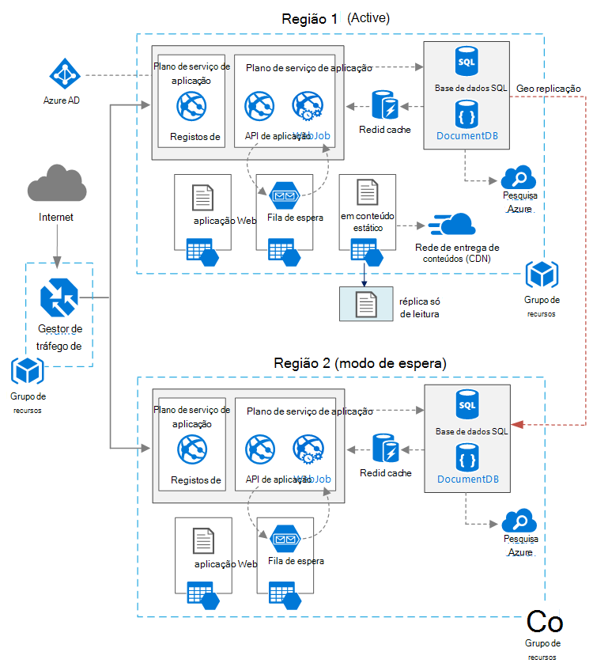

<properties
   pageTitle="Aplicação Web com elevada disponibilidade | Arquitetura de referência Azure | Microsoft Azure"
   description="Arquitetura de recomendados para a aplicação web com elevada disponibilidade, em execução no Microsoft Azure."
   services="app-service,app-service\web,sql-database" 
   documentationCenter="na"
   authors="MikeWasson"
   manager="roshar"
   editor=""
   tags=""/>

<tags
   ms.service="guidance"
   ms.devlang="na"
   ms.topic="article"
   ms.tgt_pltfrm="na"
   ms.workload="na"
   ms.date="06/27/2016"
   ms.author="mwasson"/>

# <a name="azure-reference-architecture-web-application-with-high-availability"></a>Arquitetura de referência Azure: aplicação Web com elevada disponibilidade

[AZURE.INCLUDE [pnp-RA-branding](../../includes/guidance-pnp-header-include.md)]

Este artigo mostra uma arquitetura de recomendado para uma aplicação web com elevada disponibilidade, em execução no Microsoft Azure. A arquitetura constrói [arquitetura de referência Azure: melhorar escalabilidade numa aplicação web][guidance-web-apps-scalability].

## <a name="architecture-diagram"></a>Diagrama de arquitectura



Esta arquitetura constrói naquele apresentado no [aumentar escalabilidade numa aplicação web][guidance-web-apps-scalability]. Principais diferenças são:

- **Regiões principais e secundários**. Esta arquitetura utiliza duas regiões para alcançar maior disponibilidade. A aplicação é implementada para cada regiões. Durante as operações normais, o tráfego de rede é encaminhado para a região principal. Mas se que ficar disponível, o tráfego é encaminhado para a região secundária. Para obter detalhes sobre activação pós-falha, consulte o artigo [Gerir activação pós-falha](#managing-failover-and-failback).

- **Gestor de tráfego azure**. [Gestor de tráfego] [ traffic-manager] encaminha pedidos recebidos à região de principal. Se a aplicação executar essa região ficar disponível, o tráfego Gestor Falha ao longo à região de secundário. 

- **Geo replicação** de base de dados SQL e DocumentDB.

## <a name="recommendations"></a>Recomendações

### <a name="regional-pairing"></a>Emparelhar regionais

Cada região Azure é emparelhado com outra região da geografia mesmo. Em geral, selecione regiões mesmo par regional (por exemplo, Leste dos EUA 2 e Central dos e.u.a.). Vantagens de fazê-lo incluem:

- Se existir uma falha de abrangente, recuperação de pelo menos uma região terminar cada par tem prioridade.
- Atualizações de sistema Azure planeadas são lançadas regiões emparelhadas sequencialmente, para minimizar o tempo de inatividade possível.
- Na maioria dos casos, os pares de residem na geografia mesmo, para cumprir os requisitos de residência de dados.

No entanto, certifique-se de que ambas as regiões suportam todos os serviços Azure necessários para a sua aplicação. Consulte [serviços por região][services-by-region]. Para mais informações sobre pares regionais, consulte o artigo [empresas continuidade e falhas recuperação (BCDR): Azure emparelhado regiões][regional-pairs].

### <a name="resource-groups"></a>Grupos de recursos

Considere a colocação a região primário, secundário região e o Gestor de tráfego separada em [grupos de recursos][resource groups]. Permite-lhe gerir os recursos implementados para cada região como uma única colecção &mdash; implementá-los em separado, elimine a implementação e assim sucessivamente. 

### <a name="traffic-manager"></a>Gestor de tráfego

**Encaminhamento.** O Gestor de tráfego suporta vários [algoritmos de encaminhamento][tm-routing]. Para o cenário descrito neste artigo, utilize o encaminhamento de _prioridade_ (anteriormente chamado _activação pós-falha_ encaminhamento). Com esta definição, o Gestor de tráfego envia todos os pedidos de à região de principal, a menos que o ponto final para esse região torna-se inacessível. Nesse momento,-lo automaticamente Falha ao longo à região de secundário. Consulte o artigo [Configurar activação pós-falha método de encaminhamento][tm-configure-failover].

**Sonda de estado de funcionamento.** Gestor de tráfego utiliza uma sonda HTTP (ou HTTPS) para monitorizar a disponibilidade de cada ponto final. A sonda dá Gestor de tráfego de um teste de aprovação/rejeição para uma falha ao longo à região de secundário. Funciona ao enviar um pedido para um caminho de URL especificado. Se obtiver uma resposta que não sejam 200 dentro de um período de tempo de espera, a sonda de falha. Depois de pedidos de falhados quatro, Gestor de tráfego assinala o ponto final apresenta o te102825420como degradado e falha ao longo para o ponto final. Para obter detalhes, consulte o artigo [monitorização do Gestor de tráfego de ponto final e activação pós-falha][tm-monitoring].

Como prática recomendada, criar um ponto final de sonda do Estado de funcionamento que reporta o estado de funcionamento geral da aplicação e utilize este ponto final para a sonda de estado de funcionamento. O ponto final deve verificar dependências críticas como as aplicações de serviço de aplicação, fila de armazenamento e base de dados SQL. Caso contrário, a sonda pode comunicar um ponto final de "Saudável" quando críticas peças da aplicação são realmente a falhar. 

Por outro lado, não utilize a sonda de estado de funcionamento para verificar a serviços de prioridade baixo. Por exemplo, se acede um serviço de e-mail para baixo, a aplicação pode mudar para um fornecedor de segundo ou apenas enviar mensagens de correio eletrónico mais tarde. A aplicação provavelmente não deva falhar ao longo nessa situação. Para obter mais informações, consulte o artigo [Padrão de monitorização do Estado de funcionamento do ponto final][health-endpoint-monitoring-pattern].
  
### <a name="sql-database"></a>Base de dados SQL

Utilizar a [Replicação de Geo ativo] [ sql-replication] para criar um secundário legível numa região diferente. Pode ter até quatro secundários legíveis. Se a sua base de dados principal falhar, ou simplesmente necessita de tomar offline, que pode activação pós-falha qualquer uma das suas bases de dados secundárias. Replicação do Geo Active pode ser configurada para quaisquer bases de dados no conjunto qualquer flexível da base de dados.

### <a name="documentdb"></a>DocumentDB

DocumentDB suporta a replicação de geo entre as regiões. Uma região está designada como gravável e as outras são réplicas só de leitura. 

Se existir uma falha de regional, pode falhar início ao selecionar outra região para ser região de escrita. O cliente de DocumentDB SDK envia automaticamente escrita pedidos a região actual de escrita, pelo que não necessita de atualizar a configuração do cliente depois de um activação pós-falha. Para obter mais informações, consulte o artigo [dados de distribuir globalmente com DocumentDB][docdb-geo]. 

> [AZURE.NOTE] Todas as réplicas pertencem a mesmo grupo de recursos.

### <a name="storage"></a>Armazenamento

Para o armazenamento do Windows Azure, utilize o [armazenamento de geo redundantes de acesso de leitura] [ ra-grs] (GRS RT). Com o armazenamento de GRS RT, os dados são replicados para uma região secundária. Tem acesso só de leitura para os dados na região secundário, através de um ponto final de separada. Se existir uma falha do regional ou falhas, poderá determinar a equipa de armazenamento do Windows Azure para efetuar uma geo com falha à região de secundário. Não existe nenhuma ação de cliente necessária para este activação pós-falha.

Armazenamento de fila de espera, crie uma cópia de segurança fila na região secundário. Durante a falha na ligação, a aplicação pode utilizar fila de cópia de segurança, até que a região primária fica disponível novamente. Desta forma, a aplicação ainda pode processar novos pedidos de. 

## <a name="availability-considerations"></a>Considerações sobre a disponibilidade

Uma arquitetura de região com várias pode fornecer maior disponibilidade que implementar a uma única região. Se uma falha de regional afetar a região principal, pode falhar ao longo à região de secundário. Também pode ajudar a esta arquitetura se falhar um subsystem individual da aplicação.  
     
Existem várias abordagens gerais para alcançar elevada disponibilidade nos centros de dados:      
- Activo/passivo com quente em espera. Vai tráfego para uma região, enquanto o aguarda até em modo de espera. A aplicação é implementado e em execução na região secundário. Pode começar com uma contagem de instância mais pequena no Centro de dados secundária e, em seguida, dimensionar saída, conforme necessário. 

- Activo/passivo com suspensão fria. O mesmo, mas aplicação não está implementada até necessário para activação pós-falha. Esta abordagem custos menor a executar, mas geralmente terão de já vez durante uma falha. 

- Activo/activo. Ambas as regiões estão ativas e os pedidos de são distribuído entre elas. Se um centro de dados ficar disponível, é assumido terminar rotação. 

Este artigo foca activo/passivo com suspensão quente, utilizando o [Gestor de tráfego Azure] [ traffic-manager] para encaminhar tráfego para a região. 

### <a name="traffic-manager"></a>Gestor de tráfego

Gestor de tráfego falha automaticamente sobre se a região primária ficar indisponível. Quando o Gestor de tráfego Falha ao longo do, existe um período de tempo quando os clientes não é possível alcançar a aplicação, que pode ser alguns minutos. Dois factores afetam a duração total:

- A sonda de estado de funcionamento tem de detectar o Centro de dados principal tornou inacessível.

- Os servidores DNS tem de atualizar os registos DNS em cache para o endereço IP, que depende de DNS time to live (TTL). O TTL predefinido é de 300 segundos (5 minutos), mas pode configurar este valor ao criar o perfil do Gestor de tráfego.

Para obter detalhes, consulte o artigo [Sobre como Gestor de tráfego de monitorização][tm-monitoring]. 

É o Gestor de tráfego de um ponto de falha possíveis no sistema. Se o serviço falhar, clientes não consegue aceder a sua aplicação durante o tempo de inatividade. Rever o [Gestor de tráfego SLA][tm-sla]e determine se utilizando o Gestor de tráfego sozinho corresponde às suas necessidades empresariais para elevada disponibilidade. Caso contrário, considere adicionar outra solução de gestão de tráfego como reposição de uma recurso. Se o serviço do Gestor de tráfego Azure falhar, altere os seus registos CNAME no DNS que aponte para outro serviço de gestão de tráfego. (Este passo têm de ser executado manualmente, e a aplicação não estará disponível até que as alterações DNS são propagadas.) 

### <a name="sql-database"></a>Base de dados SQL

O objectivo de ponto de recuperação (RPO) e o tempo de recuperação estimado (ERTER) para a base de dados SQL descritas [aqui][sql-rpo]. 

### <a name="storage"></a>Armazenamento

Armazenamento de RT GRS fornece armazenamento resistente, mas é importante compreender o que pode acontecer durante uma falha de: 

- Se ocorre uma falha de armazenamento, haverá um período de tempo quando não tiver acesso de escrita aos dados. Ainda pode ler o ponto final secundário durante a indisponibilidade.

- Se uma falha do regional ou falhas afeta a localização principal e os dados nesse programa não podem ser recuperados, pode determinar a equipa de armazenamento do Windows Azure efetuar uma geo com falha à região de secundário. 

- Replicação de dados à região de secundário é executada em modo assíncrono. Por isso, se geo com falha é executada, algumas perda de dados é possível, se os dados não podem ser recuperados da região do principal.

- Falhas breves, tal como uma falha na rede, não irão acionar um armazenamento activação pós-falha. Estruture a sua aplicação para ser e são a falhas breves. Possíveis atenuações:

    - Ler a partir secundária.

    - Temporariamente mude para outra conta de armazenamento para novos operações de escrita (por exemplo, mensagens em fila). 

    - Copie dados de secundária para outra conta de armazenamento.

    - Forneça a funcionalidade reduzida até que o sistema falhar novamente.

Para obter mais informações, consulte o artigo [o que fazer se ocorre uma falha de armazenamento do Windows Azure][storage-outage].

## <a name="managing-failover-and-failback"></a>Gerir activação e reposição de recurso

### <a name="traffic-manager"></a>Gestor de tráfego

Gestor de tráfego falha automaticamente sobre se a região primária ficar indisponível. Por predefinição, também automaticamente falhará anterior, assim que a região primária fica disponível novamente.

No entanto, recomendamos que efetuar a reposição de recurso manual, em vez de automaticamente a falhar novamente. Antes de voltar a falhar, verifique se todos os subsistemas de aplicação estão saudáveis. Caso contrário, pode criar uma situação onde a aplicação e para trás inverte entre centros de dados. 

Para impedir a reposição de recurso automática, diminua manualmente a prioridade da região primária depois de um evento de activação pós-falha. Por exemplo, suponha que a região primária é a prioridade 1 e secundária é a prioridade 2. Depois de uma falha na ligação, defina a região principal para prioridade 3, para evitar a reposição de recurso automática. Quando estiver pronto para voltar atrás, repor a prioridade para 1.

Os seguintes comandos Atualize a prioridade.

**PowerShell** 

```bat
$endpoint = Get-AzureRmTrafficManagerEndpoint -Name <endpoint> -ProfileName <profile> -ResourceGroupName <resource-group> -Type AzureEndpoints
$endpoint.Priority = 3
Set-AzureRmTrafficManagerEndpoint -TrafficManagerEndpoint $endpoint
```

Para obter mais informações, consulte [Cmdlets de Gestor de tráfego de Azure][tm-ps].

**Clip Azure**

```bat
azure network traffic-manager endpoint set --name <endpoint> --profile-name <profile> --resource-group <resource-group> --type AzureEndpoints --priority 3
```    

### <a name="sql-database"></a>Base de dados SQL

Se a base de dados principal falhar, execute activação pós-falha manual à base de dados secundária. Consulte o artigo [Restaurar uma base de dados do SQL Azure ou activação pós-falha para um secundário][sql-failover]. Até falhar ao longo do, a base de dados secundária permanecerá só de leitura. 


<!-- links -->

[azure-sql-db]: https://azure.microsoft.com/en-us/documentation/services/sql-database/
[docdb-geo]: ../documentdb/documentdb-distribute-data-globally.md
[guidance-web-apps-scalability]: guidance-web-apps-scalability.md
[health-endpoint-monitoring-pattern]: https://msdn.microsoft.com/library/dn589789.aspx
[ra-grs]: ../storage/storage-redundancy.md#read-access-geo-redundant-storage
[regional-pairs]: ../best-practices-availability-paired-regions.md
[resource groups]: ../resource-group-overview.md
[services-by-region]: https://azure.microsoft.com/en-us/regions/#services
[sql-failover]: ../sql-database/sql-database-disaster-recovery.md
[sql-replication]: ../sql-database/sql-database-geo-replication-overview.md
[sql-rpo]: ../sql-database/sql-database-business-continuity.md#sql-database-business-continuity-features
[storage-outage]: ../storage/storage-disaster-recovery-guidance.md
[tm-configure-failover]: ../traffic-manager/traffic-manager-configure-failover-routing-method.md
[tm-monitoring]: ../traffic-manager/traffic-manager-monitoring.md
[tm-ps]: https://msdn.microsoft.com/en-us/library/mt125941.aspx
[tm-routing]: ../traffic-manager/traffic-manager-routing-methods.md
[tm-sla]: https://azure.microsoft.com/en-us/support/legal/sla/traffic-manager/v1_0/
[traffic-manager]: https://azure.microsoft.com/en-us/services/traffic-manager/
