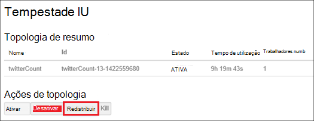

<properties
    pageTitle="Gerir clusters Hadoop no HDInsight com .NET SDK | Microsoft Azure"
    description="Saiba como desempenhar tarefas administrativas para clusters Hadoop no HDInsight utilizando HDInsight .NET SDK."
    services="hdinsight"
    editor="cgronlun"
    manager="jhubbard"
    tags="azure-portal"
    authors="mumian"
    documentationCenter=""/>

<tags
    ms.service="hdinsight"
    ms.workload="big-data"
    ms.tgt_pltfrm="na"
    ms.devlang="na"
    ms.topic="article"
    ms.date="09/02/2016"
    ms.author="jgao"/>

# Gerir clusters de Hadoop HDInsight utilizando .NET SDK

[AZURE.INCLUDE [selector](../../includes/hdinsight-portal-management-selector.md)]

Saiba como gerir clusters HDInsight utilizando [HDInsight.NET SDK](https://msdn.microsoft.com/library/mt271028.aspx).

**Pré-requisitos**

Antes de começar este artigo, tem de ter o seguinte procedimento:

- **Azure uma subscrição**. Consulte o artigo [obter Azure versão de avaliação gratuita](https://azure.microsoft.com/documentation/videos/get-azure-free-trial-for-testing-hadoop-in-hdinsight/).

##Ligar ao Azure HDInsight

Irá precisar de pacotes Nuget seguintes:

    Install-Package Microsoft.Rest.ClientRuntime.Azure.Authentication -Pre
    Install-Package Microsoft.Azure.Management.ResourceManager -Pre
    Install-Package Microsoft.Azure.Management.HDInsight

O código de exemplo seguinte mostra-lhe como ligar ao Azure antes de pode administrar HDInsight clusters com a sua subscrição Azure.

    using System;
    using Microsoft.Azure;
    using Microsoft.Azure.Management.HDInsight;
    using Microsoft.Azure.Management.HDInsight.Models;
    using Microsoft.Azure.Management.ResourceManager;
    using Microsoft.IdentityModel.Clients.ActiveDirectory;
    using Microsoft.Rest;
    using Microsoft.Rest.Azure.Authentication;

    namespace HDInsightManagement
    {
        class Program
        {
            private static HDInsightManagementClient _hdiManagementClient;
            // Replace with your AAD tenant ID if necessary
            private const string TenantId = UserTokenProvider.CommonTenantId; 
            private const string SubscriptionId = "<Your Azure Subscription ID>";
            // This is the GUID for the PowerShell client. Used for interactive logins in this example.
            private const string ClientId = "1950a258-227b-4e31-a9cf-717495945fc2";

            static void Main(string[] args)
            {
                // Authenticate and get a token
                var authToken = Authenticate(TenantId, ClientId, SubscriptionId);
                // Flag subscription for HDInsight, if it isn't already.
                EnableHDInsight(authToken);
                // Get an HDInsight management client
                _hdiManagementClient = new HDInsightManagementClient(authToken);

                // insert code here

                System.Console.WriteLine("Press ENTER to continue");
                System.Console.ReadLine();
            }

            /// 

            /// Authenticate to an Azure subscription and retrieve an authentication token
            /// 

            /// <param name="TenantId">The AAD tenant ID</param>
            /// <param name="ClientId">The AAD client ID</param>
            /// <param name="SubscriptionId">The Azure subscription ID</param>
            /// <returns></returns>
            static TokenCloudCredentials Authenticate(string TenantId, string ClientId, string SubscriptionId)
            {
                var authContext = new AuthenticationContext("https://login.microsoftonline.com/" + TenantId);
                var tokenAuthResult = authContext.AcquireToken("https://management.core.windows.net/", 
                    ClientId, 
                    new Uri("urn:ietf:wg:oauth:2.0:oob"), 
                    PromptBehavior.Always, 
                    UserIdentifier.AnyUser);
                return new TokenCloudCredentials(SubscriptionId, tokenAuthResult.AccessToken);
            }
            /// 

            /// Marks your subscription as one that can use HDInsight, if it has not already been marked as such.
            /// 

            /// <remarks>This is essentially a one-time action; if you have already done something with HDInsight
            /// on your subscription, then this isn't needed at all and will do nothing.</remarks>
            /// <param name="authToken">An authentication token for your Azure subscription</param>
            static void EnableHDInsight(TokenCloudCredentials authToken)
            {
                // Create a client for the Resource manager and set the subscription ID
                var resourceManagementClient = new ResourceManagementClient(new TokenCredentials(authToken.Token));
                resourceManagementClient.SubscriptionId = SubscriptionId;
                // Register the HDInsight provider
                var rpResult = resourceManagementClient.Providers.Register("Microsoft.HDInsight");
            }
        }
    }

Deve ver um aviso quando executar este programa.  Se não quiser ver à linha de comandos, consulte [aplicações de .NET HDInsight de autenticação não interativa de criar](hdinsight-create-non-interactive-authentication-dotnet-applications.md).

##Criar clusters

Consulte o artigo [baseado em criar Linux clusters de HDInsight utilizando o SDK .NET](hdinsight-hadoop-create-linux-clusters-dotnet-sdk.md)

##Clusters de lista

O fragmento de código seguinte lista clusters e algumas propriedades:

    var results = _hdiManagementClient.Clusters.List();
    foreach (var name in results.Clusters) {
        Console.WriteLine("Cluster Name: " + name.Name);
        Console.WriteLine("\t Cluster type: " + name.Properties.ClusterDefinition.ClusterType);
        Console.WriteLine("\t Cluster location: " + name.Location);
        Console.WriteLine("\t Cluster version: " + name.Properties.ClusterVersion);
    }

##Eliminar clusters

Utilize o seguinte fragmento de código para eliminar um cluster de modo síncrono ou assíncrona: 

    _hdiManagementClient.Clusters.Delete("<Resource Group Name>", "<Cluster Name>");
    _hdiManagementClient.Clusters.DeleteAsync("<Resource Group Name>", "<Cluster Name>");
            
##Clusters de escala
Cluster dimensionamento funcionalidade permite-lhe alterar o número de nós trabalhador utilizada por um cluster de que está em execução no Azure HDInsight sem ter de voltar a criar o cluster.

>[AZURE.NOTE] Apenas clusters com HDInsight versão 3.1.3 ou superior são suportadas. Se tem a certeza da versão do seu cluster, pode verificar a página de propriedades.  Consulte [clusters de lista e a apresentação](hdinsight-administer-use-portal-linux.md#list-and-show-clusters).

O impacto de alterar o número de nós de dados para cada tipo de cluster suportado pelo HDInsight:

- Hadoop

    Forma totalmente integrada pode aumentar o número de nós de trabalho num cluster Hadoop que está a ser executado sem que afetam quaisquer tarefas pendentes ou em execução. Também podem ser apresentadas novas tarefas enquanto a operação está em curso. Falhas numa operação de dimensionamento correctamente são processadas para que o cluster sempre fica num estado funcional.

    Quando um cluster de Hadoop está dimensionado para baixo, reduzindo o número de nós de dados, alguns dos serviços no cluster reiniciados. Isto faz com que todas as em execução e tarefas pendentes falha após a conclusão da operação de dimensionamento. No entanto, pode, submeter as tarefas de uma vez concluída a operação.

- HBase

    Forma totalmente integrada pode adicionar ou remover nós ao seu cluster HBase enquanto estiver em execução. Os servidores regionais são automaticamente distribuídos dentro de alguns minutos de concluir a operação de dimensionamento. No entanto, pode também manualmente equilibrar os servidores regionais iniciando para headnode de cluster e executando os seguintes comandos a partir de uma janela de linha de comandos:

        >pushd %HBASE_HOME%\bin
        >hbase shell
        >balancer

- Tempestade

    Forma totalmente integrada pode adicionar ou remover nós de dados para o seu cluster tempestade enquanto estiver em execução. Mas após uma conclusão com êxito da operação de dimensionamento, terá de redistribuir da topologia.

    Rebalanceamento pode ser feito de duas maneiras:

    * Web tempestade IU
    * Ferramenta de interface de comandos (CLI)

    Consulte a [documentação Apache tempestade](http://storm.apache.org/documentation/Understanding-the-parallelism-of-a-Storm-topology.html) para obter mais detalhes.

    Web tempestade IU está disponível no HDInsight cluster:

    

    Eis um exemplo como utilizar o comando clip para redistribuir a topologia de tempestade:

        ## Reconfigure the topology "mytopology" to use 5 worker processes,
        ## the spout "blue-spout" to use 3 executors, and
        ## the bolt "yellow-bolt" to use 10 executors

        $ storm rebalance mytopology -n 5 -e blue-spout=3 -e yellow-bolt=10

O fragmento de código seguinte mostra como redimensionar um cluster de modo síncrono ou assíncrona:

    _hdiManagementClient.Clusters.Resize("<Resource Group Name>", "<Cluster Name>", <New Size>);   
    _hdiManagementClient.Clusters.ResizeAsync("<Resource Group Name>", "<Cluster Name>", <New Size>);   
    

##Conceder/revogar o acesso

HDInsight clusters tem os seguintes serviços web HTTP (todos estes serviços de tem os pontos finais RESTful):

- ODBC
- JDBC
- Ambari
- Oozie
- Templeton

Por predefinição, estes serviços são concedidos de acesso. Pode revogar/conceder acesso. Para revogar:

    var httpParams = new HttpSettingsParameters
    {
        HttpUserEnabled = false,
        HttpUsername = "admin",
        HttpPassword = "*******",
    };
    _hdiManagementClient.Clusters.ConfigureHttpSettings("<Resource Group Name>, <Cluster Name>, httpParams);

Para conceder:

    var httpParams = new HttpSettingsParameters
    {
        HttpUserEnabled = enable,
        HttpUsername = "admin",
        HttpPassword = "*******",
    };
    _hdiManagementClient.Clusters.ConfigureHttpSettings("<Resource Group Name>, <Cluster Name>, httpParams);

>[AZURE.NOTE] Ao conceder/revogar o acesso, irá repor cluster nome de utilizador e palavra-passe.

Também pode ser feito através do Portal. Consulte [Administrar HDInsight utilizando o Portal do Azure][hdinsight-admin-portal].

##Atualizar as credenciais de utilizador HTTP

É o mesmo procedimento como [HTTP conceder/revogar o acesso](#grant/revoke-access). Se o cluster tiver sido concedido acesso HTTP, tem de revogá-la pela primeira vez.  E, em seguida, conceder o acesso com as credenciais de utilizador do novos HTTP.

##Localizar a conta de armazenamento predefinida

O fragmento de código seguinte demonstra como obter o nome da conta predefinida armazenamento e a chave de conta de armazenamento predefinido para um cluster de.

    var results = _hdiManagementClient.Clusters.GetClusterConfigurations(<Resource Group Name>, <Cluster Name>, "core-site");
    foreach (var key in results.Configuration.Keys)
    {
        Console.WriteLine(String.Format("{0} => {1}", key, results.Configuration[key]));
    }

##Submeter tarefas

**Para submeter MapReduce tarefas**

Consulte o artigo [Executar Hadoop MapReduce amostras no HDInsight](hdinsight-hadoop-run-samples-linux.md).

**Para submeter ramo de tarefas** 

Consulte o artigo [Executar Hive consultas utilizando .NET SDK](hdinsight-hadoop-use-hive-dotnet-sdk.md).

**Para submeter porco tarefas**

Consulte o artigo [tarefas de executar porco utilizando .NET SDK](hdinsight-hadoop-use-pig-dotnet-sdk.md).

**Para submeter Sqoop tarefas**

Consulte o artigo [utilizar Sqoop com HDInsight](hdinsight-hadoop-use-sqoop-dotnet-sdk.md).

**Para submeter Oozie tarefas**

Consulte o artigo [Utilizar Oozie com Hadoop definir e executar um fluxo de trabalho HDInsight](hdinsight-use-oozie-linux-mac.md).

##Carregar dados para o armazenamento de Blobs do Azure
Consulte o artigo [Transferir dados do HDInsight][hdinsight-upload-data].

## Consulte também
* [Documentação de referência HDInsight .NET SDK](https://msdn.microsoft.com/library/mt271028.aspx)
* [Administrar HDInsight, utilizando o Portal do Azure][hdinsight-admin-portal]
* [Administrar HDInsight utilizando uma interface da linha de comandos][hdinsight-admin-cli]
* [Criar HDInsight clusters][hdinsight-provision]
* [Carregar dados ao HDInsight][hdinsight-upload-data]
* [Introdução ao Azure HDInsight][hdinsight-get-started]

[azure-purchase-options]: http://azure.microsoft.com/pricing/purchase-options/
[azure-member-offers]: http://azure.microsoft.com/pricing/member-offers/
[azure-free-trial]: http://azure.microsoft.com/pricing/free-trial/

[hdinsight-get-started]: hdinsight-hadoop-linux-tutorial-get-started.md
[hdinsight-provision]: hdinsight-provision-clusters.md
[hdinsight-provision-custom-options]: hdinsight-provision-clusters.md#configuration
[hdinsight-submit-jobs]: hdinsight-submit-hadoop-jobs-programmatically.md

[hdinsight-admin-cli]: hdinsight-administer-use-command-line.md
[hdinsight-admin-portal]: hdinsight-administer-use-portal-linux.md
[hdinsight-storage]: hdinsight-hadoop-use-blob-storage.md
[hdinsight-use-hive]: hdinsight-use-hive.md
[hdinsight-use-mapreduce]: hdinsight-use-mapreduce.md
[hdinsight-upload-data]: hdinsight-upload-data.md
[hdinsight-flight]: hdinsight-analyze-flight-delay-data.md

