<properties
    pageTitle="Gerir clusters Hadoop no HDInsight através do portal Azure | Microsoft Azure"
    description="Saiba como administrar o serviço de HDInsight. Criar um cluster de HDInsight, abra a consola JavaScript interativa e abra a consola do comando Hadoop."
    services="hdinsight"
    documentationCenter=""
    tags="azure-portal"
    authors="mumian"
    manager="jhubbard"
    editor="cgronlun"/>

<tags
    ms.service="hdinsight"
    ms.workload="big-data"
    ms.tgt_pltfrm="na"
    ms.devlang="na"
    ms.topic="article"
    ms.date="09/14/2016"
    ms.author="jgao"/>

# Gerir clusters de Hadoop HDInsight utilizando o portal do Azure

[AZURE.INCLUDE [selector](../../includes/hdinsight-portal-management-selector.md)]

Utilizando o [Azure portal][azure-portal], pode criar Hadoop clusters no Azure HDInsight, alterar a palavra-passe de utilizador Hadoop e ativar o protocolo de ambiente de trabalho remoto (RDP) para que possa aceder a consola de comandos Hadoop no cluster.

As informações neste artigo só se aplica a clusters baseados em janelas HDInsight. Para obter informações sobre como gerir clusters baseados em Linux, clique no Seletor de tabulação acima.

Clique no Seletor de tabulação para obter informações sobre como criar Hadoop clusters no HDInsight utilizar outras ferramentas. 

**Pré-requisitos**

Antes de começar este artigo, tem de ter o seguinte procedimento:

- **Azure uma subscrição**. Consulte o artigo [obter Azure versão de avaliação gratuita](https://azure.microsoft.com/documentation/videos/get-azure-free-trial-for-testing-hadoop-in-hdinsight/).
- **Conta de armazenamento do Windows azure** - HDInsight um cluster utiliza um contentor de armazenamento de Blobs do Azure como o sistema de ficheiro predefinido. Para mais informações sobre como o armazenamento de Blobs do Azure fornece uma experiência totalmente integrada com clusters de HDInsight, consulte o artigo [Utilizar armazenamento de Blobs do Azure com HDInsight](hdinsight-hadoop-use-blob-storage.md). Para obter detalhes sobre como criar uma conta de armazenamento do Windows Azure, consulte o artigo [como criar uma conta de armazenamento](../storage/storage-create-storage-account.md).

##Abra o Portal

1. Inicie sessão no [https://portal.azure.com](https://portal.azure.com).
2. Depois de abrir o portal, pode:

    - Clique em **Novo** a partir do menu da esquerda para criar um novo cluster:
    
        
    - Clique em **Clusters de HDInsight** no menu à esquerda.
    
        

    Se **HDInsight** não aparecer no menu à esquerda, clique em **Procurar**. 

    

##Criar clusters

Para as instruções de criação através do Portal, consulte [Criar HDInsight clusters](hdinsight-provision-clusters.md#create-using-the-preview-portal).

HDInsight funciona com componentes de uma vasta gama de Hadoop. Para a lista dos componentes que foram verificadas e suportadas, consulte o artigo [que versão do Hadoop está no Azure HDInsight](hdinsight-component-versioning.md). Pode personalizar HDInsight utilizando uma das seguintes opções:

- Utilize a ação de Script para executar scripts personalizados que podem personalizar um cluster para alterar a configuração do cluster ou instalar componentes personalizados como Giraph ou Solr. Para mais informações, consulte o artigo [cluster de personalizar HDInsight utilizando a ação de Script](hdinsight-hadoop-customize-cluster.md).
- Utilize os parâmetros de personalização cluster no HDInsight .NET SDK ou Azure PowerShell durante a criação de cluster. Estas alterações de configuração, em seguida, são preservadas através do tempo de vida do cluster e não são afetadas por reimages de nó de cluster plataforma Azure executa periodicamente para manutenção. Para mais informações sobre como utilizar os parâmetros de personalização cluster, consulte o artigo [Criar HDInsight clusters](hdinsight-provision-clusters.md).
- Alguns componentes Java nativos, como Mahout e em cascata, podem ser executados em cluster como ficheiros para caixa. Estes ficheiros para caixa podem ser distribuídos ao armazenamento de Blobs do Azure e submetidos a HDInsight clusters através de mecanismos de submissão de tarefa Hadoop. Para mais informações, consulte o artigo [Submeter Hadoop através de programação de tarefas](hdinsight-submit-hadoop-jobs-programmatically.md).

    >[AZURE.NOTE] Se tiver problemas implementar para caixa ficheiros a HDInsight clusters ou a chamada para caixa ficheiros em HDInsight clusters, contacte o [Suporte da Microsoft](https://azure.microsoft.com/support/options/).

    > Em cascata não é suportado pelo HDInsight e não é elegível para o Microsoft Support. Para listas de componentes suportados, consulte o artigo [quais são as novidades nas versões cluster fornecidas pela HDInsight?](hdinsight-component-versioning.md).

Instalação de software personalizado num cluster utilizando a ligação de ambiente de trabalho remoto não é suportada. Deverá Evite armazenar quaisquer ficheiros nas unidades do nó cabeça, tal como serão perdidos se precisar de recriar os clusters. Recomendamos que o armazenamento de ficheiros de armazenamento de Blobs do Azure. Armazenamento de BLOBs é persistente.

##Clusters de lista e a apresentação

1. Inicie sessão no [https://portal.azure.com](https://portal.azure.com).
2. Clique em **Clusters de HDInsight** no menu à esquerda.
3. Clique no nome de cluster. Se a lista de cluster é longa, pode utilizar o filtro na parte superior da página.
4. Faça duplo clique num cluster a partir da lista para mostrar os detalhes.

    **Menu e essentials**:

    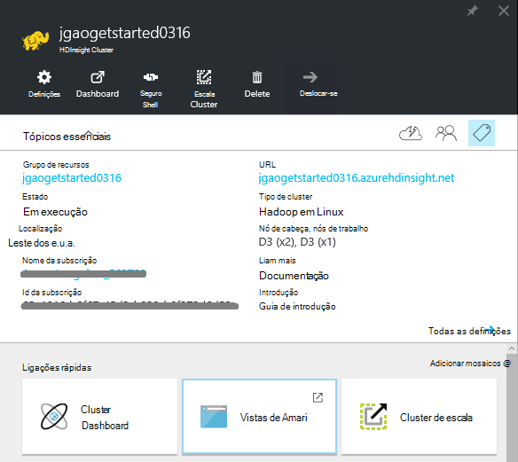
    
    - Para personalizar o menu, com o botão direito em qualquer lugar no menu e, em seguida, clique em **Personalizar**.
    - **Definições** e **Todas as definições**: apresenta o pá **Definições** para o cluster, que permite-lhe aceder a informações detalhadas da configuração para o cluster.
    - URL de **dashboard**, **Cluster de Dashboard** e **: estas são todas as formas de aceder ao dashboard de cluster, que é Ambari Web para clusters baseado em Linux. - **Seguro Shell * *: mostra as instruções para ligar ao cluster utilizando ligações de Shell seguro (SSH).
    - **Cluster de escala**: permite-lhe alterar o número de nós de trabalho para este cluster.
    - **Eliminar**: elimina o cluster.
    - **Guia de introdução ()**: apresenta as informações que irão ajudar a começar a utilizar o HDInsight.
    - **Os utilizadores ()**: permite-lhe definir permissões para a _Gestão de portal_ deste cluster para outros utilizadores na sua subscrição do Azure.
    
        > [AZURE.IMPORTANT] Este _apenas_ afeta o acesso e as permissões para este cluster no portal do Azure e não tem efeito no quem pode ligar ao ou submeter tarefas ao HDInsight cluster.
    - **Etiquetas ()**: etiquetas permite-lhe definir pares valor/chave para definir uma taxonomia personalizada dos seus serviços na nuvem. Por exemplo, poderá criar uma chave de __projeto__com o nome e, em seguida, utilize um valor em comum para todos os serviços associados a um projecto específico.
    - **Vistas de Ambari**: ligações para Ambari Web.
    
    > [AZURE.IMPORTANT] Para gerir os serviços fornecidos pelo HDInsight cluster, tem de utilizar Ambari Web ou a API do resto Ambari. Para mais informações sobre como utilizar Ambari, consulte o artigo [Gerir HDInsight clusters utilizando Ambari](hdinsight-hadoop-manage-ambari.md).

    **A utilização**:
    
    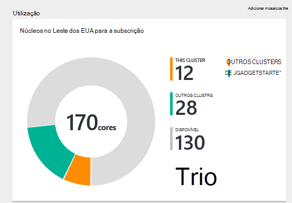
    
5. Clique em **Definições**.

    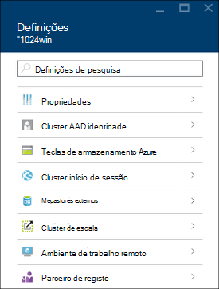

    - **Propriedades**: ver as propriedades de cluster.
    - **Cluster AAD identidade**: 
    - **Teclas de armazenamento do Azure**: ver a conta de armazenamento predefinida e a sua chave. A conta de armazenamento é de configuração durante o processo de criação de cluster.
    - **Cluster de início de sessão**: alterar cluster HTTP nome de utilizador e palavra-passe.
    - **Metastores externos**: ver o metastores ramo e Oozie. Só pode ser configurado o metastores durante o processo de criação de cluster.
    - **Cluster de escala**: aumentar e diminuir o número de nós de cluster de trabalho.
    - **Ambiente de trabalho remoto**: Ativar e desativar o acesso de ambiente de trabalho remoto (RDP) e configurar o nome de utilizador RDP.  O nome de utilizador RDP tem de ser diferente do nome de utilizador do HTTP.
    - **Parceiro de registo**:
    
    > [AZURE.NOTE] Esta é uma lista das definições disponíveis; genérica nem todas estarão presentes para todos os tipos de cluster.

6. Clique em **Propriedades**:

    Propriedades, apresenta o seguinte:
    
    - **Hostname**: nome do Cluster.
    - **URL de cluster**.
    - **Estado**: incluir abortado, aceite, ClusterStorageProvisioned, AzureVMConfiguration, HDInsightConfiguration, operacionais avançado, executar, erro, eliminar, eliminado, tempo limite excedido, DeleteQueued, DeleteTimedout, DeleteError, PatchQueued, CertRolloverQueued, ResizeQueued, ClusterCustomization
    - **Região**: Azure localização. Para uma lista de localizações Azure suportadas, consulte o artigo caixa de listagem pendente **região** [HDInsight preços](https://azure.microsoft.com/pricing/details/hdinsight/).
    - **Dados criados**.
    - **Sistema operativo**: um dos **Windows** ou **Linux**.
    - **Tipo**: Hadoop, HBase, tempestade, gerar. 
    - **Versão**. Ver [versões HDInsight](hdinsight-component-versioning.md)
    - **Subscrição**: nome da subscrição.
    - **ID da subscrição**.
    - **Origem de dados principal**. A conta de armazenamento de Blobs do Azure utilizada como o sistema de ficheiro Hadoop predefinido.
    - **Nós de trabalho preços de camadas**.
    - **Camadas de preços de nó de cabeça**.

##Eliminar clusters

Eliminar um cluster não irá eliminar a conta de armazenamento predefinida ou todas as contas de armazenamento ligadas. Pode criar novamente o cluster ao utilizar as mesmas contas de armazenamento e a mesma metastores.

1. Inicie sessão no [Portal][azure-portal].
2. Clique em **Procurar tudo** a partir do menu à esquerda, clique em **HDInsight Clusters**, clique no seu nome de cluster.
3. Clique em **Eliminar** a partir do menu superior e, em seguida, siga as instruções.

Consulte também [Pausa/encerrar clusters](#pauseshut-down-clusters).

##Clusters de escala
Cluster dimensionamento funcionalidade permite-lhe alterar o número de nós trabalhador utilizada por um cluster de que está em execução no Azure HDInsight sem ter de voltar a criar o cluster.

>[AZURE.NOTE] Apenas clusters com HDInsight versão 3.1.3 ou superior são suportadas. Se tem a certeza da versão do seu cluster, pode verificar a página de propriedades.  Consulte [clusters de lista e a apresentação](#list-and-show-clusters).

O impacto de alterar o número de nós de dados para cada tipo de cluster suportado pelo HDInsight:

- Hadoop

    Forma totalmente integrada pode aumentar o número de nós de trabalho num cluster Hadoop que está a ser executado sem que afetam quaisquer tarefas pendentes ou em execução. Também podem ser apresentadas novas tarefas enquanto a operação está em curso. Falhas numa operação de dimensionamento correctamente são processadas para que o cluster sempre fica num estado funcional.

    Quando um cluster de Hadoop está dimensionado para baixo, reduzindo o número de nós de dados, alguns dos serviços no cluster reiniciados. Isto faz com que todas as em execução e tarefas pendentes falha após a conclusão da operação de dimensionamento. No entanto, pode, submeter as tarefas de uma vez concluída a operação.

- HBase

    Forma totalmente integrada pode adicionar ou remover nós ao seu cluster HBase enquanto estiver em execução. Os servidores regionais são automaticamente distribuídos dentro de alguns minutos de concluir a operação de dimensionamento. No entanto, pode também manualmente equilibrar os servidores regionais iniciando para headnode de cluster e executando os seguintes comandos a partir de uma janela de linha de comandos:

        >pushd %HBASE_HOME%\bin
        >hbase shell
        >balancer

    Para obter mais informações sobre como utilizar a shell de HBase, consulte o artigo]
- Tempestade

    Forma totalmente integrada pode adicionar ou remover nós de dados para o seu cluster tempestade enquanto estiver em execução. Mas após uma conclusão com êxito da operação de dimensionamento, terá de redistribuir da topologia.

    Rebalanceamento pode ser feito de duas maneiras:

    * Web tempestade IU
    * Ferramenta de interface de comandos (CLI)

    Consulte a [documentação Apache tempestade](http://storm.apache.org/documentation/Understanding-the-parallelism-of-a-Storm-topology.html) para obter mais detalhes.

    Web tempestade IU está disponível no HDInsight cluster:

    

    Eis um exemplo como utilizar o comando clip para redistribuir a topologia de tempestade:

        ## Reconfigure the topology "mytopology" to use 5 worker processes,
        ## the spout "blue-spout" to use 3 executors, and
        ## the bolt "yellow-bolt" to use 10 executors

        $ storm rebalance mytopology -n 5 -e blue-spout=3 -e yellow-bolt=10

**Para dimensionar clusters**

1. Inicie sessão no [Portal][azure-portal].
2. Clique em **Procurar tudo** a partir do menu à esquerda, clique em **HDInsight Clusters**, clique no seu nome de cluster.
3. Clique em **Definições** a partir do menu superior e, em seguida, clique em **Escala Cluster**.
4. Introduza o **número do trabalho nós**. O limite o número de nó de cluster varia entre subscrições Azure. Pode contactar o suporte de faturação para aumentar o limite.  As informações de custo vão refletir as alterações que tenha efetuado para o número de nós.

    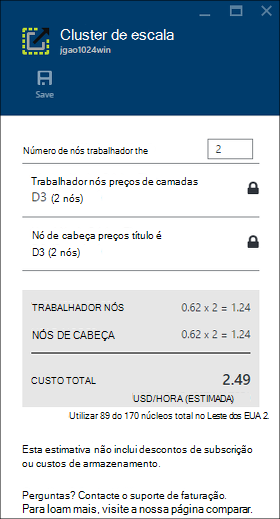

##Colocar em pausa/encerrar clusters

A maioria das tarefas Hadoop são trabalhos em lotes que só são executou ocasionalmente. Para a maior parte dos Hadoop clusters, existem grandes períodos de tempo que o cluster não está a ser utilizado para processamento. Com HDInsight, os dados são armazenados no armazenamento do Windows Azure, para que pode eliminar com segurança um cluster quando já não for utilizado.
Também são cobradas para um cluster de HDInsight, mesmo quando não está em utilização. Uma vez que os encargos para o cluster são mais do número de vezes que os encargos de armazenamento, faz sentido económico para eliminar clusters quando não estejam em utilização.

Existem várias formas, pode programar o processo:

- Utilizador dados Azure fábrica do mesmo. Consulte [Serviço do Azure HDInsight ligadas](../data-factory/data-factory-compute-linked-services.md) e [transformar e analisar utilizando Azure dados fábrica](../data-factory/data-factory-data-transformation-activities.md) para serviços de HDInsight ligada a pedido e personalizada definidos.
- Utilize o Azure PowerShell.  Consulte o artigo [Analisar os dados de atrasos em voos](hdinsight-analyze-flight-delay-data.md).
- Utilize o clip Azure. Consulte o artigo [Gerir HDInsight clusters utilizando o clip do Azure](hdinsight-administer-use-command-line.md).
- Utilize SDK do .NET HDInsight. Consulte o artigo [Submeter Hadoop tarefas](hdinsight-submit-hadoop-jobs-programmatically.md).

Para informações sobre preços, consulte o artigo [HDInsight preços](https://azure.microsoft.com/pricing/details/hdinsight/). Para eliminar um cluster a partir do Portal, consulte [Eliminar clusters](#delete-clusters)

##Nome de utilizador de cluster de alteração

Um cluster de HDInsight pode ter duas contas de utilizador. A conta de utilizador do HDInsight cluster é criada durante o processo de criação. Também pode criar uma conta de utilizador para aceder ao cluster através do RDP RDP. Consulte o artigo [Ativar o ambiente de trabalho remoto](#connect-to-hdinsight-clusters-by-using-rdp).

**Para alterar HDInsight cluster nome de utilizador e palavra-passe**

1. Inicie sessão no [Portal][azure-portal].
2. Clique em **Procurar tudo** a partir do menu à esquerda, clique em **HDInsight Clusters**, clique no seu nome de cluster.
3. Clique em **Definições** a partir do menu superior e, em seguida, clique em **Cluster de início de sessão**.
4. Se o **início de sessão do Cluster** ter sido ativada, tem de clicar **desativar**e, em seguida, clique em **Ativar** antes de alterar o nome de utilizador e palavra-passe...
4. Alterar o **Nome de início de sessão do Cluster** e/ou a **Palavra-passe de início de sessão do Cluster**e, em seguida, clique em **Guardar**.

    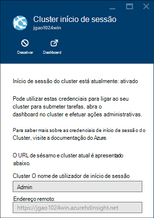

##Conceder/revogar o acesso

HDInsight clusters tem os seguintes serviços web HTTP (todos estes serviços de tem os pontos finais RESTful):

- ODBC
- JDBC
- Ambari
- Oozie
- Templeton

Por predefinição, estes serviços são concedidos de acesso. Pode pode revogar/conceder acesso a partir do portal Azure.

>[AZURE.NOTE] Ao conceder/revogar o acesso, irá repor cluster nome de utilizador e palavra-passe.

**Para conceder/revogar o acesso de serviços web HTTP**

1. Inicie sessão no [Portal][azure-portal].
2. Clique em **Procurar tudo** a partir do menu à esquerda, clique em **HDInsight Clusters**, clique no seu nome de cluster.
3. Clique em **Definições** a partir do menu superior e, em seguida, clique em **Cluster de início de sessão**.
4. Se o **início de sessão do Cluster** ter sido ativada, tem de clicar **desativar**e, em seguida, clique em **Ativar** antes de alterar o nome de utilizador e palavra-passe...
6. Para **Nome de início de sessão Cluster de utilizador** e **Palavra-passe de início de sessão do Cluster**, introduza o novo nome de utilizador e palavra-passe (respetivamente) para o cluster.
7. Clique em **Guardar**.

    

##Localizar a conta de armazenamento predefinida

Cada cluster HDInsight tem uma conta de armazenamento predefinida. A conta de armazenamento predefinida e suas chaves para um cluster é apresentado em **Definições**/**Propriedades**/**Teclas de armazenamento do Azure**. Consulte [clusters de lista e a apresentação](#list-and-show-clusters).

    
##Localizar o grupo de recursos 

No modo de Gestor de recursos do Azure, cada cluster HDInsight é criado com um grupo de recursos Azure. O grupo de recursos Azure que pertence um cluster aparece:

- A lista de cluster tem uma coluna de **Grupo de recursos** .
- Cluster **essenciais** mosaico.  

Consulte [clusters de lista e a apresentação](#list-and-show-clusters).
   
##Consola de consulta HDInsight aberta

Consola do HDInsight consulta inclui as seguintes funcionalidades:

- **Introdução ao Galeria**: para utilizar a galeria, consulte o artigo [Saiba Hadoop ao utilizar a Galeria de introdução de introdução do Azure HDInsight](hdinsight-learn-hadoop-use-sample-gallery.md).
- **Editor de Hive**: interface de web interface gráfica de respostas para submeter ramo de tarefas.  Consulte o artigo [Executar Hive consultas utilizando a consola de consulta](hdinsight-hadoop-use-hive-query-console.md).

    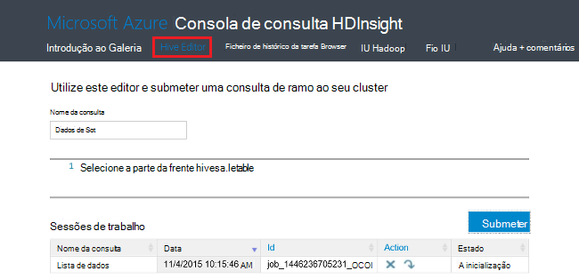

- **Histórico da tarefa**: Monitor Hadoop tarefas.  

    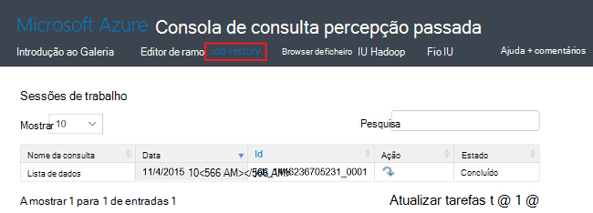

    Clique no **Nome da consulta** para mostrar os detalhes, incluindo as propriedades de tarefa, **Tarefa de consulta**, e * * tarefa de saída. Também pode transferir a consulta e o resultado da estação de trabalho.

- **Browser de ficheiro**: procurar a conta de armazenamento predefinida e as contas de armazenamento ligadas.

    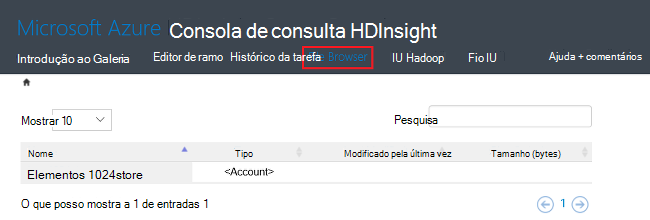

    Na captura de ecrã a **<Account>** tipo indica o item é uma conta de armazenamento Azure.  Clique no nome de conta para procurar os ficheiros.
    
- **IU Hadoop**.

    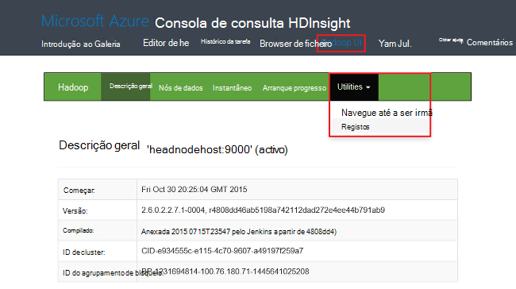
    
    A partir do **Hadoop IU*, pode procurar ficheiros e verifique os registos. 

- **Fio IU**.

    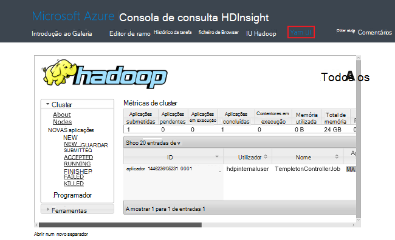

##Executar consultas de ramo

Para executou ramo de tarefas a partir do Portal, clique em **Hive Editor** na consola do HDInsight consulta. Consulte o artigo [Abrir consulta HDInsight consola](#open-hdinsight-query-console).

##Tarefas do monitor

Para monitorizar tarefas a partir do Portal, clique em **Histórico da tarefa** na consola do HDInsight consulta. Consulte o artigo [Abrir consulta HDInsight consola](#open-hdinsight-query-console).

##Procurar ficheiros

Para procurar os ficheiros guardados na conta de armazenamento de predefinido e as contas de armazenamento ligadas, clique em **Localizador de ficheiro** na consola do HDInsight consulta. Consulte o artigo [Abrir consulta HDInsight consola](#open-hdinsight-query-console).

Também pode utilizar o utilitário **Procurar o sistema de ficheiros** a partir de **IU Hadoop** na consola do HDInsight.  Consulte o artigo [Abrir consulta HDInsight consola](#open-hdinsight-query-console).

##Monitorizar a utilização de cluster

Secção da __utilização__ da pá cluster HDInsight apresenta informações sobre o número de núcleos disponíveis para a sua subscrição para utilização com o HDInsight, bem como o número de núcleos atribuídos para este cluster e como são atribuídos para os nós deste cluster. Consulte [clusters de lista e a apresentação](#list-and-show-clusters).

> [AZURE.IMPORTANT] Para monitorizar os serviços fornecidos pelo HDInsight cluster, tem de utilizar Ambari Web ou a API do resto Ambari. Para mais informações sobre como utilizar Ambari, consulte o artigo [Gerir HDInsight clusters utilizando Ambari](hdinsight-hadoop-manage-ambari.md)

##Abrir Hadoop IU

Para monitorizar o cluster, procure o sistema de ficheiros e verifique os registos, clique em **Hadoop IU** na consola do HDInsight consulta. Consulte o artigo [Abrir consulta HDInsight consola](#open-hdinsight-query-console).

##Abra o fio IU

Para utilizar a interface de utilizador fio, clique em **Fio IU** na consola do HDInsight consulta. Consulte o artigo [Abrir consulta HDInsight consola](#open-hdinsight-query-console).

##Ligar a clusters utilizando o RDP

As credenciais para cluster que forneceu na sua criação conceder acesso aos serviços no cluster, mas não para o próprio cluster através de ambiente de trabalho remoto. Pode ativar o acesso de ambiente de trabalho remoto quando aprovisionar o um cluster ou após a um cluster está aprovisionado. Para obter instruções sobre como activar o ambiente de trabalho remoto em criação, consulte o artigo [Criar HDInsight cluster](hdinsight-provision-clusters.md).

**Para ativar o ambiente de trabalho remoto**

1. Inicie sessão no [Portal][azure-portal].
2. Clique em **Procurar tudo** a partir do menu à esquerda, clique em **HDInsight Clusters**, clique no seu nome de cluster.
3. Clique em **Definições** a partir do menu superior e, em seguida, clique em **Ambiente de trabalho remoto**.
4. Introduza **Expira no**, **Nome de utilizador de ambiente de trabalho remoto** e **Palavra-passe de ambiente de trabalho remoto**e, em seguida, clique em **Ativar**.

    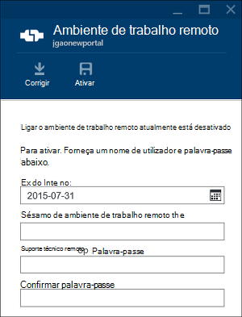

    Os valores predefinidos para o expira é uma semana.
> [AZURE.NOTE] Também pode utilizar o HDInsight .NET SDK para ativar o ambiente de trabalho remoto um cluster. Utilize o método de **EnableRdp** no objeto de cliente HDInsight da seguinte maneira: **cliente. EnableRdp (nome de cluster, localização, "rdpuser", "rdppassword" DateTime.Now.AddDays(6))**. Da mesma forma, para desativar o ambiente de trabalho remoto no cluster, pode utilizar **cliente. DisableRdp (nome de cluster, localização)**. Para mais informações sobre estes métodos, consulte o artigo [Referência de SDK .NET HDInsight](http://go.microsoft.com/fwlink/?LinkId=529017). Este é aplicável apenas para clusters HDInsight em execução no Windows.

**Para ligar a um cluster utilizando RDP**

1. Inicie sessão no [Portal][azure-portal].
2. Clique em **Procurar tudo** a partir do menu à esquerda, clique em **HDInsight Clusters**, clique no seu nome de cluster.
3. Clique em **Definições** a partir do menu superior e, em seguida, clique em **Ambiente de trabalho remoto**.
4. Clique em **Ligar** e siga as instruções. Se ligar desativar, tem de ativá-la pela primeira vez. Certifique-se com o nome de utilizador do ambiente de trabalho remoto utilizador e palavra-passe.  Não pode utilizar as credenciais do utilizador Cluster.

##Abra a linha de comandos Hadoop

Para ligar ao cluster utilizando o ambiente de trabalho remoto e utilizar a linha de comandos Hadoop, tem primeiro activou acesso ao cluster ambiente de trabalho remoto, tal como descrito na secção anterior.

**Para abrir uma linha de comandos Hadoop**

1. Ligar ao cluster utilizando o ambiente de trabalho remoto.
8. A partir do ambiente de trabalho, faça duplo clique em **linha de comandos Hadoop**.

    ![HDI. HadoopCommandLine][image-hadoopcommandline]

    Para mais informações sobre os comandos do Hadoop, consulte o artigo [referência de comandos Hadoop](http://hadoop.apache.org/docs/current/hadoop-project-dist/hadoop-common/CommandsManual.html).

Na captura de ecrã anterior, o nome da pasta tem o número da versão Hadoop incorporado. O número da versão pode alterado com base na versão do componentes do Hadoop instalados no cluster. Pode utilizar variáveis de ambiente de Hadoop para fazer referência a essas pastas. Por exemplo:

    cd %hadoop_home%
    cd %hive_home%
    cd %hbase_home%
    cd %pig_home%
    cd %sqoop_home%
    cd %hcatalog_home%
    
##Próximos passos
Neste artigo, aprendeu como criar um cluster de HDInsight utilizando o Portal e como abrir a ferramenta de linha de comandos Hadoop. Para saber mais, consulte os artigos seguintes:

* [Administrar HDInsight através do Azure PowerShell](hdinsight-administer-use-powershell.md)
* [Administrar HDInsight utilizando clip Azure](hdinsight-administer-use-command-line.md)
* [Criar HDInsight clusters](hdinsight-provision-clusters.md)
* [Submeter tarefas de Hadoop através de programação](hdinsight-submit-hadoop-jobs-programmatically.md)
* [Introdução ao Azure HDInsight](hdinsight-hadoop-linux-tutorial-get-started.md)
* [Que versão do Hadoop é Azure HDInsight?](hdinsight-component-versioning.md)

[azure-portal]: https://portal.azure.com
[image-hadoopcommandline]: ./media/hdinsight-administer-use-management-portal/hdinsight-hadoop-command-line.png "Linha de comandos Hadoop"
