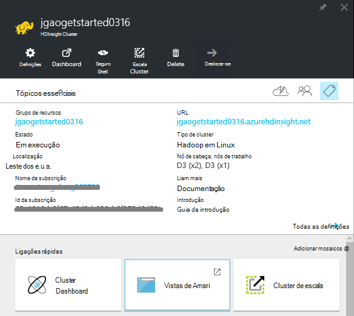
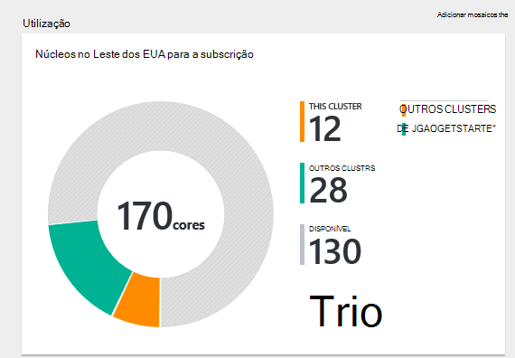
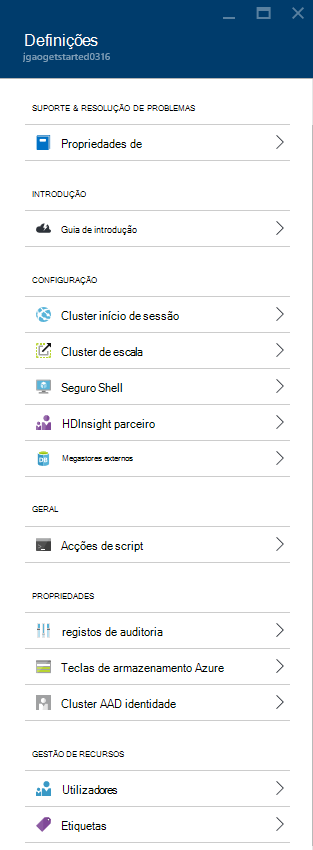
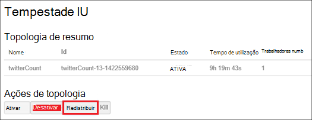
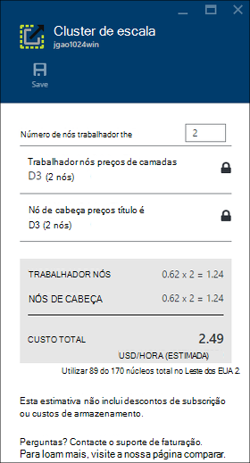
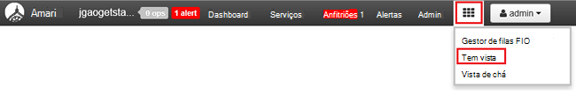

<properties
    pageTitle="Gerir clusters baseado em Linux Hadoop no HDInsight através do portal Azure | Microsoft Azure"
    description="Saiba como criar e gerir clusters baseado em Linux HDInsight através do portal Azure."
    services="hdinsight"
    documentationCenter=""
    authors="mumian"
    manager="jhubbard"
    editor="cgronlun"
    tags="azure-portal"/>

<tags
    ms.service="hdinsight"
    ms.workload="big-data"
    ms.tgt_pltfrm="na"
    ms.devlang="na"
    ms.topic="article"
    ms.date="08/10/2016"
    ms.author="jgao"/>

#Gerir clusters de Hadoop HDInsight utilizando o portal do Azure

[AZURE.INCLUDE [selector](../../includes/hdinsight-portal-management-selector.md)]

Utilizando o [Azure portal][azure-portal], pode gerir clusters Linux baseadas no Azure HDInsight. Utilize o Seletor de tabulação para obter informações sobre como criar Hadoop clusters no HDInsight utilizar outras ferramentas. 

**Pré-requisitos**

Antes de começar este artigo, tem de ter o seguinte procedimento:

- **Azure uma subscrição**. Consulte o artigo [obter Azure versão de avaliação gratuita](https://azure.microsoft.com/documentation/videos/get-azure-free-trial-for-testing-hadoop-in-hdinsight/).

##Abra o Portal

1. Inicie sessão no [https://portal.azure.com](https://portal.azure.com).
2. Depois de abrir o portal, pode:

    - Clique em **Novo** a partir do menu da esquerda para criar um novo cluster:
    
        
    - Clique em **Clusters de HDInsight** no menu à esquerda para listar os clusters existentes
    
        

        Se **HDInsight** não aparecer no menu à esquerda, clique em **Procurar**e, em seguida, clique em **Clusters de HDInsight**.

        

##Criar clusters

[AZURE.INCLUDE [delete-cluster-warning](../../includes/hdinsight-delete-cluster-warning.md)]

HDInsight funciona com componentes de uma vasta gama de Hadoop. Para a lista dos componentes que foram verificadas e suportadas, consulte o artigo [que versão do Hadoop está no Azure HDInsight](hdinsight-component-versioning.md). Para as informações de criação de cluster gerais, consulte o artigo [Criar Hadoop clusters no HDInsight](hdinsight-hadoop-provision-linux-clusters.md). 

##Clusters de lista e a apresentação

1. Inicie sessão no [https://portal.azure.com](https://portal.azure.com).
2. Clique em **Clusters de HDInsight** no menu à esquerda para listar os clusters existentes.
3. Clique no nome de cluster. Se a lista de cluster é longa, pode utilizar o filtro na parte superior da página.
4. Faça duplo clique num cluster a partir da lista para mostrar os detalhes.

    **Menu e essentials**:

    
    
    - **Definições** e **Todas as definições**: apresenta o pá **Definições** para o cluster, que permite-lhe aceder a informações detalhadas da configuração para o cluster.
    - **Dashboard**, **Cluster de Dashboard** e * * URL: estas são todas as formas de aceder ao dashboard de cluster, que é Ambari Web para clusters baseado em Linux.
    - **Shell seguro**: mostra as instruções para ligar ao cluster utilizando ligações de Shell seguro (SSH).
    - **Cluster de escala**: permite-lhe alterar o número de nós de trabalho para este cluster.
    - **Eliminar**: elimina o cluster.
    - **Guia de introdução ()**: apresenta as informações que irão ajudar a começar a utilizar o HDInsight.
    - **Os utilizadores ()**: permite-lhe definir permissões para a _Gestão de portal_ deste cluster para outros utilizadores na sua subscrição do Azure.
    
        > [AZURE.IMPORTANT] Este _apenas_ afeta o acesso e as permissões para este cluster no portal do Azure e não tem efeito no quem pode ligar ao ou submeter tarefas ao HDInsight cluster.
    - **Etiquetas ()**: etiquetas permite-lhe definir pares valor/chave para definir uma taxonomia personalizada dos seus serviços na nuvem. Por exemplo, poderá criar uma chave de __projeto__com o nome e, em seguida, utilize um valor em comum para todos os serviços associados a um projecto específico.
    - **Vistas de Ambari**: ligações para Ambari Web.
    
    > [AZURE.IMPORTANT] Para gerir os serviços fornecidos pelo HDInsight cluster, tem de utilizar Ambari Web ou a API do resto Ambari. Para mais informações sobre como utilizar Ambari, consulte o artigo [Gerir HDInsight clusters utilizando Ambari](hdinsight-hadoop-manage-ambari.md).

    **A utilização**:
    
    
    
5. Clique em **Definições**.

    

    - **Registos de auditoria**:
    - **Guia de introdução**: apresenta as informações que irão ajudar a começar a utilizar o HDInsight.
    - **Cluster de escala**: aumentar e diminuir o número de nós de cluster de trabalho.
    - **Shell seguro**: mostra as instruções para ligar ao cluster utilizando ligações de Shell seguro (SSH).
    - **HDInsight parceiro**: Adicionar/remover o parceiro HDInsight atual.
    - **Metastores externos**: ver o metastores ramo e Oozie. Só pode ser configurado o metastores durante o processo de criação de cluster.
    - **Acções de script**: festa de executar scripts no cluster.
    - **Propriedades**: ver as propriedades de cluster.
    - **Teclas de armazenamento do Azure**: ver a conta de armazenamento predefinida e a sua chave. A conta de armazenamento é de configuração durante o processo de criação de cluster.
    - **Cluster AAD identidade**: 
    - **Os utilizadores**: permite-lhe definir permissões para a _Gestão de portal_ deste cluster para outros utilizadores na sua subscrição do Azure.
    - **Etiquetas**: etiquetas permite-lhe definir pares valor/chave para definir uma taxonomia personalizada dos seus serviços na nuvem. Por exemplo, poderá criar uma chave de __projeto__com o nome e, em seguida, utilize um valor em comum para todos os serviços associados a um projecto específico.
    
    > [AZURE.NOTE] Esta é uma lista das definições disponíveis; genérica nem todas estarão presentes para todos os tipos de cluster.

6. Clique em **Propriedades**:

    As propriedades são:
    
    - **Hostname**: nome do Cluster.
    - **URL de cluster**.
    - **Estado**: incluir abortado, aceite, ClusterStorageProvisioned, AzureVMConfiguration, HDInsightConfiguration, operacionais avançado, executar, erro, eliminar, eliminado, tempo limite excedido, DeleteQueued, DeleteTimedout, DeleteError, PatchQueued, CertRolloverQueued, ResizeQueued, ClusterCustomization
    - **Região**: Azure localização. Para uma lista de localizações Azure suportadas, consulte o artigo caixa de listagem pendente **região** [HDInsight preços](https://azure.microsoft.com/pricing/details/hdinsight/).
    - **Dados criados**.
    - **Sistema operativo**: um dos **Windows** ou **Linux**.
    - **Tipo**: Hadoop, HBase, tempestade, gerar. 
    - **Versão**. Ver [versões HDInsight](hdinsight-component-versioning.md)
    - **Subscrição**: nome da subscrição.
    - **ID da subscrição**.
    - **Origem de dados predefinido**: O sistema de ficheiros de cluster predefinido.
    - **Nós de trabalho preços de camadas**.
    - **Camadas de preços de nó de cabeça**.

##Eliminar clusters

Eliminar um cluster não irá eliminar a conta de armazenamento predefinida ou todas as contas de armazenamento ligadas. Pode criar novamente o cluster ao utilizar as mesmas contas de armazenamento e a mesma metastores. Recomenda-se para utilizar um contentor de BLOBs predefinido novo quando voltar a criar o cluster.

1. Inicie sessão no [Portal][azure-portal].
2. Clique em **Procurar tudo** a partir do menu à esquerda, clique em **HDInsight Clusters**, clique no seu nome de cluster.
3. Clique em **Eliminar** a partir do menu superior e, em seguida, siga as instruções.

Consulte também [Pausa/encerrar clusters](#pauseshut-down-clusters).

##Clusters de escala
Cluster dimensionamento funcionalidade permite-lhe alterar o número de nós trabalhador utilizada por um cluster de que está em execução no Azure HDInsight sem ter de voltar a criar o cluster.

>[AZURE.NOTE] Apenas clusters com HDInsight versão 3.1.3 ou superior são suportadas. Se tem a certeza da versão do seu cluster, pode verificar a página de propriedades.  Consulte [clusters de lista e a apresentação](#list-and-show-clusters).

O impacto de alterar o número de nós de dados para cada tipo de cluster suportado pelo HDInsight:

- Hadoop

    Forma totalmente integrada pode aumentar o número de nós de trabalho num cluster Hadoop que está a ser executado sem que afetam quaisquer tarefas pendentes ou em execução. Também podem ser apresentadas novas tarefas enquanto a operação está em curso. Falhas numa operação de dimensionamento correctamente são processadas para que o cluster sempre fica num estado funcional.

    Quando um cluster de Hadoop está dimensionado para baixo, reduzindo o número de nós de dados, alguns dos serviços no cluster reiniciados. Isto faz com que todas as em execução e tarefas pendentes falha após a conclusão da operação de dimensionamento. No entanto, pode, submeter as tarefas de uma vez concluída a operação.

- HBase

    Forma totalmente integrada pode adicionar ou remover nós ao seu cluster HBase enquanto estiver em execução. Os servidores regionais são automaticamente distribuídos dentro de alguns minutos de concluir a operação de dimensionamento. No entanto, pode também manualmente equilibrar os servidores regionais iniciando para headnode de cluster e executando os seguintes comandos a partir de uma janela de linha de comandos:

        >pushd %HBASE_HOME%\bin
        >hbase shell
        >balancer

    Para obter mais informações sobre como utilizar a shell de HBase, consulte o artigo]
- Tempestade

    Forma totalmente integrada pode adicionar ou remover nós de dados para o seu cluster tempestade enquanto estiver em execução. Mas após uma conclusão com êxito da operação de dimensionamento, terá de redistribuir da topologia.

    Rebalanceamento pode ser feito de duas maneiras:

    * Web tempestade IU
    * Ferramenta de interface de comandos (CLI)

    Consulte a [documentação Apache tempestade](http://storm.apache.org/documentation/Understanding-the-parallelism-of-a-Storm-topology.html) para obter mais detalhes.

    Web tempestade IU está disponível no HDInsight cluster:

    

    Eis um exemplo como utilizar o comando clip para redistribuir a topologia de tempestade:

        ## Reconfigure the topology "mytopology" to use 5 worker processes,
        ## the spout "blue-spout" to use 3 executors, and
        ## the bolt "yellow-bolt" to use 10 executors

        $ storm rebalance mytopology -n 5 -e blue-spout=3 -e yellow-bolt=10

**Para dimensionar clusters**

1. Inicie sessão no [Portal][azure-portal].
2. Clique em **Procurar tudo** a partir do menu à esquerda, clique em **HDInsight Clusters**, clique no seu nome de cluster.
3. Clique em **Definições** a partir do menu superior e, em seguida, clique em **Escala Cluster**.
4. Introduza o **número do trabalho nós**. O limite o número de nó de cluster varia entre subscrições Azure. Pode contactar o suporte de faturação para aumentar o limite.  As informações de custo vão refletir as alterações que tenha efetuado para o número de nós.

    

##Colocar em pausa/encerrar clusters

A maioria das tarefas Hadoop são trabalhos em lotes que só são executou ocasionalmente. Para a maior parte dos Hadoop clusters, existem grandes períodos de tempo que o cluster não está a ser utilizado para processamento. Com HDInsight, os dados são armazenados no armazenamento do Windows Azure, para que pode eliminar com segurança um cluster quando já não for utilizado.
Também são cobradas para um cluster de HDInsight, mesmo quando não está em utilização. Uma vez que os encargos para o cluster são mais do número de vezes que os encargos de armazenamento, faz sentido económico para eliminar clusters quando não estejam em utilização.

Existem várias formas, pode programar o processo:

- Utilizador dados Azure fábrica do mesmo. Consulte o artigo [criar a pedido baseado em Linux Hadoop clusters no HDInsight com o Azure fábrica de dados](hdinsight-hadoop-create-linux-clusters-adf.md) para a criação de serviços de HDInsight ligada a pedido.
- Utilize o Azure PowerShell.  Consulte o artigo [Analisar os dados de atrasos em voos](hdinsight-analyze-flight-delay-data.md).
- Utilize o clip Azure. Consulte o artigo [Gerir HDInsight clusters utilizando o clip do Azure](hdinsight-administer-use-command-line.md).
- Utilize SDK do .NET HDInsight. Consulte o artigo [Submeter Hadoop tarefas](hdinsight-submit-hadoop-jobs-programmatically.md).

Para informações sobre preços, consulte o artigo [HDInsight preços](https://azure.microsoft.com/pricing/details/hdinsight/). Para eliminar um cluster a partir do Portal, consulte [Eliminar clusters](#delete-clusters)

##Alterar palavras-passe

Um cluster de HDInsight pode ter duas contas de utilizador. O HDInsight cluster (também conhecido como conta de utilizador Conta de utilizador HTTP) e a conta de utilizador SSH são criados durante o processo de criação. Pode web Ambari IU para alterar o nome de conta de utilizador para cluster utilizador e palavra-passe e acções de script para alterar a conta de utilizador SSH

###Alterar a palavra-passe de utilizador do cluster

Pode utilizar a IU da Web de Ambari para alterar a palavra-passe de utilizador do Cluster. Para iniciar sessão para Ambari, tem de utilizar o nome de utilizador de cluster existente e a palavra-passe.

> [AZURE.NOTE] Se alterar a palavra-passe de utilizador (admin) de cluster, isto pode causar script executou ações relativamente a este cluster falha. Se tiver as ações de script persistentes que nós de trabalho de destino, estes poderão falhar quando adiciona nós ao cluster através de redimensionar operações. Para mais informações sobre as acções de script, consulte o artigo [Personalizar HDInsight clusters utilizar ações de script](hdinsight-hadoop-customize-cluster-linux.md).

1. Inicie sessão na IU do Web de Ambari utilizando as credenciais de utilizador de cluster HDInsight. O nome de utilizador predefinido é **admin**. O URL é **https://&lt;HDInsight Cluster nome > azurehdinsight.net**.
2. Clique em **Admin** a partir do menu superior e, em seguida, clique em "Gerir Ambari". 
3. No menu à esquerda, clique em **utilizadores**.
4. Clique em **Admin**.
5. Clique em **Alterar palavra-passe**.

Ambari alterações, em seguida, a palavra-passe em todos os nós no cluster.

###Alterar a palavra-passe de utilizador do SSH

1. Utilizando um editor de texto, guarde o que se segue como um ficheiro com o nome __changepassword.sh__.

    > [AZURE.IMPORTANT] Tem de utilizar um editor de que utiliza LF como o fim da linha. Se o editor de utiliza CRLF, o script não irá funcionar.
    
        #! /bin/bash
        USER=$1
        PASS=$2

        usermod --password $(echo $PASS | openssl passwd -1 -stdin) $USER

2. Carregar o ficheiro para uma localização de armazenamento que possa ser acedida a partir do HDInsight utilizando um endereço de HTTP ou HTTPS. Por exemplo, um ficheiro público armazenar como o armazenamento do OneDrive ou de Blobs do Azure. Guarde o URI (endereço HTTP ou HTTPS), para o ficheiro, como este procedimento é necessário no próximo passo.

3. A partir do portal do Azure, selecione o seu cluster HDInsight e, em seguida, selecione __todas as definições__. Pá __Definições__ , selecione __Ações de Script__.

4. Pá __Script ações__ , selecione __Submeter novas__. Quando a __ação de script de submeter__ pá for apresentada, introduza as seguintes informações.

  	| Campo | Valor |
  	| ----- | ----- |
  	| Nome | Alterar ssh palavra-passe |
  	| Script de festa URI | URI para o ficheiro changepassword.sh |
  	| Nós (cabeça, trabalhador, Nimbus, autoridade, Zookeeper, etc.) | ✓ para todos os tipos de nó listados |
  	| Parâmetros | Introduza o nome de utilizador SSH e, em seguida, a nova palavra-passe. Deve ser um espaço entre o nome de utilizador e a palavra-passe.
  	| Persistirem esta ação de script... | Deixe este campo não verificada.

5. Selecione __Criar__ para aplicar o script. Assim que tiver terminado do script, será possível ligar ao cluster utilizando SSH com a nova palavra-passe.

##Conceder/revogar o acesso

HDInsight clusters tem os seguintes serviços web HTTP (todos estes serviços de tem os pontos finais RESTful):

- ODBC
- JDBC
- Ambari
- Oozie
- Templeton

Por predefinição, estes serviços são concedidos de acesso. Pode revogar/conceder acesso utilizando [Clip do Azure](hdinsight-administer-use-command-line.md#enabledisable-http-access-for-a-cluster) e [Azure PowerShell](hdinsight-administer-use-powershell.md#grantrevoke-access).

##Localizar o ID da subscrição

**Para localizar a sua subscrição do Azure IDs**

1. Inicie sessão no [Portal][azure-portal].
2. Clique em **Procurar tudo** a partir do menu à esquerda e, em seguida, clique em **subscrições**. Cada subscrição tem um nome e um ID.

Cada cluster está associada a uma subscrição Azure. O ID da subscrição é apresentado no cluster **essenciais** mosaico. Consulte [clusters de lista e a apresentação](#list-and-show-clusters).

##Localizar o grupo de recursos 

No modo de processador, cada cluster HDInsight é criado com um grupo de recursos Azure. O grupo de recursos Azure que pertence um cluster aparece:

- A lista de cluster tem uma coluna de **Grupo de recursos** .
- Cluster **essenciais** mosaico.  

Consulte [clusters de lista e a apresentação](#list-and-show-clusters).

##Localizar a conta de armazenamento predefinida

Cada cluster HDInsight tem uma conta de armazenamento predefinida. A conta de armazenamento predefinida e suas chaves para um cluster é apresentado em **Definições**/**Propriedades**/**Teclas de armazenamento do Azure**. Consulte [clusters de lista e a apresentação](#list-and-show-clusters).

##Executar consultas de ramo

Não é possível executar ramo tarefa diretamente a partir do portal do Azure, mas pode utilizar a vista Hive Ambari Web IU.

**Para executar consultas de ramo utilizando a vista de Hive Ambari**

1. Inicie sessão na IU do Web de Ambari utilizando as credenciais de utilizador de cluster HDInsight. O nome de utilizador defaut é **admin**. O URL é **https://&lt;HDInsight Cluster nome > azurehdinsight.net**.
2. Abrir a vista Hive conforme apresentado na captura de ecrã seguinte:  

    
3. Clique em **consulta** a partir do menu superior.
4. Introduza uma ramo de consulta no **Editor de consultas**e, em seguida, clique em **Executar**.

##Tarefas do monitor

Consulte o artigo [Gerir HDInsight clusters utilizando a IU da Web de Ambari](hdinsight-hadoop-manage-ambari.md#monitoring).

##Procurar ficheiros

Utilizar o portal do Azure, pode procurar o conteúdo do contentor predefinido.

1. Inicie sessão no [https://portal.azure.com](https://portal.azure.com).
2. Clique em **Clusters de HDInsight** no menu à esquerda para listar os clusters existentes.
3. Clique no nome de cluster. Se a lista de cluster é longa, pode utilizar o filtro na parte superior da página.
4. Clique em **Definições**.
5. Pá de **Definições** , clique em **Chaves de armazenamento do Azure**.
6. Clique no nome de conta de armazenamento predefinido.
7. Clique no título **Blobs** .
8. Clique no nome do contentor de predefinido.

##Monitorizar a utilização de cluster

Secção da __utilização__ da pá cluster HDInsight apresenta informações sobre o número de núcleos disponíveis para a sua subscrição para utilização com o HDInsight, bem como o número de núcleos atribuídos para este cluster e como são atribuídos para os nós deste cluster. Consulte [clusters de lista e a apresentação](#list-and-show-clusters).

> [AZURE.IMPORTANT] Para monitorizar os serviços fornecidos pelo HDInsight cluster, tem de utilizar Ambari Web ou a API do resto Ambari. Para mais informações sobre como utilizar Ambari, consulte o artigo [Gerir HDInsight clusters utilizando Ambari](hdinsight-hadoop-manage-ambari.md)

##Ligar a um cluster

Consulte o artigo [utilizar ramo com Hadoop no HDInsight com SSH](hdinsight-hadoop-use-hive-ssh.md#ssh).
    
##Próximos passos
Neste artigo, aprendeu como criar um cluster de HDInsight utilizando o Portal e como abrir a ferramenta de linha de comandos Hadoop. Para saber mais, consulte os artigos seguintes:

* [Administrar HDInsight através do Azure PowerShell](hdinsight-administer-use-powershell.md)
* [Administrar HDInsight utilizando clip Azure](hdinsight-administer-use-command-line.md)
* [Criar HDInsight clusters](hdinsight-provision-clusters.md)
* [Utilizar ramo no HDInsight](hdinsight-use-hive.md)
* [Utilizar porco no HDInsight](hdinsight-use-pig.md)
* [Utilizar Sqoop no HDInsight](hdinsight-use-sqoop.md)
* [Introdução ao Azure HDInsight](hdinsight-hadoop-linux-tutorial-get-started.md)
* [Que versão do Hadoop é Azure HDInsight?](hdinsight-component-versioning.md)

[azure-portal]: https://portal.azure.com
[image-hadoopcommandline]: ./media/hdinsight-administer-use-portal-linux/hdinsight-hadoop-command-line.png "Linha de comandos Hadoop"
