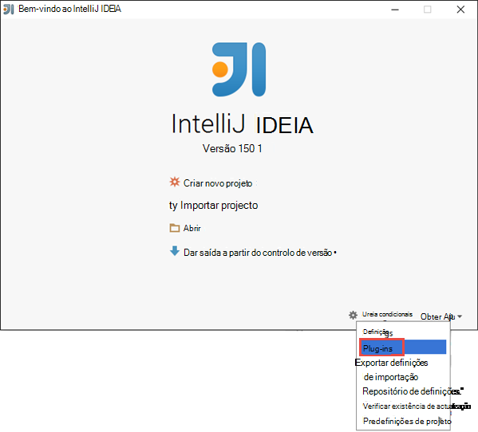
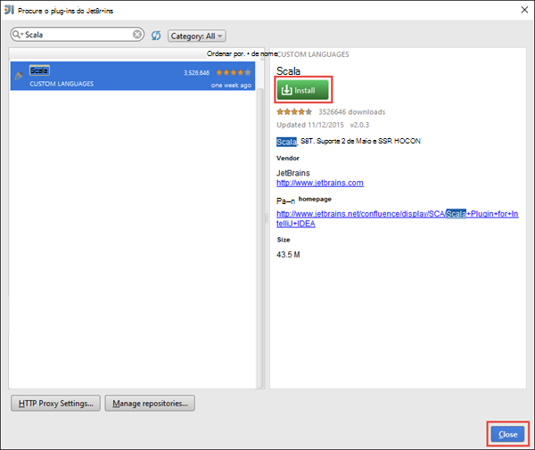
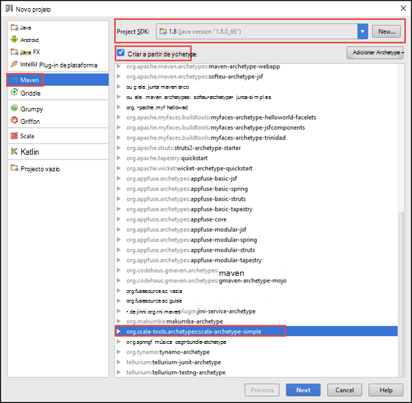
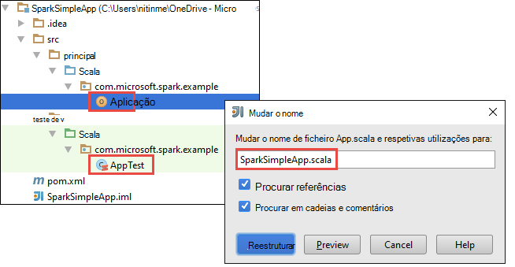
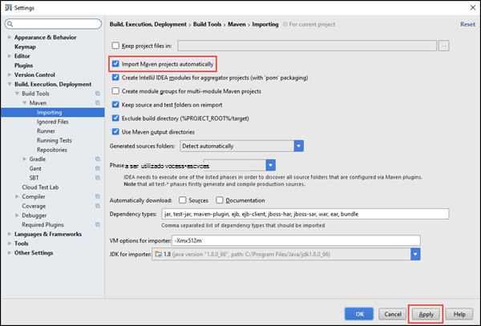
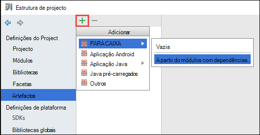
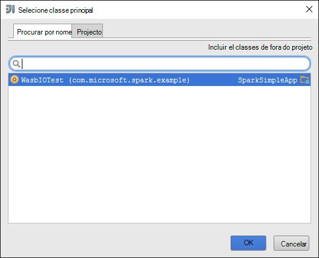
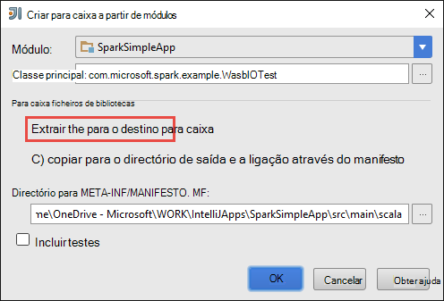
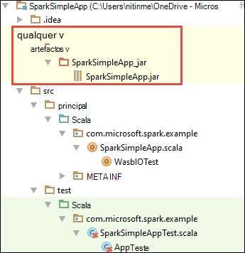

<properties
    pageTitle="Criar autónomo scala aplicações para ser executado em motores de HDInsight clusters | Microsoft Azure"
    description="Saiba como criar uma aplicação de motores para ser executada em motores de HDInsight clusters autónomo."
    services="hdinsight"
    documentationCenter=""
    authors="nitinme"
    manager="jhubbard"
    editor="cgronlun"
    tags="azure-portal"/>

<tags
    ms.service="hdinsight"
    ms.workload="big-data"
    ms.tgt_pltfrm="na"
    ms.devlang="na"
    ms.topic="article"
    ms.date="10/28/2016"
    ms.author="nitinme"/>

# Criar uma aplicação de Scala para ser executada num cluster de motores de Apache no HDInsight Linux autónomo

Este artigo fornece orientações passo a passo sobre como desenvolver aplicações de motores de autónomo escritas Scala utilizar Maven com IntelliJ IDEIA. O artigo utiliza Apache Maven como o sistema de compilação e começa com um archetype Maven existente para Scala fornecida pela IntelliJ IDEIA.  Num nível superior, criar uma Scala aplicação em IntelliJ IDEIA irá envolvem os seguintes passos:

* Utilize Maven como o sistema de compilação.
* Atualize o ficheiro de modelo de objeto do projeto (POM) para resolver dependências de módulo motores.
* Escreva a sua aplicação no Scala.
* Gera um ficheiro para caixa que pode ser submetido a clusters de motores de HDInsight.
* Execute a aplicação num cluster de motores utilizando Lívio.

>[AZURE.NOTE] HDInsight também fornece uma ferramenta de plug-in IntelliJ IDEIA para facilitar o processo de criação e submeter aplicações a um cluster de motores de HDInsight no Linux. Para mais informações, consulte o artigo [Utilizar HDInsight ferramentas Plug-in para IntelliJ IDEIA criar e submeter aplicações motores](hdinsight-apache-spark-intellij-tool-plugin.md).

**Pré-requisitos**

* Uma subscrição do Azure. Consulte o artigo [obter Azure versão de avaliação gratuita](https://azure.microsoft.com/documentation/videos/get-azure-free-trial-for-testing-hadoop-in-hdinsight/).
* Um cluster de motores de Apache HDInsight Linux. Para obter instruções, consulte o artigo [Criar motores de Apache clusters no Azure HDInsight](hdinsight-apache-spark-jupyter-spark-sql.md).
* Kit de desenvolvimento Java Oracle. Pode instalá-lo a partir de [aqui](http://www.oracle.com/technetwork/java/javase/downloads/jdk8-downloads-2133151.html).
* Um Java IDE. Este artigo utiliza IntelliJ IDEIA 15.0.1. Pode instalá-lo a partir de [aqui](https://www.jetbrains.com/idea/download/).

## Instalar o plug-in do Scala para IntelliJ IDEIA

Se não instalação IntelliJ IDEIA não foi pedido para ativar o plug-in do Scala, iniciação IntelliJ IDEIA e aceda através dos seguintes passos para instalar o plug-in:

1. Iniciar IntelliJ IDEIA e a partir do ecrã de boas-vindas, clique em **Configurar** e, em seguida, clique em **Plug-ins**.

    

2. No ecrã seguinte, clique em **Plug-in do JetBrains instalar** a partir do canto inferior esquerdo. Na caixa de diálogo **Procurar plug-ins do JetBrains** que se abre, procure Scala e, em seguida, clique em **instalar**.

    

3. Depois do plug-in instalado com êxito, clique no **botão reiniciar IDEIA IntelliJ** para reiniciar o IDE.

## Criar um projeto de Scala autónomo

1. Inicie o IntelliJ IDEIA e criar um novo projeto. Na caixa de diálogo novo do projeto, efetuar as seguintes opções e, em seguida, clique em **seguinte**.

    

    * Selecione **Maven** como o tipo de projecto.
    * Especifique um **SDK do Project**. Clique em novo e navegue para o diretório de instalação Java, normalmente `C:\Program Files\Java\jdk1.8.0_66`.
    * Selecione a opção de **criar a partir de archetype** .
    * Na lista de archetypes, selecione **org.scala-tools.archetypes:scala archetype simples**. Isto irá criar a estrutura do directório à direita e transferir as dependências de predefinidos necessários para escrever Scala programa.

2. Fornece valores relevantes para **ID de grupo**, **ArtifactId**e a **versão**. Clique em **seguinte**.

3. Na caixa de diálogo seguinte, onde pode especificar diretório Maven e outras definições de utilizador, aceite as predefinições e clique em **seguinte**.

4. Na última caixa de diálogo, especifique um nome do projeto e uma localização e, em seguida, clique em **Concluir**.

5. Elimine o ficheiro **MySpec.Scala** **src\test\scala\com\microsoft\spark\example**. Não necessita de isto para a aplicação.

6. Se necessário, mudar o nome os ficheiros de origem e teste predefinidos. A partir do painel à esquerda na IDEIA IntelliJ, navegue até ao **src\main\scala\com.microsoft.spark.example**. Com o botão direito **App.scala**, clique em **reestruturar**, clique em mudar o nome ficheiro e na caixa de diálogo, fornecem o novo nome para a aplicação e, em seguida, clique em **reestruturar**.

      

7. Nos passos subsequentes, irá actualizar pom.xml para definir as dependências para a aplicação de motores Scala. Para esses dependências para serem transferidas e resolvido automaticamente, tem de configurar Maven em conformidade.

    

    1. No menu **ficheiro** , clique em **Definições**.
    2. Na caixa de diálogo **Definições** , navegue para **criar, execução, implementação** > **Construir ferramentas** > **Maven** > **Importar**.
    3. Selecione a opção para **Importar Maven projectos automaticamente**.
    4. Clique em **Aplicar**e, em seguida, clique em **OK**.

8. Atualize o ficheiro de origem Scala para incluir código da aplicação. Abra e substituir o código de exemplo existente com o seguinte código e guarde as alterações. Este código lê os dados a partir de HVAC.csv (disponível em todos os motores de HDInsight clusters), obtém as linhas que tenham um dígito apenas na coluna sexta e escreve a saída de **/HVACOut** no contentor de armazenamento predefinido para o cluster.

        package com.microsoft.spark.example

        import org.apache.spark.SparkConf
        import org.apache.spark.SparkContext

        /**
          * Test IO to wasb
          */
        object WasbIOTest {
          def main (arg: Array[String]): Unit = {
            val conf = new SparkConf().setAppName("WASBIOTest")
            val sc = new SparkContext(conf)

            val rdd = sc.textFile("wasbs:///HdiSamples/HdiSamples/SensorSampleData/hvac/HVAC.csv")

            //find the rows which have only one digit in the 7th column in the CSV
            val rdd1 = rdd.filter(s => s.split(",")(6).length() == 1)

            rdd1.saveAsTextFile("wasbs:///HVACout")
          }
        }

9. Atualize o pom.xml.

    1.  Dentro de `<project>\<properties>` adicione o seguinte:

            <scala.version>2.10.4</scala.version>
            <scala.compat.version>2.10.4</scala.compat.version>
            <scala.binary.version>2.10</scala.binary.version>

    2. Dentro de `<project>\<dependencies>` adicione o seguinte:

            <dependency>
              <groupId>org.apache.spark</groupId>
              <artifactId>spark-core_${scala.binary.version}</artifactId>
              <version>1.4.1</version>
            </dependency>

    Guarde alterações pom.xml.

10. Crie o ficheiro .jar. IntelliJ IDEIA permite a criação de para caixa como um artifício de um projeto. Execute os passos seguintes.

    1. No menu **ficheiro** , clique em **Estrutura de projeto**.
    2. Na caixa de diálogo **Estrutura do Project** , clique em **artefactos** e, em seguida, clique no sinal. Caixa de diálogo de pop-up, clique em **JAR**e, em seguida, clique na **partir de módulos com dependências**.

        

    3. Na caixa de diálogo **Criar JAR partir módulos** , clique nas reticências ( ) contra a **Classe de principal**.

    4. Na caixa de diálogo **Selecione classe principais** , selecione a classe de que é apresentada por predefinição e, em seguida, clique em **OK**.

        

    5. Na caixa de diálogo **Criar JAR partir módulos** , certifique-se de que a opção para **extrair o para o destino para caixa** está selecionada e, em seguida, clique em **OK**. Esta ação cria uma única para caixa com todas as dependências.

        

    6. No separador Esquema de saída lista todos os jarros que estão incluídos como parte do projeto Maven. Pode selecionar e eliminar as de que a aplicação Scala tem sem dependência direta. Para a aplicação estamos a criar aqui, pode remover todos, exceto o último um (**SparkSimpleApp compilar saída**). Selecione jarros para eliminar e, em seguida, clique no ícone **Eliminar** .

        

        Certifique-se de **compilação no tornar** caixa estiver selecionada, que garantem que para a caixa é criada sempre que o projeto é criado ou atualizado. Clique em **Aplicar** e, em seguida, **OK**.

    7. Barra de menus, clique em **Criar**e, em seguida, clique em **Tornar o projeto**. Também pode clicar em **Criar artefactos** para criar para a caixa. É criada para caixa de saída em **\out\artifacts**.

        

## Executar a aplicação no cluster motores

Para executar a aplicação no cluster, têm de fazer o seguinte:

* **Copiar a aplicação para caixa para o blob armazenamento Azure** associado ao cluster. Pode utilizar [**AzCopy**](../storage/storage-use-azcopy.md), um utilitário de linha de comandos, para fazê-lo. Existem muitas outros clientes, assim que pode utilizar para carregar os dados. Pode encontrar mais informações sobre os mesmos no [carregar dados para trabalhos de Hadoop no HDInsight](hdinsight-upload-data.md).

* **Utilizar Lívio para submeter uma tarefa de aplicação remotamente** ao cluster de motores. Clusters de motores HDInsight inclui Lívio expõe resto os pontos finais para submeter remotamente tarefas de motores. Para mais informações, consulte o artigo [Submeter motores tarefas remotamente utilizando Lívio com clusters de motores no HDInsight](hdinsight-apache-spark-livy-rest-interface.md).

## Consulte também

* [Descrição geral: Apache motores no Azure HDInsight](hdinsight-apache-spark-overview.md)

### Cenários

* [Motores com BI: efetuar uma análise de dados interativos utilizando motores no HDInsight com ferramentas de BI](hdinsight-apache-spark-use-bi-tools.md)

* [Motores com máquina formação: utilizar motores no HDInsight para analisar temperatura edifício utilizando dados de AVAC](hdinsight-apache-spark-ipython-notebook-machine-learning.md)

* [Motores com máquina formação: utilizar motores no HDInsight para prever resultados da inspeção de alimentação](hdinsight-apache-spark-machine-learning-mllib-ipython.md)

* [Transmissão de motores: Motores de utilização no HDInsight para criar aplicações de transmissão em tempo real](hdinsight-apache-spark-eventhub-streaming.md)

* [Análise de registo de Web site utilizando motores no HDInsight](hdinsight-apache-spark-custom-library-website-log-analysis.md)

### Criar e executar as aplicações

* [Executar tarefas remotamente num cluster de motores utilizando Lívio](hdinsight-apache-spark-livy-rest-interface.md)

### Ferramentas e extensões

* [Utilize o plug-in do HDInsight ferramentas para obter IntelliJ IDEIA para criar e submeter motores Scala aplicações](hdinsight-apache-spark-intellij-tool-plugin.md)

* [Utilizar o plug-in do HDInsight ferramentas para obter IntelliJ IDEIA para depurar as aplicações de motores remotamente](hdinsight-apache-spark-intellij-tool-plugin-debug-jobs-remotely.md)

* [Utilizar blocos de notas Zeppelin com um cluster de motores num HDInsight](hdinsight-apache-spark-use-zeppelin-notebook.md)

* [Kernels disponíveis para o bloco de notas Jupyter num cluster de motores para HDInsight](hdinsight-apache-spark-jupyter-notebook-kernels.md)

* [Utilizar os pacotes externos com Jupyter blocos de notas](hdinsight-apache-spark-jupyter-notebook-use-external-packages.md)

* [Instalar Jupyter no seu computador e ligar a um cluster de motores de HDInsight](hdinsight-apache-spark-jupyter-notebook-install-locally.md)

### Adicionar e utilizar recursos

* [Gerir os recursos para o cluster de motores de Apache no Azure HDInsight](hdinsight-apache-spark-resource-manager.md)

* [Controlar e depuração tarefas em execução num cluster de motores de Apache HDInsight](hdinsight-apache-spark-job-debugging.md)
