 <properties
    pageTitle="Criar aplicações de motores Scala utilizando ferramentas HDInsight no Azure Toolkit para Eclipse | Microsoft Azure"
    description="Saiba como criar uma aplicação de motores para ser executada em motores de HDInsight clusters autónomo."
    services="hdinsight"
    documentationCenter=""
    authors="nitinme"
    manager="jhubbard"
    editor="cgronlun"
    tags="azure-portal"/>

<tags
    ms.service="hdinsight"
    ms.workload="big-data"
    ms.tgt_pltfrm="na"
    ms.devlang="na"
    ms.topic="article"
    ms.date="08/30/2016"
    ms.author="nitinme"/>

# Utilizar ferramentas de HDInsight no Azure Toolkit para Eclipse para criar motores aplicações para cluster HDInsight motores Linux

Este artigo fornece orientações passo a passo sobre como desenvolver aplicações motores escritas Scala e submeter-o para uma motores HDInsight cluster utilizando ferramentas HDInsight no Azure Toolkit para Eclipse. Pode utilizar as ferramentas de algumas formas diferentes:

* Para desenvolver e submeter uma aplicação de motores de Scala num cluster motores de HDInsight
* Para aceder aos seus recursos de cluster Azure HDInsight motores
* Para desenvolver e executar uma aplicação de motores de Scala localmente

>[AZURE.IMPORTANT] Esta ferramenta pode ser utilizada para criar e submeter aplicações apenas para um cluster de motores de HDInsight Linux.

##Pré-requisitos

* Uma subscrição do Azure. Consulte o artigo [obter Azure versão de avaliação gratuita](https://azure.microsoft.com/documentation/videos/get-azure-free-trial-for-testing-hadoop-in-hdinsight/).

* Um cluster de motores de Apache HDInsight Linux. Para obter instruções, consulte o artigo [Criar motores de Apache clusters no Azure HDInsight](hdinsight-apache-spark-jupyter-spark-sql.md).

* Oracle Java Development kit de versão 7 e 8 de versão. 
    * **Java SDK 7** é utilizada para a compilar projetos motores como HDInsight clusters suportarem Java versão 7. Pode transferir Java SDK 7 do [aqui](http://www.oracle.com/technetwork/java/javase/downloads/jdk7-downloads-1880260.html).
    * **Java SDK 8** é utilizado para Eclipse IDE runtime. Pode transferi-la a partir de [aqui](http://www.oracle.com/technetwork/java/javase/downloads/jdk8-downloads-2133151.html).

* Eclipse IDE. Este artigo utiliza Eclipse Neon. Pode instalá-lo a partir de [aqui](https://www.eclipse.org/downloads/).

* Scala IDE para Eclipse. 
    * **Se tiver IDE Eclipse instalado**, pode adicionar o plug-in Scala IDE ao aceder à **Ajuda** -> **Instalar novo SoftWare**e adicionar [http://download.scala-ide.org/sdk/lithium/e44/scala211/stable/site](http://download.scala-ide.org/sdk/lithium/e44/scala211/stable/site) como origem para transferir o plug-in Scala para Eclipse. 
    * **Se não tiver IDE Eclipse instalado**, pode instalar o Scala IDE diretamente a partir do [aqui](http://scala-ide.org/download/sdk.html). Pode transferir o ficheiro. zip desta ligação, extraia-o, navegue para a pasta **/eclipse** e, em seguida, execute o ficheiro de **eclipse.exe** a partir daí.
    
    >[AZURE.NOTE] Os passos neste documento são baseados em utilizar Eclipse IDE com Scala a Plug-in instalado.

* Motores SDK. Pode transferi-la a partir de [aqui](http://go.microsoft.com/fwlink/?LinkID=723585&clcid=0x409).

* Instale "e" (fx) clipse a partir de [https://www.eclipse.org/efxclipse/install.html](https://www.eclipse.org/efxclipse/install.html).

## Instalar ferramentas HDInsight no Azure Toolkit para Eclipse

HDInsight ferramentas para Eclipse está disponível como parte do Toolkit de Azure para Eclipse. Para obter instruções sobre como instalar o Toolkit de Azure, consulte o artigo [instalar o Toolkit de Azure para Eclipse](../azure-toolkit-for-eclipse-installation.md).

## Inicie sessão na sua subscrição do Azure

1. Inicie o IDE Eclipse e abrir o Explorador de Azure. No menu **janela** no IDE, clique em **Mostrar vista** e, em seguida, clique em **outros**. Na caixa de diálogo que é aberta, expanda **Azure**, clique em **Explorador do Azure**e, em seguida, clique em **OK**.

    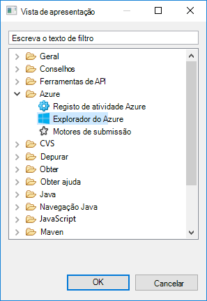

2. Com o botão direito no nó **Azure** no **Explorador do Azure**e, em seguida, clique em **Gerir subscrições**.

3. Na caixa de diálogo **Gerir subscrições** , clique em **Iniciar sessão** e introduza as suas credenciais Azure.

    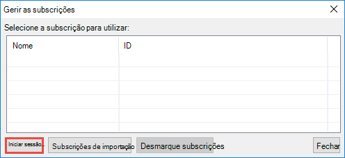

4. Depois de iniciou sessão, a caixa de diálogo **Gerir subscrições da** lista todas as subscrições Azure associadas com as credenciais. Clique em **Fechar** na caixa de diálogo.

5. No separador Azure Explorer, expanda **HDInsight** para ver os clusters de motores de HDInsight com a sua subscrição.

    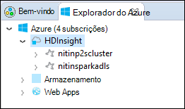

6. Pode ainda mais expandir um nó de nome de cluster para ver os recursos (por exemplo, contas de armazenamento) associados ao cluster.

    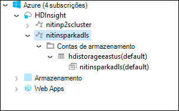

## Configurar um projecto motores Scala para um cluster de motores de HDInsight

1. Espaço de trabalho Eclipse IDE, clique em **ficheiro**, clique em **Novo**e, em seguida, clique em **projeto**. 

2. No Assistente de **Novo projeto** , expanda **HDInsight**, selecione **motores no HDInsight (Scala)**e, em seguida, clique em **seguinte**.

    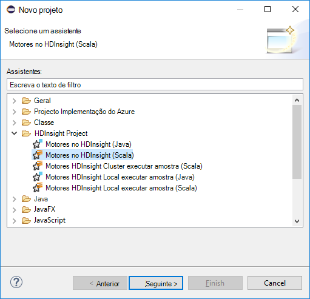

3. Na caixa de diálogo **Novo projeto de Scala HDInsight** , introduza/selecionar valores conforme mostrado na imagem abaixo e, em seguida, clique em **seguinte**.

    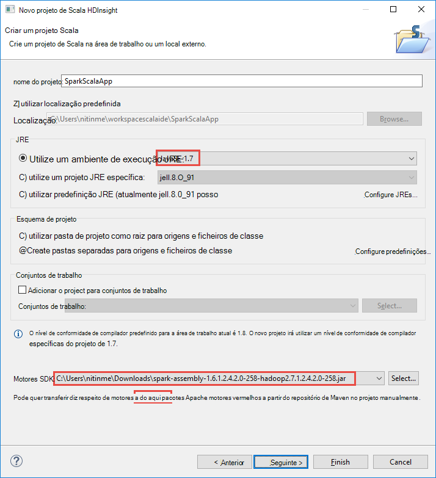

    * Introduza um nome para o projeto.
    * Na caixa **JRE** , certifique-se de **que utilizar um ambiente de execução JRE** está definido para **JavaSE 1.7**.
    * Certifique-se de que motores SDK está definido para a localização onde tenha transferido o SDK. A ligação para a localização da transferência é incluída nos [Pré-requisitos](#prerequisites) anteriormente neste tópico. Também pode transferir o SDK da ligação incluída nesta caixa de diálogo, conforme mostrado na imagem acima.    

4. Na caixa de diálogo seguinte, clique no separador de **bibliotecas** e, em seguida, faça duplo clique em **Biblioteca de sistema JRE [JavaSE 1.7]**.

    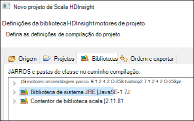

5. Na caixa de diálogo **Editar Biblioteca** , certifique-se de **Que ambiente de execução** está definido para **JavaSE-1.7(jdk1.7.0_79)**. Se não estiver disponível como opção, siga os passos abaixo.

    1. Selecione a opção de **JRE alternativo** e veja se **JavaSE-1.7(jdk1.7.0_79)** está disponível.
    2. Caso contrário, clique no botão **JREs instalado** .

          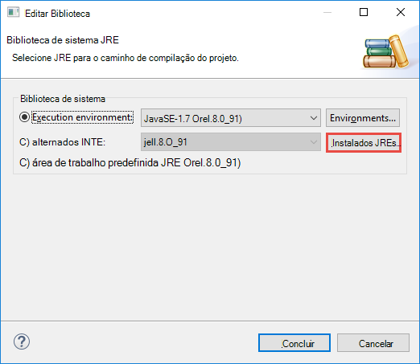

    3. Na caixa de diálogo **JREs instalado** , clique em **Adicionar**.

          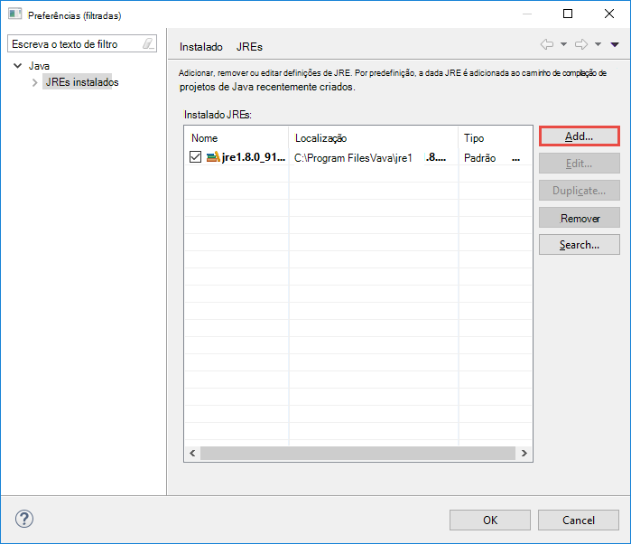  

    4. Na caixa de diálogo **Tipo de JRE** , selecione **VM padrão**e, em seguida, clique em **seguinte**

          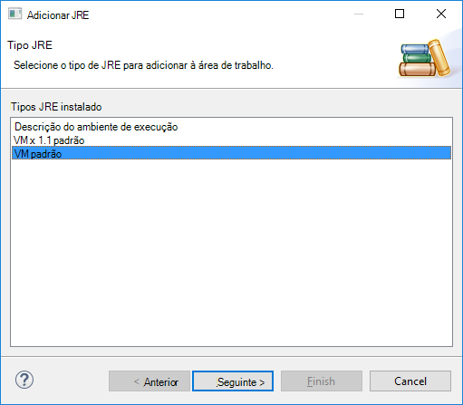  

    5. Na caixa de diálogo **Definição de JRE** , clique no diretório e, em seguida, navegue para a localização para a instalação JDK 7 e selecione a pasta de raiz para **jdk1.7.0_79**.

          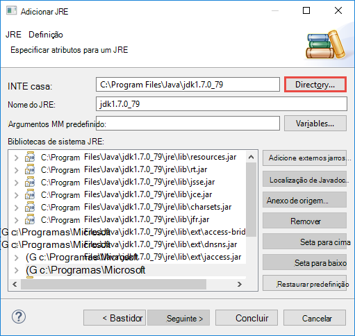  

    6. Clique em **Concluir**. Na caixa de diálogo **JREs instalado** , selecione JRE recentemente adicionado e, em seguida, clique em **OK**.

           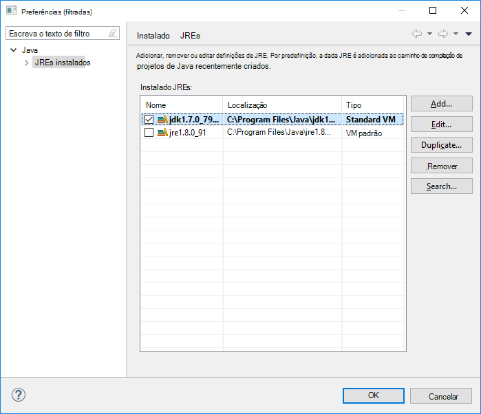

    7. JRE recentemente adicionado deve ser indicado para **Ambiente de execução**. Clique em **Concluir**.

           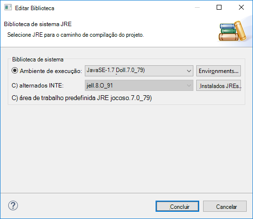

6. Novamente no separador **bibliotecas** , faça duplo clique **Scala biblioteca contentor [2.11.8]**. Na caixa de diálogo **Editar Biblioteca** , selecione **fixo Scala biblioteca contentor: 2.10.6**. 

    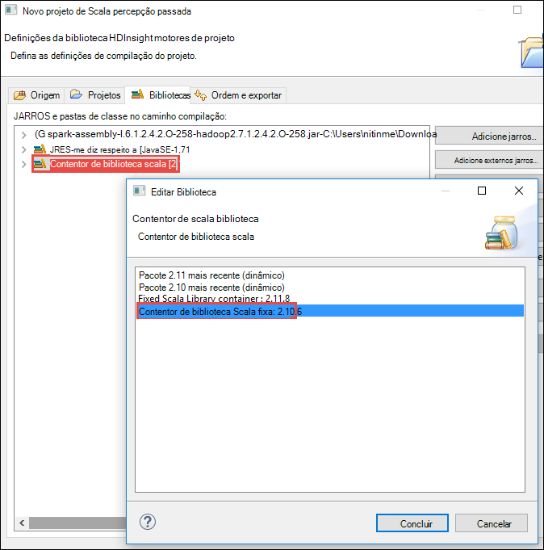

    Clique em **Concluir** até sair a caixa de diálogo de definições do project.

## Criar uma aplicação de Scala para cluster de motores de HDInsight

1. No IDE Eclipse já aberto, a partir do **Explorador do pacote**, expanda o projeto que criou anteriormente, com o botão direito **src**, aponte para **Novo**e, em seguida, clique em **outro**.

2. Na caixa de diálogo **Seleccionar um assistente** , expanda **Scala assistentes**, clique em **Objeto Scala**e, em seguida, clique em **seguinte**.

    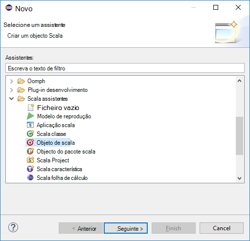

3. Na caixa de diálogo **Criar novo ficheiro** , introduza um nome para o objeto e, em seguida, clique em **Concluir**.

    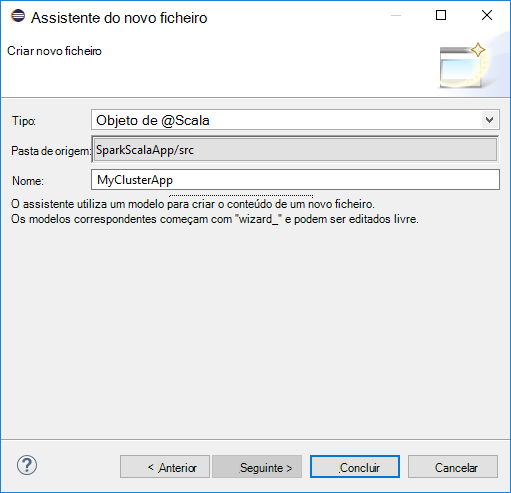

4. Cole o código seguinte no editor de texto.

        import org.apache.spark.SparkConf
        import org.apache.spark.SparkContext
    
        object MyClusterApp{
          def main (arg: Array[String]): Unit = {
            val conf = new SparkConf().setAppName("MyClusterApp")
            val sc = new SparkContext(conf)
        
            val rdd = sc.textFile("wasbs:///HdiSamples/HdiSamples/SensorSampleData/hvac/HVAC.csv")
        
            //find the rows which have only one digit in the 7th column in the CSV
            val rdd1 =  rdd.filter(s => s.split(",")(6).length() == 1)
        
            rdd1.saveAsTextFile("wasbs:///HVACOut")
          }     
        }

5. Execute a aplicação num cluster motores HDInsight.

    1. A partir do **Explorador do pacote**, o nome do projeto com o botão direito e, em seguida, selecione **Submeter aplicação motores ao HDInsight**.      

    2. Na caixa de diálogo **Motores submissão** , forneça os seguintes valores.

        * **Nome do Cluster**, seleccione o cluster de motores de HDInsight no qual pretende executar a sua aplicação.

        * Tem de selecione um artifício do projeto Eclipse ou selecione um partir do disco rígido.

        * Relativamente a caixa de texto **nome de classe principais** , introduza o nome do objeto especificado no código de (ver imagem abaixo).

            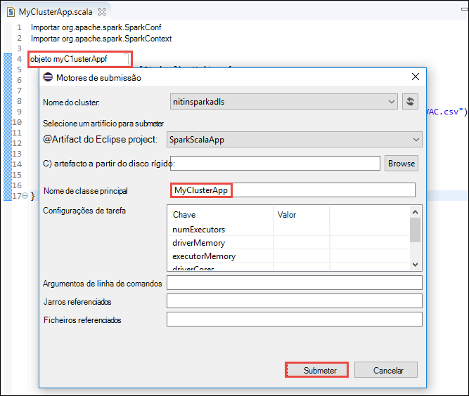

        * Uma vez que o código da aplicação neste exemplo não requer quaisquer argumentos de linha de comandos ou referenciar jarros ou ficheiros, pode deixar as restantes caixas de texto vazia.

        * Clique em **Submeter**.

    3. No separador **Apresentação de motores** deverá começar a apresentar o progresso. Pode parar a aplicação ao clicar no botão vermelho na janela do "Motores submissão". Também pode ver os registos para esta aplicação específica executar ao clicar no ícone de globo (representado pela caixa azul na imagem).

        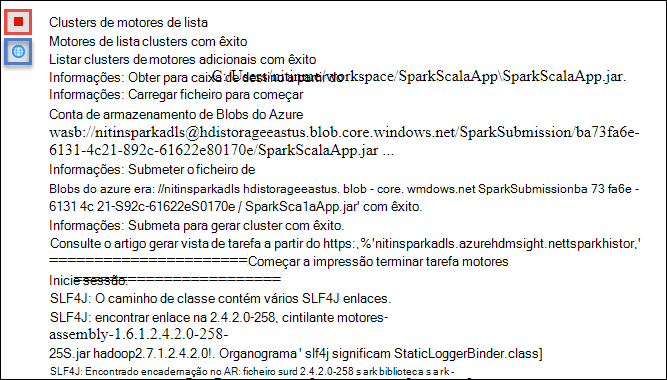

    Na secção seguinte, saiba como pode aceder ao trabalho com as ferramentas de HDInsight no Azure Toolkit para Eclipse de saída.

## Aceder e gerir os motores de HDInsight clusters utilizando as ferramentas de HDInsight no Azure Toolkit para Eclipse

Pode executar uma variedade de operações utilizando as ferramentas de HDInsight.

### O contentor de armazenamento para cluster de acesso

1. A partir do Explorador do Azure, expanda o nó de raiz **HDInsight** para ver uma lista de clusters de motores de HDInsight que estão disponíveis.

3. Expanda o nome do cluster para ver a conta de armazenamento e o contentor de armazenamento predefinido para o cluster.

    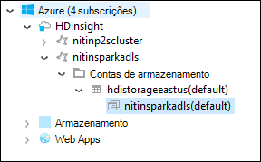

4. Clique no nome do contentor de armazenamento associado ao cluster. No painel direito, deverá ver uma pasta denominada **HVACOut**. Faça duplo clique para abrir a pasta e o irá ver **Peça -*** ficheiros. Abra uma dos ficheiros para ver os resultados da aplicação.

### Aceder ao servidor do histórico de motores

1. A partir do **Azure Explorer**, o nome de cluster motores com o botão direito e, em seguida, selecione **Abrir motores histórico IU**. Quando lhe for pedido, introduza as credenciais de administrador para o cluster. Tem de especificar estes elementos durante o cluster de aprovisionamento.

2. No dashboard do servidor de histórico de motores, pode procurar a aplicação apenas terminado a executar o utilizando o nome da aplicação. No código, defina o nome de aplicação utilizando `val conf = new SparkConf().setAppName("MyClusterApp")`. Por conseguinte, o nome da aplicação motores foi **MyClusterApp**.

### Iniciar o portal de Ambari

A partir do **Azure Explorer**, o nome de cluster motores com o botão direito e, em seguida, selecione **Abrir Portal de gestão de Cluster (Ambari)**. Quando lhe for pedido, introduza as credenciais de administrador para o cluster. Tem de especificar estes elementos durante o cluster de aprovisionamento.

### Gerir subscrições do Azure

Por predefinição, as ferramentas de HDInsight no Azure Toolkit para Eclipse lista os clusters de motores de todas as subscrições Azure. Se necessário, pode especificar as subscrições para a qual pretende aceder ao cluster. A partir do **Azure Explorer**, com o botão direito do nó de raiz do **Azure** e, em seguida, clique em **Gerir subscrições**. Na caixa de diálogo, desmarque as caixas de verificação contra a subscrição que não pretende aceder a e, em seguida, clique em **Fechar**. Também pode clicar em **Terminar sessão** se pretender terminar sessão da sua subscrição Azure.

## Executar uma aplicação de motores Scala localmente

Pode utilizar as ferramentas de HDInsight no Azure Toolkit para Eclipse para executar aplicações de motores Scala localmente no seu estação de trabalho. Normalmente, estas aplicações não precisa de aceder a recursos do cluster tal como o contentor de armazenamento e pode ser executar e testadas localmente.

### Pré-requisito

Ao executar a aplicação de motores Scala local num computador Windows, poderá receber uma exceção como é explicado em [motores 2356](https://issues.apache.org/jira/browse/SPARK-2356) que ocorre devido a um em falta **WinUtils.exe** no sistema operativo Windows. Para contornar este erro, tem de [Transferir o ficheiro executável a partir daqui](http://public-repo-1.hortonworks.com/hdp-win-alpha/winutils.exe) para uma localização como **C:\WinUtils\bin**. Em seguida, tem de adicionar uma variável de ambiente **HADOOP_HOME** e defina o valor da variável para **C\WinUtils**.

### Executar uma aplicação de motores Scala local  

1. Inicie o Eclipse e criar um novo projeto. Na caixa de diálogo novo do projeto, efetuar as seguintes opções e, em seguida, clique em **seguinte**.

    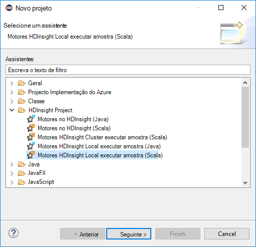

    * A partir do painel esquerdo, selecione **HDInsight**.
    * A partir do painel da direita, selecione **motores HDInsight Local executar amostra (Scala)**.
    * Clique em **seguinte**.

2. Para fornecer os detalhes do projecto, siga os passos 3 a 6 conforme mostrado na secção anterior [configurar um projecto Scala motores de aplicação para um cluster de motores de HDInsight](#set-up-a-spark-scala-application-project-for-an-hdinsight-spark cluster).

3. O modelo adiciona um código de exemplo (**LogQuery**) na pasta **src** que pode executar localmente no seu computador.

    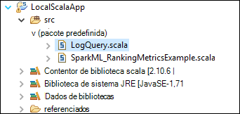

4.  Clique com o botão direito do rato sobre a aplicação de **LogQuery** , aponte para **Executar como**e, em seguida, clique em **1 Scala aplicação**. Verá uma saída da seguinte forma no separador **consola** na parte inferior.

    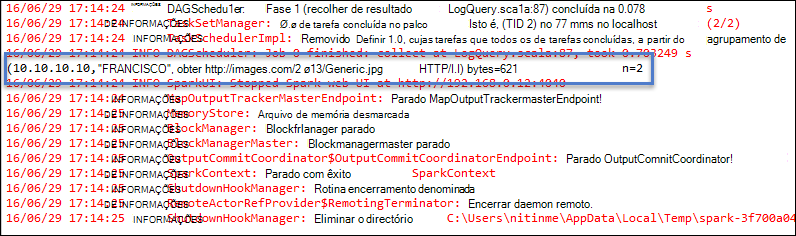

## Problemas de comentários e conhecidos

Ver atualmente motores exporta directamente não é suportada e estamos a trabalhar no que.

Se tiver qualquer sugestões ou comentários ou se encontrar algum problema ao utilizar esta ferramenta, à vontade para largue-numa mensagem de e-mail na hdivstool no microsoft ponto com.

## Consulte também

* [Descrição geral: Apache motores no Azure HDInsight](hdinsight-apache-spark-overview.md)

### Cenários

* [Motores com BI: efetuar uma análise de dados interativos utilizando motores no HDInsight com ferramentas de BI](hdinsight-apache-spark-use-bi-tools.md)

* [Motores com máquina formação: utilizar motores no HDInsight para analisar temperatura edifício utilizando dados de AVAC](hdinsight-apache-spark-ipython-notebook-machine-learning.md)

* [Motores com máquina formação: utilizar motores no HDInsight para prever resultados da inspeção de alimentação](hdinsight-apache-spark-machine-learning-mllib-ipython.md)

* [Transmissão de motores: Motores de utilização no HDInsight para criar aplicações de transmissão em tempo real](hdinsight-apache-spark-eventhub-streaming.md)

* [Análise de registo de Web site utilizando motores no HDInsight](hdinsight-apache-spark-custom-library-website-log-analysis.md)

### Criar e executar as aplicações

* [Criar uma aplicação autónoma Scala](hdinsight-apache-spark-create-standalone-application.md)

* [Executar tarefas remotamente num cluster de motores utilizando Lívio](hdinsight-apache-spark-livy-rest-interface.md)

### Ferramentas e extensões

* [Utilize as ferramentas de HDInsight Toolkit de Azure para IntelliJ para criar e submeter motores Scala aplicações](hdinsight-apache-spark-intellij-tool-plugin.md)

* [Utilizar ferramentas de HDInsight no Azure Toolkit para IntelliJ depurar gerar aplicações remotamente](hdinsight-apache-spark-intellij-tool-plugin-debug-jobs-remotely.md)

* [Utilizar blocos de notas Zeppelin com um cluster de motores num HDInsight](hdinsight-apache-spark-use-zeppelin-notebook.md)

* [Kernels disponíveis para o bloco de notas Jupyter num cluster de motores para HDInsight](hdinsight-apache-spark-jupyter-notebook-kernels.md)

* [Utilizar os pacotes externos com Jupyter blocos de notas](hdinsight-apache-spark-jupyter-notebook-use-external-packages.md)

* [Instalar Jupyter no seu computador e ligar a um cluster de motores de HDInsight](hdinsight-apache-spark-jupyter-notebook-install-locally.md)

### Adicionar e utilizar recursos

* [Gerir os recursos para o cluster de motores de Apache no Azure HDInsight](hdinsight-apache-spark-resource-manager.md)

* [Controlar e depuração tarefas em execução num cluster de motores de Apache HDInsight](hdinsight-apache-spark-job-debugging.md)
