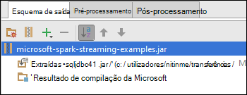

<properties 
    pageTitle="Utilizar o Azure evento concentradores com motores de Apache no HDInsight para processar dados em tempo real | Microsoft Azure" 
    description="Instruções passo a passo sobre como enviar um dados transmitir em fluxo a Azure concentrador de evento e, em seguida, recebem esses eventos na motores utilizando uma aplicação de scala" 
    services="hdinsight" 
    documentationCenter="" 
    authors="nitinme" 
    manager="jhubbard" 
    editor="cgronlun"
    tags="azure-portal"/>

<tags 
    ms.service="hdinsight" 
    ms.workload="big-data" 
    ms.tgt_pltfrm="na" 
    ms.devlang="na" 
    ms.topic="article" 
    ms.date="09/30/2016" 
    ms.author="nitinme"/>

# Transmissão de motores: Cluster de eventos do processo a partir do Azure evento concentradores com Apache motores no HDInsight Linux

Transmissão de motores expande o essencial motores API para criar aplicações de processamento de sequência dimensionáveis, alto débito, tolerância a falhas. Podem ser penetração dados de várias origens. Neste artigo utilizamos Azure evento concentradores para ingerir esta última dados. Evento concentradores é um sistema de ingestão altamente dimensionáveis incorporação que podem milhões de eventos por segundo. 

Neste tutorial, irá obter informações sobre como criar um concentrador de evento Azure, como para ingerir esta última mensagens a um concentrador de evento utilizando uma aplicação de consola Java e para obtê-las em paralelo utilizando uma aplicação de motores escrita Scala. Esta aplicação consome dados transmitido em sequência através de evento concentradores e encaminha-o para diferentes resultados (Azure armazenamento Blob, tabela Hive e tabela do SQL).

> [AZURE.NOTE] Para seguir as instruções neste artigo, tem de utilizar ambas as versões do portal do Azure. Para criar um concentrador de evento irá utilizar o [portal Azure clássica](https://manage.windowsazure.com). Para trabalhar com o cluster de motores de HDInsight, irá utilizar o [Portal do Azure](https://portal.azure.com/).  

**Pré-requisitos:**

Tem de ter o seguinte procedimento:

- Uma subscrição do Azure. Consulte o artigo [obter Azure versão de avaliação gratuita](https://azure.microsoft.com/documentation/videos/get-azure-free-trial-for-testing-hadoop-in-hdinsight/).
- Um cluster de motores de Apache. Para obter instruções, consulte o artigo [Criar motores de Apache clusters no Azure HDInsight](hdinsight-apache-spark-jupyter-spark-sql.md).
- Kit de desenvolvimento Java Oracle. Pode instalá-lo a partir de [aqui](http://www.oracle.com/technetwork/java/javase/downloads/jdk8-downloads-2133151.html).
- Um Java IDE. Este artigo utiliza IntelliJ IDEIA 15.0.1. Pode instalá-lo a partir de [aqui](https://www.jetbrains.com/idea/download/).
- Controlador de JDBC da Microsoft para SQL Server, v 4.1 ou posterior. Isto é necessário para escrever os dados de evento para uma base de dados do SQL Server. Pode instalá-lo a partir de [aqui](https://msdn.microsoft.com/sqlserver/aa937724.aspx).
- Uma base de dados do Azure SQL. Para obter instruções, consulte o artigo [criar uma base de dados do SQL em minutos](../sql-database/sql-database-get-started.md).

## O que faz esta solução?

Este é como a solução transmissão flua:

1. Crie um concentrador de evento Azure que irão receber uma sequência de eventos.

2. Executar uma aplicação autónoma do local que gera eventos e envia-o concentrador de evento Azure. A aplicação de exemplo que faz isto é publicada no [https://github.com/hdinsight/spark-streaming-data-persistence-examples](https://github.com/hdinsight/spark-streaming-data-persistence-examples).

2. Execute uma aplicação de transmissão remotamente num cluster de motores que lê eventos transmissão a partir do Azure evento Hub e envia-para localizações diferentes (BLOBs do Azure, tabela Hive e tabela de base de dados do SQL). 

## Criar concentrador de evento Azure

1. A partir do [Portal do Azure](https://manage.windowsazure.com), selecione **Novo** > **Serviço Bus** > **Concentrador de evento** > **Criar personalizado**.

2. No ecrã **Adicionar um novo concentrador de evento** , introduza um **Nome de concentrador de evento**, selecione a **região** para criar o centro no e criar um novo espaço de nomes ou selecione uma existente. Clique na **seta** para continuar.

    ![página 1 do assistente] (./media/hdinsight-apache-spark-eventhub-streaming/hdispark.streaming.create.event.hub.png "Criar um concentrador de evento Azure")

    > [AZURE.NOTE] Deve selecionar a mesma **localização** como cluster de motores de Apache por HDInsight para reduzir a latência e custos.

3. No ecrã **Configurar concentrador de evento** , introduza os valores de **contagem de partições** e **Retenção de mensagem** e, em seguida, clique na marca de verificação. Neste exemplo, utilize uma contagem de partição de 10 e retenção uma mensagem de 1. Tenha em atenção a contagem de partição porque irá necessitar este valor mais tarde.

    ![página do Assistente de 2] (./media/hdinsight-apache-spark-eventhub-streaming/hdispark.streaming.create.event.hub2.png "Especificar partição tamanho e retenção dias para concentrador de evento")

4. Clique em Centro do evento que criou, clique em **Configurar**e, em seguida, crie duas políticas de acesso para o centro do evento.

    <table>
    <tr><th>Nome</th><th>Permissões</th></tr>
    <tr><td>mysendpolicy</td><td>Enviar</td></tr>
    <tr><td>myreceivepolicy</td><td>Ouvir</td></tr>
    </table>

    Depois de criar as permissões, selecione o ícone **Guardar** na parte inferior da página. Esta ação cria as políticas de acesso partilhado que serão utilizadas para enviar (**mysendpolicy**) e ouvir (**myreceivepolicy**) este concentrador de evento.

    ![políticas] (./media/hdinsight-apache-spark-eventhub-streaming/hdispark.streaming.event.hub.policies.png "Políticas de criar concentrador de evento")

    
5. Na mesma página, tome nota das teclas de política gerado para as políticas de duas. Guarde estas teclas porque, estes serão utilizados mais tarde.

    ![chaves de política] (./media/hdinsight-apache-spark-eventhub-streaming/hdispark.streaming.event.hub.policy.keys.png "Guardar chaves de política")

6. Na página do **Dashboard** , clique em **Informações de ligação** de fundo para obter e guardar as cadeias de ligação para o concentrador de evento utilizando as duas políticas.

    ![chaves de política] (./media/hdinsight-apache-spark-eventhub-streaming/hdispark.streaming.event.hub.policy.connection.strings.png "Guardar cadeias de ligação da política")

## Utilizar uma aplicação Scala para enviar mensagens para concentrador de evento

Nesta secção utilize uma aplicação Scala local autónomo para enviar uma sequência de eventos para Azure evento concentrador que criou no passo anterior. Esta aplicação está disponível no GitHub na [https://github.com/hdinsight/eventhubs-sample-event-producer](https://github.com/hdinsight/eventhubs-sample-event-producer). Estes passos partem do pressuposto de que já tenham forked este repositório GitHub.

1. Abra a aplicação, **EventhubsSampleEventProducer**, no IntelliJ IDEIA.
    
2. Construa o projeto. No menu de **Criar** , clique em **Tornar o projeto**. É criada para caixa de saída em **\out\artifacts**.

>[AZURE.TIP] Também pode utilizar uma opção disponível no IntelliJ IDEIA para diretamente criar projeto a partir de um repositório de GitHub. Para compreender como utilizar esse abordagem, utilize as instruções na secção seguinte para obter orientações. Tenha em atenção que muitas passos descritos na secção seguinte não ser aplicáveis para a aplicação de Scala que criou neste passo. Por exemplo:

> * Não terá de atualizar POM para incluir a versão de motores. Que é porque não existe nenhuma dependência no motores para criar esta aplicação
> * Não terá de adicionar alguns jarros dependência à biblioteca de projeto. Se ao facto esses jarros não são necessários para este projeto.

## Atualizar Scala transmissão de aplicação para receber os eventos

Uma aplicação de Scala de exemplo para receber o evento e encaminhá-lo para diferentes destinos está disponível em [https://github.com/hdinsight/spark-streaming-data-persistence-examples](https://github.com/hdinsight/spark-streaming-data-persistence-examples). Siga os passos abaixo para atualizar a aplicação e criar para caixa de saída.

1. Iniciação IntelliJ IDEIA e no ecrã de iniciação selecione **dar saída a partir do controlo de versão** e, em seguida, clique em **Git**.
        
    

2. Na caixa de diálogo **Clonar repositório** , fornece o URL para o repositório Git clonar a partir de, especificar o directório para clonar para e, em seguida, clique em **clonar**.

    

    
3. Siga os pedidos até que o projeto é completamente clonar. Prima **Alt + 1** para abrir a **Vista de projeto**. Deverá semelhante ao seguinte.

    
    
4. Certifique-se de que o código da aplicação está compilado com Java8. Para assegurar que, clique em **ficheiro**, clique em **Estrutura do projeto**e, no separador **projeto** , certifique-se de nível de idioma do projeto está definido para **8 - Lambdas, tipo anotações, etc.**.

    

5. Abra o **pom.xml** e certifique-se que a versão de motores está correta. Em <properties> nó, procure o fragmento que se segue e verifique se a versão de motores.

        <scala.version>2.10.4</scala.version>
        <scala.compat.version>2.10.4</scala.compat.version>
        <scala.binary.version>2.10</scala.binary.version>
        <spark.version>1.6.2</spark.version>
    
5. A aplicação necessita de dois dependência jarros:

    * **Para caixa de recetor EventHub**. Isto é necessário para motores receber as mensagens a partir do Hub do evento. Para utilizar para esta caixa, atualize o **pom.xml** para adicionar o seguinte em `<dependencies>`.

            <dependency>
              <groupId>com.microsoft.azure</groupId>
              <artifactId>spark-streaming-eventhubs_2.10</artifactId>
              <version>1.6.0</version>
            </dependency> 

    * **Para caixa controlador JDBC**. Isto é necessário para escrever as mensagens recebidas a partir do Hub do evento para uma base de dados do Azure SQL. Pode transferir v 4.1 ou posterior deste ficheiro para caixa a partir de [aqui](https://msdn.microsoft.com/sqlserver/aa937724.aspx). Adicione uma referência a para esta caixa na biblioteca de projeto. Execute os seguintes passos:

        1. A partir da janela de IntelliJ IDEIA sempre que tiver a aplicação aberta, clique em **ficheiro**, clique em **Estrutura do projeto**e, em seguida, clique em **bibliotecas**. 
        
        2. Clique no ícone Adicionar (), clique em **Java**e, em seguida, navegue para a localização onde que transferiu para caixa de controlador JDBC. Siga os pedidos para adicionar o ficheiro para caixa para a biblioteca do projeto.

            ![Adicionar dependências em falta] (./media/hdinsight-apache-spark-eventhub-streaming/add-missing-dependency-jars.png "Adicionar em falta jarros de dependência")

        3. Clique em **Aplicar**.

6. Crie o ficheiro para caixa de saída. Execute os passos seguintes.
    1. Na caixa de diálogo **Estrutura do Project** , clique em **artefactos** e, em seguida, clique no sinal. Caixa de diálogo de pop-up, clique em **JAR**e, em seguida, clique na **partir de módulos com dependências**.

        

    1. Na caixa de diálogo **Criar JAR partir módulos** , clique nas reticências () contra a **Classe de principal**.

    1. Na caixa de diálogo **Selecione classe principais** , selecione qualquer uma das classes disponíveis e, em seguida, clique em **OK**.

        

    1. Na caixa de diálogo **Criar JAR partir módulos** , certifique-se de que a opção para **extrair o para o destino para caixa** está selecionada e, em seguida, clique em **OK**. Esta ação cria uma única para caixa com todas as dependências.

        

    1. No separador **Esquema de saída** lista todos os jarros que estão incluídos como parte do projeto Maven. Pode selecionar e eliminar as de que a aplicação Scala tem sem dependência direta. Para a aplicação estamos a criar aqui, pode remover todos, exceto o último um (**microsoft-motores de transmissão de exemplos compilar saída**). Selecione jarros para eliminar e, em seguida, clique no ícone **Eliminar** ().

        

        Certifique-se de **compilação no tornar** caixa estiver selecionada, que garantem que para a caixa é criada sempre que o projeto é criado ou atualizado. Clique em **Aplicar** e, em seguida, **OK**.

    1. No separador **Esquema de saída** , à direita na parte inferior da caixa **Elementos disponíveis** , tem de para caixa SQL JDBC que adicionou anteriormente para a biblioteca do projeto. Tem de adicionar este para o separador **Esquema de saída** . Com o botão direito no ficheiro para caixa e, em seguida, clique em **Extrair para raiz de saída**.

          

        No separador **Esquema de saída** deverá agora o seguinte aspeto.

             

        Na caixa de diálogo **Estrutura do Project** , clique em **Aplicar** e, em seguida, clique em **OK**. 

    1. Barra de menus, clique em **Criar**e, em seguida, clique em **Tornar o projeto**. Também pode clicar em **Criar artefactos** para criar para a caixa. É criada para caixa de saída em **\out\artifacts**.

        

## Executar as aplicações remotamente num cluster de motores utilizando Lívio

Irá utilizamos Lívio para executar a aplicação de transmissão remotamente num cluster de motores. Para informações detalhadas sobre sobre como utilizar Lívio com cluster de motores de HDInsight, consulte o artigo [submeter tarefas remotamente a um cluster de motores de Apache no Azure HDInsight](hdinsight-apache-spark-livy-rest-interface.md). Antes de poder iniciar a executar as tarefas de remotas para eventos de sequência utilizando motores existentes são algumas coisas que deve fazer:

1. Iniciar a aplicação autónomo local para gerar eventos e enviada para o evento concentrador. Utilize o seguinte comando para fazê-lo:

        java -cp EventhubsSampleEventProducer.jar com.microsoft.eventhubs.client.example.EventhubsClientDriver --eventhubs-namespace "mysbnamespace" --eventhubs-name "myeventhub" --policy-name "mysendpolicy" --policy-key "<policy key>" --message-length 32 --thread-count 32 --message-count -1

2. Copie a transmissão para caixa (**microsoft-motores de transmissão-examples.jar**) para o armazenamento de Blobs do Azure associado ao cluster. Isto torna acessível a Lívio para a caixa. Pode utilizar [**AzCopy**](../storage/storage-use-azcopy.md), um utilitário de linha de comandos, para fazê-lo. Existem muitas outros clientes que pode utilizar para carregar dados. Pode encontrar mais informações sobre os mesmos no [carregar dados para trabalhos de Hadoop no HDInsight](hdinsight-upload-data.md).

3. Instale o LAÇO no computador onde está a executar estas aplicações a partir de. Utilizamos LAÇO para invocar os pontos finais Lívio para executar as tarefas remotamente.

### Execute as aplicações para receber os eventos para um Blob de armazenamento do Azure como texto

Abra uma linha de comandos, navegue para o directório onde instalou o LAÇO e execute o seguinte comando (substituir nome de utilizador/palavra-passe e cluster nome):

    curl -k --user "admin:mypassword1!" -v -H "Content-Type: application/json" -X POST --data @C:\Temp\inputBlob.txt "https://mysparkcluster.azurehdinsight.net/livy/batches"

Os parâmetros no ficheiro **inputBlob.txt** são definidos da seguinte forma:

    { "file":"wasbs:///example/jars/microsoft-spark-streaming-examples.jar", "className":"com.microsoft.spark.streaming.examples.workloads.EventhubsEventCount", "args":["--eventhubs-namespace", "mysbnamespace", "--eventhubs-name", "myeventhub", "--policy-name", "myreceivepolicy", "--policy-key", "<put-your-key-here>", "--consumer-group", "$default", "--partition-count", 10, "--batch-interval-in-seconds", 20, "--checkpoint-directory", "/EventCheckpoint", "--event-count-folder", "/EventCount/EventCount10"], "numExecutors":20, "executorMemory":"1G", "executorCores":1, "driverMemory":"2G" }

Compreenda diga-no que são os parâmetros no ficheiro de entrada:

* **ficheiro** é o caminho para o ficheiro para caixa da aplicação na conta de armazenamento Azure associado ao cluster.
* **NomeClasse** é o nome da classe para a caixa.
* **argumentos** é a lista de argumentos necessários pela classe
* **numExecutors** é o número de núcleos utilizado pelo motores para executar a aplicação de transmissão. Devem estar sempre, pelo menos, duas vezes o número de partições concentrador de evento.
* **executorMemory**, **executorCores**, **driverMemory** são utilizados para atribuir recursos necessários para a aplicação de transmissão de parâmetros.

>[AZURE.NOTE] Não necessita de criar as pastas de saída (EventCheckpoint, contagem de eventos/EventCount10) são utilizadas como parâmetros. A aplicação de transmissão cria-los por si.
    
Quando executa o comando, deverá ver um resultado semelhante ao seguinte:

    < HTTP/1.1 201 Created
    < Content-Type: application/json; charset=UTF-8
    < Location: /18
    < Server: Microsoft-IIS/8.5
    < X-Powered-By: ARR/2.5
    < X-Powered-By: ASP.NET
    < Date: Tue, 01 Dec 2015 05:39:10 GMT
    < Content-Length: 37
    <
    {"id":1,"state":"starting","log":[]}* Connection #0 to host mysparkcluster.azurehdinsight.net left intact

Tome nota do ID do lote na última linha no resultado (neste exemplo é '1'). Para verificar que a aplicação é executada com sucesso, pode procurar na sua conta de armazenamento Azure associada ao cluster e deverá ver a pasta de **/EventCount/EventCount10** criou aí. Esta pasta deve conter blobs que sucintamente o número de eventos processadas dentro do período de tempo especificado para o parâmetro **lote intervalo em segundos**.

A aplicação irão continuar a ser executadas até que eliminá-lo. Para fazê-lo, utilize o seguinte comando:

    curl -k --user "admin:mypassword1!" -v -X DELETE "https://mysparkcluster.azurehdinsight.net/livy/batches/1"

### Execute as aplicações para receber os eventos para um Blob de armazenamento do Azure como JSON

Abra uma linha de comandos, navegue para o directório onde instalou o LAÇO e execute o seguinte comando (substituir nome de utilizador/palavra-passe e cluster nome):

    curl -k --user "admin:mypassword1!" -v -H "Content-Type: application/json" -X POST --data @C:\Temp\inputJSON.txt "https://mysparkcluster.azurehdinsight.net/livy/batches"

Os parâmetros no ficheiro **inputJSON.txt** são definidos da seguinte forma:

    { "file":"wasbs:///example/jars/microsoft-spark-streaming-examples.jar", "className":"com.microsoft.spark.streaming.examples.workloads.EventhubsToAzureBlobAsJSON", "args":["--eventhubs-namespace", "mysbnamespace", "--eventhubs-name", "myeventhub", "--policy-name", "myreceivepolicy", "--policy-key", "<put-your-key-here>", "--consumer-group", "$default", "--partition-count", 10, "--batch-interval-in-seconds", 20, "--checkpoint-directory", "/EventCheckpoint", "--event-count-folder", "/EventCount/EventCount10", "--event-store-folder", "/EventStore10"], "numExecutors":20, "executorMemory":"1G", "executorCores":1, "driverMemory":"2G" }

Os parâmetros são semelhantes às que especificou no resultado de texto, no passo anterior. Novamente, não tem de criar as pastas de saída (EventCheckpoint, contagem de eventos/EventCount10) são utilizadas como parâmetros. A aplicação de transmissão cria-los por si.

 Depois de executar o comando, pode procurar na sua conta de armazenamento Azure associada ao cluster e deverá ver a pasta de **/EventStore10** criou aí. Abrir qualquer ficheiro com **Peça -** e o prefixo deverá ver os eventos processados num formato JSON.

### Execute as aplicações para receber os eventos para uma tabela Hive

Para executar a aplicação que transmite em fluxo eventos para uma tabela Hive tem alguns componentes adicionais. Estas são:

* datanucleus-api jdo 3.2.6.jar
* datanucleus-rdbms-3.2.9.jar
* datanucleus-core-3.2.10.jar
* ramo site.xml

Os ficheiros de **.jar** estão disponíveis no seu cluster de motores de HDInsight na `/usr/hdp/current/spark-client/lib`. O **ramo site.xml** está disponível em `/usr/hdp/current/spark-client/conf`.

Pode utilizar [WinScp](http://winscp.net/eng/download.php) para copiar sobre estes ficheiros de cluster o computador local. Em seguida, pode utilizar ferramentas para copiar estes ficheiros sobre à sua conta de armazenamento associada ao cluster. Para mais informações sobre como carregar ficheiros para a conta de armazenamento, consulte o artigo [carregar dados para trabalhos de Hadoop no HDInsight](hdinsight-upload-data.md).

Assim que tiver copiou os ficheiros à sua conta de armazenamento Azure, abra uma linha de comandos, navegue para o directório onde instalou o LAÇO e execute o seguinte comando (substituir nome de utilizador/palavra-passe e cluster nome):

    curl -k --user "admin:mypassword1!" -v -H "Content-Type: application/json" -X POST --data @C:\Temp\inputHive.txt "https://mysparkcluster.azurehdinsight.net/livy/batches"

Os parâmetros no ficheiro **inputHive.txt** são definidos da seguinte forma:

    { "file":"wasbs:///example/jars/microsoft-spark-streaming-examples.jar", "className":"com.microsoft.spark.streaming.examples.workloads.EventhubsToHiveTable", "args":["--eventhubs-namespace", "mysbnamespace", "--eventhubs-name", "myeventhub", "--policy-name", "myreceivepolicy", "--policy-key", "<put-your-key-here>", "--consumer-group", "$default", "--partition-count", 10, "--batch-interval-in-seconds", 20, "--checkpoint-directory", "/EventCheckpoint", "--event-count-folder", "/EventCount/EventCount10", "--event-hive-table", "EventHiveTable10" ], "jars":["wasbs:///example/jars/datanucleus-api-jdo-3.2.6.jar", "wasbs:///example/jars/datanucleus-rdbms-3.2.9.jar", "wasbs:///example/jars/datanucleus-core-3.2.10.jar"], "files":["wasbs:///example/jars/hive-site.xml"], "numExecutors":20, "executorMemory":"1G", "executorCores":1, "driverMemory":"2G" }

Os parâmetros são semelhantes às que especificou no resultado de texto, nos passos anteriores. Novamente, não é necessário criar as pastas de saída (EventCheckpoint, contagem de eventos/EventCount10) ou o resultado da tabela Hive (EventHiveTable10) que são utilizados como parâmetros. A aplicação de transmissão cria-los por si. Tenha em atenção que a opção **jarros** e **ficheiros** inclui caminhos para os ficheiros de .jar e o site.xml ramo que copiou para a conta de armazenamento.

Para verificar que a tabela hive foi criada com êxito, pode SSH para cluster e executar consultas de ramo. Para obter instruções, consulte o artigo [Utilizar Hive com Hadoop no HDInsight com SSH](hdinsight-hadoop-use-hive-ssh.md). Assim que estiver ligado utilizando SSH, pode executar o seguinte comando para verificar que a tabela Hive, **EventHiveTable10**, é criada.

    show tables;

Deverá visualizar um resultado semelhante ao seguinte:

    OK
    eventhivetable10
    hivesampletable

Também pode executar uma consulta SELECIONAR para ver o conteúdo da tabela.

    SELECT * FROM eventhivetable10 LIMIT 10;

Deverá visualizar um resultado semelhante ao seguinte:

    ZN90apUSQODDTx7n6Toh6jDbuPngqT4c
    sor2M7xsFwmaRW8W8NDwMneFNMrOVkW1
    o2HcsU735ejSi2bGEcbUSB4btCFmI1lW
    TLuibq4rbj0T9st9eEzIWJwNGtMWYoYS
    HKCpPlWFWAJILwR69MAq863nCWYzDEw6
    Mvx0GQOPYvPR7ezBEpIHYKTKiEhYammQ
    85dRppSBSbZgThLr1s0GMgKqynDUqudr
    5LAWkNqorLj3ZN9a2mfWr9rZqeXKN4pF
    ulf9wSFNjD7BZXCyunozecov9QpEIYmJ
    vWzM3nvOja8DhYcwn0n5eTfOItZ966pa
    Time taken: 4.434 seconds, Fetched: 10 row(s)

### Execute as aplicações para receber os eventos para uma tabela de base de dados do Azure SQL

Antes de executar este passo, certifique-se de que tem uma base de dados do Azure SQL criado. Terá de valores para nome da base de dados, nome de servidor de base de dados e as credenciais de administrador da base de dados como parâmetros. Não necessita de criar embora a tabela de base de dados. A aplicação de transmissão cria que por si.

Abra uma linha de comandos, navegue para o directório onde instalou o LAÇO e execute o seguinte comando:

    curl -k --user "admin:mypassword1!" -v -H "Content-Type: application/json" -X POST --data @C:\Temp\inputSQL.txt "https://mysparkcluster.azurehdinsight.net/livy/batches"

Os parâmetros no ficheiro **inputSQL.txt** são definidos da seguinte forma:

    { "file":"wasbs:///example/jars/microsoft-spark-streaming-examples.jar", "className":"com.microsoft.spark.streaming.examples.workloads.EventhubsToAzureSQLTable", "args":["--eventhubs-namespace", "mysbnamespace", "--eventhubs-name", "myeventhub", "--policy-name", "myreceivepolicy", "--policy-key", "<put-your-key-here>", "--consumer-group", "$default", "--partition-count", 10, "--batch-interval-in-seconds", 20, "--checkpoint-directory", "/EventCheckpoint", "--event-count-folder", "/EventCount/EventCount10", "--sql-server-fqdn", "<database-server-name>.database.windows.net", "--sql-database-name", "mysparkdatabase", "--database-username", "sparkdbadmin", "--database-password", "<put-password-here>", "--event-sql-table", "EventContent" ], "numExecutors":20, "executorMemory":"1G", "executorCores":1, "driverMemory":"2G" }

Para verificar que a aplicação é executada com sucesso, pode ligar à base de dados Azure SQL com o SQL Server Management Studio. Para obter instruções sobre como fazê-lo, consulte o artigo [ligar a base de dados do SQL com SQL Server Management Studio](../sql-database/sql-database-connect-query-ssms.md). Assim que estiverem ligados à base de dados, pode navegar para a tabela **EventContent** que foi criada pela aplicação transmissão. Pode executar uma consulta rápida para obter os dados a partir da tabela. Execute a seguinte consulta:

    SELECT * FROM EventCount

Deverá visualizar saída semelhante ao seguinte:

    00046b0f-2552-4980-9c3f-8bba5647c8ee
    000b7530-12f9-4081-8e19-90acd26f9c0c
    000bc521-9c1b-4a42-ab08-dc1893b83f3b
    00123a2a-e00d-496a-9104-108920955718
    0017c68f-7a4e-452d-97ad-5cb1fe5ba81b
    001KsmqL2gfu5ZcuQuTqTxQvVyGCqPp9
    001vIZgOStka4DXtud0e3tX7XbfMnZrN
    00220586-3e1a-4d2d-a89b-05c5892e541a
    0029e309-9e54-4e1b-84be-cd04e6fce5ec
    003333cf-874f-4045-9da3-9f98c2b4ea49
    0043c07e-8d73-420a-9af7-1fcb94575356
    004a11a9-0c2c-4bc0-a7d5-2e0ebd947ab9

    
## Consulte também

* [Descrição geral: Apache motores no Azure HDInsight](hdinsight-apache-spark-overview.md)

### Cenários

* [Motores com BI: efetuar uma análise de dados interativos utilizando motores no HDInsight com ferramentas de BI](hdinsight-apache-spark-use-bi-tools.md)

* [Motores com máquina formação: utilizar motores no HDInsight para analisar temperatura edifício utilizando dados de AVAC](hdinsight-apache-spark-ipython-notebook-machine-learning.md)

* [Motores com máquina formação: utilizar motores no HDInsight para prever resultados da inspeção de alimentação](hdinsight-apache-spark-machine-learning-mllib-ipython.md)

* [Análise de registo de Web site utilizando motores no HDInsight](hdinsight-apache-spark-custom-library-website-log-analysis.md)

### Criar e executar as aplicações

* [Criar uma aplicação autónoma Scala](hdinsight-apache-spark-create-standalone-application.md)

* [Executar tarefas remotamente num cluster de motores utilizando Lívio](hdinsight-apache-spark-livy-rest-interface.md)

### Ferramentas e extensões

* [Utilize o plug-in do HDInsight ferramentas para obter IntelliJ IDEIA para criar e submeter motores Scala aplicações](hdinsight-apache-spark-intellij-tool-plugin.md)

* [Utilizar o plug-in do HDInsight ferramentas para obter IntelliJ IDEIA para depurar as aplicações de motores remotamente](hdinsight-apache-spark-intellij-tool-plugin-debug-jobs-remotely.md)

* [Utilizar blocos de notas Zeppelin com um cluster de motores num HDInsight](hdinsight-apache-spark-use-zeppelin-notebook.md)

* [Kernels disponíveis para o bloco de notas Jupyter num cluster de motores para HDInsight](hdinsight-apache-spark-jupyter-notebook-kernels.md)

* [Utilizar os pacotes externos com Jupyter blocos de notas](hdinsight-apache-spark-jupyter-notebook-use-external-packages.md)

* [Instalar Jupyter no seu computador e ligar a um cluster de motores de HDInsight](hdinsight-apache-spark-jupyter-notebook-install-locally.md)

### Adicionar e utilizar recursos

* [Gerir os recursos para o cluster de motores de Apache no Azure HDInsight](hdinsight-apache-spark-resource-manager.md)

* [Controlar e depuração tarefas em execução num cluster de motores de Apache HDInsight](hdinsight-apache-spark-job-debugging.md)

[hdinsight-versions]: hdinsight-component-versioning.md
[hdinsight-upload-data]: hdinsight-upload-data.md
[hdinsight-storage]: hdinsight-hadoop-use-blob-storage.md

[azure-purchase-options]: http://azure.microsoft.com/pricing/purchase-options/
[azure-member-offers]: http://azure.microsoft.com/pricing/member-offers/
[azure-free-trial]: http://azure.microsoft.com/pricing/free-trial/
[azure-management-portal]: https://manage.windowsazure.com/
[azure-create-storageaccount]: ../storage-create-storage-account/ 
