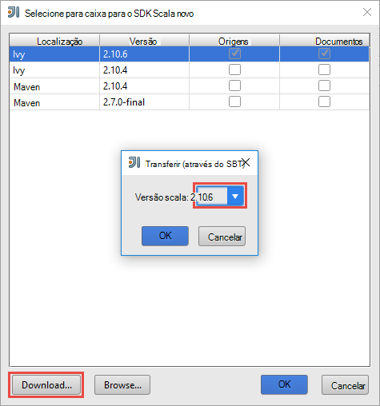
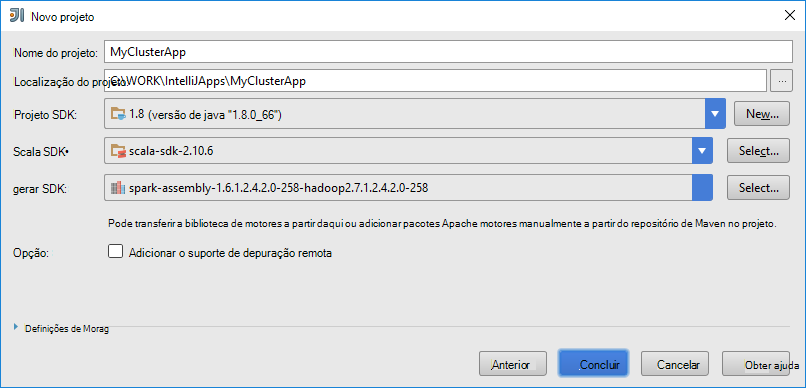
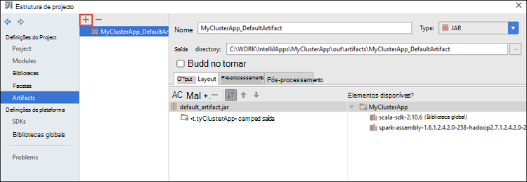
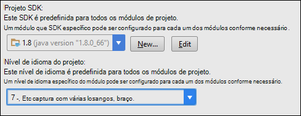
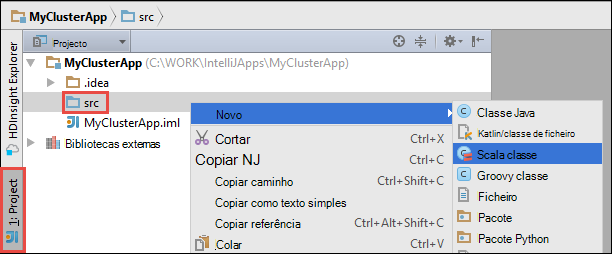

 <properties
    pageTitle="Utilize as ferramentas de HDInsight Toolkit de Azure para IntelliJ para remotamente depurar aplicações em execução em motores de HDInsight clusters | Microsoft Azure"
    description="Saiba como utilizar ferramentas de HDInsight no Azure Toolkit para IntelliJ para remotamente depurar aplicações em execução em clusters de motores de HDInsight."
    services="hdinsight"
    documentationCenter=""
    authors="nitinme"
    manager="jhubbard"
    editor="cgronlun"
    tags="azure-portal"/>

<tags
    ms.service="hdinsight"
    ms.workload="big-data"
    ms.tgt_pltfrm="na"
    ms.devlang="na"
    ms.topic="article"
    ms.date="09/09/2016"
    ms.author="nitinme"/>

# Utilize as ferramentas de HDInsight Toolkit de Azure para IntelliJ para depurar as aplicações de motores remotamente num cluster de HDInsight motores Linux

Este artigo fornece orientações passo a passo sobre como utilizar as ferramentas de HDInsight no Azure Toolkit para IntelliJ para submeter uma tarefa de motores num cluster de motores de HDInsight e, em seguida, depurar-remotamente a partir do computador de secretária. Para fazê-lo, deve efetuar os seguintes passos de alto nível:

1. Crie site para o site ou site de ponto Azure rede Virtual. Os passos neste documento partem do pressuposto de que utiliza uma rede do site para o site.

2. Crie um cluster de motores no Azure HDInsight que faz parte da rede Virtual do Azure de site para o site.

3. Verifique a ligação entre o headnode cluster e o seu ambiente de trabalho.

4. Criar uma aplicação Scala no IntelliJ IDEIA e configure-o para a depuração remota.

5. Executar e depurar a aplicação.

##Pré-requisitos

* Uma subscrição do Azure. Consulte o artigo [obter Azure versão de avaliação gratuita](https://azure.microsoft.com/documentation/videos/get-azure-free-trial-for-testing-hadoop-in-hdinsight/).

* Um cluster de motores de Apache HDInsight Linux. Para obter instruções, consulte o artigo [Criar motores de Apache clusters no Azure HDInsight](hdinsight-apache-spark-jupyter-spark-sql.md).
 
* Kit de desenvolvimento Java Oracle. Pode instalá-lo a partir de [aqui](http://www.oracle.com/technetwork/java/javase/downloads/jdk8-downloads-2133151.html).
 
* IntelliJ IDEIA. Este artigo utiliza a versão 15.0.1. Pode instalá-lo a partir de [aqui](https://www.jetbrains.com/idea/download/).
 
* Ferramentas de HDInsight no Azure Toolkit para IntelliJ. Ferramentas de HDInsight para IntelliJ estão disponíveis como parte do Toolkit de Azure para IntelliJ. Para obter instruções sobre como instalar o Toolkit de Azure, consulte o artigo [instalar o Toolkit de Azure para IntelliJ](../azure-toolkit-for-intellij-installation.md).

* Registo para a sua subscrição Azure da IntelliJ IDEIA. Siga as instruções [aqui](hdinsight-apache-spark-intellij-tool-plugin.md#log-into-your-azure-subscription).
 
* Ao executar a aplicação de motores Scala para depuração remota num computador Windows, poderá receber uma exceção como é explicado em [motores 2356](https://issues.apache.org/jira/browse/SPARK-2356) que ocorre devido a um WinUtils.exe em falta no Windows. Para contornar este erro, tem de [Transferir o ficheiro executável a partir daqui](http://public-repo-1.hortonworks.com/hdp-win-alpha/winutils.exe) para uma localização como **C:\WinUtils\bin**. Em seguida, tem de adicionar uma variável de ambiente **HADOOP_HOME** e defina o valor da variável para **C\WinUtils**.

## Passo 1: Criar uma rede Virtual Azure

Siga as instruções das hiperligações abaixo para criar uma rede Virtual do Azure e, em seguida, verifique se a ligação entre o ambiente de trabalho e de rede Virtual do Azure.

* [Criar um VNet com uma ligação VPN de site para o site através do Portal do Azure](../vpn-gateway/vpn-gateway-howto-site-to-site-resource-manager-portal.md)
* [Criar um VNet com uma ligação VPN de site para o site através do PowerShell](../vpn-gateway/vpn-gateway-create-site-to-site-rm-powershell.md)
* [Configurar uma ligação ponto-para-site a uma rede virtual através do PowerShell](../vpn-gateway/vpn-gateway-howto-point-to-site-rm-ps.md)

## Passo 2: Criar um cluster de motores de HDInsight

Também deve criar um cluster de motores de Apache no Azure HDInsight que faz parte da rede Virtual Azure que criou. Utilize as informações disponíveis na [baseado em criar Linux clusters de HDInsight](hdinsight-hadoop-provision-linux-clusters.md). Como parte da configuração opcional, selecione a rede Virtual Azure que criou no passo anterior.

## Passo 3: Verificar a ligação entre o headnode cluster e o seu ambiente de trabalho

1. Obter o endereço IP da headnode. Abra Ambari IU para cluster. Pá cluster, clique em **Dashboard**.

    

2. IU Ambari, a partir do canto superior direito, clique em **anfitriões**.

    

3. Deverá ver uma lista de headnodes, nós de trabalho e nós zookeeper. Os headnodes tem o **hn*** prefixo. Clique na primeira headnode.

    

4. Na parte inferior da página que é aberta, na caixa **Resumo** , copie o endereço IP da headnode e o nome do anfitrião.

    

5. Inclua o endereço IP e o nome do anfitrião do headnode para o ficheiro de **anfitriões** no computador em que pretende executar e as tarefas de motores de depuração remotamente. Isto permite-lhe comunicar com headnode utilizando o endereço IP, bem como o nome do anfitrião.

    1. Abra um bloco de notas com permissões elevadas. No menu ficheiro, clique em **Abrir** e, em seguida, navegue para a localização do ficheiro anfitriões. Num computador Windows, é `C:\Windows\System32\Drivers\etc\hosts`.

    2. Adicione o seguinte para o ficheiro de **anfitriões** .

            # For headnode0
            192.xxx.xx.xx hn0-nitinp
            192.xxx.xx.xx hn0-nitinp.lhwwghjkpqejawpqbwcdyp3.gx.internal.cloudapp.net

            # For headnode1
            192.xxx.xx.xx hn1-nitinp
            192.xxx.xx.xx hn1-nitinp.lhwwghjkpqejawpqbwcdyp3.gx.internal.cloudapp.net

5. A partir do computador que ligado à rede Virtual Azure que é utilizado pelo HDInsight cluster, certifique-se de que pode executar o ping ambas as headnodes utilizando o endereço IP, bem como o nome do anfitrião.

6. SSH para o headnode cluster utilizando as instruções em [ligar a um cluster de HDInsight utilizando SSH](hdinsight-hadoop-linux-use-ssh-windows.md#connect-to-a-linux-based-hdinsight-cluster). A partir do cluster headnode, efetue o ping o endereço IP do computador de secretária. Deve testar a conectividade para os endereços IP atribuídos ao computador, uma para a ligação de rede e outro para a rede de Virtual Azure que o computador está ligado.

7. Repita os passos para a outras headnode também. 

## Passo 4: Criar uma aplicação de motores Scala utilizando as ferramentas de HDInsight no Azure Toolkit para IntelliJ e configure-o para a depuração remota

1. Inicie o IntelliJ IDEIA e criar um novo projeto. Na caixa de diálogo novo do projeto, efetuar as seguintes opções e, em seguida, clique em **seguinte**.

    

    * A partir do painel esquerdo, selecione **HDInsight**.
    * A partir do painel da direita, selecione **motores no HDInsight (Scala)**.
    * Clique em **seguinte**.

2. Na janela seguinte, forneça os detalhes do projeto.

    * Fornece um nome do projeto e uma localização de projeto.
    * **SDK do projeto**, certifique-se de que fornece uma versão de Java maior 7.
    * Para **Scala SDK**, clique em **Criar**, clique em **Transferir**e, em seguida, selecione a versão do Scala para utilizar. **Certifique-se de que não utilize versão 2.11.x**. Este exemplo utiliza a versão **2.10.6**.

        

    * Para **Motores SDK**, transferir e utilizar o SDK do [aqui](http://go.microsoft.com/fwlink/?LinkID=723585&clcid=0x409). Também pode ignorar este e utilizar o [repositório de motores Maven](http://mvnrepository.com/search?q=spark) em vez disso, no entanto Certifique-se de que tem o repositório de maven direita instalado para desenvolver aplicações motores. (Por exemplo, ter de se certificar de que tem a peça de transmissão de motores instalada se estiver a utilizar motores transmissão; Também fórum Certifique-se de que está a utilizar o repositório marcado como Scala 2.10 - não utilize o repositório marcado como Scala 2.11.)

        

    * Clique em **Concluir**.

3. O projeto de motores irá criar automaticamente um artifício por si. Para ver o artefacto, siga estes passos.

    1. No menu **ficheiro** , clique em **Estrutura de projeto**.
    2. Na caixa de diálogo **Estrutura do Project** , clique em **artefactos** para ver o artefacto predefinido que é criado.

        

    Também pode criar a sua própria artefacto bly clicando na **+** ícone, realçado na imagem acima.

4. Na caixa de diálogo **Estrutura do Project** , clique em **projeto**. Se o **Projeto SDK** estiver definido para 1.8, certifique-se o **nível de idioma do projeto** é definido como **7 - losangos, etc de várias captura, braço,**.

    

4. Adicione bibliotecas ao seu projeto. Para adicionar uma biblioteca, o nome do projeto na árvore do projeto com o botão direito e, em seguida, clique em **Definições para abrir o módulo**. Na caixa de diálogo **Estrutura do Project** , a partir do painel esquerdo, clique em **bibliotecas**, clique em (+) símbolo e, em seguida, clique em **Maven a partir de**. 

     

    Na caixa de diálogo **Transferir biblioteca a partir do repositório de Maven** , procure e adicione as seguintes bibliotecas.

    * `org.scalatest:scalatest_2.10:2.2.1`
    * `org.apache.hadoop:hadoop-azure:2.7.1`

5. Copiar `yarn-site.xml` e `core-site.xml` a partir do headnode cluster e adicioná-lo ao projeto. Utilize os comandos seguintes para copiar os ficheiros. Pode utilizar [Cygwin](https://cygwin.com/install.html) para executar o seguinte `scp` comandos para copiar os ficheiros da headnodes cluster.

        scp <ssh user name>@<headnode IP address or host name>://etc/hadoop/conf/core-site.xml .

    Uma vez que adicionámos já o endereço IP do cluster headnode e nomes de anfitriões tipo anfitriões do ficheiro no ambiente de trabalho, pode utilizamos os comandos **scp** da seguinte forma.

        scp sshuser@hn0-nitinp:/etc/hadoop/conf/core-site.xml .
        scp sshuser@hn0-nitinp:/etc/hadoop/conf/yarn-site.xml .

    Adicionar estes ficheiros ao projeto, copiando-as na pasta **/src** na sua árvore de projeto, por exemplo `<your project directory>\src`.

6. Atualizar a `core-site.xml` para efetuar as seguintes alterações.

    1. `core-site.xml`inclui a chave para a conta de armazenamento associada ao cluster encriptada. No `core-site.xml` que adicionou ao projeto, substitua a chave encriptada a chave de armazenamento reais associados com a conta de armazenamento predefinida. Consulte o artigo [Gerir o seu teclas de acesso de armazenamento](../storage/storage-create-storage-account.md#manage-your-storage-account).

            <property>
                <name>fs.azure.account.key.hdistoragecentral.blob.core.windows.net</name>
                <value>access-key-associated-with-the-account</value>
            </property>

    2. Remova as seguintes entradas a partir do `core-site.xml`.

            <property>
                <name>fs.azure.account.keyprovider.hdistoragecentral.blob.core.windows.net</name>
                <value>org.apache.hadoop.fs.azure.ShellDecryptionKeyProvider</value>
            </property>

            <property>
                <name>fs.azure.shellkeyprovider.script</name>
                <value>/usr/lib/python2.7/dist-packages/hdinsight_common/decrypt.sh</value>
            </property>

            <property>
                <name>net.topology.script.file.name</name>
                <value>/etc/hadoop/conf/topology_script.py</value>
            </property>

    3. Guarde o ficheiro.

7. Adicione a classe de principal para a sua aplicação. A partir do **Project Explorer**, com o botão direito **src**, aponte para **Novo**e, em seguida, clique em **Scala classe**.

    

8. Na caixa de diálogo **Criar nova classe Scala** , forneça um nome, para selecionar **objeto**da **tipo** e, em seguida, clique em **OK**.

    

9. No `MyClusterAppMain.scala` ficheiro, cole o código seguinte. Este código cria os motores lançamentos e contexto de uma `executeJob` método a partir de `SparkSample` objeto.

        import org.apache.spark.{SparkConf, SparkContext}

        object SparkSampleMain {
          def main (arg: Array[String]): Unit = {
            val conf = new SparkConf().setAppName("SparkSample")
                                      .set("spark.hadoop.validateOutputSpecs", "false")
            val sc = new SparkContext(conf)
        
            SparkSample.executeJob(sc,
                                   "wasbs:///HdiSamples/HdiSamples/SensorSampleData/hvac/HVAC.csv",
                                   "wasbs:///HVACOut")
          }
        }

10. Repita os passos 8 e 9 acima para adicionar um novo objeto Scala denominado `SparkSample`. Para esta classe adicione o código seguinte. Este código lê os dados a partir de HVAC.csv (disponível em todos os motores de HDInsight clusters), obtém as linhas que tenham um dígito apenas na coluna sétima de CSV e escreve a saída de **/HVACOut** no contentor de armazenamento predefinido para o cluster.

        import org.apache.spark.SparkContext
    
        object SparkSample {
          def executeJob (sc: SparkContext, input: String, output: String): Unit = {
            val rdd = sc.textFile(input)
        
            //find the rows which have only one digit in the 7th column in the CSV
            val rdd1 =  rdd.filter(s => s.split(",")(6).length() == 1)
        
            val s = sc.parallelize(rdd.take(5)).cartesian(rdd).count()
            println(s)
        
            rdd1.saveAsTextFile(output)
            //rdd1.collect().foreach(println)
          }
        
        }

11. Repita classe os passos 8 e 9 acima para adicionar um novo denominada `RemoteClusterDebugging`. Esta classe implementa a estrutura de teste de motores que é utilizada para depuração de aplicações. Adicione o seguinte código para o `RemoteClusterDebugging` escolares.

        import org.apache.spark.{SparkConf, SparkContext}
        import org.scalatest.FunSuite
        
        class RemoteClusterDebugging extends FunSuite {
        
          test("Remote run") {
            val conf = new SparkConf().setAppName("SparkSample")
                                      .setMaster("yarn-client")
                                      .set("spark.yarn.am.extraJavaOptions", "-Dhdp.version=2.4")
                                      .set("spark.yarn.jar", "wasbs:///hdp/apps/2.4.2.0-258/spark-assembly-1.6.1.2.4.2.0-258-hadoop2.7.1.2.4.2.0-258.jar")
                                      .setJars(Seq("""C:\WORK\IntelliJApps\MyClusterApp\out\artifacts\MyClusterApp_DefaultArtifact\default_artifact.jar"""))
                                      .set("spark.hadoop.validateOutputSpecs", "false")
            val sc = new SparkContext(conf)
        
            SparkSample.executeJob(sc,
              "wasbs:///HdiSamples/HdiSamples/SensorSampleData/hvac/HVAC.csv",
              "wasbs:///HVACOut")
          }
        }

    Algumas coisas importantes anotar aqui:
    
    * Para `.set("spark.yarn.jar", "wasbs:///hdp/apps/2.4.2.0-258/spark-assembly-1.6.1.2.4.2.0-258-hadoop2.7.1.2.4.2.0-258.jar")`, certifique-se a assemblagem de motores para caixa está disponível no armazenamento de cluster no caminho especificado.
    * Para `setJars`, especifique a localização onde a para caixa artefacto será criada. Normalmente, é `<Your IntelliJ project directory>\out\<project name>_DefaultArtifact\default_artifact.jar`. 

11. No `RemoteClusterDebugging` classe, o botão direito do rato a `test` palavra-chave e selecione **Criar RemoteClusterDebugging configuração**.

    

12. Na caixa de diálogo, forneça um nome para a configuração e selecione o **tipo de teste** como **nome de teste**. Sair de todos os outros valores como sendo o predefinido, clique em **Aplicar**e, em seguida, clique em **OK**.

    

13. Agora deverá ver uma configuração **Executar remoto** pendente na barra de menus. 

    

## Passo 5: Executar a aplicação no modo de depuração

1. No seu projeto IntelliJ IDEIA, abra `SparkSample.scala` e criar um ponto de interrupção junto 'val rdd1'. No menu de pop-up para criar um ponto de interrupção, selecione a **linha na função executeJob**.

    

2. Clique no botão **Depurar executar** junto a configuração de **Executar remoto** pendente para começar a executar a aplicação.

    

3. Quando a execução do programa atinge o ponto de interrupção, deverá ver um separador de **depurador** no painel inferior.

    

4. Clique na (**+**) ícone para adicionar uma monitorização, conforme mostrado na imagem abaixo. 

    

    Aqui, uma vez que a aplicação quebrou antes da variável de `rdd1` foi criado, utilizar este monitorização é possível ver quais são as primeiras 5 linhas na variável `rdd`. Prima **ENTER**.

    

    O que vê na imagem acima é o tempo de execução, pode consultar terrabytes de dados e depuração como progride sua aplicação. Por exemplo, nos resultados do apresentado na imagem acima, pode ver que a primeira linha do resultado é um cabeçalho. Com base neste, pode modificar o código da aplicação para ignorar a linha de cabeçalho, se necessário.

5. Pode, agora, clique no ícone do **Programa de currículo** para continuar com a sua execução da aplicação.

    

6. Se a aplicação é concluída com êxito, deverá ver um resultado semelhante ao seguinte.

    

 

## Consulte também

* [Descrição geral: Apache motores no Azure HDInsight](hdinsight-apache-spark-overview.md)

### Cenários

* [Motores com BI: efetuar uma análise de dados interativos utilizando motores no HDInsight com ferramentas de BI](hdinsight-apache-spark-use-bi-tools.md)

* [Motores com máquina formação: utilizar motores no HDInsight para analisar temperatura edifício utilizando dados de AVAC](hdinsight-apache-spark-ipython-notebook-machine-learning.md)

* [Motores com máquina formação: utilizar motores no HDInsight para prever resultados da inspeção de alimentação](hdinsight-apache-spark-machine-learning-mllib-ipython.md)

* [Transmissão de motores: Motores de utilização no HDInsight para criar aplicações de transmissão em tempo real](hdinsight-apache-spark-eventhub-streaming.md)

* [Análise de registo de Web site utilizando motores no HDInsight](hdinsight-apache-spark-custom-library-website-log-analysis.md)

### Criar e executar as aplicações

* [Criar uma aplicação autónoma Scala](hdinsight-apache-spark-create-standalone-application.md)

* [Executar tarefas remotamente num cluster de motores utilizando Lívio](hdinsight-apache-spark-livy-rest-interface.md)

### Ferramentas e extensões

* [Utilize as ferramentas de HDInsight Toolkit de Azure para IntelliJ para criar e submeter motores Scala aplicações](hdinsight-apache-spark-intellij-tool-plugin.md)

* [Utilizar ferramentas de HDInsight no Azure Toolkit para Eclipse para criar motores aplicações](hdinsight-apache-spark-eclipse-tool-plugin.md)

* [Utilizar blocos de notas Zeppelin com um cluster de motores num HDInsight](hdinsight-apache-spark-use-zeppelin-notebook.md)

* [Kernels disponíveis para o bloco de notas Jupyter num cluster de motores para HDInsight](hdinsight-apache-spark-jupyter-notebook-kernels.md)

* [Utilizar os pacotes externos com Jupyter blocos de notas](hdinsight-apache-spark-jupyter-notebook-use-external-packages.md)

* [Instalar Jupyter no seu computador e ligar a um cluster de motores de HDInsight](hdinsight-apache-spark-jupyter-notebook-install-locally.md)

### Adicionar e utilizar recursos

* [Gerir os recursos para o cluster de motores de Apache no Azure HDInsight](hdinsight-apache-spark-resource-manager.md)

* [Controlar e depuração tarefas em execução num cluster de motores de Apache HDInsight](hdinsight-apache-spark-job-debugging.md)
