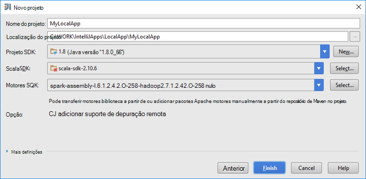

 <properties
    pageTitle="Criar aplicações de motores Scala utilizando ferramentas HDInsight no Azure Toolkit para IntelliJ | Microsoft Azure"
    description="Saiba como criar uma aplicação de motores para ser executada em motores de HDInsight clusters autónomo."
    services="hdinsight"
    documentationCenter=""
    authors="nitinme"
    manager="jhubbard"
    editor="cgronlun"
    tags="azure-portal"/>

<tags
    ms.service="hdinsight"
    ms.workload="big-data"
    ms.tgt_pltfrm="na"
    ms.devlang="na"
    ms.topic="article"
    ms.date="09/09/2016"
    ms.author="nitinme"/>

# Utilizar ferramentas de HDInsight no Azure Toolkit para IntelliJ para criar motores aplicações para cluster HDInsight motores Linux

Este artigo fornece orientações passo a passo sobre como desenvolver aplicações motores escritas Scala e submeter-o para uma motores HDInsight cluster utilizando ferramentas HDInsight no Azure Toolkit para IntelliJ.  Pode utilizar as ferramentas de algumas formas diferentes:

* Para desenvolver e submeter uma aplicação de motores de Scala num cluster motores de HDInsight
* Para aceder aos seus recursos de cluster Azure HDInsight motores
* Para desenvolver e executar uma aplicação de motores de Scala localmente

Também pode seguir um vídeo [aqui](https://mix.office.com/watch/1nqkqjt5xonza) para ajudar a começar.

>[AZURE.IMPORTANT] Esta ferramenta pode ser utilizada para criar e submeter aplicações apenas para um cluster de motores de HDInsight Linux.

##Pré-requisitos

* Uma subscrição do Azure. Consulte o artigo [obter Azure versão de avaliação gratuita](https://azure.microsoft.com/documentation/videos/get-azure-free-trial-for-testing-hadoop-in-hdinsight/).

* Um cluster de motores de Apache HDInsight Linux. Para obter instruções, consulte o artigo [Criar motores de Apache clusters no Azure HDInsight](hdinsight-apache-spark-jupyter-spark-sql.md).

* Kit de desenvolvimento Java Oracle. Pode instalá-lo a partir de [aqui](http://www.oracle.com/technetwork/java/javase/downloads/jdk8-downloads-2133151.html).

* IntelliJ IDEIA. Este artigo utiliza a versão 15.0.1. Pode instalá-lo a partir de [aqui](https://www.jetbrains.com/idea/download/).

## Instalar ferramentas HDInsight no Azure Toolkit para IntelliJ

HDInsight ferramentas para IntelliJ está disponível como parte do Toolkit de Azure para IntelliJ. Para obter instruções sobre como instalar o Toolkit de Azure, consulte o artigo [instalar o Toolkit de Azure para IntelliJ](../azure-toolkit-for-intellij-installation.md).

## Inicie sessão na sua subscrição do Azure

1. Inicie o IDE IntelliJ e abrir o Explorador de Azure. No menu **Ver** no IDE, clique em **Ferramenta Windows** e, em seguida, clique em **Azure Explorador**.

    

2. Com o botão direito no nó **Azure** no **Explorador do Azure**e, em seguida, clique em **Gerir subscrições**.

3. Na caixa de diálogo **Gerir subscrições** , clique em **Iniciar sessão** e introduza as suas credenciais Azure.

    

4. Depois de iniciou sessão, a caixa de diálogo **Gerir subscrições da** lista todas as subscrições Azure associadas com as credenciais. Clique em **Fechar** na caixa de diálogo.

5. No separador **Azure Explorer** , expanda **HDInsight** para ver os clusters de motores de HDInsight com a sua subscrição.

    

6. Pode ainda mais expandir um nó de nome de cluster para ver os recursos (por exemplo, contas de armazenamento) associados ao cluster.

    

## Executar uma aplicação de motores Scala num cluster motores de HDInsight

1. Inicie o IntelliJ IDEIA e criar um novo projeto. Na caixa de diálogo novo do projeto, efetuar as seguintes opções e, em seguida, clique em **seguinte**.

    

    * A partir do painel esquerdo, selecione **HDInsight**.
    * A partir do painel da direita, selecione **motores no HDInsight (Scala)**.
    * Clique em **seguinte**.

2. Na janela seguinte, forneça os detalhes do projeto.

    * Fornece um nome do projeto e uma localização de projeto.
    * **SDK do projeto**, certifique-se de que fornece uma versão de Java maior 7.
    * Para **Scala SDK**, clique em **Criar**, clique em **Transferir**e, em seguida, selecione a versão do Scala para utilizar. **Certifique-se de que não utilize versão 2.11.x**. Este exemplo utiliza a versão **2.10.6**.

        

    * Para **Motores SDK**, transferir e utilizar o SDK do [aqui](http://go.microsoft.com/fwlink/?LinkID=723585&clcid=0x409). Também pode ignorar este e utilizar o [repositório de motores Maven](http://mvnrepository.com/search?q=spark) em vez disso, no entanto Certifique-se de que tem o repositório de maven direita instalado para desenvolver aplicações motores. (Por exemplo, ter de se certificar de que tem a peça de transmissão de motores instalada se estiver a utilizar motores transmissão; Também fórum Certifique-se de que está a utilizar o repositório marcado como Scala 2.10 - não utilize o repositório marcado como Scala 2.11.)

        

    * Clique em **Concluir**.

3. O projeto de motores irá criar automaticamente um artifício por si. Para ver o artefacto, siga estes passos.

    1. No menu **ficheiro** , clique em **Estrutura de projeto**.
    2. Na caixa de diálogo **Estrutura do Project** , clique em **artefactos** para ver o artefacto predefinido que é criado.

        

    Também pode criar a sua própria artefacto bly clicando na **+** ícone, realçado na imagem acima.

4. Na caixa de diálogo **Estrutura do Project** , clique em **projeto**. Se o **Projeto SDK** estiver definido para 1.8, certifique-se o **nível de idioma do projeto** é definido como **7 - losangos, etc de várias captura, braço,**.

    

5. Adicione o código de origem da aplicação.

    1. A partir do **Project Explorer**, com o botão direito **src**, aponte para **Novo**e, em seguida, clique em **Scala classe**.

        

    2. Na caixa de diálogo **Criar nova classe Scala** , forneça um nome, para selecionar **objeto**da **tipo** e, em seguida, clique em **OK**.

        

    3. No ficheiro de **MyClusterApp.scala** , cole o código seguinte. Este código lê os dados a partir de HVAC.csv (disponível em todos os motores de HDInsight clusters), obtém as linhas que tenham um dígito apenas na coluna sétima de CSV e escreve a saída de **/HVACOut** no contentor de armazenamento predefinido para o cluster.

            import org.apache.spark.SparkConf
            import org.apache.spark.SparkContext

            object MyClusterApp{
              def main (arg: Array[String]): Unit = {
                val conf = new SparkConf().setAppName("MyClusterApp")
                val sc = new SparkContext(conf)

                val rdd = sc.textFile("wasbs:///HdiSamples/HdiSamples/SensorSampleData/hvac/HVAC.csv")

                //find the rows which have only one digit in the 7th column in the CSV
                val rdd1 =  rdd.filter(s => s.split(",")(6).length() == 1)

                rdd1.saveAsTextFile("wasbs:///HVACOut")
              }

            }

5. Execute a aplicação num cluster motores HDInsight.

    1. A partir do **Project Explorer**, o nome do projeto com o botão direito e, em seguida, selecione **Submeter aplicação motores ao HDInsight**.

        

    2. Vai ser-lhe para introduzir as credenciais de subscrição Azure. Na caixa de diálogo **Motores submissão** , forneça os seguintes valores.

        * Para **clusters de motores (apenas Linux)**, selecione o cluster de motores de HDInsight no qual pretende executar a sua aplicação.

        * Precisa de selecionar um artifício do projeto IntelliJ ou selecione um partir do disco rígido.

        * Relativamente a caixa de texto **nome de classe principal** , clique nas reticências ( ), selecione a classe principal no código de origem da aplicação e, em seguida, clique em **OK**.

            

        * Uma vez que o código da aplicação neste exemplo não requer quaisquer argumentos de linha de comandos ou referenciar jarros ou ficheiros, pode deixar as restantes caixas de texto vazia.

        * Depois de fornecer todas as entradas, a caixa de diálogo deverá ser semelhante ao seguinte.

            

        * Clique em **Submeter**.

    3. No separador **Apresentação de motores** na parte inferior da janela do deverá começar a apresentar o progresso. Também pode deixar a aplicação ao clicar no botão vermelho na janela do "Motores submissão".

        

    Na secção seguinte, saiba como pode aceder ao trabalho com as ferramentas de HDInsight no Azure Toolkit para IntelliJ de saída.

## Aceder e gerir os motores de HDInsight clusters utilizando as ferramentas de HDInsight no Azure Toolkit para IntelliJ

Pode executar uma variedade de operações utilizando as ferramentas de HDInsight que fazem parte do Azure Toolkit para IntelliJ.

### Aceder à vista de tarefa diretamente a partir das ferramentas do HDInsight

1. A partir do **Azure Explorer**, expanda **HDInsight**, expanda o nome do cluster motores e, em seguida, clique em **tarefas**.

2. No painel direito, no separador **Ver do motores tarefa** apresenta todas as aplicações que foram abertas no cluster. Clique no nome da aplicação para o qual pretende ver mais detalhes.

    

3. As caixas de **Mensagem de erro**, **Tarefa de saída**, **Registos de tarefa Lívio**e **Motores controlador de registos** são preenchidas com base na aplicação que selecionar.

4. Também pode abrir os **Motores histórico IU** e a **IU FIO** (ao nível da aplicação) ao clicar nos respetivos botões na parte superior do ecrã.

### Aceder ao servidor do histórico de motores

1. A partir do **Azure Explorer**, expanda **HDInsight**, o nome de cluster motores com o botão direito e, em seguida, selecione **Abrir motores histórico IU**. Quando lhe for pedido, introduza as credenciais de administrador para o cluster. Tem de especificar estes elementos durante o cluster de aprovisionamento.

2. No dashboard do servidor de histórico de motores, pode procurar a aplicação apenas terminado a executar o utilizando o nome da aplicação. No código, defina o nome de aplicação utilizando `val conf = new SparkConf().setAppName("MyClusterApp")`. Por conseguinte, o nome da aplicação motores foi **MyClusterApp**.

### Iniciar o portal de Ambari

A partir do **Azure Explorer**, expanda **HDInsight**, o nome de cluster motores com o botão direito e, em seguida, selecione **Abrir Portal de gestão de Cluster (Ambari)**. Quando lhe for pedido, introduza as credenciais de administrador para o cluster. Tem de especificar estes elementos durante o cluster de aprovisionamento.

### Gerir subscrições do Azure

Por predefinição, as ferramentas de HDInsight lista os clusters de motores de todas as subscrições Azure. Se necessário, pode especificar as subscrições para a qual pretende aceder ao cluster. A partir do **Azure Explorer**, com o botão direito do nó de raiz do **Azure** e, em seguida, clique em **Gerir subscrições**. Na caixa de diálogo, desmarque as caixas de verificação contra a subscrição que não pretende aceder a e, em seguida, clique em **Fechar**. Também pode clicar em **Terminar sessão** se pretender terminar sessão da sua subscrição Azure.

## Executar uma aplicação de motores Scala localmente

Pode utilizar as ferramentas de HDInsight no Azure Toolkit para IntelliJ para executar aplicações de motores Scala localmente no seu estação de trabalho. Normalmente, estas aplicações não precisa de aceder a recursos do cluster tal como o contentor de armazenamento e pode ser executar e testadas localmente.

### Pré-requisito

Ao executar a aplicação de motores Scala local num computador Windows, poderá receber uma exceção como é explicado em [motores 2356](https://issues.apache.org/jira/browse/SPARK-2356) que ocorre devido a um WinUtils.exe em falta no Windows. Para contornar este erro, tem de [Transferir o ficheiro executável a partir daqui](http://public-repo-1.hortonworks.com/hdp-win-alpha/winutils.exe) para uma localização como **C:\WinUtils\bin**. Em seguida, tem de adicionar uma variável de ambiente **HADOOP_HOME** e defina o valor da variável para **C\WinUtils**.

### Executar uma aplicação de motores Scala local  

1. Inicie o IntelliJ IDEIA e criar um novo projeto. Na caixa de diálogo novo do projeto, efetuar as seguintes opções e, em seguida, clique em **seguinte**.

    

    * A partir do painel esquerdo, selecione **HDInsight**.
    * A partir do painel da direita, selecione **motores HDInsight Local executar amostra (Scala)**.
    * Clique em **seguinte**.

2. Na janela seguinte, forneça os detalhes do projeto.

    * Fornece um nome do projeto e uma localização de projeto.
    * **SDK do projeto**, certifique-se de que fornece uma versão de Java maior 7.
    * Para **Scala SDK**, clique em **Criar**, clique em **Transferir**e, em seguida, selecione a versão do Scala para utilizar. **Certifique-se de que não utilize versão 2.11.x**. Este exemplo utiliza a versão **2.10.6**.

        

    * Para **Motores SDK**, transferir e utilizar o SDK do [aqui](http://go.microsoft.com/fwlink/?LinkID=723585&clcid=0x409). Também pode ignorar este e utilizar o [repositório de motores Maven](http://mvnrepository.com/search?q=spark) em vez disso, no entanto Certifique-se de que tem o repositório de maven direita instalado para desenvolver aplicações motores. (Por exemplo, ter de se certificar de que tem a peça de transmissão de motores instalada se estiver a utilizar motores transmissão; Também fórum Certifique-se de que está a utilizar o repositório marcado como Scala 2.10 - não utilize o repositório marcado como Scala 2.11.)

        

    * Clique em **Concluir**.

3. O modelo adiciona um código de exemplo (**LogQuery**) na pasta **src** que pode executar localmente no seu computador.

    

4.  Clique com o botão direito do rato sobre a aplicação **LogQuery** e, em seguida, clique em **"Executar 'LogQuery'"**. Irá ver um resultado seguinte na caixa de diálogo **Executar** na parte inferior.

    

## Converter existentes IntelliJ IDEIA aplicações para utilizar as ferramentas de HDInsight no Azure Toolkit para IntelliJ

Também pode converter as aplicações de motores Scala existentes criadas no IntelliJ IDEIA ser compatível com as ferramentas de HDInsight no Azure Toolkit para IntelliJ. Isto permite-lhe utilizar a ferramenta para submeter as aplicações a um cluster de motores de HDInsight. Pode fazê-lo executando os seguintes passos:

1. Para um existente motores Scala appliction criada utilizando IntelliJ IDEIA, abra o ficheiro .iml associado.
2. No nível de raiz, irá ver um elemento de **módulo** da seguinte forma:

        <module org.jetbrains.idea.maven.project.MavenProjectsManager.isMavenModule="true" type="JAVA_MODULE" version="4">

3. Editar o elemento para adicionar `UniqueKey="HDInsightTool"` para que o elemento de **módulo** aspeto semelhante ao seguinte:

        <module org.jetbrains.idea.maven.project.MavenProjectsManager.isMavenModule="true" type="JAVA_MODULE" version="4" UniqueKey="HDInsightTool">

4. Guarde as alterações. A aplicação deverá agora estar compatível com as ferramentas de HDInsight no Azure Toolkit para IntelliJ. Pode testar o seguinte clicando no nome do projeto no Project Explorer. No menu de pop-up deverá agora tem a opção a **Aplicação de motores submeter para HDInsight**.

## Resolução de problemas

### "Utilize um tamanho da pilha maior" erro no local executar

No motores 1.6, se estiver a utilizar um SDK Java de 32 bits durante local executare, que poderá encontrar os seguintes erros:

    Exception in thread "main" java.lang.IllegalArgumentException: System memory 259522560 must be at least 4.718592E8. Please use a larger heap size.
        at org.apache.spark.memory.UnifiedMemoryManager$.getMaxMemory(UnifiedMemoryManager.scala:193)
        at org.apache.spark.memory.UnifiedMemoryManager$.apply(UnifiedMemoryManager.scala:175)
        at org.apache.spark.SparkEnv$.create(SparkEnv.scala:354)
        at org.apache.spark.SparkEnv$.createDriverEnv(SparkEnv.scala:193)
        at org.apache.spark.SparkContext.createSparkEnv(SparkContext.scala:288)
        at org.apache.spark.SparkContext.<init>(SparkContext.scala:457)
        at LogQuery$.main(LogQuery.scala:53)
        at LogQuery.main(LogQuery.scala)
        at sun.reflect.NativeMethodAccessorImpl.invoke0(Native Method)
        at sun.reflect.NativeMethodAccessorImpl.invoke(NativeMethodAccessorImpl.java:57)
        at sun.reflect.DelegatingMethodAccessorImpl.invoke(DelegatingMethodAccessorImpl.java:43)
        at java.lang.reflect.Method.invoke(Method.java:606)
        at com.intellij.rt.execution.application.AppMain.main(AppMain.java:144)

Isto acontece porque o tamanho da pilha não é suficiente para motores executar, uma vez que motores requer um mínimo 471MB (pode obter mais detalhes do [motores 12081](https://issues.apache.org/jira/browse/SPARK-12081) se pretender). Uma solução simples é utilizar um SDK Java de 64 bits. Também pode alterar as definições de JVM no IntelliJ adicionando as seguintes opções:

    -Xms128m -Xmx512m -XX:MaxPermSize=300m -ea

## Problemas de comentários e conhecidos

Ver atualmente motores exporta directamente não é suportada e estamos a trabalhar no que.

Se tiver qualquer sugestões ou respostas ou se encontrar algum problema ao utilizar esta ferramenta, à vontade para largue-numa mensagem de e-mail na hdivstool no microsoft ponto com.

## Consulte também

* [Descrição geral: Apache motores no Azure HDInsight](hdinsight-apache-spark-overview.md)

### Cenários

* [Motores com BI: efetuar uma análise de dados interativos utilizando motores no HDInsight com ferramentas de BI](hdinsight-apache-spark-use-bi-tools.md)

* [Motores com máquina formação: utilizar motores no HDInsight para analisar temperatura edifício utilizando dados de AVAC](hdinsight-apache-spark-ipython-notebook-machine-learning.md)

* [Motores com máquina formação: utilizar motores no HDInsight para prever resultados da inspeção de alimentação](hdinsight-apache-spark-machine-learning-mllib-ipython.md)

* [Transmissão de motores: Motores de utilização no HDInsight para criar aplicações de transmissão em tempo real](hdinsight-apache-spark-eventhub-streaming.md)

* [Análise de registo de Web site utilizando motores no HDInsight](hdinsight-apache-spark-custom-library-website-log-analysis.md)

### Criar e executar as aplicações

* [Criar uma aplicação autónoma Scala](hdinsight-apache-spark-create-standalone-application.md)

* [Executar tarefas remotamente num cluster de motores utilizando Lívio](hdinsight-apache-spark-livy-rest-interface.md)

### Ferramentas e extensões

* [Utilizar ferramentas de HDInsight no Azure Toolkit para IntelliJ depurar gerar aplicações remotamente](hdinsight-apache-spark-intellij-tool-plugin-debug-jobs-remotely.md)

* [Utilizar ferramentas de HDInsight no Azure Toolkit para Eclipse para criar motores aplicações](hdinsight-apache-spark-eclipse-tool-plugin.md)

* [Utilizar blocos de notas Zeppelin com um cluster de motores num HDInsight](hdinsight-apache-spark-use-zeppelin-notebook.md)

* [Kernels disponíveis para o bloco de notas Jupyter num cluster de motores para HDInsight](hdinsight-apache-spark-jupyter-notebook-kernels.md)

* [Utilizar os pacotes externos com Jupyter blocos de notas](hdinsight-apache-spark-jupyter-notebook-use-external-packages.md)

* [Instalar Jupyter no seu computador e ligar a um cluster de motores de HDInsight](hdinsight-apache-spark-jupyter-notebook-install-locally.md)

### Adicionar e utilizar recursos

* [Gerir os recursos para o cluster de motores de Apache no Azure HDInsight](hdinsight-apache-spark-resource-manager.md)

* [Controlar e depuração tarefas em execução num cluster de motores de Apache HDInsight](hdinsight-apache-spark-job-debugging.md)
