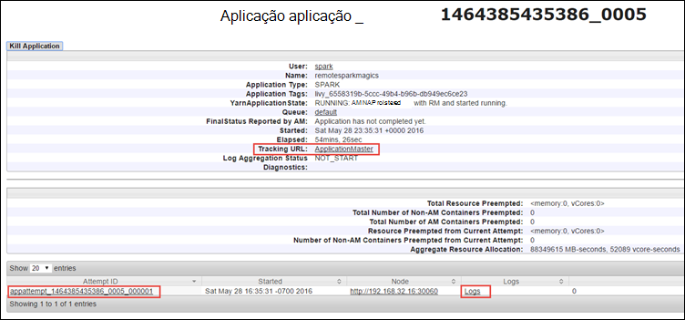

<properties 
    pageTitle="Controlar e depuração tarefas em execução no Apache motores de cluster no HDInsight | Microsoft Azure" 
    description="Utilizar FIO IU, motores IU e histórico de motores server para controlar e depurar tarefas em execução num cluster de motores no Azure HDInsight" 
    services="hdinsight" 
    documentationCenter="" 
    authors="nitinme" 
    manager="jhubbard" 
    editor="cgronlun"
    tags="azure-portal"/>

<tags 
    ms.service="hdinsight" 
    ms.workload="big-data" 
    ms.tgt_pltfrm="na" 
    ms.devlang="na" 
    ms.topic="article" 
    ms.date="08/25/2016" 
    ms.author="nitinme"/>

# Controlar e depuração tarefas em execução num cluster de motores de Apache no HDInsight Linux

Este artigo vai aprender controlar e depurar trabalhos de motores utilizando a IU FIO, motores IU e o servidor de histórico de motores. Este artigo, podemos comecem a uma tarefa de motores utilizando um bloco de notas disponível com o cluster de motores **formação de máquina: aspeto do Office análises de dados de inspeção de alimentação utilizando MLLib**. Pode utilizar os passos abaixo para controlar uma aplicação que que utilizou ao submeter utilizando qualquer outra abordagem, assim, por exemplo, **Submeter motores**.

##Pré-requisitos

Tem de ter o seguinte procedimento:

- Uma subscrição do Azure. Consulte o artigo [obter Azure versão de avaliação gratuita](https://azure.microsoft.com/documentation/videos/get-azure-free-trial-for-testing-hadoop-in-hdinsight/).
- Um cluster de motores de Apache HDInsight Linux. Para obter instruções, consulte o artigo [Criar motores de Apache clusters no Azure HDInsight](hdinsight-apache-spark-jupyter-spark-sql.md).
- Deverá ter começou a executar o bloco de notas, **[formação de máquina: análise de previsão nos dados de inspeção de alimentação através do MLLib](hdinsight-apache-spark-machine-learning-mllib-ipython.md)**. Para obter instruções sobre como executar este bloco de notas, siga a hiperligação.  

## Controlar uma aplicação na IU do FIO

1. Inicie a IU FIO. Pá cluster, clique em **Cluster Dashboard**e, em seguida, clique em **FIO**.

    

    >[AZURE.TIP] Em alternativa, também pode iniciar o FIO IU na IU Ambari. Para iniciar a IU Ambari, a partir do pá cluster, clique em **Cluster Dashboard**e, em seguida, clique em **Dashboard de Cluster HDInsight**. IU Ambari, clique em **FIO**, clique em **Ligações rápidas**, clique no Gestor de recursos ativo e, em seguida, clique em **ResourceManager IU**.  

3. Uma vez que começou a tarefa de motores utilizando Jupyter blocos de notas, a aplicação tem o nome **remotesparkmagics** (este é o nome para todas as aplicações que são iniciados a partir dos blocos de notas). Clique no ID da aplicação contra o nome da aplicação para obter mais informações sobre a tarefa. Isto inicia a vista de aplicação.

    

    Para tais aplicações que são for iniciado com os blocos de notas Jupyter, o estado é sempre **a executar** até sair do bloco de notas.

4. A partir da vista de aplicação, pode desagregar na sequência descobrir os contentores associados com a aplicação e os registos de início (stdout/stderr). Também pode iniciar o IU motores ao clicar na ligação correspondente para o **URL de controlo**, conforme apresentado abaixo. 

    

## Controlar uma aplicação na IU motores

Na IU motores, pode desagregar para as tarefas de motores são geradas pela aplicação que começou a escrever anteriormente.

1. Para iniciar a IU motores, a partir da vista de aplicação, clique na ligação contra o **URL de controlo**, conforme apresentado na captura de ecrã acima. Pode ver todas as tarefas de motores que são iniciadas através da aplicação em execução no bloco de notas Jupyter.

    

2. Clique no separador **testamenteiros** para ver as informações de processamento e armazenamento de cada executor. Também pode obter a pilha de chamadas ao clicar na ligação **Do tópico de falha de sistema** .

    
 
3. Clique no separador de **fases** para ver as fases associadas à aplicação.

    

    Cada fase pode ter várias tarefas para os quais pode ver as estatísticas de execução, tal como mostrado abaixo.

     

4. A partir da página de detalhes da fase, pode iniciar o Comprimentos visualização. Expanda uma ligação de **Visualização de Comprimentos** na parte superior da página, conforme apresentado abaixo.

    

    Comprimentos ou direta Aclyic Graph representa diferentes fases na aplicação. Cada caixa azul no gráfico representa uma operação de motores chamada a partir da aplicação.

5. A partir da página de detalhes da fase, também pode iniciar a vista de linha cronológica de aplicação. Expanda uma ligação de **Linha cronológica de eventos** na parte superior da página, conforme apresentado abaixo.

    

    Isto apresenta os eventos de motores sob a forma de uma linha cronológica. A vista de linha cronológica está disponível em três níveis, através de tarefas, dentro de uma tarefa e dentro de uma fase. A vista de linha cronológica para uma determinada fase para capturar a imagem acima.

    >[AZURE.TIP] Se selecionar a caixa de verificação **Ativar o zoom** , pode percorrer até esquerda e direita na vista de linha cronológica.

6. Outros separadores na IU motores fornecem informações úteis sobre instância do motores.

    * Separador de armazenamento - se a sua aplicação cria uma RDDs, pode encontrar informações sobre como aqueles no separador armazenamento.
    * Separador ambiente - este separador fornece muitas informações úteis sobre a instância de motores tais como a 
        * Versão scala
        * Diretório de registo de eventos associado ao cluster
        * Número de núcleos executor para a aplicação
        * Etc.

## Encontrar informações sobre as tarefas concluídas utilizando o servidor de histórico de motores

Assim que uma tarefa é concluída, as informações sobre a tarefa são mantidas no servidor motores histórico.

1. Para iniciar o servidor de histórico de motores, a partir do pá cluster, clique em **Cluster Dashboard**e, em seguida, clique em **Motores histórico de servidor**.

    

    >[AZURE.TIP] Em alternativa, também pode iniciar o IU do servidor de histórico de motores de IU Ambari. Para iniciar a IU Ambari, a partir do pá cluster, clique em **Cluster Dashboard**e, em seguida, clique em **Dashboard de Cluster HDInsight**. IU Ambari, clique em **motores**, clique em **Ligações rápidas**e, em seguida, clique em **Motores histórico servidor IU**.

2. Irá ver todas as aplicações concluídas listadas. Clique num ID da aplicação para desagregar uma aplicação para obter mais informações.

    
    

## Consulte também

* [Descrição geral: Apache motores no Azure HDInsight](hdinsight-apache-spark-overview.md)

### Cenários

* [Motores com BI: efetuar uma análise de dados interativos utilizando motores no HDInsight com ferramentas de BI](hdinsight-apache-spark-use-bi-tools.md)

* [Motores com máquina formação: utilizar motores no HDInsight para analisar temperatura edifício utilizando dados de AVAC](hdinsight-apache-spark-ipython-notebook-machine-learning.md)

* [Motores com máquina formação: utilizar motores no HDInsight para prever resultados da inspeção de alimentação](hdinsight-apache-spark-machine-learning-mllib-ipython.md)

* [Transmissão de motores: Motores de utilização no HDInsight para criar aplicações de transmissão em tempo real](hdinsight-apache-spark-eventhub-streaming.md)

* [Análise de registo de Web site utilizando motores no HDInsight](hdinsight-apache-spark-custom-library-website-log-analysis.md)

### Criar e executar as aplicações

* [Criar uma aplicação autónoma Scala](hdinsight-apache-spark-create-standalone-application.md)

* [Executar tarefas remotamente num cluster de motores utilizando Lívio](hdinsight-apache-spark-livy-rest-interface.md)

### Ferramentas e extensões

* [Utilize o plug-in do HDInsight ferramentas para obter IntelliJ IDEIA para criar e submeter motores Scala aplicações](hdinsight-apache-spark-intellij-tool-plugin.md)

* [Utilizar o plug-in do HDInsight ferramentas para obter IntelliJ IDEIA para depurar as aplicações de motores remotamente](hdinsight-apache-spark-intellij-tool-plugin-debug-jobs-remotely.md)

* [Utilizar blocos de notas Zeppelin com um cluster de motores num HDInsight](hdinsight-apache-spark-use-zeppelin-notebook.md)

* [Kernels disponíveis para o bloco de notas Jupyter num cluster de motores para HDInsight](hdinsight-apache-spark-jupyter-notebook-kernels.md)

* [Utilizar os pacotes externos com Jupyter blocos de notas](hdinsight-apache-spark-jupyter-notebook-use-external-packages.md)

* [Instalar Jupyter no seu computador e ligar a um cluster de motores de HDInsight](hdinsight-apache-spark-jupyter-notebook-install-locally.md)

### Adicionar e utilizar recursos

* [Gerir os recursos para o cluster de motores de Apache no Azure HDInsight](hdinsight-apache-spark-resource-manager.md)
