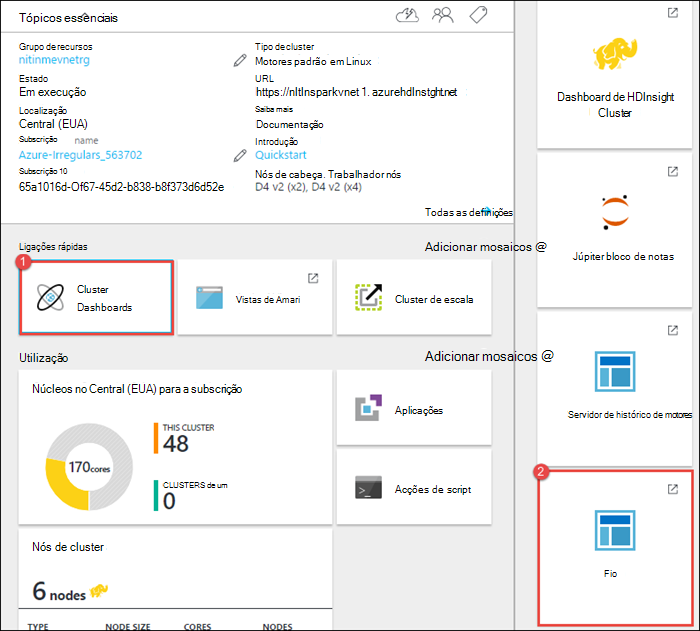
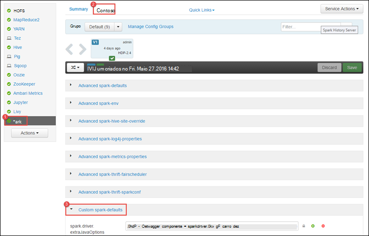
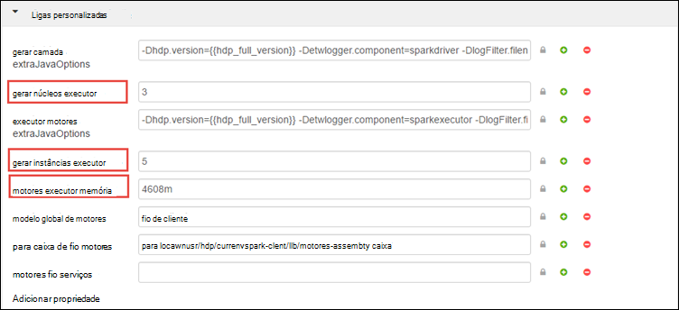
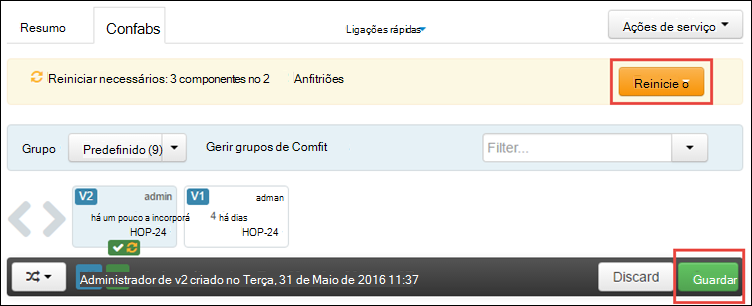
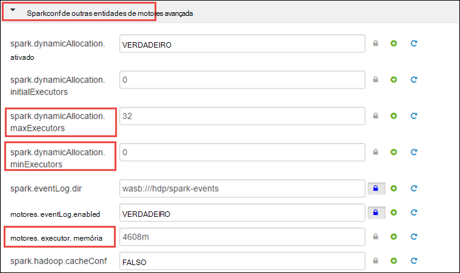
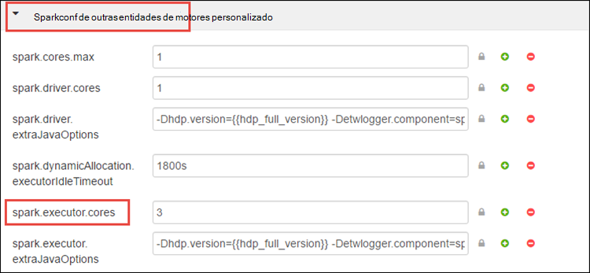
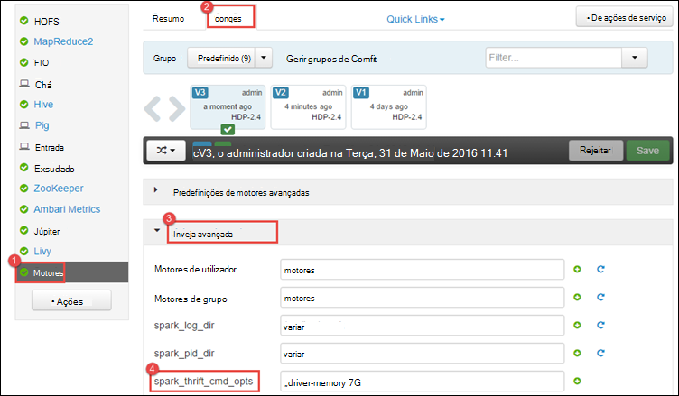
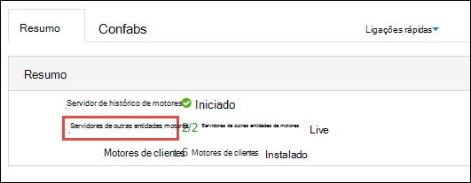
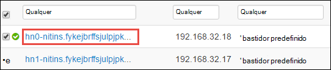
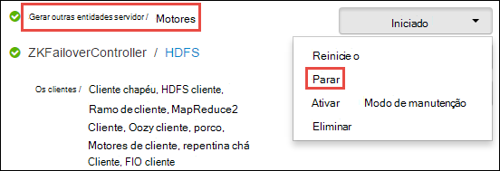

<properties 
    pageTitle="Utilizar o Gestor de recursos para atribuir recursos para o cluster de motores de Apache da HDInsight | Microsoft Azure" 
    description="Saiba como utilizar o Gestor de recursos para clusters de motores HDInsight para um melhor desempenho." 
    services="hdinsight" 
    documentationCenter="" 
    authors="nitinme" 
    manager="jhubbard" 
    editor="cgronlun"
    tags="azure-portal"/>

<tags 
    ms.service="hdinsight" 
    ms.workload="big-data" 
    ms.tgt_pltfrm="na" 
    ms.devlang="na" 
    ms.topic="article" 
    ms.date="08/25/2016" 
    ms.author="nitinme"/>

# Gerir os recursos para o cluster de motores de Apache no HDInsight Linux

Neste artigo vai aprender a aceder interfaces como Ambari IU, FIO IU, e o servidor de histórico de motores associados com o seu cluster de motores. Também irá obter informações sobre como para a configuração do cluster para um desempenho ideal o gráfico.

**Pré-requisitos:**

Tem de ter o seguinte procedimento:

- Uma subscrição do Azure. Consulte o artigo [obter Azure versão de avaliação gratuita](https://azure.microsoft.com/documentation/videos/get-azure-free-trial-for-testing-hadoop-in-hdinsight/).
- Um cluster de motores de Apache HDInsight Linux. Para obter instruções, consulte o artigo [Criar motores de Apache clusters no Azure HDInsight](hdinsight-apache-spark-jupyter-spark-sql.md).

## Como posso iniciação IU Ambari Web?

1. A partir do [Portal do Azure](https://portal.azure.com/), a partir do startboard, clique no mosaico do seu cluster de motores (se afixados-lo para a startboard). Também pode navegar para o seu cluster em **Procurar tudo** > **HDInsight Clusters**. 
 
2. Pá de cluster motores, clique em **Dashboard**. Quando lhe for pedido, introduza as credenciais de administrador para o cluster de motores.

    ![Iniciação Ambari] (./media/hdinsight-apache-spark-resource-manager/hdispark.cluster.launch.dashboard.png "Iniciar o Gestor de recursos")

3. Isto deve iniciação IU de Web Ambari, conforme apresentado abaixo.

    ![Ambari Web IU] (./media/hdinsight-apache-spark-resource-manager/ambari-web-ui.png "Ambari Web IU")   

## Como iniciar o servidor de histórico de motores?

1. A partir do [Portal do Azure](https://portal.azure.com/), a partir do startboard, clique no mosaico do seu cluster de motores (se afixados-lo para a startboard).

2. Pá cluster, em **Ligações rápidas**, clique em **Cluster Dashboard**. Na pá **Cluster de Dashboard** , clique em **Motores histórico de servidor**.

    ![Servidor de histórico de motores] (./media/hdinsight-apache-spark-resource-manager/launch-history-server.png "Servidor de histórico de motores")

    Quando lhe for pedido, introduza as credenciais de administrador para o cluster de motores.

## Como posso iniciar a IU de fio?

Pode utilizar a IU FIO para monitorizar aplicações atualmente em execução no cluster motores. 

1. Pá cluster, clique em **Cluster Dashboard**e, em seguida, clique em **FIO**.

    

    >[AZURE.TIP] Em alternativa, também pode iniciar o FIO IU na IU Ambari. Para iniciar a IU Ambari, a partir do pá cluster, clique em **Cluster Dashboard**e, em seguida, clique em **Dashboard de Cluster HDInsight**. IU Ambari, clique em **FIO**, clique em **Ligações rápidas**, clique no Gestor de recursos ativo e, em seguida, clique em **ResourceManager IU**.

## O que é a configuração do cluster ideal para executar motores aplicações?

Os três parâmetros chave que podem ser utilizados para a configuração de motores dependendo requisitos da aplicação estão `spark.executor.instances`, `spark.executor.cores`, e `spark.executor.memory`. Um Executor é um processo iniciado para uma aplicação de motores. -É executada no nó do trabalho e é responsável para realizar as tarefas para a aplicação. O número predefinido de testamenteiros executor tamanhos e de cada cluster é calculado com base no número de nós de trabalho e o tamanho de nó de trabalho. Estas são armazenadas no `spark-defaults.conf` em nós de cabeça cluster. 

Os parâmetros de configuração de três podem ser configurados ao nível do cluster (para todas as aplicações que são executados no cluster) ou podem ser especificados para cada aplicação de individual.

### Alterar os parâmetros de utilizando Ambari IU

1. IU de Ambari clique em **motores**, clique em **Configs**e, em seguida, expanda **predefinições de motores personalizada**.

    

2. Os valores predefinidos são boas ter motores 4 aplicações ser executados em simultâneo no cluster. Pode alterações estes valores a partir da interface de utilizador, conforme apresentado abaixo.

    

3. Clique em **Guardar** para guardar as alterações à configuração. Na parte superior da página, vai ser-lhe para reiniciar a todos os serviços afetados. Clique em **reiniciar**.

    

### Alterar os parâmetros de uma aplicação a ser executada em Jupyter bloco de notas

Aplicações que são executadas no bloco de notas Jupyter, pode utilizar o `%%configure` mágico para fazer as alterações de configuração. Idealmente, terá de fazer estas alterações no início da aplicação, antes de executar a sua primeira célula de código. Este procedimento garante que a configuração está aplicada à sessão Lívio, quando é criado. Se quiser alterar a configuração numa fase posterior na aplicação, tem de utilizar o `-f` parâmetro. No entanto, por fazê-lo progresso de todas as na aplicação serão perdido.

O fragmento de abaixo mostra como alterar a configuração de uma aplicação a ser executada em Jupyter.

    %%configure 
    {"executorMemory": "3072M", "executorCores": 4, “numExecutors”:10}

Parâmetros de configuração tem de ser transmitidos no como uma cadeia JSON e tem de estar ligado a linha seguinte após a magia, conforme apresentado na coluna de exemplo. 

### Alterar os parâmetros de uma aplicação submetidos utilizando motores-submeter

Comando a seguir é um exemplo de como alterar os parâmetros de configuração para uma aplicação do lote que seja apresentado utilizando `spark-submit`.

    spark-submit --class <the application class to execute> --executor-memory 3072M --executor-cores 4 –-num-executors 10 <location of application jar file> <application parameters>

### Alterar os parâmetros de uma aplicação submetidos utilizando o laço

Comando a seguir é um exemplo de como alterar os parâmetros de configuração para uma aplicação do lote que seja apresentado utilizando Laço.

    curl -k -v -H 'Content-Type: application/json' -X POST -d '{"file":"<location of application jar file>", "className":"<the application class to execute>", "args":[<application parameters>], "numExecutors":10, "executorMemory":"2G", "executorCores":5' localhost:8998/batches

### Como posso alterar estes parâmetros num servidor outras entidades motores?

Servidor de outras entidades de motores fornece JDBC/ODBC acesso a um cluster de motores e é utilizado para consultas de SQL de motores de serviço. Ferramentas de como o Power BI, etc do quadro. Utilize o protocolo ODBC para comunicar com o servidor de outras entidades motores para executar consultas de SQL motores como uma aplicação de motores. Quando é criado um cluster de motores, são iniciadas duas instâncias do servidor de outras entidades motores, um em cada nó cabeça. Cada servidor de outras entidades motores está visível como uma aplicação de motores na IU do FIO. 

Servidor de outras entidades de motores utiliza motores executor dinâmicas de alocação e, consequentemente, o `spark.executor.instances` não é utilizada. Em vez disso, o servidor de outras entidades de motores utiliza `spark.dynamicAllocation.minExecutors` e `spark.dynamicAllocation.maxExecutors` para especificar a contagem de executor. Os parâmetros de configuração `spark.executor.cores` e `spark.executor.memory` é utilizado para modificar o tamanho de executor. Pode alterar estes parâmetros conforme apresentado abaixo.

* Expanda a categoria **sparkconf de outras entidades de motores avançada** para atualizar os parâmetros `spark.dynamicAllocation.minExecutors`, `spark.dynamicAllocation.maxExecutors`, e `spark.executor.memory`.

     

* Expanda a categoria **personalizada motores-outras entidades-sparkconf** para atualizar o parâmetro `spark.executor.cores`.

    

### Como posso alterar a memória controlador do servidor de outras entidades motores?

Memória do controlador de servidor de outras entidades de motores está configurado para 25% do tamanho de RAM nó cabeça, desde que o tamanho de RAM total do nó cabeça for maior do que 14GB. Pode utilizar a IU Ambari para alterar a configuração da memória controlador, conforme apresentado abaixo.

* IU Ambari clique em **motores**, clique em **Configs**, expanda **Avançadas motores envelope**e, em seguida, fornecer o valor para **spark_thrift_cmd_opts**.

    

## Posso não utilize BI com cluster de motores. Como posso colocar os recursos novamente?

Dado que utilizamos atribuição dinâmica motores, os únicos recursos são consumidos pelo servidor de outras entidades são os recursos para os modelos globais de duas aplicações. Para recuperar estes recursos tem de parar os serviços de servidor de outras entidades em execução no cluster.

1. IU Ambari, a partir do painel esquerdo, clique em **motores**.

2. Na página seguinte, clique em **Servidores de outras entidades motores**.

    

3. Deverá ver os dois headnodes no qual o servidor de outras entidades motores está a ser executado. Clique da headnodes.

    

4. A página seguinte apresenta todos os serviços em execução nesse headnode. A partir da lista clique no botão pendente junto ao servidor de outras entidades motores e, em seguida, clique em **Parar**.

    

5. Repita estes passos na outros headnode também.

## Meus blocos de notas Jupyter não estão a executar conforme esperado. Como posso reinicie o serviço?

1. Inicie a IU da Web de Ambari conforme mostrado acima. A partir do painel de navegação esquerdo, clique em **Jupyter**, clique em **Ações do serviço**e, em seguida, clique em **Reiniciar tudo**. Isto irá iniciar o serviço de Jupyter em todas as headnodes.

    ![Reinicie o Jupyter] (./media/hdinsight-apache-spark-resource-manager/restart-jupyter.png "Reinicie o Jupyter")

    

## Consulte também

* [Descrição geral: Apache motores no Azure HDInsight](hdinsight-apache-spark-overview.md)

### Cenários

* [Motores com BI: efetuar uma análise de dados interativos utilizando motores no HDInsight com ferramentas de BI](hdinsight-apache-spark-use-bi-tools.md)

* [Motores com máquina formação: utilizar motores no HDInsight para analisar temperatura edifício utilizando dados de AVAC](hdinsight-apache-spark-ipython-notebook-machine-learning.md)

* [Motores com máquina formação: utilizar motores no HDInsight para prever resultados da inspeção de alimentação](hdinsight-apache-spark-machine-learning-mllib-ipython.md)

* [Transmissão de motores: Motores de utilização no HDInsight para criar aplicações de transmissão em tempo real](hdinsight-apache-spark-eventhub-streaming.md)

* [Análise de registo de Web site utilizando motores no HDInsight](hdinsight-apache-spark-custom-library-website-log-analysis.md)

### Criar e executar as aplicações

* [Criar uma aplicação autónoma Scala](hdinsight-apache-spark-create-standalone-application.md)

* [Executar tarefas remotamente num cluster de motores utilizando Lívio](hdinsight-apache-spark-livy-rest-interface.md)

### Ferramentas e extensões

* [Utilize o plug-in do HDInsight ferramentas para obter IntelliJ IDEIA para criar e submeter motores Scala aplicações](hdinsight-apache-spark-intellij-tool-plugin.md)

* [Utilizar o plug-in do HDInsight ferramentas para obter IntelliJ IDEIA para depurar as aplicações de motores remotamente](hdinsight-apache-spark-intellij-tool-plugin-debug-jobs-remotely.md)

* [Utilizar blocos de notas Zeppelin com um cluster de motores num HDInsight](hdinsight-apache-spark-use-zeppelin-notebook.md)

* [Kernels disponíveis para o bloco de notas Jupyter num cluster de motores para HDInsight](hdinsight-apache-spark-jupyter-notebook-kernels.md)

* [Utilizar os pacotes externos com Jupyter blocos de notas](hdinsight-apache-spark-jupyter-notebook-use-external-packages.md)

* [Instalar Jupyter no seu computador e ligar a um cluster de motores de HDInsight](hdinsight-apache-spark-jupyter-notebook-install-locally.md)

### Adicionar e utilizar recursos

* [Controlar e depuração tarefas em execução num cluster de motores de Apache HDInsight](hdinsight-apache-spark-job-debugging.md)

[hdinsight-versions]: hdinsight-component-versioning.md
[hdinsight-upload-data]: hdinsight-upload-data.md
[hdinsight-storage]: hdinsight-hadoop-use-blob-storage.md

[azure-purchase-options]: http://azure.microsoft.com/pricing/purchase-options/
[azure-member-offers]: http://azure.microsoft.com/pricing/member-offers/
[azure-free-trial]: http://azure.microsoft.com/pricing/free-trial/
[azure-management-portal]: https://manage.windowsazure.com/
[azure-create-storageaccount]: storage-create-storage-account.md 
